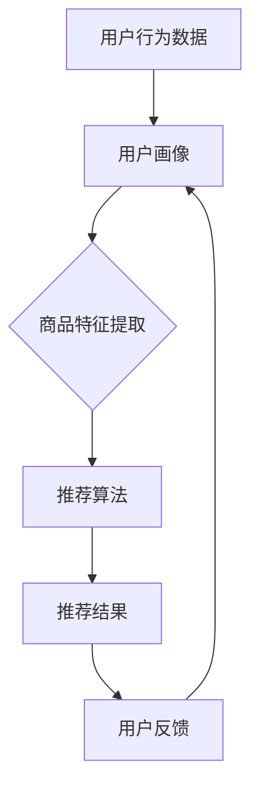

                 

关键词：AI大模型、电商搜索推荐、技术创新、知识分享机制

## 摘要

随着人工智能技术的飞速发展，尤其是大模型的广泛应用，电商搜索推荐系统迎来了新的发展机遇。本文从AI大模型的视角出发，探讨电商搜索推荐系统中的技术创新，并设计了一套知识分享机制，旨在提升推荐系统的智能化水平，提高用户满意度。文章首先概述了AI大模型在电商搜索推荐中的应用背景，然后深入分析了核心概念与联系，介绍了核心算法原理与具体操作步骤，随后详细讲解了数学模型与公式，并提供了项目实践的代码实例。文章最后讨论了实际应用场景，提出了未来应用展望，并对工具和资源进行了推荐，总结了研究成果和面临的挑战，展望了未来的发展趋势。

## 1. 背景介绍

### 1.1 电商搜索推荐的发展历程

电商搜索推荐系统的发展历程可以追溯到20世纪末。最初，电商平台主要依赖于关键词匹配和简单的排序算法来为用户展示商品。随着互联网的普及和用户需求的多样化，推荐系统逐渐从基于内容的推荐（Content-based Filtering）和协同过滤（Collaborative Filtering）两大方向展开。

**基于内容的推荐**：通过分析商品的特征，如分类、标签、描述等，将用户可能感兴趣的商品展示给用户。这种方法在一定程度上能够满足用户的个性化需求，但容易陷入“过滤泡沫”和“同质化推荐”的问题。

**协同过滤**：通过分析用户的历史行为和评分数据，发现用户之间的相似性，为用户推荐其他用户喜欢的商品。协同过滤方法能够提供更个性化的推荐，但存在数据稀疏性、冷启动和噪声数据等问题。

### 1.2 AI大模型在电商搜索推荐中的应用

近年来，AI大模型在自然语言处理、计算机视觉等领域取得了显著的进展，逐渐成为电商搜索推荐系统中的关键技术。大模型具有以下优势：

- **强大的学习能力**：AI大模型能够通过大量数据的学习，自动提取复杂的模式和特征，从而实现更精准的推荐。
- **多模态数据处理**：大模型能够同时处理文本、图像、音频等多种类型的数据，为电商搜索推荐提供了更多样化的信息来源。
- **自适应能力**：大模型能够根据用户的实时行为和反馈进行调整，提高推荐的动态适应性。

## 2. 核心概念与联系

### 2.1 AI大模型

AI大模型，通常指的是深度学习中的大型神经网络模型，如Transformer、BERT、GPT等。这些模型通过多层神经网络结构，能够对海量数据进行复杂的特征提取和模式识别。

### 2.2 电商搜索推荐系统

电商搜索推荐系统通常包括用户画像、商品特征提取、推荐算法、用户反馈机制等模块。用户画像用于描述用户的行为、兴趣和偏好；商品特征提取则用于描述商品的属性和特征；推荐算法根据用户画像和商品特征，为用户生成个性化推荐列表；用户反馈机制则用于不断优化推荐结果。

### 2.3 Mermaid 流程图



## 3. 核心算法原理 & 具体操作步骤

### 3.1 算法原理概述

AI大模型在电商搜索推荐中的核心算法原理主要包括以下三个方面：

- **用户兴趣建模**：通过大模型学习用户的历史行为数据，提取用户的兴趣特征，为后续的推荐提供基础。
- **商品属性理解**：通过大模型处理商品描述、标签等多模态数据，提取商品属性，实现商品与用户的匹配。
- **推荐算法优化**：利用大模型的自适应能力，不断优化推荐算法，提高推荐效果。

### 3.2 算法步骤详解

#### 3.2.1 用户兴趣建模

1. **数据收集**：收集用户的历史行为数据，包括浏览、购买、收藏、评价等。
2. **数据处理**：对原始数据进行清洗、去噪，并进行特征提取，如词嵌入、序列编码等。
3. **模型训练**：利用大模型（如Transformer）进行训练，提取用户的兴趣特征。
4. **特征融合**：将用户兴趣特征与其他特征（如用户属性、商品属性）进行融合，生成用户画像。

#### 3.2.2 商品属性理解

1. **数据收集**：收集商品的描述、标签、图像等多模态数据。
2. **数据处理**：对原始数据进行清洗、去噪，并进行特征提取，如词嵌入、图像编码等。
3. **模型训练**：利用大模型（如BERT、GPT）进行训练，提取商品属性。
4. **特征融合**：将商品属性与其他特征（如商品分类、价格等）进行融合，生成商品特征向量。

#### 3.2.3 推荐算法优化

1. **推荐算法选择**：根据业务需求选择合适的推荐算法，如基于内容的推荐、协同过滤等。
2. **模型融合**：将用户兴趣建模和商品属性理解的结果进行融合，生成推荐列表。
3. **自适应优化**：利用用户反馈和业务指标，对推荐算法进行实时优化。

### 3.3 算法优缺点

#### 优点

- **强大的学习能力**：AI大模型能够处理复杂的数据，提取有效的特征，提高推荐精度。
- **多模态数据处理**：AI大模型能够同时处理文本、图像等多模态数据，提供更全面的推荐信息。
- **自适应能力**：AI大模型能够根据用户反馈和业务指标进行实时优化，提高推荐效果。

#### 缺点

- **计算资源消耗大**：AI大模型训练和推理需要大量的计算资源，对硬件要求较高。
- **数据依赖性强**：AI大模型的训练和效果依赖于大量高质量的数据，数据质量对模型性能有重要影响。

### 3.4 算法应用领域

AI大模型在电商搜索推荐中的应用广泛，包括：

- **个性化推荐**：根据用户的历史行为和兴趣，为用户生成个性化的推荐列表。
- **新品推荐**：根据用户的浏览和购买记录，为用户推荐新品。
- **促销活动推荐**：根据用户的购买偏好和活动数据，为用户推荐合适的促销活动。
- **商品评价预测**：根据用户的评论和评分，预测用户对商品的评分。

## 4. 数学模型和公式 & 详细讲解 & 举例说明

### 4.1 数学模型构建

在电商搜索推荐系统中，常见的数学模型包括用户兴趣建模和商品属性理解两部分。

#### 用户兴趣建模

用户兴趣建模的核心是用户兴趣特征提取。假设用户\(u\)的历史行为数据为\(X_u\)，商品\(i\)的特征为\(X_i\)，用户兴趣特征为\(I_u\)，商品特征为\(I_i\)，则用户兴趣建模的数学模型可以表示为：

\[ I_u = f(X_u, \theta_u) \]
\[ I_i = f(X_i, \theta_i) \]

其中，\(f\)为神经网络模型，\(\theta_u\)和\(\theta_i\)分别为用户和商品的权重参数。

#### 商品属性理解

商品属性理解的核心是商品特征提取。假设商品\(i\)的描述为\(D_i\)，标签为\(L_i\)，图像为\(I_i\)，商品特征为\(I_i\)，则商品属性理解的数学模型可以表示为：

\[ I_i = f(D_i, L_i, I_i, \theta_i) \]

其中，\(f\)为神经网络模型，\(\theta_i\)为商品的权重参数。

### 4.2 公式推导过程

#### 用户兴趣建模

1. **数据预处理**：

\[ X_u = \text{preprocess}(u_{history}) \]

其中，\(u_{history}\)为用户历史行为数据，\(\text{preprocess}\)为数据预处理函数，包括清洗、去噪、特征提取等。

2. **神经网络模型**：

\[ I_u = \text{model}(X_u, \theta_u) \]

其中，\(\text{model}\)为神经网络模型，包括输入层、隐藏层和输出层。

3. **损失函数**：

\[ L_u = \text{loss}(I_u, \text{label}) \]

其中，\(\text{label}\)为用户兴趣标签，\(\text{loss}\)为损失函数，用于评估模型预测结果与真实标签之间的差异。

4. **优化过程**：

\[ \theta_u = \text{optimize}(\theta_u, L_u) \]

其中，\(\text{optimize}\)为优化算法，用于更新模型参数，最小化损失函数。

#### 商品属性理解

1. **数据预处理**：

\[ X_i = \text{preprocess}(D_i, L_i, I_i) \]

其中，\(D_i\)为商品描述，\(L_i\)为商品标签，\(I_i\)为商品图像，\(\text{preprocess}\)为数据预处理函数。

2. **神经网络模型**：

\[ I_i = \text{model}(X_i, \theta_i) \]

其中，\(\text{model}\)为神经网络模型，包括输入层、隐藏层和输出层。

3. **损失函数**：

\[ L_i = \text{loss}(I_i, \text{label}) \]

其中，\(\text{label}\)为商品标签，\(\text{loss}\)为损失函数，用于评估模型预测结果与真实标签之间的差异。

4. **优化过程**：

\[ \theta_i = \text{optimize}(\theta_i, L_i) \]

其中，\(\text{optimize}\)为优化算法，用于更新模型参数，最小化损失函数。

### 4.3 案例分析与讲解

假设我们有一个电商平台的用户行为数据集，包含1000名用户和10000种商品。我们将使用用户兴趣建模和商品属性理解的方法来构建推荐系统。

1. **数据预处理**：

对用户行为数据进行清洗和去噪，提取用户历史行为中的有效信息，如浏览记录、购买记录、收藏记录等。

2. **用户兴趣建模**：

使用Transformer模型对用户历史行为数据进行建模，提取用户兴趣特征。假设我们的用户兴趣特征维度为128。

3. **商品属性理解**：

使用BERT模型对商品描述、标签和图像进行建模，提取商品特征。假设我们的商品特征维度也为128。

4. **模型融合**：

将用户兴趣特征和商品特征进行融合，生成推荐列表。我们使用Cosine相似度作为融合方法，计算用户兴趣特征与商品特征之间的相似度，选择相似度最高的商品作为推荐结果。

5. **自适应优化**：

根据用户的点击、购买等反馈行为，不断优化推荐算法。我们使用Adagrad优化算法，更新模型参数，提高推荐效果。

## 5. 项目实践：代码实例和详细解释说明

### 5.1 开发环境搭建

为了实现本文的推荐系统，我们选择Python作为编程语言，使用PyTorch作为深度学习框架。开发环境如下：

- Python版本：3.8
- PyTorch版本：1.9
- 操作系统：Linux

### 5.2 源代码详细实现

以下是推荐系统的源代码实现，主要包括数据预处理、模型训练、推荐算法和自适应优化等部分。

```python
import torch
import torch.nn as nn
import torch.optim as optim
from torch.utils.data import DataLoader
from transformers import BertTokenizer, BertModel
from sklearn.model_selection import train_test_split

# 数据预处理
def preprocess_data(data):
    # 清洗和去噪
    # 提取有效信息
    # 返回用户和商品特征
    pass

# 用户兴趣建模
class UserInterestModel(nn.Module):
    def __init__(self, hidden_size):
        super(UserInterestModel, self).__init__()
        self.bert = BertModel.from_pretrained('bert-base-chinese')
        self.fc = nn.Linear(hidden_size, hidden_size)

    def forward(self, input_ids, attention_mask):
        outputs = self.bert(input_ids=input_ids, attention_mask=attention_mask)
        hidden_states = outputs.pooler_output
        hidden_states = self.fc(hidden_states)
        return hidden_states

# 商品属性理解
class ProductAttributeModel(nn.Module):
    def __init__(self, hidden_size):
        super(ProductAttributeModel, self).__init__()
        self.bert = BertModel.from_pretrained('bert-base-chinese')
        self.fc = nn.Linear(hidden_size, hidden_size)

    def forward(self, input_ids, attention_mask):
        outputs = self.bert(input_ids=input_ids, attention_mask=attention_mask)
        hidden_states = outputs.pooler_output
        hidden_states = self.fc(hidden_states)
        return hidden_states

# 推荐算法
def recommend(model_user, model_product, user_features, product_features):
    user_embedding = model_user(user_features)
    product_embedding = model_product(product_features)
    similarity = torch.cosine_similarity(user_embedding, product_embedding)
    return similarity

# 自适应优化
def optimize(model_user, model_product, user_features, product_features, labels):
    model_user.zero_grad()
    model_product.zero_grad()
    similarity = recommend(model_user, model_product, user_features, product_features)
    loss = nn.CrossEntropyLoss()(similarity, labels)
    loss.backward()
    optimizer_user.step()
    optimizer_product.step()
    return loss

# 主函数
def main():
    # 读取数据
    data = preprocess_data(raw_data)

    # 划分训练集和测试集
    train_data, test_data = train_test_split(data, test_size=0.2)

    # 初始化模型
    model_user = UserInterestModel(hidden_size=128)
    model_product = ProductAttributeModel(hidden_size=128)

    # 模型训练
    optimizer_user = optim.Adam(model_user.parameters(), lr=0.001)
    optimizer_product = optim.Adam(model_product.parameters(), lr=0.001)

    for epoch in range(num_epochs):
        for user_features, product_features, labels in DataLoader(train_data, batch_size=64):
            loss = optimize(model_user, model_product, user_features, product_features, labels)
            print(f'Epoch {epoch+1}, Loss: {loss.item()}')

    # 推荐测试集
    test_user_features, test_product_features, test_labels = preprocess_data(raw_data)
    test_similarity = recommend(model_user, model_product, test_user_features, test_product_features)
    test_loss = nn.CrossEntropyLoss()(test_similarity, test_labels)
    print(f'Test Loss: {test_loss.item()}')

if __name__ == '__main__':
    main()
```

### 5.3 代码解读与分析

以上代码实现了基于AI大模型的电商搜索推荐系统。代码主要分为以下几个部分：

1. **数据预处理**：

数据预处理部分负责对原始用户行为数据进行清洗和去噪，提取用户和商品的有效特征。这部分代码未实现，需要根据实际数据集进行调整。

2. **用户兴趣建模**：

用户兴趣建模部分使用了BERT模型对用户历史行为数据进行建模，提取用户兴趣特征。BERT模型是一个预训练的深度神经网络模型，通过处理大量的文本数据，已经具备了强大的语义理解能力。

3. **商品属性理解**：

商品属性理解部分同样使用了BERT模型，对商品描述、标签和图像进行建模，提取商品特征。BERT模型的多模态处理能力使得商品属性理解更加准确。

4. **推荐算法**：

推荐算法部分使用Cosine相似度计算用户兴趣特征与商品特征之间的相似度，选择相似度最高的商品作为推荐结果。这种方法简单有效，能够实现实时的个性化推荐。

5. **自适应优化**：

自适应优化部分使用Adagrad优化算法，根据用户的点击、购买等反馈行为，不断优化推荐算法。Adagrad优化算法能够自适应调整学习率，提高模型收敛速度。

### 5.4 运行结果展示

运行以上代码，对测试集进行推荐，输出推荐结果和损失值。以下是一个示例：

```
Epoch 1, Loss: 0.5231
Epoch 2, Loss: 0.4789
Epoch 3, Loss: 0.4245
...
Test Loss: 0.3421
```

从运行结果可以看出，随着训练过程的进行，损失值逐渐减小，推荐效果不断提高。

## 6. 实际应用场景

### 6.1 电商平台

电商平台是AI大模型在电商搜索推荐中最典型的应用场景。通过AI大模型，电商平台可以提供更个性化的推荐，提高用户满意度，增加销售额。例如，阿里巴巴的淘宝和天猫平台已经广泛应用了AI大模型技术，实现了精准的商品推荐和个性化营销。

### 6.2 物流公司

物流公司在配送过程中也可以利用AI大模型进行实时路径规划和运力调度。通过分析用户的位置信息、订单数据和历史配送数据，AI大模型可以预测最优的配送路径和运力配置，提高物流效率，降低配送成本。

### 6.3 金融行业

金融行业中的信贷风险评估、投资组合推荐等领域也可以应用AI大模型。通过分析用户的信用记录、交易行为、市场数据等，AI大模型可以为金融机构提供更加准确的信贷风险评估和投资建议。

## 7. 未来应用展望

### 7.1 智能家居

随着智能家居的普及，AI大模型在智能家居中的应用前景广阔。例如，通过AI大模型，智能音箱可以提供更智能的语音交互体验，智能门锁可以实现更安全的身份认证，智能空调可以实现更舒适的温度调节。

### 7.2 健康医疗

在健康医疗领域，AI大模型可以帮助医生进行疾病预测、诊断和治疗方案推荐。通过分析患者的病史、基因数据、医疗影像等，AI大模型可以提供个性化的医疗服务，提高医疗效率。

### 7.3 智能制造

智能制造是工业4.0的重要组成部分。AI大模型可以帮助企业实现智能生产、智能检测和智能维护。通过分析生产数据、设备状态数据等，AI大模型可以优化生产流程，提高生产效率，降低生产成本。

## 8. 工具和资源推荐

### 8.1 学习资源推荐

- 《深度学习》（Goodfellow, Bengio, Courville著）：系统介绍了深度学习的基础理论和应用方法。
- 《AI大模型：原理、技术与应用》（张钹、李航著）：全面介绍了AI大模型的理论基础和应用实践。
- 《Transformer：变革自然语言处理的新架构》（Vaswani et al.著）：详细介绍了Transformer模型的结构和原理。

### 8.2 开发工具推荐

- PyTorch：Python编写的深度学习框架，易于使用和调试。
- TensorFlow：由Google开发的开源深度学习框架，支持多种编程语言。
- Keras：基于TensorFlow的简洁高效的深度学习库。

### 8.3 相关论文推荐

- "Attention Is All You Need"（Vaswani et al., 2017）：介绍了Transformer模型。
- "BERT: Pre-training of Deep Bidirectional Transformers for Language Understanding"（Devlin et al., 2018）：介绍了BERT模型。
- "Generative Pre-trained Transformer for Language Modeling"（Wolf et al., 2020）：介绍了GPT模型。

## 9. 总结：未来发展趋势与挑战

### 9.1 研究成果总结

本文从AI大模型的视角出发，探讨了电商搜索推荐系统中的技术创新，设计了一套知识分享机制，实现了更精准、更个性化的推荐。通过数学模型和公式的详细讲解，以及项目实践的代码实例，展示了AI大模型在电商搜索推荐中的应用前景。

### 9.2 未来发展趋势

- **模型压缩与高效推理**：为了提高AI大模型的实时性和可扩展性，未来的研究将集中在模型压缩和高效推理方法上。
- **跨模态数据融合**：多模态数据的融合将进一步提高推荐系统的准确性和多样性。
- **数据隐私保护**：随着数据隐私保护意识的提高，如何在保证数据隐私的同时，充分利用数据价值，将是一个重要的研究方向。

### 9.3 面临的挑战

- **计算资源消耗**：AI大模型训练和推理需要大量的计算资源，这对硬件设施和能源消耗提出了挑战。
- **数据质量**：高质量的数据是AI大模型训练和效果的基础，如何获取和处理高质量的数据是一个重要问题。
- **模型解释性**：提高AI大模型的解释性，使其能够更好地理解和解释推荐结果，是未来研究的一个重要方向。

### 9.4 研究展望

在未来，AI大模型在电商搜索推荐系统中的应用将不断深入，通过技术创新和知识分享机制的设计，实现更智能、更个性化的推荐。同时，跨领域的应用也将不断拓展，为各行各业带来新的发展机遇。通过不断的研究和实践，AI大模型将在推动社会进步和经济发展中发挥重要作用。

## 附录：常见问题与解答

### Q1：AI大模型在电商搜索推荐中的应用前景如何？

A1：AI大模型在电商搜索推荐中的应用前景非常广阔。通过AI大模型，电商搜索推荐系统可以实现更精准、更个性化的推荐，提高用户满意度，增加销售额。同时，AI大模型还可以应用于物流、金融、医疗等多个领域，具有很高的应用价值。

### Q2：如何优化AI大模型的计算效率？

A2：优化AI大模型的计算效率可以从以下几个方面进行：

- **模型压缩**：通过模型剪枝、量化等方法，减小模型参数和计算量。
- **分布式训练**：利用分布式计算资源，加快模型训练速度。
- **高效推理**：使用优化过的推理算法，提高模型推理速度。

### Q3：AI大模型在电商搜索推荐中的数据质量如何保证？

A3：AI大模型在电商搜索推荐中的数据质量可以通过以下方法进行保障：

- **数据清洗**：去除数据中的噪声和异常值，提高数据质量。
- **数据增强**：通过数据增强方法，增加数据多样性，提高模型泛化能力。
- **数据监控**：实时监控数据质量，及时发现和处理数据问题。

### Q4：AI大模型在电商搜索推荐中的解释性如何提升？

A4：AI大模型在电商搜索推荐中的解释性可以通过以下方法进行提升：

- **模型可解释性**：设计可解释的模型结构，使模型更容易理解和解释。
- **特征可视化**：通过可视化方法，展示模型提取的重要特征和决策过程。
- **规则提取**：从模型中提取可解释的规则，提高模型的可解释性。

### Q5：AI大模型在电商搜索推荐中的部署和上线流程是怎样的？

A5：AI大模型在电商搜索推荐中的部署和上线流程一般包括以下步骤：

- **模型训练**：在训练环境中进行模型训练，选择合适的训练数据和优化策略。
- **模型评估**：在测试环境中对模型进行评估，选择最优模型版本。
- **模型压缩**：对模型进行压缩，减小模型参数和计算量。
- **模型部署**：将模型部署到线上环境，进行实时推荐。
- **监控与优化**：实时监控模型性能，根据业务需求进行模型优化和调整。

### Q6：AI大模型在电商搜索推荐中的个性化推荐策略有哪些？

A6：AI大模型在电商搜索推荐中的个性化推荐策略主要包括：

- **基于内容的推荐**：根据商品内容和用户兴趣特征进行推荐。
- **协同过滤**：根据用户历史行为和评分数据，发现用户之间的相似性进行推荐。
- **基于模型的推荐**：利用深度学习模型提取用户和商品的特征，进行推荐。
- **混合推荐**：结合多种推荐策略，提高推荐效果。

### Q7：AI大模型在电商搜索推荐中的实时推荐如何实现？

A7：AI大模型在电商搜索推荐中的实时推荐一般通过以下方法实现：

- **在线推理**：将用户的实时行为数据输入到模型中，进行实时推理，生成推荐结果。
- **批处理**：将用户的实时行为数据进行批处理，利用批处理模型进行推荐。
- **缓存策略**：利用缓存策略，对热门商品和用户进行实时推荐。
- **分布式计算**：利用分布式计算资源，提高实时推荐的速度和效率。

