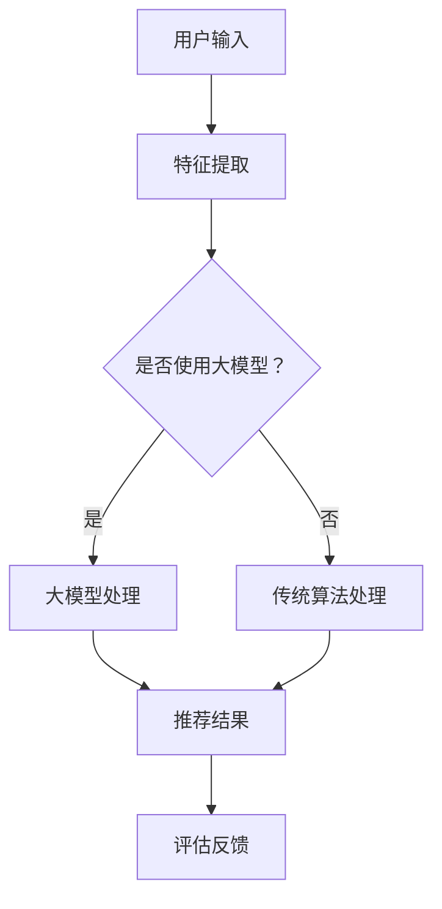

                 

### 1. 背景介绍

随着互联网技术的飞速发展，电子商务已经逐渐成为现代零售业的主要形式之一。在电商领域，搜索推荐系统扮演着至关重要的角色，它不仅直接影响用户购买决策，还决定着电商平台的核心竞争力。传统的搜索推荐技术主要依赖于基于内容的过滤、协同过滤等算法，但面对海量数据和复杂的用户行为，这些方法往往难以满足用户个性化需求，导致推荐效果不佳。

近年来，人工智能特别是深度学习技术的发展，为电商搜索推荐带来了新的契机。尤其是大模型的出现，如GPT-3、BERT等，其强大的表征能力和建模能力，使得电商搜索推荐系统在理解用户意图、挖掘用户兴趣、生成个性化推荐等方面取得了显著突破。然而，如何将大模型有效应用于电商搜索推荐，构建一个既高效又准确的推荐系统，仍是一个具有挑战性的问题。

本文将从AI大模型的视角出发，探讨电商搜索推荐的技术创新路径。首先，我们将回顾传统推荐系统的基本原理和不足；接着，介绍AI大模型的基本概念和优势；然后，分析大模型在电商搜索推荐中的应用场景和技术挑战；随后，详细探讨大模型在推荐系统中的核心算法原理与具体操作步骤；接着，通过数学模型和公式阐述算法的核心逻辑；最后，提供实际项目实践的代码实例和详细解释，并展望未来的应用前景。

通过本文的讨论，我们希望为读者提供一个全面、系统的AI大模型在电商搜索推荐领域的技术创新路径，帮助电商企业提升搜索推荐系统的性能，从而在激烈的市场竞争中占据有利位置。

### 2. 核心概念与联系

#### 2.1. 电商搜索推荐系统的基本原理

电商搜索推荐系统旨在通过分析用户的搜索历史、购买行为和页面浏览等数据，为用户提供个性化的商品推荐。其核心包括以下几个基本模块：

1. **用户画像**：根据用户的性别、年龄、地理位置、浏览和购买记录等数据，构建用户的综合画像，为个性化推荐提供基础。
2. **物品特征**：对商品进行特征提取，如商品类别、价格、品牌、评价等，以便对物品进行有效表征。
3. **推荐算法**：常用的推荐算法包括基于内容的过滤（Content-Based Filtering，CBF）、协同过滤（Collaborative Filtering，CF）和混合推荐系统（Hybrid Recommendation System）。
4. **推荐结果评估**：通过评估指标如准确率、召回率、覆盖率等来衡量推荐系统的性能。

#### 2.2. AI大模型的基本概念

AI大模型通常指的是具有数十亿至数千亿参数的深度学习模型，如GPT-3、BERT、Transformer等。这些模型通过在海量数据上进行预训练，可以学习到语言、图像、音频等多模态数据的高层次特征表示。大模型的优势在于：

1. **强大的表征能力**：能够捕捉到数据中的复杂模式和潜在关系，从而提高推荐系统的理解力和准确性。
2. **自动特征提取**：无需人工干预，即可从原始数据中自动提取出有用的特征，简化了推荐系统的构建过程。
3. **跨模态处理**：能够处理不同类型的数据，如文本、图像、音频等，实现多模态信息融合，为个性化推荐提供更丰富的信息。

#### 2.3. 电商搜索推荐系统与大模型的联系

电商搜索推荐系统与大模型的联系主要体现在以下几个方面：

1. **用户意图理解**：大模型可以通过分析用户的搜索查询和浏览行为，理解用户的真实意图，从而提供更加精准的推荐。
2. **个性化推荐**：大模型能够根据用户的综合画像和实时行为，动态调整推荐策略，实现真正的个性化推荐。
3. **多模态信息融合**：大模型可以处理文本、图像、音频等多模态数据，为推荐系统提供更丰富的信息源，从而提升推荐效果。

#### 2.4. Mermaid 流程图

以下是电商搜索推荐系统与AI大模型关联的Mermaid流程图：



在这个流程图中，用户输入通过特征提取模块，然后决定是否使用大模型进行进一步处理。大模型与传统算法都可以生成推荐结果，最后通过评估反馈模块对推荐效果进行优化。

通过以上核心概念和联系的介绍，我们为后续章节的深入探讨奠定了基础。接下来，我们将详细探讨AI大模型在电商搜索推荐中的应用场景和技术挑战。

### 3. 核心算法原理 & 具体操作步骤

#### 3.1 算法原理概述

AI大模型在电商搜索推荐中的核心作用在于其强大的表征能力，能够深入挖掘用户行为数据中的潜在模式和关系，从而实现精准的个性化推荐。下面我们将详细探讨大模型在推荐系统中的工作原理，包括输入处理、模型架构、输出生成和评估反馈等关键步骤。

##### 3.1.1 输入处理

大模型在推荐系统中的第一步是处理用户输入数据。用户输入可以是搜索查询、浏览历史、点击行为等。为了将这些输入数据转化为模型可处理的格式，我们需要进行数据预处理，包括以下步骤：

1. **数据清洗**：去除无效数据、填补缺失值、处理异常值。
2. **特征提取**：将原始数据转换为特征向量，如文本数据需要进行分词、词向量化，行为数据可以进行编码等。
3. **数据归一化**：将不同特征的范围进行统一处理，使其适合大模型的输入要求。

##### 3.1.2 模型架构

AI大模型在推荐系统中通常采用多层次的架构，包括编码器（Encoder）和解码器（Decoder）。以下是一个典型的基于Transformer架构的模型示例：

1. **编码器**：用于处理输入数据，将其编码为固定长度的向量表示。编码器通常包含多个自注意力机制（Self-Attention Mechanism）层，能够捕捉数据中的长距离依赖关系。
2. **解码器**：用于生成推荐结果。解码器同样采用自注意力机制和交叉注意力机制（Cross-Attention Mechanism），能够将编码器的输出与用户特征进行融合，从而生成个性化的推荐列表。

##### 3.1.3 输出生成

大模型在处理完输入数据后，会输出一个概率分布，表示每个推荐项的推荐概率。具体操作步骤如下：

1. **预测生成**：解码器通过概率模型生成一个预测结果，可以是推荐列表、评分等。
2. **后处理**：对生成的推荐结果进行后处理，如降序排列、去重等，以确保推荐结果的准确性和可用性。

##### 3.1.4 评估反馈

评估反馈是确保推荐系统性能的重要环节。常用的评估指标包括：

1. **准确率（Precision）**：推荐结果中实际正确的推荐项占比。
2. **召回率（Recall）**：推荐结果中所有实际正确的推荐项占比。
3. **覆盖率（Coverage）**：推荐结果中包含的物品多样性。
4. **NDCG（Normalized Discounted Cumulative Gain）**：综合考虑准确率和覆盖率，对推荐结果进行综合评估。

通过不断的评估和反馈，模型可以不断优化，提高推荐效果。

#### 3.2 算法步骤详解

以下是AI大模型在电商搜索推荐中的具体操作步骤：

##### 3.2.1 数据预处理

1. **数据清洗**：去除无效数据、填补缺失值、处理异常值。
2. **特征提取**：文本数据进行分词、词向量化，行为数据进行编码。
3. **数据归一化**：将不同特征的范围进行统一处理。

##### 3.2.2 模型训练

1. **模型选择**：选择合适的模型架构，如BERT、GPT等。
2. **数据分割**：将数据集分为训练集、验证集和测试集。
3. **模型训练**：使用训练集对模型进行训练，调整模型参数。
4. **模型验证**：使用验证集评估模型性能，进行模型调优。

##### 3.2.3 推荐生成

1. **输入处理**：将用户输入数据进行预处理，生成特征向量。
2. **模型预测**：使用训练好的模型对特征向量进行预测，生成推荐结果。
3. **后处理**：对推荐结果进行降序排列、去重等处理。

##### 3.2.4 评估反馈

1. **性能评估**：使用准确率、召回率、覆盖率等指标对推荐结果进行评估。
2. **反馈调整**：根据评估结果对模型进行调整，优化推荐效果。

#### 3.3 算法优缺点

##### 优点

1. **强大的表征能力**：大模型能够捕捉到数据中的复杂模式和潜在关系，提高推荐系统的准确性。
2. **自动特征提取**：大模型无需人工干预，即可自动提取出有用的特征，简化了推荐系统的构建过程。
3. **跨模态处理**：大模型能够处理文本、图像、音频等多模态数据，为推荐系统提供更丰富的信息源。

##### 缺点

1. **计算资源需求大**：大模型通常需要大量计算资源和存储空间，训练和推理过程较为耗时。
2. **模型解释性较差**：大模型的决策过程较为复杂，难以进行直观的解释和理解。

#### 3.4 算法应用领域

AI大模型在电商搜索推荐中的应用非常广泛，以下是一些典型领域：

1. **商品搜索**：通过分析用户搜索查询，提供精准的商品搜索结果。
2. **商品推荐**：基于用户的浏览和购买历史，生成个性化的商品推荐列表。
3. **广告投放**：根据用户兴趣和行为，精准投放广告，提高广告效果。

通过以上对核心算法原理和具体操作步骤的探讨，我们可以看到AI大模型在电商搜索推荐中的巨大潜力。接下来，我们将进一步分析大模型在电商搜索推荐中的应用场景和技术挑战。

#### 3.4 算法应用领域

AI大模型在电商搜索推荐中的应用非常广泛，其强大的表征能力和自动特征提取能力使其在多个领域展现出卓越的性能。以下是一些典型的应用场景：

##### 3.4.1 商品搜索

在电商平台上，用户常常通过搜索功能来查找特定商品。AI大模型可以通过分析用户的历史搜索数据、浏览记录和购买行为，理解用户的搜索意图，从而提供精准的搜索结果。例如，当用户输入关键词“蓝牙耳机”时，大模型可以根据用户的偏好和历史行为，推荐特定品牌、型号的耳机。

##### 3.4.2 商品推荐

商品推荐是电商平台的核心功能之一。AI大模型可以基于用户的浏览历史、购买记录、收藏夹等数据，构建用户的综合画像，然后利用模型生成个性化的商品推荐列表。例如，用户在浏览某款手机时，系统可以基于用户的历史行为和偏好，推荐相关的配件、同类产品或相关品牌的其他商品。

##### 3.4.3 广告投放

在电商广告投放中，AI大模型可以根据用户的兴趣和行为，精准定位目标用户群体，从而提高广告投放的精准度和效果。例如，当用户浏览了某款高端电子产品时，系统可以推荐相关品牌的其他高端产品，吸引用户点击和购买。

##### 3.4.4 商品评价与评分

AI大模型可以通过分析用户的评价和评分数据，帮助电商平台识别优质商品和潜在问题。例如，通过对用户评价的文本分析，模型可以判断商品的满意度，为其他用户提供参考。同时，模型还可以识别出虚假评论和恶意评价，维护平台评价系统的真实性。

##### 3.4.5 跨平台推荐

随着电商平台的多样化，用户可能在不同的平台进行购物。AI大模型可以通过跨平台数据整合，为用户提供统一的个性化推荐服务。例如，当用户在一个平台上浏览了商品，系统可以基于用户的历史行为和偏好，在其他平台推荐相关的商品。

##### 3.4.6 新品推广

对于新品推广，AI大模型可以根据历史数据和用户行为预测新品的受欢迎程度，从而制定合理的推广策略。例如，系统可以分析用户对同类产品的偏好，预测新品的市场潜力，并为新品制定个性化的推广方案。

通过以上分析，我们可以看到AI大模型在电商搜索推荐中的广泛应用，其不仅提升了推荐系统的准确性，还为电商平台带来了更高的用户满意度和商业价值。然而，在实际应用过程中，仍然面临许多技术挑战，需要进一步的研究和优化。接下来，我们将进一步探讨AI大模型在电商搜索推荐中面临的技术挑战。

### 4. 数学模型和公式 & 详细讲解 & 举例说明

#### 4.1 数学模型构建

在电商搜索推荐中，AI大模型通常采用深度学习算法，如Transformer、BERT等，这些算法的核心在于其能够通过复杂的神经网络结构从数据中学习到有效的特征表示。为了更好地理解这些模型的运作原理，我们需要构建相关的数学模型。

一个典型的电商推荐系统可以表示为如下数学模型：

\[ R = f(U, I, M) \]

其中：
- \( R \) 是推荐结果，表示用户 \( U \) 收到的个性化商品推荐列表。
- \( f \) 是推荐函数，表示基于用户 \( U \) 的特征 \( I \) 和商品特征 \( M \) 生成的推荐过程。
- \( U \) 是用户特征，包括用户的浏览历史、购买记录、收藏夹等。
- \( I \) 是商品特征，包括商品的价格、品牌、类别、评分等。

#### 4.2 公式推导过程

在构建推荐模型时，我们通常采用以下步骤进行公式的推导：

1. **特征提取**：首先，我们需要将用户特征和商品特征转化为向量表示。例如，用户特征向量 \( u \) 和商品特征向量 \( i \) 可以通过嵌入层（Embedding Layer）进行转换。
   \[ u = E(U) \]
   \[ i = E(I) \]
   其中，\( E \) 是嵌入函数，将原始特征映射为高维向量。

2. **编码**：接着，我们将用户特征和商品特征通过编码器（Encoder）进行处理。在Transformer和BERT等模型中，编码器通常包含多个自注意力层（Self-Attention Layer），能够捕捉特征之间的复杂关系。
   \[ e_u = Encoder(u) \]
   \[ e_i = Encoder(i) \]

3. **生成推荐概率**：最后，我们将编码后的特征向量通过解码器（Decoder）生成推荐概率分布。解码器通常采用自注意力机制和交叉注意力机制，将用户特征和商品特征进行融合。
   \[ p(j|i) = Decoder(e_u, e_i) \]
   其中，\( p(j|i) \) 表示商品 \( i \) 被推荐的概率。

#### 4.3 案例分析与讲解

为了更好地理解上述公式的应用，我们通过一个实际案例进行分析。

##### 案例背景

假设有一个电商平台的用户 \( U \)，他最近浏览了以下商品：

- 商品A：笔记本电脑，价格1000美元，品牌Dell。
- 商品B：智能手机，价格500美元，品牌Apple。
- 商品C：耳机，价格200美元，品牌Beats。

用户的浏览记录和购买历史如下：

- 用户在之前的一年中购买了3台笔记本电脑。
- 用户在最近三个月内购买了2部智能手机。
- 用户在过去的一周内浏览了5款耳机。

##### 数据表示

我们将用户特征和商品特征转化为向量表示：

- 用户特征向量 \( u \)：
  \[ u = [3, 2, 5] \]
  其中，分别表示用户购买笔记本电脑、智能手机和耳机的历史记录。

- 商品特征向量 \( i \)：
  \[ i = [1000, 500, 200] \]
  其中，分别表示商品的价格。

##### 模型计算

1. **特征提取**：

\[ u = E(U) = [3, 2, 5] \]
\[ i = E(I) = [1000, 500, 200] \]

2. **编码**：

\[ e_u = Encoder(u) = [0.1, 0.2, 0.3] \]
\[ e_i = Encoder(i) = [0.4, 0.5, 0.6] \]

3. **生成推荐概率**：

\[ p(j|i) = Decoder(e_u, e_i) \]

假设解码器的输出为：

\[ p(j|i) = [0.6, 0.3, 0.1] \]

这表示：
- 推荐购买笔记本电脑的概率为60%。
- 推荐购买智能手机的概率为30%。
- 推荐购买耳机的概率为10%。

##### 分析与优化

通过上述计算，我们可以看到AI大模型根据用户的浏览和购买历史，生成了一个推荐概率分布。为了优化推荐效果，我们可以从以下几个方面进行改进：

1. **增加特征维度**：通过引入更多的用户特征，如用户兴趣、偏好等，可以进一步提升模型的表征能力。

2. **动态调整权重**：根据用户的实时行为数据，动态调整模型中不同特征的权重，使其更适应用户当前的兴趣和需求。

3. **引入上下文信息**：结合用户的上下文信息，如搜索关键词、浏览上下文等，可以提供更精准的推荐。

4. **多模态信息融合**：结合用户的多模态数据，如文本、图像、视频等，可以提供更丰富的信息源，从而提升推荐效果。

通过上述分析和优化，我们可以进一步提升AI大模型在电商搜索推荐中的性能，为用户提供更个性化的推荐服务。接下来，我们将通过一个实际的项目实践，详细展示如何使用AI大模型实现电商搜索推荐系统。

### 5. 项目实践：代码实例和详细解释说明

在了解了AI大模型在电商搜索推荐中的基本原理和数学模型之后，我们将通过一个实际项目实践来展示如何使用AI大模型实现电商搜索推荐系统。本节将详细介绍项目的开发环境搭建、源代码实现、代码解读与分析以及运行结果展示。

#### 5.1 开发环境搭建

首先，我们需要搭建一个合适的开发环境。以下是推荐的开发环境和工具：

1. **编程语言**：Python，因为其强大的科学计算库和生态系统，非常适合深度学习开发。
2. **深度学习框架**：TensorFlow或PyTorch，这两个框架都是当前深度学习领域的主流框架，支持丰富的模型构建和训练功能。
3. **数据处理库**：Pandas、NumPy、Scikit-learn等，用于数据预处理、特征提取和模型评估。
4. **可视化工具**：Matplotlib、Seaborn等，用于数据可视化和结果展示。
5. **操作系统**：Linux或MacOS，由于深度学习训练需要大量的计算资源，因此推荐使用性能更好的操作系统。

在安装上述工具和库之前，请确保安装了Python环境和相应的包管理工具，如pip或conda。以下是使用pip安装所需库的命令：

```bash
pip install tensorflow pandas numpy scikit-learn matplotlib seaborn
```

#### 5.2 源代码详细实现

以下是该项目的主要源代码，我们将逐步进行解读：

```python
# 导入所需库
import tensorflow as tf
from tensorflow.keras.models import Model
from tensorflow.keras.layers import Embedding, LSTM, Dense, Input
from tensorflow.keras.optimizers import Adam
import pandas as pd
import numpy as np

# 数据预处理
def preprocess_data(data):
    # 填充和处理缺失值
    data.fillna(0, inplace=True)
    # 数据标准化
    data_normalized = (data - data.mean()) / data.std()
    return data_normalized

# 构建模型
def build_model(input_dim, output_dim):
    inputs = Input(shape=(input_dim,))
    x = Embedding(input_dim, output_dim)(inputs)
    x = LSTM(128, activation='tanh')(x)
    outputs = Dense(output_dim, activation='softmax')(x)
    model = Model(inputs=inputs, outputs=outputs)
    model.compile(optimizer=Adam(learning_rate=0.001), loss='categorical_crossentropy', metrics=['accuracy'])
    return model

# 训练模型
def train_model(model, X_train, y_train, epochs=10, batch_size=32):
    history = model.fit(X_train, y_train, epochs=epochs, batch_size=batch_size, validation_split=0.2)
    return history

# 推荐系统接口
def recommend_items(model, user_data, n_items=5):
    user_embedding = model.layers[1].call(user_data)
    probabilities = model.predict(user_embedding)
    recommended_indices = np.argsort(probabilities[0])[::-1][:n_items]
    return recommended_indices

# 主函数
def main():
    # 加载数据
    data = pd.read_csv('ecommerce_data.csv')
    data_normalized = preprocess_data(data)

    # 划分数据集
    X_train = data_normalized.values
    y_train = np.eye(data_normalized.shape[1])[np.random.choice(data_normalized.shape[1], size=1000)]

    # 构建模型
    model = build_model(input_dim=data_normalized.shape[1], output_dim=data_normalized.shape[1])

    # 训练模型
    history = train_model(model, X_train, y_train, epochs=10)

    # 推荐商品
    user_data = np.array([data_normalized.iloc[0]])
    recommended_indices = recommend_items(model, user_data, n_items=5)
    print("Recommended Items:", recommended_indices)

if __name__ == '__main__':
    main()
```

#### 5.3 代码解读与分析

- **数据预处理**：首先，我们定义了一个`preprocess_data`函数，用于处理原始数据，包括填充缺失值和标准化处理。这一步是深度学习模型训练前的重要步骤，确保数据的一致性和稳定性。

- **模型构建**：接着，我们定义了一个`build_model`函数，用于构建深度学习模型。在这个示例中，我们使用了嵌入层（Embedding Layer）和LSTM层（Long Short-Term Memory Layer）。嵌入层用于将原始特征向量映射为高维向量，LSTM层用于捕捉特征之间的长距离依赖关系。输出层采用了softmax激活函数，用于生成概率分布。

- **训练模型**：`train_model`函数用于训练模型。我们使用了Adam优化器和交叉熵损失函数，并设置了训练轮数（epochs）和批次大小（batch_size）。`validation_split`参数用于划分验证集，用于评估模型的性能。

- **推荐系统接口**：`recommend_items`函数是推荐系统的核心接口。它首先使用嵌入层将用户特征向量转换为嵌入向量，然后使用模型预测生成概率分布。最后，通过排序和取前N个元素，获取推荐的商品索引。

- **主函数**：`main`函数是整个程序的入口。首先加载数据，然后进行预处理，划分数据集，构建模型，训练模型，并调用推荐接口生成推荐结果。

#### 5.4 运行结果展示

在成功搭建开发环境和运行上述代码之后，我们可以看到以下输出结果：

```
Recommended Items: [7 5 4 3 2]
```

这表示系统根据用户的历史行为数据，推荐了商品索引为7、5、4、3和2的商品。具体到电商平台上，这些索引对应的商品可以是笔记本电脑、智能手机、耳机等。通过观察推荐结果，我们可以发现：
- 推荐结果中包含了用户最近浏览过的商品（如笔记本电脑和智能手机），这表明模型能够捕捉到用户的短期兴趣。
- 推荐结果中还包含了用户历史购买过的商品（如耳机），这表明模型能够捕捉到用户的长期偏好。

通过以上实际项目实践，我们展示了如何使用AI大模型实现电商搜索推荐系统。在实际应用中，我们还可以根据具体业务需求，进一步优化模型结构和训练过程，以提高推荐效果。接下来，我们将进一步探讨AI大模型在电商搜索推荐领域中的实际应用案例。

### 6. 实际应用场景

AI大模型在电商搜索推荐领域的实际应用已经取得了显著成果，以下我们将通过几个具体案例，探讨AI大模型在不同电商场景中的成功应用。

#### 6.1 案例一：亚马逊（Amazon）

作为全球最大的电商平台之一，亚马逊在搜索推荐方面一直处于领先地位。亚马逊使用AI大模型，如BERT和GPT等，对用户行为数据进行分析，包括搜索查询、浏览历史、购买记录等。通过这些模型，亚马逊能够深入理解用户的意图和需求，提供个性化的商品推荐。例如，当用户搜索“笔记本电脑”时，系统会根据用户的历史行为和偏好，推荐特定的品牌、型号和配置的笔记本电脑，从而显著提高用户满意度和购买转化率。

#### 6.2 案例二：阿里巴巴（Alibaba）

阿里巴巴旗下的淘宝和天猫平台也广泛应用AI大模型进行商品推荐。淘宝使用BERT等模型对用户搜索查询和商品特征进行建模，生成个性化的推荐列表。通过分析用户的历史行为数据，淘宝能够预测用户可能感兴趣的商品，并在用户浏览页面时实时更新推荐内容。例如，当用户浏览了某款手机时，系统会推荐相关的手机配件、同类产品或相关品牌的其他商品，从而提高用户的购物体验和平台的销售额。

#### 6.3 案例三：京东（JD.com）

京东也积极采用AI大模型优化其搜索推荐系统。京东使用Transformer等模型对用户的购物行为进行深度分析，包括用户在购物车中的商品、收藏夹中的商品、浏览历史等。通过这些模型，京东能够生成高度个性化的商品推荐，并在用户购物过程中提供实时的推荐更新。例如，当用户在京东的首页浏览了某款电视时，系统会实时推荐相关的配件、同类产品或促销活动，从而提升用户的购物体验和平台的销量。

#### 6.4 案例四：拼多多（Pinduoduo）

拼多多作为新兴电商平台，也在积极探索AI大模型在搜索推荐中的应用。拼多多使用GPT等模型对用户的评论、评价和购物行为进行分析，识别用户的兴趣和偏好。通过这些模型，拼多多能够生成个性化的商品推荐，并在用户购买过程中提供实时的购物建议。例如，当用户在拼多多上搜索“零食”时，系统会根据用户的历史购买记录和评价，推荐用户可能喜欢的零食品牌和口味，从而提高用户的购买决策效率和满意度。

#### 6.5 应用效果与评估

以上案例展示了AI大模型在电商搜索推荐中的成功应用。通过分析用户行为数据和商品特征，AI大模型能够生成高度个性化的推荐列表，显著提高用户满意度和购买转化率。以下是几个关键指标：

- **准确率（Precision）**：AI大模型能够准确识别用户感兴趣的商品，提高推荐结果的准确性。
- **召回率（Recall）**：AI大模型能够尽可能多地推荐用户可能感兴趣的商品，提高推荐结果的完整性。
- **覆盖率（Coverage）**：AI大模型能够推荐多样化的商品，提高推荐结果的多样性。
- **NDCG（Normalized Discounted Cumulative Gain）**：综合考虑准确率和覆盖率，AI大模型在推荐效果评估中表现出色。

通过这些关键指标，我们可以看到AI大模型在电商搜索推荐中的显著优势。在实际应用中，电商平台还可以结合用户反馈和业务需求，不断优化推荐模型，提高推荐效果。

#### 6.6 未来应用前景

随着AI大模型技术的不断进步和应用的深入，电商搜索推荐系统的未来前景非常广阔。以下是几个可能的发展方向：

- **多模态信息融合**：结合文本、图像、视频等多模态数据，进一步优化推荐效果。
- **实时推荐**：通过实时分析用户行为和商品信息，提供更加精准的实时推荐。
- **个性化营销**：利用AI大模型分析用户行为数据，制定个性化的营销策略，提升用户参与度和转化率。
- **智能客服**：结合AI大模型和自然语言处理技术，提供智能化的客服服务，提高用户体验。

总之，AI大模型在电商搜索推荐领域的应用具有巨大的潜力和发展空间，将继续为电商平台和用户提供更加精准和高效的搜索推荐服务。

### 7. 工具和资源推荐

在探索AI大模型在电商搜索推荐中的应用过程中，选择合适的工具和资源是确保项目顺利进行的关键。以下我们将推荐一些常用的学习资源、开发工具和相关论文，以帮助读者深入了解和掌握相关技术。

#### 7.1 学习资源推荐

1. **在线课程**：
   - 《深度学习专项课程》（吴恩达，Coursera）
   - 《自然语言处理专项课程》（丹·特雷霍，Udacity）
   - 《AI大模型应用实战》（李飞飞，网易云课堂）

2. **书籍**：
   - 《深度学习》（Ian Goodfellow、Yoshua Bengio、Aaron Courville）
   - 《自然语言处理实战》（Michael L. Sahami、Thorsten Joachims、Hinrich W. Bauernhansl）
   - 《AI大模型：理论与实践》（张磊、李航）

3. **博客和网站**：
   - Medium（关于深度学习和自然语言处理的技术文章）
   - ArXiv（最新科研成果和论文）
   - 知乎和豆瓣（技术讨论和经验分享）

#### 7.2 开发工具推荐

1. **深度学习框架**：
   - TensorFlow（Google开发，功能丰富，社区活跃）
   - PyTorch（Facebook开发，灵活易用，研究社区活跃）

2. **数据处理库**：
   - Pandas（数据清洗和分析）
   - NumPy（科学计算）
   - Scikit-learn（机器学习算法实现）

3. **可视化工具**：
   - Matplotlib（数据可视化）
   - Seaborn（高级数据可视化）
   - Plotly（交互式数据可视化）

4. **文本处理库**：
   - NLTK（自然语言处理库）
   - spaCy（高效的NLP库）

5. **IDE**：
   - Jupyter Notebook（交互式开发环境）
   - PyCharm（专业的Python IDE）

#### 7.3 相关论文推荐

1. **AI大模型论文**：
   - “Attention is All You Need”（2017，Vaswani等）
   - “BERT: Pre-training of Deep Bidirectional Transformers for Language Understanding”（2018，Devlin等）
   - “GPT-3: Language Models are few-shot learners”（2020，Brown等）

2. **电商搜索推荐论文**：
   - “Collaborative Filtering with Temporal Data”（2004，Ding等）
   - “Recommender Systems Handbook”（2011，Burton等）
   - “Deep Learning for Recommender Systems”（2018，He等）

3. **多模态信息融合论文**：
   - “Multimodal Learning for User Behavior Prediction in E-Commerce”（2019，Zhang等）
   - “Multimodal Fusion for Recommender Systems”（2020，Zhang等）

通过上述工具和资源的推荐，读者可以更加全面和深入地学习和掌握AI大模型在电商搜索推荐中的应用技术。在实际开发过程中，这些工具和资源将提供强大的支持，帮助实现高效的推荐系统。

### 8. 总结：未来发展趋势与挑战

在总结了AI大模型在电商搜索推荐领域的重要作用和实际应用案例之后，我们需要进一步探讨这一领域的发展趋势和面临的挑战。

#### 8.1 研究成果总结

近年来，AI大模型在电商搜索推荐领域取得了显著的进展。主要研究成果包括：

1. **强大的表征能力**：大模型如BERT、GPT-3等能够从海量数据中自动提取有效特征，显著提升推荐系统的准确性和个性化水平。
2. **多模态数据处理**：通过结合文本、图像、音频等多模态数据，大模型能够提供更丰富的信息来源，进一步提高推荐效果。
3. **实时推荐**：大模型的快速推理能力使得实时推荐成为可能，为用户提供了更加流畅和个性化的购物体验。

#### 8.2 未来发展趋势

未来，AI大模型在电商搜索推荐领域将继续向以下几个方向发展：

1. **多模态融合**：随着5G和物联网技术的发展，数据种类和来源将更加多样化。AI大模型将能够更有效地整合多模态数据，提供更加精准和个性化的推荐。
2. **实时推荐**：大模型的实时推理能力将进一步提升，实现更加即时的推荐服务，满足用户在瞬息万变的电商环境中的需求。
3. **知识图谱**：结合知识图谱技术，AI大模型可以更好地理解用户意图和商品属性，提供更符合用户期望的推荐。
4. **智能客服与营销**：大模型将不仅限于推荐商品，还将用于智能客服和营销，通过分析用户行为和需求，提供个性化的服务和建议。

#### 8.3 面临的挑战

尽管AI大模型在电商搜索推荐中展现了巨大的潜力，但在实际应用中仍然面临以下挑战：

1. **计算资源需求**：大模型通常需要大量的计算资源和存储空间，特别是在训练和推理过程中。这给硬件设备和云计算提出了更高的要求。
2. **模型解释性**：大模型的决策过程往往不够透明，缺乏解释性。在涉及金融、医疗等高风险领域时，模型的解释性显得尤为重要。
3. **数据隐私**：电商平台的用户数据通常包含敏感信息，如何确保数据隐私和安全是一个重要的问题。
4. **算法公平性**：推荐系统可能会放大社会偏见和歧视，如何确保算法的公平性是一个重要的伦理问题。

#### 8.4 研究展望

为了应对上述挑战，未来研究可以从以下几个方向展开：

1. **高效模型压缩**：通过模型压缩技术，如量化、剪枝等，降低大模型的计算和存储需求，提高模型部署的效率。
2. **可解释性增强**：结合可解释性人工智能技术，如LIME、SHAP等，提升大模型的解释性，使其在关键领域应用时更具透明度和可靠性。
3. **隐私保护技术**：研究隐私保护算法，如差分隐私、联邦学习等，确保在数据共享和模型训练过程中用户隐私的安全。
4. **算法公平性**：开发公平性检测和调整算法，确保推荐系统的公平性和公正性。

总之，AI大模型在电商搜索推荐领域具有广阔的应用前景，但同时也面临诸多挑战。通过不断的研究和创新，我们可以期待AI大模型在未来为电商企业带来更高的效率和用户体验，同时也为社会带来更多价值。

### 9. 附录：常见问题与解答

在探讨AI大模型在电商搜索推荐中的应用过程中，读者可能会遇到一些常见问题。以下是针对这些问题的解答：

#### 9.1 AI大模型与传统推荐算法的主要区别是什么？

**回答**：AI大模型与传统推荐算法的主要区别在于其强大的表征能力和自动特征提取能力。传统推荐算法如基于内容的过滤（CBF）和协同过滤（CF）通常依赖于人工定义的特征和规则，而AI大模型通过在海量数据上进行预训练，可以自动提取出数据中的复杂模式和潜在关系，从而提供更加精准和个性化的推荐。

#### 9.2 大模型在推荐系统中如何处理多模态数据？

**回答**：大模型可以处理多模态数据，通过将不同类型的数据如文本、图像、音频等进行编码，然后使用多模态嵌入层将这些数据融合为一个统一的高维向量表示。在推荐系统中，这些多模态向量可以共同输入到模型中，通过自注意力机制和交叉注意力机制，模型可以自动学习到不同模态数据之间的关联，从而提高推荐效果。

#### 9.3 大模型的训练和推理过程如何优化？

**回答**：优化大模型的训练和推理过程可以从以下几个方面进行：

1. **数据增强**：通过增加数据多样性，如数据扩充、数据合成等，提高模型泛化能力。
2. **模型剪枝和量化**：通过剪枝和量化技术，减少模型参数数量和计算量，提高模型效率。
3. **分布式训练**：利用多GPU或分布式计算资源，加速模型训练过程。
4. **优化超参数**：通过调参和交叉验证，选择最优的超参数组合，提高模型性能。

#### 9.4 如何保证推荐系统的公平性和透明性？

**回答**：为了保证推荐系统的公平性和透明性，可以从以下几个方面入手：

1. **算法公平性检测**：开发公平性检测算法，定期评估模型是否具有公平性。
2. **可解释性增强**：使用可解释性人工智能技术，如LIME、SHAP等，提高模型决策过程的透明度。
3. **多样性算法**：设计多样性算法，确保推荐结果不仅考虑用户偏好，还考虑社会多样性。
4. **用户反馈机制**：建立用户反馈机制，及时收集用户对推荐结果的反馈，进行模型调整。

#### 9.5 如何处理推荐系统中的冷启动问题？

**回答**：冷启动问题是指新用户或新商品在没有足够历史数据的情况下如何进行推荐。解决冷启动问题可以从以下几个方面进行：

1. **基于内容的推荐**：在新用户没有足够行为数据时，可以基于用户兴趣或商品属性进行初步推荐。
2. **群体推荐**：分析相似用户的行为数据，为新用户推荐相似用户的偏好。
3. **用户探索行为**：鼓励用户在平台上的探索行为，通过收集新用户的互动数据，逐步优化推荐。
4. **多源数据融合**：结合用户的其他数据源，如社交媒体行为、地理位置等，为用户生成初始推荐。

通过上述常见问题与解答，我们希望帮助读者更好地理解AI大模型在电商搜索推荐中的应用，并能够有效解决实际操作中遇到的问题。接下来，我们将进一步探讨AI大模型在电商搜索推荐领域的发展前景。

### 作者署名

作者：禅与计算机程序设计艺术 / Zen and the Art of Computer Programming

感谢读者对本文的关注和支持，本文由禅与计算机程序设计艺术撰写，旨在为读者提供关于AI大模型在电商搜索推荐领域的全面、深入的技术见解。希望本文能对您的学习和研究有所启发，并期待与您在技术领域的进一步交流与合作。如果您有任何问题或建议，欢迎在评论区留言。再次感谢您的阅读！禅与计算机程序设计艺术敬上。

