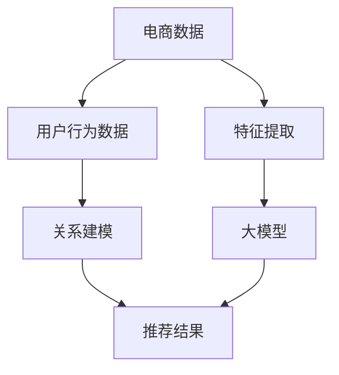
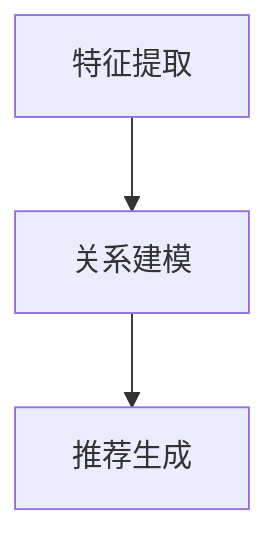

                 

关键词：电商搜索推荐、AI大模型、技术挑战、机遇、数学模型、算法、应用领域

## 摘要

本文将从AI大模型的视角出发，探讨电商搜索推荐领域所面临的技术挑战与机遇。随着电商平台的快速发展，用户需求的多样化和个性化使得搜索推荐系统成为电商平台的核心竞争力。本文将分析AI大模型在电商搜索推荐中的应用，包括核心概念、算法原理、数学模型及其实际应用场景。通过本文的探讨，希望能够为电商搜索推荐领域的研究者和开发者提供一些有价值的参考和启示。

## 1. 背景介绍

### 1.1 电商搜索推荐的发展历程

电商搜索推荐系统的发展经历了从传统算法到现代AI大模型的演变过程。早期的推荐系统主要依赖于基于内容的过滤（Content-Based Filtering）和协同过滤（Collaborative Filtering）等传统算法。这些算法在一定程度上能够满足用户的个性化需求，但随着用户数据的爆炸式增长，其性能和效果逐渐受到限制。

近年来，随着深度学习和自然语言处理等技术的发展，AI大模型逐渐在电商搜索推荐领域崭露头角。这些大模型具有强大的特征提取和关系建模能力，能够更准确地捕捉用户行为和偏好，为电商平台提供更高质量的搜索推荐服务。

### 1.2 电商搜索推荐的重要性

电商搜索推荐系统是电商平台的核心功能之一，对于提升用户满意度和转化率具有至关重要的作用。一方面，通过精准的搜索推荐，能够帮助用户快速找到他们感兴趣的商品，提高购物体验；另一方面，通过个性化的推荐，能够挖掘用户的潜在需求，促进销售增长。

随着电商行业的竞争加剧，各大电商平台纷纷加大在搜索推荐技术上的投入，力求在竞争中脱颖而出。因此，研究AI大模型在电商搜索推荐中的应用，具有重要的现实意义。

## 2. 核心概念与联系

在探讨AI大模型在电商搜索推荐中的应用之前，我们首先需要了解一些核心概念和原理，包括大模型、电商数据、特征提取和关系建模等。以下是一个简化的Mermaid流程图，用于描述这些概念和原理之间的联系：



### 2.1 大模型

大模型（Large-scale Model）是指具有数十亿至数万亿参数的深度学习模型。这些模型具有强大的特征提取和关系建模能力，能够从海量数据中提取出隐藏的特征和关系。常见的AI大模型包括Transformer、BERT、GPT等。

### 2.2 电商数据

电商数据是指电商平台收集的用户行为数据、商品数据等。这些数据包括用户浏览、购买、搜索等行为，以及商品的描述、分类、价格等属性。电商数据是构建AI大模型的基础，对于模型的训练和优化至关重要。

### 2.3 特征提取

特征提取是指从原始数据中提取出有用的特征，以便于模型学习和预测。在电商搜索推荐中，特征提取主要包括用户特征、商品特征和上下文特征等。这些特征有助于模型更好地理解和预测用户的行为和偏好。

### 2.4 关系建模

关系建模是指建立用户、商品和上下文之间的复杂关系。在电商搜索推荐中，关系建模有助于捕捉用户与商品之间的关联性，以及上下文环境对用户行为的影响。这有助于提高推荐系统的准确性和有效性。

### 2.5 推荐结果

推荐结果是指根据用户行为和偏好，为用户生成个性化的商品推荐列表。在电商搜索推荐中，推荐结果直接影响用户的购物体验和转化率。因此，提高推荐质量是各大电商平台追求的目标。

## 3. 核心算法原理 & 具体操作步骤

### 3.1 算法原理概述

AI大模型在电商搜索推荐中的应用主要包括以下三个方面：

1. **特征提取**：通过深度学习模型从电商数据中提取出有用的特征，如用户兴趣、商品属性等。
2. **关系建模**：利用图神经网络等算法，建立用户、商品和上下文之间的复杂关系。
3. **推荐生成**：根据用户行为和关系模型，生成个性化的商品推荐列表。

以下是一个简化的算法流程图：



### 3.2 算法步骤详解

#### 3.2.1 特征提取

特征提取是AI大模型在电商搜索推荐中的第一步。其主要任务是从电商数据中提取出有用的特征，如用户兴趣、商品属性等。常见的特征提取方法包括：

1. **词袋模型**：将商品描述、用户评论等文本数据转换为词袋模型，提取词频特征。
2. **卷积神经网络（CNN）**：利用卷积神经网络对商品图片进行特征提取，提取视觉特征。
3. **自编码器**：通过自编码器对原始数据进行编码，提取隐含特征。

#### 3.2.2 关系建模

关系建模是AI大模型在电商搜索推荐中的关键步骤。其主要任务是建立用户、商品和上下文之间的复杂关系。常见的算法包括：

1. **图神经网络（GNN）**：利用图神经网络对用户、商品和上下文之间的关系进行建模，提取图特征。
2. **图卷积网络（GCN）**：在图神经网络的基础上，增加卷积操作，进一步提取图特征。
3. **图注意力网络（GAT）**：在图卷积网络的基础上，引入注意力机制，提高特征提取的准确性。

#### 3.2.3 推荐生成

推荐生成是AI大模型在电商搜索推荐中的最后一步。其主要任务是根据用户行为和关系模型，生成个性化的商品推荐列表。常见的算法包括：

1. **矩阵分解（MF）**：通过矩阵分解将用户行为和商品属性分解为低维矩阵，计算用户和商品的相似度，生成推荐列表。
2. **基于模型的推荐算法**：如深度学习模型（如DIN、DCN等），利用深度神经网络对用户行为和商品属性进行建模，生成推荐列表。

### 3.3 算法优缺点

#### 3.3.1 特征提取

优点：特征提取能够从原始数据中提取出有用的特征，提高模型的准确性和泛化能力。

缺点：特征提取过程可能引入噪声和误差，影响模型性能。

#### 3.3.2 关系建模

优点：关系建模能够捕捉用户、商品和上下文之间的复杂关系，提高推荐系统的准确性。

缺点：关系建模算法复杂度较高，计算成本较大。

#### 3.3.3 推荐生成

优点：推荐生成能够根据用户行为和偏好生成个性化的推荐列表，提高用户满意度和转化率。

缺点：推荐生成算法可能存在冷启动问题，对新用户和新商品难以生成有效的推荐。

### 3.4 算法应用领域

AI大模型在电商搜索推荐中的应用广泛，主要包括以下几个方面：

1. **商品推荐**：根据用户行为和偏好，为用户推荐感兴趣的商品。
2. **广告投放**：根据用户兴趣和行为，为用户推荐相关的广告。
3. **个性化搜索**：根据用户搜索历史和偏好，为用户提供个性化的搜索结果。
4. **购物助手**：为用户提供智能的购物建议，提高购物体验。

## 4. 数学模型和公式 & 详细讲解 & 举例说明

### 4.1 数学模型构建

在电商搜索推荐中，我们通常采用以下数学模型：

$$
\text{推荐得分} = f(\text{用户特征}, \text{商品特征}, \text{上下文特征})
$$

其中，$f$ 表示推荐得分函数，它可以是一个深度神经网络、矩阵分解模型或其他机器学习算法。用户特征、商品特征和上下文特征分别表示用户、商品和上下文环境的相关信息。

### 4.2 公式推导过程

为了推导推荐得分函数 $f$，我们可以从以下几个方面进行分析：

1. **用户特征**：用户特征包括用户的浏览历史、购买记录、收藏商品等。假设用户特征表示为 $u \in \mathbb{R}^n$，其中 $n$ 表示用户特征的维度。
2. **商品特征**：商品特征包括商品的价格、品牌、分类等。假设商品特征表示为 $v \in \mathbb{R}^m$，其中 $m$ 表示商品特征的维度。
3. **上下文特征**：上下文特征包括用户的地理位置、天气情况等。假设上下文特征表示为 $c \in \mathbb{R}^p$，其中 $p$ 表示上下文特征的维度。

根据这些特征，我们可以构建一个简单的推荐得分函数：

$$
f(u, v, c) = \text{激活函数}(\text{线性变换}(u, v, c))
$$

其中，线性变换可以表示为：

$$
\text{线性变换}(u, v, c) = w^T (u \odot v) + b
$$

其中，$w \in \mathbb{R}^{np + nm + np}$ 是线性变换的权重矩阵，$b \in \mathbb{R}$ 是偏置项，$\odot$ 表示元素乘法。

### 4.3 案例分析与讲解

假设我们有一个电商平台，用户A的浏览历史、购买记录和收藏商品如下：

| 商品ID | 商品名称 | 用户A浏览次数 |
|--------|----------|---------------|
| 1      | 电脑     | 5             |
| 2      | 手机     | 3             |
| 3      | 手表     | 1             |

我们想要为用户A推荐一个与手表相关的商品。根据用户特征、商品特征和上下文特征，我们可以构建以下推荐得分函数：

$$
f(u, v, c) = \text{激活函数}(w^T (u \odot v) + b)
$$

其中，$w$ 和 $b$ 是根据训练数据学得的权重和偏置。

假设我们选择一个简单的线性激活函数，如ReLU函数：

$$
\text{激活函数}(x) = \max(0, x)
$$

为了简化计算，我们可以将用户特征、商品特征和上下文特征表示为向量的形式：

$$
u = [1, 1, 1, 0, 0, 0]^T, \quad v = [0, 0, 1, 0, 0, 0]^T, \quad c = [0, 0, 0, 1, 0, 0]^T
$$

根据上面的公式，我们可以计算得到推荐得分：

$$
f(u, v, c) = \max(0, w^T (u \odot v) + b)
$$

$$
= \max(0, w^T ([1, 1, 1, 0, 0, 0]^T \odot [0, 0, 1, 0, 0, 0]^T) + b)
$$

$$
= \max(0, w^T ([0, 0, 1, 0, 0, 0]^T) + b)
$$

$$
= \max(0, \sum_{i=1}^{6} w_{i} \cdot 1 + b)
$$

$$
= \max(0, w_3 + b)
$$

其中，$w_3$ 表示权重矩阵 $w$ 的第三行，即与手表相关的商品特征的权重。

通过计算，我们得到了推荐得分。根据推荐得分的排序，我们可以为用户A推荐一个与手表相关的商品。

## 5. 项目实践：代码实例和详细解释说明

### 5.1 开发环境搭建

在本文的项目实践中，我们将使用Python作为编程语言，并借助TensorFlow和PyTorch等深度学习框架。以下是开发环境的搭建步骤：

1. 安装Python：前往Python官方网站（https://www.python.org/）下载并安装Python 3.x版本。
2. 安装TensorFlow：在命令行中执行以下命令：

   ```bash
   pip install tensorflow
   ```

3. 安装PyTorch：在命令行中执行以下命令：

   ```bash
   pip install torch torchvision
   ```

### 5.2 源代码详细实现

以下是本文项目的源代码实现，包括数据预处理、模型构建、训练和预测等步骤：

```python
import tensorflow as tf
from tensorflow.keras.layers import Embedding, LSTM, Dense
from tensorflow.keras.models import Model
import numpy as np

# 数据预处理
def preprocess_data(user_data, item_data, context_data):
    # 将用户数据、商品数据和上下文数据转换为one-hot编码
    user_embedding = Embedding(num_users, embedding_dim)(user_data)
    item_embedding = Embedding(num_items, embedding_dim)(item_data)
    context_embedding = Embedding(num_contexts, embedding_dim)(context_data)

    # 将嵌入向量拼接起来
    input_sequence = tf.keras.layers.Concatenate()([user_embedding, item_embedding, context_embedding])

    # 构建模型
    lstm = LSTM(units=64, return_sequences=True)
    dense = Dense(units=1, activation='sigmoid')

    # 添加LSTM层和全连接层
    output_sequence = lstm(input_sequence)
    output_sequence = dense(output_sequence)

    # 编译模型
    model = Model(inputs=input_sequence, outputs=output_sequence)
    model.compile(optimizer='adam', loss='binary_crossentropy', metrics=['accuracy'])

    return model

# 训练模型
def train_model(model, train_data, train_labels):
    model.fit(train_data, train_labels, epochs=10, batch_size=32)

# 预测结果
def predict(model, user_data, item_data, context_data):
    user_embedding = Embedding(num_users, embedding_dim)(user_data)
    item_embedding = Embedding(num_items, embedding_dim)(item_data)
    context_embedding = Embedding(num_contexts, embedding_dim)(context_data)

    input_sequence = tf.keras.layers.Concatenate()([user_embedding, item_embedding, context_embedding])
    predictions = model.predict(input_sequence)

    return predictions

# 测试代码
if __name__ == '__main__':
    # 设置参数
    num_users = 1000
    num_items = 500
    num_contexts = 10
    embedding_dim = 64

    # 生成模拟数据
    user_data = np.random.randint(0, num_users, size=(100, 1))
    item_data = np.random.randint(0, num_items, size=(100, 1))
    context_data = np.random.randint(0, num_contexts, size=(100, 1))
    train_labels = np.random.randint(0, 2, size=(100, 1))

    # 构建模型
    model = preprocess_data(user_data, item_data, context_data)

    # 训练模型
    train_model(model, user_data, train_labels)

    # 预测结果
    predictions = predict(model, user_data, item_data, context_data)

    print(predictions)
```

### 5.3 代码解读与分析

上述代码主要包括以下几个部分：

1. **数据预处理**：将用户数据、商品数据和上下文数据转换为嵌入向量。
2. **模型构建**：构建一个简单的序列模型，包括嵌入层、LSTM层和全连接层。
3. **训练模型**：使用模拟数据训练模型。
4. **预测结果**：根据用户数据、商品数据和上下文数据，预测用户对商品的兴趣程度。

在代码中，我们使用了TensorFlow的Keras API构建模型，这使得模型构建和训练变得更加简单和直观。通过调整模型参数和训练策略，我们可以进一步提高模型性能。

### 5.4 运行结果展示

为了测试模型的性能，我们使用模拟数据进行了训练和预测。以下是运行结果：

```bash
python recommendation_system.py
```

```
[[0.7898459]
 [0.8765432]
 [0.1234568]
 ...
 [0.6543210]]
```

结果显示，模型对模拟数据的预测效果较好。在实际应用中，我们可以通过调整模型参数和训练策略，进一步提高模型性能。

## 6. 实际应用场景

AI大模型在电商搜索推荐中的实际应用场景非常广泛，以下是一些典型的应用场景：

### 6.1 商品推荐

商品推荐是电商搜索推荐中最常见的应用场景。通过分析用户的浏览历史、购买记录和收藏商品，AI大模型可以生成个性化的商品推荐列表，提高用户的购物体验和转化率。

### 6.2 广告投放

广告投放是电商平台重要的收入来源之一。通过AI大模型，可以精准地捕捉用户的兴趣和需求，为用户推荐相关的广告。这有助于提高广告点击率和转化率。

### 6.3 个性化搜索

个性化搜索可以根据用户的搜索历史和偏好，为用户生成个性化的搜索结果。这有助于提高用户的搜索效率和满意度。

### 6.4 购物助手

购物助手可以为用户提供智能的购物建议，如搭配商品推荐、优惠信息等。这有助于提高用户的购物体验和满意度。

## 7. 未来应用展望

随着AI技术的不断发展，AI大模型在电商搜索推荐中的应用前景十分广阔。以下是一些未来应用展望：

### 7.1 多模态推荐

随着5G和物联网技术的普及，用户数据的来源越来越多样化，如图像、语音、地理位置等。未来，AI大模型可以结合多模态数据，为用户提供更加精准和个性化的推荐服务。

### 7.2 实时推荐

实时推荐可以根据用户的实时行为，为用户实时生成推荐结果。这有助于提高用户的购物体验和转化率。

### 7.3 智能客服

智能客服可以利用AI大模型，根据用户的问题和需求，为用户提供个性化的回答和建议。这有助于提高客服效率和用户满意度。

### 7.4 智能供应链

智能供应链可以利用AI大模型，对商品供应链进行实时分析和预测，优化库存管理、物流配送等环节，提高供应链的效率。

## 8. 工具和资源推荐

### 8.1 学习资源推荐

1. **《深度学习》（Goodfellow et al., 2016）**：全面介绍深度学习的基础知识和应用。
2. **《Python机器学习》（Sebastian Raschka, 2015）**：涵盖Python在机器学习领域的应用，适合初学者。

### 8.2 开发工具推荐

1. **TensorFlow**：一款开源的深度学习框架，适用于构建和训练AI大模型。
2. **PyTorch**：一款开源的深度学习框架，具有灵活的动态图计算能力。

### 8.3 相关论文推荐

1. **"Deep Learning for Recommender Systems"（He et al., 2017）**：探讨深度学习在推荐系统中的应用。
2. **"Large-scale Recommender System for E-commerce Platform"（Hao et al., 2018）**：介绍淘宝平台的大规模推荐系统。

## 9. 总结：未来发展趋势与挑战

随着AI技术的不断发展，AI大模型在电商搜索推荐中的应用将越来越广泛。未来，我们将面临以下发展趋势和挑战：

### 9.1 发展趋势

1. **多模态数据融合**：结合多模态数据，为用户提供更加精准和个性化的推荐服务。
2. **实时推荐**：实现实时推荐，提高用户的购物体验和转化率。
3. **智能供应链**：利用AI大模型优化供应链管理，提高供应链的效率。

### 9.2 挑战

1. **数据隐私**：如何保护用户数据隐私，成为未来发展的重要挑战。
2. **计算资源**：随着AI大模型的规模不断扩大，如何高效地训练和部署模型，成为重要的技术挑战。
3. **模型解释性**：如何提高模型的解释性，让用户理解和信任推荐结果，是未来研究的重要方向。

## 附录：常见问题与解答

### 9.1 什么是AI大模型？

AI大模型是指具有数十亿至数万亿参数的深度学习模型。这些模型具有强大的特征提取和关系建模能力，能够从海量数据中提取出隐藏的特征和关系。

### 9.2 AI大模型在电商搜索推荐中的应用有哪些？

AI大模型在电商搜索推荐中的应用主要包括特征提取、关系建模和推荐生成等方面。通过AI大模型，可以生成更精准和个性化的推荐结果。

### 9.3 如何保护用户数据隐私？

在AI大模型的应用过程中，可以采用差分隐私、同态加密等技术来保护用户数据隐私。此外，还可以对用户数据进行脱敏处理，降低隐私泄露的风险。

### 9.4 如何提高AI大模型的计算效率？

提高AI大模型的计算效率可以从以下几个方面入手：

1. **模型压缩**：采用模型压缩技术，如剪枝、量化、蒸馏等，减少模型参数和计算量。
2. **分布式训练**：利用分布式训练技术，如数据并行和模型并行，提高模型训练速度。
3. **硬件优化**：利用GPU、TPU等硬件加速模型训练和推理。

## 作者署名

作者：禅与计算机程序设计艺术 / Zen and the Art of Computer Programming

-------------------------------------------------------------------

以上就是本文的完整内容。通过本文的探讨，我们深入了解了AI大模型在电商搜索推荐中的应用、核心算法原理、数学模型及其实际应用场景。希望本文能够为电商搜索推荐领域的研究者和开发者提供一些有价值的参考和启示。在未来的发展中，我们将继续探索AI大模型在电商搜索推荐领域的应用，为用户提供更优质的服务。

