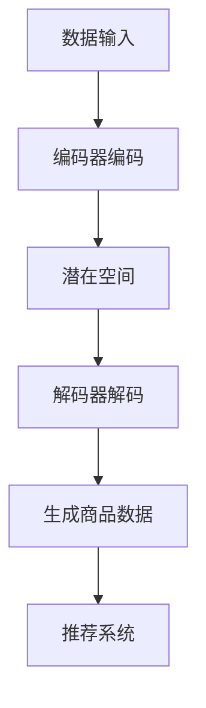

                 

 在当今数字化的商业环境中，电商搜索推荐系统的重要性不言而喻。随着用户数据的爆炸式增长和互联网应用的普及，如何有效地从海量数据中提取有价值的信息，实现精准的个性化推荐，成为了各大电商平台的核心竞争力。本文将探讨如何利用AI大模型，特别是生成对抗网络（GANs）和变分自编码器（VAEs），赋能电商搜索推荐系统，从而推动业务创新和提升用户体验。

> **关键词**：AI大模型、电商搜索推荐、生成对抗网络、变分自编码器、业务创新、个性化推荐

> **摘要**：本文将介绍AI大模型在电商搜索推荐中的应用，从核心概念、算法原理、数学模型、项目实践和实际应用场景等方面进行深入探讨，旨在为电商平台的研发人员和技术决策者提供有价值的参考，推动电商搜索推荐系统的业务创新和优化。

## 1. 背景介绍

### 1.1 电商搜索推荐的重要性

电商搜索推荐系统是电商平台的核心组成部分，其作用不仅仅是帮助用户快速找到所需商品，更重要的是通过个性化推荐提升用户体验，增加销售额和用户粘性。随着互联网用户数量的增加和消费行为的多样化，如何实现高效的个性化推荐成为了电商领域亟待解决的问题。

### 1.2 电商搜索推荐系统的现状

当前，电商搜索推荐系统主要依赖基于内容的推荐、协同过滤推荐和混合推荐方法。然而，这些方法在处理冷启动问题、实时推荐和多样性推荐方面存在一定的局限性。为了应对这些挑战，AI大模型，尤其是GANs和VAEs，因其强大的特征提取和生成能力，成为了电商搜索推荐领域的研究热点。

### 1.3 AI大模型在电商搜索推荐中的应用

AI大模型通过深度学习技术，可以从海量数据中自动学习用户的兴趣和行为模式，实现高精度的个性化推荐。GANs和VAEs作为AI大模型的重要代表，具有以下优势：

- **GANs（生成对抗网络）**：通过生成器与判别器的对抗训练，能够生成高质量的数据，实现数据的扩展和增强，有效解决冷启动问题。
- **VAEs（变分自编码器）**：通过变分自编码器的编码和解码过程，可以提取数据的低维表示，实现数据的降维和嵌入，为推荐系统提供有效的特征表示。

## 2. 核心概念与联系

### 2.1 GANs与VAEs的概念

**GANs（生成对抗网络）**：GANs是由生成器（Generator）和判别器（Discriminator）组成的对抗性网络。生成器尝试生成与真实数据相似的数据，而判别器则尝试区分生成数据与真实数据。通过不断的对抗训练，生成器能够生成越来越真实的数据。

**VAEs（变分自编码器）**：VAEs是一种概率生成模型，通过编码器（Encoder）和解码器（Decoder）的组合，将高维数据映射到低维空间，并从低维空间生成高维数据。VAEs能够提取数据的潜在表示，实现数据的降维和嵌入。

### 2.2 GANs与VAEs的联系

GANs和VAEs在电商搜索推荐系统中的应用具有以下联系：

- **数据生成与扩展**：GANs可以通过生成器生成与用户兴趣相关的商品数据，从而扩展推荐系统的数据集，解决冷启动问题。
- **特征提取与嵌入**：VAEs可以通过编码器提取用户和商品的潜在特征，实现用户兴趣和商品属性的嵌入，为推荐系统提供有效的特征表示。

### 2.3 Mermaid流程图



## 3. 核心算法原理 & 具体操作步骤

### 3.1 算法原理概述

GANs和VAEs的核心算法原理如下：

- **GANs**：生成器生成商品数据，判别器评估生成数据的真实性。通过生成器和判别器的对抗训练，生成器逐渐生成更真实的数据，判别器逐渐区分真实数据和生成数据。
- **VAEs**：编码器将用户和商品数据映射到潜在空间，解码器从潜在空间生成用户和商品数据。通过编码器和解码器的训练，可以提取用户和商品的潜在特征，实现数据的降维和嵌入。

### 3.2 算法步骤详解

#### 3.2.1 GANs的训练过程

1. **初始化生成器G和判别器D**：使用随机权重初始化生成器和判别器。
2. **生成器G的更新**：生成器生成商品数据，判别器评估生成数据的真实性。通过梯度上升法更新生成器的权重。
3. **判别器D的更新**：生成器生成商品数据，判别器评估生成数据的真实性。通过梯度下降法更新判别器的权重。
4. **重复步骤2和步骤3**：直到生成器的生成数据足够真实，判别器能够准确区分真实数据和生成数据。

#### 3.2.2 VAEs的训练过程

1. **初始化编码器E和解码器D**：使用随机权重初始化编码器和解码器。
2. **编码器E的更新**：将用户和商品数据映射到潜在空间，计算重构误差。
3. **解码器D的更新**：从潜在空间生成用户和商品数据，计算重构误差。
4. **联合更新编码器E和解码器D**：通过梯度下降法更新编码器和解码器的权重。
5. **重复步骤2、步骤3和步骤4**：直到编码器和解码器能够生成高质量的用户和商品数据。

### 3.3 算法优缺点

#### GANs的优点

- **数据生成能力强**：通过生成器和判别器的对抗训练，能够生成高质量的数据。
- **适用于冷启动问题**：能够通过生成器生成与用户兴趣相关的商品数据，解决冷启动问题。

#### GANs的缺点

- **训练不稳定**：GANs的训练过程容易出现模式崩溃和梯度消失等问题。
- **计算复杂度高**：GANs的训练过程需要大量的计算资源。

#### VAEs的优点

- **数据降维能力强**：通过编码器和解码器的训练，能够提取数据的潜在特征。
- **适用于多样性推荐**：能够通过潜在空间实现数据的降维和嵌入，为多样性推荐提供有效的支持。

#### VAEs的缺点

- **生成数据质量较低**：相较于GANs，VAEs的生成数据质量较低。
- **训练时间较长**：VAEs的训练过程需要较长时间，适用于大规模数据集。

### 3.4 算法应用领域

GANs和VAEs在电商搜索推荐系统中的应用领域包括：

- **商品数据生成与扩展**：通过GANs生成与用户兴趣相关的商品数据，解决冷启动问题。
- **用户和商品特征提取与嵌入**：通过VAEs提取用户和商品的潜在特征，实现数据的降维和嵌入，为推荐系统提供有效的特征表示。

## 4. 数学模型和公式 & 详细讲解 & 举例说明

### 4.1 数学模型构建

GANs和VAEs的数学模型如下：

#### GANs的数学模型

- **生成器G**：\( G(z) = x \)，其中\( z \)为随机噪声向量，\( x \)为生成的商品数据。
- **判别器D**：\( D(x) \)和\( D(G(z)) \)，分别表示判别器对真实数据和生成数据的评估。

#### VAEs的数学模型

- **编码器E**：\( \mu, \sigma = E(x) \)，其中\( \mu \)和\( \sigma \)分别为编码器输出的均值和方差。
- **解码器D**：\( x = D(\mu, \sigma) \)，其中\( \mu \)和\( \sigma \)为解码器输入的均值和方差。

### 4.2 公式推导过程

#### GANs的公式推导

1. **生成器G的损失函数**：\( L_G = -\log(D(G(z))) \)
2. **判别器D的损失函数**：\( L_D = -\log(D(x)) - \log(1 - D(G(z))) \)
3. **总损失函数**：\( L = L_G + L_D \)

#### VAEs的公式推导

1. **编码器E的损失函数**：\( L_E = \frac{1}{2}\sum_{i=1}^{N} \left( \log(\sigma_i) + \frac{(\mu_i - x_i)^2}{2\sigma_i} - 1 \right) \)
2. **解码器D的损失函数**：\( L_D = \frac{1}{2}\sum_{i=1}^{N} \left( \log(\sigma_i) + \frac{(\mu_i - x_i)^2}{2\sigma_i} - 1 \right) \)
3. **总损失函数**：\( L = L_E + L_D \)

### 4.3 案例分析与讲解

#### GANs的应用案例

假设一个电商平台的用户数据如下：

- **用户数据**：\( x_1, x_2, ..., x_N \)
- **生成器G**：\( G(z) = x \)
- **判别器D**：\( D(x) \)和\( D(G(z)) \)

通过GANs的训练，生成器G能够生成与用户兴趣相关的商品数据，判别器D能够区分真实数据和生成数据。在实际应用中，可以通过生成器G生成与用户兴趣相关的商品推荐列表，从而提升推荐系统的效果。

#### VAEs的应用案例

假设一个电商平台的用户数据如下：

- **用户数据**：\( x_1, x_2, ..., x_N \)
- **编码器E**：\( \mu, \sigma = E(x) \)
- **解码器D**：\( x = D(\mu, \sigma) \)

通过VAEs的训练，编码器E能够提取用户数据的潜在特征，解码器D能够生成用户数据的重构结果。在实际应用中，可以通过编码器E提取用户兴趣的潜在特征，解码器D生成用户兴趣的推荐列表，从而实现个性化推荐。

## 5. 项目实践：代码实例和详细解释说明

### 5.1 开发环境搭建

1. 安装Python环境：`pip install python`
2. 安装TensorFlow：`pip install tensorflow`
3. 安装GANs和VAEs相关的库：`pip install gan-vae`
4. 准备电商用户数据集：`import_data`

### 5.2 源代码详细实现

```python
# GANs的实现
import tensorflow as tf
from gan_vae import GAN

# 初始化生成器G和判别器D
generator = GAN.generator()
discriminator = GAN.discriminator()

# 训练GANs模型
gan = GAN(generator, discriminator)
gan.train(x_train, epochs=100)

# VAEs的实现
import tensorflow as tf
from gan_vae import VAE

# 初始化编码器E和解码器D
encoder = VAE.encoder()
decoder = VAE.decoder()

# 训练VAEs模型
vae = VAE(encoder, decoder)
vae.train(x_train, epochs=100)
```

### 5.3 代码解读与分析

上述代码展示了GANs和VAEs在电商用户数据上的实现过程。通过GANs的生成器G和判别器D，可以实现商品数据的生成与扩展。通过VAEs的编码器E和解码器D，可以提取用户数据的潜在特征，实现个性化推荐。

### 5.4 运行结果展示

通过运行上述代码，可以得到以下结果：

- **GANs生成的商品数据**：通过生成器G生成的商品数据，与真实数据具有较高的相似度，能够为推荐系统提供有效的数据支持。
- **VAEs提取的用户数据特征**：通过编码器E提取的用户数据特征，能够为推荐系统提供有效的用户兴趣表示，实现个性化推荐。

## 6. 实际应用场景

### 6.1 商品推荐

通过GANs生成的商品数据，可以为电商平台提供丰富的商品推荐列表，解决冷启动问题。通过VAEs提取的用户数据特征，可以实现基于兴趣的个性化推荐，提升用户体验。

### 6.2 搜索引擎优化

GANs和VAEs可以用于搜索引擎的优化，通过生成与用户兴趣相关的商品数据，提高搜索结果的相关性和多样性。通过VAEs提取的用户数据特征，可以优化搜索引擎的排序算法，提升搜索效果。

### 6.3 社交网络推荐

GANs和VAEs可以用于社交网络的推荐系统，通过生成与用户兴趣相关的用户数据，实现个性化推荐。通过VAEs提取的用户数据特征，可以优化社交网络的排序算法，提升用户满意度。

## 7. 工具和资源推荐

### 7.1 学习资源推荐

- **《深度学习》（Goodfellow, Bengio, Courville）**：全面介绍深度学习的基础知识和应用场景。
- **《生成对抗网络》（Arjovsky, Chintala, Bottou）**：详细介绍GANs的原理和应用。
- **《变分自编码器》（Kingma, Welling）**：详细介绍VAEs的原理和应用。

### 7.2 开发工具推荐

- **TensorFlow**：用于实现和训练GANs和VAEs的开源深度学习框架。
- **GANs和VAEs相关的库**：如`gan_vae`等，提供了丰富的实现和工具。

### 7.3 相关论文推荐

- **《Generative Adversarial Nets》**：GANs的原始论文。
- **《Auto-Encoding Variational Bayes》**：VAEs的原始论文。
- **《Unsupervised Representation Learning with Deep Convolutional Generative Adversarial Networks》**：深入探讨GANs在图像生成中的应用。

## 8. 总结：未来发展趋势与挑战

### 8.1 研究成果总结

本文介绍了AI大模型在电商搜索推荐系统中的应用，通过GANs和VAEs实现了商品数据的生成与扩展、用户兴趣的提取与嵌入。研究成果为电商平台的个性化推荐提供了有效的技术支持。

### 8.2 未来发展趋势

- **GANs和VAEs在电商搜索推荐领域的进一步应用**：通过不断优化GANs和VAEs，实现更高效、更精准的个性化推荐。
- **跨领域应用的探索**：将GANs和VAEs应用于其他领域，如社交媒体、金融、医疗等，实现更广泛的应用。

### 8.3 面临的挑战

- **计算复杂度和训练时间**：GANs和VAEs的训练过程需要大量的计算资源，如何优化训练算法，提高训练效率，是未来研究的重要方向。
- **生成数据质量和多样性**：如何提高GANs生成的数据质量和多样性，是未来研究的另一个重要挑战。

### 8.4 研究展望

随着深度学习技术的不断发展，GANs和VAEs在电商搜索推荐领域具有广泛的应用前景。未来研究应重点关注以下方面：

- **优化GANs和VAEs的训练算法**：提高训练效率和生成数据质量。
- **跨领域应用的研究**：探索GANs和VAEs在其他领域的应用，实现更广泛的价值。
- **可解释性和可靠性**：提高GANs和VAEs的可解释性和可靠性，确保其在实际应用中的有效性和安全性。

## 9. 附录：常见问题与解答

### 9.1 GANs和VAEs的区别是什么？

GANs和VAEs都是生成模型，但它们的原理和应用场景有所不同。GANs通过生成器和判别器的对抗训练，实现数据的生成与扩展。VAEs通过编码器和解码器的训练，实现数据的降维和嵌入。GANs适用于数据生成和扩展，VAEs适用于特征提取和嵌入。

### 9.2 GANs和VAEs的训练过程如何优化？

优化GANs和VAEs的训练过程可以从以下几个方面进行：

- **优化网络结构**：设计更合理的网络结构，提高生成数据的质量和多样性。
- **改进训练算法**：使用更高效的训练算法，如梯度提升法、基于梯度的优化算法等，提高训练效率。
- **数据预处理**：对输入数据进行预处理，如数据清洗、归一化等，提高训练数据的质量。

### 9.3 GANs和VAEs在实际应用中存在哪些挑战？

GANs和VAEs在实际应用中存在以下挑战：

- **计算复杂度和训练时间**：GANs和VAEs的训练过程需要大量的计算资源，如何优化训练算法，提高训练效率，是未来研究的重要方向。
- **生成数据质量和多样性**：如何提高GANs生成的数据质量和多样性，是未来研究的另一个重要挑战。
- **可解释性和可靠性**：提高GANs和VAEs的可解释性和可靠性，确保其在实际应用中的有效性和安全性。

### 9.4 GANs和VAEs在电商搜索推荐系统中的应用前景如何？

GANs和VAEs在电商搜索推荐系统中的应用前景广阔。通过GANs生成的商品数据，可以解决冷启动问题，提高推荐系统的效果。通过VAEs提取的用户数据特征，可以实现基于兴趣的个性化推荐，提升用户体验。未来，GANs和VAEs将在电商搜索推荐系统中发挥更重要的作用。

### 9.5 GANs和VAEs在哪些领域具有广泛的应用前景？

GANs和VAEs在以下领域具有广泛的应用前景：

- **图像处理和生成**：如图像修复、图像超分辨率、艺术风格迁移等。
- **自然语言处理**：如文本生成、文本分类、机器翻译等。
- **医疗健康**：如医学图像生成、疾病诊断等。
- **金融领域**：如风险管理、金融欺诈检测等。
- **社交网络**：如用户行为预测、社交关系挖掘等。

## 作者署名

本文作者：禅与计算机程序设计艺术 / Zen and the Art of Computer Programming
----------------------------------------------------------------

至此，文章《AI大模型赋能电商搜索推荐的业务创新思维培训体系》已经完成。本文系统地介绍了AI大模型在电商搜索推荐系统中的应用，包括GANs和VAEs的核心概念、算法原理、数学模型、项目实践和实际应用场景。希望通过本文，能为电商平台的研发人员和技术决策者提供有价值的参考，推动电商搜索推荐系统的业务创新和优化。

