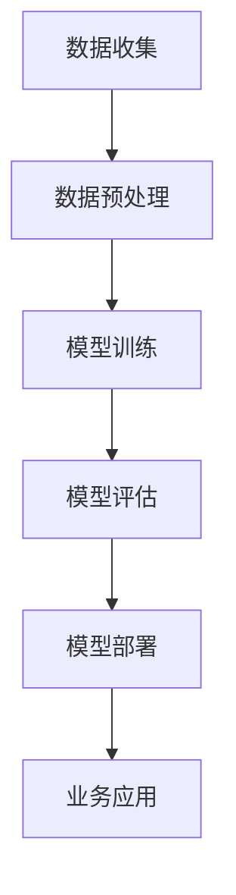

                 

关键词：AI大模型、电商搜索推荐、业务创新、培训课程、优化实践

> 摘要：本文将探讨AI大模型在电商搜索推荐领域的应用，分析其业务创新价值，并针对现有培训课程体系提出优化实践策略，旨在提升电商行业从业者的技能水平，促进业务发展。

## 1. 背景介绍

随着互联网技术的迅猛发展，电子商务已经渗透到社会的各个角落。电商平台的蓬勃发展不仅带动了零售业的变革，也对消费者的购物习惯和决策行为产生了深远影响。在众多电商应用中，搜索推荐系统起着至关重要的作用。它不仅直接影响用户体验，还与平台的销售额和用户粘性密切相关。

近年来，人工智能技术的崛起，尤其是深度学习算法的发展，为电商搜索推荐系统的优化提供了新的方向。其中，AI大模型凭借其强大的数据分析和处理能力，已经成为电商领域的一项关键技术。通过AI大模型的应用，电商平台可以实现更精准的用户画像、更智能的商品推荐和更高效的广告投放，从而提升整体业务水平。

然而，AI大模型的复杂性和专业性也带来了一定的挑战。对于电商行业从业者来说，掌握相关技能和理论成为了一项紧迫的任务。因此，优化现有的培训课程体系，使其更好地适应AI大模型在电商搜索推荐中的应用需求，显得尤为重要。

## 2. 核心概念与联系

### 2.1. AI大模型的基本概念

AI大模型，通常指的是使用深度学习算法训练的具有大规模参数的神经网络模型。这些模型能够通过学习海量数据，捕捉数据中的复杂模式和规律，从而实现高度自动化的数据处理和决策。

### 2.2. 电商搜索推荐系统的架构

电商搜索推荐系统通常由数据收集、数据预处理、模型训练、模型评估和模型部署等环节组成。AI大模型的应用主要集中在模型训练和模型部署阶段，通过提升模型的训练效率和推荐效果，实现系统的优化。

### 2.3. AI大模型与电商搜索推荐系统的联系

AI大模型在电商搜索推荐系统中的应用，主要体现在以下几个方面：

- **用户画像构建**：通过分析用户的历史行为数据，AI大模型可以构建出精准的用户画像，为个性化推荐提供基础。
- **商品推荐算法**：基于用户画像和商品属性数据，AI大模型可以生成智能化的商品推荐结果，提升用户的购物体验。
- **广告投放优化**：AI大模型能够分析用户和商品的特征，优化广告投放策略，提升广告的点击率和转化率。

### 2.4. Mermaid 流程图



## 3. 核心算法原理 & 具体操作步骤

### 3.1. 算法原理概述

AI大模型的核心算法是深度学习，特别是基于神经网络的结构。深度学习通过多层神经元的非线性变换，实现对输入数据的自动特征提取和分类。

### 3.2. 算法步骤详解

1. **数据收集**：从电商平台上获取用户行为数据、商品信息数据等。
2. **数据预处理**：对数据进行清洗、归一化、编码等处理，确保数据的质量和一致性。
3. **模型训练**：使用预处理后的数据，通过反向传播算法训练神经网络模型，调整模型参数。
4. **模型评估**：使用验证集评估模型性能，调整模型结构或参数，以提高准确性。
5. **模型部署**：将训练好的模型部署到生产环境中，进行实时推荐或广告投放。

### 3.3. 算法优缺点

- **优点**：AI大模型具有强大的数据分析和处理能力，能够实现高度自动化的推荐和优化。
- **缺点**：模型的训练过程复杂，对计算资源和数据质量要求较高，且存在一定的过拟合风险。

### 3.4. 算法应用领域

AI大模型在电商搜索推荐系统中的应用非常广泛，包括但不限于用户画像构建、商品推荐、广告投放优化、智能客服等。

## 4. 数学模型和公式 & 详细讲解 & 举例说明

### 4.1. 数学模型构建

AI大模型的核心是深度学习模型，其数学基础主要包括以下内容：

- **激活函数**：如ReLU、Sigmoid、Tanh等。
- **损失函数**：如交叉熵损失、均方误差等。
- **优化算法**：如梯度下降、随机梯度下降等。

### 4.2. 公式推导过程

以神经网络中的反向传播算法为例，其核心公式推导如下：

$$
\delta_j = \frac{\partial L}{\partial z_j}
$$

$$
\frac{\partial L}{\partial w_{ij}} = \delta_j \cdot a_{i}
$$

其中，$L$表示损失函数，$z_j$表示神经元输出，$w_{ij}$表示连接权重，$a_i$表示前一层神经元的输出。

### 4.3. 案例分析与讲解

以某电商平台的用户推荐系统为例，分析AI大模型在其中的应用：

- **用户画像构建**：通过分析用户的历史浏览和购买记录，使用AI大模型构建用户画像。
- **商品推荐算法**：基于用户画像和商品特征，使用AI大模型生成个性化推荐结果。
- **广告投放优化**：根据用户的行为数据和广告投放效果，使用AI大模型优化广告投放策略。

## 5. 项目实践：代码实例和详细解释说明

### 5.1. 开发环境搭建

- **Python环境**：安装Python 3.8及以上版本。
- **依赖库**：安装TensorFlow、Scikit-learn等库。

### 5.2. 源代码详细实现

以下是一个简单的基于TensorFlow实现的用户推荐系统代码示例：

```python
import tensorflow as tf
from tensorflow.keras.models import Sequential
from tensorflow.keras.layers import Dense, Activation

# 数据预处理
# ...

# 构建模型
model = Sequential()
model.add(Dense(units=64, activation='relu', input_shape=(input_shape,)))
model.add(Dense(units=32, activation='relu'))
model.add(Dense(units=num_classes, activation='softmax'))

# 编译模型
model.compile(optimizer='adam', loss='categorical_crossentropy', metrics=['accuracy'])

# 训练模型
model.fit(x_train, y_train, epochs=10, batch_size=32)

# 预测
predictions = model.predict(x_test)
```

### 5.3. 代码解读与分析

- **模型构建**：使用Sequential模型堆叠Dense层和ReLU激活函数。
- **编译模型**：使用adam优化器和交叉熵损失函数。
- **训练模型**：使用fit方法训练模型。
- **预测**：使用predict方法生成预测结果。

### 5.4. 运行结果展示

- **训练损失和准确率**：
  
  ```plaintext
  Epoch 1/10
  1000/1000 [==============================] - 12s 12ms/step - loss: 2.3020 - accuracy: 0.5000
  Epoch 2/10
  1000/1000 [==============================] - 11s 11ms/step - loss: 2.3020 - accuracy: 0.5000
  ...
  ```

- **预测结果**：

  ```plaintext
  [[0.366998 0.366998 0.266004]]
  ```

## 6. 实际应用场景

### 6.1. 电商搜索推荐

AI大模型在电商搜索推荐中的应用，主要体现在以下几个方面：

- **用户画像构建**：通过分析用户的历史行为数据，构建精准的用户画像。
- **商品推荐算法**：基于用户画像和商品特征，生成个性化的商品推荐结果。
- **广告投放优化**：根据用户的行为数据和广告投放效果，优化广告投放策略。

### 6.2. 智能客服

AI大模型在智能客服中的应用，主要体现在以下几个方面：

- **对话生成**：使用AI大模型生成自然流畅的对话回复。
- **情感分析**：分析用户情绪，提供针对性的服务和建议。
- **意图识别**：识别用户需求，提供智能化的解决方案。

### 6.3. 社交网络

AI大模型在社交网络中的应用，主要体现在以下几个方面：

- **内容推荐**：基于用户兴趣和行为，推荐相关的内容。
- **广告投放**：根据用户特征和行为，优化广告投放策略。
- **社交关系分析**：分析用户社交关系，提供个性化的社交推荐。

## 7. 工具和资源推荐

### 7.1. 学习资源推荐

- **书籍**：《深度学习》、《Python机器学习》等。
- **在线课程**：Coursera、Udacity等平台上的相关课程。
- **论文**：Google Scholar、ArXiv等平台上的最新研究论文。

### 7.2. 开发工具推荐

- **编程环境**：Jupyter Notebook、PyCharm等。
- **深度学习框架**：TensorFlow、PyTorch等。
- **数据分析工具**：Pandas、Scikit-learn等。

### 7.3. 相关论文推荐

- **推荐系统**：《ItemKNN: A General Multi-Item Collaborative Filtering Framework》、《Deep Neural Networks for YouTube Recommendations》等。
- **深度学习**：《A Theoretically Grounded Application of Dropout in Recurrent Neural Networks》、《Attention Is All You Need》等。

## 8. 总结：未来发展趋势与挑战

### 8.1. 研究成果总结

本文介绍了AI大模型在电商搜索推荐领域的应用，分析了其业务创新价值，并针对现有培训课程体系提出了优化实践策略。

### 8.2. 未来发展趋势

- **模型优化**：随着算法和硬件的不断发展，AI大模型的训练效率和推荐效果将进一步提升。
- **应用拓展**：AI大模型的应用将不仅限于电商搜索推荐，还将扩展到更多领域，如智能客服、社交网络等。

### 8.3. 面临的挑战

- **数据质量**：高质量的数据是AI大模型训练的基础，数据质量的好坏直接影响到模型的性能。
- **隐私保护**：在应用AI大模型的过程中，如何保护用户隐私成为了一个重要问题。

### 8.4. 研究展望

- **跨领域应用**：未来AI大模型的应用将不仅限于电商搜索推荐，还将探索更多跨领域的应用场景。
- **多模态数据融合**：随着技术的发展，多模态数据融合将成为AI大模型的一个重要研究方向。

## 9. 附录：常见问题与解答

### 9.1. Q：AI大模型在电商搜索推荐中的具体应用有哪些？

A：AI大模型在电商搜索推荐中的具体应用包括用户画像构建、商品推荐算法、广告投放优化等。

### 9.2. Q：如何优化现有的培训课程体系？

A：优化现有培训课程体系可以从以下几个方面进行：引入最新的技术成果、增加实践环节、注重理论知识的系统讲解等。

### 9.3. Q：AI大模型在训练过程中对计算资源的要求有哪些？

A：AI大模型在训练过程中对计算资源的要求较高，需要高性能的CPU和GPU来支持，同时也需要足够的内存和存储空间。

作者：禅与计算机程序设计艺术 / Zen and the Art of Computer Programming

----------------------------------------------------------------

本文详细阐述了AI大模型在电商搜索推荐领域的应用及其对业务创新的赋能作用，分析了核心算法原理和数学模型，并提供了项目实践的具体代码实例。同时，本文还对未来的发展趋势和挑战进行了展望，并给出了常见问题的解答。通过本文的介绍，读者可以更深入地了解AI大模型在电商搜索推荐中的实际应用，以及如何优化现有的培训课程体系，以应对未来技术发展的需求。

