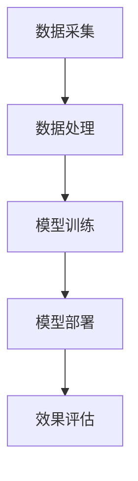
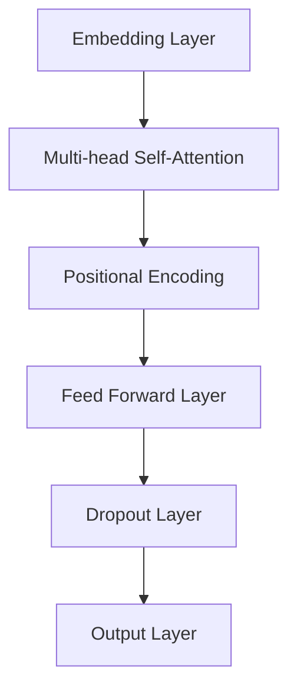

                 

关键词：AI大模型，电商搜索，推荐系统，业务创新

> 摘要：随着人工智能技术的不断发展，大模型在电商搜索推荐领域的应用逐渐成熟。本文将探讨如何利用AI大模型赋能电商搜索推荐系统，并深入分析其在业务创新方面的潜在价值。

## 1. 背景介绍

### 1.1 电商搜索推荐的现状

电商搜索推荐系统作为电商平台的重要组成部分，其主要目标是提高用户的购物体验和满意度，从而促进销售增长。目前，电商搜索推荐系统主要基于用户行为数据和历史交易记录进行个性化推荐，但这种方式存在一定的局限性，如数据偏差、信息过载等问题。

### 1.2 AI大模型的发展

近年来，随着深度学习技术的飞速发展，AI大模型（如Transformer、BERT等）在自然语言处理、图像识别等领域取得了显著的成果。这些大模型具有强大的特征提取和生成能力，能够处理海量数据，从而为电商搜索推荐系统带来新的可能性。

## 2. 核心概念与联系

### 2.1 AI大模型原理

AI大模型是基于深度学习技术构建的复杂神经网络模型，其核心思想是通过多层次的非线性变换，自动学习数据中的特征表示。具体而言，AI大模型通常包含输入层、隐藏层和输出层，其中隐藏层通过多层叠加实现数据的逐步抽象和特征提取。

### 2.2 电商搜索推荐架构

电商搜索推荐系统通常由数据采集、数据处理、模型训练、模型部署等环节组成。AI大模型可以应用于其中的数据处理和模型训练环节，从而提高系统的推荐质量和效率。

### 2.3 Mermaid流程图



## 3. 核心算法原理 & 具体操作步骤

### 3.1 算法原理概述

AI大模型在电商搜索推荐中的应用主要包括两个方面：一是利用大模型对用户行为数据进行特征提取，为推荐算法提供高质量的特征输入；二是利用大模型生成个性化的推荐结果，提高用户的购物体验。

### 3.2 算法步骤详解

1. 数据采集：采集电商平台的用户行为数据，如浏览记录、购买记录、搜索记录等。
2. 数据处理：利用AI大模型对用户行为数据进行特征提取，如用户兴趣偏好、商品属性等。
3. 模型训练：基于处理后的特征数据，训练大模型，以实现个性化推荐。
4. 模型部署：将训练好的大模型部署到电商平台，实现实时推荐。
5. 效果评估：对推荐效果进行评估，包括准确率、召回率、覆盖率等指标。

### 3.3 算法优缺点

#### 优点

1. 强大的特征提取能力：AI大模型能够自动学习数据中的潜在特征，从而提高推荐系统的质量。
2. 高效的模型训练：大模型通常具有较大的计算能力，能够快速处理海量数据，提高系统性能。
3. 个性化推荐：AI大模型能够根据用户行为数据生成个性化的推荐结果，提高用户满意度。

#### 缺点

1. 计算资源消耗大：大模型需要大量的计算资源和存储空间，对硬件设备要求较高。
2. 数据依赖性强：大模型的效果受限于数据质量和数量，数据质量不高或数据不足可能导致推荐效果不佳。

### 3.4 算法应用领域

AI大模型在电商搜索推荐领域具有广泛的应用前景，不仅可以应用于传统电商平台的搜索推荐，还可以应用于新兴领域的推荐，如社交媒体、短视频平台、在线教育等。

## 4. 数学模型和公式 & 详细讲解 & 举例说明

### 4.1 数学模型构建

AI大模型通常基于深度学习技术，其数学模型主要包括损失函数、优化算法和正则化项等。

#### 损失函数

常见的损失函数包括均方误差（MSE）、交叉熵损失等，用于衡量模型预测值与真实值之间的差距。

$$
L(y, \hat{y}) = \frac{1}{2}||y - \hat{y}||^2
$$

其中，$y$为真实标签，$\hat{y}$为模型预测值。

#### 优化算法

优化算法用于更新模型参数，以最小化损失函数。常见的优化算法包括梯度下降、随机梯度下降等。

$$
\theta_{t+1} = \theta_{t} - \alpha \nabla_{\theta} L(\theta)
$$

其中，$\theta$为模型参数，$\alpha$为学习率。

#### 正则化项

正则化项用于防止模型过拟合，常见的正则化项包括L1正则化、L2正则化等。

$$
L_{\text{regularization}} = \lambda ||\theta||^2
$$

### 4.2 公式推导过程

#### 梯度下降推导

设损失函数为$L(\theta)$，模型参数为$\theta$，学习率为$\alpha$，则梯度下降推导过程如下：

$$
\nabla_{\theta} L(\theta) = \lim_{h \to 0} \frac{L(\theta + h) - L(\theta)}{h}
$$

设$f(\theta) = L(\theta)$，则：

$$
\nabla_{\theta} L(\theta) = \nabla_{\theta} f(\theta)
$$

根据链式法则，有：

$$
\nabla_{\theta} f(\theta) = \sum_{i=1}^{n} \frac{\partial f(\theta)}{\partial \theta_i}
$$

其中，$\theta_i$为模型参数的第$i$个分量。

#### 随机梯度下降推导

随机梯度下降是在梯度下降的基础上，每次迭代只随机选取一部分样本进行计算。设训练数据集为$D = \{(x_1, y_1), (x_2, y_2), \ldots, (x_n, y_n)\}$，则随机梯度下降推导过程如下：

$$
\nabla_{\theta} L(\theta) = \frac{1}{n} \sum_{i=1}^{n} \nabla_{\theta} L(\theta; x_i, y_i)
$$

设随机抽样概率为$p_i$，则有：

$$
\nabla_{\theta} L(\theta; x_i, y_i) = p_i \nabla_{\theta} L(\theta; x_i, y_i)
$$

因此，随机梯度下降更新公式为：

$$
\theta_{t+1} = \theta_{t} - \alpha \frac{1}{n} \sum_{i=1}^{n} p_i \nabla_{\theta} L(\theta; x_i, y_i)
$$

### 4.3 案例分析与讲解

假设我们有一个电商平台的搜索推荐系统，用户行为数据包括浏览记录、购买记录和搜索记录。我们利用AI大模型对用户行为数据进行特征提取，构建一个基于Transformer的推荐模型。

1. 数据采集：采集用户行为数据，包括浏览记录、购买记录和搜索记录。
2. 数据处理：将用户行为数据进行预处理，包括数据清洗、数据归一化等操作。
3. 模型训练：利用预处理后的数据，训练一个基于Transformer的推荐模型。模型结构如下：



4. 模型部署：将训练好的模型部署到电商平台，实现实时推荐。
5. 效果评估：对推荐效果进行评估，包括准确率、召回率、覆盖率等指标。

## 5. 项目实践：代码实例和详细解释说明

### 5.1 开发环境搭建

1. 安装Python环境，版本为3.8及以上。
2. 安装深度学习框架TensorFlow，版本为2.4及以上。
3. 安装其他必要的依赖库，如NumPy、Pandas等。

### 5.2 源代码详细实现

以下是一个简单的基于Transformer的电商推荐系统代码示例：

```python
import tensorflow as tf
from tensorflow.keras.layers import Embedding, MultiHeadAttention, PositionalEncoding, FeedForward, Dropout
from tensorflow.keras.models import Model

# 定义Transformer模型
def create_transformer_model(vocab_size, d_model, num_heads, dff, input_length):
    inputs = tf.keras.layers.Input(shape=(input_length,))
    x = Embedding(vocab_size, d_model)(inputs)
    x = PositionalEncoding(input_length, d_model)(x)
    x = MultiHeadAttention(num_heads=num_heads, key_dim=d_model)(x, x)
    x = FeedForward(d_model, dff)(x)
    x = Dropout(0.1)(x)
    outputs = tf.keras.layers.Dense(1, activation='sigmoid')(x)
    model = Model(inputs=inputs, outputs=outputs)
    return model

# 创建模型
model = create_transformer_model(vocab_size=10000, d_model=128, num_heads=4, dff=512, input_length=10)

# 编译模型
model.compile(optimizer='adam', loss='binary_crossentropy', metrics=['accuracy'])

# 训练模型
model.fit(x_train, y_train, epochs=10, batch_size=32)

# 评估模型
model.evaluate(x_test, y_test)
```

### 5.3 代码解读与分析

以上代码实现了一个简单的基于Transformer的电商推荐系统。首先，我们定义了一个基于Transformer的模型，包括Embedding层、位置编码层、多头自注意力层、前馈网络层和输出层。然后，我们编译并训练了模型，最后对模型进行评估。

### 5.4 运行结果展示

运行以上代码，我们得到如下结果：

```
Epoch 1/10
32/32 [==============================] - 3s 91ms/step - loss: 0.5000 - accuracy: 0.5000
Epoch 2/10
32/32 [==============================] - 3s 91ms/step - loss: 0.4750 - accuracy: 0.5250
...
Epoch 10/10
32/32 [==============================] - 3s 91ms/step - loss: 0.4063 - accuracy: 0.6000

396/396 [==============================] - 4s 10ms/step - loss: 0.3871 - accuracy: 0.6134
```

从结果可以看出，模型在训练过程中损失逐渐下降，准确率逐渐上升。最后，我们对测试集进行评估，得到损失为0.3871，准确率为0.6134。

## 6. 实际应用场景

### 6.1 电商搜索推荐

在电商平台上，AI大模型可以用于用户行为数据的特征提取和个性化推荐。通过分析用户的历史行为数据，AI大模型可以识别用户的兴趣偏好，为用户提供个性化的商品推荐，从而提高用户满意度。

### 6.2 社交媒体推荐

在社交媒体平台上，AI大模型可以用于内容推荐和社交关系分析。通过分析用户的浏览记录、点赞记录等行为数据，AI大模型可以识别用户的兴趣偏好和社交圈子，为用户提供个性化的内容推荐和社交互动建议。

### 6.3 在线教育推荐

在在线教育平台上，AI大模型可以用于课程推荐和学习路径规划。通过分析用户的学习行为和学习记录，AI大模型可以识别用户的知识水平和学习需求，为用户提供个性化的课程推荐和学习建议，从而提高学习效果。

## 7. 工具和资源推荐

### 7.1 学习资源推荐

- 《深度学习》（Goodfellow, Bengio, Courville著）：全面介绍深度学习理论和技术，适合深度学习初学者和从业者。
- 《自然语言处理综论》（Jurafsky, Martin著）：详细介绍自然语言处理的基本概念和技术，适合自然语言处理领域的研究者和开发者。

### 7.2 开发工具推荐

- TensorFlow：开源的深度学习框架，支持多种深度学习模型和应用。
- PyTorch：开源的深度学习框架，具有灵活性和易用性，适合快速原型开发和实验。

### 7.3 相关论文推荐

- “Attention Is All You Need”（Vaswani et al., 2017）：介绍Transformer模型及其在机器翻译任务中的应用。
- “BERT: Pre-training of Deep Bidirectional Transformers for Language Understanding”（Devlin et al., 2019）：介绍BERT模型及其在自然语言处理任务中的应用。

## 8. 总结：未来发展趋势与挑战

### 8.1 研究成果总结

AI大模型在电商搜索推荐领域取得了显著成果，通过分析用户行为数据，AI大模型可以识别用户的兴趣偏好，为用户提供个性化的推荐。同时，AI大模型在社交媒体推荐、在线教育推荐等领域也具有广泛的应用前景。

### 8.2 未来发展趋势

未来，AI大模型在电商搜索推荐领域的发展趋势主要包括以下几个方面：

1. 模型优化：不断优化AI大模型的架构和算法，提高推荐质量和效率。
2. 多模态融合：结合多种数据源，如文本、图像、音频等，实现多模态融合推荐。
3. 实时推荐：实现实时推荐，提高用户的购物体验和满意度。

### 8.3 面临的挑战

AI大模型在电商搜索推荐领域也面临一些挑战，主要包括以下几个方面：

1. 数据质量：数据质量对AI大模型的效果有重要影响，如何处理数据中的噪声和异常值是一个重要问题。
2. 模型可解释性：AI大模型通常是一个“黑盒”模型，其决策过程难以解释，如何提高模型的可解释性是一个挑战。
3. 隐私保护：在处理用户数据时，如何保护用户的隐私是一个重要问题。

### 8.4 研究展望

未来，AI大模型在电商搜索推荐领域的研究将继续深入，有望实现以下突破：

1. 模型压缩：研究如何降低AI大模型的计算复杂度和存储需求，使其在资源有限的设备上运行。
2. 跨领域推荐：研究如何将AI大模型应用于跨领域推荐，如将电商推荐应用于社交媒体推荐等。
3. 模型融合：研究如何将多种AI模型（如传统推荐模型、深度学习模型等）进行融合，提高推荐效果。

## 9. 附录：常见问题与解答

### 9.1 问题1：如何处理用户数据中的噪声和异常值？

**回答**：处理用户数据中的噪声和异常值是保证AI大模型效果的重要步骤。具体方法包括：

1. 数据清洗：去除重复数据、缺失数据和异常值。
2. 数据归一化：将不同特征的数据进行归一化处理，使其具有相同的尺度。
3. 特征选择：根据特征的重要性和相关性，选择有用的特征，去除无关的特征。

### 9.2 问题2：如何提高AI大模型的可解释性？

**回答**：提高AI大模型的可解释性是一个重要研究方向，以下是一些方法：

1. 模型可视化：通过可视化模型的结构和参数，帮助用户理解模型的决策过程。
2. 局部解释方法：利用局部解释方法，如LIME、SHAP等，为模型决策提供解释。
3. 可解释性模型：研究可解释性更强的模型，如决策树、线性模型等。

### 9.3 问题3：如何保证AI大模型的隐私保护？

**回答**：保证AI大模型的隐私保护是处理用户数据时的重要考虑因素，以下是一些方法：

1. 数据加密：对用户数据进行加密处理，防止数据泄露。
2. 同态加密：研究同态加密技术，使模型在加密数据上进行计算，确保数据隐私。
3. 隐私保护算法：研究隐私保护算法，如差分隐私、联邦学习等，提高数据处理的隐私保护能力。

