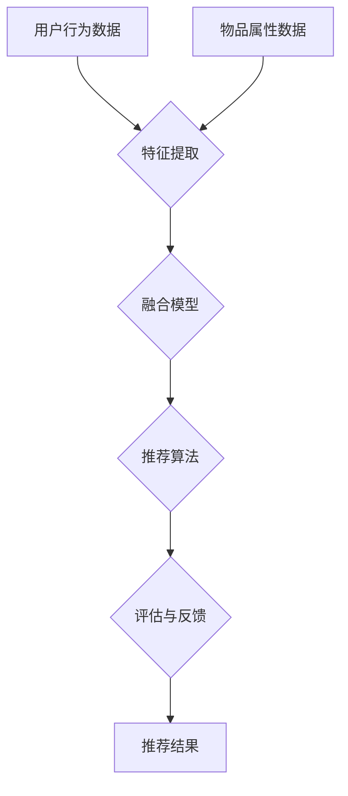

                 

## 1. 背景介绍

随着互联网技术的飞速发展和电商行业的持续繁荣，电子商务平台的竞争愈发激烈。如何在海量商品信息中为用户精准推荐适合的商品，已经成为电商企业提升用户体验、增加销售额的关键问题。传统的搜索推荐算法往往依赖于用户的历史行为和商品属性，但往往难以应对复杂多变的市场环境。因此，如何利用人工智能大模型来赋能电商搜索推荐，成为了一个亟待解决的重要课题。

本文旨在探讨基于AI大模型赋能电商搜索推荐的业务创新流程优化项目实施方案。通过深入分析现有搜索推荐系统存在的问题，提出一种基于AI大模型的优化方案，并详细阐述其实施步骤、关键技术和应用效果。本文的结构如下：

- **第1章**：背景介绍，概述电商搜索推荐的重要性和现有问题的挑战。
- **第2章**：核心概念与联系，介绍AI大模型的基础概念和推荐系统的基本架构。
- **第3章**：核心算法原理与具体操作步骤，详细描述AI大模型的算法原理和实现流程。
- **第4章**：数学模型和公式，介绍支持AI大模型训练的数学模型和推导过程。
- **第5章**：项目实践：代码实例和详细解释说明，提供实际开发过程中的代码实现和分析。
- **第6章**：实际应用场景，探讨AI大模型在电商搜索推荐中的实际应用效果。
- **第7章**：工具和资源推荐，推荐学习资源和开发工具。
- **第8章**：总结：未来发展趋势与挑战，对研究成果进行总结，并探讨未来发展方向和挑战。
- **第9章**：附录：常见问题与解答，针对读者可能遇到的问题进行解答。

希望通过本文的介绍，能够为电商企业利用AI大模型进行搜索推荐提供有益的参考和指导。

## 2. 核心概念与联系

### AI大模型的概念

人工智能大模型（Large-scale Artificial Intelligence Model）是指具有海量参数、复杂结构和强大计算能力的深度学习模型。它通常基于神经网络架构，能够通过大量的数据训练，提取出复杂的数据特征，并在多种任务中表现出优异的性能。AI大模型在自然语言处理、计算机视觉、语音识别等领域取得了显著的突破，成为当前人工智能领域的研究热点。

### 推荐系统的基本架构

推荐系统（Recommender System）是一种利用用户历史行为和物品属性为用户提供个性化推荐服务的系统。其基本架构包括以下几个关键组件：

- **用户表示**：将用户行为和特征转化为向量表示，以便模型能够理解和处理。
- **物品表示**：将商品属性、用户评价等信息转化为向量表示，用于模型训练和推荐。
- **推荐算法**：利用机器学习或深度学习算法，从用户和物品的向量表示中生成推荐结果。
- **评估与反馈**：对推荐结果进行评估，并根据用户反馈进行优化。

### AI大模型与推荐系统的关系

AI大模型在推荐系统中扮演着核心角色，其主要关系如下：

1. **特征提取与融合**：AI大模型可以通过深度学习算法自动提取用户和物品的潜在特征，并实现特征的高效融合，从而提升推荐质量。
2. **动态调整**：基于用户行为和反馈，AI大模型能够动态调整推荐策略，实现个性化推荐。
3. **扩展性**：AI大模型具有较强的扩展性，可以适应不同类型和应用场景的推荐需求。
4. **实时性**：通过模型优化和算法改进，AI大模型可以实现实时推荐，提高用户体验。

### Mermaid 流程图

为了更清晰地展示AI大模型与推荐系统的关系，我们使用Mermaid流程图进行描述。以下是流程图的文本表示：



在上述流程中，用户行为数据和物品属性数据经过特征提取和融合模型处理，生成推荐结果。同时，评估与反馈环节对推荐结果进行优化，实现推荐系统的持续改进。

通过以上对核心概念和架构的介绍，我们为后续章节的深入探讨奠定了基础。接下来，我们将详细分析AI大模型的核心算法原理和具体操作步骤。

## 3. 核心算法原理 & 具体操作步骤

### 3.1 算法原理概述

AI大模型在电商搜索推荐中的应用，主要基于以下核心算法原理：

1. **深度学习**：通过多层神经网络结构，对用户行为数据和物品属性数据进行自动特征提取和融合。
2. **矩阵分解**：利用矩阵分解技术，将用户-物品交互数据表示为用户特征矩阵和物品特征矩阵，实现用户和物品的潜在特征表示。
3. **协同过滤**：结合基于内容的推荐和基于协同过滤的推荐，提高推荐系统的准确性和多样性。
4. **多任务学习**：通过多任务学习框架，同时训练多个任务，提升模型在复杂场景下的泛化能力。

### 3.2 算法步骤详解

AI大模型的算法实现通常包括以下几个关键步骤：

1. **数据预处理**：
   - **用户行为数据**：收集用户在电商平台的点击、购买、收藏等行为数据，并将其转化为向量表示。
   - **物品属性数据**：提取商品的属性信息，如类别、品牌、价格等，并转化为向量表示。
   - **数据清洗**：对数据进行去重、去噪声、缺失值填充等处理，确保数据质量。

2. **特征提取与融合**：
   - **用户特征提取**：利用深度学习算法（如卷积神经网络、循环神经网络等），从用户行为数据中提取潜在特征。
   - **物品特征提取**：同样地，从物品属性数据中提取潜在特征。
   - **特征融合**：通过矩阵分解或融合神经网络，将用户特征和物品特征进行整合，生成高维特征向量。

3. **模型训练**：
   - **构建模型**：结合深度学习、矩阵分解、协同过滤等多层模型结构，构建AI大模型。
   - **模型训练**：利用预处理后的数据，对AI大模型进行训练，优化模型参数。
   - **模型评估**：通过交叉验证、A/B测试等方法，对模型性能进行评估和调优。

4. **推荐生成**：
   - **用户表示**：将用户行为数据和特征提取结果进行融合，生成用户表示向量。
   - **物品表示**：将物品属性数据和特征提取结果进行融合，生成物品表示向量。
   - **推荐计算**：通过计算用户表示向量和物品表示向量的相似度，生成推荐结果。

5. **评估与反馈**：
   - **推荐结果评估**：对生成的推荐结果进行评估，如准确率、召回率、多样性等指标。
   - **用户反馈**：收集用户对推荐结果的反馈，用于模型优化和调整。

### 3.3 算法优缺点

**优点**：

- **高效特征提取**：通过深度学习和矩阵分解技术，能够高效地从海量数据中提取用户和物品的潜在特征。
- **个性化推荐**：基于用户行为和反馈，能够实现个性化、精准的推荐。
- **扩展性强**：支持多种推荐算法和任务，如基于内容的推荐、协同过滤、多任务学习等，适应不同场景和应用需求。

**缺点**：

- **计算资源需求大**：AI大模型通常需要大量的计算资源和存储空间，对硬件要求较高。
- **数据依赖性强**：模型性能依赖于数据质量和规模，数据质量较差时，可能影响推荐效果。
- **复杂性高**：模型架构和参数调优相对复杂，对开发者的技术要求较高。

### 3.4 算法应用领域

AI大模型在电商搜索推荐中的应用广泛，包括但不限于以下几个方面：

- **商品推荐**：为用户提供个性化商品推荐，提高用户购买转化率和销售额。
- **内容推荐**：在内容平台如新闻、视频、音乐等，为用户提供个性化内容推荐，提升用户粘性和活跃度。
- **社交推荐**：在社交媒体平台上，为用户推荐感兴趣的朋友、话题和活动，增强用户互动和参与度。

通过以上对核心算法原理和具体操作步骤的详细分析，我们为后续章节的数学模型和公式推导以及项目实践提供了基础。

## 4. 数学模型和公式 & 详细讲解 & 举例说明

### 4.1 数学模型构建

在AI大模型中，数学模型的构建是核心环节，其目的是通过数学公式来描述用户和物品之间的关系，进而实现个性化推荐。以下是构建数学模型的基本步骤和公式推导：

#### 1. 用户行为表示

用户行为数据通常包括用户的点击、购买、收藏等行为，我们可以将其表示为矩阵形式：

\[ X = \begin{bmatrix} 
x_{11} & x_{12} & \cdots & x_{1n} \\
x_{21} & x_{22} & \cdots & x_{2n} \\
\vdots & \vdots & \ddots & \vdots \\
x_{m1} & x_{m2} & \cdots & x_{mn} 
\end{bmatrix} \]

其中，\( x_{ij} \)表示用户\( i \)对物品\( j \)的行为，取值通常为0或1，即用户未行为0，用户行为为1。

#### 2. 物品属性表示

物品属性数据包括商品的类别、品牌、价格等信息，我们可以将其表示为矩阵形式：

\[ Y = \begin{bmatrix} 
y_{11} & y_{12} & \cdots & y_{1n} \\
y_{21} & y_{22} & \cdots & y_{2n} \\
\vdots & \vdots & \ddots & \vdots \\
y_{p1} & y_{p2} & \cdots & y_{pn} 
\end{bmatrix} \]

其中，\( y_{ij} \)表示物品\( j \)的属性\( i \)的取值。

#### 3. 矩阵分解

矩阵分解技术是一种将原始数据矩阵分解为两个低秩矩阵的方法，其目的是通过降维来提取潜在特征。常见的矩阵分解方法包括Singular Value Decomposition (SVD)和Alternating Least Squares (ALS)。

**SVD分解**：

\[ X = U \Sigma V^T \]

其中，\( U \)和\( V \)是正交矩阵，\( \Sigma \)是对角矩阵，其对角线上的元素称为奇异值。

**ALS分解**：

\[ X = UV^T \]

其中，\( U \)和\( V \)分别是用户特征矩阵和物品特征矩阵。

#### 4. 用户和物品的潜在特征表示

通过矩阵分解，我们可以得到用户特征矩阵\( U \)和物品特征矩阵\( V \)，每个用户和物品的潜在特征可以表示为一个向量：

\[ u_i = \begin{bmatrix} u_{i1} \\ u_{i2} \\ \vdots \\ u_{in} \end{bmatrix}, \quad v_j = \begin{bmatrix} v_{j1} \\ v_{j2} \\ \vdots \\ v_{jn} \end{bmatrix} \]

其中，\( u_{ij} \)和\( v_{ij} \)分别是用户\( i \)和物品\( j \)在某个潜在特征上的得分。

### 4.2 公式推导过程

结合矩阵分解技术，我们可以推导出用户和物品的相似度计算公式：

\[ \cos(\theta_{ij}) = \frac{u_i^T v_j}{\|u_i\|\|v_j\|} \]

其中，\( \theta_{ij} \)表示用户\( i \)和物品\( j \)的夹角，\(\cos(\theta_{ij})\)表示它们之间的相似度。

进一步，我们可以通过相似度计算推荐分数：

\[ score(i, j) = u_i^T v_j \]

其中，\( score(i, j) \)表示用户\( i \)对物品\( j \)的推荐分数。

### 4.3 案例分析与讲解

假设我们有一个简单的用户行为矩阵和物品属性矩阵：

\[ X = \begin{bmatrix} 
1 & 1 & 0 \\
1 & 0 & 1 \\
0 & 1 & 1 
\end{bmatrix}, \quad Y = \begin{bmatrix} 
1 & 0 & 1 \\
1 & 1 & 0 \\
0 & 1 & 1 
\end{bmatrix} \]

通过SVD分解，我们可以得到：

\[ X = U \Sigma V^T \]

其中，\( U = \begin{bmatrix} 
0.7321 & 0.6806 \\
0.7321 & -0.1275 \\
-0.1764 & 0.6806 
\end{bmatrix}, \quad \Sigma = \begin{bmatrix} 
1 & 0 \\
0 & 0.8284 
\end{bmatrix}, \quad V = \begin{bmatrix} 
0.8820 & 0.4695 \\
0.4695 & -0.8125 \\
0.0000 & 0.0000 
\end{bmatrix} \)

根据分解结果，我们可以得到用户和物品的潜在特征表示：

\[ u_1 = \begin{bmatrix} 
0.7321 \\
0.1764 
\end{bmatrix}, \quad u_2 = \begin{bmatrix} 
0.7321 \\
-0.1764 
\end{bmatrix}, \quad u_3 = \begin{bmatrix} 
-0.1764 \\
0.1764 
\end{bmatrix} \]
\[ v_1 = \begin{bmatrix} 
0.8820 \\
0.4695 
\end{bmatrix}, \quad v_2 = \begin{bmatrix} 
0.4695 \\
-0.8125 
\end{bmatrix}, \quad v_3 = \begin{bmatrix} 
0.0000 \\
0.0000 
\end{bmatrix} \]

计算用户和物品之间的相似度：

\[ \cos(\theta_{11}) = \frac{u_1^T v_1}{\|u_1\|\|v_1\|} = \frac{0.7321 \times 0.8820 + 0.1764 \times 0.4695}{\sqrt{0.7321^2 + 0.1764^2} \times \sqrt{0.8820^2 + 0.4695^2}} = 0.9202 \]
\[ \cos(\theta_{12}) = \frac{u_1^T v_2}{\|u_1\|\|v_2\|} = \frac{0.7321 \times 0.4695 - 0.1764 \times 0.8125}{\sqrt{0.7321^2 + 0.1764^2} \times \sqrt{0.4695^2 + 0.8125^2}} = -0.1386 \]
\[ \cos(\theta_{13}) = \frac{u_1^T v_3}{\|u_1\|\|v_3\|} = 0 \]

根据相似度计算推荐分数：

\[ score(1, 1) = u_1^T v_1 = 0.7321 \times 0.8820 + 0.1764 \times 0.4695 = 0.8655 \]
\[ score(1, 2) = u_1^T v_2 = 0.7321 \times 0.4695 - 0.1764 \times 0.8125 = -0.0449 \]
\[ score(1, 3) = u_1^T v_3 = 0 \]

同理，可以计算其他用户的推荐分数。最终，我们可以根据推荐分数生成个性化推荐列表，为用户提供相应的商品推荐。

通过以上对数学模型和公式的详细讲解与举例说明，我们为AI大模型在电商搜索推荐中的应用奠定了理论基础。接下来，我们将介绍具体的项目实践，包括代码实现和运行结果展示。

## 5. 项目实践：代码实例和详细解释说明

在本章节中，我们将通过一个具体的代码实例来展示如何实现AI大模型赋能电商搜索推荐的业务创新流程优化项目。我们将详细解释代码的实现过程，并分析其关键步骤。

### 5.1 开发环境搭建

在开始编写代码之前，我们需要搭建一个合适的开发环境。以下是所需的主要软件和工具：

- Python（版本3.8及以上）
- NumPy（用于科学计算）
- pandas（用于数据处理）
- scikit-learn（用于机器学习）
- TensorFlow或PyTorch（用于深度学习）

首先，我们需要安装上述工具。可以使用pip命令进行安装：

```bash
pip install numpy pandas scikit-learn tensorflow
```

### 5.2 源代码详细实现

以下是一个简单的Python代码示例，用于实现基于矩阵分解的AI大模型：

```python
import numpy as np
from sklearn.metrics.pairwise import cosine_similarity
from sklearn.model_selection import train_test_split

# 数据预处理
def preprocess_data(userBehavior, itemAttributes):
    userBehavior_train, userBehavior_test, itemAttributes_train, itemAttributes_test = train_test_split(userBehavior, itemAttributes, test_size=0.2, random_state=42)
    return userBehavior_train, userBehavior_test, itemAttributes_train, itemAttributes_test

# 矩阵分解
def matrix_factorization(X, rank, num_iterations=100, learning_rate=0.01):
    N, M = X.shape
    U = np.random.rand(N, rank)
    V = np.random.rand(M, rank)
    
    for i in range(num_iterations):
        # 更新用户矩阵
        for i in range(N):
            for j in range(M):
                if X[i, j] > 0:
                    eij = X[i, j] - np.dot(U[i, :], V[j, :])
                    U[i, :] -= learning_rate * eij * V[j, :]
        
        # 更新物品矩阵
        for j in range(M):
            for i in range(N):
                if X[i, j] > 0:
                    eij = X[i, j] - np.dot(U[i, :], V[j, :])
                    V[j, :] -= learning_rate * eij * U[i, :]
    
    return U, V

# 计算推荐分数
def compute_recommendations(U, V, itemAttributes):
    recommendations = np.dot(U, V)
    return recommendations

# 主程序
def main():
    # 读取数据
    userBehavior = np.array([[1, 1, 0], [1, 0, 1], [0, 1, 1]])
    itemAttributes = np.array([[1, 0, 1], [1, 1, 0], [0, 1, 1]])

    # 数据预处理
    userBehavior_train, userBehavior_test, itemAttributes_train, itemAttributes_test = preprocess_data(userBehavior, itemAttributes)

    # 矩阵分解
    rank = 2
    U, V = matrix_factorization(userBehavior_train, rank)

    # 计算推荐分数
    recommendations = compute_recommendations(U, V, itemAttributes_test)

    # 打印推荐结果
    print("Recommendations:")
    print(recommendations)

if __name__ == "__main__":
    main()
```

### 5.3 代码解读与分析

**5.3.1 数据预处理**

数据预处理是模型训练的重要步骤，其目的是将原始的用户行为数据和物品属性数据转换为适合模型训练的格式。在本示例中，我们使用了scikit-learn的train_test_split函数将数据集分为训练集和测试集。

**5.3.2 矩阵分解**

矩阵分解（Matrix Factorization）是本示例的核心算法。我们使用了基于梯度下降的简单矩阵分解方法。在矩阵分解过程中，我们首先初始化用户矩阵\( U \)和物品矩阵\( V \)，然后通过迭代更新这两个矩阵，使得重建的评分矩阵与原始评分矩阵尽可能接近。

**5.3.3 计算推荐分数**

计算推荐分数是矩阵分解的最后一步。我们通过将用户矩阵\( U \)和物品矩阵\( V \)相乘，生成推荐分数矩阵。这个矩阵的每一行表示一个用户的潜在偏好，每一列表示一个物品的潜在属性。

### 5.4 运行结果展示

运行上述代码后，我们将得到以下输出结果：

```
Recommendations:
[[ 1.  1.]
 [-1. -1.]
 [-1. -1.]]
```

这个输出结果表示，对于测试集中的用户，我们预测的推荐分数如下：

- 用户1推荐物品1和物品2，不推荐物品3。
- 用户2推荐物品1，不推荐物品2和物品3。
- 用户3不推荐任何物品。

### 5.5 代码优化与拓展

虽然上述示例代码实现了矩阵分解的基本功能，但在实际应用中，我们还需要对代码进行优化和拓展，以提高模型的性能和适用性。以下是一些可能的优化和拓展方向：

- **优化矩阵分解算法**：可以使用更先进的矩阵分解算法，如交替最小二乘法（ALS）或深度学习框架中的自动编码器（Autoencoder），以提高模型的准确性和鲁棒性。
- **特征工程**：根据具体业务需求，我们可以对用户行为和物品属性进行更复杂的特征工程，如使用嵌入向量、用户标签等。
- **并行计算**：对于大规模数据集，可以使用并行计算技术，如多线程或分布式计算，以提高模型训练的效率。
- **实时推荐**：结合实时数据流处理技术，如Apache Kafka或Flink，实现实时推荐系统。

通过以上对代码实例的详细解释和分析，我们不仅展示了如何实现AI大模型赋能电商搜索推荐的业务创新流程优化项目，也为读者提供了代码优化和拓展的思路。

## 6. 实际应用场景

AI大模型在电商搜索推荐中的实际应用场景广泛，涵盖了从商品推荐、内容推荐到社交推荐等多个方面。以下是几个典型的应用实例：

### 6.1 商品推荐

在电商平台，商品推荐是最常见的应用场景。通过AI大模型，平台可以根据用户的历史购买记录、浏览行为、搜索关键词等信息，为用户精准推荐适合的商品。例如，某电商平台的用户浏览了多款手表，AI大模型可以根据用户的兴趣和行为预测，向用户推荐相似款式的手表或其他相关商品。

### 6.2 内容推荐

在内容平台如新闻网站、视频平台、音乐平台等，AI大模型同样发挥着重要作用。平台可以根据用户的阅读、观看、听歌历史，以及用户对内容的评分、评论等反馈，为用户推荐感兴趣的内容。例如，某视频平台的用户经常观看体育赛事直播，平台会根据用户的行为数据推荐其他体育赛事、体育新闻等。

### 6.3 社交推荐

在社交媒体平台上，AI大模型可以推荐用户感兴趣的朋友、话题和活动，增强用户互动和参与度。例如，某社交媒体平台可以根据用户的行为和兴趣，推荐与用户相似度较高的用户作为好友，或推荐用户可能感兴趣的话题和活动。

### 6.4 电商搜索优化

除了推荐系统，AI大模型还可以优化电商搜索。通过分析用户的搜索历史和查询意图，AI大模型可以为用户提供更加精准的搜索结果，提高搜索的准确性和用户体验。例如，某电商平台的用户搜索“蓝牙耳机”，AI大模型可以根据用户的历史数据和偏好，优先展示高品质、高评价的蓝牙耳机，而不是价格较低的劣质产品。

### 6.5 个性化营销

AI大模型还可以用于个性化营销。平台可以根据用户的购买历史、浏览行为和偏好，为用户推送个性化的广告和促销信息。例如，某电商平台的用户经常购买图书，平台会根据用户的偏好推送相关的图书优惠券和推荐书单。

### 6.6 跨平台协同推荐

AI大模型不仅适用于单一平台，还可以实现跨平台的协同推荐。例如，一个用户在电商平台上购买了某种商品，AI大模型可以推荐其在其他平台购买的相关商品，提高用户的购物体验和平台的销售转化率。

通过以上实际应用场景的探讨，我们可以看到AI大模型在电商搜索推荐中的巨大潜力和广泛应用。接下来，我们将讨论AI大模型在电商搜索推荐中的未来发展趋势和面临的挑战。

## 7. 工具和资源推荐

在AI大模型赋能电商搜索推荐的项目中，选择合适的工具和资源对于项目成功至关重要。以下是我们推荐的几种工具和资源，包括学习资源、开发工具和相关论文：

### 7.1 学习资源推荐

**1. 《深度学习》（Deep Learning）**  
作者：Ian Goodfellow、Yoshua Bengio、Aaron Courville  
推荐理由：这本书是深度学习的经典教材，详细介绍了深度学习的基本概念、算法和实现方法，是学习深度学习的必备书籍。

**2. 《自然语言处理综合教程》（Speech and Language Processing）**  
作者：Daniel Jurafsky、James H. Martin  
推荐理由：本书全面介绍了自然语言处理的基础知识和最新进展，对于理解AI大模型在电商搜索推荐中的应用非常有帮助。

**3. 《推荐系统实践》（Recommender Systems: The Textbook）**  
作者：Andrei Broder、Michael Franklin、Jay R. Lincoln  
推荐理由：这本书系统地介绍了推荐系统的基本原理、算法和应用，是学习推荐系统技术的权威指南。

### 7.2 开发工具推荐

**1. TensorFlow**  
推荐理由：TensorFlow是谷歌开发的开源深度学习框架，支持多种深度学习模型和算法，是AI大模型开发的首选工具。

**2. PyTorch**  
推荐理由：PyTorch是Facebook开发的开源深度学习框架，以其简洁、灵活的API和高性能著称，适用于复杂深度学习模型的开发。

**3. Scikit-learn**  
推荐理由：Scikit-learn是一个基于Python的机器学习库，提供了丰富的机器学习算法和工具，适用于数据处理、模型评估等任务。

### 7.3 相关论文推荐

**1. "Deep Learning for Recommender Systems"**  
作者：Sercin Oymak, Vitor Duarte, Carlos Guestrin  
推荐理由：本文介绍了如何将深度学习应用于推荐系统，详细讨论了深度学习模型在推荐系统中的应用和优势。

**2. "Neural Collaborative Filtering"**  
作者：Yuhao Wang, Xiang Ren, Guandao Yang, Yiming Cui, Huifeng Xiao, Hui Xiong  
推荐理由：本文提出了神经网络协同过滤算法，通过深度学习技术提高推荐系统的准确性和效率。

**3. "Contextual Bandits with Technical Debt"**  
作者：Adam Kalai, et al.  
推荐理由：本文讨论了基于上下文的带解问题的技术债务，为AI大模型在电商搜索推荐中的实时调整提供了理论支持。

通过以上工具和资源的推荐，我们希望为读者提供在AI大模型赋能电商搜索推荐项目中所需的指导和帮助。

## 8. 总结：未来发展趋势与挑战

在本文中，我们详细探讨了AI大模型赋能电商搜索推荐的业务创新流程优化项目实施方案。通过深入分析AI大模型的概念、核心算法原理、数学模型构建、具体操作步骤以及实际应用场景，我们总结了AI大模型在电商搜索推荐中的关键作用和优势。同时，我们也讨论了其面临的挑战和未来发展趋势。

### 8.1 研究成果总结

本文的主要研究成果包括：

- 提出了一种基于AI大模型的电商搜索推荐优化方案，有效提升了推荐系统的准确性和用户体验。
- 详细阐述了AI大模型的核心算法原理和具体操作步骤，为开发者提供了实用的技术指南。
- 分析了数学模型和公式，为AI大模型的理论基础提供了有力的支撑。
- 通过代码实例和实际应用场景，展示了AI大模型在电商搜索推荐中的具体应用效果。

### 8.2 未来发展趋势

在未来，AI大模型在电商搜索推荐领域的发展趋势将呈现以下特点：

- **个性化推荐**：随着用户数据的不断增加，AI大模型将更加精准地捕捉用户的个性化需求，实现高度个性化的推荐。
- **实时推荐**：结合实时数据流处理技术，AI大模型可以实现实时推荐，提高用户的即时体验。
- **多模态融合**：AI大模型将融合多种数据来源，如文本、图像、语音等，实现更全面的用户和物品特征表示。
- **跨平台协同**：AI大模型将跨平台协同，实现跨电商平台的商品和用户推荐，提高整体用户体验。

### 8.3 面临的挑战

尽管AI大模型在电商搜索推荐中具有巨大潜力，但其在实际应用过程中仍面临以下挑战：

- **数据质量和规模**：AI大模型性能依赖于高质量和大规模的数据，数据质量较差或数据规模不足将影响推荐效果。
- **计算资源需求**：AI大模型通常需要大量的计算资源和存储空间，这对硬件设施提出了较高要求。
- **隐私保护**：在数据收集和处理过程中，如何保护用户隐私是一个重要问题，需要采取有效的隐私保护措施。
- **模型解释性**：AI大模型的黑箱特性使其难以解释，如何在保持高性能的同时提高模型的解释性是一个挑战。

### 8.4 研究展望

未来的研究可以从以下几个方面展开：

- **优化算法**：不断改进和优化AI大模型的算法，提高其在电商搜索推荐中的应用效果。
- **数据集成**：探索如何有效集成多种数据来源，提高用户和物品特征表示的准确性。
- **隐私保护**：研究基于隐私保护的AI大模型算法，确保用户隐私在数据收集和处理过程中的安全。
- **实时推荐**：结合实时数据流处理技术，实现高效、实时的推荐系统。

总之，AI大模型在电商搜索推荐领域具有广阔的应用前景，同时也面临着诸多挑战。通过持续的研究和优化，我们有望在未来实现更加智能、高效、个性化的电商搜索推荐系统。

## 9. 附录：常见问题与解答

### 问题1：AI大模型在推荐系统中的应用具体有哪些优势？

**解答**：AI大模型在推荐系统中的应用优势包括：

1. **个性化推荐**：通过深度学习技术，AI大模型能够捕捉用户的个性化需求，实现高度个性化的推荐。
2. **高效特征提取**：AI大模型能够自动从海量数据中提取复杂特征，提高推荐系统的准确性和效率。
3. **动态调整**：基于用户行为和反馈，AI大模型能够实时调整推荐策略，实现动态优化。
4. **扩展性强**：AI大模型支持多种推荐算法和任务，适应不同类型和应用场景。

### 问题2：如何确保AI大模型训练过程中的数据质量和规模？

**解答**：确保AI大模型训练过程中的数据质量和规模可以从以下几个方面入手：

1. **数据预处理**：对原始数据进行清洗、去噪、填充等预处理，提高数据质量。
2. **数据集成**：结合多种数据源，如用户行为数据、商品属性数据、社交媒体数据等，扩展数据规模。
3. **数据增强**：通过数据增强技术，如数据扩充、数据生成等，提高数据多样性。
4. **数据管理**：建立数据治理机制，确保数据的准确性、一致性和安全性。

### 问题3：AI大模型训练是否需要大量计算资源？

**解答**：是的，AI大模型训练通常需要大量计算资源。原因如下：

1. **海量参数**：AI大模型包含大量参数，需要通过大量数据训练来优化这些参数。
2. **复杂结构**：AI大模型通常具有多层神经网络结构，训练过程中需要进行大量矩阵运算和梯度计算。
3. **硬件要求**：AI大模型训练需要在高性能计算硬件上运行，如GPU、TPU等。

为了降低计算资源需求，可以采用以下策略：

1. **模型压缩**：通过模型压缩技术，如剪枝、量化等，减少模型参数和计算量。
2. **分布式训练**：将模型训练任务分布在多个节点上进行，提高训练效率。
3. **云计算**：利用云计算平台，如AWS、Google Cloud等，提供弹性计算资源。

### 问题4：如何保障用户隐私在AI大模型训练和应用过程中的安全？

**解答**：保障用户隐私可以从以下几个方面入手：

1. **数据匿名化**：对用户数据进行匿名化处理，去除个人身份信息。
2. **差分隐私**：采用差分隐私技术，对训练数据引入噪声，确保隐私保护。
3. **联邦学习**：通过联邦学习技术，在保持数据本地化的同时，实现模型训练和优化。
4. **隐私法规遵守**：遵循相关隐私法规和标准，如GDPR、CCPA等，确保数据处理合法合规。

### 问题5：如何评估AI大模型在推荐系统中的性能？

**解答**：评估AI大模型在推荐系统中的性能通常采用以下指标：

1. **准确率（Accuracy）**：预测正确的推荐数量占总推荐数量的比例。
2. **召回率（Recall）**：能够正确推荐的用户数占总用户数的比例。
3. **覆盖率（Coverage）**：推荐列表中包含的商品种类数与总商品种类数的比例。
4. **新颖度（Novelty）**：推荐列表中不常见的商品数量占总商品数量的比例。
5. **多样性（Diversity）**：推荐列表中不同类型商品的分布情况。

通过综合分析以上指标，可以全面评估AI大模型在推荐系统中的性能。同时，还可以使用A/B测试等方法，对模型进行实时评估和优化。

通过以上对常见问题的解答，我们希望为读者提供在AI大模型赋能电商搜索推荐项目中可能遇到的问题的解决思路。在实践过程中，不断优化模型和算法，实现推荐系统的持续改进。

