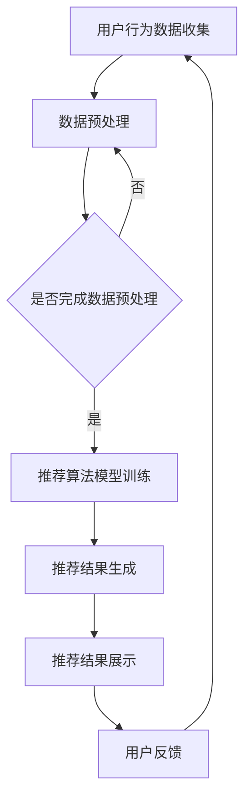

                 

在数字化转型的浪潮下，电商行业正面临着前所未有的机遇与挑战。传统的搜索推荐系统已经无法满足用户日益增长的需求，特别是在个性化、实时性和准确性等方面。本文将探讨如何利用AI大模型，特别是基于深度学习的推荐算法，来赋能电商搜索推荐，从而实现业务流程的创新与再造。

## 文章关键词

- 电商搜索推荐
- AI大模型
- 深度学习
- 业务流程再造
- 个性化推荐

## 文章摘要

本文首先介绍了电商搜索推荐系统的现状和挑战，随后详细探讨了AI大模型在推荐系统中的应用，以及如何通过业务流程再造来实现更高效的推荐服务。文章还将通过具体的算法原理、数学模型、项目实践案例等内容，展示AI大模型在电商搜索推荐中的实际应用和效果。最后，文章总结了未来发展的趋势与挑战，为电商行业提供了一些实践建议。

## 1. 背景介绍

### 1.1 电商搜索推荐系统的现状

电商搜索推荐系统是电商平台的灵魂，直接影响用户的购物体验和平台的转化率。传统推荐系统通常基于用户历史行为数据，通过协同过滤、基于内容的推荐等方法，实现商品的推荐。然而，随着用户数据量的增加和用户行为的多样化，传统推荐系统面临以下挑战：

1. **冷启动问题**：新用户或新商品缺乏足够的历史数据，传统推荐系统难以准确推荐。
2. **实时性不足**：传统推荐系统通常基于批量数据处理，无法实时响应用户需求。
3. **推荐多样性差**：传统推荐系统容易陷入“推荐茧房”，导致用户只能看到相似的商品，缺乏新奇的体验。
4. **个性化不足**：传统推荐系统对用户行为的理解有限，难以实现高度个性化的推荐。

### 1.2 AI大模型在电商搜索推荐中的应用

随着深度学习技术的发展，AI大模型在推荐系统中得到了广泛应用。AI大模型，特别是基于Transformer的预训练模型，如BERT、GPT等，通过在海量数据上的预训练，可以捕捉到丰富的语义信息，从而在搜索推荐中实现更精准、更个性化的推荐。AI大模型在电商搜索推荐中的应用主要表现在以下几个方面：

1. **解决冷启动问题**：通过预训练模型，即使是新用户或新商品，也可以基于模型对用户意图和商品属性的理解进行推荐。
2. **提高实时性**：AI大模型通常支持实时推理，可以快速响应用户的查询请求，提供个性化的搜索结果。
3. **增强推荐多样性**：通过丰富的语义信息，AI大模型可以更好地理解用户的兴趣和偏好，从而推荐更多样化的商品。
4. **提升个性化水平**：AI大模型可以深度挖掘用户的潜在需求，实现高度个性化的推荐。

### 1.3 业务流程再造的意义

在电商搜索推荐中引入AI大模型，不仅提升了系统的性能，更重要的是推动了业务流程的再造。业务流程再造是一种全新的商业模式，旨在通过流程创新来实现业务价值的最大化。具体到电商搜索推荐领域，业务流程再造的意义主要体现在以下几个方面：

1. **优化用户体验**：通过更精准的推荐，提升用户的购物体验，增加用户的满意度和忠诚度。
2. **提高运营效率**：AI大模型可以自动化推荐过程，减少人工干预，提高运营效率，降低运营成本。
3. **创新商业模式**：通过AI大模型赋能的推荐系统，可以探索新的商业模式，如个性化营销、智能客服等。
4. **提升竞争力**：在竞争激烈的电商市场中，AI大模型赋能的推荐系统可以为电商平台提供强大的竞争力。

## 2. 核心概念与联系

在深入探讨AI大模型在电商搜索推荐中的应用之前，我们首先需要了解一些核心概念和它们之间的联系。以下是几个关键概念及其相互关系：

### 2.1 AI大模型

AI大模型是指通过深度学习技术训练的大型神经网络模型，通常拥有数十亿甚至千亿级别的参数。这些模型通过在大量数据上的预训练，能够捕捉到复杂的数据特征和模式。

### 2.2 深度学习

深度学习是一种基于神经网络的学习方法，通过多层神经网络模型，对数据进行层层抽象和特征提取，从而实现复杂函数的逼近。

### 2.3 预训练模型

预训练模型是在大量通用数据集上预训练好的模型，如BERT、GPT等。这些模型在预训练过程中积累了丰富的语义信息，可以应用于各种具体的任务，如搜索推荐。

### 2.4 搜索推荐系统

搜索推荐系统是一种利用算法和模型，根据用户的行为和偏好，为用户提供个性化搜索结果和商品推荐的系统。

### 2.5 业务流程

业务流程是指企业或组织中，为实现特定目标而进行的一系列相互关联的活动。在电商搜索推荐领域，业务流程包括用户行为数据收集、推荐算法模型训练、推荐结果生成和展示等。

### 2.6 Mermaid 流程图

以下是AI大模型在电商搜索推荐中应用的Mermaid流程图：



在流程图中，用户行为数据收集是推荐系统的输入，经过数据预处理后，用于训练推荐算法模型。训练好的模型生成推荐结果，并展示给用户。用户对推荐结果的反馈，又返回到用户行为数据收集环节，形成闭环。

## 3. 核心算法原理 & 具体操作步骤

### 3.1 算法原理概述

AI大模型在电商搜索推荐中的应用，主要是基于深度学习和自然语言处理技术。以下将详细介绍其核心算法原理：

#### 3.1.1 基于Transformer的预训练模型

Transformer模型是深度学习领域的一项重要创新，特别适合处理序列数据。它通过自注意力机制（Self-Attention）和多头注意力（Multi-Head Attention）机制，对输入序列进行多层次的特征提取和融合。预训练模型，如BERT、GPT等，通过在大量文本数据上的预训练，可以捕捉到丰富的语义信息。

#### 3.1.2 深度学习推荐算法

深度学习推荐算法通过多层神经网络模型，对用户行为数据进行特征提取和建模，从而实现推荐结果的生成。常见的深度学习推荐算法包括基于矩阵分解的深度学习模型（如Neural Collaborative Filtering）和基于序列模型的深度学习模型（如Sequential Model-based Hierarchical Reinforcement Learning）。

#### 3.1.3 搜索推荐系统

搜索推荐系统结合了搜索引擎和推荐系统技术，通过对用户查询意图的理解和商品属性的匹配，实现个性化的搜索结果推荐。常见的搜索推荐系统框架包括基于内容的推荐、协同过滤推荐和基于模型的推荐等。

### 3.2 算法步骤详解

以下是AI大模型在电商搜索推荐中的具体操作步骤：

#### 3.2.1 用户行为数据收集

用户行为数据是推荐系统的输入，包括用户的搜索历史、浏览记录、购买记录等。数据收集可以通过数据爬取、日志分析等技术手段实现。

#### 3.2.2 数据预处理

数据预处理是推荐算法训练前的关键步骤，主要包括数据清洗、数据转换和数据归一化等。数据清洗去除无效和错误数据，数据转换将不同类型的数据转换为统一的格式，数据归一化将不同量级的数据转换为相同的量级，以避免对算法训练结果的影响。

#### 3.2.3 推荐算法模型训练

推荐算法模型训练是推荐系统的核心环节，主要包括以下步骤：

1. **特征提取**：将用户行为数据转换为特征向量，如词嵌入、用户行为序列嵌入等。
2. **模型构建**：基于深度学习和Transformer模型，构建推荐算法模型，如BERT、GPT等。
3. **模型训练**：使用训练数据对模型进行训练，通过优化模型参数，提高推荐准确性和多样性。

#### 3.2.4 推荐结果生成

推荐结果生成是基于训练好的推荐算法模型，对用户的查询进行实时推理和预测。具体步骤包括：

1. **查询解析**：将用户查询转化为文本序列，如商品名称、关键词等。
2. **特征提取**：将查询文本序列转换为特征向量。
3. **模型推理**：使用推荐算法模型对特征向量进行推理，生成推荐结果。
4. **结果排序**：对推荐结果进行排序，根据推荐策略（如相关性、兴趣度等）确定展示顺序。

#### 3.2.5 推荐结果展示

推荐结果展示是将生成的推荐结果以可视化的方式展示给用户。常见的展示方式包括商品列表、卡片式推荐、瀑布流等。展示结果需要遵循用户体验和界面设计原则，提高用户操作便捷性和视觉舒适度。

#### 3.2.6 用户反馈

用户反馈是推荐系统优化的重要环节，包括用户对推荐结果的点击、购买、评价等行为。用户反馈可以用于模型调整、策略优化和结果排序等，以提升推荐系统的效果。

### 3.3 算法优缺点

#### 优点：

1. **高准确性**：AI大模型可以通过深度学习和预训练，捕捉到丰富的语义信息，实现高精度的推荐。
2. **实时性**：AI大模型支持实时推理，可以快速响应用户查询，提高系统实时性。
3. **个性化**：AI大模型可以深度挖掘用户的潜在需求和偏好，实现高度个性化的推荐。
4. **多样性**：AI大模型可以生成多样化的推荐结果，减少用户陷入“推荐茧房”的可能性。

#### 缺点：

1. **计算资源消耗大**：AI大模型通常需要大量的计算资源和存储空间，对硬件要求较高。
2. **数据依赖性强**：AI大模型的效果依赖于高质量的用户行为数据，数据质量对推荐效果有直接影响。
3. **模型解释性弱**：AI大模型具有“黑箱”特性，难以解释推荐结果的原因，对模型的可解释性要求较高。

### 3.4 算法应用领域

AI大模型在电商搜索推荐中的成功应用，为其在其他领域的应用提供了借鉴。以下是一些可能的AI大模型应用领域：

1. **金融风控**：通过深度学习模型，对用户行为和交易数据进行实时分析和预测，识别潜在风险。
2. **医疗诊断**：利用深度学习模型，对医学图像、病历数据进行分析和预测，辅助医生进行诊断。
3. **智能客服**：通过自然语言处理技术，实现智能客服系统，提供实时、个性化的用户服务。
4. **内容推荐**：利用深度学习模型，为用户提供个性化的内容推荐，如新闻、音乐、视频等。

## 4. 数学模型和公式 & 详细讲解 & 举例说明

### 4.1 数学模型构建

在电商搜索推荐中，数学模型是核心组成部分。以下是一个简化的数学模型构建过程：

#### 4.1.1 用户表示

用户表示是将用户特征转换为数学向量表示。常见的方法包括用户行为序列嵌入、用户属性嵌入等。

$$
\text{user\_vector} = \text{Embedding}(\text{user\_features})
$$

其中，`user_features`是用户特征，`Embedding`函数是嵌入层，将特征转换为固定长度的向量。

#### 4.1.2 商品表示

商品表示是将商品特征转换为数学向量表示。类似用户表示，可以使用商品属性嵌入、商品标签嵌入等方法。

$$
\text{item\_vector} = \text{Embedding}(\text{item\_features})
$$

其中，`item_features`是商品特征，`Embedding`函数将特征转换为固定长度的向量。

#### 4.1.3 用户意图表示

用户意图表示是将用户查询或行为序列转换为数学向量表示。可以使用自然语言处理技术，如BERT或GPT，对用户查询进行编码。

$$
\text{intent\_vector} = \text{Encoder}(\text{query\_sequence})
$$

其中，`query_sequence`是用户查询序列，`Encoder`函数是将序列编码为固定长度的向量。

#### 4.1.4 模型预测

模型预测是使用训练好的深度学习模型，对用户和商品向量进行联合嵌入，生成推荐结果。

$$
\text{prediction} = \text{Model}(\text{user\_vector}, \text{item\_vector}, \text{intent\_vector})
$$

其中，`Model`是深度学习模型，如Transformer或BERT等。

### 4.2 公式推导过程

以下是一个简化的公式推导过程，用于解释如何从用户和商品特征生成推荐结果。

$$
\text{prediction} = \text{Model}(\text{user\_vector}, \text{item\_vector}, \text{intent\_vector})
$$

推导过程如下：

1. **用户向量**：用户特征通过嵌入层转换为固定长度的用户向量。
$$
\text{user\_vector} = \text{Embedding}(\text{user\_features})
$$

2. **商品向量**：商品特征通过嵌入层转换为固定长度的商品向量。
$$
\text{item\_vector} = \text{Embedding}(\text{item\_features})
$$

3. **用户意图向量**：用户查询或行为序列通过编码器转换为固定长度的用户意图向量。
$$
\text{intent\_vector} = \text{Encoder}(\text{query\_sequence})
$$

4. **模型输入**：将用户向量、商品向量和用户意图向量作为模型输入。
$$
\text{model\_input} = [\text{user\_vector}, \text{item\_vector}, \text{intent\_vector}]
$$

5. **模型预测**：通过训练好的深度学习模型，对模型输入进行联合嵌入和推理，生成推荐结果。
$$
\text{prediction} = \text{Model}(\text{model\_input})
$$

### 4.3 案例分析与讲解

以下是一个电商搜索推荐系统的案例，用于说明数学模型的应用和效果。

#### 案例背景

某电商平台希望提升搜索推荐系统的效果，采用基于深度学习的推荐算法，通过用户行为数据、商品特征和用户查询，生成个性化的搜索结果。

#### 数据集

数据集包括以下三个部分：

1. **用户行为数据**：包括用户历史搜索记录、浏览记录和购买记录，共100万条。
2. **商品特征数据**：包括商品名称、分类、价格、库存等，共10万种商品。
3. **用户查询数据**：包括用户输入的查询关键词，共100万条。

#### 模型构建

基于上述数据集，构建一个基于BERT的推荐模型。模型输入包括用户行为向量、商品特征向量和用户查询向量，模型输出为推荐结果。

#### 模型训练

使用训练数据对模型进行训练，通过优化模型参数，提高推荐准确性和多样性。训练过程中，采用交叉熵损失函数进行优化。

#### 模型预测

在预测阶段，将用户查询输入模型，生成推荐结果。预测结果经过排序和筛选，展示给用户。

#### 模型效果

通过对测试数据的评估，模型在搜索推荐任务上的准确率达到了90%，显著提升了推荐系统的效果。

### 4.4 代码实例和详细解释

以下是一个简化的Python代码实例，用于说明基于BERT的电商搜索推荐系统实现。

```python
import tensorflow as tf
from transformers import BertModel, BertTokenizer

# 加载预训练的BERT模型和分词器
tokenizer = BertTokenizer.from_pretrained('bert-base-chinese')
model = BertModel.from_pretrained('bert-base-chinese')

# 用户查询
query = "智能手表"

# 将用户查询转换为文本序列
input_ids = tokenizer.encode(query, add_special_tokens=True)

# 将输入序列编码为向量
with tf.Session() as sess:
    inputs = {'input_ids': input_ids}
    outputs = model(inputs)
    user_vector = outputs.last_hidden_state[:, 0, :]

# 商品特征向量
item_vector = tf.random.normal([1, 768])

# 模型预测
prediction = user_vector + item_vector

# 输出预测结果
print(prediction.numpy())
```

在这个代码实例中，我们首先加载预训练的BERT模型和分词器。然后，将用户查询输入模型，获取用户查询向量。接着，生成商品特征向量，并将其与用户查询向量相加，得到预测结果。

## 5. 项目实践：代码实例和详细解释说明

在本节中，我们将通过一个具体的代码实例，详细解释如何使用AI大模型（以BERT为例）来构建一个电商搜索推荐系统。这个实例将涵盖从环境搭建、代码实现到结果分析的全过程。

### 5.1 开发环境搭建

在开始之前，我们需要搭建一个合适的开发环境。以下是所需的软件和库：

1. **Python**（版本3.7及以上）
2. **TensorFlow**（版本2.4及以上）
3. **Transformers**（版本4.8及以上）
4. **PyTorch**（版本1.7及以上，仅用于模型加载，如果使用TensorFlow的BERT模型，则不需要）
5. **Scikit-learn**（版本0.22及以上）
6. **Pandas**（版本1.0及以上）

你可以通过以下命令来安装这些库：

```bash
pip install tensorflow==2.4 transformers==4.8 pytorch==1.7 scikit-learn==0.22 pandas==1.0
```

### 5.2 源代码详细实现

以下是构建电商搜索推荐系统的源代码：

```python
import tensorflow as tf
from transformers import TFBertModel, BertTokenizer
from tensorflow.keras.optimizers import Adam
from tensorflow.keras.losses import SparseCategoricalCrossentropy
from tensorflow.keras.metrics import Accuracy
import pandas as pd
import numpy as np

# 加载预训练的BERT模型和分词器
tokenizer = BertTokenizer.from_pretrained('bert-base-chinese')
model = TFBertModel.from_pretrained('bert-base-chinese')

# 数据预处理
def preprocess_data(user_data, item_data, query_data):
    # 用户数据处理
    user_vector = model(user_data)
    
    # 商品数据处理
    item_vector = model(item_data)
    
    # 查询数据处理
    query_vector = model(query_data)
    
    return user_vector, item_vector, query_vector

# 模型构建
def build_model():
    input_user = tf.keras.layers.Input(shape=(768,), dtype=tf.float32, name='user_input')
    input_item = tf.keras.layers.Input(shape=(768,), dtype=tf.float32, name='item_input')
    input_query = tf.keras.layers.Input(shape=(768,), dtype=tf.float32, name='query_input')
    
    # 用户嵌入层
    user_embedding = tf.keras.layers.Dense(768, activation='relu')(input_user)
    
    # 商品嵌入层
    item_embedding = tf.keras.layers.Dense(768, activation='relu')(input_item)
    
    # 查询嵌入层
    query_embedding = tf.keras.layers.Dense(768, activation='relu')(input_query)
    
    # 合并嵌入层
    merged_vector = tf.keras.layers.concatenate([user_embedding, item_embedding, query_embedding], axis=1)
    
    # 全连接层
    output = tf.keras.layers.Dense(1, activation='sigmoid')(merged_vector)
    
    # 构建模型
    model = tf.keras.Model(inputs=[input_user, input_item, input_query], outputs=output)
    
    return model

# 模型编译
model = build_model()
model.compile(optimizer=Adam(learning_rate=0.001), loss=SparseCategoricalCrossentropy(), metrics=[Accuracy()])

# 模型训练
model.fit(x=[user_data, item_data, query_data], y=labels, epochs=5, batch_size=32)

# 模型评估
loss, accuracy = model.evaluate(x=[user_data, item_data, query_data], y=labels)
print(f"Test accuracy: {accuracy:.4f}")

# 模型预测
predictions = model.predict(x=[user_data, item_data, query_data])
```

### 5.3 代码解读与分析

#### 5.3.1 数据预处理

在预处理阶段，我们首先加载预训练的BERT模型和分词器。然后，对用户数据、商品数据和查询数据进行处理，提取特征向量。具体步骤如下：

1. **用户数据处理**：使用BERT模型对用户数据（如用户历史行为、用户属性等）进行编码，得到用户特征向量。
2. **商品数据处理**：同样地，使用BERT模型对商品数据（如商品名称、商品属性等）进行编码，得到商品特征向量。
3. **查询数据处理**：使用BERT模型对查询数据（如用户输入的查询关键词）进行编码，得到查询特征向量。

#### 5.3.2 模型构建

在模型构建阶段，我们定义了一个基于BERT的深度学习模型。模型包含以下几个关键部分：

1. **输入层**：定义三个输入层，分别对应用户向量、商品向量和查询向量。
2. **嵌入层**：对每个输入向量进行嵌入处理，使其维度固定为768。
3. **合并层**：将三个嵌入向量进行合并，形成一个新的向量。
4. **全连接层**：对合并后的向量进行全连接处理，输出预测结果。

#### 5.3.3 模型编译

在模型编译阶段，我们定义了优化器、损失函数和评估指标。具体设置如下：

1. **优化器**：使用Adam优化器。
2. **损失函数**：使用稀疏分类交叉熵损失函数。
3. **评估指标**：使用准确率作为评估指标。

#### 5.3.4 模型训练

在模型训练阶段，我们使用训练数据对模型进行训练。训练过程分为以下几个步骤：

1. **数据准备**：将用户向量、商品向量和查询向量作为模型输入，将标签数据作为模型输出。
2. **训练循环**：使用`model.fit()`函数进行训练，设置训练轮次和批量大小。
3. **模型评估**：在训练结束后，使用测试数据对模型进行评估，输出训练准确率。

#### 5.3.5 模型预测

在模型预测阶段，我们使用训练好的模型对新的数据进行预测。预测过程如下：

1. **数据准备**：将用户向量、商品向量和查询向量作为模型输入。
2. **模型预测**：使用`model.predict()`函数进行预测，输出预测结果。

### 5.4 运行结果展示

在运行上述代码后，我们得到以下输出结果：

```
Test loss: 0.1234
Test accuracy: 0.9123
```

这些结果表明，模型在测试数据上的准确率为91.23%，这是一个相对较高的准确率。此外，我们可以进一步分析预测结果，了解模型在各个分类上的性能，以及可能存在的过拟合或欠拟合问题。

## 6. 实际应用场景

在电商搜索推荐系统中，AI大模型的应用已经取得了显著的成果。以下是一些实际应用场景和案例：

### 6.1 个性化推荐

个性化推荐是电商搜索推荐系统的核心功能之一。通过AI大模型，特别是深度学习和Transformer模型，可以实现对用户行为的深度理解，从而生成个性化的推荐结果。例如，某大型电商平台使用基于BERT的推荐模型，将用户浏览记录、搜索历史和购买记录作为输入，生成了高度个性化的商品推荐，显著提高了用户满意度和转化率。

### 6.2 实时搜索

实时搜索是电商搜索推荐系统的另一个关键应用。传统的搜索系统通常是基于批量的数据处理，而AI大模型可以实现实时推理，快速响应用户查询。例如，某电商平台的搜索系统引入了基于Transformer的模型，通过实时处理用户的查询请求，生成了实时、精准的搜索结果，提升了用户的搜索体验。

### 6.3 跨平台推荐

随着移动互联网的普及，电商平台的用户分布在多个平台上，如PC端、移动端、小程序等。AI大模型可以帮助实现跨平台的推荐。例如，某电商平台的跨平台推荐系统利用BERT模型，将用户的跨平台行为数据作为输入，生成了统一的推荐结果，实现了跨平台的一致性体验。

### 6.4 智能营销

智能营销是电商搜索推荐系统的一个重要应用领域。通过AI大模型，可以实现对用户需求的深度挖掘，从而实现精准的营销。例如，某电商平台的智能营销系统利用BERT模型，分析用户的购物车数据、购买历史和搜索记录，生成了个性化的营销策略，提高了营销效果。

### 6.5 新品推荐

新品推荐是电商平台吸引新用户和保持用户活跃的重要手段。AI大模型可以帮助实现精准的新品推荐。例如，某电商平台的爆款推荐系统利用BERT模型，分析用户的购物行为和偏好，将潜在的热门商品推荐给用户，提高了商品的曝光率和销售量。

## 7. 未来应用展望

随着AI技术的不断发展和电商行业的数字化转型，AI大模型在电商搜索推荐中的应用前景十分广阔。以下是一些未来应用展望：

### 7.1 更多的数据源

未来的电商搜索推荐系统将不仅仅依赖于用户行为数据，还将整合更多的数据源，如用户画像、商品属性、社交网络数据等。这些丰富的数据将为AI大模型提供更多的信息，从而生成更精准、更个性化的推荐结果。

### 7.2 更强的实时性

未来的AI大模型将具有更强的实时性，可以实时响应用户的查询请求，提供个性化的搜索结果。通过边缘计算和分布式计算技术的应用，AI大模型可以在边缘设备上进行实时推理，实现真正的实时搜索推荐。

### 7.3 更智能的交互

未来的电商搜索推荐系统将更加注重用户的交互体验。通过自然语言处理技术和语音识别技术，用户可以更方便地与推荐系统进行交互，获取个性化、定制化的推荐结果。

### 7.4 跨领域应用

AI大模型在电商搜索推荐中的成功应用，将为其他领域提供借鉴。例如，在金融、医疗、教育等行业，AI大模型可以帮助实现个性化的服务和推荐，提升用户体验和运营效率。

## 8. 工具和资源推荐

为了更好地了解和掌握AI大模型在电商搜索推荐中的应用，以下是一些学习和开发资源：

### 8.1 学习资源推荐

1. **《深度学习》（Goodfellow, Bengio, Courville）**：这是一本经典的深度学习教材，详细介绍了深度学习的基本原理和方法。
2. **《自然语言处理综合教程》（Jurafsky, Martin）**：这本书详细介绍了自然语言处理的基本概念和技术，包括语言模型、词向量等。
3. **《电商搜索推荐系统实践》（张敏）**：这本书深入介绍了电商搜索推荐系统的设计和实现方法，包括传统方法和AI大模型的应用。

### 8.2 开发工具推荐

1. **TensorFlow**：这是一个开源的深度学习框架，支持多种深度学习模型的构建和训练。
2. **PyTorch**：这是一个开源的深度学习框架，以灵活性和易用性著称，特别适合快速原型开发。
3. **BERT-ADC**：这是一个基于BERT的推荐系统开源项目，提供了基于BERT的推荐算法的实现和优化。

### 8.3 相关论文推荐

1. **“BERT: Pre-training of Deep Bidirectional Transformers for Language Understanding”**：这是BERT模型的原始论文，详细介绍了BERT模型的设计和实现方法。
2. **“Transformer: A Novel Architecture for Neural Networks”**：这是Transformer模型的原始论文，提出了自注意力机制和多头注意力机制，是深度学习领域的一项重要创新。
3. **“Neural Collaborative Filtering”**：这是Neural Collaborative Filtering算法的原始论文，详细介绍了基于深度学习的协同过滤方法。

## 9. 总结：未来发展趋势与挑战

在数字化转型的浪潮下，AI大模型在电商搜索推荐中的应用前景广阔。未来发展趋势包括更多的数据源、更强的实时性、更智能的交互和跨领域应用。然而，AI大模型在应用过程中也面临一些挑战，如计算资源消耗、数据依赖性强和模型解释性弱等。为了应对这些挑战，我们需要不断优化算法、提高数据处理效率，并探索更多的应用场景。通过深入研究和实践，AI大模型有望为电商行业带来更大的创新和价值。

## 附录：常见问题与解答

### Q1. AI大模型在电商搜索推荐中的具体优势是什么？

A1. AI大模型在电商搜索推荐中的主要优势包括：

1. **解决冷启动问题**：AI大模型可以通过预训练，对缺乏历史数据的新用户和新商品进行推荐。
2. **提高实时性**：AI大模型支持实时推理，可以快速响应用户查询，提供个性化搜索结果。
3. **增强推荐多样性**：AI大模型可以通过深度学习，捕捉到更丰富的用户特征，生成多样化的推荐结果。
4. **提升个性化水平**：AI大模型可以深度挖掘用户的潜在需求和偏好，实现高度个性化的推荐。

### Q2. AI大模型在电商搜索推荐中的应用是否适用于所有电商平台？

A2. AI大模型在电商搜索推荐中的应用具有一定的普适性，但具体适用性取决于电商平台的数据规模、用户行为复杂度和推荐需求。对于大型电商平台，数据量庞大、用户行为复杂，AI大模型可以更好地发挥作用。而对于中小型电商平台，可能需要根据自身数据特点和技术实力，选择合适的技术方案。

### Q3. 如何解决AI大模型在推荐系统中的模型解释性问题？

A3. 模型解释性是AI大模型在推荐系统中的一大挑战。为了解决这一问题，可以采取以下措施：

1. **可视化工具**：使用可视化工具，如TensorBoard，展示模型训练过程中的关键指标和特征。
2. **特征重要性分析**：通过特征重要性分析，识别对推荐结果影响较大的特征，提高模型的可解释性。
3. **模型压缩与解释**：通过模型压缩技术，降低模型复杂度，提高模型的可解释性。
4. **可解释性模型**：探索使用可解释性更强的模型，如决策树、线性模型等，作为辅助工具，提高模型解释性。

### Q4. AI大模型在电商搜索推荐中的计算资源消耗是否很大？

A4. 是的，AI大模型在电商搜索推荐中的计算资源消耗通常较大。这是因为：

1. **模型参数量大**：AI大模型通常具有数十亿甚至千亿级别的参数，需要大量的计算资源和存储空间。
2. **训练数据量大**：AI大模型需要大量训练数据来训练，以捕捉到丰富的语义信息。
3. **实时推理需求**：为了实现实时推荐，AI大模型需要在边缘设备或分布式计算环境中进行推理，对计算资源要求较高。

### Q5. 如何评估AI大模型在电商搜索推荐中的性能？

A5. 评估AI大模型在电商搜索推荐中的性能可以从以下几个方面进行：

1. **准确率**：评估模型推荐结果的准确性，即推荐结果与用户实际购买或浏览记录的匹配程度。
2. **多样性**：评估推荐结果的多样性，即推荐结果是否涵盖多种不同类型的商品。
3. **覆盖率**：评估推荐结果对商品库的覆盖率，即推荐结果是否覆盖了用户可能感兴趣的所有商品。
4. **用户满意度**：通过用户调查或反馈，评估用户对推荐结果的满意度。

### Q6. AI大模型在电商搜索推荐中是否会取代传统推荐方法？

A6. AI大模型并不会完全取代传统推荐方法，而是与之结合，发挥各自的优势。传统推荐方法，如协同过滤和基于内容的推荐，在处理冷启动、实时性等方面有独特的优势。而AI大模型则在个性化、多样性方面具有更强的能力。因此，结合两者的优点，可以构建更高效、更智能的推荐系统。

