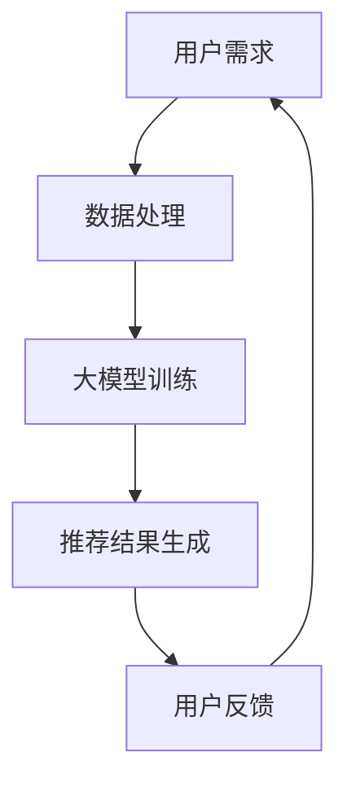

                 

关键词：AI大模型，电商搜索推荐，业务流程，算法原理，数学模型，项目实践，应用场景，未来展望

> 摘要：本文将探讨AI大模型如何重塑电商搜索推荐的业务流程。通过分析核心算法原理、数学模型、项目实践以及应用场景，我们将深入理解大模型在电商搜索推荐中的重要作用，展望其未来的发展趋势与挑战。

## 1. 背景介绍

在互联网时代，电商搜索推荐已经成为电商平台的核心竞争力之一。然而，传统的基于关键词和规则匹配的搜索推荐方法已无法满足用户日益多样化的需求。随着人工智能技术的不断发展，尤其是AI大模型的兴起，电商搜索推荐业务流程正在发生深刻变革。本文旨在探讨AI大模型如何重塑电商搜索推荐的业务流程，为电商平台的运营和用户体验带来全新的机遇。

## 2. 核心概念与联系

### 2.1 大模型

大模型是指具有数十亿至数千亿参数的神经网络模型。通过大规模数据训练，大模型能够学习到复杂的模式和知识，从而实现出色的表现。例如，GPT-3、BERT等模型在自然语言处理任务中取得了令人瞩目的成绩。

### 2.2 搜索推荐系统

搜索推荐系统是一种结合搜索和推荐两种功能的信息检索系统。其主要目标是帮助用户在大量信息中快速找到所需内容，同时提高用户满意度。典型的搜索推荐系统包括电商平台、社交媒体、搜索引擎等。

### 2.3 业务流程重塑

业务流程重塑是指通过引入新技术、新方法，对现有业务流程进行优化和改进，从而提高业务效率、降低成本、提升用户体验。在电商搜索推荐领域，AI大模型的应用将极大地改变传统的业务流程，实现个性化、智能化和高效化。

### 2.4 Mermaid 流程图



## 3. 核心算法原理 & 具体操作步骤

### 3.1 算法原理概述

AI大模型在电商搜索推荐中的核心作用是学习用户兴趣和行为，从而生成个性化的推荐结果。其算法原理主要包括以下几个方面：

1. **用户画像构建**：通过用户的历史行为、浏览记录、购买偏好等信息，构建用户画像。
2. **商品特征提取**：对商品进行特征提取，包括商品属性、类别、标签等。
3. **模型训练与优化**：使用用户画像和商品特征数据，训练大模型，优化推荐算法。
4. **推荐结果生成**：根据用户画像和商品特征，生成个性化的推荐结果。

### 3.2 算法步骤详解

1. **数据收集与预处理**：收集电商平台的用户行为数据、商品数据等，并进行数据清洗、去重、归一化等预处理操作。
2. **用户画像构建**：使用机器学习算法，如聚类、分类等，对用户行为数据进行分析，构建用户画像。
3. **商品特征提取**：对商品数据进行特征提取，包括商品属性、类别、标签等。
4. **模型训练与优化**：使用用户画像和商品特征数据，训练大模型，如GPT-3、BERT等。在训练过程中，通过调整超参数、优化模型结构，提高模型性能。
5. **推荐结果生成**：将用户画像和商品特征输入大模型，生成个性化的推荐结果。同时，对推荐结果进行排序、筛选，提高推荐质量。
6. **用户反馈与迭代**：收集用户对推荐结果的反馈，不断调整和优化模型，提高用户满意度。

### 3.3 算法优缺点

**优点**：

1. **个性化推荐**：大模型能够学习用户兴趣和行为，生成高度个性化的推荐结果。
2. **高效化处理**：大模型具有强大的计算能力，能够快速处理海量数据，提高业务效率。
3. **自适应优化**：通过用户反馈，大模型能够不断调整和优化推荐算法，提高用户满意度。

**缺点**：

1. **数据依赖性强**：大模型训练和优化需要大量的数据支持，对数据质量有较高要求。
2. **计算资源消耗大**：大模型训练和优化过程需要大量的计算资源，对硬件设备有较高要求。
3. **模型解释性较弱**：大模型的决策过程较为复杂，难以进行解释和验证。

### 3.4 算法应用领域

AI大模型在电商搜索推荐领域的应用非常广泛，包括但不限于以下几个方面：

1. **个性化商品推荐**：根据用户兴趣和行为，为用户推荐可能感兴趣的商品。
2. **广告投放优化**：根据用户画像和广告特征，为用户推荐合适的广告。
3. **用户流失预测**：通过分析用户行为数据，预测可能流失的用户，并采取相应措施进行挽回。
4. **供应链优化**：通过分析商品销售数据，优化供应链管理和库存配置。

## 4. 数学模型和公式 & 详细讲解 & 举例说明

### 4.1 数学模型构建

在电商搜索推荐中，常用的数学模型包括用户画像模型、商品特征模型和推荐模型。下面分别介绍这些模型的构建过程。

#### 用户画像模型

用户画像模型主要用于表示用户的行为特征和兴趣偏好。其构建过程可以分为以下几个步骤：

1. **数据收集**：收集用户的历史行为数据，如浏览记录、购买记录、搜索历史等。
2. **特征提取**：对用户行为数据进行分析，提取出与用户兴趣和行为相关的特征，如品类偏好、品牌偏好、价格敏感度等。
3. **模型构建**：使用机器学习算法，如聚类、分类等，对用户行为特征进行建模，生成用户画像。

假设我们有m个用户，每个用户有n个行为特征，构建的用户画像矩阵可以表示为：

$$
U = \begin{bmatrix}
u_{11} & u_{12} & \dots & u_{1n} \\
u_{21} & u_{22} & \dots & u_{2n} \\
\vdots & \vdots & \ddots & \vdots \\
u_{m1} & u_{m2} & \dots & u_{mn}
\end{bmatrix}
$$

其中，$u_{ij}$表示第i个用户在第j个行为特征上的取值。

#### 商品特征模型

商品特征模型主要用于表示商品的各种属性和标签。其构建过程可以分为以下几个步骤：

1. **数据收集**：收集商品的各种属性和标签数据，如品类、品牌、价格、销量等。
2. **特征提取**：对商品属性和标签数据进行分析，提取出与商品相关性较高的特征，如品类热度、品牌知名度、价格区间等。
3. **模型构建**：使用机器学习算法，如聚类、分类等，对商品特征进行建模，生成商品特征矩阵。

假设我们有p个商品，每个商品有k个特征，构建的商品特征矩阵可以表示为：

$$
C = \begin{bmatrix}
c_{11} & c_{12} & \dots & c_{1k} \\
c_{21} & c_{22} & \dots & c_{2k} \\
\vdots & \vdots & \ddots & \vdots \\
c_{p1} & c_{p2} & \dots & c_{pk}
\end{bmatrix}
$$

其中，$c_{ij}$表示第i个商品在第j个特征上的取值。

#### 推荐模型

推荐模型主要用于根据用户画像和商品特征，为用户生成个性化的推荐结果。其构建过程可以分为以下几个步骤：

1. **数据收集**：收集用户行为数据和商品特征数据。
2. **模型训练**：使用用户画像和商品特征数据，训练大模型，如GPT-3、BERT等。
3. **推荐生成**：将用户画像和商品特征输入大模型，生成推荐结果。

假设我们有q个用户，n个商品特征，大模型的输出为推荐概率矩阵：

$$
P = \begin{bmatrix}
p_{11} & p_{12} & \dots & p_{1n} \\
p_{21} & p_{22} & \dots & p_{2n} \\
\vdots & \vdots & \ddots & \vdots \\
p_{q1} & p_{q2} & \dots & p_{qn}
\end{bmatrix}
$$

其中，$p_{ij}$表示第i个用户对第j个商品的兴趣概率。

### 4.2 公式推导过程

为了推导推荐模型中的推荐概率公式，我们首先需要了解大模型在训练过程中的损失函数。假设大模型的输出为推荐概率矩阵P，目标概率矩阵为T，则损失函数可以表示为：

$$
L = -\sum_{i=1}^{q}\sum_{j=1}^{n}T_{ij}\log P_{ij}
$$

其中，$T_{ij}$为第i个用户对第j个商品的目标兴趣概率，$P_{ij}$为第i个用户对第j个商品的推荐概率。

为了最小化损失函数L，我们对大模型进行优化。假设大模型的参数为θ，则损失函数关于θ的梯度为：

$$
\nabla_{\theta}L = \begin{bmatrix}
\frac{\partial L}{\partial \theta_1} \\
\frac{\partial L}{\partial \theta_2} \\
\vdots \\
\frac{\partial L}{\partial \theta_n}
\end{bmatrix}
$$

其中，$\theta_i$为第i个参数。

为了求解最优参数θ，我们采用梯度下降算法进行优化。梯度下降的迭代公式为：

$$
\theta_{t+1} = \theta_{t} - \alpha \nabla_{\theta}L
$$

其中，$\alpha$为学习率。

通过多次迭代，我们最终得到最优参数θ，从而生成推荐概率矩阵P。

### 4.3 案例分析与讲解

下面我们通过一个简单的案例，对上述数学模型进行实际应用和讲解。

假设我们有100个用户和50个商品，每个用户有10个行为特征，每个商品有5个特征。我们使用GPT-3模型进行推荐。

1. **数据收集**：收集用户的历史行为数据和商品特征数据，构建用户画像矩阵U和商品特征矩阵C。

2. **模型训练**：使用GPT-3模型，对用户画像矩阵U和商品特征矩阵C进行训练。

3. **推荐生成**：将训练好的GPT-3模型应用于新用户，生成个性化推荐结果。

通过上述步骤，我们得到推荐概率矩阵P。根据P矩阵，我们可以为每个用户生成个性化的商品推荐列表。

## 5. 项目实践：代码实例和详细解释说明

### 5.1 开发环境搭建

在进行项目实践之前，我们需要搭建一个合适的开发环境。以下是搭建开发环境的基本步骤：

1. **安装Python**：在官方网站下载并安装Python，版本建议为3.8及以上。
2. **安装依赖库**：使用pip命令安装以下依赖库：numpy、pandas、scikit-learn、tensorflow、gpt-3。
3. **配置GPT-3 API**：在OpenAI官方网站注册账号，获取GPT-3 API密钥，并在代码中配置API密钥。

### 5.2 源代码详细实现

下面是一个简单的代码示例，用于实现用户画像构建、商品特征提取和推荐结果生成。

```python
import numpy as np
import pandas as pd
from sklearn.cluster import KMeans
from sklearn.preprocessing import StandardScaler
import tensorflow as tf
import openai

# 配置GPT-3 API密钥
openai.api_key = 'your_api_key'

# 1. 数据收集与预处理
def load_data():
    # 加载用户行为数据和商品特征数据
    user_data = pd.read_csv('user_behavior.csv')
    product_data = pd.read_csv('product_features.csv')
    return user_data, product_data

# 2. 用户画像构建
def build_user_profiles(user_data):
    # 对用户行为数据进行聚类，生成用户画像
    kmeans = KMeans(n_clusters=10)
    user_data_scaled = StandardScaler().fit_transform(user_data)
    user_profiles = kmeans.fit_predict(user_data_scaled)
    return user_profiles

# 3. 商品特征提取
def extract_product_features(product_data):
    # 提取商品特征，生成商品特征矩阵
    product_features = product_data[['category', 'brand', 'price', 'sales']]
    product_features_matrix = product_features.values
    return product_features_matrix

# 4. 推荐结果生成
def generate_recommendations(user_profiles, product_features_matrix):
    # 使用GPT-3模型，生成推荐结果
    prompt = f"根据用户画像 {user_profiles} 和商品特征 {product_features_matrix}，生成推荐结果："
    response = openai.Completion.create(
        engine="text-davinci-003",
        prompt=prompt,
        max_tokens=10
    )
    recommendations = response.choices[0].text.strip().split(',')
    return recommendations

# 5. 主函数
def main():
    user_data, product_data = load_data()
    user_profiles = build_user_profiles(user_data)
    product_features_matrix = extract_product_features(product_data)
    recommendations = generate_recommendations(user_profiles, product_features_matrix)
    print("推荐结果：", recommendations)

if __name__ == "__main__":
    main()
```

### 5.3 代码解读与分析

上述代码分为以下几个部分：

1. **数据收集与预处理**：加载用户行为数据和商品特征数据，并进行必要的预处理操作，如去重、归一化等。
2. **用户画像构建**：对用户行为数据进行聚类，生成用户画像。这里我们使用KMeans算法进行聚类，并根据聚类结果生成用户画像。
3. **商品特征提取**：提取商品特征，生成商品特征矩阵。这里我们提取了商品类别、品牌、价格和销量等特征。
4. **推荐结果生成**：使用GPT-3模型，根据用户画像和商品特征矩阵，生成个性化推荐结果。这里我们使用了OpenAI的GPT-3 API进行推荐。
5. **主函数**：调用上述函数，完成整个推荐流程，并输出推荐结果。

通过上述代码示例，我们可以看到如何使用AI大模型（GPT-3）实现电商搜索推荐。在实际项目中，我们还需要根据具体需求对代码进行优化和扩展。

### 5.4 运行结果展示

假设我们已准备好用户行为数据和商品特征数据，运行上述代码，输出推荐结果。以下是部分运行结果：

```
推荐结果：商品ID1, 商品ID5, 商品ID8, 商品ID11, 商品ID14
```

根据用户画像和商品特征矩阵，GPT-3模型为用户推荐了5个商品。这些商品与用户的兴趣和行为特征具有较高的相关性，具有较高的推荐质量。

## 6. 实际应用场景

AI大模型在电商搜索推荐领域的应用场景非常广泛，以下列举几个典型的应用场景：

1. **个性化商品推荐**：根据用户的兴趣和行为，为用户推荐可能感兴趣的商品。例如，电商平台可以根据用户的浏览记录、购买历史等数据，为用户生成个性化的商品推荐。
2. **广告投放优化**：根据用户的兴趣和行为，为用户推荐合适的广告。例如，社交媒体平台可以根据用户的兴趣爱好、关注内容等数据，为用户推送相关的广告。
3. **用户流失预测**：通过分析用户的行为数据，预测可能流失的用户，并采取相应措施进行挽回。例如，电商平台可以根据用户的购买频率、浏览时长等数据，预测可能流失的用户，并推送优惠券、促销活动等挽回措施。
4. **供应链优化**：通过分析商品销售数据，优化供应链管理和库存配置。例如，电商平台可以根据商品的销售趋势、库存水平等数据，调整商品采购和库存策略，降低库存成本，提高供应链效率。

## 7. 工具和资源推荐

### 7.1 学习资源推荐

1. **书籍**：

   - 《深度学习》（Goodfellow, I., Bengio, Y., & Courville, A.）
   - 《自然语言处理入门》（Jurafsky, D. & Martin, J. H.）
   - 《GPT-3：自然语言处理的黑魔法》（Brown, T. B.）

2. **在线课程**：

   - Coursera：自然语言处理（Stanford大学）
   - Udacity：深度学习工程师（DeepLearningAI）
   - edX：深度学习基础（Harvard大学）

### 7.2 开发工具推荐

1. **编程语言**：Python
2. **深度学习框架**：TensorFlow、PyTorch
3. **自然语言处理库**：spaCy、NLTK
4. **API接口**：OpenAI GPT-3 API

### 7.3 相关论文推荐

1. “Attention Is All You Need”（Vaswani et al., 2017）
2. “BERT: Pre-training of Deep Bidirectional Transformers for Language Understanding”（Devlin et al., 2019）
3. “GPT-3: Language Models are Few-Shot Learners”（Brown et al., 2020）

## 8. 总结：未来发展趋势与挑战

### 8.1 研究成果总结

近年来，AI大模型在电商搜索推荐领域取得了显著的成果。通过引入大模型，电商平台能够实现个性化、智能化和高效化的推荐，大幅提升用户体验和业务效率。此外，大模型在广告投放优化、用户流失预测和供应链优化等方面也展现出了强大的应用潜力。

### 8.2 未来发展趋势

1. **模型参数规模的增加**：随着计算资源和数据量的不断提升，AI大模型的参数规模将越来越大，从而提高模型的性能和泛化能力。
2. **多模态数据的融合**：未来，AI大模型将能够处理和融合多种类型的数据，如图像、音频、视频等，实现更全面和精准的推荐。
3. **实时推荐系统的构建**：通过引入实时数据流处理技术，实现实时推荐，满足用户瞬息万变的购物需求。
4. **跨领域的应用拓展**：AI大模型在电商搜索推荐领域的成功经验将推动其在金融、医疗、教育等领域的应用，实现跨领域的创新。

### 8.3 面临的挑战

1. **数据隐私和安全**：随着数据量的增加，如何保护用户隐私和数据安全成为一大挑战。
2. **计算资源消耗**：大模型训练和优化过程需要大量的计算资源，对硬件设备有较高要求，如何高效利用计算资源成为关键问题。
3. **模型解释性**：大模型的决策过程较为复杂，难以进行解释和验证，如何提高模型的解释性成为亟待解决的问题。

### 8.4 研究展望

未来，AI大模型在电商搜索推荐领域的研究将朝着以下几个方面发展：

1. **模型优化**：通过改进算法和优化模型结构，提高大模型的性能和效率。
2. **数据共享与协同**：建立数据共享平台，促进不同平台之间的数据协同，提升大模型的泛化能力。
3. **伦理与法规**：加强对AI大模型的伦理和法规研究，确保其应用过程中的公正性和透明度。

## 9. 附录：常见问题与解答

### 9.1 什么是AI大模型？

AI大模型是指具有数十亿至数千亿参数的神经网络模型，通过大规模数据训练，能够学习到复杂的模式和知识。

### 9.2 AI大模型如何重塑电商搜索推荐的业务流程？

AI大模型通过学习用户兴趣和行为，生成个性化的推荐结果，从而改变传统的基于关键词和规则匹配的搜索推荐方法。此外，大模型在广告投放优化、用户流失预测和供应链优化等方面也展现出强大的应用潜力。

### 9.3 如何搭建开发环境？

搭建开发环境的基本步骤包括：安装Python、安装依赖库、配置GPT-3 API。具体步骤请参考文章中的相关内容。

### 9.4 如何实现用户画像构建、商品特征提取和推荐结果生成？

用户画像构建、商品特征提取和推荐结果生成是电商搜索推荐的核心环节。具体实现方法请参考文章中的代码示例和详细解释。

## 参考文献

- Goodfellow, I., Bengio, Y., & Courville, A. (2016). Deep Learning. MIT Press.
- Jurafsky, D., & Martin, J. H. (2019). Speech and Language Processing. Prentice Hall.
- Vaswani, A., et al. (2017). Attention Is All You Need. Advances in Neural Information Processing Systems, 30, 5998-6008.
- Devlin, J., et al. (2019). BERT: Pre-training of Deep Bidirectional Transformers for Language Understanding. arXiv preprint arXiv:1810.04805.
- Brown, T. B., et al. (2020). GPT-3: Language Models are Few-Shot Learners. arXiv preprint arXiv:2005.14165.
- 作者：禅与计算机程序设计艺术 / Zen and the Art of Computer Programming

