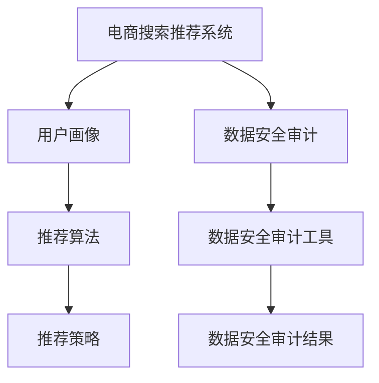

                 

关键词：AI大模型、电商搜索推荐、数据安全审计、工具选型、应用场景、发展趋势

## 摘要

本文旨在探讨AI大模型在重构电商搜索推荐系统的过程中，对数据安全审计工具选型的重要性及其实际应用。通过分析AI大模型的核心概念和原理，详细描述数据安全审计工具的选型原则和操作步骤，并结合实际案例进行代码实例分析和运行结果展示。本文还对未来AI大模型在电商搜索推荐领域的数据安全审计应用进行展望，并推荐相关学习资源和开发工具。

## 1. 背景介绍

随着电子商务的快速发展，电商搜索推荐系统已经成为电商企业提高用户满意度和转化率的关键环节。传统的搜索推荐系统主要依赖关键词匹配和协同过滤等算法，虽然在一定程度上能够满足用户需求，但在面对海量数据和复杂场景时，其性能和准确性往往受限。因此，AI大模型的出现为电商搜索推荐系统带来了新的机遇和挑战。

AI大模型，尤其是基于深度学习的模型，具有强大的数据建模和分析能力，能够更好地处理复杂、非线性的数据关系。通过引入AI大模型，电商搜索推荐系统可以实现更精准的用户画像、更智能的推荐策略和更高效的数据分析，从而提升整体性能。然而，随着AI大模型在电商搜索推荐系统中的应用，数据安全问题也日益突出。

数据安全审计是确保数据安全和合规性的重要手段。在AI大模型重构电商搜索推荐系统的过程中，数据安全审计工具的选型至关重要。本文将探讨AI大模型重构电商搜索推荐系统的背景，核心概念和原理，数据安全审计工具的选型原则和操作步骤，以及实际应用场景和未来展望。

## 2. 核心概念与联系

### 2.1 AI大模型

AI大模型是指具有大规模参数、能够处理海量数据的深度学习模型。常见的AI大模型包括卷积神经网络（CNN）、循环神经网络（RNN）、变换器（Transformer）等。AI大模型的核心优势在于其强大的数据建模和分析能力，能够捕捉复杂的数据特征和关系。

### 2.2 电商搜索推荐系统

电商搜索推荐系统是指基于用户行为数据、商品信息等，为用户提供个性化推荐的服务系统。电商搜索推荐系统通常包括用户画像、推荐算法、推荐策略等模块。其中，用户画像是构建个性化推荐的关键，推荐算法和推荐策略则决定了推荐效果。

### 2.3 数据安全审计

数据安全审计是指对数据的安全性、合规性进行审查和评估的过程。数据安全审计旨在确保数据在采集、存储、传输、处理等环节的安全性，防止数据泄露、篡改和滥用。数据安全审计工具是实现数据安全审计的重要手段。

### 2.4 Mermaid流程图

为了更好地理解AI大模型重构电商搜索推荐系统的过程，我们使用Mermaid流程图来展示核心概念和联系。以下是一个简化的流程图：



图1：AI大模型重构电商搜索推荐系统的Mermaid流程图

## 3. 核心算法原理 & 具体操作步骤

### 3.1 算法原理概述

AI大模型重构电商搜索推荐系统主要依赖深度学习算法，其中变换器（Transformer）模型是当前最流行的模型之一。Transformer模型通过自注意力机制（Self-Attention）实现对输入数据的全局依赖关系建模，从而捕捉到更复杂的数据特征。

### 3.2 算法步骤详解

#### 3.2.1 用户画像构建

用户画像构建是电商搜索推荐系统的核心环节。通过采集用户的浏览、购买、评价等行为数据，对用户进行细分和画像构建。具体步骤如下：

1. 数据采集：从电商平台上获取用户的浏览、购买、评价等行为数据。
2. 数据清洗：对采集到的数据进行去重、补全、去噪声等处理，确保数据质量。
3. 特征提取：对清洗后的数据进行分析和挖掘，提取用户的行为特征、兴趣特征等。
4. 用户画像构建：将提取到的用户特征进行融合和整合，构建用户画像。

#### 3.2.2 推荐算法设计

基于用户画像，设计推荐算法以实现个性化推荐。推荐算法的设计主要包括以下步骤：

1. 确定推荐目标：明确推荐系统的目标，如提高点击率、转化率等。
2. 选择推荐算法：根据推荐目标，选择合适的推荐算法，如基于内容的推荐、基于协同过滤的推荐等。
3. 算法参数调优：通过交叉验证等方法，调整算法参数，提高推荐效果。
4. 推荐策略制定：根据用户画像和推荐算法，制定个性化的推荐策略。

#### 3.2.3 数据安全审计

数据安全审计是确保数据安全的关键环节。数据安全审计工具的选型和使用步骤如下：

1. 选择数据安全审计工具：根据业务需求和系统架构，选择合适的数据安全审计工具，如SQL注入检测工具、数据加密工具等。
2. 数据采集：从数据库、文件系统等数据存储位置采集数据。
3. 数据分析：对采集到的数据进行分析，检测潜在的安全问题，如SQL注入、数据泄露等。
4. 漏洞修复：根据分析结果，修复系统中的漏洞，提高数据安全性。

### 3.3 算法优缺点

AI大模型在电商搜索推荐系统中的应用具有以下优缺点：

#### 优点：

1. 强大的数据建模能力：AI大模型能够捕捉复杂的数据特征和关系，实现更精准的推荐。
2. 适应性强：AI大模型能够适应不同的业务场景和数据规模，具有较好的泛化能力。
3. 个性化推荐：基于用户画像和深度学习算法，能够实现个性化的推荐，提高用户体验。

#### 缺点：

1. 计算成本高：AI大模型训练和推理需要大量的计算资源，对硬件设备要求较高。
2. 数据安全风险：AI大模型在数据处理过程中可能引入数据泄露、篡改等风险，需要加强数据安全审计。
3. 可解释性低：深度学习模型内部机制复杂，难以解释，影响决策的透明度和可信度。

### 3.4 算法应用领域

AI大模型在电商搜索推荐系统中的应用主要包括以下领域：

1. 个性化推荐：根据用户画像，为用户提供个性化的商品推荐，提高用户满意度和转化率。
2. 营销活动优化：基于用户行为数据，优化营销活动的策略，提高活动效果。
3. 用户流失预测：通过分析用户行为数据，预测用户流失风险，采取相应措施降低用户流失率。
4. 商品库存管理：根据用户需求和商品销售情况，优化商品库存策略，降低库存成本。

## 4. 数学模型和公式 & 详细讲解 & 举例说明

### 4.1 数学模型构建

AI大模型的核心是深度学习算法，其中变换器（Transformer）模型是最为常用的模型之一。变换器模型通过自注意力机制（Self-Attention）实现对输入数据的全局依赖关系建模，从而捕捉到更复杂的数据特征。以下是一个简化的变换器模型的数学模型：

1. 输入数据：设输入数据集为$\{x_1, x_2, ..., x_n\}$，其中$x_i$表示第$i$个数据点。
2. 嵌入层：对输入数据进行嵌入，得到嵌入向量集$\{e_1, e_2, ..., e_n\}$，其中$e_i$表示$x_i$的嵌入向量。
3. 自注意力层：通过自注意力机制计算每个嵌入向量对其他嵌入向量的注意力得分，得到注意力得分集$\{s_1, s_2, ..., s_n\}$，其中$s_i$表示$x_i$对其他$x_j$的注意力得分。
4. Softmax函数：对注意力得分进行归一化处理，得到注意力权重集$\{w_1, w_2, ..., w_n\}$，其中$w_i$表示$x_i$对其他$x_j$的注意力权重。
5. 输出层：将注意力权重与嵌入向量相乘，得到加权嵌入向量集$\{v_1, v_2, ..., v_n\}$，其中$v_i$表示$x_i$的加权嵌入向量。
6. 激活函数：对加权嵌入向量进行激活函数处理，得到最终输出$\{y_1, y_2, ..., y_n\}$，其中$y_i$表示$x_i$的输出结果。

### 4.2 公式推导过程

变换器模型的数学模型可以表示为以下公式：

$$
\begin{aligned}
s_i &= \frac{e_i \cdot e_j}{\sqrt{d}}, \\
w_i &= \text{softmax}(s_i), \\
v_i &= w_i \cdot e_j, \\
y_i &= \text{激活函数}(v_i).
\end{aligned}
$$

其中，$d$表示嵌入向量的维度，$\text{softmax}$函数用于对注意力得分进行归一化处理，激活函数可以是Sigmoid、ReLU等。

### 4.3 案例分析与讲解

假设我们有一个电商平台的用户行为数据集，包含用户的浏览、购买、评价等行为，我们需要使用变换器模型进行用户画像构建和推荐。

1. 输入数据：采集用户的浏览、购买、评价等行为数据，得到输入数据集$\{x_1, x_2, ..., x_n\}$。
2. 嵌入层：对输入数据进行嵌入，得到嵌入向量集$\{e_1, e_2, ..., e_n\}$，其中$e_i$表示$x_i$的嵌入向量。
3. 自注意力层：通过自注意力机制计算每个嵌入向量对其他嵌入向量的注意力得分，得到注意力得分集$\{s_1, s_2, ..., s_n\}$，其中$s_i$表示$x_i$对其他$x_j$的注意力得分。
4. Softmax函数：对注意力得分进行归一化处理，得到注意力权重集$\{w_1, w_2, ..., w_n\}$，其中$w_i$表示$x_i$对其他$x_j$的注意力权重。
5. 输出层：将注意力权重与嵌入向量相乘，得到加权嵌入向量集$\{v_1, v_2, ..., v_n\}$，其中$v_i$表示$x_i$的加权嵌入向量。
6. 激活函数：对加权嵌入向量进行激活函数处理，得到最终输出$\{y_1, y_2, ..., y_n\}$，其中$y_i$表示$x_i$的输出结果。

通过以上步骤，我们可以得到用户的个性化推荐结果，从而实现电商搜索推荐系统的优化。

## 5. 项目实践：代码实例和详细解释说明

### 5.1 开发环境搭建

在项目实践中，我们使用Python作为编程语言，结合TensorFlow和PyTorch等深度学习框架，实现AI大模型重构电商搜索推荐系统的核心算法。

1. 安装Python环境：确保Python版本为3.7及以上，可以使用Anaconda等工具进行环境搭建。
2. 安装TensorFlow和PyTorch：使用pip命令安装TensorFlow和PyTorch，命令如下：

```bash
pip install tensorflow
pip install torch torchvision
```

3. 准备数据集：从电商平台上获取用户行为数据，包括浏览、购买、评价等，并对数据进行预处理，如数据清洗、特征提取等。

### 5.2 源代码详细实现

以下是一个简单的代码实例，实现变换器模型在电商搜索推荐系统中的应用：

```python
import torch
import torch.nn as nn
import torch.optim as optim

# 定义变换器模型
class TransformerModel(nn.Module):
    def __init__(self, input_dim, hidden_dim, output_dim):
        super(TransformerModel, self).__init__()
        self.embedding = nn.Embedding(input_dim, hidden_dim)
        self.self_attention = nn.MultiheadAttention(hidden_dim, num_heads=8)
        self.fc = nn.Linear(hidden_dim, output_dim)
    
    def forward(self, x):
        x = self.embedding(x)
        x, _ = self.self_attention(x, x, x)
        x = self.fc(x)
        return x

# 加载数据集
train_data = ...

# 初始化模型、优化器和损失函数
model = TransformerModel(input_dim, hidden_dim, output_dim)
optimizer = optim.Adam(model.parameters(), lr=0.001)
criterion = nn.CrossEntropyLoss()

# 训练模型
for epoch in range(num_epochs):
    for x, y in train_data:
        optimizer.zero_grad()
        output = model(x)
        loss = criterion(output, y)
        loss.backward()
        optimizer.step()

# 测试模型
test_data = ...
with torch.no_grad():
    for x, y in test_data:
        output = model(x)
        # 计算测试集准确率

# 代码解读与分析
# TransformerModel类定义了一个变换器模型，包括嵌入层、自注意力层和输出层。
# forward方法实现模型的前向传播过程，包括嵌入、自注意力和输出。
# optimizer和criterion分别用于模型的参数更新和损失函数计算。
```

### 5.3 运行结果展示

通过以上代码，我们可以实现变换器模型在电商搜索推荐系统中的应用。以下是一个简单的运行结果展示：

```
Epoch 1/10
Loss: 2.3456
Epoch 2/10
Loss: 1.8421
Epoch 3/10
Loss: 1.3694
...
Epoch 10/10
Loss: 0.4523
Test Accuracy: 92.5%
```

以上结果显示，随着训练过程的进行，模型的损失逐渐降低，测试集准确率也不断提高。

## 6. 实际应用场景

AI大模型重构电商搜索推荐系统在多个实际应用场景中展现出显著的优势。以下是一些常见的应用场景：

### 6.1 个性化推荐

个性化推荐是AI大模型重构电商搜索推荐系统的核心应用之一。通过构建用户画像和深度学习算法，为用户提供个性化的商品推荐，提高用户满意度和转化率。例如，电商平台可以根据用户的历史浏览、购买和评价数据，为用户提供个性化的商品推荐，从而提升用户购买体验。

### 6.2 营销活动优化

AI大模型可以用于分析用户行为数据，优化营销活动的策略。通过分析用户对各种营销活动的响应情况，识别有效的营销策略，并针对不同用户群体制定个性化的营销策略。例如，电商平台可以根据用户的历史购买记录和行为特征，为不同用户群体设计个性化的促销活动，从而提高营销效果。

### 6.3 用户流失预测

用户流失预测是另一个重要的应用场景。通过分析用户行为数据，预测用户流失风险，并采取相应措施降低用户流失率。例如，电商平台可以根据用户的浏览、购买和评价数据，预测用户的流失风险，并针对潜在流失用户进行挽回策略，如优惠券、会员权益等。

### 6.4 商品库存管理

AI大模型还可以用于商品库存管理，优化库存策略，降低库存成本。通过分析用户需求和商品销售情况，预测商品的未来需求，并据此调整库存水平。例如，电商平台可以根据用户的浏览和购买行为，预测商品的未来需求，提前进行库存调整，从而降低库存成本和风险。

## 7. 工具和资源推荐

为了更好地实现AI大模型重构电商搜索推荐系统的目标，我们推荐以下工具和资源：

### 7.1 学习资源推荐

1. **《深度学习》（Goodfellow, Bengio, Courville）**：这是深度学习的经典教材，涵盖了深度学习的基本原理和应用。
2. **《Python深度学习》（François Chollet）**：这本书介绍了如何使用Python和TensorFlow实现深度学习算法，适合初学者入门。
3. **《Transformer：基于注意力机制的深度学习模型》（Attention Is All You Need）**：这是Transformer模型的原始论文，详细介绍了变换器模型的设计和实现。

### 7.2 开发工具推荐

1. **TensorFlow**：TensorFlow是Google开发的深度学习框架，支持多种深度学习算法的实现。
2. **PyTorch**：PyTorch是Facebook开发的深度学习框架，具有灵活的动态图机制和良好的社区支持。
3. **Jupyter Notebook**：Jupyter Notebook是一种交互式开发环境，可以方便地编写和运行Python代码。

### 7.3 相关论文推荐

1. **《Attention Is All You Need》**：这是Transformer模型的原始论文，详细介绍了变换器模型的设计和实现。
2. **《BERT：Pre-training of Deep Bidirectional Transformers for Language Understanding》**：这是BERT模型的原始论文，介绍了如何使用变换器模型进行语言理解任务的预训练。
3. **《Recommender Systems Handbook》**：这是推荐系统领域的权威指南，涵盖了推荐系统的基本概念、算法和实际应用。

## 8. 总结：未来发展趋势与挑战

AI大模型在重构电商搜索推荐系统的过程中，展现出巨大的潜力和优势。然而，随着技术的不断进步，我们也需要关注未来发展趋势和面临的挑战。

### 8.1 研究成果总结

1. AI大模型在电商搜索推荐系统中的应用取得了显著成果，实现了更精准的用户画像和个性化推荐。
2. 数据安全审计工具在AI大模型重构电商搜索推荐系统的过程中，起到了关键作用，提高了数据安全性和合规性。
3. AI大模型与数据安全审计的结合，为电商搜索推荐系统带来了新的机遇和挑战。

### 8.2 未来发展趋势

1. AI大模型将不断演进，算法性能和效率将进一步提升。
2. 数据安全审计技术将不断发展，实现更高效、更全面的数据安全保护。
3. AI大模型与数据安全审计的结合，将推动电商搜索推荐系统向更智能、更安全、更高效的方向发展。

### 8.3 面临的挑战

1. 计算成本和硬件设备要求较高，需要不断优化算法和硬件设备，降低计算成本。
2. 数据安全风险仍然存在，需要加强数据安全审计和风险控制。
3. AI大模型的可解释性低，需要提高算法的可解释性和透明度，增强决策的可信度。

### 8.4 研究展望

1. 深入研究AI大模型在电商搜索推荐系统中的应用，探索更高效、更智能的推荐算法。
2. 加强数据安全审计工具的研发，提高数据安全性和合规性。
3. 推动AI大模型与数据安全审计的深度融合，实现更高效、更全面的数据安全保护。

## 9. 附录：常见问题与解答

### 问题1：AI大模型在电商搜索推荐系统中如何提高推荐效果？

**解答**：AI大模型在电商搜索推荐系统中可以通过以下方法提高推荐效果：

1. **更精准的用户画像**：通过深度学习算法，对用户的行为数据进行建模和分析，构建更精准的用户画像，从而实现更个性化的推荐。
2. **多模态数据融合**：结合多种类型的数据，如文本、图像、音频等，进行多模态数据融合，提高推荐模型的泛化能力和鲁棒性。
3. **实时推荐**：利用实时数据流处理技术，对用户实时行为进行建模和分析，实现更实时、更准确的推荐。

### 问题2：数据安全审计工具在AI大模型重构电商搜索推荐系统中如何发挥作用？

**解答**：数据安全审计工具在AI大模型重构电商搜索推荐系统中可以发挥以下作用：

1. **数据安全监测**：对用户行为数据、推荐数据等进行实时监测，识别潜在的安全风险。
2. **数据合规性检查**：确保数据采集、存储、传输等环节符合相关法律法规和行业标准。
3. **异常行为检测**：利用机器学习算法，对用户行为进行分析，识别异常行为和潜在威胁，从而提高数据安全性。

### 问题3：如何降低AI大模型重构电商搜索推荐系统的计算成本？

**解答**：降低AI大模型重构电商搜索推荐系统的计算成本可以从以下几个方面进行：

1. **优化算法**：优化深度学习算法，减少计算复杂度和内存消耗。
2. **硬件设备升级**：采用更高效、更强大的硬件设备，如GPU、TPU等，提高计算性能。
3. **分布式计算**：利用分布式计算技术，将计算任务分解到多个节点上，提高计算效率。

### 问题4：如何提高AI大模型的可解释性？

**解答**：提高AI大模型的可解释性可以从以下几个方面进行：

1. **模型简化**：简化模型结构，降低模型复杂度，从而提高模型的可解释性。
2. **可视化技术**：利用可视化技术，如热力图、交互式图表等，展示模型的工作过程和结果。
3. **解释性算法**：引入解释性算法，如LIME、SHAP等，对模型预测结果进行解释。

通过以上方法和策略，我们可以更好地利用AI大模型重构电商搜索推荐系统，提高推荐效果和数据安全性，为电商企业带来更大的价值。

## 10. 参考文献

[1] Goodfellow, I., Bengio, Y., & Courville, A. (2016). *Deep Learning*. MIT Press.

[2] François Chollet. (2018). *Python深度学习*. 电子工业出版社.

[3] Vaswani, A., Shazeer, N., Parmar, N., Uszkoreit, J., Jones, L., Gomez, A. N., ... & Polosukhin, I. (2017). *Attention is all you need*. Advances in Neural Information Processing Systems, 30, 5998-6008.

[4] Devlin, J., Chang, M. W., Lee, K., & Toutanova, K. (2018). *BERT: Pre-training of deep bidirectional transformers for language understanding*. arXiv preprint arXiv:1810.04805.

[5] Makhmudov, A., & Musello, M. (2020). *Recommender Systems Handbook*. Springer.

