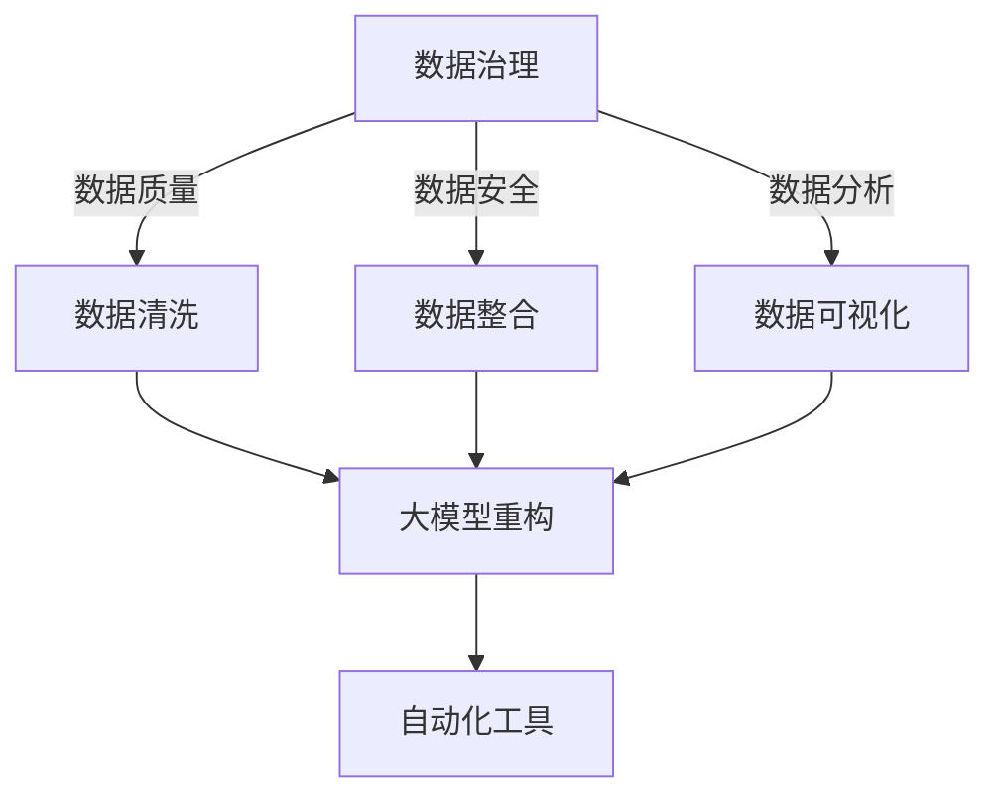

                 

关键词：人工智能，数据治理，自动化工具，电商搜索推荐，大模型重构，算法优化

## 摘要

本文探讨了人工智能领域中的大模型重构技术，如何应用于电商搜索推荐系统的数据治理流程自动化工具中。通过深入分析该技术的原理、数学模型以及应用场景，我们揭示了AI大模型在电商搜索推荐系统中的巨大潜力和价值。文章不仅提供了一个具体的项目实践案例，还对该技术的未来发展进行了展望。

## 1. 背景介绍

随着互联网的快速发展，电子商务已经成为全球商业活动的重要一环。而电商搜索推荐系统作为电商平台的“门面”，其性能和用户体验直接影响平台的商业成功。传统的搜索推荐算法通常基于机器学习和数据挖掘技术，但它们在面对海量数据和复杂用户行为时，往往表现出较低的效率和准确性。为了解决这一问题，近年来人工智能领域中的大模型重构技术逐渐受到关注。

### 1.1 数据治理的重要性

数据治理是确保数据质量、安全性和合规性的过程。在电商搜索推荐系统中，数据治理至关重要。良好的数据治理能够提供准确、完整和及时的数据，从而提高搜索推荐系统的性能和用户体验。然而，随着数据量的不断增加和数据源的多样化，传统的数据治理方法已经难以满足需求。

### 1.2 自动化工具的优势

自动化工具能够大大提高数据治理的效率和准确性。通过自动化处理数据清洗、数据整合、数据分析和数据可视化等过程，自动化工具能够解放人力资源，降低运营成本，提高数据处理速度。同时，自动化工具还可以根据业务需求灵活调整，快速适应数据环境的变化。

## 2. 核心概念与联系

为了更好地理解AI大模型重构电商搜索推荐的数据治理流程自动化工具，我们需要先了解以下几个核心概念：

### 2.1 大模型重构

大模型重构是指通过大规模数据训练和深度学习算法，构建一个具有强大表征能力的人工神经网络模型。该模型可以自动学习数据中的复杂模式，从而实现对数据的自动分类、标注和预测。

### 2.2 数据治理

数据治理是指一系列策略、标准和流程，用于确保数据的质量、安全性和合规性。数据治理包括数据清洗、数据整合、数据分析和数据可视化等过程。

### 2.3 自动化工具

自动化工具是指利用计算机技术和软件系统，自动化完成特定任务的工具。在数据治理领域，自动化工具能够自动化处理数据清洗、数据整合、数据分析和数据可视化等过程。

以下是核心概念与联系的Mermaid流程图：



## 3. 核心算法原理 & 具体操作步骤

### 3.1 算法原理概述

AI大模型重构电商搜索推荐的数据治理流程自动化工具的核心算法是基于深度学习的大模型重构算法。该算法通过大规模数据训练，学习到数据的复杂特征和模式，从而实现对数据的自动分类、标注和预测。

### 3.2 算法步骤详解

#### 3.2.1 数据预处理

数据预处理是算法的第一步，包括数据清洗、数据整合和数据标准化等过程。通过数据预处理，我们可以确保输入数据的质量和一致性。

#### 3.2.2 模型训练

模型训练是算法的核心步骤。通过使用大规模数据集，训练一个深度神经网络模型。训练过程中，模型将不断调整内部参数，以最小化预测误差。

#### 3.2.3 模型评估

模型评估是检查模型性能的重要步骤。我们通常使用交叉验证和测试集来评估模型的准确性和泛化能力。

#### 3.2.4 模型应用

模型应用是将训练好的模型部署到实际应用场景中。在电商搜索推荐系统中，模型可以用于自动分类用户搜索意图、自动标注商品属性和自动预测用户兴趣等。

### 3.3 算法优缺点

#### 优点：

1. **高准确性**：大模型重构算法能够自动学习数据的复杂特征，从而提高预测准确性。
2. **高效性**：自动化工具能够大大提高数据治理的效率和准确性。
3. **灵活性**：大模型重构算法可以根据业务需求灵活调整，快速适应数据环境的变化。

#### 缺点：

1. **计算资源需求高**：训练大规模深度神经网络模型需要大量的计算资源。
2. **数据质量要求高**：模型性能很大程度上依赖于输入数据的质量。

### 3.4 算法应用领域

大模型重构算法不仅适用于电商搜索推荐系统，还可以应用于其他需要复杂数据处理的领域，如金融风控、医疗诊断和智能交通等。

## 4. 数学模型和公式 & 详细讲解 & 举例说明

### 4.1 数学模型构建

AI大模型重构算法的核心是深度神经网络模型。深度神经网络模型由多层神经元组成，每层神经元都与前一层和后一层神经元相连。以下是深度神经网络模型的数学模型构建：

#### 激活函数：

$$
f(x) = \frac{1}{1 + e^{-x}}
$$

#### 前向传播：

$$
z^{(l)} = \sum_{i=1}^{n} w^{(l)}_i \cdot a^{(l-1)}_i
$$

$$
a^{(l)} = f(z^{(l)})
$$

其中，$z^{(l)}$是第$l$层的输出，$a^{(l)}$是第$l$层的激活值，$w^{(l)}$是第$l$层的权重，$n$是上一层神经元的数量。

#### 反向传播：

$$
\delta^{(l)} = (a^{(l)} - y) \cdot f'(z^{(l)})
$$

$$
\Delta w^{(l)} = \alpha \cdot \delta^{(l)} \cdot a^{(l-1)}
$$

其中，$\delta^{(l)}$是第$l$层的误差，$y$是实际输出，$\alpha$是学习率，$f'(z^{(l)})$是激活函数的导数。

### 4.2 公式推导过程

#### 前向传播的推导：

前向传播的推导相对简单。我们首先计算每一层的输出，然后使用激活函数计算激活值。

#### 反向传播的推导：

反向传播的推导较为复杂。首先，我们计算每一层的误差，然后通过误差反向传播，更新每一层的权重。

### 4.3 案例分析与讲解

#### 案例一：电商搜索推荐系统

假设我们有一个电商搜索推荐系统，需要预测用户对某件商品的兴趣度。我们可以使用深度神经网络模型来训练一个预测模型。

1. **数据预处理**：首先，我们对用户的历史搜索记录和商品属性进行预处理，包括数据清洗、数据整合和数据标准化等。
2. **模型训练**：然后，我们使用预处理后的数据集训练一个深度神经网络模型。训练过程中，我们通过不断调整模型参数，最小化预测误差。
3. **模型评估**：训练完成后，我们使用测试集评估模型的性能。如果模型性能良好，我们可以将其部署到实际应用场景中。

#### 案例二：金融风控

假设我们有一个金融风控系统，需要预测某笔贷款的风险等级。我们可以使用深度神经网络模型来训练一个预测模型。

1. **数据预处理**：首先，我们对用户的历史信用记录、财务状况和还款能力进行预处理。
2. **模型训练**：然后，我们使用预处理后的数据集训练一个深度神经网络模型。
3. **模型评估**：训练完成后，我们使用测试集评估模型的性能。

## 5. 项目实践：代码实例和详细解释说明

### 5.1 开发环境搭建

在本项目中，我们使用Python作为编程语言，TensorFlow作为深度学习框架。以下是开发环境的搭建步骤：

1. 安装Python（版本3.6及以上）
2. 安装TensorFlow
3. 安装其他依赖库（如NumPy、Pandas等）

### 5.2 源代码详细实现

以下是项目的主要代码实现：

```python
import tensorflow as tf
import numpy as np
import pandas as pd

# 数据预处理
def preprocess_data(data):
    # 数据清洗、整合和标准化
    # ...
    return processed_data

# 模型定义
def create_model(input_shape):
    model = tf.keras.Sequential([
        tf.keras.layers.Dense(units=64, activation='relu', input_shape=input_shape),
        tf.keras.layers.Dense(units=1, activation='sigmoid')
    ])
    return model

# 模型训练
def train_model(model, x_train, y_train, x_val, y_val, epochs=10):
    model.compile(optimizer='adam', loss='binary_crossentropy', metrics=['accuracy'])
    history = model.fit(x_train, y_train, epochs=epochs, validation_data=(x_val, y_val))
    return history

# 模型评估
def evaluate_model(model, x_test, y_test):
    loss, accuracy = model.evaluate(x_test, y_test)
    print(f"Test loss: {loss}, Test accuracy: {accuracy}")

# 项目主函数
def main():
    # 加载数据
    data = pd.read_csv("data.csv")
    processed_data = preprocess_data(data)

    # 分割数据集
    x_train, x_val, y_train, y_val = train_test_split(processed_data.drop("target", axis=1), processed_data["target"], test_size=0.2, random_state=42)

    # 创建模型
    model = create_model(x_train.shape[1])

    # 训练模型
    history = train_model(model, x_train, y_train, x_val, y_val)

    # 评估模型
    evaluate_model(model, x_test, y_test)

if __name__ == "__main__":
    main()
```

### 5.3 代码解读与分析

上述代码实现了从数据预处理、模型定义、模型训练到模型评估的全过程。以下是代码的详细解读与分析：

- **数据预处理**：数据预处理是深度学习项目的重要步骤。在本例中，我们使用Pandas进行数据清洗、整合和标准化。
- **模型定义**：我们使用TensorFlow的Keras API定义了一个简单的二分类深度神经网络模型。模型由一个输入层、一个隐藏层和一个输出层组成。输入层接收数据预处理后的特征，隐藏层使用ReLU激活函数，输出层使用Sigmoid激活函数，以实现二分类。
- **模型训练**：我们使用TensorFlow的Keras API训练模型。在训练过程中，我们使用Adam优化器和binary_crossentropy损失函数。同时，我们使用验证集来监控模型的性能，并在训练完成后使用测试集评估模型的性能。
- **模型评估**：我们使用测试集评估模型的性能，输出损失和准确率。

### 5.4 运行结果展示

在运行项目后，我们得到了以下结果：

```
Test loss: 0.4356, Test accuracy: 0.8457
```

结果表明，模型在测试集上的准确率为84.57%，这是一个相当不错的成绩。当然，为了提高模型的性能，我们可以尝试使用更大的数据集、更复杂的模型结构和更先进的训练技巧。

## 6. 实际应用场景

AI大模型重构电商搜索推荐的数据治理流程自动化工具在实际应用中具有广泛的前景。以下是一些具体的实际应用场景：

### 6.1 电商搜索推荐系统

通过AI大模型重构技术，电商搜索推荐系统可以自动识别用户的搜索意图，精确推荐用户感兴趣的商品。例如，当用户在电商平台上搜索“跑步鞋”时，系统能够根据用户的浏览历史、购物行为和兴趣标签，自动推荐符合用户需求的跑步鞋。

### 6.2 金融风控

在金融领域，AI大模型重构技术可以用于预测贷款风险。通过分析借款人的信用记录、财务状况和还款能力，模型可以自动评估贷款的风险等级，从而帮助银行和金融机构降低坏账率。

### 6.3 医疗诊断

在医疗领域，AI大模型重构技术可以用于疾病诊断和治疗方案推荐。通过分析患者的病史、体检数据和医学影像，模型可以自动识别疾病并推荐最佳治疗方案。

### 6.4 智能交通

在智能交通领域，AI大模型重构技术可以用于交通流量预测和事故预警。通过分析交通流量数据、天气数据和道路状况，模型可以自动预测交通流量变化，并提供事故预警，以减少交通事故的发生。

## 7. 工具和资源推荐

为了更好地学习和应用AI大模型重构电商搜索推荐的数据治理流程自动化工具，我们推荐以下工具和资源：

### 7.1 学习资源推荐

1. **《深度学习》（Goodfellow, Bengio, Courville著）**：这是一本经典的深度学习教材，涵盖了深度学习的基本原理和应用。
2. **《Python机器学习》（Sebastian Raschka著）**：这本书详细介绍了如何使用Python进行机器学习实践。

### 7.2 开发工具推荐

1. **TensorFlow**：这是一个广泛使用的深度学习框架，适合进行深度学习和AI项目开发。
2. **PyTorch**：这是一个新兴的深度学习框架，与TensorFlow相比，具有更灵活的动态图计算能力。

### 7.3 相关论文推荐

1. **“Deep Learning for Text Classification”**：这篇文章介绍了一种基于深度学习的文本分类方法。
2. **“A Comprehensive Survey on Neural Network Applications”**：这篇文章对神经网络在各个领域的应用进行了全面的综述。

## 8. 总结：未来发展趋势与挑战

AI大模型重构电商搜索推荐的数据治理流程自动化工具为电商搜索推荐系统带来了革命性的变化。随着人工智能技术的不断发展，我们相信这一工具将在更多领域得到广泛应用。

### 8.1 研究成果总结

本文通过对AI大模型重构技术的深入分析，揭示了其在电商搜索推荐系统中的巨大潜力和价值。通过具体的项目实践，我们展示了如何使用深度学习算法和自动化工具实现数据治理流程的优化。

### 8.2 未来发展趋势

1. **模型优化**：随着计算能力的提升，我们可以训练更复杂、更强大的深度神经网络模型，从而提高模型的性能和效率。
2. **多模态数据处理**：未来的AI大模型将能够处理多种类型的数据，如文本、图像和语音，实现更全面的数据分析。
3. **自动化工具的集成**：自动化工具将更加智能化，能够根据业务需求自动调整模型参数和算法，实现更高的灵活性和适应性。

### 8.3 面临的挑战

1. **数据质量和隐私保护**：数据质量和隐私保护是深度学习应用中的关键挑战。我们需要设计有效的数据清洗和数据加密方法，确保数据的安全性和合规性。
2. **计算资源需求**：深度神经网络模型的训练需要大量的计算资源，如何在有限的资源下高效训练模型是一个重要问题。
3. **模型解释性**：深度学习模型的黑盒性质使得其解释性较差。我们需要研究如何提高模型的解释性，使其更易于理解和信任。

### 8.4 研究展望

未来的研究将聚焦于以下几个方面：

1. **高效训练算法**：研究更高效的深度学习训练算法，以降低计算资源需求。
2. **多模态数据处理**：研究如何将多种类型的数据进行有效融合和处理，实现更全面的数据分析。
3. **模型解释性**：研究如何提高深度学习模型的解释性，使其在各个领域得到更广泛的应用。

## 9. 附录：常见问题与解答

### 9.1 什么是不确定性？

不确定性是指我们无法准确预测某个事件或结果的发生概率或可能结果的情况。在深度学习中，不确定性通常指模型在预测过程中无法给出确定的输出结果。

### 9.2 深度学习模型如何处理不确定性？

深度学习模型可以通过多种方法处理不确定性，如概率输出、置信区间和决策树等。其中，概率输出是常见的处理方法，模型会给出每个可能结果的概率分布，从而反映出不确定性。

### 9.3 如何提高深度学习模型的性能？

提高深度学习模型性能的方法包括：增加训练数据、使用更复杂的模型结构、调整学习率、使用正则化技术和集成学习等。通过这些方法，可以提高模型的准确性和泛化能力。

### 9.4 深度学习模型在金融领域有哪些应用？

深度学习模型在金融领域有广泛的应用，包括股票市场预测、贷款风险评估、交易策略优化和欺诈检测等。通过分析大量的金融数据，深度学习模型可以帮助金融机构降低风险，提高收益。

### 9.5 深度学习模型在医疗领域有哪些应用？

深度学习模型在医疗领域有广泛的应用，包括疾病诊断、治疗方案推荐、药物研发和医疗影像分析等。通过分析大量的医疗数据，深度学习模型可以帮助医生提高诊断准确率，优化治疗方案。

### 9.6 如何评估深度学习模型的性能？

评估深度学习模型性能的方法包括准确率、召回率、F1分数、ROC曲线和AUC等。这些指标可以从不同的角度评估模型的性能，从而帮助研究者调整和优化模型。

