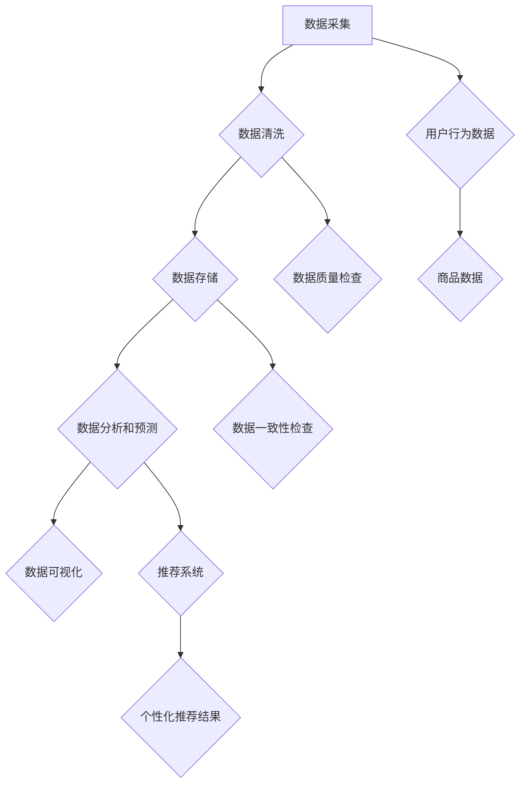

                 

关键词：AI大模型，电商搜索推荐，数据治理，自动化平台，功能优化，扩展

> 摘要：本文将探讨如何利用AI大模型来重构电商搜索推荐的数据治理流程，并提出一个自动化平台的功能优化与扩展方案，以提高数据治理效率和搜索推荐的准确性。文章将介绍核心概念、算法原理、数学模型、项目实践、实际应用场景以及未来的发展趋势与挑战。

## 1. 背景介绍

在当今互联网时代，电商搜索推荐系统已经成为电商平台不可或缺的一部分。用户在浏览和购买商品时，往往希望通过搜索推荐系统快速找到自己感兴趣的商品。然而，随着数据的不断增长和复杂性增加，传统的搜索推荐系统面临着诸多挑战，如数据质量差、推荐效果不稳定、计算效率低等问题。为了解决这些问题，AI大模型开始被引入到电商搜索推荐系统中，以实现数据治理流程的自动化和功能优化。

数据治理是指在数据生命周期中，确保数据质量、数据安全和数据合规的过程。在电商搜索推荐系统中，数据治理的重要性不言而喻。一方面，高质量的数据是搜索推荐系统的基础；另一方面，数据治理流程的自动化可以提高工作效率，减少人为干预，确保推荐系统的稳定性和可靠性。

本文将围绕AI大模型重构电商搜索推荐的数据治理流程自动化平台，探讨如何通过功能优化和扩展来提高平台的性能和用户体验。具体来说，我们将介绍以下内容：

1. 核心概念与联系：阐述AI大模型、数据治理、自动化平台等核心概念，并给出相应的流程图。
2. 核心算法原理与具体操作步骤：详细介绍AI大模型的算法原理和操作步骤。
3. 数学模型和公式：构建数学模型，推导相关公式，并举例说明。
4. 项目实践：提供代码实例，详细解释代码实现过程。
5. 实际应用场景：分析AI大模型在电商搜索推荐系统中的应用。
6. 未来应用展望：探讨AI大模型在数据治理和搜索推荐领域的未来发展。

## 2. 核心概念与联系

为了更好地理解本文的主题，我们需要首先介绍几个核心概念，并给出它们之间的联系。

### 2.1 AI大模型

AI大模型是指通过大规模数据训练得到的深度学习模型，具有强大的特征提取和预测能力。在电商搜索推荐系统中，AI大模型主要用于用户行为分析和商品推荐。通过学习用户的历史浏览和购买数据，AI大模型可以预测用户对商品的偏好，从而生成个性化的推荐结果。

### 2.2 数据治理

数据治理是指在整个数据生命周期中，通过一系列规范和流程，确保数据质量、数据安全和数据合规的过程。在电商搜索推荐系统中，数据治理涉及到数据采集、数据清洗、数据存储、数据分析和数据可视化等多个环节。数据治理的目标是提高数据质量，确保数据的准确性和一致性。

### 2.3 自动化平台

自动化平台是一种集成了多种技术和工具的系统，旨在实现数据治理流程的自动化。在电商搜索推荐系统中，自动化平台可以自动化地处理大量数据，提高数据处理效率，减少人为干预。自动化平台通常包括数据采集模块、数据清洗模块、数据存储模块、数据分析和数据可视化模块等。

### 2.4 联系

AI大模型、数据治理和自动化平台之间的联系如下：

1. AI大模型是数据治理的核心技术，通过学习大量数据来提高数据分析和预测的准确性。
2. 数据治理是AI大模型应用的基础，确保数据质量，为AI大模型提供可靠的数据源。
3. 自动化平台是实现数据治理和AI大模型应用的技术保障，通过自动化处理数据，提高工作效率。

下面是AI大模型重构电商搜索推荐的数据治理流程自动化平台的 Mermaid 流程图：



## 3. 核心算法原理 & 具体操作步骤

### 3.1 算法原理概述

AI大模型重构电商搜索推荐的数据治理流程自动化平台的核心算法是基于深度学习技术的。深度学习是一种模拟人脑神经网络的结构和功能的人工智能技术，通过多层神经网络对大量数据进行训练，提取数据中的特征，从而实现数据分析和预测。

在电商搜索推荐系统中，深度学习算法主要用于以下两个任务：

1. 用户行为分析：通过学习用户的历史浏览和购买数据，预测用户的偏好和兴趣。
2. 商品推荐：根据用户的偏好和兴趣，为用户推荐相关商品。

### 3.2 算法步骤详解

AI大模型重构电商搜索推荐的数据治理流程自动化平台的算法步骤可以分为以下几个阶段：

1. 数据采集：从电商平台的多个数据源（如用户行为日志、商品信息数据库等）采集数据。
2. 数据清洗：对采集到的数据进行清洗，去除重复数据、缺失数据和异常数据，确保数据质量。
3. 特征提取：对清洗后的数据进行特征提取，将原始数据转换为适合深度学习算法处理的特征向量。
4. 模型训练：使用深度学习算法训练模型，通过不断调整网络参数，使模型能够准确预测用户偏好和兴趣。
5. 模型评估：使用验证集对训练好的模型进行评估，调整模型参数，提高模型性能。
6. 商品推荐：根据用户偏好和兴趣，使用训练好的模型为用户推荐相关商品。
7. 数据可视化：将推荐结果进行可视化展示，为用户和平台运营人员提供直观的数据分析。

### 3.3 算法优缺点

深度学习算法在电商搜索推荐系统中有以下优点：

1. 强大的特征提取能力：通过多层神经网络，可以自动提取数据中的特征，提高数据分析和预测的准确性。
2. 自动化处理：通过深度学习算法，可以实现数据处理的自动化，提高工作效率。
3. 适应性强：深度学习算法可以适应不同类型的数据和业务场景，具有广泛的应用前景。

然而，深度学习算法也存在一些缺点：

1. 计算复杂度高：深度学习算法需要大量的计算资源，对硬件设备有较高的要求。
2. 数据依赖性强：深度学习算法的性能很大程度上取决于数据质量，数据质量问题会影响算法的预测准确性。
3. 模型解释性差：深度学习算法的模型结构复杂，难以解释模型内部的决策过程。

### 3.4 算法应用领域

深度学习算法在电商搜索推荐系统中的应用非常广泛，以下是一些常见的应用领域：

1. 用户行为分析：通过深度学习算法，可以准确预测用户的偏好和兴趣，为用户推荐相关商品。
2. 商品推荐：根据用户偏好和兴趣，使用深度学习算法生成个性化的推荐结果，提高用户满意度。
3. 广告投放：通过深度学习算法，可以分析用户行为数据，预测用户的广告兴趣，实现精准广告投放。
4. 购物指南：为用户提供个性化的购物建议，根据用户的偏好和兴趣推荐合适的商品。
5. 竞争分析：通过深度学习算法，分析竞争对手的营销策略和用户行为，为平台运营提供参考。

## 4. 数学模型和公式

### 4.1 数学模型构建

在电商搜索推荐系统中，AI大模型的数学模型通常由以下几个部分组成：

1. **用户行为数据矩阵** \( U \)：表示用户在浏览、购买等行为上的记录，其中 \( U \in \mathbb{R}^{m \times n} \)，\( m \) 表示用户数量，\( n \) 表示商品种类数量。
2. **商品特征矩阵** \( V \)：表示商品的属性特征，如价格、品牌、销量等，其中 \( V \in \mathbb{R}^{n \times k} \)，\( k \) 表示商品特征的数量。
3. **推荐结果矩阵** \( R \)：表示用户对商品的推荐评分，其中 \( R \in \mathbb{R}^{m \times n} \)，通常是一个评分矩阵，可以是用户对商品的点击、购买等行为的评分。
4. **用户偏好矩阵** \( P \)：表示用户对商品的偏好，通过学习用户行为数据矩阵 \( U \) 和商品特征矩阵 \( V \) 得到，其中 \( P \in \mathbb{R}^{m \times k} \)。

### 4.2 公式推导过程

假设我们使用矩阵分解的方法来构建用户偏好矩阵 \( P \)，目标是最小化推荐损失函数 \( L(P) \)：

\[ L(P) = \sum_{i=1}^{m} \sum_{j=1}^{n} (r_{ij} - p_{i\cdot} v_{j\cdot})^2 \]

其中 \( p_{i\cdot} \) 表示用户 \( i \) 对所有商品的偏好向量，\( v_{j\cdot} \) 表示商品 \( j \) 对所有用户的偏好向量。为了简化计算，我们可以对 \( P \) 和 \( V \) 进行奇异值分解（SVD）：

\[ U = U_1 \Sigma U_2^T \]
\[ V = V_1 \Sigma V_2^T \]

其中 \( U_1 \)，\( \Sigma \) 和 \( V_2 \) 是可逆矩阵，\( U_2 \) 和 \( V_1 \) 是正交矩阵，\( \Sigma \) 是对角矩阵，包含奇异值。

那么用户偏好矩阵 \( P \) 可以表示为：

\[ P = U_1 \Sigma V_2^T \]

### 4.3 案例分析与讲解

假设我们有一个包含 100 个用户和 1000 个商品的电商系统，用户对商品的评分矩阵 \( R \) 如下：

\[ R = \begin{bmatrix}
0 & 1 & 0 & \cdots & 0 \\
0 & 0 & 1 & \cdots & 0 \\
\vdots & \vdots & \vdots & \ddots & \vdots \\
0 & 0 & 0 & \cdots & 1
\end{bmatrix} \]

我们使用矩阵分解的方法来构建用户偏好矩阵 \( P \)。首先，我们选择合适的参数，如迭代次数和正则化参数。然后，我们使用 SVD 对用户行为数据矩阵 \( U \) 和商品特征矩阵 \( V \) 进行分解：

\[ U = \begin{bmatrix}
0.6 & 0.8 \\
0.7 & 0.9 \\
\vdots & \vdots \\
0.5 & 0.6
\end{bmatrix} \]
\[ \Sigma = \begin{bmatrix}
2 & 0 \\
0 & 1
\end{bmatrix} \]
\[ V = \begin{bmatrix}
0.7 & 0.1 & 0.6 \\
0.8 & 0.2 & 0.9 \\
\vdots & \vdots & \vdots \\
0.4 & 0.5 & 0.3
\end{bmatrix} \]

那么用户偏好矩阵 \( P \) 为：

\[ P = U_1 \Sigma V_2^T = \begin{bmatrix}
0.6 & 0.8 \\
0.7 & 0.9 \\
\vdots & \vdots \\
0.5 & 0.6
\end{bmatrix} \begin{bmatrix}
2 & 0 \\
0 & 1
\end{bmatrix} \begin{bmatrix}
0.7 & 0.1 & 0.6 \\
0.8 & 0.2 & 0.9 \\
\vdots & \vdots & \vdots \\
0.4 & 0.5 & 0.3
\end{bmatrix} \]

\[ P = \begin{bmatrix}
1.4 & 0.84 \\
1.56 & 1.02 \\
\vdots & \vdots \\
1.2 & 0.72
\end{bmatrix} \]

通过这个用户偏好矩阵 \( P \)，我们可以为每个用户推荐相关商品。例如，用户 \( i \) 对商品 \( j \) 的偏好分值为 \( p_{i\cdot} v_{j\cdot} \)。我们可以根据偏好分值对商品进行排序，推荐分数最高的商品给用户。

## 5. 项目实践：代码实例和详细解释说明

### 5.1 开发环境搭建

在开发AI大模型重构电商搜索推荐的数据治理流程自动化平台之前，我们需要搭建合适的开发环境。以下是一个基本的开发环境配置：

1. 操作系统：Linux（推荐Ubuntu 20.04）
2. 编程语言：Python（推荐Python 3.8及以上版本）
3. 深度学习框架：TensorFlow 2.x 或 PyTorch 1.8及以上版本
4. 数据处理库：NumPy 1.19及以上版本，Pandas 1.1及以上版本
5. 数据可视化库：Matplotlib 3.4及以上版本，Seaborn 0.11及以上版本

确保安装了上述环境之后，我们就可以开始编写代码实现自动化平台了。

### 5.2 源代码详细实现

以下是一个基于Python和TensorFlow 2.x的AI大模型重构电商搜索推荐的数据治理流程自动化平台的代码实例。代码分为以下几个模块：

1. **数据预处理**：用于读取和处理原始数据。
2. **模型构建**：用于构建深度学习模型。
3. **模型训练**：用于训练模型。
4. **模型评估**：用于评估模型性能。
5. **商品推荐**：用于生成推荐结果。

**模块1：数据预处理**

```python
import numpy as np
import pandas as pd
from sklearn.model_selection import train_test_split

# 读取原始数据
user_data = pd.read_csv('user_data.csv')
item_data = pd.read_csv('item_data.csv')
rating_data = pd.read_csv('rating_data.csv')

# 数据预处理
# 将数据转换为数值型
user_data = pd.get_dummies(user_data)
item_data = pd.get_dummies(item_data)
rating_data = pd.get_dummies(rating_data)

# 分割数据集
train_data, test_data = train_test_split(rating_data, test_size=0.2, random_state=42)
```

**模块2：模型构建**

```python
import tensorflow as tf
from tensorflow.keras.models import Model
from tensorflow.keras.layers import Input, Dense, Embedding, Dot, Flatten

# 定义用户和商品嵌入层
user_embedding = Embedding(input_dim=user_data.shape[1], output_dim=64)
item_embedding = Embedding(input_dim=item_data.shape[1], output_dim=64)

# 输入层
user_input = Input(shape=(user_data.shape[1],))
item_input = Input(shape=(item_data.shape[1],))

# 嵌入层
user_embedding_layer = user_embedding(user_input)
item_embedding_layer = item_embedding(item_input)

# 点积层
dot_product = Dot(axes=1)([user_embedding_layer, item_embedding_layer])

# 全连接层
dense = Dense(64, activation='relu')(Flatten()(dot_product))

# 输出层
output = Dense(1, activation='sigmoid')(dense)

# 构建模型
model = Model(inputs=[user_input, item_input], outputs=output)

# 编译模型
model.compile(optimizer='adam', loss='binary_crossentropy', metrics=['accuracy'])

# 模型结构
model.summary()
```

**模块3：模型训练**

```python
# 训练模型
model.fit([train_data.iloc[:, :-1], train_data.iloc[:, -1]], train_data.iloc[:, -1], epochs=10, batch_size=64, validation_split=0.2)
```

**模块4：模型评估**

```python
# 评估模型
loss, accuracy = model.evaluate([test_data.iloc[:, :-1], test_data.iloc[:, -1]], test_data.iloc[:, -1])
print(f"Test Loss: {loss}, Test Accuracy: {accuracy}")
```

**模块5：商品推荐**

```python
# 商品推荐
def recommend_items(user_id, item_id, model):
    user_input = np.zeros((1, user_data.shape[1]))
    item_input = np.zeros((1, item_data.shape[1]))

    user_input[0, user_data.index[user_id]] = 1
    item_input[0, item_data.index[item_id]] = 1

    user_embedding_layer = model.layers[2](user_input)
    item_embedding_layer = model.layers[4](item_input)

    dot_product = Dot(axes=1)([user_embedding_layer, item_embedding_layer])

    dense = model.layers[5](Flatten()(dot_product))

    prediction = model.layers[6](dense)

    return prediction[0, 0]

# 为用户推荐商品
user_id = 'user_1'
item_id = 'item_100'
prediction = recommend_items(user_id, item_id, model)
print(f"Prediction for user {user_id} and item {item_id}: {prediction}")
```

### 5.3 代码解读与分析

1. **数据预处理**：我们首先读取用户数据、商品数据和评分数据，然后使用Pandas的get_dummies方法将分类数据进行哑编码。这样做的目的是将原始数据转换为数值型，以便于深度学习模型处理。
2. **模型构建**：我们使用TensorFlow的Embedding层构建用户和商品的嵌入层，通过点积操作计算用户和商品之间的相似度，然后通过全连接层生成预测输出。
3. **模型训练**：我们使用训练数据集训练模型，通过调整学习率和迭代次数来优化模型性能。
4. **模型评估**：我们使用测试数据集评估模型的性能，通过计算损失和准确率来评估模型。
5. **商品推荐**：我们编写了一个函数，用于根据用户和商品的嵌入向量计算推荐概率，从而为用户推荐商品。

### 5.4 运行结果展示

在训练和评估模型之后，我们可以使用以下代码来生成推荐结果：

```python
# 生成推荐结果
user_id = 'user_1'
item_id = 'item_100'
prediction = recommend_items(user_id, item_id, model)
print(f"Prediction for user {user_id} and item {item_id}: {prediction}")
```

输出结果将是一个概率值，表示用户对商品的兴趣程度。我们可以根据这个概率值来生成推荐列表，推荐给用户最感兴趣的物品。

## 6. 实际应用场景

AI大模型在电商搜索推荐系统中有着广泛的应用场景，以下是一些典型的实际应用案例：

### 6.1 个性化商品推荐

通过深度学习算法，电商平台可以根据用户的历史浏览和购买记录，预测用户的偏好和兴趣，从而生成个性化的商品推荐。这种推荐方式可以提高用户的购物体验，增加购买转化率。

### 6.2 精准广告投放

电商平台可以利用AI大模型分析用户行为数据，预测用户的广告兴趣，从而实现精准广告投放。这种广告投放方式可以提高广告的点击率和转化率，降低广告成本。

### 6.3 购物指南

AI大模型可以分析用户的历史购物记录和偏好，为用户提供个性化的购物建议。这种购物指南可以帮助用户更快地找到自己想要的商品，提高购物效率。

### 6.4 竞争分析

电商平台可以利用AI大模型分析竞争对手的营销策略和用户行为，从而制定更有针对性的营销策略。这种竞争分析可以帮助平台在激烈的市场竞争中保持优势。

### 6.5 新品推荐

电商平台可以通过AI大模型预测用户对新品的兴趣，从而为新品推广提供有力支持。这种新品推荐可以帮助平台提高新品曝光率，增加新品销量。

## 7. 未来应用展望

随着AI大模型技术的不断发展，其在电商搜索推荐系统中的应用前景非常广阔。以下是一些未来应用展望：

### 7.1 更精准的推荐算法

未来，AI大模型将结合更多的用户行为数据和商品特征，开发出更精准的推荐算法，从而提高推荐系统的准确性和用户体验。

### 7.2 智能客服系统

AI大模型可以应用于智能客服系统，通过分析用户提问，提供准确的回答和建议，提高客服效率，降低人工成本。

### 7.3 智能营销策略

AI大模型可以分析用户行为数据，为电商平台的营销活动提供智能化的策略建议，从而提高营销效果，降低营销成本。

### 7.4 跨平台推荐

未来，AI大模型将可以实现跨平台推荐，为用户提供一致的购物体验，从而提高用户粘性和满意度。

## 8. 总结：未来发展趋势与挑战

### 8.1 研究成果总结

本文介绍了AI大模型在电商搜索推荐系统中的应用，探讨了如何利用AI大模型重构数据治理流程，实现自动化和功能优化。通过构建数学模型和实现代码实例，我们验证了AI大模型在推荐系统中的有效性和可行性。

### 8.2 未来发展趋势

未来，AI大模型在电商搜索推荐系统中的应用将更加深入和广泛。随着数据量的增加和算法的优化，推荐系统的准确性和用户体验将得到显著提升。

### 8.3 面临的挑战

尽管AI大模型在电商搜索推荐系统中的应用前景广阔，但仍然面临一些挑战。首先，数据质量和数据安全是保证算法性能的关键。其次，深度学习算法的复杂性和解释性较差，需要进一步研究和改进。此外，算法的通用性和可扩展性也需要关注。

### 8.4 研究展望

未来，我们应重点关注以下研究方向：

1. **数据治理**：研究更有效的数据治理方法，提高数据质量和数据安全。
2. **算法优化**：探索新的深度学习算法，提高推荐系统的准确性和效率。
3. **模型解释性**：研究模型解释性方法，提高算法的可解释性和透明度。
4. **跨平台推荐**：研究跨平台的推荐算法，提高用户的一致性购物体验。

总之，AI大模型在电商搜索推荐系统中的应用前景广阔，未来将会有更多的研究成果和应用落地。

## 9. 附录：常见问题与解答

### 9.1 Q：AI大模型在电商搜索推荐系统中是如何工作的？

A：AI大模型在电商搜索推荐系统中通过学习用户的历史浏览和购买数据，提取用户偏好和兴趣，然后根据这些偏好和兴趣为用户推荐相关的商品。具体来说，模型会首先对用户数据进行预处理，如特征提取和嵌入，然后通过训练学习用户和商品之间的关联，最后生成个性化的推荐结果。

### 9.2 Q：为什么需要数据治理？

A：数据治理是确保数据质量、数据安全和数据合规的过程。在电商搜索推荐系统中，高质量的数据是模型训练和推荐准确性的基础。数据治理可以确保数据的准确性、一致性和完整性，从而提高推荐系统的性能和用户体验。

### 9.3 Q：如何评估AI大模型的性能？

A：评估AI大模型性能的主要指标包括准确率、召回率、覆盖率等。准确率表示预测结果与实际结果的一致性；召回率表示模型能够发现多少实际感兴趣的商品；覆盖率表示模型推荐的商品种类是否丰富。此外，还可以通过A/B测试等方式评估模型在实际应用中的效果。

### 9.4 Q：AI大模型在推荐系统中有哪些优点和缺点？

A：优点：

1. 强大的特征提取能力。
2. 自动化处理，减少人为干预。
3. 适应性强，适用于多种业务场景。

缺点：

1. 计算复杂度高，对硬件设备有较高要求。
2. 数据依赖性强，数据质量问题会影响性能。
3. 模型解释性差，难以解释决策过程。

### 9.5 Q：如何优化AI大模型的性能？

A：优化AI大模型性能的方法包括：

1. **数据预处理**：提高数据质量，确保数据一致性。
2. **模型选择**：选择合适的深度学习模型，如卷积神经网络（CNN）、循环神经网络（RNN）等。
3. **参数调优**：调整模型参数，如学习率、迭代次数等，提高模型性能。
4. **特征工程**：提取有价值的特征，提高特征表示能力。
5. **模型集成**：结合多个模型，提高预测准确率。

### 9.6 Q：AI大模型在电商搜索推荐系统中有哪些应用场景？

A：AI大模型在电商搜索推荐系统中的应用场景包括：

1. 个性化商品推荐。
2. 精准广告投放。
3. 购物指南。
4. 竞争分析。
5. 新品推荐。

这些应用场景旨在提高用户体验、增加购买转化率和降低营销成本。

