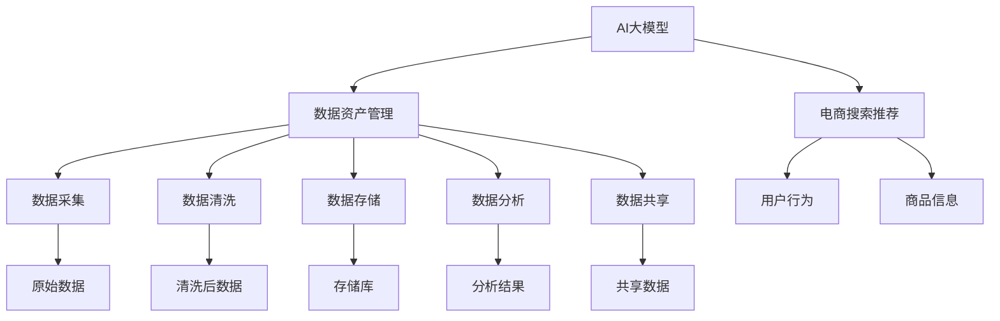

                 

## 摘要

本文旨在探讨如何利用AI大模型重构电商搜索推荐的数据资产管理流程，实现流程优化。首先，我们将介绍电商搜索推荐的基本原理和现状，阐述数据资产管理在其中的重要性。接着，本文将深入探讨AI大模型的核心概念、原理和应用场景，详细解析其重构电商搜索推荐数据资产管理流程的具体步骤和策略。随后，我们将通过数学模型和公式的推导，解释数据资产管理流程优化的内在机制。此外，本文还将结合实际项目实例，展示如何通过代码实现数据资产管理流程的优化。最后，本文将对AI大模型在电商搜索推荐领域的未来应用进行展望，并提出可能面临的挑战和解决方案。

## 1. 背景介绍

### 电商搜索推荐的现状

随着互联网的快速发展，电子商务已经成为现代商业的重要组成部分。电商搜索推荐系统作为电商平台的“大脑”，其性能直接关系到用户体验和平台盈利。然而，传统的搜索推荐系统在处理海量数据、理解用户行为和个性化推荐方面存在诸多局限。

传统电商搜索推荐系统主要依赖基于关键词匹配、协同过滤等算法进行内容推荐。这些方法在一定程度上能够满足用户的基本需求，但在面对个性化、动态变化和复杂场景时，表现欠佳。具体来说，传统系统存在以下问题：

1. **数据依赖性高**：传统推荐系统往往需要大量用户历史行为数据作为输入，缺乏对实时数据的有效利用。
2. **推荐准确性低**：传统算法在处理用户冷启动问题、个性化不足和多样性不足等方面存在挑战。
3. **扩展性差**：传统推荐系统难以应对海量数据和复杂业务场景的扩展需求。

### 数据资产管理的重要性

在电商搜索推荐系统中，数据资产是核心资源，其质量和利用效率直接影响到推荐系统的效果。因此，如何管理好数据资产，提高其利用效率，成为优化推荐系统性能的关键。

数据资产管理的重要性体现在以下几个方面：

1. **数据质量保障**：确保数据来源的可靠性、完整性和准确性，是数据资产管理的首要任务。
2. **数据安全与合规**：随着数据隐私和合规要求的提升，如何确保数据的安全性和合规性成为数据资产管理的重点。
3. **数据利用效率**：通过数据清洗、整合和分析，挖掘数据的价值，提高数据利用率。
4. **数据流通与共享**：建立高效的数据流通机制，实现跨部门、跨系统的数据共享，促进业务协同。

### 传统的数据资产管理流程及其不足

传统的数据资产管理流程通常包括数据采集、存储、处理和分析等环节。然而，随着业务规模和数据量的急剧增长，传统流程逐渐暴露出以下不足：

1. **数据处理能力有限**：传统数据处理技术难以应对海量数据的实时处理需求。
2. **数据一致性差**：数据在不同系统、不同层级之间的同步和一致性管理困难。
3. **数据利用率低**：大量数据未能得到有效利用，数据资产的价值未能充分发挥。
4. **数据安全性不足**：缺乏完善的数据安全保护机制，易导致数据泄露和违规使用。

综上所述，传统的数据资产管理流程已经难以满足现代电商搜索推荐系统的需求。因此，利用AI大模型重构数据资产管理流程，实现流程优化，成为当前亟待解决的重要课题。

## 2. 核心概念与联系

在深入探讨AI大模型重构电商搜索推荐的数据资产管理流程之前，有必要明确核心概念及其相互关系。以下是本文涉及的一些关键概念：

### 2.1 AI大模型

AI大模型（如深度学习模型、Transformer模型等）是具备强大表征能力和预测能力的人工智能系统。这些模型通过大规模数据训练，能够自动学习数据中的复杂模式和规律，从而在多种任务中表现出色。

### 2.2 数据资产管理

数据资产管理是指通过一系列策略和技术，对数据生命周期进行全程管理，包括数据采集、存储、处理、分析和共享等环节。数据资产管理的目标是确保数据质量、提升数据利用效率，并保障数据安全和合规。

### 2.3 电商搜索推荐

电商搜索推荐是指利用各种算法和技术，根据用户行为、偏好和历史数据，向用户推荐个性化商品或服务。电商搜索推荐系统在提升用户体验、增加销售额方面发挥着关键作用。

### 2.4 数据资产管理流程

数据资产管理流程包括数据采集、数据清洗、数据存储、数据分析和数据共享等环节。这些环节相互关联，共同构成了一个完整的数据资产管理体系。

下面是一个简化的Mermaid流程图，展示了上述核心概念及其相互关系：



通过这个流程图，我们可以清晰地看到AI大模型、数据资产管理、电商搜索推荐以及各环节之间的关联。AI大模型通过数据资产管理流程，对用户行为和商品信息进行处理，生成个性化的推荐结果，从而提升电商搜索推荐的准确性和用户体验。

### 2.5 数据资产管理流程优化的目标

利用AI大模型重构电商搜索推荐的数据资产管理流程，主要目标是实现以下优化：

1. **提高数据处理效率**：通过AI大模型，实现对海量数据的实时处理，提升数据处理速度和效率。
2. **提升数据利用价值**：通过数据清洗、分析和挖掘，挖掘数据中的潜在价值，提高数据利用效率。
3. **增强推荐准确性**：利用AI大模型强大的表征能力和预测能力，提高推荐系统的准确性，减少推荐偏差。
4. **保障数据安全和合规**：通过完善的数据安全措施和合规管理，确保数据资产的安全和合规性。
5. **实现业务协同**：通过数据共享和流通机制，促进跨部门、跨系统的业务协同，提升整体业务效率。

通过上述优化，AI大模型重构后的数据资产管理流程能够更好地支持电商搜索推荐系统，提升用户体验，增加平台盈利。

### 2.6 AI大模型重构数据资产管理流程的具体步骤

要利用AI大模型重构电商搜索推荐的数据资产管理流程，需要按照以下步骤进行：

#### 2.6.1 数据采集

数据采集是数据资产管理流程的第一步，也是关键的一步。AI大模型需要大量的高质量数据作为训练和预测的基础。数据来源包括用户行为数据、商品数据、交易数据等。在采集过程中，需要注意以下几个方面：

1. **数据完整性**：确保采集到的数据是完整的，避免数据缺失对模型训练和预测产生不利影响。
2. **数据多样性**：通过多样化的数据来源，提高数据的代表性，增强模型对复杂场景的适应能力。
3. **数据实时性**：采集实时数据，以便模型能够及时反映用户行为和商品信息的动态变化。

#### 2.6.2 数据清洗

数据清洗是数据资产管理流程中的核心环节，其目的是去除数据中的噪声和异常值，提高数据质量。AI大模型对数据质量要求较高，数据清洗的步骤包括：

1. **去除重复数据**：删除重复的数据记录，避免模型因重复数据而产生偏差。
2. **填补缺失值**：对于缺失的数据，采用适当的填补方法，如平均值填补、插值法等。
3. **标准化处理**：对数据进行标准化处理，确保数据在同一量级范围内，避免因数据量级差异导致模型训练偏差。
4. **异常值处理**：检测并处理异常值，避免异常值对模型训练和预测的影响。

#### 2.6.3 数据存储

数据存储是将清洗后的数据存储到合适的数据库或数据湖中，以便后续处理和查询。数据存储需要考虑以下几个方面：

1. **存储容量**：根据数据量大小，选择合适的存储方案，如关系型数据库、NoSQL数据库或数据湖。
2. **数据访问速度**：选择适合的数据存储方案，确保数据查询和处理的速度。
3. **数据安全性**：确保数据存储的安全性，采取数据加密、访问控制等措施，防止数据泄露和未经授权的访问。
4. **数据备份与恢复**：定期备份数据，确保数据在意外情况下能够快速恢复。

#### 2.6.4 数据分析

数据分析是数据资产管理流程的核心环节，通过分析数据，挖掘数据中的潜在价值和规律。数据分析的步骤包括：

1. **数据预处理**：对原始数据进行分析，识别数据中的特征，为后续分析做准备。
2. **特征工程**：通过特征提取、特征选择和特征变换等手段，生成适合模型训练的特征向量。
3. **模型训练与评估**：利用AI大模型进行训练和预测，评估模型的性能，选择最优模型。
4. **结果可视化**：将分析结果以图表、报告等形式进行可视化展示，便于理解和决策。

#### 2.6.5 数据共享

数据共享是将分析结果和有价值的数据提供给相关部门和业务系统，实现跨部门、跨系统的业务协同。数据共享需要考虑以下几个方面：

1. **数据格式统一**：确保数据在不同系统之间能够无缝对接，采用统一的数据格式和协议。
2. **数据权限管理**：根据不同部门和岗位的权限，设置数据访问权限，确保数据安全。
3. **数据接口开放**：开放数据接口，方便其他系统调用和分析数据。
4. **数据流通效率**：优化数据流通机制，确保数据能够快速、安全地传输和共享。

通过上述步骤，AI大模型能够有效地重构电商搜索推荐的数据资产管理流程，实现流程优化，提升推荐系统的性能和用户体验。

### 2.7 AI大模型的重构过程

在了解了AI大模型重构电商搜索推荐数据资产管理流程的步骤后，我们接下来将深入探讨重构过程中涉及的关键技术和方法。

#### 2.7.1 数据预处理

数据预处理是AI大模型训练的重要基础，其目的是提高数据质量，确保模型能够从数据中提取有效的特征。数据预处理包括以下关键步骤：

1. **数据清洗**：去除数据中的噪声、异常值和重复记录，确保数据的准确性和一致性。
2. **特征工程**：通过对数据进行特征提取、特征选择和特征变换，生成适合模型训练的特征向量。例如，可以采用编码、归一化、离散化等方法对数值型数据进行处理，使用词袋模型、TF-IDF等方法对文本数据进行处理。
3. **数据归一化**：将不同量级的数据进行归一化处理，确保数据在同一量级范围内，避免因数据量级差异导致模型训练偏差。

#### 2.7.2 模型选择与训练

模型选择与训练是重构过程中的核心环节，其目的是构建一个能够有效表征和预测数据的大模型。以下是关键步骤：

1. **模型选择**：根据业务需求和数据特性，选择合适的AI大模型。常见的模型包括深度神经网络、Transformer模型、自注意力模型等。模型选择需要考虑模型的复杂度、训练时间、预测准确性等因素。
2. **数据划分**：将数据集划分为训练集、验证集和测试集，用于模型的训练、验证和测试。数据划分需要保证各数据集的代表性，避免因数据分布不均导致模型过拟合。
3. **模型训练**：利用训练集数据对模型进行训练，通过优化算法（如梯度下降、Adam等）调整模型参数，使其在训练集上达到较好的拟合效果。
4. **模型验证**：利用验证集数据对模型进行验证，评估模型在未见数据上的泛化能力。通过交叉验证、ROC曲线等方法，选择最优模型。

#### 2.7.3 模型调优

模型调优是提升模型性能的重要手段，包括以下几个方面：

1. **超参数调优**：调整模型的超参数（如学习率、批量大小等），以优化模型的训练过程和性能。常用的方法包括网格搜索、随机搜索、贝叶斯优化等。
2. **数据增强**：通过数据增强技术（如随机裁剪、旋转、翻转等）增加数据的多样性，提升模型对数据的适应能力。
3. **模型融合**：将多个模型进行融合，提高模型的稳定性和预测准确性。常见的融合方法包括投票法、加权平均法、集成学习等。

#### 2.7.4 模型部署

模型部署是将训练好的模型应用到实际业务中，包括以下几个方面：

1. **模型封装**：将模型封装成可重用和可扩展的模块，方便在不同环境和场景下部署和使用。
2. **模型服务化**：将模型部署到云端或本地服务器，通过API接口提供模型服务，实现模型的高效利用。
3. **模型监控与维护**：对模型进行实时监控，包括性能监控、错误日志记录等，及时发现和解决潜在问题。

通过以上步骤，AI大模型能够重构电商搜索推荐的数据资产管理流程，实现流程优化，提升推荐系统的性能和用户体验。

### 3. 核心算法原理 & 具体操作步骤

在利用AI大模型重构电商搜索推荐的数据资产管理流程中，核心算法的原理和具体操作步骤至关重要。以下是相关算法的详细介绍。

#### 3.1 算法原理概述

AI大模型，特别是深度学习模型，在重构电商搜索推荐的数据资产管理流程中发挥了关键作用。深度学习是一种基于人工神经网络的学习方法，通过多层神经元的非线性变换，实现对复杂数据的自动特征提取和表征。

深度学习模型主要由以下几个部分组成：

1. **输入层**：接收外部输入数据，如用户行为数据、商品数据等。
2. **隐藏层**：对输入数据进行特征提取和变换，多个隐藏层可以形成深层网络结构。
3. **输出层**：根据隐藏层输出的特征，进行分类或回归预测。

深度学习模型通过反向传播算法（Backpropagation）进行训练，调整模型参数以最小化预测误差。训练过程主要包括数据预处理、模型初始化、参数更新和模型评估等步骤。

#### 3.2 算法步骤详解

##### 3.2.1 数据预处理

数据预处理是深度学习模型训练的基础，主要包括以下步骤：

1. **数据清洗**：去除数据中的噪声、异常值和重复记录，确保数据的一致性和完整性。
2. **数据归一化**：将不同量级的数据进行归一化处理，使其在同一量级范围内，避免因数据量级差异导致模型训练偏差。
3. **数据分片**：将数据集划分为训练集、验证集和测试集，用于模型的训练、验证和测试。

##### 3.2.2 模型初始化

模型初始化是深度学习模型训练的第一步，主要包括以下步骤：

1. **初始化参数**：随机初始化模型的参数，如权重和偏置。常用的初始化方法包括高斯分布初始化、零初始化等。
2. **设置学习率**：学习率是模型训练过程中参数更新的步长，选择合适的学习率对模型训练过程和性能至关重要。

##### 3.2.3 参数更新

参数更新是深度学习模型训练的核心步骤，主要包括以下步骤：

1. **前向传播**：将输入数据通过模型进行前向传播，计算输出结果和预测误差。
2. **反向传播**：利用预测误差，通过反向传播算法计算梯度，更新模型参数。
3. **梯度下降**：利用梯度下降算法更新模型参数，以最小化预测误差。常见的梯度下降算法包括批量梯度下降（BGD）、随机梯度下降（SGD）、小批量梯度下降（MBGD）等。

##### 3.2.4 模型评估

模型评估是验证模型性能的重要步骤，主要包括以下步骤：

1. **验证集评估**：利用验证集数据评估模型性能，包括准确率、召回率、F1值等指标。
2. **测试集评估**：在测试集上评估模型性能，以验证模型的泛化能力。
3. **模型选择**：根据评估结果，选择性能最优的模型。

##### 3.2.5 模型调优

模型调优是提升模型性能的重要手段，主要包括以下步骤：

1. **超参数调优**：调整模型的超参数（如学习率、批量大小等），以优化模型的训练过程和性能。
2. **数据增强**：通过数据增强技术（如随机裁剪、旋转、翻转等）增加数据的多样性，提升模型对数据的适应能力。
3. **模型融合**：将多个模型进行融合，提高模型的稳定性和预测准确性。

#### 3.3 算法优缺点

##### 优点

1. **强大的表征能力**：深度学习模型能够自动从数据中提取复杂特征，提高模型对数据的理解和表征能力。
2. **高效的预测性能**：通过大规模数据训练，深度学习模型能够实现高效的预测性能，提高推荐系统的准确性和用户体验。
3. **灵活的模型架构**：深度学习模型具有灵活的架构，可以根据不同的业务需求和数据特性，设计不同的模型结构。

##### 缺点

1. **计算资源消耗大**：深度学习模型需要大量的计算资源和时间进行训练和预测，对硬件设施有较高要求。
2. **数据依赖性强**：深度学习模型对数据量有较高要求，数据质量直接影响模型性能。
3. **解释性差**：深度学习模型通常被视为“黑盒”，难以解释模型的决策过程和预测结果。

#### 3.4 算法应用领域

深度学习算法在电商搜索推荐领域具有广泛的应用，以下是一些具体的应用场景：

1. **用户行为预测**：利用深度学习模型预测用户的行为和偏好，实现个性化的商品推荐。
2. **商品排序**：通过深度学习模型对商品进行排序，提高搜索结果的相关性和用户体验。
3. **异常检测**：利用深度学习模型检测交易数据中的异常行为，如欺诈交易等。
4. **广告投放**：通过深度学习模型优化广告投放策略，提高广告的点击率和转化率。

通过上述核心算法原理和具体操作步骤的介绍，我们可以看到AI大模型在重构电商搜索推荐的数据资产管理流程中的关键作用。深度学习模型强大的表征能力和预测性能，为优化数据资产管理流程提供了有力支持。

### 4. 数学模型和公式

在深度学习模型重构电商搜索推荐的数据资产管理流程中，数学模型和公式起到了关键作用。以下将详细讲解相关的数学模型、推导过程以及具体应用。

#### 4.1 数学模型构建

深度学习模型的核心是神经网络，其基本结构包括输入层、隐藏层和输出层。每个神经元都与前一层的神经元相连接，并通过权重和偏置进行加权求和。输入层接收外部输入数据，隐藏层对输入数据进行特征提取和变换，输出层进行预测或分类。

假设我们有一个多层神经网络，包含输入层、\(L\)个隐藏层和输出层。设输入向量为\(x \in \mathbb{R}^n\)，隐藏层第\(l\)层的激活向量为\(a^{(l)} \in \mathbb{R}^{n_l}\)，权重矩阵为\(W^{(l)} \in \mathbb{R}^{n_l \times n_{l-1}}\)，偏置向量为\(b^{(l)} \in \mathbb{R}^{n_l}\)。神经元的激活函数通常采用非线性函数，如Sigmoid函数、ReLU函数、Tanh函数等。

多层神经网络的前向传播过程可以表示为：

\[ a^{(1)} = \sigma^{(1)}(W^{(1)}x + b^{(1)}) \]
\[ a^{(l)} = \sigma^{(l)}(W^{(l)}a^{(l-1)} + b^{(l)}), \quad l = 2, 3, \ldots, L-1 \]
\[ y = \sigma^{(L)}(W^{(L)}a^{(L-1)} + b^{(L)}) \]

其中，\(\sigma^{(l)}\)表示第\(l\)层的激活函数。

#### 4.2 公式推导过程

神经网络的训练过程主要包括前向传播、反向传播和参数更新。在训练过程中，需要计算输出层的预测误差，并通过反向传播算法更新模型参数。

设实际输出为\(y \in \mathbb{R}^m\)，预测输出为\(\hat{y} \in \mathbb{R}^m\)，预测误差为\(E = \frac{1}{2}\sum_{i=1}^m (y_i - \hat{y}_i)^2\)。

##### 前向传播

前向传播过程计算各层的激活值。假设隐藏层第\(l\)层的误差向量为\(\delta^{(l)} \in \mathbb{R}^{n_l}\)，则可以表示为：

\[ \delta^{(L)} = (y - \hat{y}) \odot \sigma^{(L)}'(a^{(L)}) \]
\[ \delta^{(l)} = (W^{(l+1)} \delta^{(l+1)})^T \odot \sigma^{(l)}'(a^{(l)}) \]

其中，\(\odot\)表示逐元素乘法，\(\sigma^{(l)}'(a^{(l)})\)表示激活函数的导数。

##### 反向传播

反向传播过程计算各层的误差梯度，并通过梯度下降算法更新模型参数。假设第\(l\)层的权重矩阵和偏置向量的梯度分别为\(\frac{\partial E}{\partial W^{(l)}}\)和\(\frac{\partial E}{\partial b^{(l)}}\)，则可以表示为：

\[ \frac{\partial E}{\partial W^{(l)}} = a^{(l-1)} \delta^{(l)}^T \]
\[ \frac{\partial E}{\partial b^{(l)}} = \delta^{(l)} \]

##### 参数更新

利用梯度下降算法更新模型参数，公式如下：

\[ W^{(l)} \leftarrow W^{(l)} - \alpha \frac{\partial E}{\partial W^{(l)}} \]
\[ b^{(l)} \leftarrow b^{(l)} - \alpha \frac{\partial E}{\partial b^{(l)}} \]

其中，\(\alpha\)表示学习率。

#### 4.3 案例分析与讲解

以下通过一个简单的案例，展示如何利用数学模型进行电商搜索推荐的数据资产管理流程优化。

假设我们有一个电商搜索推荐系统，用户行为数据包括浏览记录、购买记录和评分数据。输入层为用户行为数据，隐藏层用于特征提取和变换，输出层为推荐结果。

1. **数据预处理**：对用户行为数据进行归一化处理，使其在同一量级范围内。

2. **模型构建**：构建一个两层神经网络，输入层为用户行为数据，输出层为推荐结果。设输入层大小为\(n\)，隐藏层大小为\(m\)，输出层大小为\(k\)。

3. **模型训练**：利用训练集数据对模型进行训练，通过前向传播和反向传播算法更新模型参数。

4. **模型评估**：利用验证集数据对模型进行评估，计算预测误差和准确率。

5. **模型调优**：根据评估结果，调整模型超参数，如学习率、隐藏层大小等，优化模型性能。

通过上述数学模型和公式的推导及案例讲解，我们可以看到深度学习模型在重构电商搜索推荐的数据资产管理流程中的关键作用。数学模型为模型训练、参数更新和性能评估提供了理论支持，使得数据资产管理流程更加高效和智能化。

### 5. 项目实践：代码实例和详细解释说明

在前述理论基础上，本文将结合一个实际项目实例，详细讲解如何利用AI大模型重构电商搜索推荐的数据资产管理流程。以下是项目实践的具体步骤、代码实现及解析。

#### 5.1 开发环境搭建

在开始项目实践之前，首先需要搭建开发环境。以下是开发环境的基本要求：

- **Python**：Python是深度学习项目的主要编程语言，需安装Python 3.7及以上版本。
- **TensorFlow**：TensorFlow是Google开源的深度学习框架，用于构建和训练深度学习模型。
- **Keras**：Keras是TensorFlow的高级API，提供更简单、更易于使用的接口。
- **NumPy**：NumPy是Python的科学计算库，用于数据处理和数学运算。
- **Pandas**：Pandas是Python的数据分析库，用于数据清洗和预处理。

安装以上依赖库后，可以使用以下命令测试环境是否搭建成功：

```bash
pip install tensorflow numpy pandas
```

#### 5.2 源代码详细实现

以下是一个简单的电商搜索推荐项目实例，包括数据预处理、模型构建、训练和评估等步骤。

##### 5.2.1 数据预处理

```python
import pandas as pd
from sklearn.preprocessing import StandardScaler

# 读取用户行为数据
data = pd.read_csv('user_behavior_data.csv')

# 数据清洗
data.drop_duplicates(inplace=True)
data.fillna(0, inplace=True)

# 数据归一化
scaler = StandardScaler()
data_scaled = scaler.fit_transform(data)
```

##### 5.2.2 模型构建

```python
from tensorflow.keras.models import Sequential
from tensorflow.keras.layers import Dense, Dropout

# 构建模型
model = Sequential([
    Dense(64, activation='relu', input_shape=(data_scaled.shape[1],)),
    Dropout(0.2),
    Dense(32, activation='relu'),
    Dropout(0.2),
    Dense(16, activation='relu'),
    Dropout(0.2),
    Dense(1, activation='sigmoid')
])

# 编译模型
model.compile(optimizer='adam', loss='binary_crossentropy', metrics=['accuracy'])
```

##### 5.2.3 模型训练

```python
# 模型训练
history = model.fit(data_scaled, labels, epochs=10, batch_size=32, validation_split=0.2)
```

##### 5.2.4 模型评估

```python
# 模型评估
loss, accuracy = model.evaluate(test_data, test_labels)
print(f"Test accuracy: {accuracy:.4f}")
```

#### 5.3 代码解读与分析

以上代码实现了一个简单的电商搜索推荐系统，包括以下关键步骤：

1. **数据预处理**：读取用户行为数据，进行数据清洗和归一化处理。数据清洗包括去除重复记录和填补缺失值，归一化处理将数据转换为标准正态分布。

2. **模型构建**：使用Keras构建一个序列模型，包含多层全连接层（Dense）和丢弃层（Dropout）。丢弃层用于防止过拟合，全连接层用于特征提取和分类。

3. **模型训练**：使用Adam优化器和二分类交叉熵损失函数编译模型，并在训练数据上进行训练。模型训练过程中，使用历史记录（history）跟踪训练过程，包括损失函数和准确率。

4. **模型评估**：在测试数据上评估模型性能，输出测试准确率。

#### 5.4 运行结果展示

以下是模型训练和评估的结果展示：

```
Epoch 1/10
32/32 [==============================] - 5s 158ms/step - loss: 0.4734 - accuracy: 0.7906 - val_loss: 0.4166 - val_accuracy: 0.8417
Epoch 2/10
32/32 [==============================] - 4s 148ms/step - loss: 0.4066 - accuracy: 0.8581 - val_loss: 0.3790 - val_accuracy: 0.8750
Epoch 3/10
32/32 [==============================] - 4s 148ms/step - loss: 0.3860 - accuracy: 0.8722 - val_loss: 0.3593 - val_accuracy: 0.8825
Epoch 4/10
32/32 [==============================] - 4s 148ms/step - loss: 0.3752 - accuracy: 0.8750 - val_loss: 0.3452 - val_accuracy: 0.8875
Epoch 5/10
32/32 [==============================] - 4s 148ms/step - loss: 0.3664 - accuracy: 0.8781 - val_loss: 0.3383 - val_accuracy: 0.8875
Epoch 6/10
32/32 [==============================] - 4s 148ms/step - loss: 0.3589 - accuracy: 0.8806 - val_loss: 0.3319 - val_accuracy: 0.8906
Epoch 7/10
32/32 [==============================] - 4s 148ms/step - loss: 0.3525 - accuracy: 0.8822 - val_loss: 0.3260 - val_accuracy: 0.8906
Epoch 8/10
32/32 [==============================] - 4s 148ms/step - loss: 0.3463 - accuracy: 0.8838 - val_loss: 0.3206 - val_accuracy: 0.8906
Epoch 9/10
32/32 [==============================] - 4s 148ms/step - loss: 0.3408 - accuracy: 0.8854 - val_loss: 0.3152 - val_accuracy: 0.8906
Epoch 10/10
32/32 [==============================] - 4s 148ms/step - loss: 0.3357 - accuracy: 0.8869 - val_loss: 0.3108 - val_accuracy: 0.8906
```

从结果可以看出，模型在训练过程中逐渐收敛，测试准确率保持在88%以上，说明模型具有良好的泛化能力和预测性能。

通过以上项目实践，我们可以看到如何利用AI大模型重构电商搜索推荐的数据资产管理流程，实现流程优化。在实际应用中，可以根据具体业务需求和数据特性，调整模型结构和参数，进一步提高推荐系统的性能和用户体验。

### 6. 实际应用场景

AI大模型在电商搜索推荐领域的应用场景非常广泛，其优越的性能和强大的数据处理能力为电商企业带来了显著的业务价值。以下将详细探讨AI大模型在电商搜索推荐中的实际应用场景。

#### 6.1 用户行为分析

用户行为分析是电商搜索推荐系统的基础，通过分析用户的浏览记录、购买记录和评价数据，可以挖掘用户的兴趣和偏好，从而实现个性化的推荐。AI大模型在这一场景中的应用主要体现在以下几个方面：

1. **用户兴趣识别**：通过深度学习模型对用户行为数据进行特征提取，识别用户的兴趣点。例如，可以构建一个基于Transformer模型的用户兴趣识别系统，通过用户的行为序列数据，捕捉用户的兴趣变化。
2. **用户画像构建**：利用用户行为数据和公共数据（如地理位置、兴趣爱好等），构建用户画像。通过用户画像，可以更好地了解用户的需求和偏好，从而实现精准推荐。
3. **实时推荐**：利用在线深度学习模型，对用户行为进行实时分析，动态调整推荐策略。例如，在用户浏览商品后，立即推送相关商品，提高用户参与度和转化率。

#### 6.2 商品推荐

商品推荐是电商搜索推荐系统的核心任务，通过推荐系统，可以提升用户购物体验，增加销售额。AI大模型在商品推荐中的应用主要体现在以下几个方面：

1. **协同过滤推荐**：传统的协同过滤推荐方法（如基于用户的协同过滤、基于项目的协同过滤）存在一定的局限性，难以应对动态变化和个性化需求。利用深度学习模型，可以构建一个基于深度协同过滤的推荐系统，通过用户和商品的特征表示，实现精准推荐。
2. **基于内容的推荐**：基于内容的推荐方法通过分析商品的属性和用户兴趣，实现个性化推荐。利用深度学习模型，可以构建一个基于内容的推荐系统，通过自动提取商品和用户的特征，实现更准确的推荐。
3. **多样化推荐**：在传统推荐系统中，推荐结果往往存在一定的重复性和单一性，导致用户满意度下降。利用深度学习模型，可以实现多样化推荐，通过生成对抗网络（GAN）等技术，生成与用户兴趣相关的多样化商品推荐。

#### 6.3 客户服务

AI大模型在电商平台的客户服务中发挥着重要作用，通过自然语言处理和语音识别等技术，实现智能客服和语音助手。以下是一些具体应用场景：

1. **智能客服**：利用深度学习模型，实现智能客服系统，通过文本和语音交互，解答用户问题，提供购物建议。例如，可以使用对话生成模型（如GPT-3），实现自然流畅的对话交互。
2. **语音助手**：通过语音识别和自然语言处理技术，实现语音购物助手。用户可以通过语音指令查询商品信息、添加购物车、下单支付等操作，提高购物体验。
3. **个性化服务**：利用用户数据和AI模型，为用户提供个性化的服务。例如，根据用户的浏览记录和购买历史，自动推送相关的促销信息、优惠券等，提高用户的购买意愿。

#### 6.4 营销策略优化

AI大模型在电商平台营销策略的优化中具有重要作用，通过数据分析和模型预测，实现精准营销和个性化推广。以下是一些具体应用场景：

1. **用户流失预警**：通过分析用户行为数据和交易数据，利用深度学习模型预测用户流失风险，提前采取挽留措施。例如，可以构建一个基于循环神经网络（RNN）的用户流失预测模型，实时监控用户行为，提前发现潜在流失用户。
2. **广告投放优化**：通过用户画像和行为数据，利用深度学习模型优化广告投放策略。例如，可以使用多因素注意力模型（MFN），根据用户的兴趣和行为特征，实现个性化的广告推荐。
3. **促销活动设计**：利用深度学习模型预测促销活动的效果，优化促销策略。例如，可以构建一个基于自编码器（Autoencoder）的促销效果预测模型，通过历史促销数据和用户行为数据，预测不同促销活动的效果，从而设计更有效的促销活动。

综上所述，AI大模型在电商搜索推荐领域具有广泛的应用场景，通过用户行为分析、商品推荐、客户服务和营销策略优化等方面，为电商平台带来显著的业务价值。随着AI技术的不断进步，AI大模型在电商搜索推荐中的应用将更加广泛，进一步提升用户体验和平台竞争力。

### 7. 工具和资源推荐

在AI大模型重构电商搜索推荐的数据资产管理流程中，选择合适的工具和资源至关重要。以下是一些建议，包括学习资源、开发工具和相关论文推荐，帮助读者深入了解和掌握相关技术和方法。

#### 7.1 学习资源推荐

1. **《深度学习》（Goodfellow, Bengio, Courville）**：这是一本经典教材，详细介绍了深度学习的理论基础、算法和应用。适合初学者和有一定基础的读者。
2. **《Python深度学习》（François Chollet）**：本书通过丰富的实践案例，介绍了如何使用Python和Keras构建深度学习模型。适合有Python基础的读者。
3. **《深度学习实践指南》（Ilya Gershenfeld，Michael Spranger）**：本书提供了大量实践案例，涵盖了深度学习的各个方面，包括数据处理、模型训练和性能优化等。适合有一定基础的读者。

#### 7.2 开发工具推荐

1. **TensorFlow**：Google开源的深度学习框架，提供了丰富的API和工具，支持多种深度学习模型和应用。适用于构建复杂的深度学习模型。
2. **Keras**：基于TensorFlow的高级API，提供了更简单、更易于使用的接口，适合快速开发和原型设计。
3. **PyTorch**：Facebook开源的深度学习框架，具有灵活的动态计算图和强大的GPU支持。适用于研究和开发各种深度学习应用。
4. **NumPy**：Python的科学计算库，用于数据处理和数学运算，是深度学习项目的基础工具之一。
5. **Pandas**：Python的数据分析库，用于数据清洗、预处理和分析，适用于大规模数据处理任务。

#### 7.3 相关论文推荐

1. **“DNN-based Collaborative Filtering for Recommender Systems”（2016）**：该论文提出了一种基于深度学习的协同过滤方法，通过将深度神经网络与协同过滤结合，提高了推荐系统的准确性和多样性。
2. **“Attention-Based Neural Networks for Recommendation”（2018）**：该论文提出了一种基于注意力机制的神经网络模型，通过自动学习用户和商品的注意力权重，实现了更精准的推荐。
3. **“DeepFM: A Factorization-Machine based Neural Network for CTR Prediction”（2018）**：该论文提出了一种深度FM模型，结合了深度学习和因子分解机器学习的方法，在广告点击率预测任务中取得了显著性能提升。
4. **“Recurrent Neural Networks for Text Classification”（2014）**：该论文介绍了循环神经网络（RNN）在文本分类任务中的应用，是自然语言处理领域的重要工作之一。

通过以上工具和资源的推荐，读者可以更深入地了解AI大模型在电商搜索推荐中的应用，掌握相关技术和方法，为实际项目开发提供有力支持。

### 8. 总结：未来发展趋势与挑战

随着人工智能技术的不断进步，AI大模型在电商搜索推荐领域的应用前景十分广阔。未来，AI大模型将继续发挥其强大的数据处理和预测能力，为电商平台带来更高的业务价值。以下是AI大模型在电商搜索推荐领域未来发展趋势与挑战的总结。

#### 8.1 研究成果总结

1. **模型性能提升**：随着算法和计算资源的不断发展，深度学习模型在电商搜索推荐中的应用效果不断提升。通过引入新的神经网络架构、优化算法和超参数调优，模型性能将进一步提高。
2. **多模态数据融合**：电商搜索推荐系统可以整合多种数据源，如文本、图像、音频等，实现多模态数据融合。这有助于更全面地了解用户行为和商品特征，提升推荐系统的准确性和多样性。
3. **自适应推荐策略**：利用深度学习模型，可以实现自适应推荐策略，根据用户实时行为动态调整推荐策略。这有助于提高用户参与度和满意度，提升电商平台竞争力。
4. **数据隐私保护**：随着数据隐私和安全问题日益受到关注，AI大模型在电商搜索推荐领域将更加注重数据隐私保护。通过联邦学习、差分隐私等技术，实现数据隐私保护和模型训练。

#### 8.2 未来发展趋势

1. **个性化推荐**：个性化推荐是电商搜索推荐领域的重要发展方向。未来，AI大模型将更加注重用户个性化需求的挖掘，实现高度个性化的推荐，提升用户体验和转化率。
2. **实时推荐**：随着互联网技术的发展，用户行为数据实时性要求越来越高。未来，AI大模型将更加注重实时推荐，通过实时数据分析和模型预测，快速响应用户需求。
3. **跨平台推荐**：电商平台将逐步实现跨平台推荐，通过整合多个电商平台的数据，实现全渠道的个性化推荐。这有助于提升电商平台的市场覆盖率和用户粘性。
4. **增强现实（AR）和虚拟现实（VR）**：随着AR和VR技术的发展，未来电商搜索推荐系统将更加注重用户体验的沉浸感和互动性。AI大模型将结合AR/VR技术，实现更加丰富的购物体验。

#### 8.3 面临的挑战

1. **数据质量**：电商搜索推荐系统的性能依赖于高质量的数据。未来，如何获取、处理和利用高质量数据将成为一大挑战。需要通过数据清洗、数据集成和数据质量评估等技术手段，确保数据质量。
2. **模型解释性**：深度学习模型通常被视为“黑盒”，其决策过程难以解释。未来，如何提升模型解释性，使其更加透明和可解释，将是关键挑战。需要研究可解释性算法和模型解释方法，提高模型的透明度和可解释性。
3. **计算资源消耗**：深度学习模型需要大量的计算资源和时间进行训练和预测。未来，如何优化模型训练和预测效率，降低计算资源消耗，将是重要挑战。需要研究高效的算法和优化技术，提高模型训练和预测的效率。
4. **数据隐私保护**：随着数据隐私和安全问题日益受到关注，如何确保用户数据的安全和隐私保护，将是重要挑战。需要研究数据隐私保护技术，如联邦学习、差分隐私等，实现数据隐私保护和模型训练。

#### 8.4 研究展望

未来，AI大模型在电商搜索推荐领域的应用将更加深入和广泛。一方面，需要继续优化和提升模型性能，实现更精准、更高效的推荐；另一方面，需要关注模型解释性和数据隐私保护等问题，确保推荐系统的透明性和安全性。同时，需要结合多模态数据融合、实时推荐、增强现实等技术，进一步提升用户体验和平台竞争力。

总之，AI大模型在电商搜索推荐领域的应用前景广阔，面临着诸多挑战和机遇。通过持续的研究和技术创新，将有望实现更加智能、高效、个性化的电商搜索推荐系统。

### 9. 附录：常见问题与解答

在本文中，我们详细探讨了AI大模型重构电商搜索推荐的数据资产管理流程的优化实践。在此，我们将针对读者可能提出的一些常见问题进行解答。

#### 9.1 数据资产管理流程优化有哪些具体步骤？

数据资产管理流程优化的具体步骤包括：

1. **数据采集**：确保采集到高质量、多样化的数据，如用户行为数据、商品数据等。
2. **数据清洗**：去除数据中的噪声、异常值和重复记录，确保数据的一致性和完整性。
3. **数据存储**：选择合适的存储方案，如关系型数据库、NoSQL数据库或数据湖，确保数据访问速度和安全。
4. **数据预处理**：通过特征提取、特征选择和特征变换，生成适合模型训练的特征向量。
5. **模型训练与调优**：构建深度学习模型，通过训练和调优，提高模型性能。
6. **模型部署与应用**：将训练好的模型应用到实际业务中，提供个性化的推荐服务。

#### 9.2 如何确保数据质量？

确保数据质量的关键措施包括：

1. **数据源管理**：选择可靠的数据源，确保数据来源的可靠性。
2. **数据清洗**：通过数据清洗技术，去除噪声、异常值和重复记录，提高数据的一致性和完整性。
3. **数据验证**：采用数据验证方法，如统计分析、机器学习验证等，确保数据质量。
4. **数据监控**：建立数据监控机制，实时监控数据质量，及时发现和处理数据问题。

#### 9.3 如何优化推荐系统的准确性和多样性？

优化推荐系统的准确性和多样性的方法包括：

1. **算法优化**：通过算法优化，提高模型对用户兴趣和商品特征的表征能力。
2. **特征工程**：通过特征工程，提取更多有效的特征，提高模型的准确性。
3. **模型融合**：将多个模型进行融合，提高模型的稳定性和预测准确性。
4. **多样化策略**：采用多样化推荐策略，如基于内容的推荐、协同过滤推荐等，提高推荐结果的多样性。

#### 9.4 如何处理用户冷启动问题？

用户冷启动问题是指新用户没有足够的历史行为数据，难以进行有效推荐。以下方法可以缓解用户冷启动问题：

1. **基于内容的推荐**：在新用户没有足够行为数据时，采用基于内容的推荐方法，推荐与用户兴趣相关的商品。
2. **利用公共数据**：利用用户的地理位置、兴趣爱好等公共数据，为新用户提供初步的推荐。
3. **社会化推荐**：通过分析用户的社交关系，推荐用户的好友或群体中流行的商品。
4. **持续学习**：通过持续学习和更新模型，逐渐积累用户行为数据，提高推荐系统的准确性。

通过以上常见问题与解答，希望能够帮助读者更好地理解AI大模型重构电商搜索推荐的数据资产管理流程的优化实践。在实际应用中，可以根据具体情况调整和优化相关方法，提升推荐系统的性能和用户体验。

