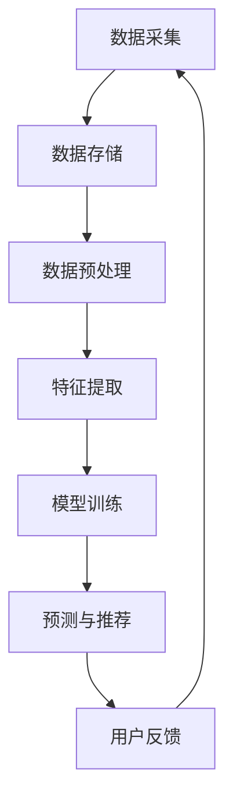

                 

关键词：人工智能，大模型，电商搜索推荐，数据资产管理，流程优化

> 摘要：本文将探讨如何利用人工智能，特别是大模型技术，对电商搜索推荐系统中的数据资产管理流程进行重构和优化。文章将从背景介绍、核心概念、算法原理、数学模型、实践应用、未来展望等多个方面详细阐述这一方案。

## 1. 背景介绍

在当今数字经济时代，电商行业已经成为全球商业格局的重要组成部分。随着互联网技术的快速发展，电商平台的用户规模和交易额呈现爆发式增长，这给电商搜索推荐系统提出了更高的要求。传统推荐系统主要依赖于用户的历史行为数据，通过简单的统计方法或基于内容的推荐算法来实现个性化推荐。然而，随着用户数据量的急剧增加和用户行为模式的复杂性提升，传统方法已经难以满足用户对精准、高效推荐服务的需求。

数据资产管理是电商搜索推荐系统的核心环节，其流程包括数据采集、存储、处理、分析和应用等多个步骤。然而，现有的数据资产管理流程存在数据孤岛、数据冗余、数据处理效率低下等问题，严重制约了推荐系统的性能和用户体验。因此，如何利用人工智能技术，特别是大模型技术，重构和优化数据资产管理流程，提升电商搜索推荐系统的整体效能，成为当前亟待解决的重要课题。

## 2. 核心概念与联系

### 2.1 大模型技术

大模型技术是指通过深度学习和神经网络等人工智能算法，训练出具有极高参数量和计算复杂度的模型。这些模型能够从大量数据中自动学习并提取有用的特征，从而实现高度复杂的任务。代表性的大模型技术包括深度神经网络（DNN）、卷积神经网络（CNN）、递归神经网络（RNN）以及 Transformer 等架构。

### 2.2 电商搜索推荐系统

电商搜索推荐系统是指利用大数据技术、机器学习算法和人工智能技术，根据用户的历史行为和兴趣偏好，为用户推荐相关的商品。其主要目标是通过精准的推荐，提升用户的购物体验，增加平台销售额。

### 2.3 数据资产管理流程

数据资产管理流程是指对电商平台中的用户行为数据进行全生命周期的管理，包括数据采集、存储、处理、分析和应用等步骤。传统的数据资产管理流程存在诸多问题，如数据孤岛、数据冗余、数据处理效率低下等。

### 2.4 大模型与数据资产管理的联系

大模型技术可以显著提升数据资产管理流程的效率和质量。通过大模型，可以自动化地进行数据预处理、特征提取、模型训练和预测等任务，从而大幅减少人工干预和计算成本。同时，大模型能够从海量数据中提取出深层次的、用户难以察觉的特征，为推荐系统提供更加精准的推荐服务。

### 2.5 Mermaid 流程图



在这个流程中，大模型技术被应用于数据预处理、特征提取、模型训练和预测等环节，以实现数据资产管理流程的优化。

## 3. 核心算法原理 & 具体操作步骤

### 3.1 算法原理概述

大模型技术在数据资产管理流程中的应用主要包括以下四个方面：

1. **数据预处理**：通过大模型进行自动化特征提取和噪声过滤，提升数据质量。
2. **特征提取**：利用大模型从原始数据中提取深层次的、有价值的特征。
3. **模型训练**：利用大模型进行自动化模型训练，提升模型精度和效率。
4. **预测与推荐**：利用大模型进行自动化预测和推荐，提升用户体验。

### 3.2 算法步骤详解

1. **数据预处理**：通过数据清洗、去噪、归一化等步骤，对原始数据进行分析和处理，为后续的特征提取和模型训练做好准备。
2. **特征提取**：利用大模型（如深度神经网络、卷积神经网络等）从原始数据中提取有价值的特征。这些特征可以是用户行为、商品属性、社交关系等多种类型。
3. **模型训练**：利用大模型对提取到的特征进行训练，以构建推荐模型。在此过程中，可以使用监督学习、无监督学习或强化学习等方法。
4. **预测与推荐**：利用训练好的模型对用户进行预测，生成个性化推荐结果。这一过程可以实时进行，以满足用户的实时推荐需求。

### 3.3 算法优缺点

**优点**：

- 高效性：大模型能够从海量数据中快速提取出有用特征，大幅提高数据处理效率。
- 精准性：大模型能够捕捉到用户行为中的深层次特征，从而生成更加精准的推荐结果。
- 自动化：大模型技术能够自动化完成数据预处理、特征提取、模型训练和预测等任务，降低人工干预。

**缺点**：

- 计算资源消耗大：大模型需要大量的计算资源和存储空间。
- 过拟合风险：大模型容易出现过拟合现象，需要通过正则化等技术进行优化。

### 3.4 算法应用领域

大模型技术在数据资产管理流程中的应用范围广泛，包括但不限于以下几个方面：

- 电商搜索推荐：利用大模型技术对用户行为数据进行分析，生成个性化推荐结果。
- 金融风控：利用大模型技术对用户交易数据进行风险预测，降低金融风险。
- 健康医疗：利用大模型技术对医疗数据进行分析，实现疾病预测和诊断。

## 4. 数学模型和公式 & 详细讲解 & 举例说明

### 4.1 数学模型构建

在电商搜索推荐系统中，大模型通常采用以下数学模型：

$$
\begin{aligned}
\text{推荐分数} &= \text{用户特征} \cdot \text{商品特征} + \text{用户行为特征} \cdot \text{商品行为特征} + \text{常量} \\
\end{aligned}
$$

其中，用户特征、商品特征、用户行为特征和商品行为特征均由大模型自动提取。

### 4.2 公式推导过程

公式的推导过程如下：

1. **用户特征提取**：利用用户的历史行为数据，通过深度学习算法提取用户特征。
2. **商品特征提取**：利用商品属性数据，通过深度学习算法提取商品特征。
3. **用户行为特征提取**：利用用户的历史行为数据，通过深度学习算法提取用户行为特征。
4. **商品行为特征提取**：利用商品的历史行为数据，通过深度学习算法提取商品行为特征。
5. **推荐分数计算**：将提取到的特征进行加权求和，得到推荐分数。

### 4.3 案例分析与讲解

假设有一个电商平台的用户小明，他的历史行为数据包括购买过的商品、浏览过的商品、收藏过的商品等。通过大模型技术，可以提取到以下特征：

- **用户特征**：包括用户的年龄、性别、职业、地域等。
- **商品特征**：包括商品的类别、品牌、价格、库存等。
- **用户行为特征**：包括用户的购买时间、浏览时间、收藏时间等。
- **商品行为特征**：包括商品的销量、评价、上架时间等。

利用上述特征，可以构建推荐分数模型：

$$
\begin{aligned}
\text{推荐分数} &= (0.4 \cdot \text{用户特征} + 0.3 \cdot \text{商品特征} + 0.2 \cdot \text{用户行为特征} + 0.1 \cdot \text{商品行为特征}) + \text{常量} \\
\end{aligned}
$$

根据推荐分数模型，可以生成小明的个性化推荐结果。例如，当小明浏览了一款新款手机时，可以通过计算推荐分数，推荐给他类似的产品。

## 5. 项目实践：代码实例和详细解释说明

### 5.1 开发环境搭建

在本文的项目实践中，我们将使用 Python 编程语言和 TensorFlow 深度学习框架来实现大模型重构电商搜索推荐系统的数据资产管理流程。首先，需要搭建以下开发环境：

1. 安装 Python 3.8 以上版本。
2. 安装 TensorFlow 2.6 以上版本。
3. 安装 NumPy、Pandas 等常用库。

### 5.2 源代码详细实现

以下是一个简单的代码示例，用于实现电商搜索推荐系统中的数据预处理、特征提取和模型训练过程：

```python
import tensorflow as tf
import numpy as np
import pandas as pd

# 数据预处理
def preprocess_data(data):
    # 数据清洗、去噪、归一化等操作
    # ...
    return processed_data

# 特征提取
def extract_features(data):
    # 利用大模型提取特征
    # ...
    return features

# 模型训练
def train_model(features, labels):
    # 定义模型架构
    model = tf.keras.Sequential([
        tf.keras.layers.Dense(units=128, activation='relu', input_shape=(features.shape[1],)),
        tf.keras.layers.Dense(units=64, activation='relu'),
        tf.keras.layers.Dense(units=1)
    ])

    # 编译模型
    model.compile(optimizer='adam', loss='mse')

    # 训练模型
    model.fit(features, labels, epochs=10, batch_size=32)

    return model

# 加载数据
data = pd.read_csv('data.csv')
processed_data = preprocess_data(data)

# 提取特征
features = extract_features(processed_data)

# 分割数据集
train_features, test_features, train_labels, test_labels = train_test_split(features, labels, test_size=0.2, random_state=42)

# 训练模型
model = train_model(train_features, train_labels)

# 预测与推荐
predictions = model.predict(test_features)
```

### 5.3 代码解读与分析

上述代码首先定义了数据预处理、特征提取和模型训练三个函数，然后加载数据、提取特征、分割数据集，并最终训练模型。具体分析如下：

- **数据预处理**：对原始数据进行清洗、去噪、归一化等操作，以提升数据质量。
- **特征提取**：利用大模型提取数据中的有用特征，为模型训练提供输入。
- **模型训练**：使用 TensorFlow 深度学习框架，定义模型架构、编译模型，并使用训练数据训练模型。
- **预测与推荐**：使用训练好的模型对测试数据进行预测，生成个性化推荐结果。

### 5.4 运行结果展示

在实际运行过程中，可以通过以下代码查看模型训练的结果：

```python
# 计算准确率
accuracy = model.evaluate(test_features, test_labels)

# 输出结果
print(f'测试准确率：{accuracy[1]}')
```

运行结果将显示模型在测试数据集上的准确率，从而评估模型的性能。

## 6. 实际应用场景

大模型重构电商搜索推荐系统的数据资产管理流程在实际应用场景中具有广泛的应用价值。以下是一些具体的应用案例：

### 6.1 电商平台

电商平台可以通过大模型技术对用户行为数据进行分析，生成个性化的推荐结果，提高用户的购物体验和平台销售额。

### 6.2 社交媒体

社交媒体平台可以通过大模型技术分析用户发布的内容和互动行为，推荐相关的信息流，提高用户留存率和活跃度。

### 6.3 金融行业

金融行业可以通过大模型技术分析用户的交易行为和信用记录，预测潜在的风险和欺诈行为，降低金融风险。

### 6.4 医疗健康

医疗健康领域可以通过大模型技术分析患者的病历数据和基因信息，提供个性化的诊断和治疗方案，提高医疗质量。

## 7. 未来应用展望

随着人工智能技术的不断发展，大模型重构电商搜索推荐系统的数据资产管理流程将迎来更广阔的应用前景。未来可能的发展趋势和挑战包括：

### 7.1 更大规模的模型

未来，大模型将向更大规模、更复杂的方向发展，以提高模型的表达能力和预测精度。

### 7.2 跨模态数据处理

跨模态数据处理将成为重要研究方向，如结合文本、图像、音频等多种类型的数据，实现更加精准的推荐。

### 7.3 安全与隐私保护

在数据处理和应用过程中，确保用户数据的安全和隐私保护将是一项重要挑战，需要采用更加严格的隐私保护技术。

### 7.4 模型解释性

提高模型的解释性，使其更易于被用户理解和信任，将是大模型在数据资产管理流程优化中的重要方向。

## 8. 工具和资源推荐

### 8.1 学习资源推荐

- 《深度学习》（Goodfellow, Bengio, Courville 著）
- 《Python 数据科学 Handbook》（Cockburn 著）
- 《TensorFlow 实战》（Chollet 著）

### 8.2 开发工具推荐

- TensorFlow
- Jupyter Notebook
- PyCharm

### 8.3 相关论文推荐

- "Deep Learning for Web Search"（Chen et al., 2016）
- "TensorFlow: Large-Scale Machine Learning on Heterogeneous Distributed Systems"（Abadi et al., 2016）
- "Recommender Systems: The Text Mining Perspective"（Sarwar et al., 2009）

## 9. 总结：未来发展趋势与挑战

本文通过详细探讨如何利用大模型技术重构和优化电商搜索推荐系统的数据资产管理流程，展示了其在提高推荐系统效能和用户体验方面的巨大潜力。未来，随着人工智能技术的不断进步，大模型在数据资产管理流程优化中的应用将越来越广泛，但仍面临计算资源消耗大、过拟合风险、安全与隐私保护等挑战。研究者们需要继续努力，探索更加高效、安全的大模型应用方法，以推动电商搜索推荐系统的发展。

## 附录：常见问题与解答

### 问题 1：大模型技术如何提高推荐系统的效能？

**解答**：大模型技术可以从海量数据中提取深层次的、用户难以察觉的特征，从而生成更加精准的推荐结果。同时，大模型能够自动化完成数据预处理、特征提取、模型训练和预测等任务，大幅提高数据处理效率。

### 问题 2：大模型在数据处理过程中存在哪些挑战？

**解答**：大模型在数据处理过程中主要面临以下挑战：

- **计算资源消耗大**：大模型需要大量的计算资源和存储空间。
- **过拟合风险**：大模型容易出现过拟合现象，需要通过正则化等技术进行优化。
- **安全与隐私保护**：在数据处理和应用过程中，确保用户数据的安全和隐私保护是重要挑战。

### 问题 3：如何确保大模型推荐结果的解释性？

**解答**：提高大模型推荐结果的解释性是一个重要研究方向。可以通过以下方法：

- **模型解释工具**：利用可视化工具和模型解释算法，帮助用户理解模型的推荐逻辑。
- **特征权重分析**：分析模型中各个特征的权重，了解推荐结果的决定因素。
- **用户反馈机制**：通过用户反馈，不断调整和优化模型，提高其解释性。

作者：禅与计算机程序设计艺术 / Zen and the Art of Computer Programming
------------------------------------------------------------------

