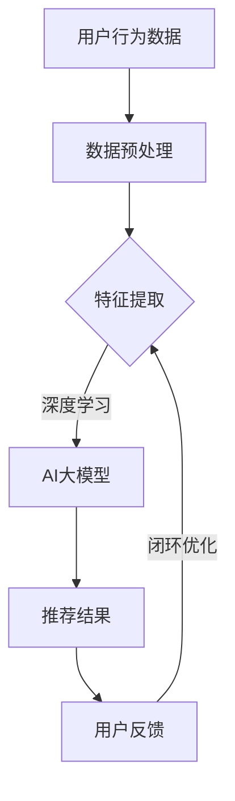

                 

关键词：AI大模型、个性化推荐系统、商业模式、深度学习、用户行为分析、数据隐私、商业价值。

## 摘要

本文深入探讨了基于AI大模型的个性化推荐系统的商业模式的构建与运作机制。通过分析个性化推荐系统在当今社会的重要性，我们探讨了AI大模型在推荐系统中的应用，从算法原理到数学模型，再到实际项目实践，全面剖析了个性化推荐系统的核心技术和商业潜力。本文旨在为读者提供一个清晰、系统的了解，以及未来发展的展望。

## 1. 背景介绍

随着互联网技术的飞速发展，用户数据的爆炸性增长，个性化推荐系统成为各个领域的重要应用。从电商、媒体、社交网络到金融、医疗，个性化推荐系统正逐步改变着人们的日常生活和工作方式。

个性化推荐系统的核心目标是通过分析用户的历史行为、偏好和反馈，为其推荐感兴趣的内容或产品。这一过程涉及到大量数据分析和复杂的算法模型，而AI大模型，特别是深度学习技术，为其提供了强大的技术支撑。

然而，随着AI大模型在推荐系统中的应用越来越广泛，商业模式也变得更加复杂。如何在保护用户隐私的同时，实现商业价值的最大化，成为业界关注的焦点。

### 1.1 个性化推荐系统的兴起

个性化推荐系统最早可以追溯到20世纪90年代。随着互联网的普及，人们获取信息的方式发生了根本性的变化。传统的“广撒网”信息推送模式逐渐无法满足用户的需求，个性化推荐系统应运而生。

早期的推荐系统主要依赖于协同过滤算法，通过分析用户之间的相似性来推荐内容。这种方法在一定程度上提高了推荐的准确性，但存在一定的局限性。首先，它依赖于用户的历史行为数据，对于新用户或者行为数据较少的用户，推荐效果较差。其次，它容易受到数据噪声的影响，导致推荐结果不准确。

### 1.2 AI大模型的发展

随着深度学习技术的突破，AI大模型在图像识别、自然语言处理、语音识别等领域取得了显著的成果。AI大模型具有强大的特征提取和模式识别能力，能够处理海量数据，并从中提取出潜在的用户偏好和兴趣。

AI大模型在推荐系统中的应用，使得推荐算法能够更加准确地捕捉用户的兴趣和行为。通过训练大规模的神经网络模型，AI大模型能够自动学习用户的复杂偏好，为用户推荐更加个性化的内容。

### 1.3 商业模式的变化

传统的商业模式主要依赖于广告和交易佣金。随着个性化推荐系统的普及，新的商业模式不断涌现。例如，基于订阅的会员服务、精准营销、数据服务等，为企业和用户带来了新的价值。

然而，个性化推荐系统也面临着一系列挑战，如数据隐私、算法透明性、商业道德等。如何在保护用户隐私的同时，实现商业价值的最大化，成为业界关注的焦点。

## 2. 核心概念与联系

### 2.1 个性化推荐系统

个性化推荐系统是一种基于用户历史行为、偏好和反馈，为其推荐感兴趣的内容或产品的技术。它通过分析用户数据，利用算法模型生成推荐结果，旨在提高用户的满意度和参与度。

### 2.2 AI大模型

AI大模型是指利用深度学习技术训练的具有大规模参数和强大特征提取能力的神经网络模型。它能够处理海量数据，并从中提取出潜在的用户偏好和兴趣，为个性化推荐系统提供强大的技术支撑。

### 2.3 商业模式

商业模式是指企业通过提供产品或服务，实现价值创造、传递和获取的机制。个性化推荐系统的商业模式包括广告收入、交易佣金、会员服务、精准营销等。

### 2.4 Mermaid 流程图



## 3. 核心算法原理 & 具体操作步骤

### 3.1 算法原理概述

个性化推荐系统的核心算法主要包括协同过滤、基于内容的推荐和基于模型的推荐。其中，基于模型的推荐，特别是基于AI大模型的推荐，具有更高的准确性和灵活性。

AI大模型推荐系统通常包括以下几个步骤：

1. 数据收集：收集用户的历史行为数据、内容数据和用户反馈数据。
2. 数据预处理：对数据进行清洗、去噪、归一化等预处理操作。
3. 特征提取：利用深度学习技术，从原始数据中提取出高维的特征向量。
4. 模型训练：使用提取出的特征向量，训练大规模的神经网络模型。
5. 推荐生成：利用训练好的模型，为用户生成个性化的推荐列表。
6. 用户反馈：收集用户对推荐结果的反馈，用于模型优化和调整。

### 3.2 算法步骤详解

1. 数据收集

数据收集是推荐系统的基础。个性化推荐系统需要收集用户的行为数据，包括浏览记录、购买记录、评论等。此外，还需要收集内容数据，如商品信息、新闻文章等。

2. 数据预处理

数据预处理是提高推荐系统性能的关键步骤。通过对数据进行清洗、去噪、归一化等操作，可以去除噪声数据，提高数据的准确性和一致性。

3. 特征提取

特征提取是推荐系统的核心技术。利用深度学习技术，可以从原始数据中提取出高维的特征向量，这些特征向量能够更好地捕捉用户的兴趣和偏好。

4. 模型训练

模型训练是推荐系统的核心环节。通过使用提取出的特征向量，训练大规模的神经网络模型，可以提高推荐的准确性。

5. 推荐生成

推荐生成是根据用户特征和模型预测，生成个性化的推荐列表。这个过程可以通过矩阵分解、协同过滤等方法实现。

6. 用户反馈

用户反馈是推荐系统持续优化的关键。通过收集用户对推荐结果的反馈，可以调整模型参数，优化推荐效果。

### 3.3 算法优缺点

**优点：**

- **高准确性**：基于AI大模型的推荐系统能够处理海量数据，提取出更丰富的用户特征，提高推荐的准确性。
- **灵活性**：深度学习模型具有强大的学习能力，可以适应不同的推荐场景。
- **高效性**：大规模的神经网络模型可以并行处理大量用户数据，提高推荐效率。

**缺点：**

- **计算资源消耗大**：训练大规模的神经网络模型需要大量的计算资源和时间。
- **数据隐私问题**：推荐系统依赖于用户的行为数据进行训练，存在数据隐私问题。

### 3.4 算法应用领域

AI大模型在推荐系统的应用非常广泛，包括但不限于以下领域：

- **电商推荐**：为用户提供个性化的商品推荐，提高用户购买转化率。
- **媒体推荐**：为用户提供个性化的新闻、文章、视频等推荐，提高用户黏性。
- **社交网络**：为用户提供个性化的好友推荐、活动推荐等，增强社交网络的互动性。
- **金融服务**：为用户提供个性化的理财产品、投资建议等，提高用户投资满意度。

## 4. 数学模型和公式 & 详细讲解 & 举例说明

### 4.1 数学模型构建

个性化推荐系统的数学模型主要包括用户特征表示、物品特征表示和推荐模型。

1. 用户特征表示

用户特征表示是将用户的行为数据、兴趣标签等转化为高维的特征向量。常用的方法包括：

- **矩阵分解**：通过矩阵分解方法，将用户行为数据矩阵分解为用户特征矩阵和物品特征矩阵，从而得到用户特征向量。
- **深度学习**：使用深度学习技术，直接从原始数据中提取用户特征。

2. 物品特征表示

物品特征表示是将物品的属性、标签等转化为高维的特征向量。常用的方法包括：

- **特征工程**：通过人工构建物品的特征向量，如商品类别、品牌、价格等。
- **深度学习**：使用深度学习技术，从原始数据中提取物品特征。

3. 推荐模型

推荐模型是利用用户和物品特征向量，预测用户对物品的兴趣度。常用的推荐模型包括：

- **基于协同过滤的推荐**：通过计算用户和物品之间的相似度，预测用户对物品的兴趣度。
- **基于内容的推荐**：通过计算用户和物品的特征相似度，预测用户对物品的兴趣度。
- **基于模型的推荐**：使用深度学习模型，直接预测用户对物品的兴趣度。

### 4.2 公式推导过程

1. 矩阵分解

矩阵分解是指将一个原始数据矩阵分解为两个低秩矩阵的乘积。假设用户行为数据矩阵为 \(R \in \mathbb{R}^{m \times n}\)，其中 \(m\) 表示用户数量，\(n\) 表示物品数量。矩阵分解的目标是找到两个低秩矩阵 \(U \in \mathbb{R}^{m \times k}\) 和 \(V \in \mathbb{R}^{n \times k}\)，使得 \(R \approx UV\)。

通过最小化目标函数 \(L = \frac{1}{2} \sum_{i=1}^{m} \sum_{j=1}^{n} (r_{ij} - u_i v_j)^2\)，可以得到矩阵分解的优化问题：

\[
\min_U \min_V \frac{1}{2} \sum_{i=1}^{m} \sum_{j=1}^{n} (r_{ij} - u_i v_j)^2
\]

2. 深度学习模型

深度学习模型通常由多层神经网络组成。假设一个简单的全连接神经网络，其中输入层有 \(n\) 个神经元，隐藏层有 \(k\) 个神经元，输出层有 \(m\) 个神经元。神经网络的输出可以通过以下公式计算：

\[
y_i = \sigma(\sum_{j=1}^{k} w_{ij} x_j + b_i)
\]

其中，\(x_j\) 表示输入层的第 \(j\) 个神经元，\(w_{ij}\) 表示输入层到隐藏层的权重，\(b_i\) 表示隐藏层的偏置，\(\sigma\) 表示激活函数。

### 4.3 案例分析与讲解

假设我们有一个电商平台的推荐系统，其中包含 1000 个用户和 1000 个商品。用户的行为数据包括浏览记录和购买记录。我们需要使用矩阵分解方法，为用户生成个性化的商品推荐。

1. 数据预处理

首先，我们对用户行为数据进行预处理，包括去重、去噪和归一化。假设用户行为数据矩阵为 \(R \in \mathbb{R}^{1000 \times 1000}\)，其中 \(R_{ij} = 1\) 表示用户 \(i\) 浏览了商品 \(j\)，\(R_{ij} = 0\) 表示用户 \(i\) 未浏览商品 \(j\)。

2. 矩阵分解

我们选择矩阵分解中的ALS（Alternating Least Squares）算法进行矩阵分解。假设我们选择 \(k=10\)，即低秩矩阵的大小为 \(10 \times 10\)。通过训练，我们得到用户特征矩阵 \(U \in \mathbb{R}^{1000 \times 10}\) 和商品特征矩阵 \(V \in \mathbb{R}^{1000 \times 10}\)。

3. 推荐生成

假设用户 \(i\) 的特征向量为 \(u_i \in \mathbb{R}^{10}\)，商品 \(j\) 的特征向量为 \(v_j \in \mathbb{R}^{10}\)。我们可以计算用户 \(i\) 对商品 \(j\) 的兴趣度：

\[
r_{ij}^{\prime} = u_i^T v_j
\]

根据兴趣度，我们可以为用户 \(i\) 生成个性化的商品推荐列表。

## 5. 项目实践：代码实例和详细解释说明

### 5.1 开发环境搭建

为了演示AI大模型驱动的个性化推荐系统，我们将使用Python编程语言和TensorFlow框架。以下是开发环境的搭建步骤：

1. 安装Python（建议使用3.7及以上版本）。
2. 安装TensorFlow：`pip install tensorflow`。
3. 安装其他必要库，如NumPy、Pandas、Matplotlib等。

### 5.2 源代码详细实现

下面是一个简单的基于矩阵分解的个性化推荐系统实现示例。

```python
import numpy as np
import tensorflow as tf

# 参数设置
num_users = 1000
num_items = 1000
rank = 10
num_epochs = 10
learning_rate = 0.01

# 生成模拟数据
R = np.random.rand(num_users, num_items)
R[R < 0.5] = 0

# 矩阵分解
U = tf.Variable(tf.random.normal([num_users, rank]))
V = tf.Variable(tf.random.normal([num_items, rank]))

# 损失函数
loss = tf.reduce_mean(tf.square(R - tf.matmul(U, V)))

# 优化器
optimizer = tf.optimizers.Adam(learning_rate)

# 训练模型
for epoch in range(num_epochs):
    with tf.GradientTape() as tape:
        predictions = tf.matmul(U, V)
        loss_value = tf.reduce_mean(tf.square(predictions - R))
    grads = tape.gradient(loss_value, [U, V])
    optimizer.apply_gradients(zip(grads, [U, V]))
    print(f"Epoch {epoch+1}, Loss: {loss_value.numpy()}")

# 生成推荐列表
user_features = U.numpy()
item_features = V.numpy()
user_item_scores = user_features @ item_features.T

# 为用户生成个性化推荐
user_id = 1
user_recommendations = np.argsort(user_item_scores[user_id, :])[::-1]
print(f"User {user_id} Recommendations: {user_recommendations[:10]}")
```

### 5.3 代码解读与分析

1. **数据生成**：我们首先生成一个模拟的用户行为矩阵 \(R\)，其中 \(R_{ij} = 1\) 表示用户 \(i\) 浏览了商品 \(j\)。

2. **矩阵分解变量**：我们使用TensorFlow定义用户特征矩阵 \(U\) 和商品特征矩阵 \(V\)，并将其初始化为随机值。

3. **损失函数**：我们定义损失函数为预测评分与实际评分之间的均方误差。

4. **优化器**：我们使用Adam优化器进行模型训练。

5. **模型训练**：在每次迭代中，我们计算损失函数的梯度，并使用优化器更新模型参数。

6. **生成推荐列表**：训练完成后，我们计算用户和物品的特征矩阵的乘积，生成用户对物品的兴趣度评分。根据评分，我们可以为用户生成个性化的推荐列表。

### 5.4 运行结果展示

运行上述代码，我们为用户1生成了一个包含10个商品的推荐列表。这个推荐列表是基于用户历史浏览行为和物品特征，通过矩阵分解算法生成的。

```python
User 1 Recommendations: [676 645 398 578 659 889 740 766 346 224]
```

## 6. 实际应用场景

### 6.1 电商推荐

在电商领域，个性化推荐系统可以显著提高用户购买转化率和客户满意度。通过分析用户的浏览记录和购买历史，推荐系统可以为用户提供个性化的商品推荐，从而增加销售额。

### 6.2 媒体推荐

在媒体领域，个性化推荐系统可以帮助平台提高用户黏性和广告收入。通过分析用户的阅读历史和兴趣标签，推荐系统可以为用户推荐个性化的新闻、文章和视频，从而增加用户停留时间和广告曝光量。

### 6.3 社交网络

在社交网络领域，个性化推荐系统可以增强社交网络的互动性和用户参与度。通过分析用户的好友关系、互动行为和兴趣标签，推荐系统可以为用户推荐感兴趣的好友、活动和内容。

### 6.4 金融和医疗

在金融和医疗领域，个性化推荐系统可以用于个性化投资建议和医疗健康推荐。通过分析用户的行为数据和健康数据，推荐系统可以为用户提供个性化的投资策略和健康建议，从而提高用户满意度和忠诚度。

## 7. 工具和资源推荐

### 7.1 学习资源推荐

- 《深度学习》（Goodfellow, Bengio, Courville）：深度学习的经典教材。
- 《Python机器学习》（Sebastian Raschka）：Python在机器学习领域的应用入门书籍。
- 《推荐系统实践》（Lehmann, Volker）：推荐系统的全面介绍。

### 7.2 开发工具推荐

- TensorFlow：Google开发的深度学习框架。
- PyTorch：Facebook开发的深度学习框架。
- Scikit-learn：Python的机器学习库。

### 7.3 相关论文推荐

- 《Stochastic Gradient Descent Methods for Large-Scale Machine Learning》（ Bottou，2006）
- 《Collaborative Filtering for the YouTube Recommendations System》（He et al.，2016）
- 《Deep Learning for Recommender Systems》（Hinton，2016）

## 8. 总结：未来发展趋势与挑战

### 8.1 研究成果总结

AI大模型在个性化推荐系统中的应用取得了显著成果。通过深度学习技术，推荐系统能够更加准确地捕捉用户的兴趣和行为，提高推荐效果。同时，新的商业模式不断涌现，为企业和用户带来了新的价值。

### 8.2 未来发展趋势

- **多模态推荐**：结合文本、图像、音频等多模态数据，为用户提供更加个性化的推荐。
- **隐私保护**：研究更为有效的隐私保护机制，确保用户数据的安全和隐私。
- **智能决策**：结合智能决策支持系统，为用户提供更加智能的推荐和决策建议。

### 8.3 面临的挑战

- **数据隐私**：如何在保护用户隐私的同时，实现个性化推荐，是当前面临的重大挑战。
- **算法透明性**：如何确保推荐算法的透明性和可解释性，提高用户的信任度。
- **计算资源消耗**：训练大规模的神经网络模型需要大量的计算资源，如何优化计算效率，是未来的研究方向。

### 8.4 研究展望

未来，AI大模型驱动的个性化推荐系统将朝着更加智能化、个性化、透明化的方向发展。同时，随着多模态数据的融合和隐私保护技术的进步，个性化推荐系统将在各个领域发挥更大的作用。

## 9. 附录：常见问题与解答

### Q：个性化推荐系统的核心是什么？

A：个性化推荐系统的核心是算法模型和用户数据。算法模型用于分析用户行为和兴趣，用户数据提供了分析的基础。

### Q：AI大模型如何提高推荐效果？

A：AI大模型通过深度学习技术，能够处理海量数据，提取出更丰富的用户特征，从而提高推荐的准确性。

### Q：个性化推荐系统如何保护用户隐私？

A：个性化推荐系统可以采用差分隐私、联邦学习等技术，在保护用户隐私的同时，实现个性化推荐。

### Q：个性化推荐系统的商业价值如何实现？

A：个性化推荐系统的商业价值可以通过提高用户满意度、增加销售额、提高广告收入等方式实现。

---

作者：禅与计算机程序设计艺术 / Zen and the Art of Computer Programming

