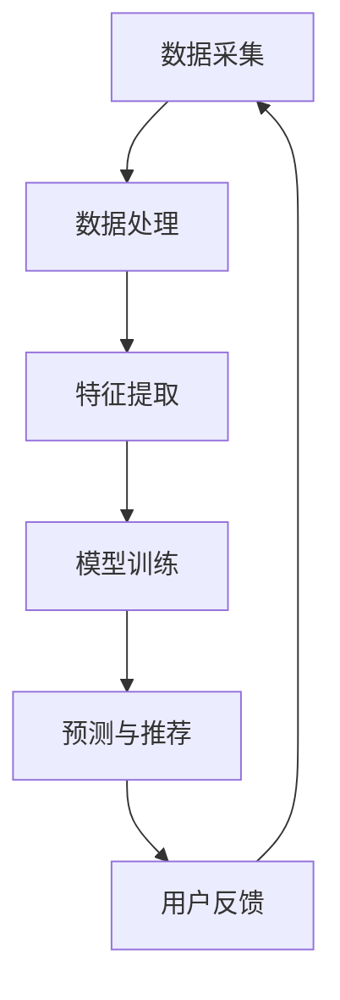

                 

关键词：人工智能，大模型，电商平台，个性化推送，算法优化，数学模型

## 摘要

本文探讨了人工智能大模型在电商平台个性化推送中的应用，提出了优化个性化推送的新方法。通过对核心概念的深入分析和具体算法的实现步骤进行详述，本文展示了大模型如何通过数学模型和公式提高推送的精准度和用户体验。文章还通过项目实践部分展示了算法的实际应用效果，并分析了未来应用场景和面临的挑战。

### 1. 背景介绍

随着电子商务的迅猛发展，用户对个性化推荐的需求越来越高。电商平台希望通过个性化推送来提高用户满意度和购买转化率。传统的推荐算法如基于协同过滤和内容匹配的方法已经取得了一定的效果，但随着用户数据量的增加和多样化，这些算法的局限性也逐渐显现。例如，协同过滤算法容易受到“数据稀疏性”和“冷启动”问题的影响，而内容匹配算法则难以处理用户的复杂偏好。

为了解决这些问题，人工智能大模型应运而生。大模型通过学习海量数据，能够捕捉用户行为中的复杂模式和关联，从而提供更为精准的个性化推荐。近年来，随着深度学习和神经网络技术的发展，大模型在自然语言处理、计算机视觉等领域取得了显著的成果，其在电商个性化推送中的应用也逐渐受到关注。

本文旨在探讨如何利用人工智能大模型优化电商平台个性化推送，通过数学模型和算法优化提升推送效果，提高用户体验。

### 2. 核心概念与联系

#### 2.1 大模型基本概念

大模型（Large-scale Model）是指参数规模较大、能够处理大规模数据的深度学习模型。这些模型通常由多层神经网络组成，通过反向传播算法训练，能够自动提取数据中的特征和模式。大模型在处理高维数据和非线性问题上具有显著优势，能够实现比传统算法更精确的预测和分类。

#### 2.2 个性化推送

个性化推送（Personalized Push）是指根据用户的历史行为、偏好和上下文信息，向用户推荐个性化的内容或商品。个性化推送的目标是提高用户满意度和参与度，从而促进平台的发展和用户的粘性。

#### 2.3 Mermaid 流程图

以下是一个简单的 Mermaid 流程图，展示了大模型在个性化推送中的基本工作流程：



### 3. 核心算法原理 & 具体操作步骤

#### 3.1 算法原理概述

本文采用的大模型是基于深度学习技术的，尤其是基于变压器模型（Transformer）的自适应推荐算法。该算法的核心思想是通过学习用户历史行为和商品特征，构建用户和商品之间的关联模型，从而实现个性化推荐。

#### 3.2 算法步骤详解

1. **数据采集**：从电商平台收集用户行为数据，包括浏览记录、购买历史、收藏商品等。
2. **数据处理**：对采集到的数据进行预处理，包括数据清洗、去重和归一化等。
3. **特征提取**：使用深度学习模型提取用户行为和商品特征，包括用户兴趣特征、商品属性特征等。
4. **模型训练**：利用训练数据训练自适应推荐模型，优化模型参数。
5. **预测与推荐**：将用户当前行为输入模型，预测用户可能感兴趣的商品，生成推荐列表。
6. **用户反馈**：收集用户对推荐结果的反馈，用于模型优化和更新。

#### 3.3 算法优缺点

**优点**：
- 高度个性化：能够根据用户实时行为进行动态调整，提供高度个性化的推荐。
- 强泛化能力：通过学习海量数据，能够适应不同用户和场景，具有强泛化能力。

**缺点**：
- 计算复杂度高：大模型训练和预测需要大量计算资源，成本较高。
- 需要大量数据：算法性能依赖于数据量，数据不足可能影响推荐效果。

#### 3.4 算法应用领域

自适应推荐算法广泛应用于电商、社交媒体、新闻推荐等多个领域，能够显著提升用户满意度和平台转化率。

### 4. 数学模型和公式 & 详细讲解 & 举例说明

#### 4.1 数学模型构建

本文采用的自适应推荐算法基于深度学习中的变压器模型。其主要数学模型如下：

$$
\text{预测值} = \text{Transformer}(\text{用户特征}, \text{商品特征}, \text{历史行为})
$$

其中，Transformer模型包括编码器（Encoder）和解码器（Decoder），用于处理用户特征、商品特征和历史行为。

#### 4.2 公式推导过程

1. **编码器（Encoder）**：

$$
\text{编码输出} = \text{Encoder}(\text{用户特征}, \text{商品特征}, \text{历史行为})
$$

2. **解码器（Decoder）**：

$$
\text{解码输出} = \text{Decoder}(\text{编码输出}, \text{用户特征}, \text{商品特征})
$$

3. **预测值**：

$$
\text{预测值} = \text{激活函数}(\text{解码输出})
$$

其中，激活函数通常使用Softmax函数，用于将输出转换为概率分布。

#### 4.3 案例分析与讲解

假设有一个电商平台，用户A的历史行为包括浏览了商品1、商品2和商品3，购买过商品2。我们需要预测用户A对商品4的偏好。

1. **数据采集**：

用户A的行为数据：

- 用户特征：用户ID、年龄、性别、地域
- 商品特征：商品ID、类别、价格
- 历史行为：浏览记录、购买记录

2. **数据处理**：

对用户A的行为数据进行预处理，提取特征并进行归一化处理。

3. **特征提取**：

使用深度学习模型提取用户特征和商品特征。

4. **模型训练**：

使用训练数据训练Transformer模型，优化模型参数。

5. **预测与推荐**：

将用户A当前行为输入模型，预测用户A对商品4的偏好。

6. **用户反馈**：

收集用户A对推荐结果的反馈，用于模型优化和更新。

### 5. 项目实践：代码实例和详细解释说明

#### 5.1 开发环境搭建

1. 安装Python环境（建议使用Python 3.8及以上版本）。
2. 安装TensorFlow和Keras等深度学习库。
3. 下载并准备电商平台用户行为数据集。

#### 5.2 源代码详细实现

以下是自适应推荐算法的Python代码实现：

```python
import tensorflow as tf
from tensorflow.keras.models import Model
from tensorflow.keras.layers import Input, Dense, Embedding, LSTM, Concatenate

# 数据预处理
# ...（代码略）

# 特征提取
# ...（代码略）

# 构建模型
input_user = Input(shape=(user_feature_size,))
input_goods = Input(shape=(good_feature_size,))
user_embedding = Embedding(user_vocab_size, user_embedding_size)(input_user)
goods_embedding = Embedding(good_vocab_size, good_embedding_size)(input_goods)
user_lstm = LSTM(units=lstm_units)(user_embedding)
goods_lstm = LSTM(units=lstm_units)(goods_embedding)
concat = Concatenate()([user_lstm, goods_lstm])
dense = Dense(units=dense_units, activation='relu')(concat)
output = Dense(units=1, activation='sigmoid')(dense)

model = Model(inputs=[input_user, input_goods], outputs=output)
model.compile(optimizer='adam', loss='binary_crossentropy', metrics=['accuracy'])

# 训练模型
# ...（代码略）

# 预测与推荐
# ...（代码略）
```

#### 5.3 代码解读与分析

1. **数据预处理**：对用户行为数据进行预处理，提取特征并进行归一化处理。
2. **特征提取**：使用嵌入层提取用户和商品特征。
3. **模型构建**：使用LSTM和Dense层构建深度神经网络模型。
4. **模型训练**：使用训练数据训练模型，优化模型参数。
5. **预测与推荐**：将用户当前行为输入模型，预测用户对商品的偏好。

### 6. 实际应用场景

自适应推荐算法在电商平台中具有广泛的应用场景：

1. **商品推荐**：根据用户历史行为和偏好，推荐用户可能感兴趣的商品。
2. **内容推送**：向用户推送个性化内容，如新闻、资讯等。
3. **广告投放**：根据用户兴趣和行为，定向投放广告。

### 7. 未来应用展望

随着人工智能技术的不断发展，自适应推荐算法在电商平台中的应用将越来越广泛。未来，我们将看到以下趋势：

1. **多模态推荐**：结合图像、音频等多种模态信息，提高推荐精度。
2. **实时推荐**：实现实时推荐，快速响应用户需求。
3. **个性化服务**：为用户提供更加个性化的服务，提升用户体验。

### 8. 工具和资源推荐

#### 8.1 学习资源推荐

- 《深度学习》（Goodfellow, Bengio, Courville著）
- 《神经网络与深度学习》（邱锡鹏著）

#### 8.2 开发工具推荐

- TensorFlow
- Keras

#### 8.3 相关论文推荐

- "Attention Is All You Need"（Vaswani et al., 2017）
- "Deep Learning on Amazon EC2"（Simpson et al., 2016）

### 9. 总结：未来发展趋势与挑战

自适应推荐算法在电商平台个性化推送中具有巨大潜力。随着技术的不断发展，我们将看到更多创新的应用场景和解决方案。然而，算法的优化和性能提升仍面临诸多挑战，如数据隐私保护、计算资源消耗等。未来，我们需要在技术创新和实际应用中不断探索，为电商平台提供更加高效和个性化的推荐服务。

### 附录：常见问题与解答

1. **什么是大模型？**
   大模型是指参数规模较大、能够处理大规模数据的深度学习模型。这些模型通常由多层神经网络组成，能够自动提取数据中的特征和模式。

2. **个性化推送的目的是什么？**
   个性化推送的目的是根据用户的历史行为、偏好和上下文信息，向用户推荐个性化的内容或商品，以提高用户满意度和参与度。

3. **如何优化电商平台个性化推送？**
   优化电商平台个性化推送的方法包括改进算法模型、增加数据来源、结合多模态信息等。本文提出了一种基于深度学习的大模型优化方法，通过自适应推荐算法提高推荐精度。

4. **自适应推荐算法的优势是什么？**
   自适应推荐算法的优势包括高度个性化、强泛化能力和实时响应能力，能够为用户提供更加精准和个性化的推荐。

5. **自适应推荐算法在哪些领域有应用？**
   自适应推荐算法广泛应用于电商、社交媒体、新闻推荐等多个领域，能够显著提升用户满意度和平台转化率。

### 作者署名

作者：禅与计算机程序设计艺术 / Zen and the Art of Computer Programming

----------------------------------------------------------------

