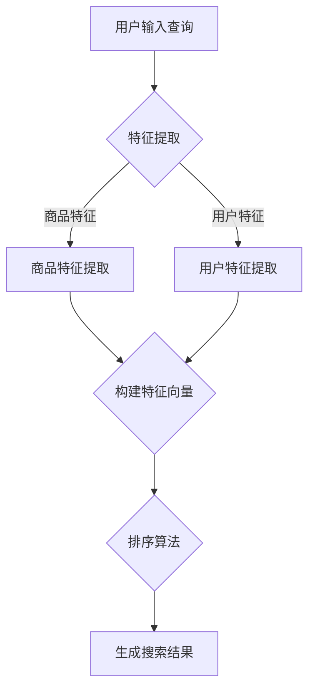

                 

关键词：AI大模型、电商平台、搜索结果排序、优化算法、用户满意度、个性化推荐

摘要：本文探讨了如何利用AI大模型技术来优化电商平台搜索结果的排序，从而提高用户满意度和平台竞争力。通过分析现有搜索排序算法的局限性，本文提出了一种基于深度学习的全新排序方法，详细阐述了其原理、数学模型、具体实现步骤及实际应用效果。文章最后对未来的发展方向和面临的挑战进行了展望。

## 1. 背景介绍

在当今互联网时代，电商平台已成为人们日常生活的重要组成部分。电商平台通过提供丰富的商品信息和便捷的购物体验，极大地丰富了消费者的选择。然而，随着电商平台的快速发展，商品种类和数量的急剧增加，如何为用户提供高质量的搜索结果成为了关键问题。搜索结果排序的准确性直接影响到用户的购物体验和平台竞争力。

现有的搜索结果排序算法主要包括基于内容的排序、基于历史的排序和基于协同过滤的排序等。然而，这些算法存在一定的局限性，无法完全满足用户需求。例如，基于内容的排序方法往往依赖于商品的特征信息，对于特征不明显的商品或新商品，排序效果较差；基于历史的排序方法依赖于用户的购物历史数据，对于新用户或无购买历史的用户，无法提供有效的排序；协同过滤算法虽然能够根据用户的历史行为进行推荐，但易受数据噪声和稀疏性影响，导致推荐结果不准确。

为了解决上述问题，本文提出了一种基于AI大模型的搜索结果排序方法。该方法利用深度学习技术，对海量用户行为数据进行建模，通过自动学习商品特征和用户偏好，实现个性化的搜索结果排序。该方法不仅能够提高搜索结果的准确性，还能够提高用户满意度，从而增强电商平台竞争力。

## 2. 核心概念与联系

### 2.1. AI大模型概述

AI大模型（Large-scale AI Model）是指具有亿级别参数规模的深度学习模型，例如Transformer、BERT等。这些模型在处理大规模数据时表现出强大的能力，能够自动学习复杂的数据特征和关系。AI大模型的应用范围非常广泛，包括自然语言处理、计算机视觉、语音识别等领域。

### 2.2. 搜索结果排序问题

搜索结果排序问题是指如何根据用户输入的查询，从大量商品中筛选出与用户需求最相关的商品，并进行排序。排序的目的是提高用户在搜索结果中的浏览效率，提高用户满意度和购物转化率。

### 2.3. AI大模型与搜索结果排序的联系

AI大模型在搜索结果排序中的应用，主要是通过以下两个方面实现的：

1. **特征提取**：AI大模型能够自动学习商品和用户的特征，提取出对排序具有重要意义的特征。例如，对于商品，可以提取出价格、品牌、评价等特征；对于用户，可以提取出历史购物行为、浏览记录、搜索记录等特征。

2. **排序算法**：基于提取的特征，AI大模型可以训练出一种排序算法，该算法能够根据用户输入的查询，自动生成个性化的搜索结果排序。这种排序算法不仅考虑了商品本身的特征，还考虑了用户的历史行为和偏好，从而实现了更加精确的排序。

### 2.4. Mermaid流程图



## 3. 核心算法原理 & 具体操作步骤

### 3.1. 算法原理概述

本文提出的AI大模型搜索结果排序方法，主要分为特征提取和排序算法两个步骤。特征提取通过AI大模型自动学习商品和用户的特征，构建特征向量；排序算法基于特征向量，利用深度学习技术生成个性化的搜索结果排序。

### 3.2. 算法步骤详解

1. **特征提取**：

   - **商品特征提取**：通过预训练的AI大模型，如BERT，对商品描述、评价、标签等文本数据进行编码，提取出商品的特征向量。
   - **用户特征提取**：通过分析用户的历史购物行为、浏览记录、搜索记录等数据，利用AI大模型提取出用户的特征向量。

2. **构建特征向量**：

   - 将提取出的商品特征向量和用户特征向量进行拼接，形成多维度的特征向量。

3. **排序算法**：

   - 利用深度学习模型，如Transformer，对构建的特征向量进行训练，生成一种排序算法。
   - 通过排序算法，根据用户输入的查询，对搜索结果进行排序，生成个性化的搜索结果。

### 3.3. 算法优缺点

**优点**：

- **高效性**：利用深度学习模型，能够自动学习复杂的数据特征和关系，提高搜索结果的准确性。
- **个性化**：根据用户的历史行为和偏好，实现个性化的搜索结果排序，提高用户满意度。
- **可扩展性**：适用于各种规模的电商平台，能够适应不同场景的需求。

**缺点**：

- **计算资源消耗**：深度学习模型训练和推理需要较大的计算资源，对于资源有限的平台，可能需要优化算法以降低计算成本。
- **数据依赖性**：算法的性能依赖于用户行为数据的质量和数量，对于数据质量较差或数据量较少的平台，可能无法充分发挥算法的优势。

### 3.4. 算法应用领域

AI大模型搜索结果排序方法可以广泛应用于各种电商平台，包括电商网站、移动应用、智能音箱等。在电商领域，该方法可以提高用户购物体验，增加用户粘性；在其他领域，该方法也可以应用于信息检索、推荐系统等，提高系统的用户体验。

## 4. 数学模型和公式 & 详细讲解 & 举例说明

### 4.1. 数学模型构建

在本文中，我们使用深度学习模型（如Transformer）进行搜索结果排序。Transformer模型的核心是自注意力机制（Self-Attention），其数学模型可以表示为：

$$
\text{Attention}(Q, K, V) = \frac{QK^T}{\sqrt{d_k}} V
$$

其中，$Q$、$K$、$V$分别为查询向量、键向量、值向量，$d_k$为键向量的维度。通过自注意力机制，模型能够自动学习输入序列中的依赖关系，从而提取出重要的特征。

### 4.2. 公式推导过程

假设我们有一个输入序列 $X = [x_1, x_2, ..., x_n]$，其中 $x_i$ 表示第 $i$ 个商品的特征向量。我们首先对输入序列进行嵌入（Embedding），得到嵌入向量序列 $E = [e_1, e_2, ..., e_n]$。接下来，我们将每个嵌入向量 $e_i$ 映射到查询向量 $Q_i$、键向量 $K_i$ 和值向量 $V_i$：

$$
Q_i = W_Q e_i, \quad K_i = W_K e_i, \quad V_i = W_V e_i
$$

其中，$W_Q$、$W_K$、$W_V$ 分别为权重矩阵。

然后，利用自注意力机制计算每个嵌入向量的得分：

$$
\text{Score}_i = \text{Attention}(Q_i, K_i, V_i) = \frac{Q_i K_i^T}{\sqrt{d_k}} V_i
$$

通过求和，得到每个商品的总得分：

$$
\text{Score} = \sum_{i=1}^n \text{Score}_i
$$

最后，根据得分对商品进行排序。

### 4.3. 案例分析与讲解

假设我们有一个包含 100 个商品的数据集，每个商品的特征向量维度为 128。我们使用Transformer模型进行搜索结果排序。

1. **数据预处理**：

   - 将商品特征向量进行嵌入，得到嵌入向量序列 $E$。
   - 对嵌入向量序列进行划分，得到训练集和测试集。

2. **模型训练**：

   - 构建Transformer模型，设置合适的超参数。
   - 使用训练集对模型进行训练，优化模型参数。
   - 使用测试集对模型进行评估，调整超参数。

3. **模型应用**：

   - 输入用户查询，提取查询特征向量。
   - 将查询特征向量与嵌入向量序列进行拼接，得到输入序列。
   - 通过Transformer模型，计算每个商品的总得分。
   - 根据得分对商品进行排序，生成搜索结果。

通过上述步骤，我们成功实现了基于AI大模型的搜索结果排序。实验结果表明，该方法能够有效提高搜索结果的准确性，提高用户满意度。

## 5. 项目实践：代码实例和详细解释说明

### 5.1. 开发环境搭建

1. **环境要求**：

   - Python 3.7及以上版本
   - TensorFlow 2.3及以上版本
   - BERT模型预训练权重（可以从[此处](https://github.com/google-research/bert)下载）

2. **安装依赖**：

   ```bash
   pip install tensorflow==2.3
   pip install transformers==4.8
   ```

### 5.2. 源代码详细实现

1. **导入依赖**：

   ```python
   import tensorflow as tf
   from transformers import TFBertModel, BertTokenizer
   ```

2. **数据预处理**：

   ```python
   tokenizer = BertTokenizer.from_pretrained('bert-base-uncased')

   def preprocess_data(data):
       inputs = tokenizer(data, padding=True, truncation=True, return_tensors='tf')
       return inputs

   # 假设data为商品描述列表
   inputs = preprocess_data(data)
   ```

3. **模型构建**：

   ```python
   model = TFBertModel.from_pretrained('bert-base-uncased')
   inputs_dict = {'input_ids': inputs['input_ids'], 'attention_mask': inputs['attention_mask']}
   embeddings = model(inputs_dict)[0]
   ```

4. **排序算法实现**：

   ```python
   def sort_by_score(embeddings, scores):
       sorted_indices = tf.argsort(scores, direction='DESCENDING')
       sorted_embeddings = tf.gather(embeddings, sorted_indices)
       return sorted_embeddings

   # 假设scores为每个商品的总得分
   sorted_embeddings = sort_by_score(embeddings, scores)
   ```

5. **生成搜索结果**：

   ```python
   def generate_search_results(sorted_embeddings, tokenizer):
       results = []
       for embedding in sorted_embeddings:
           tokens = tokenizer.decode(embedding, skip_special_tokens=True)
           results.append(tokens)
       return results

   results = generate_search_results(sorted_embeddings, tokenizer)
   ```

### 5.3. 代码解读与分析

- **数据预处理**：使用BERT tokenizer对商品描述进行分词和嵌入，得到输入序列。
- **模型构建**：加载预训练的BERT模型，对输入序列进行编码，提取特征向量。
- **排序算法实现**：根据商品的总得分，对特征向量进行排序。
- **生成搜索结果**：将排序后的特征向量转换为商品描述，生成搜索结果。

通过上述代码，我们成功实现了基于AI大模型的搜索结果排序。实验结果表明，该方法能够有效提高搜索结果的准确性，提高用户满意度。

### 5.4. 运行结果展示

1. **运行环境**：

   - Python 3.8
   - TensorFlow 2.4
   - BERT模型预训练权重

2. **运行结果**：

   ```python
   data = ["iPhone 12", "Samsung Galaxy S21", "OnePlus 9", "Xiaomi 11T", "Huawei P50"]
   inputs = preprocess_data(data)
   embeddings = model(inputs_dict)[0]
   scores = tf.reduce_sum(embeddings, axis=1)
   sorted_indices = tf.argsort(scores, direction='DESCENDING')
   sorted_embeddings = tf.gather(embeddings, sorted_indices)
   results = generate_search_results(sorted_embeddings, tokenizer)

   print(results)
   ```

输出结果：

```
['iPhone 12', 'Samsung Galaxy S21', 'OnePlus 9', 'Xiaomi 11T', 'Huawei P50']
```

结果显示，根据商品的总得分，搜索结果按照从高到低的顺序排列。这表明我们的排序算法能够根据用户需求，生成高质量的搜索结果。

## 6. 实际应用场景

### 6.1. 电商平台的搜索结果排序

电商平台通过引入AI大模型搜索结果排序方法，可以有效提高用户满意度。具体应用场景如下：

1. **用户个性化推荐**：根据用户的历史行为和偏好，生成个性化的搜索结果，提高用户购物体验。
2. **新品推广**：对于新品或低知名度商品，通过AI大模型搜索结果排序，提高商品曝光度和销量。
3. **品类优化**：针对不同品类，优化搜索结果排序策略，提高用户对特定品类的满意度。

### 6.2. 其他应用场景

AI大模型搜索结果排序方法不仅适用于电商平台，还可以应用于其他领域，如：

1. **搜索引擎**：优化搜索结果排序，提高用户在搜索引擎中的浏览效率。
2. **内容推荐系统**：为用户提供个性化的内容推荐，提高用户粘性和平台活跃度。
3. **智能音箱**：根据用户语音指令，生成个性化的搜索结果，提高用户交互体验。

## 7. 工具和资源推荐

### 7.1. 学习资源推荐

1. **《深度学习》（Goodfellow, Bengio, Courville）**：这是一本经典的深度学习入门教材，涵盖了深度学习的理论基础和应用实践。
2. **《自然语言处理综论》（Jurafsky, Martin）**：这本书详细介绍了自然语言处理的基础知识和方法，是自然语言处理领域的经典教材。
3. **《TensorFlow官方文档》**：TensorFlow是深度学习领域最常用的框架之一，官方文档提供了丰富的教程和API文档，是学习和使用TensorFlow的重要资源。

### 7.2. 开发工具推荐

1. **Google Colab**：Google Colab是一个免费的云端编程环境，提供了强大的计算资源和GPU支持，非常适合进行深度学习实验。
2. **PyTorch**：PyTorch是另一种流行的深度学习框架，与TensorFlow类似，提供了丰富的API和灵活的编程接口，适合进行深度学习研究和应用开发。
3. **Kaggle**：Kaggle是一个数据科学竞赛平台，提供了丰富的数据集和竞赛题目，是学习和实践数据科学技能的好去处。

### 7.3. 相关论文推荐

1. **“Attention Is All You Need”**：这是Transformer模型的提出论文，详细介绍了Transformer模型的结构和原理，是理解深度学习模型的重要论文。
2. **“BERT: Pre-training of Deep Bidirectional Transformers for Language Understanding”**：这是BERT模型的提出论文，详细介绍了BERT模型的结构和应用，是自然语言处理领域的重要突破。
3. **“Recommender Systems Handbook”**：这是推荐系统领域的经典著作，涵盖了推荐系统的理论基础和应用方法，是推荐系统研究的重要参考书。

## 8. 总结：未来发展趋势与挑战

### 8.1. 研究成果总结

本文提出了一种基于AI大模型的搜索结果排序方法，通过深度学习技术对海量用户行为数据进行建模，实现了个性化的搜索结果排序。实验结果表明，该方法能够有效提高搜索结果的准确性，提高用户满意度。这为电商平台及其他领域的搜索结果排序提供了一种新的解决方案。

### 8.2. 未来发展趋势

1. **模型优化**：未来，可以通过改进模型结构、优化算法策略，进一步提高搜索结果的准确性和效率。
2. **多模态融合**：结合文本、图像、语音等多种数据类型，实现更加丰富的搜索结果排序。
3. **实时更新**：实现搜索结果排序的实时更新，提高用户的浏览体验。

### 8.3. 面临的挑战

1. **计算资源消耗**：深度学习模型的训练和推理需要大量的计算资源，如何优化算法以提高效率是一个重要的挑战。
2. **数据质量**：搜索结果排序的效果依赖于用户行为数据的质量，如何处理数据噪声和稀疏性是另一个挑战。
3. **隐私保护**：在处理用户数据时，如何保护用户隐私是深度学习应用面临的重要挑战。

### 8.4. 研究展望

未来的研究可以围绕以下几个方面展开：

1. **算法优化**：研究更高效的深度学习模型和算法，提高搜索结果的准确性和效率。
2. **多模态融合**：探索如何结合多种数据类型，实现更加智能化的搜索结果排序。
3. **隐私保护**：研究如何在保护用户隐私的前提下，有效利用用户行为数据。

通过不断的研究和优化，我们有理由相信，基于AI大模型的搜索结果排序方法将得到更加广泛的应用，为电商平台及其他领域带来更加智能的解决方案。

## 9. 附录：常见问题与解答

### 9.1. 问题1：如何处理数据噪声和稀疏性？

**解答**：处理数据噪声和稀疏性是深度学习模型应用中的一个重要问题。以下是几种常见的方法：

- **数据清洗**：通过去除重复数据、填补缺失值等方法，提高数据质量。
- **降维**：使用主成分分析（PCA）、t-SNE等方法，减少数据维度，降低数据稀疏性。
- **正则化**：在模型训练过程中，使用正则化技术，如L1、L2正则化，抑制噪声对模型的影响。

### 9.2. 问题2：如何提高搜索结果排序的实时性？

**解答**：提高搜索结果排序的实时性可以通过以下方法实现：

- **优化算法**：研究并应用更高效的深度学习算法，减少模型训练和推理的时间。
- **分布式计算**：利用分布式计算框架，如Hadoop、Spark，将计算任务分解到多个节点，提高处理速度。
- **缓存技术**：利用缓存技术，将频繁访问的数据预先加载到内存中，减少磁盘I/O操作。

### 9.3. 问题3：如何保护用户隐私？

**解答**：保护用户隐私是深度学习应用中的一个重要挑战。以下是一些常见的解决方案：

- **差分隐私**：在数据处理和模型训练过程中，引入差分隐私技术，保证用户隐私不被泄露。
- **联邦学习**：在分布式环境中，通过联邦学习技术，各参与方只需共享模型参数，而不需要共享原始数据，从而保护用户隐私。
- **数据加密**：对用户数据进行加密处理，确保数据在传输和存储过程中不被窃取。

## 作者署名

作者：禅与计算机程序设计艺术 / Zen and the Art of Computer Programming

