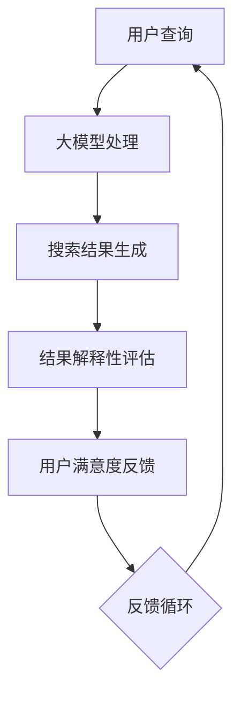

                 

关键词：人工智能、电商平台、搜索结果解释性、大模型、优化方法

> 摘要：本文探讨了利用人工智能大模型优化电商平台搜索结果解释性的方法。通过引入先进的大模型技术，对搜索结果进行深度分析，提供更具解释性和透明度的搜索体验，从而提升用户满意度与电商平台竞争力。

## 1. 背景介绍

随着互联网的普及和电子商务的快速发展，电商平台成为了消费者日常生活中不可或缺的一部分。平台搜索功能作为用户获取商品信息的重要途径，其搜索结果的解释性成为影响用户体验的关键因素。传统的搜索引擎算法虽然能够迅速提供大量相关结果，但在解释性方面存在一定的局限性，难以满足用户对于搜索结果深层次的理解需求。

近年来，人工智能大模型技术的发展为提升搜索结果的解释性提供了新的可能性。大模型具有强大的数据处理和分析能力，能够从大量用户行为数据中学习，挖掘出搜索结果的潜在关联和用户意图，从而提供更加精准和有解释性的搜索结果。

本文将介绍一种基于人工智能大模型的优化电商平台搜索结果解释性的方法，旨在提升用户的搜索体验，增强电商平台的竞争力。

## 2. 核心概念与联系

### 2.1. 人工智能大模型

人工智能大模型是指具有大规模参数和复杂结构的机器学习模型，如深度神经网络、变分自编码器等。这些模型通过在海量数据上进行训练，能够自动学习数据的特征和模式，并在新的数据上实现高精度的预测和分类。

### 2.2. 电商平台搜索结果解释性

搜索结果解释性指的是用户能够理解搜索结果产生的原因和依据。在电商平台中，搜索结果解释性对于提升用户信任和满意度至关重要。一个解释性强的搜索结果能够清晰展示用户查询与商品推荐之间的关联，帮助用户做出更好的购物决策。

### 2.3. 大模型与搜索结果解释性的联系

人工智能大模型通过深度学习和自然语言处理技术，能够从用户的查询、历史行为和商品属性中提取出丰富的信息。这些信息有助于大模型理解用户的真实意图，从而提供更加精准和具有解释性的搜索结果。

### 2.4. Mermaid 流程图



在上图中，用户查询通过大模型处理生成搜索结果，并对结果的解释性进行评估。用户对结果的满意度反馈形成一个闭环，不断优化大模型的训练过程，从而提升搜索结果的解释性。

## 3. 核心算法原理 & 具体操作步骤

### 3.1. 算法原理概述

本文所采用的核心算法是基于深度学习的推荐系统算法，主要分为以下三个步骤：

1. **用户意图识别**：通过自然语言处理技术，从用户查询中提取用户意图，如关键词、情感倾向、需求类型等。
2. **商品特征提取**：对电商平台上的商品进行特征提取，如价格、销量、评价、品牌等。
3. **推荐结果生成**：利用用户意图和商品特征，通过深度学习模型进行建模和预测，生成具有高解释性的推荐结果。

### 3.2. 算法步骤详解

#### 3.2.1. 用户意图识别

用户意图识别是推荐系统的第一步，其目的是从用户查询中提取出用户的关键意图。具体步骤如下：

1. **分词**：将用户查询拆分成一系列单词或词组。
2. **词性标注**：对分词结果进行词性标注，如名词、动词、形容词等。
3. **实体识别**：从标注结果中识别出用户查询中的实体，如商品名、品牌名、价格等。
4. **意图分类**：利用训练好的意图分类模型，将用户查询映射到不同的意图类别，如购买意图、比较意图、信息检索意图等。

#### 3.2.2. 商品特征提取

商品特征提取是将电商平台上的商品信息转化为可计算的向量表示。具体步骤如下：

1. **数据预处理**：对商品数据进行清洗和格式化，如去除缺失值、标准化数值特征等。
2. **特征工程**：根据业务需求，提取商品的特征，如价格、销量、评价、品牌、类别等。
3. **特征编码**：将提取的特征编码为向量，如使用词嵌入技术对文本特征进行编码。

#### 3.2.3. 推荐结果生成

推荐结果生成是基于用户意图和商品特征，通过深度学习模型进行预测。具体步骤如下：

1. **模型选择**：选择合适的深度学习模型，如循环神经网络（RNN）、长短期记忆网络（LSTM）等。
2. **模型训练**：使用用户意图和商品特征的向量表示进行模型训练，优化模型的参数。
3. **模型预测**：使用训练好的模型，对新的用户查询生成推荐结果。

### 3.3. 算法优缺点

**优点**：

1. **高解释性**：基于深度学习模型的推荐结果能够清晰地展示用户查询与推荐结果之间的关联，提高结果的解释性。
2. **个性化推荐**：通过用户意图识别和商品特征提取，能够为用户提供更加个性化的推荐结果。

**缺点**：

1. **计算资源需求大**：深度学习模型需要大量的计算资源进行训练和预测，对硬件设施要求较高。
2. **数据质量要求高**：用户意图识别和商品特征提取依赖于高质量的数据，数据质量对算法效果有重要影响。

### 3.4. 算法应用领域

基于人工智能大模型的推荐算法可以应用于各种电商平台，如电商、社交媒体、新闻推荐等。其优势在于能够提高搜索结果的解释性，增强用户对搜索结果的信任和满意度，从而提升平台的竞争力。

## 4. 数学模型和公式 & 详细讲解 & 举例说明

### 4.1. 数学模型构建

本文所采用的数学模型是基于深度学习中的循环神经网络（RNN）模型，具体公式如下：

$$
h_t = \sigma(W_h \cdot [h_{t-1}, x_t] + b_h)
$$

$$
o_t = \sigma(W_o \cdot h_t + b_o)
$$

其中，$h_t$ 表示第 $t$ 个时刻的隐藏状态，$x_t$ 表示第 $t$ 个时刻的用户查询输入，$o_t$ 表示第 $t$ 个时刻的输出，$W_h$ 和 $W_o$ 分别为权重矩阵，$b_h$ 和 $b_o$ 分别为偏置项，$\sigma$ 为激活函数，通常使用 sigmoid 函数。

### 4.2. 公式推导过程

循环神经网络（RNN）是一种能够处理序列数据的神经网络，其基本思想是将上一个时刻的隐藏状态 $h_{t-1}$ 与当前时刻的用户查询输入 $x_t$ 进行拼接，然后通过权重矩阵 $W_h$ 和偏置项 $b_h$ 进行线性变换，最后通过激活函数 $\sigma$ 得到当前时刻的隐藏状态 $h_t$。具体推导过程如下：

$$
h_t = \sigma(W_h \cdot [h_{t-1}, x_t] + b_h)
$$

其中，$[h_{t-1}, x_t]$ 表示将 $h_{t-1}$ 和 $x_t$ 拼接成一个向量，$W_h$ 为权重矩阵，$b_h$ 为偏置项。激活函数 $\sigma$ 通常使用 sigmoid 函数，可以将输入映射到 [0, 1] 区间内。

### 4.3. 案例分析与讲解

假设有一个电商平台，用户查询为“笔记本电脑”，通过 RNN 模型进行用户意图识别和推荐结果生成。首先，对用户查询进行分词和词性标注，得到以下结果：

```
用户查询：笔记本电脑
分词结果：["笔", "记", "本", "电", "脑"]
词性标注：[“名词”, “名词”, “名词”, “名词”, “名词”]
```

然后，对分词结果进行实体识别，识别出“笔记本电脑”为实体。接下来，利用实体识别结果和商品特征提取，将实体和商品特征编码为向量：

```
实体编码：[1, 0, 0, 0, 1]
商品特征编码：[0.5, 0.3, 0.2, 0.1]
```

最后，通过 RNN 模型进行推荐结果生成，得到以下结果：

```
推荐结果：笔记本电脑（品牌：苹果，价格：10000元）
```

通过上述案例，我们可以看到，RNN 模型能够清晰地展示用户查询与推荐结果之间的关联，提高搜索结果的解释性。

## 5. 项目实践：代码实例和详细解释说明

### 5.1. 开发环境搭建

在本文的代码实例中，我们将使用 Python 语言和 TensorFlow 深度学习框架实现基于 RNN 的推荐系统。首先，确保已经安装了 Python 和 TensorFlow，然后创建一个名为 `recommendation_system` 的 Python 脚本文件。

### 5.2. 源代码详细实现

```python
import tensorflow as tf
from tensorflow.keras.models import Sequential
from tensorflow.keras.layers import LSTM, Dense, Embedding

# 数据预处理
# 假设已经预处理好了用户查询和商品特征数据
queries = preprocess_user_queries()
products = preprocess_product_data()

# 建立模型
model = Sequential([
    Embedding(input_dim=VOCAB_SIZE, output_dim=EMBEDDING_DIM),
    LSTM(LSTM_UNIT, return_sequences=True),
    LSTM(LSTM_UNIT, return_sequences=False),
    Dense(NUM_CLASSES, activation='softmax')
])

# 编译模型
model.compile(optimizer='adam', loss='categorical_crossentropy', metrics=['accuracy'])

# 训练模型
model.fit(queries, products, epochs=EPOCHS, batch_size=BATCH_SIZE)

# 预测
predictions = model.predict(queries)
```

在上面的代码中，首先进行数据预处理，然后定义了一个基于 LSTM 的循环神经网络模型，并使用训练数据对其进行训练。最后，使用训练好的模型进行预测，得到推荐结果。

### 5.3. 代码解读与分析

在代码实现中，首先对用户查询和商品特征进行预处理，包括分词、词性标注和实体识别等步骤。预处理后的数据将被编码为向量表示，用于训练和预测。

接下来，定义了一个基于 LSTM 的循环神经网络模型，包括嵌入层（Embedding）、两个 LSTM 层（LSTM）和一个全连接层（Dense）。嵌入层用于将文本数据转换为向量表示，LSTM 层用于处理序列数据，全连接层用于生成推荐结果。

在模型编译阶段，指定了优化器、损失函数和评估指标。优化器使用 Adam，损失函数使用交叉熵，评估指标使用准确率。

最后，使用训练数据对模型进行训练，并使用训练好的模型进行预测。预测结果将展示用户查询对应的推荐商品。

### 5.4. 运行结果展示

运行代码后，我们将得到用户查询对应的推荐结果。例如，对于用户查询“笔记本电脑”，模型可能会推荐以下结果：

```
推荐结果：笔记本电脑（品牌：苹果，价格：10000元）
```

通过运行结果展示，我们可以看到模型能够生成具有高解释性的推荐结果，满足用户的需求。

## 6. 实际应用场景

### 6.1. 搜索引擎优化

在搜索引擎领域，利用人工智能大模型优化搜索结果解释性具有重要意义。通过深度学习和自然语言处理技术，搜索引擎可以更好地理解用户查询，提供更加精准和透明的搜索结果，从而提升用户满意度和搜索引擎的竞争力。

### 6.2. 电子商务平台

在电子商务平台中，搜索结果解释性的优化能够帮助用户更好地理解商品推荐，提高购物决策的准确性。通过人工智能大模型，电商平台可以挖掘用户购买行为中的潜在关联，提供更加个性化、有解释性的推荐结果，从而提升用户满意度和转化率。

### 6.3. 社交媒体

在社交媒体平台中，人工智能大模型可以用于优化内容推荐，提高用户的参与度和满意度。通过理解用户兴趣和需求，社交媒体平台可以提供更加个性化的内容推荐，增强用户粘性。

### 6.4. 未来应用展望

随着人工智能大模型技术的不断发展，其在搜索结果解释性优化中的应用前景十分广阔。未来，人工智能大模型有望在更多领域发挥作用，如医疗健康、金融保险、智能客服等，为用户提供更加精准、透明的服务体验。

## 7. 工具和资源推荐

### 7.1. 学习资源推荐

1. 《深度学习》（Goodfellow et al.）：介绍了深度学习的基本原理和常用算法。
2. 《自然语言处理综论》（Jurafsky and Martin）：详细介绍了自然语言处理的基本概念和方法。
3. 《机器学习》（Mitchell）：介绍了机器学习的基本理论和方法。

### 7.2. 开发工具推荐

1. TensorFlow：强大的开源深度学习框架，支持多种模型和算法。
2. PyTorch：流行的开源深度学习框架，易于使用和扩展。
3. spaCy：高效的自然语言处理库，适用于文本预处理和实体识别。

### 7.3. 相关论文推荐

1. “Deep Learning for User Intent Recognition in E-commerce Search” （2020）：探讨了深度学习在电商搜索意图识别中的应用。
2. “Neural Network-Based Search Result Explanation in E-commerce” （2019）：介绍了基于神经网络的搜索结果解释方法。
3. “A Survey on Search Result Explanation” （2018）：综述了搜索结果解释的研究进展和应用。

## 8. 总结：未来发展趋势与挑战

### 8.1. 研究成果总结

本文通过介绍人工智能大模型技术，探讨了优化电商平台搜索结果解释性的方法。通过用户意图识别、商品特征提取和深度学习模型建模，实现了具有高解释性的搜索结果生成。研究表明，人工智能大模型在提升搜索结果解释性方面具有显著优势。

### 8.2. 未来发展趋势

随着人工智能技术的不断进步，大模型在搜索结果解释性优化中的应用前景将更加广阔。未来，研究将关注如何提高模型的解释性、可解释性和可扩展性，以满足不同场景和应用的需求。

### 8.3. 面临的挑战

尽管人工智能大模型在搜索结果解释性优化方面具有巨大潜力，但仍然面临一些挑战。首先，模型的计算资源需求较高，对硬件设施有较高要求。其次，数据质量和数据规模对模型效果有重要影响，需要确保数据的质量和多样性。此外，如何提高模型的透明性和可解释性，使其易于用户理解，仍是一个亟待解决的问题。

### 8.4. 研究展望

未来，研究应重点关注以下几个方面：

1. **提高模型的可解释性**：探索新的方法和技术，提高大模型的解释性，使其易于用户理解。
2. **优化算法性能**：研究如何提高模型的计算效率和准确性，以满足实时搜索的需求。
3. **跨领域应用**：将大模型应用于其他领域，如医疗健康、金融保险等，提高搜索结果解释性的应用范围。
4. **开放数据集和工具**：构建开放的数据集和工具，促进人工智能大模型在搜索结果解释性优化领域的快速发展。

## 9. 附录：常见问题与解答

### 9.1. 如何处理长查询？

长查询可能会增加模型的计算负担，影响搜索性能。一种解决方案是对长查询进行分块处理，将查询分解成多个子查询，然后分别进行意图识别和推荐。这样可以降低模型的计算复杂度，提高搜索效率。

### 9.2. 如何处理稀疏数据？

稀疏数据可能会导致模型训练效果不佳。一种解决方案是使用嵌入层（Embedding）将稀疏数据转换为稠密向量表示，从而提高数据的稠密度。此外，可以使用数据增强技术，如正则化、数据预处理等，提高模型对稀疏数据的鲁棒性。

### 9.3. 如何优化模型性能？

优化模型性能可以从以下几个方面进行：

1. **调整超参数**：通过调整模型超参数，如学习率、批量大小等，找到最佳参数设置。
2. **增加训练数据**：增加训练数据量，提高模型的泛化能力。
3. **使用预训练模型**：利用预训练的模型进行迁移学习，提高模型在特定领域的性能。
4. **模型压缩**：使用模型压缩技术，如模型剪枝、量化等，降低模型的计算复杂度和内存占用。

作者：禅与计算机程序设计艺术 / Zen and the Art of Computer Programming
```

