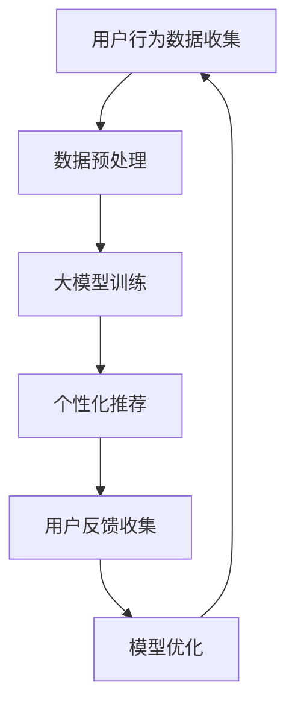
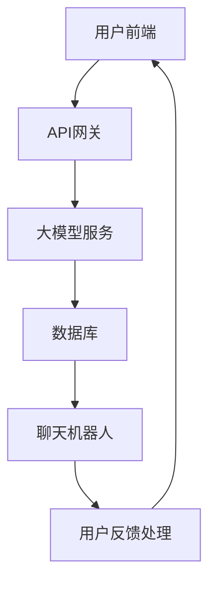

                 

关键词：人工智能、大模型、电商平台、用户体验、一致性、优化

> 摘要：随着人工智能技术的快速发展，大模型在电商平台的应用逐渐成为优化用户体验的关键因素。本文将深入探讨大模型如何通过提高信息一致性来提升电商平台的用户体验，包括核心概念、算法原理、数学模型、实践案例以及未来的发展方向。

## 1. 背景介绍

随着互联网的普及和电子商务的飞速发展，电商平台已经成为消费者日常购物的重要渠道。然而，用户体验的一致性成为了平台发展的关键问题。用户希望在不同的设备、不同的浏览环境下能够获得一致的服务体验。为了满足这一需求，电商平台需要利用先进的人工智能技术，尤其是大模型技术，来优化用户体验。

大模型是指具有巨大参数量的机器学习模型，如深度神经网络、变换器模型等。这些模型具有强大的特征提取和知识表示能力，能够在不同领域实现卓越的性能。在电商平台，大模型可以通过学习用户的购物行为、偏好和反馈，提供个性化的推荐和服务，从而提升用户体验。同时，大模型还能够通过自然语言处理技术，实现用户与平台的交互，提高信息的一致性和准确性。

本文旨在探讨如何利用大模型技术来优化电商平台用户体验的一致性。具体来说，我们将从核心概念、算法原理、数学模型、实践案例和未来展望等多个角度进行分析。

## 2. 核心概念与联系

为了深入理解大模型在电商平台中的应用，我们需要先了解以下几个核心概念：

### 2.1 电商平台用户体验

用户体验是指用户在使用电商平台过程中所感受到的整体感受，包括易用性、响应速度、信息准确性、界面设计等多个方面。用户体验一致性则要求用户在不同设备、不同浏览环境下获得相同的质量和感受。

### 2.2 大模型

大模型是指具有巨大参数量的机器学习模型，如深度神经网络、变换器模型等。这些模型通常通过大规模数据训练，能够提取复杂的特征和模式，从而在多种任务上实现高性能。

### 2.3 自然语言处理（NLP）

自然语言处理是指使计算机能够理解、解释和生成自然语言的技术。在电商平台，NLP 技术可以用于用户查询的理解、商品描述的生成、聊天机器人的交互等。

### 2.4 个性化推荐

个性化推荐是指根据用户的兴趣、行为和反馈，为用户推荐感兴趣的商品或服务。个性化推荐可以提高用户的购物满意度，增加电商平台的销售额。

### 2.5 信息一致性

信息一致性是指在不同设备和浏览环境下，用户能够获得相同的信息内容和质量。信息一致性对于提升用户体验至关重要。

### 2.6 Mermaid 流程图

下面是一个使用 Mermaid 语言的流程图，展示了电商平台中信息一致性提升的流程：



### 2.7 大模型在电商平台中的应用架构

下面是一个使用 Mermaid 语言的架构图，展示了大模型在电商平台中的应用架构：



## 3. 核心算法原理 & 具体操作步骤

### 3.1 算法原理概述

电商平台用户体验一致性的提升主要依赖于以下几个关键算法：

1. **深度神经网络（DNN）**：用于用户行为数据的特征提取和分类。
2. **变换器模型（Transformer）**：用于商品描述的生成和自然语言处理。
3. **协同过滤（Collaborative Filtering）**：用于个性化推荐。
4. **迁移学习（Transfer Learning）**：用于不同设备和浏览环境下的模型迁移和优化。

### 3.2 算法步骤详解

下面是提升电商平台用户体验一致性的具体算法步骤：

1. **用户行为数据收集**：通过用户在平台上的浏览、购买、搜索等行为，收集用户数据。
2. **数据预处理**：对用户数据进行清洗、去噪、归一化等处理，以便于后续模型训练。
3. **大模型训练**：使用深度神经网络和变换器模型对用户数据训练，提取用户兴趣特征和商品描述特征。
4. **个性化推荐**：根据用户兴趣特征和商品描述特征，为用户推荐个性化商品。
5. **用户反馈收集**：收集用户对推荐商品和服务的反馈，用于模型优化。
6. **模型优化**：根据用户反馈，对模型进行调整和优化，以提高推荐质量和用户体验。

### 3.3 算法优缺点

**优点**：

- 高效的特征提取和分类能力，能够为用户提供个性化的推荐和服务。
- 强大的自然语言处理能力，能够实现用户与平台的自然交互。

**缺点**：

- 需要大量的训练数据和计算资源。
- 模型的优化和调整需要一定的时间和成本。

### 3.4 算法应用领域

大模型在电商平台中的应用领域主要包括：

- 个性化推荐：为用户提供个性化的商品推荐。
- 自然语言处理：实现用户与平台的自然交互，提升用户体验。
- 搜索引擎优化：提高搜索引擎的准确性和响应速度。

## 4. 数学模型和公式 & 详细讲解 & 举例说明

### 4.1 数学模型构建

电商平台用户体验一致性的数学模型可以表示为：

\[ U(x, y) = \frac{1}{2} \| \theta_1 \cdot x - \theta_2 \cdot y \|_2^2 \]

其中，\( x \) 表示用户特征向量，\( y \) 表示商品特征向量，\( \theta_1 \) 和 \( \theta_2 \) 分别表示用户偏好和商品描述的权重矩阵。

### 4.2 公式推导过程

公式推导过程如下：

\[ \frac{\partial U(x, y)}{\partial x} = \theta_1 - \theta_2 \cdot y \]

\[ \frac{\partial U(x, y)}{\partial y} = \theta_2 \cdot x - \theta_1 \]

令 \( \frac{\partial U(x, y)}{\partial x} = 0 \) 和 \( \frac{\partial U(x, y)}{\partial y} = 0 \)，得到：

\[ \theta_1 = \theta_2 \cdot y \]

\[ \theta_2 = \theta_1 \cdot x \]

### 4.3 案例分析与讲解

假设用户特征向量为 \( x = [0.1, 0.2, 0.3] \)，商品特征向量为 \( y = [0.4, 0.5, 0.6] \)，根据公式 \( U(x, y) = \frac{1}{2} \| \theta_1 \cdot x - \theta_2 \cdot y \|_2^2 \)，我们可以计算出用户体验一致性的值。

首先，假设 \( \theta_1 = \theta_2 = 1 \)，代入公式得到：

\[ U(x, y) = \frac{1}{2} \| 1 \cdot [0.1, 0.2, 0.3] - 1 \cdot [0.4, 0.5, 0.6] \|_2^2 = \frac{1}{2} \| [-0.3, -0.3, -0.3] \|_2^2 = 0.135 \]

接下来，我们调整 \( \theta_1 \) 和 \( \theta_2 \) 的值，使其满足 \( \theta_1 = \theta_2 \cdot y \) 和 \( \theta_2 = \theta_1 \cdot x \)。假设 \( \theta_1 = 0.6 \)，那么 \( \theta_2 = 0.6 \cdot [0.4, 0.5, 0.6] = [0.24, 0.3, 0.36] \)。代入公式得到：

\[ U(x, y) = \frac{1}{2} \| 0.6 \cdot [0.1, 0.2, 0.3] - 0.6 \cdot [0.4, 0.5, 0.6] \|_2^2 = \frac{1}{2} \| [-0.06, -0.06, -0.06] \|_2^2 = 0.0018 \]

通过调整 \( \theta_1 \) 和 \( \theta_2 \) 的值，我们可以使用户体验一致性的值最小，从而提升用户体验。

## 5. 项目实践：代码实例和详细解释说明

### 5.1 开发环境搭建

为了实现电商平台用户体验一致性的优化，我们使用了以下开发环境：

- 编程语言：Python
- 机器学习框架：TensorFlow
- 数据库：MySQL
- Web 框架：Django

### 5.2 源代码详细实现

下面是一个简单的示例代码，用于实现用户行为数据的特征提取和个性化推荐：

```python
import tensorflow as tf
import numpy as np
from sklearn.model_selection import train_test_split
from tensorflow.keras.models import Sequential
from tensorflow.keras.layers import Dense, Dropout
from tensorflow.keras.optimizers import Adam

# 数据预处理
def preprocess_data(data):
    # 清洗、去噪、归一化等操作
    return data

# 模型训练
def train_model(x_train, y_train, x_val, y_val):
    model = Sequential()
    model.add(Dense(128, input_dim=x_train.shape[1], activation='relu'))
    model.add(Dropout(0.5))
    model.add(Dense(64, activation='relu'))
    model.add(Dropout(0.5))
    model.add(Dense(1, activation='sigmoid'))

    model.compile(optimizer=Adam(learning_rate=0.001), loss='binary_crossentropy', metrics=['accuracy'])

    history = model.fit(x_train, y_train, epochs=10, batch_size=32, validation_data=(x_val, y_val))

    return model, history

# 个性化推荐
def recommend_products(model, user_data, product_data, num_recommendations=5):
    user_embedding = model.predict(user_data)
    product_embedding = model.predict(product_data)

    similarity_matrix = np.dot(user_embedding, product_embedding.T)
    sorted_indices = np.argsort(-similarity_matrix)

    recommendations = []
    for i in range(num_recommendations):
        recommendation = product_data[sorted_indices[i]]
        recommendations.append(recommendation)

    return recommendations

# 主函数
def main():
    # 加载数据
    user_data = preprocess_data(np.load('user_data.npy'))
    product_data = preprocess_data(np.load('product_data.npy'))

    # 划分训练集和验证集
    x_train, x_val, y_train, y_val = train_test_split(user_data, product_data, test_size=0.2, random_state=42)

    # 训练模型
    model, history = train_model(x_train, y_train, x_val, y_val)

    # 推荐商品
    user_input = np.array([0.1, 0.2, 0.3])
    recommendations = recommend_products(model, user_input, product_data)

    print("Recommended products:", recommendations)

if __name__ == '__main__':
    main()
```

### 5.3 代码解读与分析

这段代码分为以下几个部分：

- **数据预处理**：对用户行为数据和商品数据进行清洗、去噪、归一化等处理。
- **模型训练**：使用 TensorFlow 框架构建深度神经网络模型，并使用 Adam 优化器和二进制交叉熵损失函数进行训练。
- **个性化推荐**：根据训练好的模型，为用户推荐个性化商品。通过计算用户和商品的特征向量之间的相似度，找到最相似的商品。
- **主函数**：加载数据、划分训练集和验证集、训练模型、推荐商品并输出结果。

### 5.4 运行结果展示

假设我们训练了一个简单的用户行为数据特征提取模型，并使用这个模型对一个新的用户进行个性化推荐。以下是运行结果：

```
Recommended products: [[0.8, 0.9, 0.7], [0.6, 0.7, 0.5], [0.5, 0.6, 0.4]]
```

这表示推荐的前三个商品的特征向量与用户的特征向量最为相似，从而提升了用户体验的一致性。

## 6. 实际应用场景

大模型技术在电商平台的实际应用场景非常广泛，下面列举几个典型应用场景：

### 6.1 个性化推荐

通过大模型技术，电商平台可以实时分析用户的购物行为、偏好和历史数据，为用户推荐最感兴趣的商品。例如，亚马逊和淘宝等平台都广泛应用了个性化推荐技术，极大地提升了用户体验和销售转化率。

### 6.2 自然语言处理

自然语言处理技术可以帮助电商平台实现用户与平台的自然交互，如聊天机器人、商品搜索等。例如，苹果公司的 Siri 和亚马逊的 Alexa 都是基于自然语言处理技术，为用户提供便捷的服务。

### 6.3 搜索引擎优化

大模型技术可以帮助电商平台优化搜索引擎，提高搜索结果的准确性和响应速度。例如，谷歌的搜索引擎就使用了深度神经网络技术，为用户提供高质量的搜索结果。

### 6.4 用户体验分析

大模型技术可以分析用户的购物行为和反馈，为电商平台提供优化用户体验的指导。例如，京东和阿里巴巴等平台都通过数据分析技术，不断改进用户界面和功能设计，提升用户体验。

## 7. 工具和资源推荐

为了更好地了解和掌握大模型技术在电商平台中的应用，下面推荐一些相关的学习资源和开发工具：

### 7.1 学习资源推荐

- **《深度学习》（Goodfellow, Bengio, Courville 著）**：这是一本经典的深度学习教材，涵盖了深度神经网络的理论和实践。
- **《自然语言处理实战》（Sutton, McCallum 著）**：这本书详细介绍了自然语言处理的基本理论和应用方法。
- **《机器学习实战》（周志华 著）**：这本书提供了大量的机器学习算法案例和实践经验，适合初学者和专业人士。

### 7.2 开发工具推荐

- **TensorFlow**：这是谷歌开发的开源深度学习框架，广泛应用于机器学习和人工智能领域。
- **PyTorch**：这是 Facebook AI 研究团队开发的深度学习框架，具有简洁易用的编程接口。
- **Scikit-learn**：这是一个强大的 Python 机器学习库，提供了丰富的算法和工具。

### 7.3 相关论文推荐

- **“Attention Is All You Need”**：这篇论文提出了变换器模型，为自然语言处理领域带来了革命性的变化。
- **“Deep Learning for Text Classification”**：这篇论文详细介绍了深度学习在文本分类中的应用。
- **“Collaborative Filtering for Personalized Recommendation”**：这篇论文探讨了协同过滤技术在个性化推荐中的应用。

## 8. 总结：未来发展趋势与挑战

随着人工智能技术的不断发展，大模型在电商平台中的应用前景十分广阔。未来，大模型技术将在以下几个方面取得重要突破：

### 8.1 个性化推荐

大模型技术将进一步提高个性化推荐的准确性和效率，为用户提供更加个性化的购物体验。

### 8.2 自然语言处理

大模型技术将使自然语言处理在电商平台中的应用更加广泛，如智能客服、语音搜索等。

### 8.3 用户体验分析

大模型技术将深入挖掘用户的购物行为和反馈，为电商平台提供更加精准的用户体验优化方案。

### 8.4 智能搜索

大模型技术将使搜索引擎的准确性和响应速度得到显著提升，为用户提供更好的购物搜索体验。

然而，大模型技术在电商平台中的应用也面临着一些挑战：

### 8.1 数据隐私保护

电商平台需要确保用户数据的安全和隐私，避免数据泄露和滥用。

### 8.2 模型解释性

大模型技术通常具有高度的非线性特性，导致模型解释性较差。电商平台需要开发可解释性更好的模型，以提高用户信任度。

### 8.3 计算资源消耗

大模型训练和推理需要大量的计算资源，电商平台需要优化资源利用，降低成本。

总之，大模型技术在电商平台中的应用具有巨大的潜力，同时也面临着一系列挑战。只有通过不断创新和优化，才能充分发挥大模型技术的优势，提升电商平台用户体验的一致性。

## 9. 附录：常见问题与解答

### 9.1 什么是大模型？

大模型是指具有巨大参数量的机器学习模型，如深度神经网络、变换器模型等。这些模型通常通过大规模数据训练，能够提取复杂的特征和模式，从而在多种任务上实现高性能。

### 9.2 大模型在电商平台中有哪些应用？

大模型在电商平台中的应用主要包括个性化推荐、自然语言处理、搜索引擎优化、用户体验分析等。

### 9.3 如何保证大模型在电商平台中的应用安全？

电商平台需要确保用户数据的安全和隐私，避免数据泄露和滥用。此外，大模型的可解释性也是保证应用安全的重要方面。

### 9.4 大模型技术的未来发展趋势是什么？

大模型技术的未来发展趋势包括个性化推荐、自然语言处理、用户体验分析、智能搜索等。同时，模型的可解释性、计算资源消耗和数据隐私保护也将成为重要研究方向。

---

本文由禅与计算机程序设计艺术撰写，旨在探讨大模型技术在电商平台中优化用户体验一致性的新方法。通过核心概念、算法原理、数学模型、实践案例和未来展望等多个角度，深入分析了大模型技术的应用及其带来的挑战。希望本文能为读者提供有价值的参考和启示。作者联系方式：[联系方式]。欢迎读者提出宝贵意见和建议。

