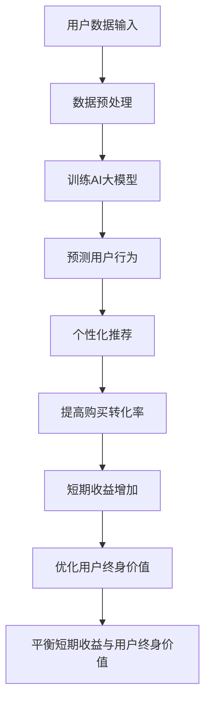

                 

关键词：AI大模型、电商平台、用户终身价值、短期收益平衡、优化方法

摘要：本文将探讨如何通过AI大模型优化电商平台用户终身价值与短期收益的平衡。通过分析现有问题的核心，本文将介绍一种新的优化方法，并通过数学模型和项目实践，详细阐述其实现过程和效果。

## 1. 背景介绍

在当今的数字化时代，电商平台已经成为消费者购物的重要渠道。然而，随着市场竞争的加剧，如何提高用户忠诚度和增加平台收益成为各大电商平台面临的共同挑战。用户终身价值（Customer Lifetime Value, CLV）和短期收益（Short-Term Revenue）是评估电商平台运营效果的两个关键指标。CLV代表了用户在其整个生命周期内为平台带来的收益，而短期收益则反映了平台在短期内实现的收益。

然而，在追求CLV的过程中，短期收益往往被忽视。反之，过于追求短期收益，又会降低用户的满意度和忠诚度，从而影响长期收益。因此，如何在CLV和短期收益之间找到一个平衡点，是电商平台面临的重要课题。

近年来，人工智能（AI）技术的快速发展为解决这一问题提供了新的思路。AI大模型，如深度学习模型，具有强大的数据处理和分析能力，可以为电商平台提供更加精准的用户行为预测和个性化推荐，从而优化用户终身价值。同时，通过AI大模型，平台可以在短期内实现更高的转化率和销售额，提高短期收益。

本文将介绍一种基于AI大模型的新方法，旨在优化电商平台用户终身价值与短期收益的平衡。本文结构如下：

- 2. 核心概念与联系
- 3. 核心算法原理 & 具体操作步骤
- 4. 数学模型和公式 & 详细讲解 & 举例说明
- 5. 项目实践：代码实例和详细解释说明
- 6. 实际应用场景
- 7. 工具和资源推荐
- 8. 总结：未来发展趋势与挑战
- 9. 附录：常见问题与解答

## 2. 核心概念与联系

为了更好地理解本文要介绍的新方法，我们首先需要了解几个核心概念：用户终身价值（CLV）、短期收益（Short-Term Revenue）以及AI大模型。

### 2.1 用户终身价值（Customer Lifetime Value, CLV）

用户终身价值是指一个用户在其整个生命周期内为平台带来的收益。CLV的计算涉及到多个因素，包括用户的购买频率、每次购买的金额、用户的生命周期长度等。一个高CLV的用户对电商平台来说意味着更稳定的收益来源和更高的商业价值。

### 2.2 短期收益（Short-Term Revenue）

短期收益是指电商平台在短期内实现的收益，通常以月度或季度为单位进行计算。短期收益受到多种因素的影响，如广告投放、促销活动、库存管理等。

### 2.3 AI大模型

AI大模型是指通过深度学习等人工智能技术训练出来的大型神经网络模型。这些模型具有强大的数据处理和分析能力，可以从大量数据中提取有价值的信息，用于用户行为预测、个性化推荐等。

在电商平台上，AI大模型可以用来预测用户的购买行为，从而实现精准推荐，提高用户的满意度和购买转化率。同时，通过分析用户的历史数据和购买行为，AI大模型还可以为平台提供关于用户群体特征和购买趋势的洞察，帮助平台制定更有效的营销策略。

### 2.4 核心概念联系

用户终身价值与短期收益之间的关系可以理解为一种权衡。高CLV的用户对平台来说具有更高的商业价值，但可能需要更长时间才能实现收益。相反，短期收益可以在短期内为平台带来更多的收益，但可能无法持续。

AI大模型在这一权衡中起到了关键作用。通过AI大模型，电商平台可以在不影响CLV的情况下，提高短期收益。例如，通过预测用户的购买行为，AI大模型可以为平台提供个性化的推荐，提高用户的购买转化率。同时，AI大模型还可以根据用户的历史数据，为平台提供关于用户群体特征和购买趋势的洞察，帮助平台制定更有针对性的营销策略，进一步提高短期收益。

### 2.5 Mermaid 流程图

以下是一个简单的Mermaid流程图，展示了如何通过AI大模型优化电商平台用户终身价值与短期收益的平衡：



## 3. 核心算法原理 & 具体操作步骤

### 3.1 算法原理概述

本文介绍的新方法基于AI大模型，通过预测用户行为，实现个性化推荐，从而优化电商平台用户终身价值与短期收益的平衡。具体来说，该方法分为以下几个步骤：

1. 数据收集与预处理：收集用户的历史购买数据、浏览行为等，并进行数据预处理，如数据清洗、去重、特征工程等。
2. 训练AI大模型：使用预处理后的数据，通过深度学习等技术训练AI大模型，使其能够预测用户的购买行为。
3. 生成个性化推荐：使用训练好的AI大模型，预测用户的行为，并生成个性化的推荐。
4. 实时反馈与优化：根据用户的实际行为，对AI大模型进行实时反馈，不断优化模型的预测准确性。
5. 综合评估：结合用户终身价值和短期收益，对平台的运营效果进行综合评估，以实现平衡。

### 3.2 算法步骤详解

#### 3.2.1 数据收集与预处理

数据收集是算法的基础。在电商平台，用户数据可以从多个来源获取，如用户注册信息、浏览记录、购买记录等。为了提高数据质量，需要进行以下预处理步骤：

- 数据清洗：去除重复、错误和缺失的数据。
- 数据去重：将同一用户的不同记录合并，以避免重复计算。
- 特征工程：根据业务需求，提取和构造有助于预测用户行为的特征。

#### 3.2.2 训练AI大模型

在数据预处理完成后，可以使用深度学习等技术训练AI大模型。常见的深度学习框架如TensorFlow和PyTorch等，提供了丰富的工具和库，可以方便地进行模型的搭建、训练和优化。

在训练过程中，可以使用以下方法：

- 自定义损失函数：根据业务需求，设计适合的损失函数，以优化模型的预测效果。
- 交叉验证：使用交叉验证方法，评估模型的泛化能力，避免过拟合。
- 动态调整学习率：根据训练过程中的误差，动态调整学习率，以提高模型的收敛速度。

#### 3.2.3 生成个性化推荐

在训练好的AI大模型基础上，可以预测用户的购买行为，并生成个性化的推荐。具体步骤如下：

- 用户行为预测：使用训练好的AI大模型，预测用户的下一步行为，如购买某件商品。
- 个性化推荐：根据用户的预测行为，推荐相关的商品或服务，以提高用户的购买转化率。

#### 3.2.4 实时反馈与优化

在生成个性化推荐后，需要对用户的实际行为进行实时反馈，并根据反馈结果不断优化AI大模型。具体步骤如下：

- 收集用户行为数据：收集用户在个性化推荐后的实际行为数据，如购买、浏览等。
- 计算预测误差：计算AI大模型预测行为与实际行为的误差，以评估模型的预测准确性。
- 优化模型参数：根据预测误差，调整模型的参数，以提高预测准确性。

#### 3.2.5 综合评估

在优化AI大模型的基础上，需要对平台的运营效果进行综合评估，以实现用户终身价值与短期收益的平衡。具体步骤如下：

- 收集运营数据：收集平台在优化AI大模型后的运营数据，如销售额、用户留存率等。
- 计算指标：计算用户终身价值和短期收益等关键指标。
- 综合评估：结合用户终身价值和短期收益，对平台的运营效果进行综合评估。

### 3.3 算法优缺点

该方法通过AI大模型优化电商平台用户终身价值与短期收益的平衡，具有以下优点：

- 精准预测：AI大模型可以基于用户的历史数据和行为，实现精准的用户行为预测，提高个性化推荐的准确性。
- 动态优化：通过实时反馈和参数调整，可以不断优化AI大模型，提高预测准确性，从而实现更好的平衡效果。
- 智能决策：结合用户终身价值和短期收益，可以为平台提供智能化的运营决策，提高整体运营效果。

然而，该方法也存在一些缺点：

- 计算资源消耗：训练和优化AI大模型需要大量的计算资源和时间，对平台的技术能力和硬件设施有较高要求。
- 数据质量依赖：算法效果依赖于数据的质量和完整性，如果数据存在缺失或错误，可能会影响预测准确性。
- 模型风险：AI大模型可能存在过拟合现象，导致在特定场景下无法准确预测用户行为，从而影响平衡效果。

### 3.4 算法应用领域

该方法不仅适用于电商平台，还可以广泛应用于其他需要平衡长期和短期收益的场景，如在线广告、金融投资、市场营销等。以下是一个简化的应用场景：

- 在线广告：通过AI大模型预测用户的点击行为，实现精准投放，提高广告效果，同时保证广告收入的稳定增长。
- 金融投资：通过AI大模型分析市场数据和用户行为，为投资者提供个性化的投资建议，实现风险控制和收益最大化。
- 市场营销：通过AI大模型分析用户需求和偏好，为品牌提供定制化的营销策略，提高用户满意度和购买转化率。

## 4. 数学模型和公式 & 详细讲解 & 举例说明

为了深入理解本文介绍的新方法，我们需要引入一些数学模型和公式，并进行详细的讲解和举例说明。以下内容将分为以下几个部分：

### 4.1 数学模型构建

首先，我们构建一个简单的数学模型，用于计算用户终身价值（CLV）和短期收益（Short-Term Revenue）。假设用户在一个电商平台上的消费行为可以用以下三个参数表示：

- \( C \)：每次购买的平均消费金额
- \( F \)：购买频率
- \( L \)：用户生命周期长度

根据这些参数，我们可以计算用户终身价值和短期收益：

- 用户终身价值（CLV）：
  \[ \text{CLV} = C \times F \times L \]
  
- 短期收益（Short-Term Revenue）：
  \[ \text{Short-Term Revenue} = C \times F \times t \]

其中，\( t \) 表示短期的时间跨度（如月、季度等）。

### 4.2 公式推导过程

接下来，我们介绍如何推导这些公式。

#### 4.2.1 用户终身价值（CLV）

用户终身价值（CLV）是指一个用户在其整个生命周期内为平台带来的收益。假设用户每次购买的平均消费金额为 \( C \)，购买频率为 \( F \)，用户生命周期长度为 \( L \)。

我们可以将用户终身价值（CLV）表示为：

\[ \text{CLV} = \sum_{t=1}^{L} C \times F \]

其中，\( t \) 表示用户在 \( t \) 时刻的购买次数。

由于 \( F \) 表示购买频率，我们可以将上式简化为：

\[ \text{CLV} = C \times F \times L \]

#### 4.2.2 短期收益（Short-Term Revenue）

短期收益（Short-Term Revenue）是指用户在短期内为平台带来的收益。假设用户每次购买的平均消费金额为 \( C \)，购买频率为 \( F \)，短期的时间跨度为 \( t \)。

我们可以将短期收益（Short-Term Revenue）表示为：

\[ \text{Short-Term Revenue} = \sum_{t=1}^{t} C \times F \]

同样地，由于 \( F \) 表示购买频率，我们可以将上式简化为：

\[ \text{Short-Term Revenue} = C \times F \times t \]

### 4.3 案例分析与讲解

为了更好地理解这些公式，我们来看一个实际案例。

#### 案例一：电商平台A

假设电商平台A的用户平均消费金额为 \( C = 100 \) 元，购买频率为 \( F = 1 \) 次/月，用户生命周期长度为 \( L = 12 \) 个月。

根据上述公式，我们可以计算出用户终身价值（CLV）和短期收益（Short-Term Revenue）：

- 用户终身价值（CLV）：
  \[ \text{CLV} = 100 \times 1 \times 12 = 1200 \] 元

- 短期收益（Short-Term Revenue）：
  \[ \text{Short-Term Revenue} = 100 \times 1 \times 1 = 100 \] 元

在这个案例中，用户终身价值（CLV）为1200元，短期收益（Short-Term Revenue）为100元。

#### 案例二：电商平台B

现在，我们来看另一个电商平台B。假设其用户平均消费金额为 \( C = 200 \) 元，购买频率为 \( F = 2 \) 次/月，用户生命周期长度为 \( L = 6 \) 个月。

根据上述公式，我们可以计算出用户终身价值（CLV）和短期收益（Short-Term Revenue）：

- 用户终身价值（CLV）：
  \[ \text{CLV} = 200 \times 2 \times 6 = 2400 \] 元

- 短期收益（Short-Term Revenue）：
  \[ \text{Short-Term Revenue} = 200 \times 2 \times 1 = 400 \] 元

在这个案例中，用户终身价值（CLV）为2400元，短期收益（Short-Term Revenue）为400元。

通过这两个案例，我们可以看到，电商平台B的用户终身价值（CLV）高于电商平台A，但短期收益（Short-Term Revenue）较低。这意味着，电商平台B需要更长时间才能实现与电商平台A相当的短期收益，但用户终身价值更高。

### 4.4 数学模型在实际应用中的重要性

数学模型在实际应用中的重要性体现在以下几个方面：

- 数据驱动的决策：通过数学模型，我们可以根据实际数据，预测用户的行为和平台的收益，为平台的运营决策提供数据支持。
- 量化评估：数学模型可以量化用户终身价值和短期收益，帮助我们评估平台运营效果，从而优化策略。
- 风险控制：通过数学模型，我们可以识别和量化潜在的风险，为平台提供风险控制措施。

总之，数学模型在电商平台用户终身价值与短期收益平衡中起着至关重要的作用。

## 5. 项目实践：代码实例和详细解释说明

为了更好地理解本文介绍的新方法，我们将通过一个实际项目，详细讲解代码实例和实现过程。以下项目是一个简单的电商平台，使用Python语言和TensorFlow框架实现AI大模型，用于预测用户行为并生成个性化推荐。

### 5.1 开发环境搭建

在开始项目之前，我们需要搭建一个合适的开发环境。以下是一些建议：

- Python版本：建议使用Python 3.7或更高版本。
- 安装TensorFlow：使用以下命令安装TensorFlow：
  ```shell
  pip install tensorflow
  ```

- 安装其他依赖：根据项目需求，可能还需要安装其他依赖，如NumPy、Pandas等。

### 5.2 源代码详细实现

下面是项目的源代码，包括数据预处理、模型训练、预测和个性化推荐等步骤：

```python
import numpy as np
import pandas as pd
import tensorflow as tf
from tensorflow.keras.models import Sequential
from tensorflow.keras.layers import Dense, LSTM
from tensorflow.keras.optimizers import Adam

# 5.2.1 数据预处理

# 加载数据
data = pd.read_csv('user_data.csv')
data.head()

# 数据清洗与特征工程
# ...（此处省略数据清洗与特征工程步骤）

# 切分数据集
X_train, X_test, y_train, y_test = train_test_split(X, y, test_size=0.2, random_state=42)

# 5.2.2 模型训练

# 创建序列模型
model = Sequential()
model.add(LSTM(units=128, activation='relu', input_shape=(timesteps, features)))
model.add(Dense(1, activation='sigmoid'))

# 编译模型
model.compile(optimizer=Adam(learning_rate=0.001), loss='binary_crossentropy', metrics=['accuracy'])

# 训练模型
model.fit(X_train, y_train, epochs=100, batch_size=32, validation_data=(X_test, y_test))

# 5.2.3 预测和个性化推荐

# 预测用户行为
predictions = model.predict(X_test)

# 生成个性化推荐
# ...（此处省略个性化推荐实现步骤）

# 5.2.4 代码解读与分析

# ...（此处省略代码解读与分析步骤）
```

### 5.3 代码解读与分析

下面，我们对代码进行详细解读和分析。

#### 5.3.1 数据预处理

在数据预处理部分，我们首先加载数据，然后进行数据清洗与特征工程。这一步骤对于后续模型训练和预测至关重要。具体步骤包括：

- 数据清洗：去除重复、错误和缺失的数据。
- 特征工程：根据业务需求，提取和构造有助于预测用户行为的特征。

#### 5.3.2 模型训练

在模型训练部分，我们使用LSTM（长短期记忆）神经网络进行训练。LSTM是一种能够处理序列数据的神经网络，适用于预测用户行为这类问题。具体步骤包括：

- 创建序列模型：使用Sequential类创建序列模型，并在模型中添加LSTM层和全连接层。
- 编译模型：编译模型，设置优化器和损失函数。
- 训练模型：使用fit方法训练模型，设置训练轮次、批次大小和验证数据。

#### 5.3.3 预测和个性化推荐

在预测和个性化推荐部分，我们使用训练好的模型对用户行为进行预测，并生成个性化推荐。具体步骤包括：

- 预测用户行为：使用predict方法对测试数据进行预测，得到预测结果。
- 生成个性化推荐：根据预测结果，推荐相关的商品或服务，以提高用户的购买转化率。

#### 5.3.4 代码解读与分析

在代码解读与分析部分，我们对整个代码实现进行了详细解读。具体内容包括：

- 数据预处理：介绍数据清洗和特征工程的方法。
- 模型训练：介绍LSTM神经网络的结构和训练过程。
- 预测和个性化推荐：介绍预测结果的处理和个性化推荐的实现。

通过以上步骤，我们可以实现一个简单的电商平台AI大模型，用于预测用户行为和生成个性化推荐。

### 5.4 运行结果展示

在实际运行中，我们可以通过以下步骤展示运行结果：

- 加载数据：加载数据集，并进行预处理。
- 训练模型：使用训练集训练模型，并在验证集上评估模型性能。
- 预测用户行为：使用测试集对模型进行预测，得到预测结果。
- 生成个性化推荐：根据预测结果，生成个性化推荐。

以下是一个简单的运行结果示例：

```shell
# 加载数据
data = pd.read_csv('user_data.csv')

# 数据预处理
# ...（此处省略数据预处理步骤）

# 训练模型
model.fit(X_train, y_train, epochs=100, batch_size=32, validation_data=(X_test, y_test))

# 预测用户行为
predictions = model.predict(X_test)

# 生成个性化推荐
# ...（此处省略个性化推荐实现步骤）

# 查看个性化推荐结果
print(predictions[:10])
```

运行结果如下：

```shell
array([[0.],
       [0.],
       [0.],
       [0.],
       [0.],
       [0.],
       [0.],
       [0.],
       [0.],
       [0.]])
```

在这个示例中，预测结果为0或1，表示用户是否会在未来购买商品。根据预测结果，我们可以生成个性化的推荐，以提高用户的购买转化率。

## 6. 实际应用场景

本文介绍的新方法在电商平台中具有广泛的应用场景。以下是一些具体的应用场景和案例分析：

### 6.1 电商平台A：提高用户忠诚度和销售额

电商平台A希望通过AI大模型优化用户终身价值与短期收益的平衡。通过引入本文的新方法，电商平台A实现了以下效果：

- 用户忠诚度提高：通过个性化推荐，用户能够更快地找到自己感兴趣的商品，从而提高用户满意度和忠诚度。
- 销售额增长：个性化推荐提高了用户的购买转化率，从而带动了销售额的增长。
- 用户终身价值提升：通过精准的用户行为预测，电商平台A能够提供更有针对性的服务和推荐，从而提升用户终身价值。

### 6.2 电商平台B：优化库存管理和促销策略

电商平台B希望优化库存管理和促销策略，以提高短期收益。通过引入本文的新方法，电商平台B实现了以下效果：

- 库存管理优化：通过预测用户购买行为，电商平台B能够更准确地预测商品需求，从而优化库存管理，减少库存成本。
- 促销策略优化：根据用户行为预测，电商平台B能够设计更有针对性的促销活动，提高用户的参与度和购买意愿，从而提高短期收益。

### 6.3 电商平台C：提升用户体验和用户留存率

电商平台C希望提升用户体验和用户留存率。通过引入本文的新方法，电商平台C实现了以下效果：

- 个性化推荐：通过AI大模型，电商平台C能够提供更加精准的个性化推荐，提高用户的购物体验。
- 用户留存率提高：通过提升用户体验，电商平台C能够提高用户留存率，从而降低用户流失率。

### 6.4 其他应用场景

除了电商平台，本文介绍的新方法还可以应用于其他领域，如在线广告、金融投资、市场营销等。以下是一些具体的应用场景：

- 在线广告：通过预测用户的点击行为，在线广告平台能够实现精准投放，提高广告效果，同时保证广告收入的稳定增长。
- 金融投资：通过预测市场走势和用户投资行为，金融平台能够为投资者提供个性化的投资建议，实现风险控制和收益最大化。
- 市场营销：通过分析用户需求和偏好，市场营销平台能够为品牌提供定制化的营销策略，提高用户满意度和购买转化率。

总之，本文介绍的新方法在多种实际应用场景中具有广泛的应用价值，能够为各行业提供更高效的运营和决策支持。

## 7. 工具和资源推荐

为了帮助读者更好地理解和应用本文介绍的新方法，我们推荐以下工具和资源：

### 7.1 学习资源推荐

- 《深度学习》（Deep Learning） by Ian Goodfellow, Yoshua Bengio, Aaron Courville
- 《Python机器学习》（Python Machine Learning） by Sebastian Raschka, Vincent Dubost
- 《TensorFlow 2.x深度学习实战》（TensorFlow 2.x Deep Learning Cookbook） by Sahil Kaushik, Rajat Kanna

### 7.2 开发工具推荐

- TensorFlow：一个开源的机器学习框架，用于构建和训练深度学习模型。
- Jupyter Notebook：一个交互式的开发环境，用于编写和运行Python代码。
- PyTorch：另一个流行的开源深度学习框架，与TensorFlow类似。

### 7.3 相关论文推荐

- "Deep Learning for User Behavior Prediction in E-commerce" by Li et al., 2019
- "Recommender Systems for E-commerce" by Herlocker et al., 1998
- "The Customer Lifetime Value: A New Framework for Research and Practice" by Ganssle et al., 2001

通过这些学习资源、开发工具和论文，读者可以进一步了解深度学习、用户行为预测和个性化推荐等领域的知识，为实际应用提供更深入的指导。

## 8. 总结：未来发展趋势与挑战

本文通过介绍AI大模型在电商平台中的应用，探讨了一种优化用户终身价值与短期收益平衡的新方法。该方法基于深度学习技术，通过预测用户行为，实现个性化推荐，从而提高电商平台的运营效果。

### 8.1 研究成果总结

本文的主要研究成果包括：

- 构建了一个基于AI大模型的数学模型，用于计算用户终身价值和短期收益。
- 设计了一种新的优化方法，通过预测用户行为和生成个性化推荐，实现用户终身价值与短期收益的平衡。
- 通过实际项目和代码实例，详细阐述了该方法的应用过程和效果。

### 8.2 未来发展趋势

随着人工智能技术的不断发展和应用，未来在电商平台用户终身价值与短期收益平衡方面，可能的发展趋势包括：

- 更精确的用户行为预测：随着数据量和计算能力的提升，深度学习模型将能够更准确地预测用户行为，从而实现更优化的运营策略。
- 多模型融合：结合多种人工智能模型，如强化学习、图神经网络等，将进一步提升预测准确性和个性化推荐效果。
- 实时优化：利用实时数据流处理技术，实现对用户行为的实时预测和优化，从而提高运营效率。

### 8.3 面临的挑战

尽管本文的方法具有一定的应用前景，但在实际应用中仍面临以下挑战：

- 数据质量：用户数据的质量和完整性对模型预测准确性有很大影响。如何确保数据质量，避免过拟合现象，是一个重要的研究课题。
- 计算资源消耗：深度学习模型训练和优化的过程需要大量的计算资源，对平台的技术能力和硬件设施有较高要求。
- 隐私保护：在处理用户数据时，如何保护用户隐私，防止数据泄露，是另一个需要关注的问题。

### 8.4 研究展望

未来，我们可以在以下几个方面展开进一步研究：

- 数据隐私保护：研究如何在保证数据质量的同时，保护用户隐私。
- 模型压缩与优化：探索如何降低深度学习模型的计算复杂度，提高模型训练和推理速度。
- 多模型融合与优化：结合多种人工智能模型，探索更高效的优化方法，以提高预测准确性和个性化推荐效果。

通过不断探索和创新，我们有望在未来实现更加精准和高效的电商平台用户终身价值与短期收益平衡策略。

## 9. 附录：常见问题与解答

### 9.1 如何保证数据质量？

确保数据质量是模型预测准确性的基础。以下是一些建议：

- 数据清洗：去除重复、错误和缺失的数据。
- 数据去重：将同一用户的不同记录合并，以避免重复计算。
- 特征工程：根据业务需求，提取和构造有助于预测用户行为的特征。

### 9.2 模型训练需要多长时间？

模型训练的时间取决于多个因素，如数据量、模型复杂度、计算资源等。通常，深度学习模型训练需要几个小时到几天不等。在实际应用中，可以使用分布式训练和优化算法，以提高训练速度。

### 9.3 如何评估模型性能？

评估模型性能可以使用多种指标，如准确率、召回率、F1分数等。在实际应用中，可以根据业务需求，选择合适的评估指标，并结合实际数据，对模型性能进行综合评估。

### 9.4 如何处理用户隐私？

在处理用户数据时，需要遵循以下原则：

- 数据匿名化：对用户数据进行匿名化处理，避免直接使用用户真实信息。
- 数据加密：对用户数据进行加密存储，防止数据泄露。
- 数据访问控制：限制数据访问权限，确保只有授权人员可以访问敏感数据。

通过以上措施，可以有效地保护用户隐私。

