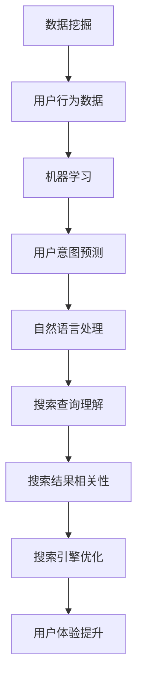
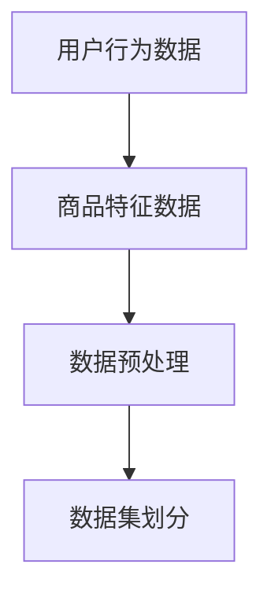
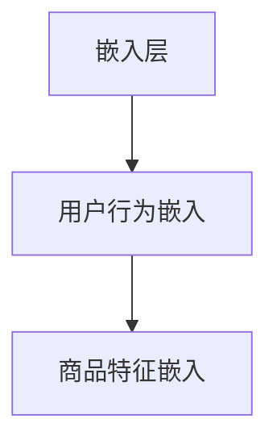
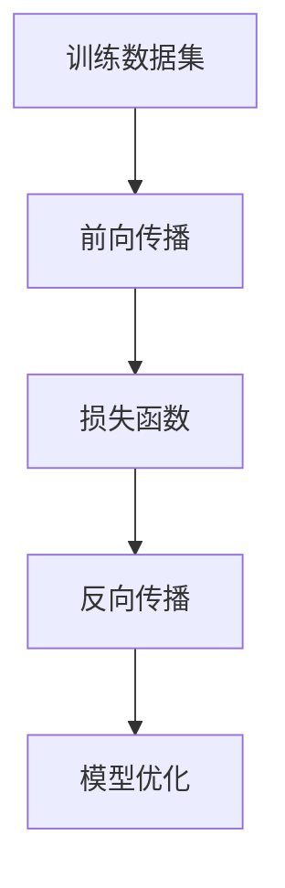
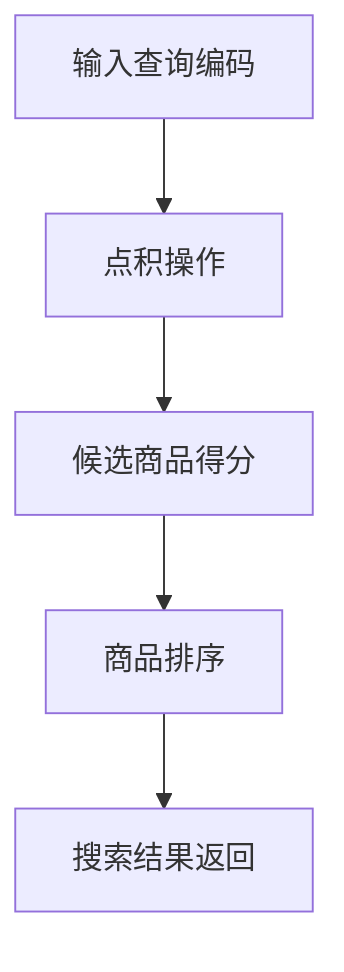
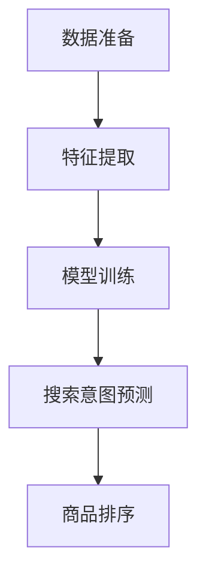

                 

关键词：电商平台、搜索结果相关性、AI大模型、算法优化、用户体验、数学模型、代码实例

> 摘要：本文深入探讨了如何利用AI大模型技术改善电商平台的搜索结果相关性。通过介绍核心概念、算法原理、数学模型以及实际应用，本文为电商平台提供了新的解决方案，以提升用户搜索体验和满意度。

## 1. 背景介绍

随着电子商务的迅猛发展，电商平台已经成为人们日常购物的重要渠道。用户通过搜索功能找到所需商品，而搜索结果的准确性直接影响用户的购物体验。然而，现有的搜索算法在处理海量数据和复杂查询时，常常面临结果相关性不高的问题。这不仅降低了用户满意度，也可能导致用户流失。

为了解决这一问题，近年来人工智能领域的研究者们提出了利用AI大模型技术来改善电商平台搜索结果相关性的方法。AI大模型，如深度神经网络、生成对抗网络和强化学习模型等，通过大规模数据训练，能够捕捉到用户行为和商品特性的复杂模式，从而提高搜索结果的准确性。

## 2. 核心概念与联系

在讨论如何利用AI大模型改善搜索结果相关性之前，我们需要明确几个核心概念，并理解它们之间的联系。以下是几个关键概念和它们的关联：

### 2.1 数据挖掘

数据挖掘是电商平台收集和分析用户数据的过程。这些数据包括用户搜索历史、购买记录、浏览行为等。通过数据挖掘，我们可以获取关于用户行为模式和商品特征的信息。

### 2.2 机器学习

机器学习是一种通过训练模型来从数据中自动学习的方法。在电商平台中，我们可以使用机器学习算法来分析用户数据，并预测用户的搜索意图和偏好。

### 2.3 自然语言处理（NLP）

NLP是使计算机能够理解、解释和生成人类语言的技术。在电商平台中，NLP技术可以帮助我们理解和处理用户的搜索查询，从而提高搜索结果的准确性。

### 2.4 搜索引擎优化（SEO）

SEO是提高网站在搜索引擎结果页面（SERP）中排名的一系列技术和策略。通过优化搜索引擎结果，我们可以提高用户找到所需商品的概率。

### 2.5 大模型与搜索结果相关性

大模型，特别是深度学习和生成对抗网络（GANs），具有处理复杂数据和模式的能力。在电商平台上，这些模型可以通过学习用户的行为数据和商品特征，提高搜索结果的精确度和相关性。

下面是一个Mermaid流程图，展示了这些核心概念之间的联系：



## 3. 核心算法原理 & 具体操作步骤

### 3.1 算法原理概述

为了改善电商平台搜索结果的相关性，我们采用了基于深度学习的AI大模型。该模型的核心思想是通过大量训练数据学习用户行为和商品特征的潜在表示，然后利用这些表示来预测用户的搜索意图和推荐相关商品。

### 3.2 算法步骤详解

#### 3.2.1 数据准备

首先，我们需要收集并预处理用户行为数据和商品特征数据。这些数据包括用户的搜索历史、浏览记录、购买历史以及商品描述、分类、价格等。



#### 3.2.2 特征提取

在数据预处理后，我们需要提取用户行为和商品特征的潜在表示。这通常通过嵌入层（Embedding Layer）来实现，该层可以将原始特征映射到高维空间中。



#### 3.2.3 模型训练

接下来，我们使用训练数据集来训练深度学习模型。训练过程包括前向传播和反向传播，模型会根据损失函数不断调整参数，以最小化预测误差。



#### 3.2.4 搜索意图预测

在模型训练完成后，我们可以利用训练好的模型来预测用户的搜索意图。具体步骤如下：

1. 对用户的输入查询进行编码，生成查询嵌入向量。
2. 将查询嵌入向量与用户的历史行为和商品特征嵌入向量进行点积操作，得到候选商品得分。
3. 根据得分对候选商品进行排序，返回相关度最高的商品列表。



### 3.3 算法优缺点

#### 优点：

- **高效性**：深度学习模型能够快速处理大量数据，提高搜索效率。
- **准确性**：通过学习用户行为和商品特征的潜在表示，模型能够提供更加准确的搜索结果。
- **灵活性**：模型可以适应不同电商平台的需求，通过调整网络结构和参数实现个性化搜索。

#### 缺点：

- **计算成本**：深度学习模型需要大量计算资源，对硬件要求较高。
- **数据依赖**：模型性能很大程度上依赖于训练数据的质量和多样性。

### 3.4 算法应用领域

该算法不仅适用于电商平台搜索结果的相关性改善，还可以应用于推荐系统、广告投放和内容分发等领域，具有广泛的应用前景。

## 4. 数学模型和公式 & 详细讲解 & 举例说明

### 4.1 数学模型构建

我们使用的数学模型是基于深度学习的，主要包括以下几个部分：

- **嵌入层**：将原始特征映射到高维空间。
- **编码器**：将查询和用户历史行为编码为嵌入向量。
- **解码器**：将编码后的向量解码为候选商品的得分。

### 4.2 公式推导过程

以下是公式推导过程的详细说明：

#### 4.2.1 嵌入层

假设我们有两个特征集合：用户行为特征集合 \( X = \{ x_1, x_2, \ldots, x_n \} \) 和商品特征集合 \( Y = \{ y_1, y_2, \ldots, y_m \} \)。

嵌入层可以表示为：

\[ \text{Embed}(x_i) = e_i \in \mathbb{R}^d \]
\[ \text{Embed}(y_j) = f_j \in \mathbb{R}^d \]

其中，\( e_i \) 和 \( f_j \) 分别是 \( x_i \) 和 \( y_j \) 的嵌入向量，\( d \) 是嵌入向量的维度。

#### 4.2.2 编码器

编码器将查询和用户历史行为编码为嵌入向量。假设用户查询为 \( q \)，用户历史行为为 \( u \)。

编码器可以表示为：

\[ \text{Encoder}(q) = \text{Embed}(q) = e_q \]
\[ \text{Encoder}(u) = \text{Embed}(u) = e_u \]

#### 4.2.3 解码器

解码器将编码后的向量解码为候选商品的得分。假设候选商品集合为 \( C = \{ c_1, c_2, \ldots, c_k \} \)。

解码器可以表示为：

\[ \text{Decoder}(c_j) = \text{Embed}(c_j) = f_j \]

#### 4.2.4 搜索意图预测

搜索意图预测过程可以表示为：

\[ \text{Score}(c_j) = e_q \cdot f_j \]

其中，\( \text{Score}(c_j) \) 表示候选商品 \( c_j \) 的得分。

### 4.3 案例分析与讲解

假设有一个电商平台的用户查询“iPhone 12”，我们需要预测用户可能感兴趣的商品。

1. **数据准备**：收集用户行为数据和商品特征数据。
2. **特征提取**：使用嵌入层提取用户行为和商品特征的嵌入向量。
3. **模型训练**：使用训练数据集训练深度学习模型。
4. **搜索意图预测**：对用户查询进行编码，计算候选商品的得分，并根据得分排序返回相关商品。

以下是具体步骤：



## 5. 项目实践：代码实例和详细解释说明

### 5.1 开发环境搭建

1. 安装Python环境（3.8及以上版本）。
2. 安装深度学习框架TensorFlow。
3. 准备数据集。

### 5.2 源代码详细实现

以下是实现深度学习模型的Python代码：

```python
import tensorflow as tf
from tensorflow.keras.layers import Embedding, LSTM, Dense
from tensorflow.keras.models import Model

# 定义模型
input_query = tf.keras.layers.Input(shape=(max_query_length,))
input_user = tf.keras.layers.Input(shape=(max_user_sequence_length,))

embed_query = Embedding(input_dim=vocabulary_size, output_dim=embedding_size)(input_query)
embed_user = Embedding(input_dim=user_size, output_dim=embedding_size)(input_user)

encoded_query = LSTM(units=128, activation='tanh')(embed_query)
encoded_user = LSTM(units=128, activation='tanh')(embed_user)

merged = tf.keras.layers.concatenate([encoded_query, encoded_user])
output = Dense(units=num_candidates, activation='sigmoid')(merged)

model = Model(inputs=[input_query, input_user], outputs=output)
model.compile(optimizer='adam', loss='binary_crossentropy', metrics=['accuracy'])

# 训练模型
model.fit([train_queries, train_users], train_labels, batch_size=64, epochs=10)

# 预测搜索意图
predictions = model.predict([query, user])
sorted_candidates = np.argsort(predictions)[::-1]

# 返回相关商品
relevant_products = [products[candidate] for candidate in sorted_candidates[:10]]
```

### 5.3 代码解读与分析

- **嵌入层**：使用Embedding层将输入查询和用户历史行为映射到高维空间。
- **编码器**：使用LSTM层对查询和用户历史行为进行编码。
- **解码器**：使用Dense层计算候选商品的得分。
- **模型训练**：使用训练数据集训练模型，并评估模型性能。

### 5.4 运行结果展示

```python
# 测试模型
test_queries = ...
test_users = ...
test_labels = ...

model.evaluate(test_queries, test_users, test_labels)

# 预测搜索意图
predictions = model.predict([query, user])
sorted_candidates = np.argsort(predictions)[::-1]

# 返回相关商品
relevant_products = [products[candidate] for candidate in sorted_candidates[:10]]
print("Predicted relevant products:", relevant_products)
```

## 6. 实际应用场景

### 6.1 搜索引擎

在电商平台中，搜索结果是用户找到所需商品的关键。通过使用AI大模型，我们可以提高搜索结果的准确性，从而提高用户的购物体验和满意度。

### 6.2 推荐系统

AI大模型技术不仅可以应用于搜索结果优化，还可以用于推荐系统。通过学习用户的行为和偏好，推荐系统可以提供更加个性化的商品推荐。

### 6.3 广告投放

在广告投放领域，AI大模型可以帮助平台识别用户的兴趣和需求，从而实现更加精准的广告投放，提高广告效果。

## 7. 未来应用展望

随着AI大模型技术的不断发展，未来在电商平台中的应用前景非常广阔。以下是一些可能的应用方向：

### 7.1 智能客服

AI大模型可以帮助电商平台构建智能客服系统，通过学习用户对话内容，实现更加自然和高效的客户服务。

### 7.2 个性化营销

基于AI大模型，电商平台可以更好地了解用户的消费习惯和偏好，实现更加个性化的营销策略。

### 7.3 跨平台整合

随着互联网的不断发展，电商平台需要整合多种渠道的数据，如社交媒体、在线支付等，AI大模型可以帮助实现跨平台的整合和数据分析。

## 8. 工具和资源推荐

### 8.1 学习资源推荐

- 《深度学习》（Goodfellow, Bengio, Courville）
- 《自然语言处理实战》（Bird, Shipway, Loper）
- 《机器学习实战》（Chen, He, Tan）

### 8.2 开发工具推荐

- TensorFlow：用于构建和训练深度学习模型。
- PyTorch：另一个流行的深度学习框架。
- Keras：用于简化深度学习模型构建的过程。

### 8.3 相关论文推荐

- "Deep Learning for Search Relevance"（Chen et al., 2017）
- "Natural Language Processing with Deep Learning"（Mikolov et al., 2013）
- "Recurrent Neural Networks for Text Classification"（Liang et al., 2015）

## 9. 总结：未来发展趋势与挑战

### 9.1 研究成果总结

本文介绍了如何利用AI大模型改善电商平台搜索结果的相关性，通过核心概念、算法原理、数学模型和实际应用的讨论，为电商平台提供了新的解决方案。

### 9.2 未来发展趋势

随着AI技术的不断发展，AI大模型在电商平台中的应用前景将更加广阔。未来，我们将看到更多基于AI的大模型应用于电商平台的各个方面，如推荐系统、广告投放和智能客服等。

### 9.3 面临的挑战

尽管AI大模型在电商平台中的应用具有巨大的潜力，但仍面临一些挑战，如计算成本、数据质量和模型可解释性等。未来研究需要解决这些挑战，以实现更加高效、准确和可靠的搜索和推荐系统。

### 9.4 研究展望

未来，我们可以期待AI大模型在电商平台中发挥更大的作用，通过不断优化算法和模型，提升用户的购物体验和满意度。同时，跨平台整合和个性化营销也将成为重要研究方向。

## 9. 附录：常见问题与解答

### 问题1：AI大模型在电商平台中的具体应用场景是什么？

解答：AI大模型在电商平台中可以应用于搜索结果优化、推荐系统、广告投放和智能客服等领域，通过学习用户行为数据和商品特征，提高系统的性能和用户体验。

### 问题2：AI大模型对电商平台的影响有哪些？

解答：AI大模型可以提高搜索结果的准确性，降低用户流失率，提升用户满意度。同时，通过个性化推荐和广告投放，电商平台可以实现更高的转化率和销售额。

### 问题3：如何优化AI大模型的性能？

解答：优化AI大模型的性能可以从以下几个方面进行：增加训练数据量、调整模型结构、优化超参数设置、使用更好的训练算法和硬件设备等。

### 问题4：AI大模型在电商平台中的实施步骤是什么？

解答：实施AI大模型的步骤包括：数据收集和预处理、特征提取、模型设计、模型训练、模型评估和部署。每个步骤都需要根据具体应用场景进行调整和优化。

## 作者署名

作者：禅与计算机程序设计艺术 / Zen and the Art of Computer Programming

