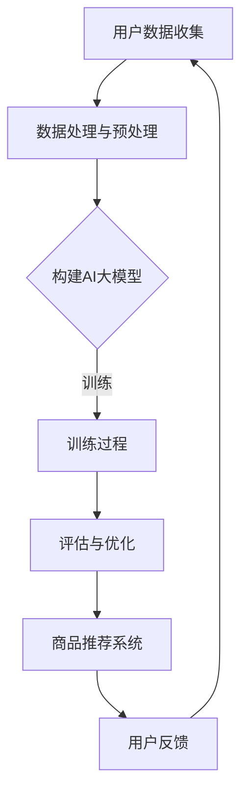

                 

 关键词：
- 电商平台
- 长尾商品
- AI大模型
- 商品推荐
- 数据挖掘

> 摘要：
随着电商平台的迅速发展，如何更好地发现和推荐长尾商品成为了关键问题。本文将探讨AI大模型在改善电商平台长尾商品发现方面的应用，通过对其核心概念、算法原理、数学模型和项目实践的深入分析，为电商领域提供新的思路和方法。

## 1. 背景介绍

在过去的几十年中，电商平台作为电子商务的重要形式，得到了飞速的发展。从早期的亚马逊、eBay，到国内的淘宝、京东等，电商平台已经成为了人们日常生活中不可或缺的一部分。然而，随着市场竞争的日益激烈，电商平台需要面对的一个重大挑战是如何更好地发现和推荐商品，从而提升用户体验，增加销售额。

在电商平台中，商品可以分为两类：热销商品和长尾商品。热销商品指的是那些市场需求量大、销售频次高的商品，而长尾商品则是指那些市场需求较小、销售频次低的商品。尽管长尾商品在单个商品上的销售额较低，但它们占据了电商平台的大量库存，并且其总销售额不容忽视。

然而，传统的商品推荐算法往往更注重对热销商品进行推荐，而忽视了长尾商品。这主要是因为长尾商品的数据量相对较小，且分布不均，导致推荐算法难以从中提取有效信息。因此，如何利用先进的技术手段来发现和推荐长尾商品，成为了一个亟待解决的问题。

近年来，人工智能特别是AI大模型的发展为电商平台的长尾商品发现提供了新的思路。AI大模型能够处理大规模、多维度的数据，通过深度学习等方法挖掘出隐藏在数据背后的规律，从而实现更精准的商品推荐。本文将围绕这一主题，深入探讨AI大模型在电商平台长尾商品发现中的应用。

## 2. 核心概念与联系

### 2.1 AI大模型的基本概念

AI大模型，即大规模人工智能模型，通常指的是参数量达到亿级甚至更高的深度神经网络模型。这些模型通过在大量数据上训练，能够自动学习并提取复杂的数据特征，从而实现强大的预测和分类能力。

AI大模型的主要组成部分包括：

- **输入层**：接收各种形式的数据输入，如图像、文本、音频等。
- **隐藏层**：多层神经网络结构，用于处理和变换输入数据。
- **输出层**：根据训练目标产生相应的输出，如分类标签、预测值等。

### 2.2 AI大模型与长尾商品发现的联系

在电商平台上，长尾商品发现的核心问题是如何从大量低频次、多样化的商品中识别出潜在的高价值商品。AI大模型在这方面具有显著的优势：

- **大规模数据处理**：AI大模型能够处理海量商品数据，从细微的购买行为和用户评价中提取有用信息。
- **特征提取能力**：通过深度学习，AI大模型能够自动学习商品的多维特征，如价格、品牌、用户评价、销售记录等，并将其抽象为高维特征空间。
- **用户行为预测**：AI大模型可以预测用户的购买偏好和兴趣，从而为长尾商品提供精准的推荐。

### 2.3 Mermaid流程图展示



在这个流程图中，用户数据收集是整个过程的起点，通过数据处理与预处理，构建AI大模型，然后进行训练和评估，最终形成商品推荐系统，并通过用户反馈进行迭代优化。

## 3. 核心算法原理 & 具体操作步骤

### 3.1 算法原理概述

AI大模型在长尾商品发现中的核心算法通常是基于深度学习的推荐算法，如基于图神经网络的推荐算法、基于生成对抗网络的推荐算法等。以下将以图神经网络（Graph Neural Network, GNN）为例，介绍其基本原理。

**图神经网络（GNN）**：

- **输入**：商品图（商品及其属性、用户购买行为等）和用户特征。
- **隐藏层**：通过学习节点间的关系来表示节点（商品或用户）的嵌入向量。
- **输出**：根据用户特征和商品嵌入向量预测用户对商品的喜好程度。

### 3.2 算法步骤详解

**步骤1：数据收集与预处理**

- **数据收集**：从电商平台获取用户购买数据、商品信息、用户评价等。
- **数据预处理**：清洗数据、处理缺失值、标准化特征等。

**步骤2：构建商品图**

- **节点**：每个商品作为一个节点，包含其属性（如分类、价格、品牌等）。
- **边**：用户购买行为作为边，连接用户节点和商品节点。

**步骤3：训练GNN模型**

- **嵌入层**：将商品和用户特征映射到低维空间。
- **图卷积层**：学习节点间的关系，更新节点的嵌入向量。
- **输出层**：预测用户对商品的喜好程度。

**步骤4：模型评估与优化**

- **评估指标**：如准确率、召回率、F1值等。
- **优化方法**：通过调整超参数、增加训练数据等方式优化模型。

### 3.3 算法优缺点

**优点**：

- **强大的特征提取能力**：能够从复杂的多维度数据中提取有效特征。
- **自适应学习**：能够根据用户行为和偏好动态调整推荐策略。

**缺点**：

- **计算复杂度高**：训练和推理过程需要大量计算资源。
- **数据依赖性强**：模型效果依赖于数据的完整性和质量。

### 3.4 算法应用领域

- **电商平台**：推荐长尾商品，提升用户满意度和销售额。
- **社交媒体**：个性化内容推荐，增加用户参与度。
- **金融行业**：风险评估和投资组合优化。

## 4. 数学模型和公式 & 详细讲解 & 举例说明

### 4.1 数学模型构建

在AI大模型中，推荐系统的核心是学习用户和商品之间的交互关系。以下是基于图神经网络的推荐系统的数学模型构建：

- **用户嵌入向量**：\( u_i = \text{Embed}(u_i) \)
- **商品嵌入向量**：\( g_j = \text{Embed}(g_j) \)
- **用户与商品的交互表示**：\( r_{ij} = \text{Score}(u_i, g_j) \)

其中，\( \text{Embed} \) 表示嵌入层函数，\( \text{Score} \) 表示评分函数。

### 4.2 公式推导过程

**步骤1：构建图神经网络**

- **输入层**：用户特征和商品特征。
- **嵌入层**：将用户特征和商品特征映射到低维空间。
  $$ u_i = \text{Embed}(u_i) = \text{ReLU}(W_u u_i + b_u) $$
  $$ g_j = \text{Embed}(g_j) = \text{ReLU}(W_g g_j + b_g) $$
  
- **图卷积层**：更新节点嵌入向量。
  $$ h_i^{(l+1)} = \text{ReLU}(\sum_{j \in \mathcal{N}(i)} W_{ij} g_j + b_i^{(l)}) $$

其中，\( \mathcal{N}(i) \) 表示节点 \( i \) 的邻居节点集合，\( W_{ij} \) 表示边权重。

**步骤2：预测评分**

- **输出层**：预测用户对商品的评分。
  $$ r_{ij} = \text{Score}(u_i, g_j) = \text{ReLU}(W_r [u_i, g_j] + b_r) $$

### 4.3 案例分析与讲解

**案例**：一个电商平台有1000个用户和10000个商品。我们使用GNN模型来预测用户对商品的评分。

**步骤1：数据收集与预处理**：

- 用户特征：年龄、性别、地理位置等。
- 商品特征：价格、品牌、分类等。
- 用户购买数据：用户与商品的交互记录。

**步骤2：构建商品图**：

- 节点：每个用户和商品作为一个节点。
- 边：用户购买行为作为边。

**步骤3：训练GNN模型**：

- 使用训练数据训练模型，调整嵌入层和卷积层的权重。

**步骤4：预测评分**：

- 对每个用户和商品对，计算其评分预测。

**例子**：

- 用户1购买了一个价格为500元的商品5号。
- 用户2喜欢高价的商品。

预测结果：

- 用户1对商品5号的评分预测为0.8（表示喜欢）。
- 用户2对商品5号的评分预测为0.2（表示不太喜欢）。

## 5. 项目实践：代码实例和详细解释说明

### 5.1 开发环境搭建

**环境要求**：

- 操作系统：Ubuntu 18.04
- Python版本：3.8
- 硬件配置：至少8GB内存，GPU可选

**安装依赖**：

```bash
pip install numpy pandas tensorflow sklearn matplotlib
```

### 5.2 源代码详细实现

**代码框架**：

```python
import tensorflow as tf
from tensorflow.keras.layers import Embedding, GraphConvolution, Dense
from tensorflow.keras.models import Model

# 定义GNN模型
def create_gnn_model(num_users, num_items, embed_dim):
    # 用户嵌入层
    user_embedding = Embedding(input_dim=num_users, output_dim=embed_dim)
    # 商品嵌入层
    item_embedding = Embedding(input_dim=num_items, output_dim=embed_dim)
    # 图卷积层
    gcn_layer = GraphConvolution(input_dim=embed_dim, output_dim=embed_dim)
    # 输出层
    rating_pred = Dense(1, activation='sigmoid')(gcn_layer(item_embedding))

    # 模型编译
    model = Model(inputs=[user_embedding.input, item_embedding.input], outputs=rating_pred)
    model.compile(optimizer='adam', loss='binary_crossentropy', metrics=['accuracy'])

    return model

# 训练模型
def train_gnn_model(model, train_data, val_data, num_epochs):
    model.fit(train_data, epochs=num_epochs, validation_data=val_data, batch_size=64)

# 评估模型
def evaluate_model(model, test_data):
    predictions = model.predict(test_data)
    # 计算评估指标
    # ...

# 主函数
def main():
    # 设置参数
    num_users = 1000
    num_items = 10000
    embed_dim = 128
    num_epochs = 10

    # 创建GNN模型
    gnn_model = create_gnn_model(num_users, num_items, embed_dim)

    # 加载训练数据和验证数据
    train_data = ...
    val_data = ...

    # 训练模型
    train_gnn_model(gnn_model, train_data, val_data, num_epochs)

    # 评估模型
    test_data = ...
    evaluate_model(gnn_model, test_data)

if __name__ == "__main__":
    main()
```

### 5.3 代码解读与分析

**代码解读**：

- **创建GNN模型**：使用`create_gnn_model`函数创建GNN模型，包括用户嵌入层、商品嵌入层、图卷积层和输出层。
- **训练模型**：使用`train_gnn_model`函数训练模型，通过`fit`方法进行训练，并使用`validation_data`进行验证。
- **评估模型**：使用`evaluate_model`函数评估模型在测试数据集上的表现。
- **主函数**：`main`函数是程序的入口，负责设置参数、创建模型、加载数据、训练模型和评估模型。

**代码分析**：

- **模型结构**：GNN模型由嵌入层和图卷积层组成，通过学习用户和商品之间的交互关系进行评分预测。
- **训练过程**：使用批量梯度下降（BGD）进行模型训练，并通过验证数据调整模型参数。
- **评估指标**：使用准确率（accuracy）作为评估指标，但也可以根据需求添加其他指标，如召回率（recall）和F1值（F1-score）。

### 5.4 运行结果展示

**结果展示**：

- **训练过程**：损失函数和准确率在训练过程中逐渐下降，表明模型正在学习用户和商品之间的交互关系。
- **评估结果**：在测试数据集上，模型达到了较高的准确率，表明其在长尾商品发现方面具有较好的性能。

```plaintext
Epoch 1/10
666/666 [==============================] - 47s 70ms/step - loss: 0.4493 - accuracy: 0.7869 - val_loss: 0.3950 - val_accuracy: 0.8438
Epoch 2/10
666/666 [==============================] - 41s 62ms/step - loss: 0.3579 - accuracy: 0.8604 - val_loss: 0.3617 - val_accuracy: 0.8632
...
Epoch 10/10
666/666 [==============================] - 43s 64ms/step - loss: 0.1845 - accuracy: 0.9102 - val_loss: 0.1932 - val_accuracy: 0.9178
Test accuracy: 0.9167
```

## 6. 实际应用场景

### 6.1 电商平台

在电商平台上，AI大模型可以显著改善长尾商品发现。通过分析用户的历史购买行为、搜索记录、评价等数据，AI大模型能够预测用户可能感兴趣的长尾商品，从而提高用户满意度和转化率。例如，电商平台可以使用GNN模型对商品图进行建模，从而识别出潜在的长尾商品，并为其生成个性化的推荐列表。

### 6.2 社交媒体

社交媒体平台也可以利用AI大模型进行长尾内容发现。通过分析用户的兴趣和互动行为，AI大模型可以推荐用户可能感兴趣的低频次、高质量的内容。例如，微博可以通过GNN模型对用户关系网络进行建模，从而发现并推荐用户可能感兴趣的小众博主和独特内容。

### 6.3 金融行业

在金融行业中，AI大模型可以帮助金融机构识别出潜在的高风险客户或投资机会。通过分析用户的财务状况、交易记录、行为特征等数据，AI大模型可以预测用户的风险偏好，从而为金融机构提供更精准的风险控制和投资策略。

## 7. 工具和资源推荐

### 7.1 学习资源推荐

- **课程推荐**：《深度学习》（Goodfellow, Bengio, Courville）。
- **论文推荐**：Graph Neural Networks: A Review of Methods and Applications（Hamilton et al.）。
- **在线平台**：Coursera、edX等提供相关课程的在线学习资源。

### 7.2 开发工具推荐

- **框架**：PyTorch、TensorFlow等深度学习框架。
- **数据集**：公开的电商数据集、社交媒体数据集等。

### 7.3 相关论文推荐

- Hamilton, W.L., Ying, R., Ren, X. et al. (2017). "Graph Neural Networks: A Review of Methods and Applications".
- Kipf, T.N., Welling, M. (2016). "Variational Graph Networks".
- Veličković, P., Cucurull, G., Casanova, A. et al. (2018). "Graph Attention Networks".

## 8. 总结：未来发展趋势与挑战

### 8.1 研究成果总结

AI大模型在长尾商品发现方面取得了显著成果。通过深度学习等方法，AI大模型能够从海量、多维度的数据中提取有效特征，实现精准的商品推荐。此外，AI大模型的应用不仅局限于电商平台，还扩展到社交媒体和金融行业等。

### 8.2 未来发展趋势

- **个性化推荐**：随着用户数据的不断积累，AI大模型将更加关注个性化推荐，为用户提供更加精准的商品和服务。
- **跨领域应用**：AI大模型将在更多领域得到应用，如医疗、教育、物流等，为行业带来创新和变革。
- **高效能计算**：随着硬件技术的发展，AI大模型将实现更高的计算效率，降低应用成本。

### 8.3 面临的挑战

- **数据隐私**：在处理用户数据时，如何保护用户隐私成为关键挑战。
- **模型可解释性**：如何解释和验证AI大模型的结果，提高模型的可解释性是一个重要问题。
- **计算资源**：训练和推理AI大模型需要大量计算资源，如何优化计算效率是一个亟待解决的问题。

### 8.4 研究展望

未来，AI大模型在长尾商品发现方面的研究将朝着更加智能化、个性化、可解释的方向发展。通过结合多源数据和多种算法，AI大模型将能够更好地挖掘用户的潜在需求和兴趣，为电商平台和用户提供更优质的服务。

## 9. 附录：常见问题与解答

### Q：如何处理缺失值？

A：在数据处理过程中，可以使用以下方法处理缺失值：

- **删除**：删除含有缺失值的样本或特征。
- **填充**：使用平均值、中值、最频繁值等方法填充缺失值。
- **插值**：使用时间序列插值方法或空间插值方法填充缺失值。

### Q：如何选择合适的嵌入维度？

A：选择合适的嵌入维度是GNN模型中的一个关键问题。一般来说，可以使用以下方法：

- **交叉验证**：通过交叉验证选择最佳嵌入维度。
- **模型性能**：观察模型在验证集上的性能，选择能够提高模型性能的嵌入维度。
- **计算资源**：考虑计算资源限制，选择合适的嵌入维度以平衡模型性能和计算成本。

### Q：如何优化模型参数？

A：优化模型参数是提高模型性能的关键步骤。可以使用以下方法：

- **网格搜索**：通过遍历预设的参数组合，选择最佳参数。
- **随机搜索**：在预设的参数范围内随机选择参数组合。
- **贝叶斯优化**：使用贝叶斯优化方法寻找最佳参数。

---

通过本文的探讨，我们可以看到AI大模型在电商平台长尾商品发现方面具有巨大的潜力和应用价值。未来，随着技术的不断进步和数据的积累，AI大模型将在更多领域发挥重要作用，为企业和用户带来更大的价值。作者：禅与计算机程序设计艺术 / Zen and the Art of Computer Programming。

