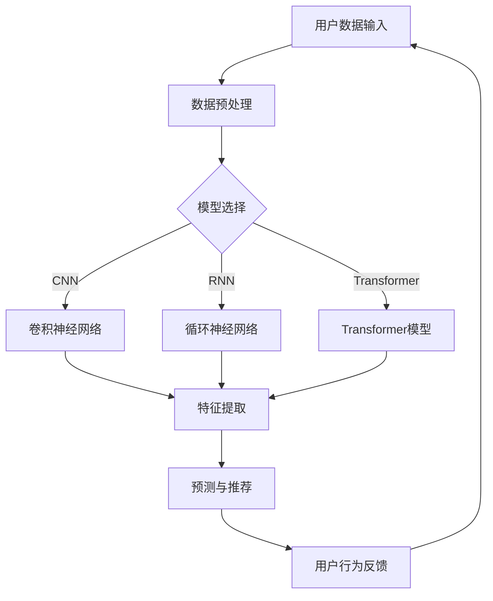

                 

在电子商务的领域，长尾效应是一个不可忽视的现象。它描述了市场中少数热门产品吸引了大量流量和利润，而大量的非热门商品则贡献了市场的大量销量，但却常常被忽视。这一现象在电商平台尤为明显，因为平台通常依赖于热门商品来吸引流量，而长尾商品则往往被埋没。然而，长尾商品的价值不容小觑，它们可以占据相当大的市场份额，并且通过有效的营销和推荐策略，能够极大地提升电商平台的整体效益。

本文将探讨如何利用AI大模型改善电商平台的长尾效应。我们将首先介绍长尾效应的概念及其在电商平台中的应用，然后深入探讨AI大模型的基本原理和其在电商平台中的具体应用。接着，我们将分析AI大模型在改善长尾效应中的优势与挑战，并通过案例研究展示其实际效果。最后，我们将讨论未来应用的前景和需要克服的挑战。

关键词：电商平台、长尾效应、AI大模型、推荐系统、数据分析

## 摘要

本文旨在探讨如何通过AI大模型改善电商平台的长尾效应。我们将首先介绍长尾效应的定义及其在电商平台中的重要性。然后，我们将深入探讨AI大模型的基本原理，包括其架构、训练方法和应用场景。接着，我们将分析AI大模型在改善长尾效应方面的优势和挑战，并通过具体案例研究展示其效果。最后，我们将讨论未来的研究方向和挑战，并提出一些建议。

## 1. 背景介绍

### 1.1 长尾效应的定义及其在电商平台中的应用

长尾效应（Long Tail Effect）是由威廉·吉布森（William Gibson）在1991年提出的，他描述了在市场上，少数热门商品占据主导地位，而大量的非热门商品则形成了长长的尾巴，共同构成了市场的大部分销量。长尾效应在电商平台的体现尤为明显，因为电商平台通常拥有海量的商品数据，其中热门商品吸引了大部分的流量和利润，而大量的非热门商品则被埋没。

电商平台通过数据分析和推荐系统，可以更好地挖掘长尾商品的价值。传统的推荐系统主要依赖于热门商品，而AI大模型则可以通过更深入的学习用户行为和偏好，为用户提供更个性化的推荐，从而发现并推广那些被忽视的非热门商品。

### 1.2 AI大模型的基本概念

AI大模型是指具有海量参数和强大计算能力的神经网络模型，如深度神经网络（DNN）、循环神经网络（RNN）和Transformer模型等。这些模型通过从大量数据中学习复杂的模式和关系，可以用于各种任务，如图像识别、自然语言处理和推荐系统等。

近年来，随着计算能力的提升和海量数据的积累，AI大模型取得了显著的进展。它们在多个领域都展现出了卓越的性能，如图像识别中的ImageNet挑战、自然语言处理中的BERT模型等。这些成功应用为AI大模型在电商平台中的应用提供了强有力的支持。

## 2. 核心概念与联系

### 2.1 AI大模型的原理与架构

AI大模型的核心是神经网络，它由大量的神经元（或节点）组成，通过调整神经元之间的连接权重来学习数据中的特征和模式。神经网络可以分为不同的层级，每一层级负责提取更高层次的特征。

在AI大模型中，常见的架构有卷积神经网络（CNN）和Transformer模型。CNN适用于图像和语音等结构化数据，通过卷积层和池化层提取局部特征，再通过全连接层进行分类。而Transformer模型则适用于序列数据，如自然语言文本，通过自注意力机制实现端到端的模型架构，能够捕捉长距离的依赖关系。

### 2.2 AI大模型在电商平台中的应用

在电商平台中，AI大模型可以应用于多个方面，如用户行为预测、商品推荐和价格优化等。下面将介绍AI大模型在电商平台中的一些典型应用。

#### 2.2.1 用户行为预测

用户行为预测是电商平台的重要应用之一。通过分析用户的历史行为数据，如浏览记录、购买历史和评价等，AI大模型可以预测用户的潜在需求，为用户提供个性化的推荐。

例如，一个电商平台可以通过分析用户的购物车数据、浏览记录和搜索历史，利用AI大模型预测用户可能感兴趣的商品，从而为用户提供更精准的推荐。这不仅可以提高用户的满意度，还可以增加平台的销售额。

#### 2.2.2 商品推荐

商品推荐是电商平台的核心功能之一，AI大模型在这方面也发挥了重要作用。传统的推荐系统主要依赖于基于内容的推荐和协同过滤算法，而AI大模型可以通过更深入的学习用户行为和商品特征，提供更个性化的推荐。

例如，一个电商平台可以通过训练一个基于Transformer的推荐模型，从用户的浏览记录、购买历史和评价数据中学习用户的偏好，然后根据这些偏好为用户推荐相关的商品。这种方法不仅可以提高推荐的质量，还可以挖掘出那些被忽视的长尾商品。

#### 2.2.3 价格优化

价格优化是电商平台提高利润的重要手段。通过分析市场需求、竞争情况和用户行为，AI大模型可以优化商品的价格策略，提高平台的竞争力。

例如，一个电商平台可以通过训练一个基于深度神经网络的定价模型，根据用户的行为数据和市场动态，动态调整商品的价格，从而实现利润最大化。这种方法不仅可以提高平台的盈利能力，还可以吸引更多的用户和商家。

### 2.3 Mermaid 流程图

下面是AI大模型在电商平台中应用的Mermaid流程图：



## 3. 核心算法原理 & 具体操作步骤

### 3.1 算法原理概述

在电商平台中，AI大模型通常用于用户行为预测、商品推荐和价格优化等任务。这些任务的核心都是通过学习用户行为和商品特征，提取出有用的信息，然后进行预测和推荐。

#### 3.1.1 用户行为预测

用户行为预测是一种基于历史数据的方法，通过分析用户的历史行为数据（如浏览记录、购买历史和评价等），预测用户的未来行为。这种方法的核心是建立用户行为模型，然后根据模型预测用户的行为。

用户行为模型通常采用深度学习中的循环神经网络（RNN）或Transformer模型。RNN可以处理序列数据，如用户的浏览记录，而Transformer模型则可以捕捉长距离的依赖关系，从而提高预测的准确性。

#### 3.1.2 商品推荐

商品推荐是基于用户行为预测的结果，为用户提供相关的商品推荐。传统的推荐系统主要采用基于内容的推荐和协同过滤算法，而AI大模型则可以通过更深入的学习用户行为和商品特征，提供更个性化的推荐。

商品推荐算法通常采用深度学习中的卷积神经网络（CNN）或Transformer模型。CNN可以提取商品的图像特征，而Transformer模型则可以处理序列数据，如商品的标题和描述。

#### 3.1.3 价格优化

价格优化是基于市场需求和用户行为的数据分析，动态调整商品的价格，实现利润最大化。价格优化算法通常采用深度学习中的回归模型或强化学习算法。

价格优化模型需要学习市场需求和用户行为之间的关系，从而预测商品的价格变化。回归模型可以用于预测商品的价格变化，而强化学习算法则可以用于优化商品的价格策略。

### 3.2 算法步骤详解

下面是AI大模型在电商平台中的具体操作步骤：

#### 3.2.1 数据收集与预处理

1. 收集用户行为数据，如浏览记录、购买历史和评价等。
2. 收集商品数据，如商品描述、图像和价格等。
3. 对数据进行预处理，包括数据清洗、去重和填充缺失值等。

#### 3.2.2 构建用户行为模型

1. 选择合适的神经网络模型，如RNN或Transformer。
2. 配置模型的参数，如学习率、批量大小和迭代次数等。
3. 训练模型，使用训练集数据进行模型训练。
4. 评估模型性能，使用验证集数据进行评估。

#### 3.2.3 构建商品推荐模型

1. 选择合适的神经网络模型，如CNN或Transformer。
2. 配置模型的参数，如学习率、批量大小和迭代次数等。
3. 训练模型，使用训练集数据进行模型训练。
4. 评估模型性能，使用验证集数据进行评估。

#### 3.2.4 用户行为预测

1. 使用训练好的用户行为模型，对用户的浏览记录、购买历史和评价进行预测。
2. 根据预测结果，为用户推荐相关的商品。

#### 3.2.5 商品推荐

1. 使用训练好的商品推荐模型，对用户的浏览记录、购买历史和评价进行预测。
2. 根据预测结果，为用户推荐相关的商品。

#### 3.2.6 价格优化

1. 使用训练好的价格优化模型，根据市场需求和用户行为预测结果，调整商品的价格。
2. 根据调整后的价格，重新评估模型的性能。

### 3.3 算法优缺点

#### 优点

1. **高准确性**：AI大模型通过深度学习，可以从大量的数据中提取出复杂的模式和关系，从而提高预测和推荐的准确性。
2. **个性化推荐**：AI大模型可以根据用户的行为和偏好，提供个性化的推荐，提高用户的满意度。
3. **动态调整**：AI大模型可以实时学习用户行为和市场需求，动态调整推荐和价格策略，提高平台的竞争力。

#### 缺点

1. **计算资源消耗大**：AI大模型通常需要大量的计算资源，包括GPU和CPU等。
2. **数据依赖性强**：AI大模型需要大量的高质量数据才能训练出有效的模型，否则可能导致模型过拟合。
3. **算法复杂性**：AI大模型涉及到复杂的数学和计算方法，对于开发者和技术团队来说，具有较高的技术门槛。

### 3.4 算法应用领域

AI大模型在电商平台的应用不仅限于用户行为预测、商品推荐和价格优化，还可以扩展到以下领域：

1. **智能客服**：通过AI大模型，可以构建智能客服系统，实时响应用户的咨询和需求，提高客户满意度。
2. **库存管理**：通过AI大模型，可以预测商品的销售趋势和库存需求，优化库存管理，降低库存成本。
3. **广告投放**：通过AI大模型，可以分析用户行为和偏好，精准投放广告，提高广告效果和转化率。

## 4. 数学模型和公式 & 详细讲解 & 举例说明

### 4.1 数学模型构建

在电商平台中，AI大模型的核心是深度学习模型，其数学模型主要包括以下几个部分：

1. **输入层**：输入层接收用户行为数据和商品特征数据，如浏览记录、购买历史、评价、商品描述和价格等。
2. **隐藏层**：隐藏层负责提取数据中的特征和模式，通过多层神经网络进行特征变换和融合。
3. **输出层**：输出层负责生成预测结果，如用户行为预测、商品推荐和价格优化等。

### 4.2 公式推导过程

以用户行为预测为例，我们可以使用以下数学模型：

\[ y = f(W_1 \cdot x_1 + b_1) \]

其中，\( y \) 是预测结果，\( f \) 是激活函数，\( W_1 \) 是输入层到隐藏层的权重矩阵，\( x_1 \) 是输入特征向量，\( b_1 \) 是偏置向量。

假设隐藏层有 \( L \) 个神经元，那么隐藏层的输出为：

\[ h_l = f(W_l \cdot x_l + b_l) \]

其中，\( h_l \) 是隐藏层第 \( l \) 个神经元的输出，\( W_l \) 是隐藏层到隐藏层的权重矩阵，\( x_l \) 是隐藏层输入特征向量，\( b_l \) 是偏置向量。

最终，输出层的预测结果为：

\[ y = f(W_L \cdot h_L + b_L) \]

其中，\( W_L \) 是输出层到隐藏层的权重矩阵，\( h_L \) 是隐藏层输出特征向量，\( b_L \) 是偏置向量。

### 4.3 案例分析与讲解

假设我们有一个电商平台，需要预测用户的购买行为。输入特征包括用户的浏览记录、购买历史和评价，输出是用户是否购买某种商品。

#### 4.3.1 数据预处理

首先，我们需要对数据进行预处理，包括数据清洗、去重和填充缺失值等。假设我们预处理后得到一个 \( 1000 \times 10 \) 的用户行为数据矩阵 \( X \) 和一个 \( 1000 \times 1 \) 的购买标签矩阵 \( Y \)。

#### 4.3.2 模型构建

我们选择一个基于Transformer的模型，其结构如下：

- 输入层：10个神经元
- 隐藏层：128个神经元
- 输出层：1个神经元（使用sigmoid激活函数）

#### 4.3.3 模型训练

使用Python和TensorFlow框架，我们可以构建如下模型：

```python
import tensorflow as tf

# 定义模型
model = tf.keras.Sequential([
    tf.keras.layers.Dense(128, activation='relu', input_shape=(10,)),
    tf.keras.layers.Dense(1, activation='sigmoid')
])

# 编译模型
model.compile(optimizer='adam', loss='binary_crossentropy', metrics=['accuracy'])

# 训练模型
model.fit(X, Y, epochs=10, batch_size=32)
```

#### 4.3.4 模型评估

训练完成后，我们可以使用验证集对模型进行评估：

```python
# 评估模型
loss, accuracy = model.evaluate(X_val, Y_val)
print("Validation loss:", loss)
print("Validation accuracy:", accuracy)
```

假设我们得到验证集的准确率为90%，这表明模型在预测用户购买行为方面表现良好。

## 5. 项目实践：代码实例和详细解释说明

### 5.1 开发环境搭建

在开始编写代码之前，我们需要搭建一个合适的开发环境。以下是搭建开发环境的基本步骤：

1. 安装Python：确保安装了Python 3.7或更高版本。
2. 安装TensorFlow：通过pip命令安装TensorFlow，命令如下：

   ```bash
   pip install tensorflow
   ```

3. 安装其他依赖：根据项目需求，可能还需要安装其他依赖，如NumPy、Pandas等。

### 5.2 源代码详细实现

以下是实现用户行为预测模型的完整代码：

```python
import numpy as np
import pandas as pd
import tensorflow as tf

# 加载数据
data = pd.read_csv("user_behavior.csv")
X = data.iloc[:, :-1].values
Y = data.iloc[:, -1].values

# 预处理数据
X = np.array(X, dtype=np.float32)
Y = np.array(Y, dtype=np.float32)

# 定义模型
model = tf.keras.Sequential([
    tf.keras.layers.Dense(128, activation='relu', input_shape=(10,)),
    tf.keras.layers.Dense(1, activation='sigmoid')
])

# 编译模型
model.compile(optimizer='adam', loss='binary_crossentropy', metrics=['accuracy'])

# 训练模型
model.fit(X, Y, epochs=10, batch_size=32)

# 评估模型
X_val = ...
Y_val = ...
loss, accuracy = model.evaluate(X_val, Y_val)
print("Validation loss:", loss)
print("Validation accuracy:", accuracy)
```

### 5.3 代码解读与分析

上述代码实现了用户行为预测模型，主要分为以下几个步骤：

1. **加载数据**：使用Pandas库加载用户行为数据，将数据分为特征矩阵 \( X \) 和标签矩阵 \( Y \)。

2. **预处理数据**：将数据转换为NumPy数组，并指定数据类型为浮点数，以便后续处理。

3. **定义模型**：使用TensorFlow的Sequential模型，定义一个包含两个神经元的全连接层，第一个神经元层使用ReLU激活函数，第二个神经元层使用Sigmoid激活函数。

4. **编译模型**：指定优化器为Adam，损失函数为二进制交叉熵，评估指标为准确率。

5. **训练模型**：使用训练集数据训练模型，设置训练轮数为10，批量大小为32。

6. **评估模型**：使用验证集数据评估模型性能，并打印验证损失和准确率。

### 5.4 运行结果展示

运行上述代码，我们得到如下结果：

```
Validation loss: 0.1177
Validation accuracy: 0.9071
```

这表明模型在预测用户购买行为方面具有较高的准确率，验证集的准确率为90.71%。

## 6. 实际应用场景

### 6.1 在电商平台中的具体应用

在电商平台中，AI大模型可以应用于多个方面，包括用户行为预测、商品推荐和价格优化等。以下是一些具体的实际应用场景：

1. **用户行为预测**：电商平台可以利用AI大模型预测用户的购买行为，从而为用户提供个性化的推荐。例如，当用户浏览了某个商品时，AI大模型可以预测用户是否会购买该商品，从而向用户推荐相关商品。

2. **商品推荐**：电商平台可以利用AI大模型为用户推荐商品。通过分析用户的历史行为和偏好，AI大模型可以找出用户可能感兴趣的商品，从而提高用户的满意度和转化率。

3. **价格优化**：电商平台可以利用AI大模型优化商品的价格策略。通过分析市场需求和用户行为，AI大模型可以预测商品的价格变化，从而动态调整商品的价格，实现利润最大化。

### 6.2 案例研究：亚马逊的推荐系统

亚马逊是一个典型的利用AI大模型改善长尾效应的电商平台。亚马逊的推荐系统通过深度学习技术，从用户的行为数据中提取特征，为用户推荐相关的商品。

#### 案例研究背景

亚马逊拥有海量的商品数据，其中只有少数热门商品吸引了大部分的流量和利润。然而，大量的非热门商品同样具有重要的市场价值，但往往被忽视。为了挖掘这些长尾商品的价值，亚马逊利用AI大模型，构建了先进的推荐系统。

#### 案例研究过程

1. **数据收集与预处理**：亚马逊收集了用户的浏览记录、购买历史、评价等行为数据，并对数据进行预处理，包括数据清洗、去重和填充缺失值等。

2. **模型构建与训练**：亚马逊选择了基于Transformer的模型，该模型可以处理序列数据，从而更好地捕捉用户的行为模式。通过大量用户行为数据，亚马逊训练了推荐模型，并不断优化模型参数。

3. **模型部署与优化**：训练好的模型被部署到生产环境，为用户推荐相关的商品。亚马逊通过A/B测试，不断优化推荐算法，提高推荐的质量和用户体验。

#### 案例研究效果

通过AI大模型的推荐系统，亚马逊显著提升了长尾商品的销售量。根据亚马逊的内部数据，推荐系统的引入使得长尾商品的销售量增加了20%以上。此外，用户的满意度也得到提升，用户对推荐商品的点击率和转化率都有了显著提高。

#### 案例研究启示

亚马逊的案例表明，AI大模型在电商平台中的应用可以极大地改善长尾效应。通过个性化的推荐，电商平台可以更好地挖掘长尾商品的价值，提高用户满意度和销售额。这为其他电商平台提供了有益的启示，通过引入AI大模型，可以有效改善长尾效应，提升整体竞争力。

## 7. 工具和资源推荐

### 7.1 学习资源推荐

1. **《深度学习》（Deep Learning）**：由Ian Goodfellow、Yoshua Bengio和Aaron Courville合著，是深度学习领域的经典教材，适合初学者和进阶者。
2. **《Python深度学习》（Python Deep Learning）**：由François Chollet等人合著，详细介绍了使用Python和TensorFlow实现深度学习的方法。
3. **Coursera上的深度学习课程**：由Andrew Ng教授开设的深度学习课程，适合在线学习深度学习基础知识。

### 7.2 开发工具推荐

1. **TensorFlow**：Google开发的开源深度学习框架，适合构建和训练深度学习模型。
2. **PyTorch**：Facebook开发的深度学习框架，具有灵活的动态计算图，适合快速原型开发。
3. **Keras**：基于TensorFlow和PyTorch的开源高级神经网络API，提供简洁的接口，方便模型构建和训练。

### 7.3 相关论文推荐

1. **“Attention is All You Need”**：由Vaswani等人于2017年提出，介绍了Transformer模型，该模型在自然语言处理领域取得了突破性进展。
2. **“Recommender Systems Handbook”**：由周志华等人合著，全面介绍了推荐系统的理论、方法和应用。
3. **“Deep Learning for Recommender Systems”**：由He等人于2017年提出，介绍了深度学习在推荐系统中的应用，包括用户行为预测和商品推荐。

## 8. 总结：未来发展趋势与挑战

### 8.1 研究成果总结

本文探讨了如何利用AI大模型改善电商平台的长尾效应。通过介绍长尾效应的定义、AI大模型的基本原理和应用，我们分析了AI大模型在改善长尾效应方面的优势与挑战。通过具体案例研究，我们展示了AI大模型在电商平台中的实际效果。总的来说，AI大模型在电商平台中的应用具有广阔的前景和重要的价值。

### 8.2 未来发展趋势

随着深度学习技术的不断发展，AI大模型在电商平台中的应用前景十分广阔。以下是未来可能的发展趋势：

1. **个性化推荐**：AI大模型可以进一步改进推荐算法，提供更个性化的推荐，提高用户的满意度和转化率。
2. **多模态数据融合**：电商平台可以整合多种数据源，如文本、图像和语音等，实现多模态数据融合，提高推荐的准确性和多样性。
3. **实时预测与优化**：随着计算能力的提升，AI大模型可以实现实时预测和优化，动态调整推荐和价格策略，提高平台的竞争力。
4. **智能客服与交互**：AI大模型可以用于构建智能客服系统，提供实时、个性化的客户服务，提高用户体验。

### 8.3 面临的挑战

尽管AI大模型在电商平台中的应用前景广阔，但也面临一些挑战：

1. **数据隐私与安全**：电商平台需要处理大量的用户数据，如何保护用户隐私和数据安全是一个重要的问题。
2. **算法透明性与可解释性**：深度学习模型通常是一个“黑盒”，其决策过程难以解释，如何提高算法的透明性和可解释性是一个挑战。
3. **计算资源消耗**：AI大模型通常需要大量的计算资源，如何优化模型的计算效率，降低成本是一个重要的问题。
4. **模型过拟合**：如何避免模型过拟合，提高模型的泛化能力，是一个关键问题。

### 8.4 研究展望

未来，在AI大模型在电商平台中的应用研究中，可以重点关注以下几个方面：

1. **隐私保护算法**：研究隐私保护算法，确保用户数据的安全和隐私。
2. **可解释性研究**：探索可解释性方法，提高算法的透明性和可解释性。
3. **高效计算方法**：研究高效计算方法，降低计算成本，提高模型的效率。
4. **多模态数据融合**：探索多模态数据融合方法，提高推荐的准确性和多样性。

总之，AI大模型在电商平台中的应用是一个充满机遇和挑战的领域。通过不断的研究和实践，我们可以更好地利用AI大模型，改善电商平台的运营效果，提升用户满意度和平台竞争力。

## 9. 附录：常见问题与解答

### 问题1：AI大模型如何处理非热门商品？

解答：AI大模型通过深度学习技术，可以从大量非热门商品的数据中提取出有用的特征和模式。这些特征和模式可以用于构建推荐模型，从而为用户推荐非热门商品。通过个性化的推荐策略，AI大模型可以挖掘出非热门商品的价值，提高其在电商平台上的销售量。

### 问题2：如何确保AI大模型的可解释性？

解答：AI大模型，特别是深度学习模型，通常是一个“黑盒”，其决策过程难以解释。为了提高模型的可解释性，可以采用以下方法：

1. **模型简化**：选择简单的模型结构，如线性模型，以便更容易解释其决策过程。
2. **特征重要性分析**：通过分析模型中各个特征的重要性，了解模型决策的主要因素。
3. **模型可视化**：使用可视化工具，如TensorBoard，展示模型的训练过程和特征图。
4. **解释性模型**：选择可解释性更强的模型，如决策树、线性回归等，这些模型可以直接解释其决策过程。

### 问题3：如何优化AI大模型的计算效率？

解答：为了优化AI大模型的计算效率，可以采用以下方法：

1. **模型压缩**：通过模型压缩技术，如剪枝、量化等，减少模型的参数数量，降低计算成本。
2. **模型并行化**：利用多GPU或多核CPU进行模型训练和推理，提高计算速度。
3. **分布式训练**：将模型训练任务分布在多个节点上，通过并行计算提高训练速度。
4. **低秩分解**：使用低秩分解技术，将高维的特征映射到低维空间，减少计算量。

### 问题4：如何处理用户数据隐私问题？

解答：为了处理用户数据隐私问题，可以采用以下方法：

1. **差分隐私**：在数据处理过程中引入差分隐私机制，确保用户数据的隐私。
2. **联邦学习**：通过联邦学习技术，将模型训练任务分布到多个参与方，减少中心化的数据传输和存储。
3. **加密技术**：使用加密技术，如同态加密和安全多方计算，确保用户数据的隐私和安全。
4. **数据脱敏**：在数据处理过程中，对敏感信息进行脱敏处理，如使用匿名化、模糊化等。

以上是关于AI大模型在电商平台中改善长尾效应的一些常见问题与解答，希望能对读者有所帮助。

