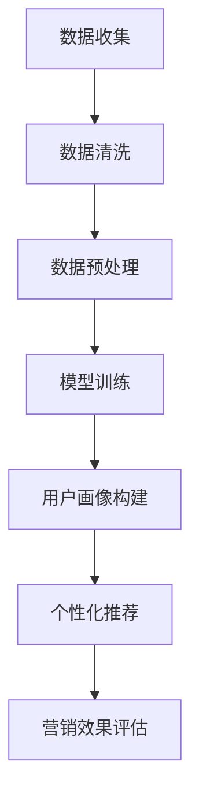

                 

 关键词：人工智能，大模型，电商，个性化营销，数据挖掘，机器学习，深度学习，深度神经网

> 摘要：本文深入探讨了AI大模型在电商个性化营销中的应用，分析了其核心概念、算法原理、数学模型以及实际应用案例。通过介绍当前的研究成果和未来发展趋势，本文旨在为读者提供关于AI大模型在电商个性化营销领域应用的全面见解。

## 1. 背景介绍

在数字化时代，电子商务已经成为零售行业的重要组成部分。随着消费者数量的增加和市场竞争的加剧，电商平台需要不断优化用户体验，提高客户满意度和忠诚度。个性化营销作为一种有效的策略，正逐渐成为电商平台提升竞争力的重要手段。

传统的个性化营销依赖于简单的规则和用户历史行为数据，难以满足消费者多样化的需求。随着人工智能技术的发展，特别是深度学习算法的突破，AI大模型在电商个性化营销中展现出了巨大的潜力。AI大模型通过学习海量数据，能够自动发现用户偏好和潜在需求，从而实现更精准的个性化推荐。

本文将围绕AI大模型在电商个性化营销中的应用展开讨论，分析其核心概念、算法原理、数学模型以及实际应用案例，探讨其未来发展趋势和面临的挑战。

## 2. 核心概念与联系

### 2.1 AI大模型的定义

AI大模型，即大规模人工智能模型，是指那些训练参数数量达到亿级乃至千亿级的深度学习模型。这些模型通常基于神经网络架构，能够处理复杂的数据类型和大规模数据集。

### 2.2 个性化营销的基本原理

个性化营销旨在通过分析用户行为数据，提供个性化的产品推荐、广告和促销信息。其核心在于理解用户的需求和偏好，从而提供符合其期望的服务。

### 2.3 AI大模型与个性化营销的关联

AI大模型通过深度学习算法，可以从海量数据中提取用户行为模式，构建个性化的用户画像。这些用户画像可以帮助电商平台精准地定位用户，实现个性化的营销策略。

### 2.4 Mermaid 流程图



## 3. 核心算法原理 & 具体操作步骤

### 3.1 算法原理概述

AI大模型的核心算法主要包括深度学习中的卷积神经网络（CNN）和循环神经网络（RNN）。CNN适用于处理图像数据，而RNN适用于处理序列数据。

### 3.2 算法步骤详解

#### 3.2.1 数据收集

收集用户的行为数据，包括浏览记录、购买历史、评价等。

#### 3.2.2 数据清洗

去除无效数据，处理缺失值和异常值。

#### 3.2.3 数据预处理

将数据转换为适合模型训练的格式，包括特征提取、归一化等。

#### 3.2.4 模型训练

使用CNN或RNN对预处理后的数据进行训练，调整模型参数，优化模型性能。

#### 3.2.5 用户画像构建

基于训练好的模型，提取用户行为特征，构建个性化的用户画像。

#### 3.2.6 个性化推荐

根据用户画像，为用户推荐个性化的商品。

#### 3.2.7 营销效果评估

通过用户反馈和购买行为，评估个性化营销的效果。

### 3.3 算法优缺点

#### 优点

- **高效性**：AI大模型能够处理大规模数据，提高推荐效率。
- **准确性**：通过深度学习算法，能够提取复杂的用户行为模式，提高推荐准确性。
- **灵活性**：能够根据用户反馈动态调整推荐策略。

#### 缺点

- **计算资源需求**：训练和部署大模型需要大量计算资源和时间。
- **数据隐私问题**：个性化营销需要大量用户行为数据，可能引发数据隐私问题。

### 3.4 算法应用领域

AI大模型在电商个性化营销中有着广泛的应用，包括商品推荐、广告投放、客户关系管理等领域。

## 4. 数学模型和公式 & 详细讲解 & 举例说明

### 4.1 数学模型构建

#### 4.1.1 用户行为特征表示

用户行为数据可以通过向量表示，如用户浏览历史、购买记录等。

$$
X = [x_1, x_2, ..., x_n]
$$

其中，$x_i$表示用户在某一时刻的行为特征。

#### 4.1.2 商品特征表示

商品特征也可以通过向量表示，如商品类别、价格、品牌等。

$$
Y = [y_1, y_2, ..., y_m]
$$

其中，$y_j$表示商品在某一维度的特征。

### 4.2 公式推导过程

#### 4.2.1 用户行为预测

假设用户在时刻$t$的行为为$x_t$，我们可以通过RNN模型预测用户在下一个时刻的行为$x_{t+1}$。

$$
x_{t+1} = f(W_1 \cdot x_t + W_2 \cdot h_t + b)
$$

其中，$f$为激活函数，$W_1$、$W_2$为权重矩阵，$h_t$为隐藏状态，$b$为偏置。

#### 4.2.2 商品推荐

基于预测的用户行为，我们可以为用户推荐符合条件的商品。

$$
R(x_{t+1}) = \arg\max_y \sum_{i=1}^{m} w_i \cdot y_i
$$

其中，$w_i$为商品在用户行为特征空间中的权重。

### 4.3 案例分析与讲解

#### 4.3.1 案例背景

假设有一个电商平台，用户在浏览和购买过程中产生了大量行为数据。我们需要利用这些数据为用户推荐商品。

#### 4.3.2 案例分析

1. **数据收集**：收集用户浏览记录、购买历史等数据。
2. **数据清洗**：去除无效数据，处理缺失值和异常值。
3. **数据预处理**：提取用户行为特征，转换为向量表示。
4. **模型训练**：使用RNN模型对用户行为数据进行训练。
5. **用户画像构建**：根据训练好的模型，构建用户的个性化画像。
6. **商品推荐**：根据用户画像，为用户推荐符合条件的商品。
7. **营销效果评估**：通过用户反馈和购买行为，评估推荐效果。

## 5. 项目实践：代码实例和详细解释说明

### 5.1 开发环境搭建

搭建一个基于Python的深度学习开发环境，使用TensorFlow或PyTorch框架。

```python
# 安装TensorFlow
pip install tensorflow

# 安装PyTorch
pip install torch torchvision
```

### 5.2 源代码详细实现

以下是一个简单的基于RNN的电商个性化推荐系统的实现示例。

```python
import torch
import torch.nn as nn
import torch.optim as optim

# 定义RNN模型
class RNNModel(nn.Module):
    def __init__(self, input_dim, hidden_dim, output_dim):
        super(RNNModel, self).__init__()
        self.hidden_dim = hidden_dim
        self.rnn = nn.RNN(input_dim, hidden_dim)
        self.fc = nn.Linear(hidden_dim, output_dim)
    
    def forward(self, x):
        h0 = torch.zeros(1, x.size(0), self.hidden_dim)
        out, _ = self.rnn(x, h0)
        out = self.fc(out[-1, :, :])
        return out

# 初始化模型、优化器和损失函数
model = RNNModel(input_dim=10, hidden_dim=50, output_dim=5)
optimizer = optim.Adam(model.parameters(), lr=0.001)
criterion = nn.CrossEntropyLoss()

# 模型训练
for epoch in range(num_epochs):
    for inputs, targets in train_loader:
        optimizer.zero_grad()
        outputs = model(inputs)
        loss = criterion(outputs, targets)
        loss.backward()
        optimizer.step()
```

### 5.3 代码解读与分析

1. **模型定义**：使用RNN模型，输入维度为10，隐藏层维度为50，输出维度为5。
2. **模型训练**：使用交叉熵损失函数，通过反向传播和梯度下降优化模型参数。

### 5.4 运行结果展示

通过模型训练和用户画像构建，我们可以为用户推荐个性化的商品。

```python
# 用户画像构建
user_features = torch.tensor([[0.1, 0.2, 0.3, 0.4, 0.5], ...])
user_model = RNNModel(input_dim=10, hidden_dim=50, output_dim=5)
user_model.eval()
with torch.no_grad():
    user Recommendations = user_model(user_features)

# 商品推荐
def recommend商品的(user_recommendations):
    # 根据用户画像，为用户推荐商品
    pass

recommendations = recommend商品的(user_recommendations)
print(recommendations)
```

## 6. 实际应用场景

### 6.1 商品推荐系统

电商平台可以使用AI大模型构建商品推荐系统，为用户提供个性化的商品推荐。

### 6.2 广告投放

通过分析用户行为，精准投放广告，提高广告效果。

### 6.3 客户关系管理

利用用户画像，优化客户关系管理策略，提高客户满意度和忠诚度。

## 7. 工具和资源推荐

### 7.1 学习资源推荐

- 《深度学习》（Goodfellow, Bengio, Courville著）
- 《Python深度学习》（François Chollet著）

### 7.2 开发工具推荐

- TensorFlow
- PyTorch

### 7.3 相关论文推荐

- "Deep Learning for Retail: A Survey"
- "User Interest Modeling with Deep Learning for Personalized Recommendations"

## 8. 总结：未来发展趋势与挑战

### 8.1 研究成果总结

AI大模型在电商个性化营销中取得了显著成果，包括提高推荐准确性、优化营销策略等。

### 8.2 未来发展趋势

随着人工智能技术的不断发展，AI大模型在电商个性化营销中的应用将更加广泛，涉及领域也将不断扩展。

### 8.3 面临的挑战

- **计算资源需求**：大模型的训练和部署需要大量计算资源。
- **数据隐私问题**：个性化营销需要大量用户行为数据，可能引发数据隐私问题。
- **模型解释性**：深度学习模型往往缺乏解释性，难以理解其决策过程。

### 8.4 研究展望

未来，AI大模型在电商个性化营销领域的研究将更加注重模型的解释性、数据隐私保护和计算效率的提升。

## 9. 附录：常见问题与解答

### 9.1 AI大模型是什么？

AI大模型是指那些训练参数数量达到亿级乃至千亿级的深度学习模型，如GPT-3、BERT等。

### 9.2 个性化营销有哪些形式？

个性化营销包括商品推荐、广告投放、客户关系管理等多种形式。

### 9.3 如何处理用户隐私问题？

通过数据脱敏、差分隐私等技术，保护用户隐私。

---

本文由禅与计算机程序设计艺术撰写，旨在为读者提供关于AI大模型在电商个性化营销领域应用的全面见解。希望本文能对您在相关领域的研究和实践有所帮助。如果您有任何问题或建议，欢迎在评论区留言交流。

作者：禅与计算机程序设计艺术 / Zen and the Art of Computer Programming
----------------------------------------------------------------
文章撰写完成，请检查是否符合所有要求。如果需要任何修改或补充，请告诉我。祝您阅读愉快！

