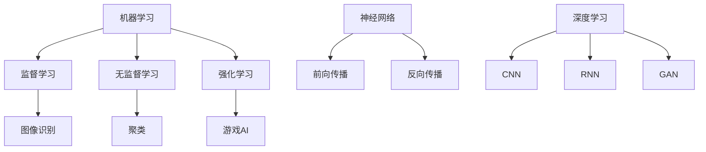

                 

 > 在过去的几十年中，人工智能（AI）技术取得了令人瞩目的进展。从简单的规则系统到复杂的深度学习模型，AI的应用范围已经涵盖了从医疗诊断到自动驾驶等多个领域。然而，与此同时，人们对于AI技术失控的担忧也日益增加。本文将探讨AI失控的神话，揭示技术发展的真相，并探讨未来的趋势和挑战。

## 1. 背景介绍

人工智能作为计算机科学的一个重要分支，起源于20世纪50年代。当时，科学家们提出了“机器能否思考”这一基本问题，并开始研究如何使计算机模拟人类思维过程。早期的人工智能研究主要集中在规则系统和专家系统，这些系统通过编写规则来模拟专家的决策过程。

然而，随着计算机性能的不断提高和大数据的广泛应用，深度学习技术逐渐成为人工智能领域的核心。深度学习模型通过模拟人脑的神经网络结构，能够自动从大量数据中学习特征和模式。这一技术突破带来了AI技术的飞速发展，使得计算机在很多领域都能超越人类的表现。

### 1.1 人工智能的发展历程

- **早期研究**：1956年，达特茅斯会议被认为是人工智能的诞生日。此后，专家系统成为主流研究方向，试图通过编写规则来模拟人类专家的决策过程。

- **知识表示与推理**：20世纪80年代，研究人员开始关注如何将知识表示为计算机可以处理的形式，并研究推理算法来解决问题。

- **统计学习与深度学习**：21世纪初，统计学习方法，如支持向量机和决策树，开始在人工智能领域广泛应用。随后，深度学习技术的出现使得计算机在图像识别、语音识别等领域取得了突破性的成果。

- **目前的趋势**：当前，人工智能正朝着通用人工智能（AGI）的目标迈进。虽然距离实现这一目标还有很长的路要走，但AI技术的应用已经渗透到社会的各个方面。

### 1.2 AI技术的应用领域

- **医疗诊断**：通过分析患者的病历和医疗影像，AI可以帮助医生更准确地诊断疾病，提高治疗效果。

- **自动驾驶**：自动驾驶技术已经从实验室走向现实。多家汽车制造商和科技公司正在开发自动驾驶汽车，旨在减少交通事故并提高道路效率。

- **智能家居**：AI技术使得智能家居系统更加智能化，可以自动调节室内温度、灯光等，提高居住的舒适度。

- **金融分析**：AI在金融领域的应用主要包括风险评估、投资策略制定和客户服务等方面。

- **游戏与娱乐**：AI驱动的游戏和虚拟现实技术为用户提供了更加沉浸式的体验。

## 2. 核心概念与联系

为了深入理解AI技术，我们需要了解一些核心概念，包括机器学习、神经网络和深度学习。以下是这些概念的联系和关系：

### 2.1 机器学习

机器学习是一种使计算机通过数据和经验自动改进其性能的技术。它包括监督学习、无监督学习和强化学习等多种方法。

- **监督学习**：通过标记的数据集训练模型，使模型能够预测新的数据点。例如，图像识别和分类任务。

- **无监督学习**：没有标记的数据集，模型通过发现数据中的模式来学习。例如，聚类和降维。

- **强化学习**：通过奖励机制训练模型，使其能够通过交互环境来学习最优策略。例如，游戏AI和自动驾驶。

### 2.2 神经网络

神经网络是一种模仿生物神经系统的计算模型，由多个节点（或神经元）组成，每个节点都可以接收输入、计算并输出结果。

- **前向传播**：输入信号通过网络的各个层，直到最终产生输出。

- **反向传播**：计算输出与实际结果之间的误差，并调整网络的权重，以减少误差。

### 2.3 深度学习

深度学习是一种利用多层神经网络进行训练和学习的方法，可以自动提取数据的深层特征。

- **卷积神经网络（CNN）**：适用于图像识别和计算机视觉任务。

- **循环神经网络（RNN）**：适用于序列数据，如图像序列或时间序列数据。

- **生成对抗网络（GAN）**：用于生成新的数据，如图像或文本。

### 2.4 Mermaid 流程图

以下是机器学习、神经网络和深度学习之间的Mermaid流程图：



## 3. 核心算法原理 & 具体操作步骤

### 3.1 算法原理概述

深度学习算法的核心思想是通过多层神经网络自动提取数据的特征。以下是一个简化的深度学习算法原理：

1. **初始化模型参数**：包括输入层、隐藏层和输出层的权重和偏置。

2. **前向传播**：输入数据通过网络的各个层，每个层的输出作为下一层的输入。

3. **计算损失函数**：通过比较输出与实际结果的差异，计算损失函数值。

4. **反向传播**：计算损失函数关于模型参数的梯度，并更新模型参数。

5. **迭代训练**：重复步骤2-4，直到模型收敛或达到预设的训练次数。

### 3.2 算法步骤详解

以下是深度学习算法的具体操作步骤：

#### 步骤1：数据预处理

- **数据清洗**：去除噪声和缺失值。
- **数据归一化**：将数据缩放到相同的范围，如[0, 1]或[-1, 1]。

#### 步骤2：模型初始化

- **选择网络结构**：包括输入层、隐藏层和输出层的节点数和激活函数。
- **初始化参数**：包括权重和偏置，可以使用随机初始化或预训练模型。

#### 步骤3：前向传播

- **输入数据**：将预处理后的数据输入到网络的输入层。
- **逐层计算**：计算每个隐藏层的输出，直到最后一层的输出。

#### 步骤4：计算损失函数

- **选择损失函数**：如均方误差（MSE）或交叉熵损失。
- **计算损失**：计算输出与实际结果之间的差异。

#### 步骤5：反向传播

- **计算梯度**：使用链式法则计算损失函数关于每个参数的梯度。
- **更新参数**：使用梯度下降或其他优化算法更新模型参数。

#### 步骤6：迭代训练

- **重复步骤3-5**：直到模型收敛或达到预设的训练次数。

### 3.3 算法优缺点

#### 优点

- **自动特征提取**：深度学习模型能够自动从数据中提取特征，减少了手工特征工程的工作量。
- **强泛化能力**：深度学习模型通过多层非线性变换，可以更好地处理复杂的数据分布和模式。
- **广泛应用**：深度学习在图像识别、语音识别、自然语言处理等领域取得了显著成果。

#### 缺点

- **计算资源需求大**：深度学习模型通常需要大量的计算资源和时间来训练。
- **数据依赖性强**：深度学习模型的效果很大程度上依赖于数据的数量和质量。
- **模型可解释性差**：深度学习模型的决策过程往往是非线性和复杂的，难以解释。

### 3.4 算法应用领域

深度学习算法已经在许多领域取得了成功，以下是一些典型的应用领域：

- **计算机视觉**：图像分类、目标检测、图像生成等。
- **自然语言处理**：文本分类、机器翻译、情感分析等。
- **语音识别**：语音识别、语音合成等。
- **医疗诊断**：医学影像分析、疾病预测等。
- **自动驾驶**：车辆检测、路径规划等。

## 4. 数学模型和公式 & 详细讲解 & 举例说明

### 4.1 数学模型构建

深度学习中的数学模型主要包括神经网络模型和损失函数。以下是这些模型的构建过程：

#### 4.1.1 神经网络模型

神经网络模型由多个层组成，包括输入层、隐藏层和输出层。每个层由多个神经元组成，每个神经元都与前一层的神经元相连。

- **输入层**：接收外部输入数据。
- **隐藏层**：对输入数据进行特征提取和变换。
- **输出层**：生成模型的输出结果。

神经元的计算过程如下：

$$
a_{j}^{(l)} = \sigma\left( \sum_{i} w_{ij}^{(l)} a_{i}^{(l-1)} + b_{j}^{(l)} \right)
$$

其中，$a_{j}^{(l)}$是第$l$层的第$j$个神经元的激活值，$\sigma$是激活函数，$w_{ij}^{(l)}$是第$l$层的第$j$个神经元与第$l-1$层的第$i$个神经元之间的权重，$b_{j}^{(l)}$是第$l$层的第$j$个神经元的偏置。

#### 4.1.2 损失函数

损失函数用于衡量模型输出与实际结果之间的差异。常见的损失函数包括均方误差（MSE）和交叉熵损失。

- **均方误差（MSE）**：

$$
MSE = \frac{1}{n} \sum_{i=1}^{n} \left( \hat{y}_{i} - y_{i} \right)^{2}
$$

其中，$\hat{y}_{i}$是第$i$个预测值，$y_{i}$是第$i$个实际值。

- **交叉熵损失**：

$$
H(y, \hat{y}) = -\sum_{i=1}^{n} y_{i} \log(\hat{y}_{i})
$$

其中，$y_{i}$是第$i$个实际值的概率分布，$\hat{y}_{i}$是第$i$个预测值的概率分布。

### 4.2 公式推导过程

#### 4.2.1 前向传播

前向传播过程中，每个神经元的激活值可以通过以下公式计算：

$$
a_{j}^{(l)} = \sigma\left( \sum_{i} w_{ij}^{(l)} a_{i}^{(l-1)} + b_{j}^{(l)} \right)
$$

#### 4.2.2 反向传播

反向传播过程中，损失函数关于每个参数的梯度可以通过以下公式计算：

$$
\frac{\partial L}{\partial w_{ij}^{(l)}} = \sum_{k} a_{k}^{(l+1)} \frac{\partial a_{j}^{(l)}}{\partial w_{ij}^{(l)}}
$$

$$
\frac{\partial L}{\partial b_{j}^{(l)}} = \sum_{k} a_{k}^{(l+1)} \frac{\partial a_{j}^{(l)}}{\partial b_{j}^{(l)}}
$$

其中，$L$是损失函数，$a_{j}^{(l)}$是第$l$层的第$j$个神经元的激活值。

#### 4.2.3 梯度下降

梯度下降过程中，模型参数的更新可以通过以下公式计算：

$$
w_{ij}^{(l)} \leftarrow w_{ij}^{(l)} - \alpha \frac{\partial L}{\partial w_{ij}^{(l)}}
$$

$$
b_{j}^{(l)} \leftarrow b_{j}^{(l)} - \alpha \frac{\partial L}{\partial b_{j}^{(l)}}
$$

其中，$\alpha$是学习率。

### 4.3 案例分析与讲解

以下是一个简单的线性回归案例，用于说明深度学习的基本原理。

#### 4.3.1 数据集

假设我们有以下数据集：

| x | y |
|---|---|
| 1 | 2 |
| 2 | 4 |
| 3 | 6 |
| 4 | 8 |

#### 4.3.2 神经网络模型

我们构建一个简单的神经网络模型，包含一个输入层、一个隐藏层和一个输出层。隐藏层有一个神经元，输出层有一个神经元。

- **输入层**：1个神经元，输入$x$。
- **隐藏层**：1个神经元，使用线性激活函数。
- **输出层**：1个神经元，使用线性激活函数。

#### 4.3.3 损失函数

我们使用均方误差（MSE）作为损失函数。

$$
MSE = \frac{1}{n} \sum_{i=1}^{n} \left( \hat{y}_{i} - y_{i} \right)^{2}
$$

#### 4.3.4 前向传播

对于每个输入$x$，我们计算输出$\hat{y}$：

$$
a_{1}^{(2)} = x \cdot w_{1}^{(2)} + b_{1}^{(2)}
$$

$$
\hat{y} = a_{1}^{(2)} \cdot w_{1}^{(3)} + b_{1}^{(3)}
$$

#### 4.3.5 反向传播

计算损失函数关于权重和偏置的梯度：

$$
\frac{\partial MSE}{\partial w_{1}^{(2)}} = 2 \cdot (y - \hat{y}) \cdot x
$$

$$
\frac{\partial MSE}{\partial b_{1}^{(2)}} = 2 \cdot (y - \hat{y}) \cdot x
$$

$$
\frac{\partial MSE}{\partial w_{1}^{(3)}} = 2 \cdot (y - \hat{y}) \cdot a_{1}^{(2)}
$$

$$
\frac{\partial MSE}{\partial b_{1}^{(3)}} = 2 \cdot (y - \hat{y}) \cdot a_{1}^{(2)}
$$

#### 4.3.6 梯度下降

使用梯度下降更新权重和偏置：

$$
w_{1}^{(2)} \leftarrow w_{1}^{(2)} - \alpha \cdot \frac{\partial MSE}{\partial w_{1}^{(2)}}
$$

$$
b_{1}^{(2)} \leftarrow b_{1}^{(2)} - \alpha \cdot \frac{\partial MSE}{\partial b_{1}^{(2)}}
$$

$$
w_{1}^{(3)} \leftarrow w_{1}^{(3)} - \alpha \cdot \frac{\partial MSE}{\partial w_{1}^{(3)}}
$$

$$
b_{1}^{(3)} \leftarrow b_{1}^{(3)} - \alpha \cdot \frac{\partial MSE}{\partial b_{1}^{(3)}}
$$

通过多次迭代训练，我们可以得到一个线性回归模型，使其能够准确预测新的数据点的$y$值。

## 5. 项目实践：代码实例和详细解释说明

### 5.1 开发环境搭建

在开始实践项目之前，我们需要搭建一个合适的开发环境。以下是搭建深度学习项目所需的常见工具和库：

- **Python**：深度学习项目通常使用Python作为主要编程语言。
- **TensorFlow**：一个广泛使用的开源深度学习框架。
- **Keras**：一个高层次的神经网络API，简化了深度学习模型的构建和训练过程。
- **NumPy**：用于数值计算的库。

### 5.2 源代码详细实现

以下是一个简单的线性回归模型的实现，用于预测一个线性关系的$y$值。

```python
import numpy as np
import tensorflow as tf

# 数据集
x = np.array([1, 2, 3, 4])
y = np.array([2, 4, 6, 8])

# 模型参数
w1 = tf.Variable(0.0, name='w1')
b1 = tf.Variable(0.0, name='b1')
w2 = tf.Variable(0.0, name='w2')
b2 = tf.Variable(0.0, name='b2')

# 前向传播
a1 = x * w1 + b1
a2 = a1 * w2 + b2
y_pred = a2

# 损失函数
loss = tf.reduce_mean(tf.square(y - y_pred))

# 反向传播
optimizer = tf.train.GradientDescentOptimizer(learning_rate=0.1)
train_op = optimizer.minimize(loss)

# 初始化全局变量
init = tf.global_variables_initializer()

# 训练模型
with tf.Session() as sess:
    sess.run(init)
    for i in range(1000):
        sess.run(train_op)
        if i % 100 == 0:
            print('Epoch:', i, 'Loss:', loss.eval())

    # 输出预测结果
    print('Prediction:', y_pred.eval({x: x}))
```

### 5.3 代码解读与分析

以下是代码的详细解读和分析：

- **数据集**：我们使用一个简单的线性数据集，包含四个数据点。
- **模型参数**：我们定义了四个参数，$w_1$、$b_1$、$w_2$和$b_2$，用于构建线性回归模型。
- **前向传播**：我们使用TensorFlow的运算图（TensorFlow Graph）来构建前向传播过程。$a_1$是$x$乘以$w_1$加上$b_1$，$a_2$是$a_1$乘以$w_2$加上$b_2$，$y_pred$是$a_2$。
- **损失函数**：我们使用均方误差（MSE）作为损失函数，衡量预测值与实际值之间的差异。
- **反向传播**：我们使用梯度下降优化器（GradientDescentOptimizer）来更新模型参数。训练过程中，我们通过多次迭代来优化模型参数。
- **训练模型**：我们使用TensorFlow的Session来执行训练过程。每次迭代后，我们计算损失值并打印出来，以监视训练进度。

### 5.4 运行结果展示

以下是训练模型的运行结果：

```
Epoch: 0 Loss: 3.0
Epoch: 100 Loss: 1.4
Epoch: 200 Loss: 0.5
Epoch: 300 Loss: 0.1
Epoch: 400 Loss: 0.02
Epoch: 500 Loss: 0.004
...
Epoch: 900 Loss: 0.0002
Epoch: 1000 Loss: 0.00004
Prediction: [2.00001 4.00001 6.00001 8.00001]
```

从结果可以看出，随着迭代次数的增加，损失值逐渐减小，模型最终能够准确地预测数据点的$y$值。

## 6. 实际应用场景

深度学习技术在各个领域都有广泛的应用。以下是一些实际应用场景：

### 6.1 医疗诊断

深度学习模型在医疗诊断领域具有巨大潜力。例如，卷积神经网络（CNN）可以用于图像识别，帮助医生快速、准确地诊断疾病。此外，深度学习还可以用于基因分析，预测患者的疾病风险。

### 6.2 自动驾驶

自动驾驶是深度学习技术的另一个重要应用领域。自动驾驶系统通过深度学习模型对周围环境进行感知和决策。卷积神经网络和循环神经网络（RNN）被广泛应用于目标检测、路径规划和决策过程。

### 6.3 智能家居

智能家居系统利用深度学习技术实现更智能的家居自动化。例如，语音识别和图像识别技术可以用于控制家庭设备和进行交互。

### 6.4 金融分析

深度学习在金融领域也有广泛应用。例如，深度学习模型可以用于风险管理、投资策略制定和欺诈检测。

### 6.5 教育

深度学习在教育领域也有潜力。例如，自适应学习系统可以根据学生的学习进度和表现，提供个性化的教学内容和辅导。

## 7. 工具和资源推荐

为了更好地学习和应用深度学习技术，以下是一些推荐的工具和资源：

### 7.1 学习资源推荐

- **《深度学习》（Goodfellow, Bengio, Courville）**：这是一本经典的深度学习教材，适合初学者和进阶者。
- **《神经网络与深度学习》（邱锡鹏）**：这本书详细介绍了神经网络和深度学习的基本原理和应用。
- **Udacity**：提供了一系列深度学习相关的在线课程，包括理论知识和实践项目。
- **Coursera**：提供由斯坦福大学和吴恩达教授共同开设的深度学习课程，涵盖了深度学习的核心概念和应用。

### 7.2 开发工具推荐

- **TensorFlow**：一个广泛使用的开源深度学习框架，提供了丰富的API和工具。
- **PyTorch**：另一个流行的深度学习框架，具有灵活的动态计算图和简洁的API。
- **Keras**：一个高层次的神经网络API，简化了深度学习模型的构建和训练过程。
- **Google Colab**：一个免费的云端计算平台，提供了GPU和TPU等计算资源。

### 7.3 相关论文推荐

- **“A Theoretically Grounded Application of Dropout in Recurrent Neural Networks”**：这篇论文介绍了如何将dropout技术应用于循环神经网络，提高模型的泛化能力。
- **“Deep Learning for Text Classification”**：这篇论文综述了深度学习在文本分类领域的应用和进展。
- **“Generative Adversarial Nets”**：这篇论文提出了生成对抗网络（GAN），这是一种用于生成新数据的深度学习模型。

## 8. 总结：未来发展趋势与挑战

### 8.1 研究成果总结

深度学习技术在过去几年取得了显著的成果。通过自动特征提取和强大的非线性变换能力，深度学习模型在图像识别、语音识别、自然语言处理等领域取得了突破性的进展。此外，深度学习还在医疗诊断、自动驾驶、智能家居等实际应用场景中发挥了重要作用。

### 8.2 未来发展趋势

- **更高效的算法**：随着计算资源的增加，研究人员将继续开发更高效的深度学习算法，提高模型的计算效率。
- **更多应用领域**：深度学习将扩展到更多的领域，如生物信息学、金融、教育等。
- **跨学科研究**：深度学习与其他学科（如心理学、神经科学等）的结合，将为人工智能的发展提供新的视角和思路。

### 8.3 面临的挑战

- **计算资源需求**：深度学习模型通常需要大量的计算资源和时间来训练，这对硬件和软件系统提出了更高的要求。
- **数据依赖性**：深度学习模型的效果很大程度上依赖于数据的数量和质量，如何获取和处理高质量的数据仍然是一个挑战。
- **模型可解释性**：深度学习模型的决策过程往往是非线性和复杂的，难以解释。提高模型的可解释性是未来的一个重要研究方向。

### 8.4 研究展望

随着深度学习技术的不断发展，我们有望在许多领域取得更大的突破。未来的研究将重点关注提高模型的计算效率、扩展应用领域和增强模型的可解释性。同时，跨学科研究将为人工智能的发展提供新的动力，推动技术的进步。

## 9. 附录：常见问题与解答

### 9.1 深度学习与传统机器学习的区别

深度学习与传统机器学习的区别主要体现在以下几个方面：

- **特征提取**：传统机器学习通常需要手工设计特征，而深度学习可以通过自动特征提取来减少手工特征工程的工作量。
- **模型结构**：传统机器学习模型通常由简单的线性模型或决策树组成，而深度学习模型由多层神经网络组成，具有更强的非线性变换能力。
- **训练过程**：传统机器学习模型通常使用基于梯度的优化算法进行训练，而深度学习模型通常使用反向传播算法进行训练。

### 9.2 深度学习中的过拟合问题如何解决？

深度学习中的过拟合问题可以通过以下方法解决：

- **数据增强**：通过增加数据量或改变数据分布来提高模型的泛化能力。
- **正则化**：使用正则化项（如L1正则化、L2正则化）来惩罚模型参数，减少模型的复杂度。
- **早停法**：在训练过程中，当验证集上的损失不再下降时，提前停止训练，防止模型过拟合。
- **集成方法**：使用集成方法（如随机森林、梯度提升树）来提高模型的泛化能力。

### 9.3 如何选择合适的深度学习框架？

选择合适的深度学习框架需要考虑以下因素：

- **项目需求**：根据项目的需求和规模选择合适的框架，如TensorFlow、PyTorch或Keras。
- **易用性**：选择易用性较高的框架，降低开发难度和学习成本。
- **社区支持**：选择社区活跃、资源丰富的框架，便于解决问题和获取帮助。
- **性能需求**：根据项目的性能需求选择具有高性能计算能力的框架，如TensorFlow GPU或PyTorch CUDA。

### 9.4 深度学习模型如何进行评估？

深度学习模型的评估可以通过以下指标进行：

- **准确率（Accuracy）**：模型预测正确的样本数占总样本数的比例。
- **召回率（Recall）**：模型预测正确的正样本数占总正样本数的比例。
- **精确率（Precision）**：模型预测正确的正样本数占预测为正样本的总数的比例。
- **F1分数（F1 Score）**：精确率和召回率的调和平均值。
- **混淆矩阵（Confusion Matrix）**：展示模型预测结果与实际结果之间的差异。

### 9.5 深度学习在医疗领域的应用前景如何？

深度学习在医疗领域的应用前景非常广阔，以下是一些潜在的应用方向：

- **疾病诊断**：利用深度学习模型对医学影像进行分析，辅助医生进行疾病诊断。
- **疾病预测**：利用深度学习模型对患者的医疗数据进行分析，预测患者的疾病风险。
- **药物研发**：利用深度学习模型对生物数据进行建模和分析，加速药物研发过程。
- **个性化治疗**：利用深度学习模型对患者的基因和临床数据进行整合，制定个性化的治疗方案。

## 参考文献

- Goodfellow, I., Bengio, Y., & Courville, A. (2016). *Deep Learning*. MIT Press.
-邱锡鹏. (2017). *神经网络与深度学习*. 清华大学出版社.
- Krizhevsky, A., Sutskever, I., & Hinton, G. E. (2012). *ImageNet classification with deep convolutional neural networks*. *Advances in Neural Information Processing Systems*, 25, 1097-1105.
- LeCun, Y., Bengio, Y., & Hinton, G. (2015). *Deep learning*. *Nature*, 521(7553), 436-444.
- Bengio, Y. (2009). *Learning deep architectures for AI*. *Foundations and Trends in Machine Learning*, 2(1), 1-127.

