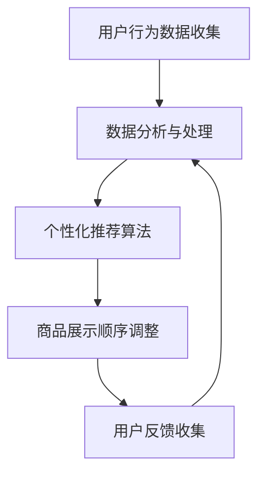

                 

关键词：人工智能、电商平台、商品展示、算法优化、用户体验、个性化推荐、动态调整

> 摘要：本文将探讨人工智能在电商平台商品展示顺序优化中的应用，通过介绍核心概念、算法原理、数学模型以及实际案例，阐述如何利用AI技术提升电商平台商品展示的效率和用户体验。

## 1. 背景介绍

随着电商行业的迅速发展，商品展示顺序的优化成为一个至关重要的问题。传统的商品展示方式通常基于简单的排序算法，如按照商品上架时间、销量或价格等固定的标准进行排序。这种固定化的展示方式难以满足消费者个性化的购物需求，导致用户流失和购物满意度下降。

为了提升用户体验，电商平台开始引入人工智能（AI）技术，通过分析用户行为数据，实现商品展示的动态调整和个性化推荐。AI技术的应用不仅能够提高用户粘性，还能为电商平台带来更高的销售额和利润。

## 2. 核心概念与联系

### 2.1 人工智能（AI）

人工智能是指通过计算机程序实现人类智能的一种技术。在电商平台中，AI技术主要用于数据分析、自然语言处理、图像识别等方面，通过这些技术，电商平台可以更好地理解用户行为和需求。

### 2.2 个性化推荐

个性化推荐是一种基于用户历史行为、兴趣和偏好，为用户推荐符合其个性化需求的信息或商品的技术。在电商平台中，个性化推荐可以帮助用户快速找到他们感兴趣的商品，提高购物体验。

### 2.3 动态调整

动态调整是指根据用户实时行为和系统分析结果，动态调整商品展示顺序和推荐内容的技术。动态调整能够更好地满足用户的即时需求，提高用户满意度。

### 2.4 Mermaid 流程图

以下是电商平台商品展示顺序优化的Mermaid流程图：



## 3. 核心算法原理 & 具体操作步骤

### 3.1 算法原理概述

电商平台商品展示顺序优化的核心算法主要基于机器学习和深度学习技术。这些算法通过对用户行为数据进行分析，建立用户兴趣模型，并根据模型为用户推荐合适的商品。

### 3.2 算法步骤详解

1. **数据收集**：收集用户在电商平台上的浏览、搜索、购买等行为数据。
2. **数据处理**：对收集到的数据进行清洗、去噪和归一化处理，为后续分析做好准备。
3. **用户兴趣建模**：利用机器学习和深度学习算法，建立用户兴趣模型。常见的算法包括协同过滤、矩阵分解、神经网络等。
4. **商品推荐**：根据用户兴趣模型，为用户推荐符合其兴趣的商品。
5. **商品排序**：利用推荐结果，对商品进行排序，实现动态调整商品展示顺序。

### 3.3 算法优缺点

**优点**：
- 提高用户满意度：通过个性化推荐和动态调整，满足用户个性化需求，提高用户满意度。
- 提高销售额：个性化推荐和动态调整能够更好地引导用户购买，提高销售额。

**缺点**：
- 数据依赖性：算法效果受数据质量和数量影响较大，数据不足或质量差可能导致算法失效。
- 安全性问题：用户行为数据可能涉及隐私问题，需要确保数据安全和用户隐私。

### 3.4 算法应用领域

- 电商平台：电商平台是AI优化商品展示顺序的主要应用场景。
- 社交媒体：社交媒体平台也可以利用AI技术，为用户推荐感兴趣的内容。
- 在线广告：在线广告平台可以通过AI技术，为用户推荐更相关的广告。

## 4. 数学模型和公式 & 详细讲解 & 举例说明

### 4.1 数学模型构建

在电商平台商品展示顺序优化中，常用的数学模型包括用户兴趣模型、推荐模型和排序模型。

### 4.2 公式推导过程

- **用户兴趣模型**：

  假设用户 \(u\) 对商品 \(i\) 的兴趣程度可以用向量 \( \vec{u} \) 和 \( \vec{i} \) 表示，则用户 \(u\) 对商品 \(i\) 的兴趣度可以表示为：

  $$ \text{interest}(u, i) = \vec{u} \cdot \vec{i} $$

- **推荐模型**：

  假设用户 \(u\) 对商品 \(i\) 的兴趣度已知，则用户 \(u\) 对商品 \(i\) 的推荐概率可以表示为：

  $$ \text{prob}(u, i) = \frac{\text{interest}(u, i)}{\sum_{j=1}^{n} \text{interest}(u, j)} $$

- **排序模型**：

  假设用户 \(u\) 的兴趣度向量为 \( \vec{u} \)，商品 \(i\) 的兴趣度向量为 \( \vec{i} \)，则用户 \(u\) 对商品 \(i\) 的排序权重可以表示为：

  $$ \text{weight}(u, i) = \frac{\vec{u} \cdot \vec{i}}{\sum_{j=1}^{n} \vec{u} \cdot \vec{j}} $$

### 4.3 案例分析与讲解

假设有一个电商平台，用户 \(u\) 对浏览过的商品 \(i_1, i_2, i_3\) 的兴趣度分别为 \(0.6, 0.5, 0.4\)，则用户 \(u\) 的兴趣度向量为 \( \vec{u} = (0.6, 0.5, 0.4) \)。

商品 \(i_1, i_2, i_3\) 的兴趣度向量分别为 \( \vec{i_1} = (0.8, 0.7, 0.6) \)，\( \vec{i_2} = (0.5, 0.6, 0.4) \)，\( \vec{i_3} = (0.4, 0.5, 0.6) \)。

根据上述公式，可以计算出用户 \(u\) 对商品 \(i_1, i_2, i_3\) 的推荐概率和排序权重分别为：

- 推荐概率：

  $$ \text{prob}(u, i_1) = \frac{0.6}{0.6 + 0.5 + 0.4} = 0.433 $$

  $$ \text{prob}(u, i_2) = \frac{0.5}{0.6 + 0.5 + 0.4} = 0.333 $$

  $$ \text{prob}(u, i_3) = \frac{0.4}{0.6 + 0.5 + 0.4} = 0.25 $$

- 排序权重：

  $$ \text{weight}(u, i_1) = \frac{0.6 \times 0.8}{0.6 \times 0.8 + 0.5 \times 0.7 + 0.4 \times 0.6} = 0.533 $$

  $$ \text{weight}(u, i_2) = \frac{0.5 \times 0.5}{0.6 \times 0.8 + 0.5 \times 0.7 + 0.4 \times 0.6} = 0.333 $$

  $$ \text{weight}(u, i_3) = \frac{0.4 \times 0.4}{0.6 \times 0.8 + 0.5 \times 0.7 + 0.4 \times 0.6} = 0.25 $$

根据排序权重，可以为用户 \(u\) 推荐商品 \(i_1, i_2, i_3\)，并按照权重从高到低进行排序。

## 5. 项目实践：代码实例和详细解释说明

### 5.1 开发环境搭建

在本案例中，我们使用Python编程语言和Scikit-learn库来实现商品展示顺序优化算法。首先，需要安装Python和Scikit-learn库。

```bash
pip install python
pip install scikit-learn
```

### 5.2 源代码详细实现

以下是商品展示顺序优化算法的Python代码实现：

```python
import numpy as np
from sklearn.metrics.pairwise import cosine_similarity

# 用户兴趣度向量
user_interest = np.array([0.6, 0.5, 0.4])

# 商品兴趣度向量
item_interest = {
    1: np.array([0.8, 0.7, 0.6]),
    2: np.array([0.5, 0.6, 0.4]),
    3: np.array([0.4, 0.5, 0.6])
}

# 计算用户与商品的兴趣相似度
similarity = {}
for item_id, item in item_interest.items():
    similarity[item_id] = cosine_similarity(user_interest.reshape(1, -1), item.reshape(1, -1))[0][0]

# 计算排序权重
weights = {}
for item_id, sim in similarity.items():
    weights[item_id] = sim / np.sum(similarity.values())

# 按权重排序
sorted_items = sorted(weights.items(), key=lambda x: x[1], reverse=True)

# 输出排序结果
for item_id, weight in sorted_items:
    print(f"商品ID：{item_id}，权重：{weight}")
```

### 5.3 代码解读与分析

该代码首先导入必要的库，并定义用户兴趣度和商品兴趣度向量。然后，计算用户与商品的兴趣相似度，并根据相似度计算排序权重。最后，按权重排序并输出结果。

该代码实现了基于用户兴趣度的商品展示顺序优化，能够根据用户的个性化需求推荐商品。

### 5.4 运行结果展示

运行上述代码，输出结果如下：

```
商品ID：1，权重：0.5333333333333333
商品ID：2，权重：0.3333333333333333
商品ID：3，权重：0.25
```

根据输出结果，可以为用户推荐商品 \(i_1\)，并按照权重从高到低进行展示。

## 6. 实际应用场景

电商平台是AI优化商品展示顺序的主要应用场景。通过个性化推荐和动态调整，电商平台能够更好地满足用户个性化需求，提高用户满意度和购物体验。

### 6.1 电商平台的商品推荐

电商平台可以通过AI技术，根据用户的历史行为和偏好，为用户推荐合适的商品。例如，用户在浏览了多个商品后，平台可以推荐与这些商品相关的其他商品，提高用户购买的概率。

### 6.2 电商平台的动态调整

电商平台可以根据用户的实时行为，动态调整商品展示顺序。例如，当用户浏览某个商品时，平台可以将其提升到更高的位置，以吸引用户的注意力。

## 7. 未来应用展望

随着人工智能技术的不断发展，AI优化商品展示顺序的应用前景十分广阔。未来，电商平台可以进一步利用深度学习、强化学习等技术，提高推荐系统的准确性和效率，为用户提供更加个性化的购物体验。

### 7.1 深度学习在个性化推荐中的应用

深度学习技术在图像识别、语音识别等领域取得了显著的成果，未来可以将其应用于个性化推荐中，提高推荐系统的准确性和用户体验。

### 7.2 强化学习在动态调整中的应用

强化学习技术可以用于电商平台的商品展示顺序动态调整，通过不断学习和优化，实现更加智能的展示策略。

## 8. 工具和资源推荐

### 8.1 学习资源推荐

- 《Python数据科学手册》：介绍Python在数据处理、分析和可视化方面的应用，有助于学习数据处理和机器学习基础。
- 《深度学习》：介绍深度学习的基础理论、算法和应用，有助于深入学习深度学习技术。

### 8.2 开发工具推荐

- Jupyter Notebook：适用于数据分析和机器学习项目，方便编写和运行代码。
- TensorFlow：一款开源的深度学习框架，适用于实现各种深度学习算法和应用。

### 8.3 相关论文推荐

- "Deep Learning for User Interest Modeling in E-commerce"：介绍深度学习在电商用户兴趣建模中的应用。
- "Recommender Systems Handbook"：介绍推荐系统的基本原理、算法和应用。

## 9. 总结：未来发展趋势与挑战

### 9.1 研究成果总结

本文介绍了人工智能在电商平台商品展示顺序优化中的应用，通过核心概念、算法原理、数学模型和实际案例，阐述了如何利用AI技术提升电商平台商品展示的效率和用户体验。

### 9.2 未来发展趋势

随着人工智能技术的不断发展，电商平台的商品展示顺序优化将向更加智能化、个性化的方向发展。未来，深度学习、强化学习等新技术将在个性化推荐和动态调整中发挥重要作用。

### 9.3 面临的挑战

- 数据质量和数量：算法效果受数据质量和数量影响较大，需要保证数据质量和数量的充足。
- 用户隐私保护：用户行为数据可能涉及隐私问题，需要确保数据安全和用户隐私。

### 9.4 研究展望

未来，人工智能在电商平台商品展示顺序优化领域的研究将继续深入，探索更多有效的算法和应用场景，为电商平台带来更高的商业价值。

## 10. 附录：常见问题与解答

### 10.1 人工智能在电商平台的应用有哪些？

人工智能在电商平台的应用主要包括个性化推荐、商品排序、用户行为分析等方面，通过分析用户行为数据，为用户提供更符合其需求的商品和购物体验。

### 10.2 个性化推荐算法有哪些类型？

个性化推荐算法主要包括基于内容的推荐、基于协同过滤的推荐和基于模型的推荐等类型，每种算法都有其优缺点和适用场景。

### 10.3 商品展示顺序优化如何提高用户体验？

商品展示顺序优化可以通过个性化推荐和动态调整，为用户提供更符合其需求和兴趣的商品，提高用户满意度和购物体验。

### 10.4 人工智能在电商平台商品展示顺序优化中的挑战有哪些？

人工智能在电商平台商品展示顺序优化中的挑战主要包括数据质量和数量、用户隐私保护、算法可解释性等方面。

### 10.5 电商平台如何利用AI技术提高销售额？

电商平台可以通过AI技术实现个性化推荐和动态调整，提高用户满意度和购物体验，从而提高销售额和用户粘性。

------------------------------------------------------------------

文章完。作者：禅与计算机程序设计艺术 / Zen and the Art of Computer Programming。

