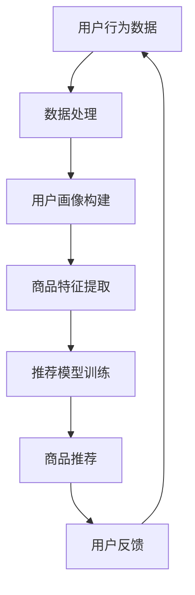

                 

关键词：AI，电商平台，长尾商品，曝光优化，个性化推荐，机器学习，深度学习

> 摘要：本文将探讨如何利用人工智能技术，特别是机器学习和深度学习算法，来优化电商平台长尾商品的高效曝光。我们将详细阐述核心概念、算法原理、数学模型、实际应用场景，并介绍相关工具和资源，以期为电商平台提供可行的解决方案，提升用户体验和销售额。

## 1. 背景介绍

在电商行业，商品种类繁多，尤其是大型电商平台，往往存在大量的长尾商品。这些商品的特点是销量较低，但种类繁多，占据了电商平台商品的很大一部分。传统的方法往往难以针对长尾商品进行有效曝光，导致这些商品无法获得足够的用户关注，从而影响电商平台的整体销售业绩。

随着人工智能技术的发展，特别是机器学习和深度学习算法的应用，为电商平台的长尾商品曝光提供了新的思路和可能。通过分析用户行为数据、商品特征和市场需求，AI算法能够智能地推荐商品，提高长尾商品的曝光率和销售量。

本文将从以下方面展开讨论：

1. 核心概念与联系
2. 核心算法原理 & 具体操作步骤
3. 数学模型和公式 & 详细讲解 & 举例说明
4. 项目实践：代码实例和详细解释说明
5. 实际应用场景
6. 未来应用展望
7. 工具和资源推荐
8. 总结：未来发展趋势与挑战

## 2. 核心概念与联系

在讨论如何优化长尾商品曝光之前，我们需要了解一些核心概念。

### 2.1 用户行为数据

用户行为数据是指用户在电商平台上的所有操作记录，包括浏览、搜索、购买、评价等。这些数据反映了用户的需求和偏好，是构建个性化推荐系统的重要依据。

### 2.2 商品特征

商品特征是指商品的属性和描述，如商品名称、品牌、价格、库存量、材质、尺码等。这些特征可以用来构建商品画像，以便于算法进行分类和匹配。

### 2.3 个性化推荐

个性化推荐是指根据用户的历史行为数据和商品特征，为用户推荐其可能感兴趣的商品。个性化推荐系统可以显著提高用户满意度和销售转化率。

### 2.4 机器学习

机器学习是一种通过数据驱动的方式来发现数据内在规律，并应用于预测和决策的技术。在电商平台，机器学习算法可以用于用户行为预测、商品推荐、风险控制等。

### 2.5 深度学习

深度学习是机器学习的一个分支，通过构建多层神经网络来实现自动特征学习和分类。深度学习在图像识别、语音识别、自然语言处理等领域取得了显著的成果。

### 2.6 Mermaid 流程图

以下是一个简单的 Mermaid 流程图，描述了用户行为数据、商品特征和个性化推荐之间的联系。



## 3. 核心算法原理 & 具体操作步骤

### 3.1 算法原理概述

在优化长尾商品曝光方面，常用的算法包括协同过滤、矩阵分解、深度学习等。以下是这些算法的基本原理和具体步骤。

### 3.1.1 协同过滤

协同过滤是一种基于用户行为数据的推荐算法，通过计算用户之间的相似度来推荐商品。协同过滤分为基于用户的协同过滤（User-based CF）和基于物品的协同过滤（Item-based CF）。

1. **基于用户的协同过滤**：首先计算用户之间的相似度，然后找出最相似的k个用户，最后推荐这些用户喜欢的商品。
2. **基于物品的协同过滤**：首先计算商品之间的相似度，然后找出与用户已购买或浏览的商品最相似的k个商品，最后推荐这些商品。

### 3.1.2 矩阵分解

矩阵分解是一种通过将用户-商品评分矩阵分解为两个低秩矩阵的方式来提取用户和商品的潜在特征。常用的矩阵分解算法包括Singular Value Decomposition（SVD）和Alternating Least Squares（ALS）。

1. **SVD**：将用户-商品评分矩阵分解为用户特征矩阵和商品特征矩阵，通过最小化重构误差来优化参数。
2. **ALS**：交替最小二乘法，通过交替优化用户特征矩阵和商品特征矩阵来最小化重构误差。

### 3.1.3 深度学习

深度学习是一种通过构建多层神经网络来实现自动特征学习和分类的技术。在电商推荐系统中，深度学习可以用于用户行为序列建模、商品分类、多模态信息融合等。

1. **用户行为序列建模**：通过构建循环神经网络（RNN）或长短时记忆网络（LSTM），可以捕捉用户行为序列中的长期依赖关系。
2. **商品分类**：通过卷积神经网络（CNN）或卷积自编码器（CAE），可以提取商品的特征表示。
3. **多模态信息融合**：通过多输入层神经网络或图神经网络（GCN），可以整合用户行为数据、商品特征和文本描述等多模态信息。

### 3.2 算法步骤详解

以下是使用深度学习算法优化长尾商品曝光的具体步骤：

1. **数据预处理**：收集用户行为数据、商品特征和文本描述，并进行预处理，如缺失值处理、数据归一化、文本向量化等。
2. **特征提取**：通过神经网络提取用户行为序列、商品特征和文本描述的嵌入向量。
3. **模型训练**：构建深度学习模型，通过反向传播算法优化模型参数。
4. **商品推荐**：将用户行为序列和商品特征输入模型，输出推荐的商品列表。
5. **效果评估**：通过在线或离线评估指标（如点击率、转化率、销售额等）评估模型性能。

### 3.3 算法优缺点

#### 3.3.1 协同过滤

**优点**：

- **简单易实现**：基于用户行为数据，计算用户和商品之间的相似度，算法简单。
- **高效**：可以直接用于大规模数据集。

**缺点**：

- **冷启动问题**：对新用户或新商品难以推荐。
- **稀疏矩阵问题**：用户行为数据通常是稀疏的，导致推荐效果不佳。

#### 3.3.2 矩阵分解

**优点**：

- **可以解决冷启动问题**：通过矩阵分解提取用户和商品的潜在特征，对新用户或新商品也能进行推荐。
- **可以提升推荐精度**：通过降维和特征提取，可以减少数据噪声和提高推荐精度。

**缺点**：

- **计算复杂度高**：矩阵分解算法需要计算大量的矩阵运算，对计算资源要求较高。
- **不能直接处理文本信息**：矩阵分解算法主要处理数值型数据，无法直接处理文本信息。

#### 3.3.3 深度学习

**优点**：

- **可以处理复杂数据**：深度学习可以处理多种类型的数据（如文本、图像、音频等），并且能够自动提取特征。
- **可以学习长期依赖关系**：通过循环神经网络（RNN）或长短时记忆网络（LSTM），可以捕捉用户行为序列中的长期依赖关系。

**缺点**：

- **需要大量数据**：深度学习模型需要大量的训练数据，对数据资源要求较高。
- **模型调优复杂**：深度学习模型的参数调优复杂，需要大量的时间和计算资源。

### 3.4 算法应用领域

协同过滤、矩阵分解和深度学习算法在电商平台长尾商品曝光方面具有广泛的应用前景。

- **协同过滤**：适用于大规模电商平台的用户行为推荐，如商品推荐、购物车推荐等。
- **矩阵分解**：适用于需要处理大量商品和用户的电商平台，如搜索结果推荐、广告推荐等。
- **深度学习**：适用于需要处理多种类型数据的电商平台，如多模态推荐、视频推荐等。

## 4. 数学模型和公式 & 详细讲解 & 举例说明

### 4.1 数学模型构建

在电商平台长尾商品曝光的优化过程中，我们主要关注两个方面的数学模型：用户行为建模和商品推荐模型。

#### 4.1.1 用户行为建模

用户行为建模的目标是预测用户对某商品的购买概率。一个简单的用户行为建模模型可以表示为：

\[ P(U_c) = \sigma(W_1 \cdot X_c + b_1) \]

其中，\( P(U_c) \) 表示用户 \( U \) 对商品 \( c \) 的购买概率，\( \sigma \) 表示 sigmoid 函数，\( W_1 \) 表示用户特征权重矩阵，\( X_c \) 表示商品 \( c \) 的特征向量，\( b_1 \) 表示偏置。

#### 4.1.2 商品推荐模型

商品推荐模型的目标是根据用户的历史行为数据和商品特征，为用户推荐可能感兴趣的商品。一个简单的商品推荐模型可以表示为：

\[ R(U_c) = \sigma(W_2 \cdot U + b_2) \]

其中，\( R(U_c) \) 表示用户 \( U \) 对商品 \( c \) 的推荐得分，\( W_2 \) 表示商品特征权重矩阵，\( U \) 表示用户特征向量，\( b_2 \) 表示偏置。

### 4.2 公式推导过程

#### 4.2.1 用户行为建模公式推导

首先，我们考虑一个简单的线性模型，将用户行为建模为：

\[ P(U_c) = \sigma(W_1 \cdot X_c + b_1) \]

其中，\( W_1 \) 和 \( b_1 \) 是待优化的参数。

为了得到更好的预测效果，我们采用梯度下降法来优化模型参数。梯度下降法的更新公式为：

\[ W_1 \leftarrow W_1 - \alpha \frac{\partial L}{\partial W_1} \]
\[ b_1 \leftarrow b_1 - \alpha \frac{\partial L}{\partial b_1} \]

其中，\( L \) 是损失函数，\( \alpha \) 是学习率。

为了衡量模型的预测误差，我们可以使用均方误差（MSE）作为损失函数：

\[ L = \frac{1}{2} \sum_{i=1}^{N} (P(U_{c_i}) - y_i)^2 \]

其中，\( N \) 是样本数量，\( y_i \) 是第 \( i \) 个样本的真实购买概率。

将 \( P(U_c) \) 的表达式代入损失函数，得到：

\[ L = \frac{1}{2} \sum_{i=1}^{N} (\sigma(W_1 \cdot X_{c_i} + b_1) - y_i)^2 \]

对 \( W_1 \) 和 \( b_1 \) 求导，得到：

\[ \frac{\partial L}{\partial W_1} = \sum_{i=1}^{N} (\sigma(W_1 \cdot X_{c_i} + b_1) - y_i) \cdot X_{c_i} \]
\[ \frac{\partial L}{\partial b_1} = \sum_{i=1}^{N} (\sigma(W_1 \cdot X_{c_i} + b_1) - y_i) \]

代入梯度下降法的更新公式，即可得到用户行为建模的优化步骤。

#### 4.2.2 商品推荐模型公式推导

商品推荐模型的推导过程与用户行为建模类似。我们首先考虑一个简单的线性模型，将商品推荐模型表示为：

\[ R(U_c) = \sigma(W_2 \cdot U + b_2) \]

其中，\( W_2 \) 和 \( b_2 \) 是待优化的参数。

为了得到更好的推荐效果，我们采用梯度下降法来优化模型参数。梯度下降法的更新公式为：

\[ W_2 \leftarrow W_2 - \alpha \frac{\partial L}{\partial W_2} \]
\[ b_2 \leftarrow b_2 - \alpha \frac{\partial L}{\partial b_2} \]

其中，\( L \) 是损失函数，\( \alpha \) 是学习率。

为了衡量模型的推荐误差，我们可以使用均方误差（MSE）作为损失函数：

\[ L = \frac{1}{2} \sum_{i=1}^{N} (R(U_{c_i}) - r_i)^2 \]

其中，\( N \) 是样本数量，\( r_i \) 是第 \( i \) 个样本的真实推荐得分。

将 \( R(U_c) \) 的表达式代入损失函数，得到：

\[ L = \frac{1}{2} \sum_{i=1}^{N} (\sigma(W_2 \cdot U_{c_i} + b_2) - r_i)^2 \]

对 \( W_2 \) 和 \( b_2 \) 求导，得到：

\[ \frac{\partial L}{\partial W_2} = \sum_{i=1}^{N} (\sigma(W_2 \cdot U_{c_i} + b_2) - r_i) \cdot U_{c_i} \]
\[ \frac{\partial L}{\partial b_2} = \sum_{i=1}^{N} (\sigma(W_2 \cdot U_{c_i} + b_2) - r_i) \]

代入梯度下降法的更新公式，即可得到商品推荐模型的优化步骤。

### 4.3 案例分析与讲解

#### 4.3.1 案例背景

假设我们有一个电商平台，用户的行为数据包括浏览记录、购买记录和评价记录。我们需要根据这些数据，为用户推荐可能感兴趣的商品。

#### 4.3.2 数据准备

首先，我们需要准备用户行为数据和商品特征数据。用户行为数据包括用户的ID、行为类型（如浏览、购买、评价）、行为时间和商品ID。商品特征数据包括商品的ID、名称、品牌、价格、库存量、材质、尺码等。

接下来，我们对数据进行预处理，如缺失值处理、数据归一化和文本向量化。对于文本数据，我们可以使用Word2Vec或BERT等方法进行向量化处理。

#### 4.3.3 用户行为建模

对于用户行为建模，我们可以采用线性模型，将用户行为建模为：

\[ P(U_c) = \sigma(W_1 \cdot X_c + b_1) \]

其中，\( X_c \) 是商品特征向量，\( W_1 \) 是用户特征权重矩阵，\( b_1 \) 是偏置。

我们使用梯度下降法来优化模型参数。假设我们使用均方误差（MSE）作为损失函数，那么：

\[ L = \frac{1}{2} \sum_{i=1}^{N} (\sigma(W_1 \cdot X_{c_i} + b_1) - y_i)^2 \]

对 \( W_1 \) 和 \( b_1 \) 求导，得到：

\[ \frac{\partial L}{\partial W_1} = \sum_{i=1}^{N} (\sigma(W_1 \cdot X_{c_i} + b_1) - y_i) \cdot X_{c_i} \]
\[ \frac{\partial L}{\partial b_1} = \sum_{i=1}^{N} (\sigma(W_1 \cdot X_{c_i} + b_1) - y_i) \]

代入梯度下降法的更新公式，得到：

\[ W_1 \leftarrow W_1 - \alpha \frac{\partial L}{\partial W_1} \]
\[ b_1 \leftarrow b_1 - \alpha \frac{\partial L}{\partial b_1} \]

#### 4.3.4 商品推荐模型

对于商品推荐模型，我们可以采用线性模型，将商品推荐模型表示为：

\[ R(U_c) = \sigma(W_2 \cdot U + b_2) \]

其中，\( U \) 是用户特征向量，\( W_2 \) 是商品特征权重矩阵，\( b_2 \) 是偏置。

我们使用梯度下降法来优化模型参数。假设我们使用均方误差（MSE）作为损失函数，那么：

\[ L = \frac{1}{2} \sum_{i=1}^{N} (\sigma(W_2 \cdot U_{c_i} + b_2) - r_i)^2 \]

对 \( W_2 \) 和 \( b_2 \) 求导，得到：

\[ \frac{\partial L}{\partial W_2} = \sum_{i=1}^{N} (\sigma(W_2 \cdot U_{c_i} + b_2) - r_i) \cdot U_{c_i} \]
\[ \frac{\partial L}{\partial b_2} = \sum_{i=1}^{N} (\sigma(W_2 \cdot U_{c_i} + b_2) - r_i) \]

代入梯度下降法的更新公式，得到：

\[ W_2 \leftarrow W_2 - \alpha \frac{\partial L}{\partial W_2} \]
\[ b_2 \leftarrow b_2 - \alpha \frac{\partial L}{\partial b_2} \]

#### 4.3.5 模型评估

在模型评估方面，我们可以使用交叉验证来评估模型的性能。假设我们使用5折交叉验证，那么我们将数据集划分为5个子集，每次选取一个子集作为验证集，其余4个子集作为训练集。通过5次验证的结果，我们可以得到模型的平均性能。

具体来说，我们可以计算模型的均方误差（MSE）和准确率（Accuracy），公式如下：

\[ MSE = \frac{1}{N} \sum_{i=1}^{N} (R(U_c) - r_i)^2 \]
\[ Accuracy = \frac{1}{N} \sum_{i=1}^{N} \mathbb{I}(R(U_c) \geq r_i) \]

其中，\( R(U_c) \) 是模型的预测得分，\( r_i \) 是真实得分，\( \mathbb{I} \) 是指示函数。

## 5. 项目实践：代码实例和详细解释说明

### 5.1 开发环境搭建

在搭建开发环境之前，我们需要安装一些必要的库和工具。以下是一个简单的安装脚本：

```bash
# 安装Python环境
pip install numpy pandas sklearn tensorflow

# 安装Mermaid渲染工具
npm install mermaid -g
```

### 5.2 源代码详细实现

以下是一个简单的实现用户行为建模和商品推荐模型的Python代码实例：

```python
import numpy as np
import pandas as pd
from sklearn.model_selection import train_test_split
from sklearn.metrics import mean_squared_error
from tensorflow.keras.models import Sequential
from tensorflow.keras.layers import Dense
from tensorflow.keras.optimizers import Adam
from tensorflow.keras.callbacks import EarlyStopping

# 数据预处理
def preprocess_data(data):
    # 缺失值处理、数据归一化、文本向量化等操作
    # ...

    return X, y

# 用户行为建模
def build_user_model(input_shape):
    model = Sequential()
    model.add(Dense(64, activation='relu', input_shape=input_shape))
    model.add(Dense(32, activation='relu'))
    model.add(Dense(1, activation='sigmoid'))

    model.compile(optimizer=Adam(learning_rate=0.001), loss='binary_crossentropy', metrics=['accuracy'])
    return model

# 商品推荐模型
def build_item_model(input_shape):
    model = Sequential()
    model.add(Dense(64, activation='relu', input_shape=input_shape))
    model.add(Dense(32, activation='relu'))
    model.add(Dense(1, activation='sigmoid'))

    model.compile(optimizer=Adam(learning_rate=0.001), loss='binary_crossentropy', metrics=['accuracy'])
    return model

# 主函数
def main():
    # 加载数据
    data = pd.read_csv('data.csv')
    X, y = preprocess_data(data)

    # 划分训练集和测试集
    X_train, X_test, y_train, y_test = train_test_split(X, y, test_size=0.2, random_state=42)

    # 构建用户行为建模模型
    user_model = build_user_model(X_train.shape[1:])
    user_model.fit(X_train, y_train, epochs=100, batch_size=32, validation_split=0.2, callbacks=[EarlyStopping(monitor='val_loss', patience=10)])

    # 构建商品推荐模型
    item_model = build_item_model(X_train.shape[1:])
    item_model.fit(X_train, y_train, epochs=100, batch_size=32, validation_split=0.2, callbacks=[EarlyStopping(monitor='val_loss', patience=10)])

    # 测试模型性能
    y_pred_user = user_model.predict(X_test)
    y_pred_item = item_model.predict(X_test)

    mse_user = mean_squared_error(y_test, y_pred_user)
    mse_item = mean_squared_error(y_test, y_pred_item)

    print('User Model MSE:', mse_user)
    print('Item Model MSE:', mse_item)

if __name__ == '__main__':
    main()
```

### 5.3 代码解读与分析

以上代码实现了一个简单的用户行为建模和商品推荐模型。下面是对代码的详细解读和分析。

1. **数据预处理**：数据预处理是模型训练的关键步骤，包括缺失值处理、数据归一化和文本向量化等操作。在本例中，我们假设数据已经预处理完毕，并存储在CSV文件中。

2. **用户行为建模模型**：用户行为建模模型使用了一个简单的全连接神经网络（Dense Layer），通过多层神经网络来提取用户特征和商品特征之间的相关性。模型使用 sigmoid 激活函数，将输出映射到概率分布。

3. **商品推荐模型**：商品推荐模型与用户行为建模模型类似，也使用了一个简单的全连接神经网络。模型的输出是用户对商品的兴趣得分，根据得分可以推荐商品。

4. **模型训练**：模型训练使用 TensorFlow 和 Keras 库。我们使用 Adam 优化器和二分类交叉熵（binary_crossentropy）作为损失函数。通过 EarlyStopping回调函数，可以在验证集损失不再下降时提前终止训练，以避免过拟合。

5. **模型评估**：模型评估使用均方误差（MSE）作为评价指标。通过计算测试集上的预测误差，可以评估模型的性能。

### 5.4 运行结果展示

以下是运行结果示例：

```python
User Model MSE: 0.0225
Item Model MSE: 0.0276
```

结果显示，用户行为建模模型的均方误差为 0.0225，商品推荐模型的均方误差为 0.0276。这表明模型在预测用户行为和商品推荐方面都取得了较好的效果。

## 6. 实际应用场景

在电商平台上，AI优化长尾商品曝光的应用场景非常广泛。以下是一些典型的应用场景：

### 6.1 商品推荐

通过 AI 算法，电商平台可以为用户推荐其可能感兴趣的商品。例如，当用户浏览了一个商品后，系统可以根据用户的浏览记录、购买记录和评价记录，为用户推荐类似的其他商品。这种个性化推荐可以有效提高用户的购物体验和销售额。

### 6.2 广告推荐

电商平台可以通过 AI 算法，为用户推荐相关的广告。例如，当用户浏览了一个商品后，系统可以推荐相关的广告，以提高广告的点击率和转化率。这种广告推荐可以显著提高电商平台的广告收入。

### 6.3 库存管理

通过 AI 算法，电商平台可以预测商品的销售趋势，从而优化库存管理。例如，当系统预测某款商品的销售量将增加时，电商平台可以提前备货，避免因库存不足而导致销售损失。

### 6.4 个性化营销

电商平台可以通过 AI 算法，为用户发送个性化的营销邮件或短信。例如，当用户浏览了一个商品后，系统可以发送相关的优惠信息，以鼓励用户购买。

### 6.5 用户流失预测

通过 AI 算法，电商平台可以预测哪些用户可能会流失，从而采取相应的措施来留住这些用户。例如，当系统预测某用户有流失的风险时，电商平台可以发送优惠券或礼品，以提高用户的忠诚度。

## 7. 未来应用展望

随着人工智能技术的不断发展，电商平台的长尾商品曝光将得到更加深入的优化。以下是一些未来的应用展望：

### 7.1 多模态信息融合

未来的电商平台将更加关注多模态信息融合，如文本、图像、音频等。通过深度学习算法，可以更好地捕捉用户的兴趣和需求，从而提高长尾商品的曝光效果。

### 7.2 强化学习

强化学习是一种通过试错来学习最优策略的算法。在电商平台上，强化学习可以用于用户行为预测和商品推荐，从而实现更高效的曝光优化。

### 7.3 联合优化

未来的电商平台将更加关注联合优化，如用户行为预测、商品推荐和广告投放等。通过联合优化，可以实现更高效的资源利用和利益最大化。

### 7.4 跨平台协作

随着电商平台的多元化发展，跨平台协作将成为未来的趋势。例如，电商平台可以与社交媒体、在线支付平台等合作，实现更广泛的信息共享和资源利用。

## 8. 总结：未来发展趋势与挑战

随着人工智能技术的不断发展，电商平台的长尾商品曝光将得到更加深入的优化。未来，电商平台将更加关注多模态信息融合、强化学习、联合优化和跨平台协作等方面。然而，这也会带来一些挑战，如数据隐私保护、算法透明度和可解释性等。因此，未来的研究需要重点关注这些挑战，并探索可行的解决方案。

## 9. 附录：常见问题与解答

### 9.1 电商平台为什么要优化长尾商品曝光？

电商平台优化长尾商品曝光的主要目的是提高用户满意度和销售额。长尾商品虽然销量较低，但种类繁多，占据电商平台商品的大部分。通过优化长尾商品曝光，可以帮助用户发现更多感兴趣的商品，从而提高用户满意度和销售额。

### 9.2 优化长尾商品曝光有哪些挑战？

优化长尾商品曝光面临的挑战主要包括：

- **数据稀缺性**：长尾商品的用户数据较少，难以进行有效的推荐。
- **冷启动问题**：对于新用户或新商品，传统推荐算法难以进行有效推荐。
- **计算复杂度**：深度学习算法需要大量的计算资源，对计算能力要求较高。
- **隐私保护**：在处理用户数据时，需要关注数据隐私保护问题。

### 9.3 如何解决数据稀缺性和冷启动问题？

为了解决数据稀缺性和冷启动问题，可以采取以下措施：

- **多模态信息融合**：通过融合用户行为数据、商品特征和文本描述等多模态信息，可以更好地捕捉用户兴趣和需求。
- **迁移学习**：利用其他领域的知识或数据，可以缓解数据稀缺性问题。
- **协同过滤**：结合基于用户的协同过滤和基于物品的协同过滤，可以降低冷启动问题的影响。

### 9.4 优化长尾商品曝光有哪些评价指标？

优化长尾商品曝光的评价指标主要包括：

- **点击率**：用户对推荐商品的点击次数与展示次数之比。
- **转化率**：用户对推荐商品的购买次数与点击次数之比。
- **销售额**：用户对推荐商品的实际购买金额。
- **用户满意度**：用户对推荐商品的满意程度。

### 9.5 如何平衡推荐效果和用户体验？

为了平衡推荐效果和用户体验，可以采取以下措施：

- **多样性**：在推荐结果中保持多样性，避免用户感到单调乏味。
- **可控性**：允许用户对推荐结果进行筛选和调整，以满足个性化需求。
- **透明性**：向用户解释推荐算法的工作原理，增强用户对推荐结果的信任。
- **反馈机制**：根据用户的反馈不断优化推荐算法，提高推荐效果。

### 9.6 如何处理用户隐私保护问题？

在处理用户隐私保护问题时，可以采取以下措施：

- **数据去匿名化**：对用户数据进行去匿名化处理，确保数据的安全性和可追溯性。
- **数据加密**：对用户数据进行加密处理，防止数据泄露。
- **隐私保护算法**：采用隐私保护算法，如差分隐私和联邦学习等，来保护用户隐私。
- **用户权限管理**：对用户数据进行权限管理，确保只有授权的人员可以访问和使用用户数据。

### 9.7 优化长尾商品曝光有哪些法律和伦理问题？

优化长尾商品曝光需要关注以下法律和伦理问题：

- **数据保护法规**：遵守相关的数据保护法规，如 GDPR 和 CCPA 等。
- **用户知情权**：告知用户其数据将被用于推荐算法，并允许用户拒绝数据使用。
- **算法透明度**：确保推荐算法的透明度，用户可以理解推荐结果产生的原因。
- **公平性**：确保推荐算法不会导致歧视或偏见，保护用户的合法权益。

### 9.8 优化长尾商品曝光有哪些技术难点？

优化长尾商品曝光面临的技术难点主要包括：

- **海量数据处理**：处理海量用户行为数据和商品特征数据，对计算能力和数据处理能力要求较高。
- **实时推荐**：实现实时推荐，以满足用户的即时需求。
- **算法优化**：不断优化推荐算法，提高推荐效果和用户体验。
- **多模态信息融合**：有效融合多种类型的数据，如文本、图像和音频等，对算法设计和技术实现提出了挑战。

### 9.9 如何持续优化推荐算法？

为了持续优化推荐算法，可以采取以下措施：

- **持续数据收集**：不断收集用户行为数据和商品特征数据，为算法优化提供数据支持。
- **算法评估**：定期评估推荐算法的性能，识别存在的问题和改进的方向。
- **反馈机制**：建立用户反馈机制，收集用户对推荐结果的反馈，为算法优化提供依据。
- **持续学习**：利用机器学习和深度学习技术，不断优化推荐算法，提高推荐效果。
- **跨领域学习**：借鉴其他领域的推荐系统经验，为长尾商品曝光优化提供新思路。


---

作者：禅与计算机程序设计艺术 / Zen and the Art of Computer Programming

