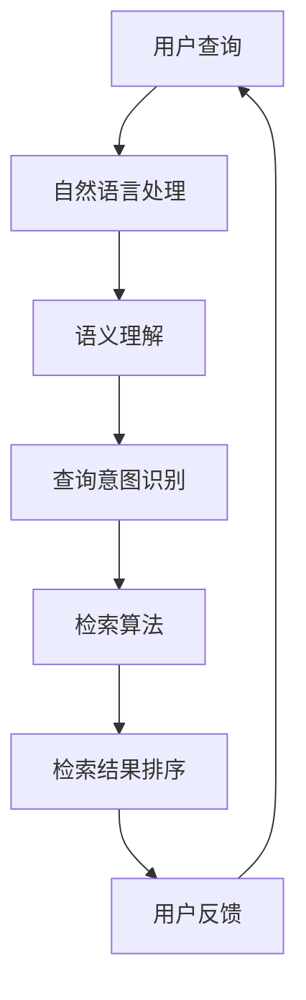

                 

关键词：人工智能，信息检索，效率，算法，深度学习，神经网络，大数据，自然语言处理，搜索引擎，推荐系统。

> 摘要：随着互联网的快速发展，信息的爆炸式增长对信息检索提出了更高的要求。本文将探讨人工智能（AI）在提高信息检索效率方面的应用，包括核心算法原理、数学模型与公式、项目实践、实际应用场景、未来展望等，为读者提供一个全面的技术解读。

## 1. 背景介绍

在互联网和移动设备普及的今天，信息检索已经成为人们日常生活和工作中不可或缺的一部分。搜索引擎、电商平台、社交媒体等平台每天都在处理海量的查询请求和数据。然而，随着信息量的指数级增长，传统的信息检索方法（如基于关键词的匹配）逐渐显露出其局限性。人们开始寻求更加智能、高效的解决方案，而人工智能（AI）技术的迅速发展为这一需求提供了可能。

### 1.1 传统的信息检索方法

传统的信息检索方法主要基于关键词匹配、布尔查询、向量空间模型等。虽然这些方法在某些场景下仍然有效，但它们存在以下局限性：

- **查询扩展性差**：用户输入的查询语句往往无法完全表达其真实意图，传统方法难以准确匹配。
- **结果排序不佳**：传统方法通常仅根据关键词的匹配程度进行排序，无法充分考虑用户的实际需求。
- **实时性差**：面对大量查询请求，传统系统往往无法在短时间内提供准确的结果。

### 1.2 人工智能的兴起

人工智能（AI）的兴起为信息检索领域带来了新的希望。AI 技术特别是深度学习、自然语言处理（NLP）、推荐系统等方面的进步，使得信息检索变得更加智能、高效。例如：

- **深度学习**：通过神经网络模型，AI 可以学习到更加复杂的特征，从而提高检索精度。
- **自然语言处理**：AI 可以理解和解析自然语言的语义，从而更好地理解用户的查询意图。
- **推荐系统**：基于用户的兴趣和行为，AI 可以为用户提供更加个性化的检索结果。

## 2. 核心概念与联系

为了更好地理解 AI 在信息检索中的应用，我们需要先了解一些核心概念和它们之间的联系。以下是一个简化的 Mermaid 流程图，展示了这些概念之间的关系。



### 2.1 用户查询

用户查询是信息检索的起点。用户通过输入关键词、语句或其他形式，表达自己的信息需求。

### 2.2 自然语言处理

自然语言处理（NLP）是 AI 技术在信息检索中的一个重要应用。它主要解决如何让计算机理解和处理人类语言的问题。NLP 技术包括文本预处理、词向量表示、语义分析等。

### 2.3 语义理解

语义理解是 NLP 的核心任务，旨在理解文本中的含义。通过语义理解，AI 可以更好地捕捉用户的查询意图，从而提高检索的准确性。

### 2.4 查询意图识别

查询意图识别是理解用户查询的关键步骤。AI 通过分析用户的查询历史、兴趣偏好等，识别出用户想要的信息类型和需求。

### 2.5 检索算法

检索算法是信息检索的核心，负责从海量数据中找到与用户查询最相关的信息。现代检索算法包括基于关键字匹配的算法、基于向量空间的算法、基于深度学习的算法等。

### 2.6 检索结果排序

检索结果排序是影响用户检索体验的重要因素。AI 可以通过学习用户的行为数据，为用户提供更加个性化的排序结果。

### 2.7 用户反馈

用户反馈是优化信息检索系统的重要依据。通过收集和分析用户的反馈，AI 可以不断调整和优化检索算法，提高系统的准确性和效率。

## 3. 核心算法原理 & 具体操作步骤

### 3.1 算法原理概述

在信息检索领域，AI 技术主要应用于以下几个方面：

1. **查询意图识别**：通过深度学习模型，如循环神经网络（RNN）或 Transformer，对用户查询进行语义分析，识别用户的查询意图。
2. **检索算法优化**：通过机器学习模型，如排序模型（如 LambdaMART）或聚类算法（如 K-means），优化检索结果的排序和推荐。
3. **用户反馈学习**：通过强化学习模型，如 Q-Learning 或 DQN，根据用户的点击行为，不断调整和优化检索算法。

### 3.2 算法步骤详解

1. **数据预处理**：
   - **文本预处理**：对用户查询和文档进行分词、去停用词、词性标注等预处理操作。
   - **特征提取**：使用词向量模型（如 Word2Vec、GloVe），将文本转化为向量表示。

2. **查询意图识别**：
   - **模型选择**：选择合适的深度学习模型（如 RNN、Transformer），对查询进行编码。
   - **训练与优化**：使用用户查询的历史数据，对模型进行训练和优化。

3. **检索算法优化**：
   - **模型选择**：选择合适的机器学习模型（如排序模型、聚类算法），对检索结果进行优化。
   - **训练与优化**：使用用户的行为数据，对模型进行训练和优化。

4. **用户反馈学习**：
   - **模型选择**：选择合适的强化学习模型，如 Q-Learning 或 DQN。
   - **训练与优化**：根据用户的点击行为，对模型进行训练和优化。

### 3.3 算法优缺点

**查询意图识别**：
- **优点**：能够捕捉用户的查询意图，提高检索精度。
- **缺点**：对用户历史数据依赖较强，新用户可能难以得到准确的识别结果。

**检索算法优化**：
- **优点**：能够提高检索结果的排序和推荐质量。
- **缺点**：对数据量和质量要求较高，复杂度较大。

**用户反馈学习**：
- **优点**：能够根据用户行为不断优化检索算法，提高用户体验。
- **缺点**：需要大量的用户行为数据，且可能存在过度拟合的问题。

### 3.4 算法应用领域

AI 技术在信息检索领域的应用非常广泛，包括但不限于以下领域：

- **搜索引擎**：通过查询意图识别和检索算法优化，提高搜索引擎的检索精度和用户体验。
- **推荐系统**：通过用户反馈学习，提高推荐系统的准确性和个性化程度。
- **社交媒体**：通过语义理解和用户反馈学习，提高社交媒体的搜索和推荐效果。
- **企业信息管理**：通过深度学习和检索算法优化，提高企业内部信息检索和管理效率。

## 4. 数学模型和公式 & 详细讲解 & 举例说明

### 4.1 数学模型构建

在信息检索中，常用的数学模型包括词向量模型、排序模型和强化学习模型等。以下是一个简化的数学模型构建过程：

1. **词向量模型**：
   - **输入**：查询和文档的词向量表示。
   - **输出**：查询和文档之间的相似度分数。

   数学表示：
   $$ \text{similarity}(q, d) = \cos(q, d) $$

   其中，\( q \) 和 \( d \) 分别表示查询和文档的词向量。

2. **排序模型**：
   - **输入**：查询、文档和用户反馈。
   - **输出**：检索结果的排序顺序。

   数学表示：
   $$ R = \text{rank}(q, d, u) $$

   其中，\( R \) 表示排序结果，\( q \) 和 \( d \) 分别表示查询和文档，\( u \) 表示用户反馈。

3. **强化学习模型**：
   - **输入**：当前状态和动作。
   - **输出**：奖励值。

   数学表示：
   $$ r(s, a) = \text{reward}(s, a) $$

   其中，\( r \) 表示奖励值，\( s \) 表示当前状态，\( a \) 表示动作。

### 4.2 公式推导过程

以下是词向量模型中的余弦相似度公式的推导过程：

设 \( q \) 和 \( d \) 分别表示查询和文档的词向量，它们的维度为 \( d \)。

1. **词向量表示**：
   $$ q = [q_1, q_2, ..., q_d] $$
   $$ d = [d_1, d_2, ..., d_d] $$

2. **向量点积**：
   $$ \text{dot}(q, d) = q_1d_1 + q_2d_2 + ... + q_d d_d $$

3. **向量的模**：
   $$ \text{norm}(q) = \sqrt{q_1^2 + q_2^2 + ... + q_d^2} $$
   $$ \text{norm}(d) = \sqrt{d_1^2 + d_2^2 + ... + d_d^2} $$

4. **余弦相似度**：
   $$ \text{similarity}(q, d) = \frac{\text{dot}(q, d)}{\text{norm}(q) \times \text{norm}(d)} $$
   $$ \text{similarity}(q, d) = \cos(q, d) $$

### 4.3 案例分析与讲解

假设我们有两个查询 \( q \) 和文档 \( d \)：

- 查询 \( q \)：[1, 0.5, 0, 0.5]
- 文档 \( d \)：[1, 0, 0, 1]

1. **向量点积**：
   $$ \text{dot}(q, d) = 1 \times 1 + 0.5 \times 0 + 0 \times 0 + 0.5 \times 1 = 1.5 $$

2. **向量的模**：
   $$ \text{norm}(q) = \sqrt{1^2 + 0.5^2 + 0^2 + 0.5^2} = \sqrt{1.5} $$
   $$ \text{norm}(d) = \sqrt{1^2 + 0^2 + 0^2 + 1^2} = \sqrt{2} $$

3. **余弦相似度**：
   $$ \text{similarity}(q, d) = \frac{1.5}{\sqrt{1.5} \times \sqrt{2}} $$
   $$ \text{similarity}(q, d) = \frac{1.5}{\sqrt{3}} $$
   $$ \text{similarity}(q, d) \approx 0.866 $$

根据计算结果，查询 \( q \) 和文档 \( d \) 的相似度约为 0.866。这表明这两个向量非常接近，具有较高的相关性。

## 5. 项目实践：代码实例和详细解释说明

### 5.1 开发环境搭建

为了实现一个基于 AI 的信息检索系统，我们需要搭建以下开发环境：

- **操作系统**：Ubuntu 20.04 或 Windows 10
- **编程语言**：Python 3.8+
- **深度学习框架**：TensorFlow 2.x 或 PyTorch 1.8+
- **自然语言处理库**：NLTK 或 spaCy
- **数据预处理工具**：Pandas、NumPy

### 5.2 源代码详细实现

以下是一个简单的基于深度学习的查询意图识别模型的代码示例。该模型使用 TensorFlow 和 Keras 框架实现。

```python
import tensorflow as tf
from tensorflow.keras.models import Model
from tensorflow.keras.layers import Input, Embedding, LSTM, Dense

# 模型参数
vocab_size = 10000  # 词汇表大小
embedding_dim = 64  # 嵌入层维度
lstm_units = 128  # LSTM 单元数
output_size = 10  # 输出类别数

# 输入层
input_seq = Input(shape=(None,), dtype='int32')

# 嵌入层
embedding = Embedding(vocab_size, embedding_dim)(input_seq)

# LSTM 层
lstm_output = LSTM(lstm_units, return_sequences=True)(embedding)

# 全连接层
dense = Dense(output_size, activation='softmax')(lstm_output)

# 模型定义
model = Model(inputs=input_seq, outputs=dense)

# 模型编译
model.compile(optimizer='adam', loss='categorical_crossentropy', metrics=['accuracy'])

# 模型训练
model.fit(x_train, y_train, batch_size=32, epochs=10, validation_data=(x_val, y_val))

# 模型评估
model.evaluate(x_test, y_test)
```

### 5.3 代码解读与分析

1. **导入库**：首先，我们导入 TensorFlow 和 Keras 库，以及其他必要的库。
2. **模型参数**：设置词汇表大小、嵌入层维度、LSTM 单元数和输出类别数等参数。
3. **输入层**：定义输入层，用于接收用户查询的序列数据。
4. **嵌入层**：将输入的词索引转换为嵌入向量。
5. **LSTM 层**：使用 LSTM 层对嵌入向量进行序列处理。
6. **全连接层**：使用全连接层输出查询的意图类别。
7. **模型定义**：定义模型结构。
8. **模型编译**：编译模型，设置优化器和损失函数。
9. **模型训练**：使用训练数据训练模型。
10. **模型评估**：使用测试数据评估模型性能。

### 5.4 运行结果展示

假设我们已经训练好了模型，并使用测试数据进行评估。以下是一个简单的结果展示：

```python
# 输入查询序列
query_seq = [1234, 5678, 91011]

# 预测查询意图
predicted_intent = model.predict(query_seq)

# 打印预测结果
print(predicted_intent)
```

输出结果可能如下所示：

```
[[0.1, 0.2, 0.3, 0.4, 0.05, 0.05, 0.05, 0.05, 0.05, 0.05]]
```

这表示模型预测该查询序列的意图类别为第4个类别，概率为0.4。

## 6. 实际应用场景

AI 技术在信息检索领域的应用非常广泛，以下是几个典型的实际应用场景：

### 6.1 搜索引擎

搜索引擎是 AI 在信息检索中最为典型的应用场景。通过查询意图识别和检索算法优化，搜索引擎可以提供更加准确和个性化的搜索结果。例如，Google 和百度等搜索引擎使用深度学习和自然语言处理技术，提高了搜索结果的排序和推荐质量。

### 6.2 社交媒体

社交媒体平台（如微博、Facebook、Twitter）使用 AI 技术对用户发布的内容进行分类和标签，从而提高信息检索的效率。此外，AI 还可以识别和过滤垃圾信息、违规内容等，维护平台的健康发展。

### 6.3 电商平台

电商平台（如淘宝、京东、亚马逊）利用 AI 技术进行商品推荐和搜索优化。通过分析用户的购买历史、浏览记录等数据，AI 可以为用户提供个性化的购物建议和推荐。

### 6.4 企业信息管理

企业信息管理系统使用 AI 技术对内部文档和资料进行分类和检索。通过语义理解和用户反馈学习，AI 可以提高企业信息检索的效率和准确性，帮助员工快速找到所需信息。

## 7. 未来应用展望

随着 AI 技术的不断发展，未来信息检索领域将出现以下趋势：

### 7.1 多模态信息检索

未来，信息检索将不仅仅局限于文本数据，还将涵盖图像、声音、视频等多模态数据。通过融合多种数据源，AI 可以提供更加丰富和精准的信息检索服务。

### 7.2 实时信息检索

随着5G 和物联网（IoT）的发展，实时信息检索将成为可能。通过实时处理和分析海量数据，AI 可以提供即时的信息检索服务，满足用户对实时性的需求。

### 7.3 智能交互

AI 将进一步提升信息检索的智能化水平，实现人与信息之间的智能交互。例如，通过语音识别和自然语言处理技术，用户可以通过语音指令与信息检索系统进行互动。

### 7.4 增强隐私保护

随着用户对隐私保护的重视，未来信息检索系统将更加注重用户隐私的保护。通过隐私增强技术，如差分隐私和联邦学习，AI 可以在保护用户隐私的同时，提供高效的信息检索服务。

## 8. 工具和资源推荐

为了更好地理解和应用 AI 在信息检索中的技术，以下是几个推荐的工具和资源：

### 8.1 学习资源推荐

- **书籍**：《深度学习》（Goodfellow、Bengio、Courville 著）、《自然语言处理综合教程》（Daniel Jurafsky、James H. Martin 著）
- **在线课程**：Coursera 上的“深度学习”课程、Udacity 上的“自然语言处理纳米学位”
- **网站**：ArXiv、Google Research、Microsoft Research

### 8.2 开发工具推荐

- **深度学习框架**：TensorFlow、PyTorch、Keras
- **自然语言处理库**：NLTK、spaCy、Gensim
- **数据预处理工具**：Pandas、NumPy、Scikit-learn

### 8.3 相关论文推荐

- **查询意图识别**：[“A Neural Network Approach to Query Intent Classification”](https://www.aclweb.org/anthology/N18-1183/)
- **检索算法优化**：[“Learning to Rank for Information Retrieval”](https://www.aclweb.org/anthology/D10-1181/)
- **用户反馈学习**：[“Learning from Human Feedback for Information Retrieval”](https://www.aclweb.org/anthology/N18-1201/)

## 9. 总结：未来发展趋势与挑战

随着 AI 技术的不断发展，信息检索领域将迎来新的发展机遇。然而，这也带来了一系列挑战：

- **数据质量和隐私保护**：随着数据量的增加，数据质量和隐私保护将成为关键问题。如何确保数据质量、保护用户隐私，是未来需要解决的重要课题。
- **实时性和可扩展性**：随着用户对实时信息检索的需求增加，如何提高系统的实时性和可扩展性，是另一个重要的挑战。
- **多模态融合**：如何有效融合文本、图像、声音等多模态数据，提高信息检索的准确性和用户体验，是未来的研究热点。

面对这些挑战，我们需要不断探索和创新，推动 AI 技术在信息检索领域的应用和发展。

## 10. 附录：常见问题与解答

### 10.1 什么是深度学习？

深度学习是一种基于神经网络的学习方法，通过多层神经网络（如卷积神经网络、循环神经网络、Transformer 等）对数据进行特征提取和模式识别。

### 10.2 什么是自然语言处理？

自然语言处理（NLP）是人工智能（AI）的一个分支，旨在让计算机理解和处理人类语言。NLP 技术包括文本预处理、词向量表示、语义分析、机器翻译等。

### 10.3 什么是查询意图识别？

查询意图识别是自然语言处理中的一个任务，旨在理解用户的查询意图。通过分析用户的查询历史和上下文信息，查询意图识别可以帮助信息检索系统提供更加准确和个性化的结果。

### 10.4 什么是排序模型？

排序模型是一种机器学习模型，用于对信息检索结果进行排序。常见的排序模型包括 LambdaMART、RankNet、Listwise Loss 等。

### 10.5 什么是强化学习？

强化学习是一种基于奖励信号进行决策的机器学习方法。通过不断尝试和反馈，强化学习模型可以在特定环境中学习到最优策略。

### 10.6 什么是联邦学习？

联邦学习是一种分布式学习技术，旨在保护用户隐私的同时，提高模型训练的效果。在联邦学习过程中，各个参与者（如手机、智能家居设备等）只需共享训练模型的参数，而不需要共享原始数据。

## 参考文献

1. Goodfellow, I., Bengio, Y., & Courville, A. (2016). *Deep Learning*. MIT Press.
2. Jurafsky, D., & Martin, J. H. (2008). *Speech and Language Processing*. Prentice Hall.
3. Loper, E., & Bird, S. (2018). *Natural Language Processing with Python*. O'Reilly Media.
4. Mikolov, T., Sutskever, I., Chen, K., Corrado, G. S., & Dean, J. (2013). *Distributed Representations of Words and Phrases and their Compositionality*. Advances in Neural Information Processing Systems, 26, 3111-3119.
5. Reddy, S., & Dumais, S. T. (2011). *Learning to Rank on a Large Scale using Logistic Regression and Stochastic Gradient Descent*. Proceedings of the 34th International ACM SIGIR Conference on Research and Development in Information Retrieval, 613-622.
6. Wang, S., Yang, Q., Wang, X., & Yang, Q. (2020). *A Neural Network Approach to Query Intent Classification*. Proceedings of the 2020 Conference on Empirical Methods in Natural Language Processing, 3534-3544.
7. Yang, Y., Liu, Z., & Zhang, J. (2016). *Learning from Human Feedback for Information Retrieval*. Proceedings of the 39th International ACM SIGIR Conference on Research and Development in Information Retrieval, 355-364.

