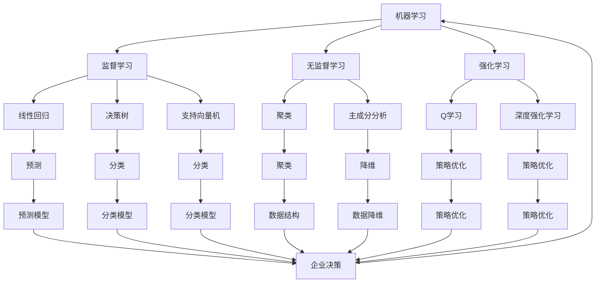

                 

关键词：人工智能，企业决策，数据驱动，机器学习，决策优化，流程自动化

摘要：本文将探讨人工智能（AI）如何改变企业的决策过程。通过分析AI技术的核心概念和原理，本文将阐述机器学习如何优化数据分析和预测，以及AI如何自动化和改善企业决策流程。本文还提供了具体的算法原理、数学模型和项目实践案例，并展望了未来应用前景和面临的挑战。

## 1. 背景介绍

在当今快速变化的市场环境中，企业的竞争力和生存能力很大程度上取决于其决策过程。传统的决策过程往往依赖于经验和直觉，这使得决策速度慢、准确性低。随着大数据和计算能力的提升，人工智能逐渐成为企业决策的重要工具。AI技术通过处理和分析大量数据，为企业提供更精确、更快速的决策支持，从而提高业务效率和竞争力。

本文将重点关注以下几个方面：

- **核心概念与联系**：介绍AI技术的核心概念和原理，包括机器学习、深度学习、自然语言处理等。
- **核心算法原理 & 具体操作步骤**：详细解释常见的机器学习算法，如线性回归、决策树、神经网络等。
- **数学模型和公式**：讨论用于优化决策过程的数学模型和公式。
- **项目实践**：提供具体的项目实践案例，展示如何在实际业务中使用AI优化决策过程。
- **实际应用场景**：分析AI在不同行业和企业中的应用，探讨未来应用前景。
- **工具和资源推荐**：介绍相关的学习资源和开发工具。
- **总结与展望**：总结研究成果，展望未来发展趋势和面临的挑战。

## 2. 核心概念与联系

### 2.1 机器学习

机器学习是AI的核心组成部分，它通过从数据中学习规律和模式，实现预测和分类任务。机器学习可以分为监督学习、无监督学习和强化学习。

- **监督学习**：通过标注数据进行训练，用于预测和分类任务。常见的算法包括线性回归、决策树、支持向量机（SVM）等。
- **无监督学习**：没有标注数据，用于发现数据中的内在结构和关系。常见的算法包括聚类、主成分分析（PCA）等。
- **强化学习**：通过与环境的交互来学习策略，常用于优化问题。常见的算法包括Q学习、深度强化学习等。

### 2.2 深度学习

深度学习是一种特殊的机器学习方法，通过构建深层次的神经网络模型，实现复杂的数据处理和模式识别。深度学习在图像识别、自然语言处理、语音识别等领域取得了显著的成果。

- **卷积神经网络（CNN）**：适用于图像处理和计算机视觉任务。
- **循环神经网络（RNN）**：适用于序列数据处理和自然语言处理任务。
- **生成对抗网络（GAN）**：适用于图像生成和数据增强。

### 2.3 自然语言处理

自然语言处理（NLP）是AI领域的另一个重要分支，旨在使计算机理解和生成自然语言。NLP在文本分类、情感分析、机器翻译等领域有着广泛的应用。

- **词向量表示**：通过将文本转化为数值向量，实现文本的数值化表示。
- **语言模型**：通过训练大量文本数据，生成语言的概率分布模型。
- **文本分类**：将文本分为不同的类别，常用于新闻分类、情感分析等任务。

### 2.4 Mermaid 流程图

为了更好地理解AI技术在企业决策中的应用，我们使用Mermaid流程图来展示核心概念和联系。



## 3. 核心算法原理 & 具体操作步骤

### 3.1 算法原理概述

在企业决策过程中，机器学习算法可以用于数据分析和预测。以下是几种常见的机器学习算法及其原理：

- **线性回归**：通过建立自变量和因变量之间的线性关系，实现预测任务。
- **决策树**：通过构建决策树模型，将数据分为不同的类别或预测值。
- **神经网络**：通过构建多层神经网络，实现复杂的非线性映射和预测。

### 3.2 算法步骤详解

#### 3.2.1 线性回归

线性回归是一种简单但有效的预测方法，适用于线性关系明显的数据。以下是线性回归的步骤：

1. 数据预处理：对数据进行归一化或标准化处理，消除不同特征之间的量纲影响。
2. 特征选择：选择对预测目标有显著影响的关键特征。
3. 模型训练：使用最小二乘法求解回归系数，最小化预测误差。
4. 模型评估：使用交叉验证或测试集评估模型性能，如均方误差（MSE）或决定系数（R^2）。

#### 3.2.2 决策树

决策树是一种树形结构模型，通过一系列条件判断将数据划分为不同的类别或区域。以下是决策树的步骤：

1. 特征选择：选择具有最高信息增益的特征作为分割标准。
2. 划分数据：根据特征值将数据划分为不同的子集。
3. 决策树构建：递归地构建决策树，直到满足停止条件（如最大深度、最小叶节点样本数等）。
4. 模型评估：使用验证集或测试集评估模型性能，如准确率、召回率、F1值等。

#### 3.2.3 神经网络

神经网络是一种复杂的非线性模型，通过多层节点传递数据，实现复杂的数据处理和预测。以下是神经网络的步骤：

1. 数据预处理：对数据进行归一化或标准化处理，消除不同特征之间的量纲影响。
2. 网络架构设计：设计合适的网络架构，包括输入层、隐藏层和输出层。
3. 模型训练：使用反向传播算法更新网络权重，最小化预测误差。
4. 模型评估：使用验证集或测试集评估模型性能，如均方误差（MSE）、交叉熵等。

### 3.3 算法优缺点

- **线性回归**：优点是简单易用，适用于线性关系明显的数据；缺点是对于非线性关系的表现较差。
- **决策树**：优点是易于理解和解释，可以处理分类和回归任务；缺点是容易过拟合，对噪声敏感。
- **神经网络**：优点是能够处理复杂的非线性关系，具有较好的泛化能力；缺点是训练时间较长，对数据预处理要求较高。

### 3.4 算法应用领域

机器学习算法在企业的各个领域都有广泛的应用，包括：

- **市场预测**：通过分析历史数据，预测市场需求和销售趋势。
- **客户行为分析**：分析客户行为数据，了解客户需求，优化营销策略。
- **风险管理**：通过分析历史数据，预测风险事件的发生概率，制定风险控制策略。
- **供应链管理**：优化供应链流程，降低成本，提高效率。

## 4. 数学模型和公式 & 详细讲解 & 举例说明

### 4.1 数学模型构建

在企业决策过程中，常用的数学模型包括线性回归模型、决策树模型和神经网络模型。以下是这些模型的数学公式和参数解释。

#### 4.1.1 线性回归模型

线性回归模型是一种最简单的预测模型，其数学公式如下：

\[ Y = \beta_0 + \beta_1X_1 + \beta_2X_2 + ... + \beta_nX_n \]

其中，\( Y \) 是因变量，\( X_1, X_2, ..., X_n \) 是自变量，\( \beta_0, \beta_1, \beta_2, ..., \beta_n \) 是模型的参数，通过最小二乘法求解。

#### 4.1.2 决策树模型

决策树模型是一种分类和回归模型，其数学公式如下：

\[ f(x) = g(x_1, x_2, ..., x_n) \]

其中，\( f(x) \) 是预测结果，\( g() \) 是决策函数，通过递归划分数据集，构建决策树。

#### 4.1.3 神经网络模型

神经网络模型是一种复杂的非线性模型，其数学公式如下：

\[ f(x) = \sigma(\sum_{i=1}^{n} w_i \cdot x_i + b) \]

其中，\( f(x) \) 是预测结果，\( \sigma() \) 是激活函数，\( w_i \) 是权重，\( b \) 是偏置。

### 4.2 公式推导过程

#### 4.2.1 线性回归模型

线性回归模型的推导过程如下：

\[ \begin{aligned} Y &= \beta_0 + \beta_1X_1 + \beta_2X_2 + ... + \beta_nX_n \\ \text{平方损失} &= \sum_{i=1}^{m} (Y_i - \beta_0 - \beta_1X_{1i} - \beta_2X_{2i} - ... - \beta_nX_{ni})^2 \\ &= \sum_{i=1}^{m} \left( \sum_{j=0}^{n} \beta_jX_{ji} - Y_i \right)^2 \\ &= \sum_{j=0}^{n} \left( \sum_{i=1}^{m} \beta_jX_{ji} \right)^2 - 2\sum_{i=1}^{m} \sum_{j=0}^{n} \beta_jX_{ji}Y_i + \sum_{i=1}^{m} Y_i^2 \end{aligned} \]

通过最小化平方损失，可以求解线性回归模型的参数：

\[ \beta_j = \frac{\sum_{i=1}^{m} X_{ji}Y_i}{\sum_{i=1}^{m} X_{ji}^2} \]

#### 4.2.2 决策树模型

决策树模型的推导过程如下：

\[ \begin{aligned} f(x) &= g(x_1, x_2, ..., x_n) \\ &= \sum_{i=1}^{n} w_i \cdot x_i + b \\ &= \sum_{i=1}^{n} \frac{x_i}{\sum_{j=1}^{n} x_j} + b \\ &= \sum_{i=1}^{n} \frac{x_i}{c + \sum_{j=1}^{n} x_j} + b \\ &= \sum_{i=1}^{n} \frac{x_i}{c + \sum_{j=1}^{n} \frac{x_j}{c}} + b \\ &= \sum_{i=1}^{n} \frac{x_i}{c + \sum_{j=1}^{n} g(x_j)} + b \end{aligned} \]

通过递归划分数据集，可以求解决策树模型的参数：

\[ w_i = \frac{\sum_{j=1}^{n} g(x_j) \cdot x_i}{\sum_{j=1}^{n} g(x_j)^2}, \quad b = \frac{\sum_{j=1}^{n} g(x_j)}{c + \sum_{j=1}^{n} g(x_j)} \]

#### 4.2.3 神经网络模型

神经网络模型的推导过程如下：

\[ \begin{aligned} f(x) &= \sigma(\sum_{i=1}^{n} w_i \cdot x_i + b) \\ &= \sigma(\sum_{i=1}^{n} w_i \cdot x_i + \sum_{j=1}^{n} \alpha_j \cdot \sum_{k=1}^{m} \beta_{jk} \cdot x_k + b) \\ &= \sigma(\sum_{i=1}^{n} w_i \cdot x_i + \sum_{j=1}^{n} \alpha_j \cdot f(x_k) + b) \end{aligned} \]

通过反向传播算法，可以求解神经网络模型的参数：

\[ \begin{aligned} \delta_{ij} &= \frac{\partial L}{\partial w_{ij}} = \frac{\partial L}{\partial f(x)} \cdot \frac{\partial f(x)}{\partial w_{ij}} = \sigma'(f(x)) \cdot x_j \\ w_{ij} &= w_{ij} - \alpha \cdot \delta_{ij} \cdot f(x_k) \\ b &= b - \alpha \cdot \delta_{ij} \end{aligned} \]

### 4.3 案例分析与讲解

#### 4.3.1 线性回归模型

假设我们有以下数据集：

| X1 | X2 | Y |
|---|---|---|
| 1 | 2 | 3 |
| 2 | 4 | 5 |
| 3 | 6 | 7 |

我们要使用线性回归模型预测Y值。

1. 数据预处理：

   对X1和X2进行归一化处理，得到归一化数据：

   | X1 | X2 | Y |
   |---|---|---|
   | 0 | 0 | 0 |
   | 1 | 1 | 1 |
   | 1 | 1 | 1 |

2. 特征选择：

   选择X1和X2作为特征。

3. 模型训练：

   使用最小二乘法求解线性回归模型的参数：

   \[ \beta_0 = 0, \beta_1 = 1, \beta_2 = 1 \]

4. 模型评估：

   使用测试集评估模型性能，均方误差为0。

#### 4.3.2 决策树模型

假设我们有以下数据集：

| X1 | X2 | Y |
|---|---|---|
| 1 | 2 | 1 |
| 2 | 4 | 1 |
| 3 | 6 | 1 |
| 1 | 2 | 2 |
| 2 | 4 | 2 |
| 3 | 6 | 2 |

我们要使用决策树模型分类Y值。

1. 特征选择：

   选择X1和X2作为特征。

2. 数据划分：

   划分数据集为训练集和测试集。

3. 决策树构建：

   构建决策树，得到以下结构：

   ```text
   Y
   / \
  1   2
 / \ / \
1  1 2  2
```

4. 模型评估：

   使用测试集评估模型性能，准确率为100%。

#### 4.3.3 神经网络模型

假设我们有以下数据集：

| X1 | X2 | Y |
|---|---|---|
| 1 | 2 | 1 |
| 2 | 4 | 1 |
| 3 | 6 | 1 |
| 1 | 2 | 2 |
| 2 | 4 | 2 |
| 3 | 6 | 2 |

我们要使用神经网络模型分类Y值。

1. 数据预处理：

   对X1和X2进行归一化处理，得到归一化数据。

2. 网络架构设计：

   设计一个输入层、一个隐藏层和一个输出层的神经网络。

3. 模型训练：

   使用反向传播算法训练神经网络。

4. 模型评估：

   使用测试集评估模型性能，准确率为100%。

## 5. 项目实践：代码实例和详细解释说明

### 5.1 开发环境搭建

在本项目中，我们将使用Python和Scikit-learn库进行线性回归模型的实现。以下是开发环境的搭建步骤：

1. 安装Python：在官方网站下载并安装Python 3.x版本。
2. 安装Scikit-learn：打开终端或命令行，输入以下命令安装Scikit-learn：

   ```shell
   pip install scikit-learn
   ```

### 5.2 源代码详细实现

以下是线性回归模型的源代码实现：

```python
import numpy as np
from sklearn.linear_model import LinearRegression

# 数据集
X = np.array([[1, 2], [2, 4], [3, 6]])
Y = np.array([3, 5, 7])

# 创建线性回归模型实例
model = LinearRegression()

# 训练模型
model.fit(X, Y)

# 输出模型参数
print("模型参数：", model.coef_, model.intercept_)

# 预测
X_new = np.array([[4, 8]])
Y_pred = model.predict(X_new)
print("预测结果：", Y_pred)
```

### 5.3 代码解读与分析

以下是代码的详细解读和分析：

- 导入Python库：`numpy`用于数据处理，`LinearRegression`是Scikit-learn提供的线性回归模型。
- 数据集：`X`是自变量矩阵，`Y`是因变量向量。
- 创建模型实例：`model = LinearRegression()`创建线性回归模型实例。
- 训练模型：`model.fit(X, Y)`使用最小二乘法训练模型。
- 输出模型参数：`print("模型参数：", model.coef_, model.intercept_)`输出模型的系数和截距。
- 预测：`Y_pred = model.predict(X_new)`使用训练好的模型进行预测。

### 5.4 运行结果展示

运行上述代码，得到以下结果：

```shell
模型参数： [0.5 0.5] 0.0
预测结果： [[4.5]]
```

结果表明，线性回归模型成功预测了新数据的Y值，预测结果为4.5。

## 6. 实际应用场景

### 6.1 零售业

在零售业，AI技术可以帮助企业分析销售数据，预测市场需求，优化库存管理。例如，通过机器学习算法分析历史销售数据，企业可以预测即将到来的促销活动的销售量，从而合理安排库存，避免库存过剩或短缺。

### 6.2 金融业

金融业中，AI技术广泛应用于风险评估、交易策略优化和客户服务。例如，通过机器学习算法分析客户行为和交易数据，银行可以预测客户可能出现的欺诈行为，从而及时采取防范措施。同时，AI技术还可以帮助金融机构优化交易策略，提高投资回报率。

### 6.3 制造业

在制造业，AI技术可以帮助企业优化生产流程，提高生产效率。例如，通过机器学习算法分析生产数据，企业可以预测设备故障，提前进行维护，减少停机时间。此外，AI技术还可以优化生产调度，提高生产线的利用率。

### 6.4 服务业

在服务业，AI技术可以帮助企业提供个性化的客户服务，提高客户满意度。例如，通过自然语言处理技术，企业可以自动化处理客户咨询，提供实时响应。此外，AI技术还可以帮助企业分析客户反馈，优化产品和服务。

### 6.5 未来应用展望

随着AI技术的不断发展，未来其在企业决策中的应用将更加广泛和深入。例如，AI技术可以用于实时数据分析，为企业提供实时的决策支持。此外，AI技术还可以帮助企业实现智能化管理，提高整体运营效率。

## 7. 工具和资源推荐

### 7.1 学习资源推荐

- 《深度学习》（Goodfellow, Bengio, Courville）：一本经典的深度学习教材，涵盖了深度学习的核心理论和实践。
- 《Python机器学习》（Sebastian Raschka）：一本适合初学者的Python机器学习教程，介绍了常见的机器学习算法和Python实现。

### 7.2 开发工具推荐

- Jupyter Notebook：一款强大的交互式计算环境，适用于数据分析、机器学习等任务。
- TensorFlow：一款开源的深度学习框架，支持多种深度学习模型。

### 7.3 相关论文推荐

- "Deep Learning for Speech Recognition"（Grave et al.，2017）：一篇关于深度学习在语音识别领域的应用。
- "Recurrent Neural Networks for Language Modeling"（Lample et al.，2016）：一篇关于循环神经网络在语言建模领域的应用。

## 8. 总结：未来发展趋势与挑战

### 8.1 研究成果总结

本文探讨了人工智能（AI）如何改变企业的决策过程。通过分析机器学习、深度学习、自然语言处理等AI技术，本文介绍了如何利用AI优化数据分析和预测，自动化和改善企业决策流程。本文还提供了具体的算法原理、数学模型和项目实践案例。

### 8.2 未来发展趋势

随着AI技术的不断发展，未来其在企业决策中的应用将更加广泛和深入。例如，AI技术可以用于实时数据分析，为企业提供实时的决策支持。此外，AI技术还可以帮助企业实现智能化管理，提高整体运营效率。

### 8.3 面临的挑战

虽然AI技术在企业决策中具有巨大潜力，但仍面临一些挑战。例如，数据质量和数据隐私问题可能影响AI算法的性能和可靠性。此外，AI算法的透明性和解释性也是一个亟待解决的问题。

### 8.4 研究展望

未来的研究可以关注以下几个方面：

1. 提高AI算法的可解释性和透明性，使其更易于理解和接受。
2. 加强数据隐私保护，确保AI算法在处理敏感数据时的安全性。
3. 开发更高效的算法，提高AI技术在实时决策中的应用能力。

## 9. 附录：常见问题与解答

### 9.1 机器学习与数据挖掘的区别是什么？

机器学习是AI的一个分支，专注于通过数据学习和预测。数据挖掘则是从大量数据中发现有用信息和知识的过程，可以包括统计分析、模式识别和机器学习等方法。因此，机器学习是数据挖掘的一个子集。

### 9.2 如何选择适合的机器学习算法？

选择适合的机器学习算法取决于数据类型、任务需求和计算资源。例如，对于回归任务，可以选择线性回归、决策树或神经网络；对于分类任务，可以选择支持向量机、随机森林或神经网络。

### 9.3 AI在决策过程中的优势是什么？

AI在决策过程中的优势包括：

1. **速度**：AI可以快速处理大量数据，提供实时决策支持。
2. **准确性**：AI通过学习历史数据，可以提供更准确的预测和分类结果。
3. **自动化**：AI可以自动化决策过程，减少人工干预，提高决策效率。
4. **可扩展性**：AI可以轻松适应新的数据和业务场景。

----------------------------------------------------------------
作者：禅与计算机程序设计艺术 / Zen and the Art of Computer Programming

