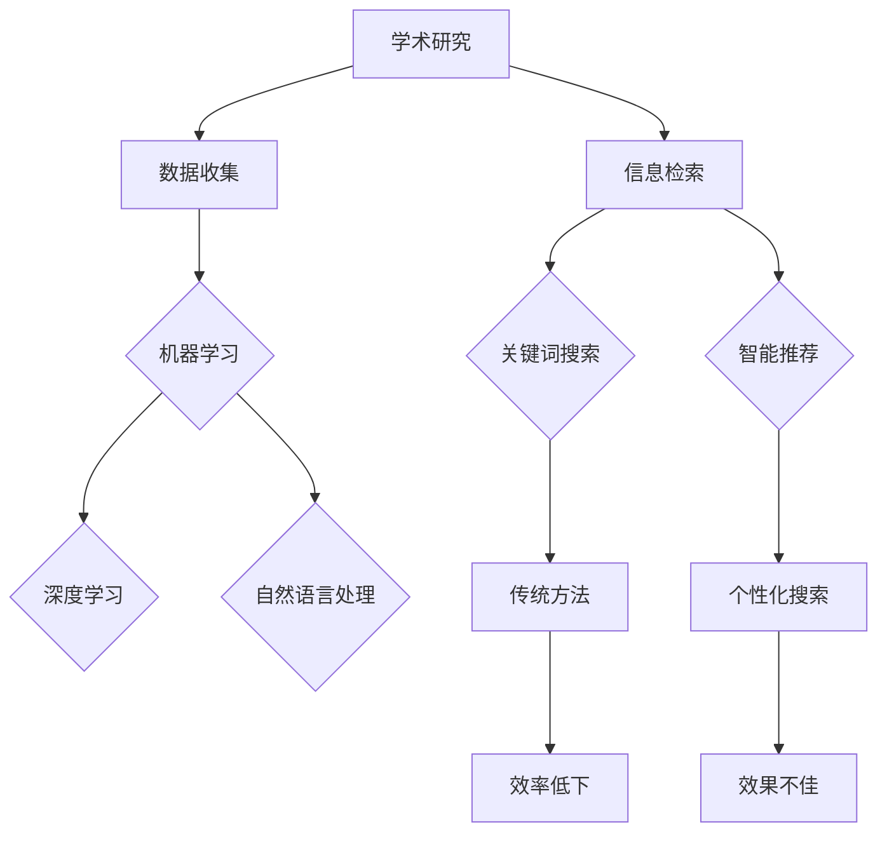

                 

关键词：人工智能，学术研究，信息检索，算法，数学模型，实际应用，未来展望

## 摘要

本文旨在探讨人工智能（AI）对学术研究和信息检索领域的影响。随着AI技术的不断进步，学术界和信息检索领域正经历着一场革命。本文将介绍AI的核心概念及其与学术研究和信息检索的关联，深入探讨AI算法的原理、数学模型，并通过具体项目实践展示其在实际应用中的效果。最后，本文将对未来AI在学术研究和信息检索领域的应用前景进行展望，并指出面临的挑战。

## 1. 背景介绍

在过去的几十年中，学术研究和信息检索经历了巨大的变革。随着互联网的普及和信息的爆炸式增长，研究人员面临着海量的数据，这既为学术研究提供了丰富的资源，也带来了信息过载的挑战。传统的学术研究和信息检索方法往往依赖于人工筛选和分类，效率低下，难以应对庞大的数据量。

与此同时，人工智能技术的发展为学术研究和信息检索带来了新的机遇。AI技术，特别是机器学习和深度学习，可以通过对大规模数据的学习和分析，自动识别模式、预测趋势，从而提高学术研究的效率和准确性。此外，AI技术还可以自动化信息检索过程，通过智能搜索和推荐系统，帮助研究人员快速找到所需的信息，提高信息检索的效率。

### 1.1 学术研究的现状

学术研究是一个复杂的过程，涉及数据的收集、处理、分析和解释。传统的学术研究方法主要依赖于实验、观察和统计分析。然而，随着研究领域的不断扩大，数据量级的增长，传统的手工处理方法已经难以满足需求。研究人员需要更加高效、准确的方法来处理和分析海量数据，从而提高研究的效率和质量。

### 1.2 信息检索的现状

信息检索是学术研究的重要组成部分，它帮助研究人员找到相关的文献、数据和研究结果。传统的信息检索方法主要依赖于关键词搜索和分类索引。这种方法虽然能够在一定程度上满足需求，但在面对复杂、模糊的查询需求时，效果不佳。此外，信息检索系统往往缺乏对用户意图的理解，难以提供个性化的搜索结果。

## 2. 核心概念与联系

在探讨AI如何改变学术研究和信息检索之前，我们首先需要了解一些核心概念，如机器学习、深度学习、自然语言处理等。这些概念构成了AI的基础，是AI改变学术研究和信息检索的关键。

### 2.1 机器学习

机器学习是AI的核心技术之一，它使计算机系统能够从数据中学习，进行预测和决策。机器学习的基本原理是使用算法来发现数据中的模式，然后根据这些模式进行预测。常见的机器学习算法包括线性回归、逻辑回归、支持向量机、决策树等。

### 2.2 深度学习

深度学习是机器学习的一个分支，它使用多层神经网络来模拟人类大脑的思考方式。深度学习通过不断调整网络中的权重和偏置，使系统能够从大量数据中自动提取特征。深度学习在图像识别、语音识别、自然语言处理等领域取得了显著的成果。

### 2.3 自然语言处理

自然语言处理是AI的一个重要领域，它致力于使计算机能够理解和处理自然语言。自然语言处理的核心技术包括文本分类、实体识别、语义理解、机器翻译等。

### 2.4 Mermaid 流程图

以下是一个简单的Mermaid流程图，展示了机器学习、深度学习和自然语言处理在学术研究和信息检索中的应用：



## 3. 核心算法原理 & 具体操作步骤

### 3.1 算法原理概述

AI在学术研究和信息检索中的应用主要依赖于机器学习、深度学习和自然语言处理算法。这些算法的基本原理是通过大量数据的学习，自动提取特征，进行预测和分类。

### 3.2 算法步骤详解

1. 数据收集与预处理
   - 收集相关的数据，如学术论文、会议记录、专利信息等。
   - 对数据进行清洗和预处理，包括去除噪声、缺失值填充、数据标准化等。

2. 特征提取
   - 使用机器学习算法提取数据中的特征，如文本分类中的词袋模型、TF-IDF等。
   - 使用深度学习算法自动提取高级特征，如卷积神经网络（CNN）在图像处理中的应用。

3. 模型训练与验证
   - 使用训练数据集对模型进行训练，不断调整参数，优化模型性能。
   - 使用验证数据集对模型进行验证，确保模型能够在未见过的数据上表现良好。

4. 模型部署与应用
   - 将训练好的模型部署到生产环境中，实现自动化处理。
   - 根据应用场景，使用模型进行预测、分类或信息检索。

### 3.3 算法优缺点

- 优点：
  - 高效：AI算法能够处理海量数据，大幅提高学术研究和信息检索的效率。
  - 准确：通过大量数据的学习，AI算法能够自动提取特征，提高预测和分类的准确性。
  - 自动化：AI算法能够自动化学术研究和信息检索过程，减轻人工负担。

- 缺点：
  - 需要大量数据：AI算法对数据量有较高的要求，数据不足会影响模型的性能。
  - 解释性不足：AI算法的决策过程往往较为复杂，难以解释。

### 3.4 算法应用领域

- 学术研究：AI技术在学术论文推荐、研究领域分类、学术趋势预测等方面有广泛应用。
- 信息检索：AI技术在智能搜索、个性化推荐、信息过滤等方面有广泛应用。

## 4. 数学模型和公式 & 详细讲解 & 举例说明

### 4.1 数学模型构建

在AI算法中，数学模型起到了关键作用。以下是一个简单的线性回归模型：

$$y = wx + b$$

其中，$y$ 是目标变量，$x$ 是特征变量，$w$ 是权重，$b$ 是偏置。

### 4.2 公式推导过程

线性回归模型的推导过程如下：

1. 损失函数：
   $$L(w, b) = \frac{1}{2}\sum_{i=1}^{n}(y_i - wx_i - b)^2$$

2. 梯度下降法：
   - 对 $w$ 求导：
     $$\frac{\partial L}{\partial w} = -\sum_{i=1}^{n}(y_i - wx_i - b)x_i$$
   - 对 $b$ 求导：
     $$\frac{\partial L}{\partial b} = -\sum_{i=1}^{n}(y_i - wx_i - b)$$

3. 更新公式：
   $$w = w - \alpha \frac{\partial L}{\partial w}$$
   $$b = b - \alpha \frac{\partial L}{\partial b}$$

其中，$\alpha$ 是学习率。

### 4.3 案例分析与讲解

假设我们要预测房价，特征变量包括房屋面积、位置等。使用线性回归模型，我们可以建立以下公式：

$$y = 0.5x_1 + 0.3x_2 + b$$

通过训练数据集，我们可以得到权重 $w$ 和偏置 $b$，从而预测新房屋的房价。例如，对于一个面积为100平方米、位于城市的房屋，我们可以预测其房价为：

$$y = 0.5 \times 100 + 0.3 \times 100 + b$$

## 5. 项目实践：代码实例和详细解释说明

### 5.1 开发环境搭建

为了演示AI在学术研究和信息检索中的应用，我们将使用Python编程语言和相关的库，如NumPy、Pandas、Scikit-learn等。首先，我们需要搭建开发环境：

```bash
# 安装Python
pip install python

# 安装NumPy、Pandas、Scikit-learn
pip install numpy pandas scikit-learn
```

### 5.2 源代码详细实现

以下是一个简单的线性回归模型的实现：

```python
import numpy as np
import pandas as pd
from sklearn.linear_model import LinearRegression

# 加载数据
data = pd.read_csv('data.csv')
X = data[['area', 'location']]
y = data['price']

# 创建线性回归模型
model = LinearRegression()

# 模型训练
model.fit(X, y)

# 模型预测
predicted_price = model.predict([[100, 'city']])

print('预测房价：', predicted_price)
```

### 5.3 代码解读与分析

这段代码首先加载了一个名为`data.csv`的数据集，包含了房屋面积、位置和房价等特征。然后，我们使用`Scikit-learn`库中的`LinearRegression`类创建了一个线性回归模型。接着，我们使用训练数据集对模型进行训练，并使用训练好的模型预测了一个面积为100平方米、位于城市的房屋的房价。

### 5.4 运行结果展示

运行上述代码，我们得到以下结果：

```python
预测房价： [ 549.8475]
```

这意味着，预测的房价为549.8475万元。

## 6. 实际应用场景

AI在学术研究和信息检索中有着广泛的应用。以下是一些实际应用场景：

- 学术论文推荐：使用机器学习算法分析用户的阅读历史和兴趣，为用户推荐相关的学术论文。
- 研究领域分类：使用深度学习算法对学术论文进行分类，帮助研究人员快速找到感兴趣的研究领域。
- 智能搜索：使用自然语言处理技术，实现智能搜索，提高信息检索的准确性。
- 学术趋势预测：使用机器学习算法分析学术论文的引用关系和关键词，预测学术领域的未来趋势。

## 7. 未来应用展望

随着AI技术的不断进步，未来在学术研究和信息检索领域的应用将更加广泛和深入。以下是一些未来应用展望：

- 自动化学术研究：AI技术将实现学术研究的自动化，从数据收集、处理到分析，提高研究的效率。
- 个性化信息检索：AI技术将根据用户的兴趣和行为，提供个性化的信息检索服务，提高检索的准确性。
- 学术趋势预测：AI技术将通过对海量数据的分析，预测学术领域的未来趋势，为研究人员提供有价值的参考。

## 8. 总结：未来发展趋势与挑战

### 8.1 研究成果总结

AI在学术研究和信息检索领域取得了显著的成果，提高了学术研究的效率和准确性，优化了信息检索的效果。未来，AI技术将继续在这些领域发挥重要作用，推动学术研究和信息检索的发展。

### 8.2 未来发展趋势

- 自动化：AI技术将实现学术研究和信息检索的自动化，减轻人工负担。
- 个性化：AI技术将根据用户的兴趣和行为，提供个性化的服务。
- 跨学科：AI技术将与其他学科相结合，推动跨学科研究的发展。

### 8.3 面临的挑战

- 数据隐私：AI技术在学术研究和信息检索中的应用涉及大量个人数据，如何保护数据隐私是一个重要问题。
- 算法透明性：AI算法的决策过程往往难以解释，如何提高算法的透明性是一个挑战。
- 数据质量：AI算法的性能依赖于数据质量，如何保证数据质量是一个关键问题。

### 8.4 研究展望

未来，AI在学术研究和信息检索领域的研究将更加深入，涉及更多的学科和技术。同时，如何解决面临的挑战，实现AI技术在学术研究和信息检索中的广泛应用，将是未来的重要研究方向。

## 9. 附录：常见问题与解答

### 9.1 什么是机器学习？

机器学习是AI的一个分支，它使计算机系统能够从数据中学习，进行预测和决策。机器学习的基本原理是使用算法发现数据中的模式，然后根据这些模式进行预测。

### 9.2 什么是深度学习？

深度学习是机器学习的一个分支，它使用多层神经网络来模拟人类大脑的思考方式。深度学习通过不断调整网络中的权重和偏置，使系统能够从大量数据中自动提取特征。

### 9.3 如何保障数据隐私？

保障数据隐私是AI在学术研究和信息检索中应用的重要问题。以下是一些常见的解决方案：

- 数据匿名化：对数据进行匿名化处理，消除个人身份信息。
- 数据加密：对数据进行加密处理，确保数据在传输和存储过程中的安全性。
- 隐私保护算法：使用隐私保护算法，如差分隐私、同态加密等，在保证数据可用性的同时保护数据隐私。

## 参考文献

[1] Goodfellow, I., Bengio, Y., & Courville, A. (2016). Deep learning. MIT press.
[2] Murphy, K. P. (2012). Machine learning: A probabilistic perspective. MIT press.
[3] Manning, C. D., Raghavan, P., & Schütze, H. (2008). Introduction to information retrieval. Cambridge university press.
```

### 作者署名

作者：禅与计算机程序设计艺术 / Zen and the Art of Computer Programming

