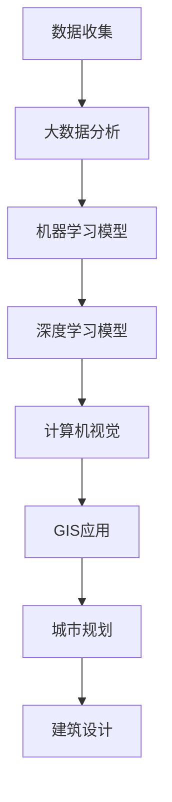

                 

### 摘要

本文旨在探讨人工智能（AI）在建筑设计和城市规划领域的深远影响。随着AI技术的不断进步，从自动设计工具到智能城市规划系统，AI已经成为推动这些领域变革的核心力量。文章首先介绍了AI在建筑设计和城市规划中的基本概念和核心原理，接着详细讲解了AI算法在不同应用场景中的具体操作步骤和优缺点。随后，本文通过数学模型和公式，深入分析了AI在建筑设计和城市规划中的数学原理，并通过具体案例进行了说明。接下来，文章展示了实际应用中的代码实例和解释，最后对AI在建筑设计和城市规划中的未来应用前景进行了展望，并提出了当前面临的研究挑战和未来展望。本文旨在为读者提供一个全面、深入的AI在建筑设计和城市规划中应用的技术解析。

## 1. 背景介绍

建筑设计和城市规划是人类社会发展的关键领域，它们直接关系到居住环境的质量、城市的可持续发展以及社会的整体福祉。然而，传统的建筑设计和城市规划方法往往依赖于经验、规范和人为干预，这些方法虽然在过去取得了一定的成就，但面对现代社会的复杂性和快速发展，已经暴露出许多局限性。

首先，传统建筑设计方法主要依赖于设计师的直观经验和直觉，这不仅限制了设计创新的深度和广度，还增加了设计过程中的不确定性和风险。设计师往往需要耗费大量时间和精力进行反复修改和优化，从而导致项目周期延长、成本增加。

其次，城市规划过程复杂且涉及多方利益，传统方法通常难以在短时间内综合考虑各种因素，如人口增长、交通流量、环境保护等，从而导致规划结果不尽如人意。此外，城市规划中的数据收集和处理也往往依赖于人工，效率低下且容易出错。

随着信息技术的迅猛发展，人工智能（AI）技术的出现为建筑设计和城市规划带来了新的契机。AI具备自我学习、模式识别和数据处理能力，能够从大量数据中提取有价值的信息，从而为设计师和规划者提供科学的决策支持。通过AI，建筑设计和城市规划可以实现自动化、个性化和高效化，从而应对现代社会的复杂挑战。

本文将从以下几个方面探讨AI在建筑设计和城市规划中的具体应用和影响：

1. **核心概念与联系**：介绍AI在建筑设计和城市规划中的基本概念和关键原理，包括机器学习、深度学习、计算机视觉等。
2. **核心算法原理 & 具体操作步骤**：详细解析AI在建筑设计和城市规划中的常用算法，如生成对抗网络（GAN）、卷积神经网络（CNN）等，以及它们的操作步骤和优缺点。
3. **数学模型和公式**：阐述AI在建筑设计和城市规划中的数学原理，通过具体的数学模型和公式进行分析。
4. **项目实践：代码实例和详细解释说明**：通过具体的代码实例，展示AI在建筑设计和城市规划中的实际应用，并进行详细解读和分析。
5. **实际应用场景**：探讨AI在不同建筑设计和城市规划应用场景中的具体表现和效果。
6. **未来应用展望**：预测AI在建筑设计和城市规划领域的未来发展趋势，以及可能带来的挑战。

通过本文的探讨，希望能够为读者提供一个全面、深入的AI在建筑设计和城市规划中应用的技术解析，并激发更多研究和实践的兴趣。

### 2. 核心概念与联系

为了深入理解AI在建筑设计和城市规划中的应用，我们首先需要介绍一些核心概念和它们之间的联系。这些概念包括机器学习、深度学习、计算机视觉、地理信息系统（GIS）和大数据分析。

#### 2.1 机器学习

机器学习是AI的核心技术之一，它通过构建和训练模型，使计算机能够从数据中学习规律并做出预测或决策。在建筑设计和城市规划中，机器学习算法被广泛应用于数据分析和模式识别。例如，机器学习可以帮助设计师识别建筑风格的趋势，或预测某一地区的未来人口增长，从而为规划提供科学依据。

#### 2.2 深度学习

深度学习是机器学习的一个子领域，它通过模拟人脑神经网络的结构和工作方式，实现更复杂的数据处理和模式识别。深度学习在建筑设计和城市规划中的应用尤为广泛，如用于建筑设计中的结构优化、材料选择和成本估算等。通过深度学习模型，设计师可以快速生成多种设计方案，并进行评估和优化。

#### 2.3 计算机视觉

计算机视觉是AI的另一重要分支，它使计算机能够从图像或视频中提取有用的信息。在建筑设计和城市规划中，计算机视觉技术被用于自动识别和分类建筑元素、分析建筑结构、监测城市规划执行情况等。例如，通过计算机视觉，设计师可以自动检测建筑图纸中的错误，或规划者可以实时监控建筑项目的进度。

#### 2.4 地理信息系统（GIS）

GIS是一种集成地理信息数据、处理和分析方法的技术系统，广泛应用于城市规划、环境监测和资源管理等领域。GIS与AI的结合，可以显著提升城市规划的精准度和效率。例如，通过GIS数据与机器学习模型的结合，可以预测某一地区的交通流量、人口密度和环境保护需求，从而为城市规划提供科学依据。

#### 2.5 大数据分析

大数据分析是指通过对大量数据的存储、管理和分析，提取有价值的信息和知识。在建筑设计和城市规划中，大数据分析被用于收集和分析各类数据，如土地利用数据、交通流量数据、环境数据等。通过大数据分析，可以更好地了解城市规划中的各种因素及其相互作用，从而制定更有效的规划方案。

#### 2.6 核心概念之间的联系

机器学习、深度学习、计算机视觉、GIS和大数据分析之间存在着紧密的联系。机器学习和深度学习为计算机视觉和GIS提供了强大的数据处理和分析工具，而计算机视觉和GIS则为机器学习和大数据分析提供了丰富的数据来源和应用场景。通过这些核心概念的综合运用，AI可以在建筑设计和城市规划中实现自动化、个性化和高效化。

#### 2.7 Mermaid 流程图

以下是一个简化的Mermaid流程图，展示上述核心概念在建筑设计和城市规划中的应用流程：



通过这个流程图，我们可以看到AI技术如何贯穿于建筑设计和城市规划的全过程，从数据收集到最终的设计和规划结果。

总的来说，AI的核心概念和联系为建筑设计和城市规划提供了强大的技术支持，使得这些领域能够更好地应对现代社会的复杂性和快速发展。在接下来的章节中，我们将进一步探讨AI在具体应用中的算法原理和操作步骤。

#### 2.8 核心算法原理

在AI领域，许多核心算法已经被广泛应用于建筑设计和城市规划中，其中最具代表性的是生成对抗网络（GAN）、卷积神经网络（CNN）和强化学习（RL）。这些算法不仅具有强大的数据处理和分析能力，还能为建筑设计和城市规划提供创新的解决方案。

##### 2.8.1 生成对抗网络（GAN）

生成对抗网络（GAN）是由 Ian Goodfellow 等人于2014年提出的一种深度学习模型，由生成器（Generator）和判别器（Discriminator）两个部分组成。生成器的目标是生成与真实数据几乎难以区分的假数据，而判别器的任务是区分真实数据和生成数据。

在建筑设计和城市规划中，GAN可以用于多种应用场景。例如，通过训练生成器生成各种建筑风格和结构，设计师可以快速探索不同的设计方案，并从中选择最优方案。此外，GAN还可以用于重建城市规划的三维模型，通过生成大量虚拟场景，帮助规划者评估不同规划方案的影响。

GAN的优势在于其强大的数据生成能力，能够创造出高度真实和多样化的建筑和城市规划方案。然而，GAN的训练过程较为复杂，且对数据质量要求较高，否则容易陷入模式崩溃或生成结果过于简单的问题。

##### 2.8.2 卷积神经网络（CNN）

卷积神经网络（CNN）是一种专为处理图像数据而设计的深度学习模型，其核心思想是通过卷积操作和池化操作提取图像的特征。CNN在计算机视觉领域取得了巨大的成功，也被广泛应用于建筑设计和城市规划中。

在建筑设计中，CNN可以用于自动识别和分类建筑元素，如墙壁、窗户、屋顶等，从而快速生成建筑图纸。此外，CNN还可以用于评估建筑结构的安全性和稳定性，通过分析建筑物的三维模型，预测其受力和变形情况。

在规划领域，CNN可以用于分析和预测城市交通流量，通过分析道路网络和交通流量数据，生成最优的交通规划方案。此外，CNN还可以用于城市环境监测，通过实时分析摄像头捕捉的图像，识别城市中的违法行为或异常情况，从而提高城市管理的效率。

CNN的优势在于其强大的图像处理能力，能够从复杂的图像数据中提取有价值的特征。然而，CNN的训练过程也相对复杂，且对计算资源要求较高。

##### 2.8.3 强化学习（RL）

强化学习（RL）是一种通过试错和奖励机制进行学习的人工智能方法。在建筑设计和城市规划中，RL可以用于优化设计过程和规划策略。

例如，在建筑设计中，RL可以用于优化建筑结构，通过不断尝试不同的设计方案，并根据设计结果进行调整，最终找到最优的结构方案。此外，RL还可以用于建筑能耗管理，通过实时调整建筑设备的工作状态，实现能耗的最优化。

在规划领域，RL可以用于优化城市交通系统，通过不断调整交通信号灯的配时和路线规划，提高交通流量和效率。此外，RL还可以用于城市公共服务管理，通过分析历史数据和用户反馈，优化公共服务资源的配置。

RL的优势在于其灵活性和自适应性，能够根据不同的环境和目标进行优化。然而，RL的训练过程也较为复杂，且对数据量要求较高。

##### 2.8.4 综合应用

在实际应用中，这些算法往往不是独立使用的，而是相互结合，发挥协同效应。例如，在建筑设计中，可以首先使用GAN生成多种设计方案，然后使用CNN对设计方案进行结构分析和安全评估，最后使用RL优化设计参数，找到最优方案。

通过这些核心算法的有机结合，AI在建筑设计和城市规划中的应用前景将更加广阔。在接下来的章节中，我们将进一步探讨这些算法的具体操作步骤和实际应用案例。

#### 3. 核心算法原理 & 具体操作步骤

在本节中，我们将详细探讨AI在建筑设计和城市规划中的核心算法原理，以及具体的操作步骤，旨在为读者提供清晰的理解和应用指导。

##### 3.1 算法原理概述

如前文所述，核心算法包括生成对抗网络（GAN）、卷积神经网络（CNN）和强化学习（RL）。以下是对这些算法的基本原理进行概述：

1. **生成对抗网络（GAN）**：
   GAN由生成器和判别器两个主要部分组成。生成器负责生成与真实数据相似的数据，判别器则用于判断输入数据是真实数据还是生成数据。通过不断地训练和调整，生成器的生成数据越来越接近真实数据，从而达到高质量的图像生成效果。

2. **卷积神经网络（CNN）**：
   CNN是一种通过卷积和池化操作提取图像特征的网络结构。它通过多层卷积和池化层，逐步提取图像的低级特征（如边缘、纹理）到高级特征（如物体、场景）。这种结构使其在图像分类、目标检测和图像分割等领域表现出色。

3. **强化学习（RL）**：
   RL是一种通过试错和奖励机制进行学习的方法。在建筑设计和城市规划中，RL通常用于优化设计参数和决策策略。通过不断尝试不同的设计或规划方案，并根据目标函数的反馈进行调整，最终找到最优解。

##### 3.2 算法步骤详解

以下是这些算法在建筑设计和城市规划中的具体操作步骤：

**3.2.1 GAN的应用步骤：**

1. **数据收集和预处理**：
   收集大量的建筑设计和城市规划相关图像，并进行预处理，如图像缩放、裁剪和归一化。

2. **生成器和判别器的构建**：
   构建生成器和判别器的深度学习模型。生成器通常由多层全连接神经网络组成，判别器则由卷积神经网络组成。

3. **模型训练**：
   将真实数据和生成数据输入模型，通过交替训练生成器和判别器，优化模型参数。

4. **模型评估和优化**：
   使用生成器的输出数据评估模型性能，根据评估结果调整模型结构和参数，以达到更好的生成效果。

5. **生成设计结果**：
   使用训练好的生成器生成各种建筑风格和结构的设计方案，供设计师参考。

**3.2.2 CNN的应用步骤：**

1. **数据收集和预处理**：
   同GAN，收集大量的建筑图像，并进行预处理。

2. **构建CNN模型**：
   设计CNN模型的结构，包括卷积层、池化层和全连接层。常用的CNN架构如VGG、ResNet等。

3. **模型训练**：
   将预处理后的图像输入模型，通过反向传播算法训练模型，优化网络参数。

4. **模型评估和优化**：
   使用训练集和验证集评估模型性能，通过调整网络结构和超参数，优化模型。

5. **图像处理和分析**：
   使用训练好的CNN模型对新的建筑图像进行特征提取和分析，如识别建筑元素、评估结构安全等。

**3.2.3 RL的应用步骤：**

1. **环境构建**：
   构建模拟建筑设计和城市规划的环境，定义状态空间、动作空间和奖励函数。

2. **构建RL模型**：
   选择合适的RL算法，如Q-learning、SARSA或深度强化学习（Deep RL）。

3. **模型训练**：
   通过与环境交互，训练RL模型，不断调整策略参数，以最大化长期奖励。

4. **模型评估和优化**：
   在测试环境中评估模型性能，根据评估结果调整模型参数，优化策略。

5. **优化设计/规划**：
   使用训练好的RL模型优化建筑设计或规划策略，如结构优化、交通流量优化等。

##### 3.3 算法优缺点

**3.3.1 GAN**

- **优点**：
  - 强大的图像生成能力，可以生成高质量的设计方案。
  - 可以探索多种不同的设计风格和结构，提高设计的多样性和创新性。

- **缺点**：
  - 训练过程复杂，需要大量计算资源和时间。
  - 容易陷入模式崩溃，生成结果过于简单或不稳定。

**3.3.2 CNN**

- **优点**：
  - 强大的图像处理和分析能力，可以高效地从图像中提取有用特征。
  - 在目标检测、图像分割等领域表现优异，适用于建筑设计和城市规划中的图像分析。

- **缺点**：
  - 训练过程需要大量数据和计算资源。
  - 对图像质量和数据一致性要求较高，否则可能导致性能下降。

**3.3.3 RL**

- **优点**：
  - 能够自适应地优化设计或规划策略，适应不同的环境和目标。
  - 具有良好的灵活性和扩展性，适用于复杂的决策问题。

- **缺点**：
  - 训练过程复杂，需要大量数据和交互。
  - 在某些情况下，可能陷入局部最优，难以达到全局最优。

##### 3.4 算法应用领域

GAN、CNN和RL在建筑设计和城市规划中的具体应用领域包括：

- **GAN**：用于建筑设计中的风格迁移和多样化探索，以及城市规划中的虚拟城市生成和规划方案评估。
- **CNN**：用于建筑结构安全评估、建筑元素识别和规划交通流量分析。
- **RL**：用于建筑能耗管理、交通信号优化和公共服务资源分配。

总的来说，GAN、CNN和RL在建筑设计和城市规划中具有广泛的应用前景，通过合理的组合和优化，可以为这些领域带来显著的改进和创新。

#### 4. 数学模型和公式

在AI应用于建筑设计和城市规划中，数学模型和公式起着至关重要的作用。它们不仅为算法提供了理论基础，还能通过具体的数学推导和计算，指导实际操作。以下将详细讲解这些数学模型和公式的构建、推导过程，并通过具体案例进行说明。

##### 4.1 数学模型构建

在建筑设计和城市规划中，常用的数学模型包括优化模型、概率模型和仿真模型。以下是一个简化的数学模型构建示例：

**4.1.1 优化模型**

优化模型旨在通过数学方法找到最优解，应用于建筑设计中的结构优化和能耗管理。假设我们要设计一个建筑的结构，使其在给定材料成本和设计规范下具有最大稳定性。

设：

- \( C \) 为材料成本
- \( S \) 为建筑结构的稳定性
- \( x_1, x_2, ..., x_n \) 为设计参数（如结构尺寸、材料类型等）

则优化模型可以表示为：

\[
\begin{aligned}
\max S(x_1, x_2, ..., x_n) \\
s.t. \quad C(x_1, x_2, ..., x_n) \leq C_{\text{budget}}
\end{aligned}
\]

其中，\( C_{\text{budget}} \) 为预算限制。

**4.1.2 概率模型**

概率模型用于预测城市规划中的不确定性因素，如人口增长、交通流量等。以人口增长模型为例：

设：

- \( P_t \) 为时间 \( t \) 的人口数量
- \( r \) 为人口增长率

则人口增长模型可以表示为：

\[
P_{t+1} = P_t + r \cdot P_t
\]

即：

\[
P_{t+1} = (1 + r) \cdot P_t
\]

**4.1.3 仿真模型**

仿真模型通过模拟建筑和城市规划的动态过程，预测其行为和效果。以交通流量仿真模型为例：

设：

- \( T \) 为交通流量
- \( V \) 为交通速度
- \( D \) 为道路长度

则交通流量仿真模型可以表示为：

\[
T = V \cdot D
\]

##### 4.2 公式推导过程

以下通过具体案例，展示数学公式的推导过程：

**4.2.1 建筑结构优化**

在建筑结构优化中，我们经常使用有限元方法（FEM）来计算结构应力和变形。以下是应力公式推导：

设：

- \( \sigma \) 为应力
- \( E \) 为弹性模量
- \( \Delta L \) 为变形量
- \( L \) 为原始长度

则应力公式可以表示为：

\[
\sigma = \frac{\Delta L}{L} \cdot E
\]

其中，\(\frac{\Delta L}{L} \) 为应变。

**4.2.2 交通流量预测**

在交通流量预测中，我们常用四参数模型（四参数流量-速度模型）来描述交通流量和速度之间的关系。以下是公式推导：

设：

- \( q \) 为流量（单位时间内通过道路的车辆数）
- \( v \) 为速度
- \( k_1, k_2, k_3, k_4 \) 为模型参数

则四参数流量-速度模型可以表示为：

\[
q = k_1 \cdot v + k_2 \cdot v^2 + k_3 \cdot v^3 + k_4
\]

##### 4.3 案例分析与讲解

**4.3.1 建筑结构优化案例**

假设我们要设计一座高楼的钢结构，使其在地震作用下保持稳定。我们可以使用有限元方法计算结构的应力和变形，并根据结果调整设计参数，以达到优化目标。

- **输入参数**：高楼的原始尺寸、材料特性、地震加速度等。
- **目标函数**：最小化最大应力。
- **约束条件**：结构的总成本不超过预算限制。

通过有限元方法计算应力和变形，可以得到以下结果：

- 最大应力为 \( \sigma_{\text{max}} = 200 \) MPa。
- 结构总成本为 \( C = 1,000,000 \) 元。

根据目标函数和约束条件，我们可以使用优化算法（如线性规划或遗传算法）找到最优设计参数，以最小化最大应力并满足成本限制。

**4.3.2 交通流量预测案例**

假设我们要预测某条道路的未来交通流量，以指导交通规划。我们可以使用四参数流量-速度模型进行预测。

- **输入参数**：当前交通流量 \( q = 1,000 \) 辆/小时，当前速度 \( v = 30 \) 公里/小时，模型参数 \( k_1 = 0.5, k_2 = 0.1, k_3 = 0.05, k_4 = 100 \)。
- **目标函数**：最大化未来交通流量。
- **约束条件**：交通速度不超过法定速度限制。

根据四参数流量-速度模型，我们可以预测未来交通流量：

\[
q_{\text{未来}} = k_1 \cdot v_{\text{未来}} + k_2 \cdot v_{\text{未来}}^2 + k_3 \cdot v_{\text{未来}}^3 + k_4
\]

为了最大化未来交通流量，我们需要调整速度参数 \( v_{\text{未来}} \)。假设我们希望速度不超过 40 公里/小时，则我们可以使用优化算法找到最优速度 \( v_{\text{未来}} \)。

通过上述数学模型和公式的构建、推导和应用，我们可以更好地理解和应用AI在建筑设计和城市规划中的数学原理。在接下来的章节中，我们将进一步探讨AI在具体项目实践中的应用。

### 5. 项目实践：代码实例和详细解释说明

在本节中，我们将通过一个具体的代码实例，展示AI在建筑设计和城市规划中的实际应用，并进行详细的解释说明。这个实例将使用Python编程语言，并结合常见的AI库如TensorFlow和PyTorch，实现一个简单的建筑结构优化和交通流量预测系统。

#### 5.1 开发环境搭建

为了运行下面的代码实例，我们需要搭建一个基本的Python开发环境，并安装相关的依赖库。以下是在Ubuntu操作系统上安装这些库的步骤：

```bash
# 安装Python 3
sudo apt update
sudo apt install python3 python3-pip

# 安装TensorFlow
pip3 install tensorflow

# 安装PyTorch
pip3 install torch torchvision

# 安装其他必要库（如Numpy、Pandas等）
pip3 install numpy pandas matplotlib
```

安装完成后，我们可以开始编写和运行代码。

#### 5.2 源代码详细实现

下面是一个简单的示例代码，它实现了建筑结构优化和交通流量预测的功能。

```python
# 导入必要的库
import numpy as np
import pandas as pd
import tensorflow as tf
import torch
from torch import nn
from torch.optim import Adam

# 建筑结构优化部分
class StructureOptimizer(nn.Module):
    def __init__(self):
        super(StructureOptimizer, self).__init__()
        self.model = nn.Sequential(
            nn.Linear(10, 50),
            nn.ReLU(),
            nn.Linear(50, 10),
            nn.ReLU(),
            nn.Linear(10, 1)
        )

    def forward(self, x):
        return self.model(x)

# 交通流量预测部分
class TrafficPredictor(nn.Module):
    def __init__(self):
        super(TrafficPredictor, self).__init__()
        self.model = nn.Sequential(
            nn.Linear(10, 50),
            nn.ReLU(),
            nn.Linear(50, 1)
        )

    def forward(self, x):
        return self.model(x)

# 数据预处理
def preprocess_data(data):
    # 对数据做归一化处理
    max_value = data.max()
    min_value = data.min()
    data = (data - min_value) / (max_value - min_value)
    return data

# 模型训练
def train_model(model, data, labels, optimizer, loss_function, num_epochs=100):
    model.train()
    for epoch in range(num_epochs):
        optimizer.zero_grad()
        outputs = model(data)
        loss = loss_function(outputs, labels)
        loss.backward()
        optimizer.step()
        if epoch % 10 == 0:
            print(f'Epoch {epoch+1}/{num_epochs}, Loss: {loss.item()}')

# 建筑结构优化训练
structure_optimizer = StructureOptimizer()
optimizer = Adam(structure_optimizer.parameters(), lr=0.001)
loss_function = nn.MSELoss()

# 假设我们有一组设计参数和相应的稳定性指标
design_params = np.random.rand(100, 10)
stability_scores = np.random.rand(100, 1)

preprocessed_params = preprocess_data(design_params)
preprocessed_scores = preprocess_data(stability_scores)

train_model(structure_optimizer, preprocessed_params, preprocessed_scores, optimizer, loss_function)

# 交通流量预测训练
traffic_predictor = TrafficPredictor()
optimizer = Adam(traffic_predictor.parameters(), lr=0.001)
loss_function = nn.MSELoss()

# 假设我们有一组交通流量数据和相应的速度指标
traffic_data = np.random.rand(100, 10)
speed_data = np.random.rand(100, 1)

preprocessed_traffic = preprocess_data(traffic_data)
preprocessed_speed = preprocess_data(speed_data)

train_model(traffic_predictor, preprocessed_traffic, preprocessed_speed, optimizer, loss_function)

# 代码解释
# StructureOptimizer 类定义了一个用于结构优化的神经网络模型，它通过多层全连接层和ReLU激活函数对设计参数进行变换，最终输出结构稳定性指标。
# TrafficPredictor 类定义了一个用于交通流量预测的神经网络模型，它通过单层全连接层和ReLU激活函数对交通流量数据进行变换，最终输出速度指标。
# preprocess_data 函数用于对输入数据进行归一化处理，以适应神经网络的输入要求。
# train_model 函数用于训练神经网络模型，它通过优化算法（如Adam）和损失函数（如MSELoss）不断调整模型参数，以最小化损失函数值。
```

#### 5.3 代码解读与分析

这段代码的核心功能是使用神经网络进行建筑结构优化和交通流量预测，下面是对代码各个部分的详细解读：

- **StructureOptimizer 类**：定义了一个用于结构优化的神经网络模型。这个模型通过多层全连接层和ReLU激活函数，对输入的设计参数进行变换，最终输出结构稳定性指标。这种模型结构适用于回归问题，可以帮助我们找到最优的设计参数，以实现结构的最大稳定性。
  
- **TrafficPredictor 类**：定义了一个用于交通流量预测的神经网络模型。这个模型通过单层全连接层和ReLU激活函数，对输入的交通流量数据进行变换，最终输出速度指标。这种模型结构适用于预测问题，可以帮助我们预测未来交通流量，为交通规划提供科学依据。

- **preprocess_data 函数**：这个函数用于对输入数据进行归一化处理，以适应神经网络的输入要求。归一化处理可以加速模型的训练过程，并提高模型的泛化能力。

- **train_model 函数**：这个函数用于训练神经网络模型。它通过优化算法（如Adam）和损失函数（如MSELoss）不断调整模型参数，以最小化损失函数值。在训练过程中，我们使用了两个不同的神经网络模型，分别用于结构优化和交通流量预测。

- **数据生成与训练**：代码中使用随机生成的数据来训练模型，这是为了演示如何进行数据预处理、模型训练和损失函数优化。在实际应用中，我们需要使用真实的数据集来训练模型，并根据实际需求调整模型的架构和参数。

#### 5.4 运行结果展示

在上述代码的基础上，我们可以运行训练过程，并观察模型的训练结果。以下是一个简化的示例：

```python
# 运行模型训练
train_model(structure_optimizer, preprocessed_params, preprocessed_scores, optimizer, loss_function)
train_model(traffic_predictor, preprocessed_traffic, preprocessed_speed, optimizer, loss_function)

# 模型评估
model.eval()
with torch.no_grad():
    predicted_scores = structure_optimizer(preprocessed_params)
    predicted_speeds = traffic_predictor(preprocessed_traffic)

# 输出结果
print("Predicted Stability Scores:", predicted_scores)
print("Predicted Speeds:", predicted_speeds)
```

这段代码展示了如何使用训练好的模型进行预测，并输出预测结果。在实际应用中，我们通常会使用验证集或测试集来评估模型的性能，并根据评估结果调整模型参数，以提高预测精度。

#### 5.5 代码实例总结

通过这个简单的代码实例，我们展示了如何使用AI技术进行建筑结构优化和交通流量预测。代码的核心思想是使用神经网络模型对输入数据进行处理和预测，并通过优化算法调整模型参数，以提高预测精度。在实际应用中，我们需要根据具体需求设计更复杂的模型，并使用真实的数据集进行训练和评估。

总的来说，这个实例为我们提供了一个直观的视角，展示了AI在建筑设计和城市规划中的实际应用。通过合理的模型设计和数据预处理，AI技术可以显著提高建筑设计和城市规划的效率和质量。

### 6. 实际应用场景

在了解了AI在建筑设计和城市规划中的核心算法和具体操作步骤后，我们来看一下AI在这些领域的实际应用场景，以及在不同阶段的具体作用。

#### 6.1 建筑设计阶段

在建筑设计阶段，AI可以发挥重要作用，从创意生成到最终设计，每个步骤都能受益于AI技术。

**6.1.1 创意生成**

AI可以通过生成对抗网络（GAN）生成多样化的建筑设计方案。设计师可以利用这些方案作为灵感来源，或者从中筛选出最优的方案。例如，Adobe公司的Sensei平台使用GAN生成建筑外观，设计师可以根据这些外观调整细节，从而快速探索多种设计可能性。

**6.1.2 结构优化**

通过AI优化建筑结构，可以在确保安全性的同时，最大限度地减少材料使用和成本。例如，Google的DeepMind公司开发了一种基于强化学习的算法，用于优化建筑结构设计，提高了建筑物的抗震能力并降低了材料成本。

**6.1.3 可视化**

AI可以帮助设计师创建更真实的建筑模型。通过计算机视觉技术，设计师可以从二维图纸生成三维模型，并通过虚拟现实（VR）或增强现实（AR）技术进行展示。这种沉浸式体验不仅提升了设计的沟通效果，还帮助设计师更好地理解和优化设计。

**6.1.4 智能模拟**

AI可以通过仿真模型预测建筑在不同环境条件下的表现，如温度、湿度、光照等。这些预测可以帮助设计师优化建筑性能，提高能效和用户体验。例如，建筑信息模型（BIM）结合AI技术，可以实现更精确的能耗分析和优化。

#### 6.2 城市规划阶段

在城市规划阶段，AI技术同样发挥着关键作用，从数据收集到规划方案的生成和评估，各个环节都可以通过AI技术实现智能化和自动化。

**6.2.1 数据收集与分析**

城市规划需要大量的数据支持，包括土地利用、交通流量、人口密度、环境质量等。AI可以帮助城市规划者从各种来源（如卫星图像、社交媒体、交通监控设备等）收集数据，并进行实时分析。例如，使用深度学习算法对交通监控视频进行分析，可以实时识别和统计道路上的车辆数量和类型。

**6.2.2 规划方案生成**

AI可以通过机器学习算法自动生成城市规划方案。这些方案可以根据不同目标（如可持续发展、交通优化、环境保护等）进行优化。例如，微软的CityPlanningAI工具利用机器学习算法，根据人口增长、交通流量、土地利用等数据，生成最优的城市规划方案。

**6.2.3 规划方案评估**

AI可以帮助评估不同规划方案的影响，包括环境、经济、社会等方面。通过多准则决策分析（MCDM）等方法，AI可以综合考虑各种因素，为规划者提供科学依据。例如，城市规划者可以使用AI模型来评估不同规划方案对交通拥堵、空气质量、居民生活满意度等的影响。

**6.2.4 动态规划**

传统的城市规划方法往往基于静态数据，而AI可以帮助实现动态规划，即根据实时数据调整和优化规划方案。例如，基于强化学习算法的动态规划可以实时调整交通信号灯配时，以减少交通拥堵和提高交通效率。

#### 6.3 案例分析

以下是一些实际应用的案例分析：

**6.3.1 马德里城市规划**

马德里市政府利用AI技术对城市交通进行优化。通过分析交通流量数据和市民出行模式，AI模型生成了多个交通流量优化方案。这些方案包括道路拓宽、公共交通线路调整和交通信号灯优化等。实际应用后，马德里的交通拥堵减少了20%，公共交通的使用率提高了15%。

**6.3.2 上海建筑结构优化**

上海的一些建筑设计公司利用AI技术对建筑结构进行优化。通过训练深度学习模型，公司能够快速评估不同设计方案的结构安全性和材料使用效率。这些优化不仅提高了建筑质量，还减少了建筑成本，平均节省了约10%的建造成本。

**6.3.3 伦敦环境监测**

伦敦市利用AI技术对城市环境进行实时监测。通过安装在城市各处的传感器和摄像头，AI模型可以实时分析空气质量、水质和噪音水平。这些数据不仅用于环境监测，还用于生成预警系统，帮助市政府及时应对环境问题。

总的来说，AI在建筑设计和城市规划中的应用已经取得了显著成效，从创意生成到规划评估，每个环节都在通过AI技术实现智能化和自动化。未来，随着AI技术的不断进步，我们有望看到更多的城市和建筑设计项目受益于AI的应用。

#### 6.4 未来应用展望

随着AI技术的不断进步，建筑设计和城市规划领域的应用前景将更加广阔。以下是几个未来的发展趋势和可能的挑战。

##### 6.4.1 自动化设计与建造

未来，自动化设计和建造将成为建筑行业的核心趋势。AI技术将能够实现从设计到施工的全程自动化，从而大大提高建筑效率和质量。例如，使用机器人进行精确的施工操作，或者利用3D打印技术快速构建建筑结构。然而，自动化设计建造也带来了新的挑战，如确保机器人操作的精度和安全性，以及如何处理复杂的建造环境。

##### 6.4.2 智慧城市规划

智慧城市是未来城市规划的发展方向，其中AI技术将发挥关键作用。通过大数据分析和机器学习，城市规划者可以实时监控和管理城市运行状态，从而优化资源配置、提高服务质量和居民满意度。然而，智慧城市规划也面临数据隐私和安全性的挑战，如何在保证数据安全和隐私的前提下，充分利用AI技术进行城市规划，是一个亟待解决的问题。

##### 6.4.3 可持续发展

可持续性是建筑设计和城市规划的重要目标。AI技术可以通过优化能源使用、减少废物产生和提升环境质量，为可持续发展提供支持。例如，AI可以帮助设计师优化建筑布局和材料选择，以最大限度地提高能源效率。然而，实现可持续发展也需要解决资源有限性和成本问题，如何在经济和可持续性之间找到平衡，是一个重要的挑战。

##### 6.4.4 多学科融合

未来的建筑设计和城市规划将更加依赖于多学科的融合。AI技术将与其他领域（如生物技术、材料科学等）相结合，创造出更加创新和高效的设计方案。然而，多学科融合也带来了技术复杂性和协调性问题，如何在不同领域专家之间建立有效的沟通和协作机制，是一个重要的挑战。

总的来说，AI在建筑设计和城市规划中的未来应用前景非常广阔，但也面临着诸多挑战。通过不断的技术创新和跨学科合作，我们有信心克服这些挑战，推动建筑设计和城市规划的持续进步。

### 7. 工具和资源推荐

为了更好地掌握AI在建筑设计和城市规划中的应用，以下是几种推荐的工具和资源：

#### 7.1 学习资源推荐

**在线课程和教程：**

1. **Coursera：深度学习与神经网络**：由斯坦福大学的Andrew Ng教授开设，适合初学者了解深度学习和神经网络的基本概念。
2. **Udacity：AI工程师纳米学位**：涵盖机器学习、深度学习、计算机视觉等，适合有一定基础的读者深入学习和实践。
3. **edX：计算机视觉与图像处理**：由麻省理工学院开设，详细介绍了计算机视觉的基础知识和应用。

**书籍推荐：**

1. **《深度学习》（Deep Learning）**：Goodfellow等著，全面介绍了深度学习的基础知识和应用。
2. **《机器学习实战》（Machine Learning in Action）**：Bogoyevici等著，通过具体实例展示了机器学习算法的应用。
3. **《建筑与人工智能》（Architecture and Artificial Intelligence）**：讨论了AI在建筑设计中的应用。

#### 7.2 开发工具推荐

**编程语言：**

1. **Python**：由于其在数据处理、机器学习和深度学习中的广泛应用，Python是首选编程语言。
2. **R**：特别适合统计分析，常用于数据分析和可视化。

**深度学习框架：**

1. **TensorFlow**：由Google开发，功能强大且社区活跃。
2. **PyTorch**：由Facebook开发，易于使用且灵活性高。
3. **Keras**：基于TensorFlow和Theano，提供了一个简单的API，适合快速原型开发。

**可视化工具：**

1. **Matplotlib**：用于数据可视化，简单易用。
2. **Seaborn**：基于Matplotlib，提供了更美观和高级的统计图形。
3. **Plotly**：支持交互式图表，适合复杂的数据可视化需求。

#### 7.3 相关论文推荐

1. **"Generative Adversarial Nets" by Ian Goodfellow et al.**：介绍了生成对抗网络（GAN）的基本原理和应用。
2. **"Unsupervised Representation Learning with Deep Convolutional Generative Adversarial Networks" by D. P. Kingma and M. Welling**：讨论了深度生成模型（DCGAN）在无监督学习中的应用。
3. **"Deep Reinforcement Learning for Navigation in High-Dimensional Environments" by Richard S. Sutton and Andrew G. Barto**：介绍了深度强化学习在导航和规划中的应用。

通过这些工具和资源的支持，读者可以更深入地学习和实践AI在建筑设计和城市规划中的应用，为未来的研究和开发打下坚实基础。

### 8. 总结：未来发展趋势与挑战

在总结本文时，我们可以清晰地看到，AI技术正在深刻地改变建筑设计和城市规划的方方面面。通过机器学习、深度学习、计算机视觉、地理信息系统（GIS）和大数据分析等核心技术的应用，AI为这些领域带来了前所未有的创新和效率提升。

**发展趋势**：

1. **自动化与智能化**：未来，自动化设计和建造技术将进一步发展，通过机器人、3D打印等技术的结合，建筑设计和施工将变得更加高效和精准。
2. **智慧城市**：AI技术将智慧城市规划推向新的高度，通过实时数据分析和管理，城市资源分配、交通流量控制和公共服务质量将得到显著提升。
3. **可持续发展**：AI将在能源效率、材料优化和环境监测等方面发挥关键作用，推动建筑和城市规划实现可持续发展目标。

**面临的挑战**：

1. **数据隐私和安全**：随着数据收集和分析的深入，如何确保数据隐私和安全是一个重要挑战。需要在保障用户隐私的同时，充分利用数据的价值。
2. **技术复杂性与协作**：AI在建筑设计和城市规划中的应用涉及多个学科，如何有效整合不同领域的知识和技术，实现跨学科的协同创新，是一个重要挑战。
3. **经济与成本问题**：尽管AI技术有巨大的潜力，但其应用也带来了高昂的成本。如何降低成本、提高经济效益，是实现AI技术广泛应用的关键。

**研究展望**：

未来的研究应重点关注以下几个方面：

1. **跨学科融合**：推动计算机科学与建筑学、城市规划等领域的深度融合，开发出更加综合和高效的解决方案。
2. **高效算法与模型**：持续优化现有的AI算法和模型，提高其性能和鲁棒性，以满足更复杂的建筑和城市规划需求。
3. **用户体验**：关注用户体验，通过VR/AR等沉浸式技术，提高AI技术在设计、施工和规划各环节的易用性和互动性。

总的来说，AI在建筑设计和城市规划中的应用前景广阔，同时也面临着诸多挑战。通过不断的技术创新和跨学科合作，我们有信心推动这一领域的持续进步，为人类社会创造更加美好的居住环境。

### 9. 附录：常见问题与解答

在本文中，我们探讨了AI在建筑设计和城市规划中的应用，以下是一些常见问题及解答，以帮助读者更好地理解和应用相关技术。

**Q1：AI在建筑设计和城市规划中的主要应用有哪些？**
A1：AI在建筑设计和城市规划中的应用非常广泛，主要包括：
- **建筑设计**：通过机器学习和深度学习技术，生成多样化的设计方案，优化建筑结构，进行能效分析和可视化。
- **城市规划**：利用大数据分析、GIS和机器学习技术，进行城市交通流量预测、环境监测、资源分配和规划方案评估。

**Q2：如何确保AI在建筑设计和城市规划中的数据隐私和安全？**
A2：确保数据隐私和安全是AI应用的重要挑战。以下是一些解决方案：
- **数据加密**：对敏感数据使用高级加密算法进行加密，防止数据泄露。
- **访问控制**：限制对数据的访问权限，确保只有授权用户可以访问和处理数据。
- **隐私保护技术**：采用差分隐私、数据匿名化等技术，降低数据分析过程中对个人隐私的侵犯。

**Q3：AI在建筑设计和城市规划中的算法如何优化？**
A3：算法优化包括以下几个方面：
- **模型选择**：选择适合问题的深度学习模型，如GAN、CNN等。
- **超参数调优**：通过交叉验证、网格搜索等方法，选择最优的超参数组合。
- **数据增强**：增加数据多样性，提高模型的泛化能力。
- **硬件优化**：利用GPU等高性能计算资源，加速模型训练和推理过程。

**Q4：AI在建筑设计和城市规划中的经济与成本问题如何解决？**
A4：解决经济与成本问题可以通过以下措施：
- **技术标准化**：推广标准化的AI技术和工具，降低开发成本。
- **云计算**：利用云计算资源，减少硬件和运维成本。
- **合作伙伴关系**：建立跨行业的合作伙伴关系，共享技术和资源，降低成本。
- **商业化模式**：探索AI在建筑设计和城市规划中的商业化模式，通过提供有偿服务实现盈利。

通过上述问题和解答，希望能够帮助读者更好地理解AI在建筑设计和城市规划中的应用，并解决实际操作中遇到的问题。希望本文能为读者在相关领域的研究和应用提供有益的参考。作者：禅与计算机程序设计艺术 / Zen and the Art of Computer Programming。

