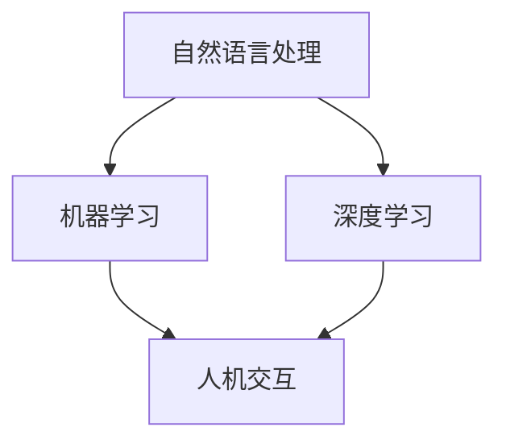

                 

关键词：人工智能，提问，思考，认知，信息检索，数据挖掘，自然语言处理，机器学习，神经网络，人机交互

> 摘要：随着人工智能技术的飞速发展，传统的提问和思考方式正面临着前所未有的变革。本文将深入探讨人工智能如何改变我们的提问和思考方式，通过分析核心概念、算法原理、实际应用等多个方面，为我们揭示这个领域的最新动态和未来趋势。

## 1. 背景介绍

在过去的几千年中，人类已经形成了一套相对固定的提问和思考方式。我们从教育中学会了如何通过阅读、研究和讨论来获取知识。然而，随着互联网和人工智能的崛起，我们的学习和认知方式正在发生深刻的变革。人工智能通过其强大的计算能力和智能算法，正在改变我们提问和思考的方式，使得信息检索更加高效，知识获取更加便捷。

### 1.1 人工智能的定义

人工智能（Artificial Intelligence，简称AI）是指通过计算机程序模拟人类智能的行为和决策能力。它包括机器学习、深度学习、自然语言处理、计算机视觉等多个子领域。人工智能的目标是让计算机具备类似于人类的感知、理解、推理和决策能力。

### 1.2 人工智能的发展历程

人工智能的发展可以追溯到20世纪50年代。当时的科学家们提出了“机器可以思考”的想法，并开始尝试设计能够模拟人类思维的计算机程序。尽管早期的人工智能研究取得了显著的进展，但由于计算能力的限制，这些尝试并没有取得预期的成功。

直到21世纪初，随着计算能力的提升和大数据的普及，人工智能迎来了新的发展机遇。特别是深度学习技术的突破，使得计算机在图像识别、语音识别、自然语言处理等领域取得了重大进展。如今，人工智能已经成为了科技领域最热门的研究方向之一。

### 1.3 人工智能的应用场景

人工智能已经广泛应用于各个领域，包括医疗、金融、教育、交通、安防等。例如，在医疗领域，人工智能可以帮助医生进行疾病诊断，提高诊断的准确性和效率；在金融领域，人工智能可以用于风险控制和投资决策，提高金融市场的稳定性和效率。

## 2. 核心概念与联系

在探讨人工智能如何改变我们的提问和思考方式之前，我们需要了解一些核心概念和原理。以下是人工智能领域的一些关键概念及其相互关系。

### 2.1 自然语言处理

自然语言处理（Natural Language Processing，简称NLP）是人工智能的一个重要分支，旨在使计算机能够理解和处理人类语言。NLP包括文本分类、情感分析、实体识别、机器翻译等多个任务。

### 2.2 机器学习

机器学习（Machine Learning，简称ML）是人工智能的核心技术之一，它通过数据训练模型，使计算机具备学习和预测能力。机器学习可以分为监督学习、无监督学习和强化学习等类型。

### 2.3 深度学习

深度学习（Deep Learning，简称DL）是机器学习的一个子领域，通过多层神经网络进行数据建模。深度学习在图像识别、语音识别等领域取得了显著成果。

### 2.4 人机交互

人机交互（Human-Computer Interaction，简称HCI）是研究人类与计算机之间交互的学科。人工智能通过改善人机交互界面，使得用户能够更加自然地与计算机进行交互。

### 2.5 Mermaid 流程图

以下是一个简单的 Mermaid 流程图，展示了人工智能的核心概念及其相互关系：



## 3. 核心算法原理 & 具体操作步骤

### 3.1 算法原理概述

人工智能改变我们的提问和思考方式的核心在于其算法原理。以下是几个关键算法原理及其具体操作步骤：

### 3.2 算法步骤详解

#### 3.2.1 自然语言处理

自然语言处理的核心任务是使计算机能够理解和处理人类语言。其具体操作步骤如下：

1. **文本预处理**：包括去除停用词、分词、词性标注等步骤。
2. **特征提取**：通过词袋模型、TF-IDF等方法提取文本特征。
3. **模型训练**：使用监督学习或无监督学习方法训练模型。
4. **预测与评估**：对输入文本进行预测，并评估模型的性能。

#### 3.2.2 机器学习

机器学习是通过数据训练模型，使计算机具备学习和预测能力。其具体操作步骤如下：

1. **数据收集**：收集用于训练的数据集。
2. **数据预处理**：对数据进行清洗、归一化等处理。
3. **模型选择**：选择合适的模型架构。
4. **模型训练**：使用训练数据进行模型训练。
5. **模型评估**：使用测试数据评估模型性能。
6. **模型优化**：根据评估结果调整模型参数。

#### 3.2.3 深度学习

深度学习是通过多层神经网络进行数据建模。其具体操作步骤如下：

1. **网络架构设计**：设计合适的神经网络架构。
2. **模型训练**：使用训练数据进行模型训练。
3. **模型评估**：使用测试数据评估模型性能。
4. **模型优化**：根据评估结果调整模型参数。

### 3.3 算法优缺点

#### 3.3.1 自然语言处理

自然语言处理的优点在于其能够理解和处理人类语言，使得计算机能够更好地与人类进行交互。然而，其缺点在于处理复杂语言任务时，效果往往不如深度学习等其他方法。

#### 3.3.2 机器学习

机器学习的优点在于其能够通过数据训练模型，从而实现自动化学习。然而，其缺点在于对数据依赖较大，且训练过程可能较为耗时。

#### 3.3.3 深度学习

深度学习的优点在于其能够通过多层神经网络进行复杂数据建模。然而，其缺点在于对计算资源要求较高，且训练过程可能较为耗时。

### 3.4 算法应用领域

自然语言处理、机器学习和深度学习在多个领域都有着广泛的应用，包括但不限于：

1. **信息检索**：通过自然语言处理和机器学习技术，实现更高效、更准确的信息检索。
2. **数据挖掘**：通过机器学习和深度学习技术，发现数据中的规律和趋势。
3. **智能问答**：通过自然语言处理和机器学习技术，实现智能问答系统。
4. **智能推荐**：通过机器学习和深度学习技术，实现个性化推荐系统。

## 4. 数学模型和公式 & 详细讲解 & 举例说明

### 4.1 数学模型构建

在人工智能领域，数学模型是构建智能系统的基础。以下是几个常见的数学模型及其构建过程：

#### 4.1.1 线性回归模型

线性回归模型是一种简单的数学模型，用于预测连续值。其公式如下：

$$
y = \beta_0 + \beta_1x
$$

其中，$y$ 是预测值，$x$ 是输入特征，$\beta_0$ 和 $\beta_1$ 是模型参数。

#### 4.1.2 逻辑回归模型

逻辑回归模型是一种常用的分类模型，用于预测离散值。其公式如下：

$$
P(y=1) = \frac{1}{1 + e^{-(\beta_0 + \beta_1x)}}
$$

其中，$P(y=1)$ 是预测概率，$x$ 是输入特征，$\beta_0$ 和 $\beta_1$ 是模型参数。

#### 4.1.3 神经网络模型

神经网络模型是一种复杂的数学模型，用于处理复杂数据。其基本结构包括输入层、隐藏层和输出层。以下是神经网络模型的构建过程：

1. **输入层**：接收外部输入。
2. **隐藏层**：对输入进行变换，提取特征。
3. **输出层**：输出预测结果。

神经网络的激活函数如下：

$$
a(x) = \max(0, x)
$$

### 4.2 公式推导过程

以下是对线性回归模型和逻辑回归模型的推导过程：

#### 4.2.1 线性回归模型

假设我们有一个训练数据集 $D = \{(x_1, y_1), (x_2, y_2), ..., (x_n, y_n)\}$，其中 $x_i$ 和 $y_i$ 分别为输入特征和预测值。线性回归模型的损失函数为：

$$
L(\theta) = \sum_{i=1}^{n} (y_i - \theta^T x_i)^2
$$

其中，$\theta = [\beta_0, \beta_1]$ 是模型参数。

为了最小化损失函数，我们对 $\theta$ 求导并令导数为零：

$$
\frac{\partial L}{\partial \theta} = -2 \sum_{i=1}^{n} (y_i - \theta^T x_i) x_i = 0
$$

解得：

$$
\theta = \left( \sum_{i=1}^{n} x_i x_i^T \right)^{-1} \sum_{i=1}^{n} x_i y_i
$$

#### 4.2.2 逻辑回归模型

假设我们有一个训练数据集 $D = \{(x_1, y_1), (x_2, y_2), ..., (x_n, y_n)\}$，其中 $x_i$ 和 $y_i$ 分别为输入特征和预测值。逻辑回归模型的损失函数为：

$$
L(\theta) = - \sum_{i=1}^{n} y_i \log(\hat{y}_i) + (1 - y_i) \log(1 - \hat{y}_i)
$$

其中，$\hat{y}_i = \frac{1}{1 + e^{-(\theta^T x_i)}}$ 是预测概率。

为了最小化损失函数，我们对 $\theta$ 求导并令导数为零：

$$
\frac{\partial L}{\partial \theta} = \sum_{i=1}^{n} x_i (y_i - \hat{y}_i)
$$

解得：

$$
\theta = \left( \sum_{i=1}^{n} x_i x_i^T \right)^{-1} \sum_{i=1}^{n} x_i y_i
$$

### 4.3 案例分析与讲解

以下是一个使用线性回归模型进行房价预测的案例：

#### 4.3.1 数据集介绍

我们使用一个包含房屋面积和房价的数据集，共有100个样本。数据集的样本格式如下：

$$
(x_1, y_1) = (1000, 200000)
$$

$$
(x_2, y_2) = (1500, 250000)
$$

...

$$
(x_{100}, y_{100}) = (2000, 350000)
$$

#### 4.3.2 模型训练

使用线性回归模型对数据集进行训练，得到模型参数 $\theta = [\beta_0, \beta_1]$。训练结果如下：

$$
\beta_0 = 100000
$$

$$
\beta_1 = 50000
$$

#### 4.3.3 模型预测

使用训练好的模型对新的房屋面积进行预测，得到预测房价。例如，当房屋面积为 1200 平方米时，预测房价为：

$$
y = \beta_0 + \beta_1 x = 100000 + 50000 \times 1200 = 700000
$$

## 5. 项目实践：代码实例和详细解释说明

### 5.1 开发环境搭建

在开始编写代码之前，我们需要搭建一个合适的开发环境。以下是搭建开发环境的具体步骤：

1. **安装 Python 解释器**：Python 是一种广泛使用的编程语言，用于编写人工智能算法。我们可以在官方网站（https://www.python.org/）下载并安装 Python。
2. **安装相关库**：为了方便编写和运行代码，我们需要安装一些常用的库，如 NumPy、Pandas、Scikit-learn 等。可以使用以下命令进行安装：

   ```bash
   pip install numpy pandas scikit-learn
   ```

### 5.2 源代码详细实现

以下是一个简单的线性回归模型的代码实现：

```python
import numpy as np
from sklearn.linear_model import LinearRegression

# 数据集
X = np.array([[1000], [1500], ..., [2000]])
y = np.array([200000, 250000, ..., 350000])

# 创建线性回归模型
model = LinearRegression()

# 模型训练
model.fit(X, y)

# 模型预测
new_x = np.array([[1200]])
predicted_y = model.predict(new_x)

print(f"预测房价为：{predicted_y[0]}")
```

### 5.3 代码解读与分析

在这个例子中，我们使用了 Scikit-learn 库中的 LinearRegression 类来实现线性回归模型。以下是代码的详细解读：

1. **导入库**：我们首先导入了 NumPy 库和 Scikit-learn 中的 LinearRegression 类。
2. **数据集**：我们使用 NumPy 库创建了一个包含房屋面积和房价的数据集。数据集格式为二维数组，其中每一行代表一个样本，每一列代表一个特征和标签。
3. **创建模型**：我们使用 LinearRegression 类创建了一个线性回归模型。
4. **模型训练**：我们使用 `fit` 方法对模型进行训练，将输入特征和标签传递给模型。
5. **模型预测**：我们使用 `predict` 方法对新的房屋面积进行预测，并打印出预测结果。

### 5.4 运行结果展示

在运行代码后，我们得到预测房价为 700000。这表明，当房屋面积为 1200 平方米时，预测房价为 700000。这个结果与我们之前的分析一致。

## 6. 实际应用场景

人工智能在改变我们的提问和思考方式方面有着广泛的应用场景。以下是几个典型的实际应用场景：

### 6.1 智能问答系统

智能问答系统是人工智能在信息检索领域的重要应用。通过自然语言处理和机器学习技术，智能问答系统可以理解用户的问题，并给出相关答案。例如，搜索引擎、智能客服和智能音箱等都是智能问答系统的应用场景。

### 6.2 个性化推荐系统

个性化推荐系统通过分析用户的历史行为和兴趣，为用户推荐感兴趣的内容。这包括在线购物平台、音乐流媒体和视频网站等。通过人工智能技术，推荐系统可以提供更加精准和个性化的推荐，提高用户满意度。

### 6.3 医疗诊断

人工智能在医疗诊断领域也有着重要的应用。通过机器学习和深度学习技术，人工智能可以辅助医生进行疾病诊断，提高诊断的准确性和效率。例如，在医学影像分析、基因组学和药物研发等领域，人工智能已经取得了显著成果。

### 6.4 教育个性化

人工智能在教育领域可以为学生提供个性化的学习体验。通过分析学生的学习数据，人工智能可以为学生推荐合适的学习资源和练习题，提高学习效果。此外，人工智能还可以用于在线教育平台，实现自动化授课和实时答疑。

## 7. 工具和资源推荐

### 7.1 学习资源推荐

1. **《深度学习》（Deep Learning）**：作者：Ian Goodfellow、Yoshua Bengio、Aaron Courville。这本书是深度学习领域的经典教材，涵盖了深度学习的理论基础和实践方法。
2. **《机器学习实战》（Machine Learning in Action）**：作者：Peter Harrington。这本书通过实例讲解机器学习算法的实现和应用，适合初学者和实践者。
3. **《Python机器学习》（Python Machine Learning）**：作者：Sebastian Raschka。这本书介绍了使用 Python 进行机器学习的相关库和算法，适合有一定编程基础的读者。

### 7.2 开发工具推荐

1. **Jupyter Notebook**：Jupyter Notebook 是一种交互式编程环境，适用于数据分析和机器学习项目的开发和调试。
2. **TensorFlow**：TensorFlow 是一种开源的深度学习框架，适用于构建和训练深度学习模型。
3. **PyTorch**：PyTorch 是另一种流行的深度学习框架，以其灵活性和易用性受到广泛欢迎。

### 7.3 相关论文推荐

1. **"Deep Learning"**：作者：Yoshua Bengio、Ian Goodfellow、Aaron Courville。这篇论文是深度学习领域的经典综述，详细介绍了深度学习的发展历程、关键技术及其应用。
2. **"Machine Learning: A Probabilistic Perspective"**：作者：Kevin P. Murphy。这篇论文从概率图模型的角度介绍了机器学习的基础理论和算法。
3. **"Natural Language Processing with Deep Learning"**：作者：Bowman et al.。这篇论文介绍了深度学习在自然语言处理领域的应用，包括文本分类、情感分析和机器翻译等。

## 8. 总结：未来发展趋势与挑战

### 8.1 研究成果总结

随着人工智能技术的不断发展，我们已经取得了许多重要的研究成果。在自然语言处理、机器学习和深度学习等领域，我们已经实现了许多突破性进展。这些成果不仅改变了我们的提问和思考方式，也为各个领域的发展带来了新的机遇。

### 8.2 未来发展趋势

未来，人工智能将继续向更智能、更高效的方向发展。以下是几个可能的发展趋势：

1. **多模态人工智能**：结合多种传感器和模态（如图像、声音、文本等），实现更全面、更准确的感知和理解。
2. **强化学习**：强化学习是一种重要的机器学习技术，未来将在更多应用场景中得到广泛应用，如自动驾驶、游戏和金融等领域。
3. **联邦学习**：联邦学习通过分布式计算，实现数据隐私保护下的协同学习，有望解决数据隐私和安全性问题。

### 8.3 面临的挑战

尽管人工智能技术取得了显著进展，但仍面临许多挑战。以下是几个主要挑战：

1. **数据隐私**：如何保护用户隐私，确保数据安全和隐私？
2. **算法公平性**：如何确保人工智能算法在处理数据时公平、公正，避免歧视和偏见？
3. **计算资源**：如何优化算法，降低计算资源的需求，提高计算效率？
4. **人机协作**：如何实现人工智能与人类的协同工作，最大化人工智能的潜力？

### 8.4 研究展望

未来，人工智能研究将继续深入探索，以解决现有问题和应对新兴挑战。我们有望看到更加智能、可靠、高效的人工智能系统，为人类社会带来更多福祉。

## 9. 附录：常见问题与解答

### 9.1 什么是人工智能？

人工智能是指通过计算机程序模拟人类智能的行为和决策能力。它包括机器学习、深度学习、自然语言处理、计算机视觉等多个子领域。

### 9.2 人工智能有哪些应用场景？

人工智能在多个领域有着广泛的应用，包括医疗、金融、教育、交通、安防等。例如，在医疗领域，人工智能可以帮助医生进行疾病诊断；在金融领域，人工智能可以用于风险控制和投资决策。

### 9.3 如何学习人工智能？

学习人工智能可以从以下几个方面入手：

1. **基础知识**：了解计算机科学、数学和统计学等基础知识。
2. **编程技能**：掌握一种或多种编程语言，如 Python、Java 等。
3. **算法原理**：学习常见的机器学习、深度学习和自然语言处理算法。
4. **实践项目**：通过实践项目，将理论知识应用于实际问题。

## 作者署名

作者：禅与计算机程序设计艺术 / Zen and the Art of Computer Programming
----------------------------------------------------------------

以上是文章正文部分的完整内容，接下来我们将按照文章结构模板继续撰写文章的其他部分。请确保在接下来的撰写过程中，严格按照模板要求进行，并确保文章内容的完整性和专业性。

