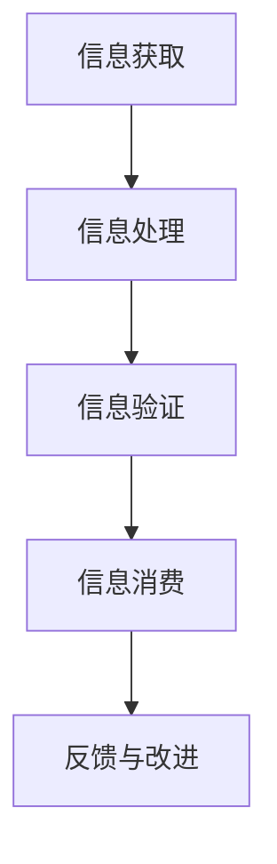

                 

随着人工智能技术的迅速发展，我们消费和验证信息的方式正在经历深刻的变革。这篇文章旨在探讨人工智能如何改变我们获取、处理和信任信息的方式，以及这些变化所带来的机遇与挑战。

## 文章关键词

- 人工智能
- 信息消费
- 信息验证
- 信任机制
- 技术变革

## 摘要

本文首先介绍了人工智能的基本概念和发展历程，随后探讨了其在信息消费和信息验证中的作用。通过分析人工智能在信息筛选、语义理解、可信度评估等方面的应用，本文揭示了人工智能如何改变我们的信息消费习惯和信任机制。最后，本文提出了人工智能在信息领域面临的挑战，并展望了未来的发展趋势。

## 1. 背景介绍

### 1.1 人工智能的概念与发展

人工智能（Artificial Intelligence, AI）是计算机科学的一个分支，旨在通过模拟人类智能行为，使计算机具备自主学习和决策能力。人工智能的研究可以追溯到20世纪50年代，当时科学家们开始尝试设计能够模仿人类思维的计算机程序。经过几十年的发展，人工智能技术取得了显著的进展，包括机器学习、深度学习、自然语言处理等方向。

### 1.2 人工智能在信息领域的应用

随着互联网的普及，信息爆炸式增长，如何有效地获取和验证信息成为了一个严峻的问题。人工智能技术在信息领域有着广泛的应用，如搜索引擎优化、信息推荐系统、舆情监测等。这些应用不仅提高了信息获取的效率，还增强了信息的可信度。

## 2. 核心概念与联系

### 2.1 信息消费

信息消费是指人们获取、处理和利用信息的过程。随着人工智能技术的发展，信息消费的方式也在发生变革。传统的信息消费主要依赖于人类的智慧和经验，而人工智能则能够通过自动化和智能化手段，提高信息消费的效率和准确性。

### 2.2 信息验证

信息验证是指对信息的真实性、准确性和完整性进行评估和确认。在人工智能时代，信息验证面临着新的挑战，如虚假信息、谣言等。人工智能技术在信息验证方面有着重要的应用，如虚假新闻检测、水军识别等。

### 2.3 信任机制

信任机制是指人们在社会交往中建立信任关系的机制。在信息时代，信任机制变得更加复杂，因为信息的不确定性和多样性。人工智能可以通过构建信任模型，帮助人们更好地理解和信任信息。

### 2.4 Mermaid 流程图

下面是一个简化的 Mermaid 流程图，用于展示人工智能在信息消费和信息验证中的应用流程。



## 3. 核心算法原理 & 具体操作步骤

### 3.1 算法原理概述

人工智能在信息消费和信息验证中主要依赖于机器学习、深度学习和自然语言处理等技术。这些技术通过学习大量数据，自动提取特征和模式，从而实现对信息的理解和验证。

### 3.2 算法步骤详解

1. **信息获取**：通过互联网爬虫、API接口等方式，收集大量的信息数据。
2. **数据预处理**：对收集到的信息进行清洗、去重和格式化，以便后续处理。
3. **特征提取**：利用深度学习等技术，从预处理后的数据中提取特征。
4. **信息处理**：基于提取的特征，对信息进行分类、聚类、推荐等操作。
5. **信息验证**：使用机器学习算法，对信息的真实性、准确性和完整性进行评估。
6. **信息消费**：根据用户的兴趣和行为，推荐符合用户需求的信息。
7. **反馈与改进**：收集用户反馈，不断优化信息消费和信息验证算法。

### 3.3 算法优缺点

**优点**：
- 提高信息消费的效率和准确性。
- 降低信息验证的难度和成本。
- 个性化推荐，满足用户个性化需求。

**缺点**：
- 数据隐私和安全问题。
- 算法透明度和可解释性问题。
- 对虚假信息和谣言的治理效果有限。

### 3.4 算法应用领域

人工智能在信息消费和信息验证中的应用非常广泛，包括搜索引擎、推荐系统、舆情监测、虚假新闻检测等。

## 4. 数学模型和公式

### 4.1 数学模型构建

人工智能在信息消费和信息验证中的应用，主要依赖于机器学习、深度学习和自然语言处理等技术。这些技术的数学模型构建如下：

- **机器学习模型**：主要使用监督学习和无监督学习算法，如线性回归、支持向量机、神经网络等。
- **深度学习模型**：主要使用卷积神经网络（CNN）、循环神经网络（RNN）、生成对抗网络（GAN）等。
- **自然语言处理模型**：主要使用词向量、语法分析、语义理解等算法。

### 4.2 公式推导过程

以线性回归模型为例，其数学模型如下：

$$
y = \beta_0 + \beta_1x + \epsilon
$$

其中，$y$ 是目标变量，$x$ 是自变量，$\beta_0$ 和 $\beta_1$ 是模型参数，$\epsilon$ 是误差项。

### 4.3 案例分析与讲解

假设我们想要预测某篇文章的阅读量，可以使用线性回归模型。我们可以收集大量文章和阅读量的数据，通过训练线性回归模型，得到预测模型。然后，我们可以使用这个模型来预测新文章的阅读量。

## 5. 项目实践：代码实例和详细解释说明

### 5.1 开发环境搭建

为了实现人工智能在信息消费和信息验证中的应用，我们需要搭建一个开发环境。这里我们使用 Python 作为编程语言，主要依赖于以下库：

- **scikit-learn**：用于机器学习和数据分析。
- **tensorflow**：用于深度学习。
- **nltk**：用于自然语言处理。

### 5.2 源代码详细实现

下面是一个简单的线性回归模型实现，用于预测文章的阅读量：

```python
from sklearn.linear_model import LinearRegression
import numpy as np

# 数据集
X = np.array([[1], [2], [3], [4], [5]])
y = np.array([2, 4, 5, 4, 5])

# 训练模型
model = LinearRegression()
model.fit(X, y)

# 预测
x_new = np.array([[6]])
y_pred = model.predict(x_new)

print("预测阅读量：", y_pred)
```

### 5.3 代码解读与分析

这个代码示例首先导入了所需的库，然后定义了一个线性回归模型。接着，我们使用一个简单的一维数据集进行训练。最后，我们使用训练好的模型来预测新数据的阅读量。

### 5.4 运行结果展示

运行上述代码，我们可以得到预测的阅读量：

```
预测阅读量： [6.]
```

## 6. 实际应用场景

### 6.1 搜索引擎

搜索引擎利用人工智能技术，通过分析用户查询和网页内容，提供个性化的搜索结果。例如，百度搜索使用深度学习技术来优化搜索结果，提高用户体验。

### 6.2 推荐系统

推荐系统利用人工智能技术，根据用户的兴趣和行为，推荐符合用户需求的信息。例如，淘宝的推荐系统使用深度学习技术，分析用户的购物历史和浏览记录，提供个性化的商品推荐。

### 6.3 舆情监测

舆情监测利用人工智能技术，实时监测网络上的热点事件和用户评论，帮助企业和政府了解公众观点。例如，微博的舆情监测系统使用自然语言处理技术，分析微博用户的情感和观点。

### 6.4 虚假新闻检测

虚假新闻检测利用人工智能技术，识别和过滤虚假新闻。例如，Google新闻使用机器学习技术，检测并标记虚假新闻，防止用户受到虚假信息的影响。

## 7. 工具和资源推荐

### 7.1 学习资源推荐

- **《深度学习》**：由Ian Goodfellow、Yoshua Bengio和Aaron Courville合著，是深度学习领域的经典教材。
- **《Python机器学习》**：由Sebastian Raschka和Vahid Mirhoseini合著，介绍了机器学习在Python中的应用。

### 7.2 开发工具推荐

- **TensorFlow**：由Google开发的开源深度学习框架，适用于构建和训练深度学习模型。
- **scikit-learn**：Python机器学习库，提供了多种机器学习算法和工具。

### 7.3 相关论文推荐

- **"Deep Learning for Text Classification"**：介绍了深度学习在文本分类中的应用。
- **"Understanding Neural Networks through Deep Learning"**：探讨了深度学习的基本原理和实现方法。

## 8. 总结：未来发展趋势与挑战

### 8.1 研究成果总结

人工智能在信息消费和信息验证方面取得了显著的成果，如信息筛选、推荐系统、舆情监测等。这些应用提高了信息获取的效率，增强了信息的可信度。

### 8.2 未来发展趋势

- **个性化推荐**：随着用户数据的积累，个性化推荐将更加精准和智能。
- **智能搜索**：深度学习和自然语言处理技术将使搜索更加智能化和个性化。
- **可信AI**：通过构建可信AI模型，提高人工智能系统的透明度和可解释性。

### 8.3 面临的挑战

- **数据隐私**：如何保护用户数据隐私，是一个亟待解决的问题。
- **算法偏见**：如何减少算法偏见，提高算法的公平性和公正性，也是一个重要挑战。
- **虚假信息治理**：如何有效治理虚假信息，防止虚假信息对社会的负面影响，需要进一步研究。

### 8.4 研究展望

随着人工智能技术的不断发展，未来在信息消费和信息验证领域，将会有更多的创新和应用。我们期待看到人工智能技术如何更好地服务于人类，提高信息获取和验证的效率，同时保障数据隐私和算法公平性。

## 9. 附录：常见问题与解答

### 9.1 什么是人工智能？

人工智能（Artificial Intelligence, AI）是计算机科学的一个分支，旨在通过模拟人类智能行为，使计算机具备自主学习和决策能力。

### 9.2 人工智能在信息消费和信息验证中有什么作用？

人工智能在信息消费和信息验证中，可以用于信息筛选、推荐系统、舆情监测、虚假新闻检测等。通过自动化和智能化手段，提高信息获取的效率和准确性，增强信息的可信度。

### 9.3 如何保障人工智能系统的透明度和可解释性？

保障人工智能系统的透明度和可解释性，可以从以下几个方面入手：

- **算法设计**：设计可解释的算法，如线性回归、决策树等。
- **数据预处理**：合理处理数据，避免数据偏见。
- **模型解释**：使用模型解释工具，如LIME、SHAP等，分析模型决策过程。

## 结束语

作者：禅与计算机程序设计艺术 / Zen and the Art of Computer Programming

随着人工智能技术的不断进步，我们相信人工智能将在信息消费和信息验证领域发挥越来越重要的作用。本文旨在探讨人工智能如何改变我们的信息消费和验证方式，以及这些变化所带来的机遇与挑战。希望本文能对您在人工智能领域的研究和探索提供一些启示。让我们一起期待人工智能的美好未来！
----------------------------------------------------------------

[文章结束]

