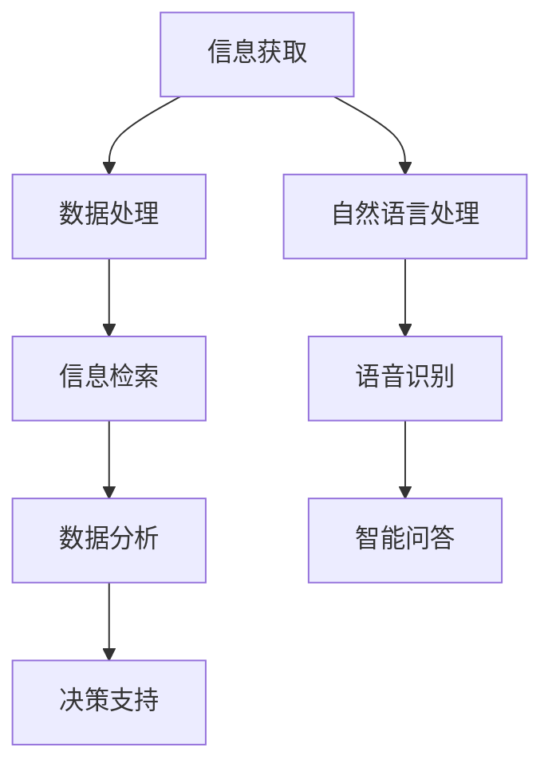

                 

关键词：人工智能，信息处理，数据获取，技术变革，算法优化，人机交互，信息检索，机器学习，自然语言处理，深度学习

> 摘要：本文将探讨人工智能技术如何深刻改变我们获取和处理信息的方式。通过对核心概念的介绍、算法原理的解析、数学模型的阐述以及实际应用场景的分析，全面展示AI技术的强大潜力和广泛应用前景。

## 1. 背景介绍

### 1.1 人工智能的发展历程

人工智能（AI）是计算机科学的一个分支，旨在创建能够执行复杂任务并模拟人类智能的机器。人工智能的历史可以追溯到20世纪50年代，当时图灵提出了“图灵测试”，用于评估机器是否具备人类级别的智能。

在随后的几十年中，人工智能经历了多次高潮和低谷。20世纪80年代，专家系统的出现标志着AI的第一个黄金时代。然而，由于数据量和计算能力的限制，AI的研究和应用在90年代陷入了低潮。

进入21世纪，随着互联网的普及、大数据技术和高性能计算的发展，人工智能迎来了新的机遇。特别是深度学习和机器学习的突破，使得AI在图像识别、自然语言处理、自动驾驶等领域取得了显著的进展。

### 1.2 信息处理的重要性

信息处理是现代社会不可或缺的一部分。无论是政府、企业还是个人，都在不断生成、存储、分析和利用大量数据。高效的信息处理能力不仅能够提高工作效率，还能为决策提供有力支持。

传统的信息处理方法往往依赖于手工和自动化程度较低的流程，容易出现错误、效率低下。随着AI技术的不断发展，我们逐渐迈向自动化、智能化的信息处理新时代。

## 2. 核心概念与联系

### 2.1 人工智能的核心概念

人工智能的核心概念包括机器学习、深度学习、自然语言处理等。

- **机器学习**：通过算法从数据中学习，不断优化模型的性能。
- **深度学习**：一种特殊的机器学习方法，利用多层神经网络进行特征提取和模式识别。
- **自然语言处理**：使计算机能够理解、生成和处理自然语言的技术。

### 2.2 人工智能与信息处理的联系

人工智能技术能够显著提升信息处理的效率和质量。例如，在图像识别领域，深度学习算法可以自动提取图像中的关键特征，从而实现更准确、更高效的识别。

在自然语言处理方面，AI技术可以自动解析文本、提取关键词、进行文本分类和情感分析等，极大地简化了信息处理的过程。

### 2.3 Mermaid 流程图



## 3. 核心算法原理 & 具体操作步骤

### 3.1 算法原理概述

在人工智能技术中，常用的核心算法包括深度学习算法、机器学习算法和自然语言处理算法。

- **深度学习算法**：通过多层神经网络进行特征提取和模式识别，适用于图像识别、语音识别等领域。
- **机器学习算法**：通过从数据中学习，不断优化模型的性能，适用于分类、回归等问题。
- **自然语言处理算法**：通过解析文本、提取关键词、进行文本分类和情感分析等，适用于信息检索、智能问答等领域。

### 3.2 算法步骤详解

以深度学习算法为例，其基本步骤如下：

1. **数据收集与预处理**：收集相关数据，并对数据进行清洗、去噪、归一化等预处理操作。
2. **模型构建**：根据任务需求，构建合适的深度学习模型，例如卷积神经网络（CNN）或循环神经网络（RNN）。
3. **模型训练**：使用预处理后的数据对模型进行训练，优化模型参数。
4. **模型评估**：使用验证数据集对模型进行评估，调整模型参数以优化性能。
5. **模型部署**：将训练好的模型部署到实际应用场景中，例如图像识别系统或智能问答系统。

### 3.3 算法优缺点

- **深度学习算法**：优点在于强大的特征提取能力和模式识别能力，但缺点是需要大量的数据和计算资源。
- **机器学习算法**：优点在于算法简单、易于实现，但缺点在于特征工程复杂、可解释性较差。
- **自然语言处理算法**：优点在于能够处理大量文本数据，但缺点在于对语言理解能力的要求较高。

### 3.4 算法应用领域

人工智能算法在多个领域取得了广泛应用，包括：

- **图像识别**：应用于安防监控、医疗影像诊断等领域。
- **自然语言处理**：应用于智能客服、智能翻译等领域。
- **语音识别**：应用于语音助手、智能家居等领域。
- **自动驾驶**：应用于无人驾驶汽车、无人出租车等领域。

## 4. 数学模型和公式 & 详细讲解 & 举例说明

### 4.1 数学模型构建

在深度学习算法中，常用的数学模型包括神经网络、卷积神经网络和循环神经网络。

- **神经网络**：由多个神经元组成的非线性模型，用于处理非线性问题。
- **卷积神经网络**：利用卷积运算提取图像特征，适用于图像识别任务。
- **循环神经网络**：利用循环结构处理序列数据，适用于自然语言处理任务。

### 4.2 公式推导过程

以卷积神经网络（CNN）为例，其核心公式包括卷积运算、激活函数和池化操作。

1. **卷积运算**：

   $$ f(x) = \sum_{i=1}^{k} w_i * x_i + b $$

   其中，$w_i$为权重，$x_i$为输入特征，$b$为偏置。

2. **激活函数**：

   $$ f(x) = \max(0, x) $$

   ReLU函数作为常用的激活函数，能够提高神经网络的训练效率。

3. **池化操作**：

   $$ f(x) = \max_i (x_i) $$

   池化操作用于降低特征图的维度，提高模型的表达能力。

### 4.3 案例分析与讲解

以自然语言处理中的情感分析任务为例，我们可以使用循环神经网络（RNN）进行模型构建和训练。

1. **数据预处理**：

   收集并清洗文本数据，将文本转换为词向量表示。

2. **模型构建**：

   $$ \text{RNN} = (\text{输入层}, \text{隐藏层}, \text{输出层}) $$

   输入层接收词向量表示，隐藏层利用RNN结构处理序列数据，输出层进行分类或回归。

3. **模型训练**：

   使用训练数据对模型进行训练，优化模型参数。

4. **模型评估**：

   使用验证数据集对模型进行评估，调整模型参数以优化性能。

5. **模型部署**：

   将训练好的模型部署到实际应用场景中，例如情感分析系统。

## 5. 项目实践：代码实例和详细解释说明

### 5.1 开发环境搭建

为了实践人工智能技术，我们需要搭建一个开发环境。以下是常见的开发环境搭建步骤：

1. **安装Python**：下载并安装Python 3.x版本。
2. **安装Jupyter Notebook**：使用pip命令安装Jupyter Notebook。
3. **安装深度学习库**：例如TensorFlow、PyTorch等。

### 5.2 源代码详细实现

以下是一个简单的深度学习项目，使用卷积神经网络（CNN）对图像进行分类。

```python
import tensorflow as tf
from tensorflow.keras import layers

# 构建CNN模型
model = tf.keras.Sequential([
    layers.Conv2D(32, (3, 3), activation='relu', input_shape=(28, 28, 1)),
    layers.MaxPooling2D((2, 2)),
    layers.Conv2D(64, (3, 3), activation='relu'),
    layers.MaxPooling2D((2, 2)),
    layers.Conv2D(64, (3, 3), activation='relu'),
    layers.Flatten(),
    layers.Dense(64, activation='relu'),
    layers.Dense(10, activation='softmax')
])

# 编译模型
model.compile(optimizer='adam',
              loss='sparse_categorical_crossentropy',
              metrics=['accuracy'])

# 加载数据集
mnist = tf.keras.datasets.mnist
(x_train, y_train), (x_test, y_test) = mnist.load_data()

# 预处理数据集
x_train = x_train.reshape(-1, 28, 28, 1).astype('float32') / 255
x_test = x_test.reshape(-1, 28, 28, 1).astype('float32') / 255

# 训练模型
model.fit(x_train, y_train, epochs=5)

# 评估模型
model.evaluate(x_test, y_test)
```

### 5.3 代码解读与分析

上述代码实现了一个简单的CNN模型，用于对MNIST手写数字数据集进行分类。

- **模型构建**：使用`tf.keras.Sequential`构建模型，包含卷积层、池化层和全连接层。
- **模型编译**：使用`model.compile`编译模型，指定优化器和损失函数。
- **数据预处理**：将数据集转换为适当的形式，例如归一化。
- **模型训练**：使用`model.fit`训练模型，指定训练轮数。
- **模型评估**：使用`model.evaluate`评估模型性能。

### 5.4 运行结果展示

在训练过程中，我们可以通过`model.fit`的回调函数查看训练进度和性能指标。训练完成后，通过`model.evaluate`评估模型在测试集上的表现。

## 6. 实际应用场景

### 6.1 图像识别

图像识别是人工智能技术的重要应用之一。通过深度学习算法，计算机可以自动识别和分类图像中的对象。图像识别技术在安防监控、医疗影像诊断、自动驾驶等领域具有广泛应用。

### 6.2 自然语言处理

自然语言处理技术使计算机能够理解和处理人类语言。在智能客服、智能翻译、文本分类等应用中，自然语言处理技术发挥着重要作用。随着深度学习算法的不断发展，自然语言处理技术的性能和精度不断提升。

### 6.3 语音识别

语音识别技术将语音转换为文本，使计算机能够理解人类语音。语音识别技术在语音助手、智能家居、语音搜索等领域具有广泛应用。随着深度学习算法的进步，语音识别的准确率和稳定性不断提高。

### 6.4 未来应用展望

随着人工智能技术的不断发展，未来将进一步拓展其应用领域，包括：

- **智能医疗**：通过人工智能技术辅助医生进行疾病诊断、治疗方案制定等。
- **智慧城市**：通过人工智能技术实现城市交通管理、环境监测等智能化管理。
- **教育**：通过人工智能技术提供个性化教育、智能辅导等。
- **娱乐**：通过人工智能技术实现智能推荐、虚拟现实等。

## 7. 工具和资源推荐

### 7.1 学习资源推荐

- **《深度学习》（Goodfellow et al.）**：一本经典的深度学习入门教材。
- **吴恩达的深度学习课程**：网上免费提供的深度学习课程，适合初学者入门。

### 7.2 开发工具推荐

- **TensorFlow**：谷歌开源的深度学习框架，广泛应用于工业界和学术界。
- **PyTorch**：基于Python的深度学习框架，提供灵活的动态计算图。

### 7.3 相关论文推荐

- **"A Survey on Deep Learning for Image Classification"**：一篇关于深度学习在图像分类领域应用的综述。
- **"Transformers: State-of-the-Art Natural Language Processing"**：一篇关于Transformer模型在自然语言处理领域应用的经典论文。

## 8. 总结：未来发展趋势与挑战

### 8.1 研究成果总结

人工智能技术在图像识别、自然语言处理、语音识别等领域取得了显著成果，极大地改变了信息获取和处理的方式。深度学习和机器学习算法的不断发展，为人工智能技术的应用提供了强大的支持。

### 8.2 未来发展趋势

随着计算能力的提升、数据量的增加和算法的优化，人工智能技术将继续快速发展。未来，人工智能技术将深入应用于更多领域，推动社会进步和经济发展。

### 8.3 面临的挑战

人工智能技术发展面临诸多挑战，包括数据隐私保护、算法透明度和可解释性、资源分配等。解决这些挑战需要学术界、工业界和政策制定者共同努力。

### 8.4 研究展望

人工智能技术在未来有望实现更多突破，例如人机交互、智能决策、智慧城市等。随着人工智能技术的不断进步，我们将迎来一个更加智能化、高效化的信息时代。

## 9. 附录：常见问题与解答

### 9.1 人工智能的定义是什么？

人工智能是指通过计算机技术模拟人类智能，使计算机具备感知、学习、推理和决策等能力。

### 9.2 深度学习和机器学习的区别是什么？

深度学习是机器学习的一个分支，主要使用多层神经网络进行特征提取和模式识别。而机器学习则是一个更广泛的概念，包括深度学习在内的多种算法和技术。

### 9.3 如何入门人工智能？

入门人工智能可以从学习Python编程语言和基础数学知识开始，然后逐步学习机器学习和深度学习算法，最后进行实际项目实践。

### 9.4 人工智能的发展前景如何？

人工智能具有广阔的发展前景，将在多个领域实现突破和应用。未来，人工智能有望成为推动社会进步和经济发展的重要力量。 
```markdown
----------------------------------------------------------------

### 作者署名

作者：禅与计算机程序设计艺术 / Zen and the Art of Computer Programming
```

