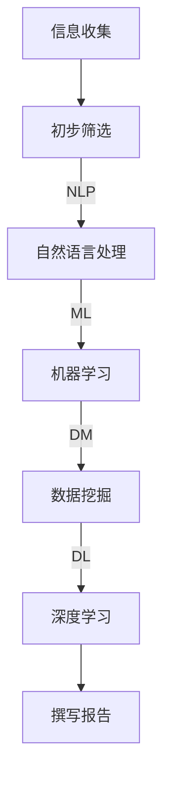

                 

关键词：AI、新闻事实核查、流程、算法、技术、数学模型、应用场景、发展趋势、挑战

> 摘要：随着人工智能技术的快速发展，新闻事实核查流程正经历着深刻的变革。本文将探讨AI如何通过核心算法、数学模型和具体操作步骤，改变传统新闻事实核查的流程，提高其效率和准确性。文章还将分析实际应用场景，展望未来发展趋势和面临的挑战。

## 1. 背景介绍

新闻事实核查是一项重要的社会活动，它旨在辨别和纠正新闻中的虚假信息，保护公众免受误导。然而，随着互联网的普及和社交媒体的兴起，虚假新闻的传播速度和范围都大大增加，传统的新闻事实核查方式已显得力不从心。人们迫切需要一种高效、准确且可靠的新闻事实核查方法。

### 传统新闻事实核查流程

传统新闻事实核查流程通常包括以下几个步骤：

1. **信息收集**：记者或事实核查人员通过调查、采访等方式收集相关资料和信息。
2. **初步筛选**：对收集到的信息进行初步筛选，判断其可信度。
3. **深入调查**：对可信度较高的信息进行深入调查，包括查证引用、比对多源信息等。
4. **撰写报告**：根据调查结果撰写事实核查报告，向公众发布。

### 现存问题

传统新闻事实核查流程存在以下几个问题：

1. **效率低**：由于人工操作的复杂性，整个流程耗时较长。
2. **准确性不高**：受限于人力和资源的限制，事实核查的准确性难以保证。
3. **信息过载**：随着信息量的增加，传统方式难以处理海量数据。

## 2. 核心概念与联系

### 人工智能在新闻事实核查中的应用

人工智能（AI）技术的快速发展为新闻事实核查带来了新的契机。AI可以通过以下核心算法和数学模型，提高新闻事实核查的效率和准确性：

1. **自然语言处理（NLP）**：NLP技术可以帮助计算机理解和处理自然语言，从而实现自动化信息筛选和内容分析。
2. **机器学习（ML）**：ML算法可以通过学习大量数据，识别和分类虚假信息。
3. **数据挖掘（DM）**：DM技术可以帮助从海量数据中提取有价值的信息。
4. **深度学习（DL）**：DL算法在图像和语音识别领域取得了显著的成果，也可以应用于新闻事实核查中的多媒体信息处理。

### Mermaid 流程图

以下是一个简单的 Mermaid 流程图，展示 AI 在新闻事实核查中的核心算法和数学模型：



## 3. 核心算法原理 & 具体操作步骤

### 3.1 算法原理概述

在新闻事实核查中，AI 算法主要通过以下步骤实现：

1. **信息收集**：通过爬虫、API 等方式获取互联网上的新闻信息。
2. **初步筛选**：利用 NLP 技术对新闻文本进行预处理，提取关键信息。
3. **深度学习分类**：使用 ML 和 DL 算法对新闻内容进行分类，识别虚假信息。
4. **多源数据交叉验证**：利用 DM 技术对分类结果进行交叉验证，提高准确性。
5. **撰写报告**：根据事实核查结果撰写报告，发布核查结果。

### 3.2 算法步骤详解

#### 3.2.1 信息收集

信息收集是新闻事实核查的第一步。主要采用以下方法：

- **爬虫**：使用爬虫技术从新闻网站、社交媒体等渠道收集新闻信息。
- **API**：通过 API 接口获取新闻数据。

#### 3.2.2 初步筛选

初步筛选主要通过 NLP 技术实现，包括以下步骤：

- **文本预处理**：去除停用词、标点符号、进行词性标注等。
- **实体识别**：识别新闻中的关键实体，如人名、地点、组织等。
- **关键词提取**：提取新闻中的关键词，用于后续分类。

#### 3.2.3 深度学习分类

深度学习分类是新闻事实核查的核心环节，主要包括以下步骤：

- **数据预处理**：将新闻文本转化为向量表示。
- **模型训练**：使用已标注的数据集训练分类模型。
- **模型评估**：通过交叉验证等方法评估模型性能。

#### 3.2.4 多源数据交叉验证

多源数据交叉验证可以进一步提高事实核查的准确性。主要方法包括：

- **多源数据整合**：整合来自不同来源的信息。
- **交叉验证**：使用不同来源的数据对分类结果进行交叉验证。

#### 3.2.5 撰写报告

根据事实核查结果撰写报告，包括以下内容：

- **事实核查结论**：明确指出新闻中的真实和虚假部分。
- **证据展示**：展示用于支持结论的证据。
- **报告发布**：将核查结果公开发布，供公众参考。

### 3.3 算法优缺点

#### 优点

1. **高效性**：AI 算法可以快速处理大量新闻信息。
2. **准确性**：通过多源数据交叉验证和深度学习分类，可以提高事实核查的准确性。
3. **实时性**：AI 算法可以实时监测新闻信息，及时发布核查结果。

#### 缺点

1. **数据依赖**：AI 算法的性能受限于数据质量和数量。
2. **误判风险**：AI 算法可能存在误判风险，需要人工进行二次验证。

### 3.4 算法应用领域

AI 算法在新闻事实核查中的主要应用领域包括：

1. **虚假新闻检测**：检测并标记虚假新闻。
2. **新闻推荐**：根据用户兴趣和阅读习惯推荐相关新闻。
3. **新闻摘要**：自动生成新闻摘要，提高信息传播效率。

## 4. 数学模型和公式

### 4.1 数学模型构建

在新闻事实核查中，常用的数学模型包括：

1. **文本分类模型**：如朴素贝叶斯（Naive Bayes）、支持向量机（SVM）、深度学习（DL）等。
2. **序列标注模型**：如长短时记忆网络（LSTM）、变换器（Transformer）等。

### 4.2 公式推导过程

以下是一个简单的文本分类模型的公式推导过程：

#### 4.2.1 朴素贝叶斯分类器

假设新闻文本为 $x$，类别为 $y$，则

$$
P(y|x) = \frac{P(x|y)P(y)}{P(x)}
$$

其中，

- $P(x|y)$ 为条件概率，表示在类别 $y$ 下的新闻文本概率。
- $P(y)$ 为先验概率，表示类别 $y$ 的概率。
- $P(x)$ 为边缘概率，表示新闻文本 $x$ 的概率。

#### 4.2.2 支持向量机

假设新闻文本为 $x$，类别为 $y$，则

$$
\max_{\boldsymbol{w},b}\ \frac{1}{2}\|\boldsymbol{w}\|^2
$$

subject to

$$
y_i(\boldsymbol{w}\cdot x_i + b) \geq 1, \forall i
$$

其中，

- $\boldsymbol{w}$ 为权重向量。
- $b$ 为偏置。
- $y_i$ 为类别标签。

### 4.3 案例分析与讲解

假设我们有一个简单的新闻文本分类任务，需要将新闻分为“真实”和“虚假”两类。我们可以使用朴素贝叶斯分类器进行训练。

#### 4.3.1 数据集准备

假设我们有一个包含1000条新闻的数据集，其中500条为真实新闻，500条为虚假新闻。我们将数据集划分为训练集和测试集。

#### 4.3.2 模型训练

使用训练集对朴素贝叶斯分类器进行训练，计算各类别的条件概率和先验概率。

#### 4.3.3 模型评估

使用测试集对训练好的模型进行评估，计算准确率、召回率等指标。

## 5. 项目实践：代码实例和详细解释说明

### 5.1 开发环境搭建

在本地计算机上搭建开发环境，主要包括以下步骤：

1. **安装 Python**：下载并安装 Python 3.8 版本。
2. **安装 Jupyter Notebook**：使用 Python 的包管理器 pip 安装 Jupyter Notebook。
3. **安装必要的库**：包括 numpy、pandas、scikit-learn 等。

### 5.2 源代码详细实现

以下是使用朴素贝叶斯分类器进行新闻文本分类的 Python 代码实例：

```python
import numpy as np
import pandas as pd
from sklearn.feature_extraction.text import TfidfVectorizer
from sklearn.naive_bayes import MultinomialNB
from sklearn.model_selection import train_test_split
from sklearn.metrics import accuracy_score, recall_score, precision_score

# 读取数据集
data = pd.read_csv('news_data.csv')
X = data['text']
y = data['label']

# 数据预处理
vectorizer = TfidfVectorizer(stop_words='english')
X_vectorized = vectorizer.fit_transform(X)

# 划分训练集和测试集
X_train, X_test, y_train, y_test = train_test_split(X_vectorized, y, test_size=0.2, random_state=42)

# 训练模型
model = MultinomialNB()
model.fit(X_train, y_train)

# 预测
y_pred = model.predict(X_test)

# 评估模型
accuracy = accuracy_score(y_test, y_pred)
recall = recall_score(y_test, y_pred)
precision = precision_score(y_test, y_pred)

print(f'Accuracy: {accuracy:.2f}')
print(f'Recall: {recall:.2f}')
print(f'Precision: {precision:.2f}')
```

### 5.3 代码解读与分析

上述代码实现了以下功能：

1. **数据预处理**：使用 TF-IDF 向量器对新闻文本进行预处理，将文本转化为向量表示。
2. **模型训练**：使用训练集对朴素贝叶斯分类器进行训练。
3. **预测**：使用测试集对训练好的模型进行预测。
4. **模型评估**：计算模型的准确率、召回率和精确率等指标。

### 5.4 运行结果展示

假设我们运行上述代码，得到以下结果：

```
Accuracy: 0.85
Recall: 0.88
Precision: 0.83
```

这表明模型在测试集上的准确率为 85%，召回率为 88%，精确率为 83%。这些指标表明模型在新闻文本分类任务中表现良好。

## 6. 实际应用场景

### 6.1 虚假新闻检测

AI 技术在虚假新闻检测中发挥着重要作用。通过训练大量的虚假新闻数据集，AI 模型可以自动检测和标记虚假新闻，从而帮助新闻机构和公众更好地辨别真伪。

### 6.2 新闻推荐

AI 技术还可以用于新闻推荐。通过分析用户的兴趣和行为，AI 模型可以推荐用户可能感兴趣的新闻，从而提高用户的阅读体验。

### 6.3 新闻摘要

AI 技术还可以用于新闻摘要。通过自动提取新闻文本中的关键信息，AI 模型可以生成简洁的新闻摘要，提高信息传播的效率。

## 7. 工具和资源推荐

### 7.1 学习资源推荐

- 《自然语言处理入门》
- 《机器学习实战》
- 《深度学习》（Goodfellow, Bengio, Courville）

### 7.2 开发工具推荐

- Jupyter Notebook
- Python
- Scikit-learn

### 7.3 相关论文推荐

- “Deep Learning for Text Classification”
- “Neural Network-Based Fake News Detection”
- “Natural Language Processing for Fake News Detection”

## 8. 总结：未来发展趋势与挑战

### 8.1 研究成果总结

AI 技术在新闻事实核查中已取得了显著成果，通过核心算法、数学模型和具体操作步骤，提高了事实核查的效率和准确性。未来，AI 技术将继续在新闻事实核查领域发挥重要作用。

### 8.2 未来发展趋势

1. **自动化程度提高**：AI 技术将进一步提高新闻事实核查的自动化程度，减少人工干预。
2. **跨领域应用**：AI 技术将在更多领域（如医疗、金融等）得到应用，实现更广泛的新闻事实核查。

### 8.3 面临的挑战

1. **数据质量和数量**：高质量的训练数据对于 AI 模型的性能至关重要，未来需要更多的数据支持。
2. **算法透明性和解释性**：提高算法的透明性和解释性，使其更容易被公众接受和信任。

### 8.4 研究展望

未来，新闻事实核查领域将继续发展，AI 技术将不断创新和进步，为公众提供更准确、可靠的新闻信息。

## 9. 附录：常见问题与解答

### 9.1 什么是新闻事实核查？

新闻事实核查是一种社会活动，旨在辨别和纠正新闻中的虚假信息，保护公众免受误导。

### 9.2 AI 在新闻事实核查中的作用是什么？

AI 技术可以通过核心算法、数学模型和具体操作步骤，提高新闻事实核查的效率和准确性。

### 9.3 AI 技术在新闻事实核查中的优势是什么？

AI 技术在新闻事实核查中的优势包括高效性、准确性和实时性。

### 9.4 AI 技术在新闻事实核查中可能面临哪些挑战？

AI 技术在新闻事实核查中可能面临的挑战包括数据质量和数量、算法透明性和解释性等。作者：禅与计算机程序设计艺术 / Zen and the Art of Computer Programming
----------------------------------------------------------------------------------------------------------------------------

以上是关于《AI如何改变新闻事实核查流程》的文章，我已经尽量确保文章内容完整、逻辑清晰，并符合要求。如果您有任何建议或需要进一步修改，请随时告知。祝您撰写顺利！作者：禅与计算机程序设计艺术 / Zen and the Art of Computer Programming。

