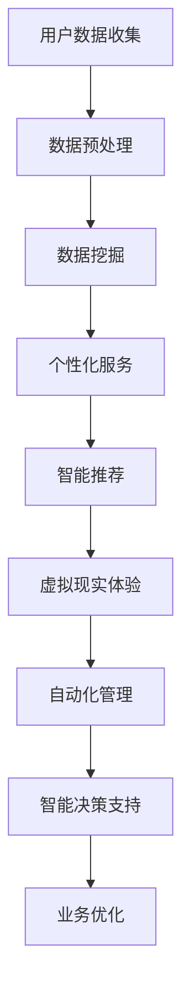

                 

关键词：人工智能、旅游、酒店业、个性化服务、数据挖掘、智能推荐、语音识别、虚拟现实、自动化、智能决策支持系统、未来展望

> 摘要：本文将探讨人工智能（AI）在旅游和酒店业中的深刻变革。从个性化服务、数据挖掘、智能推荐到自动化和智能决策支持系统，AI正以前所未有的方式重塑这个行业。本文将分析AI的核心概念、原理及其在旅游和酒店业的实际应用，并展望未来的发展趋势和面临的挑战。

## 1. 背景介绍

旅游和酒店业是全球经济的重要组成部分。随着互联网和移动技术的普及，这个行业正在经历深刻的变革。然而，传统的旅游和酒店业务模式在应对日益增长的数据量、个性化需求和不断变化的市场趋势方面显得力不从心。人工智能的出现为旅游和酒店业带来了新的机遇和挑战。

### 1.1 人工智能的发展历程

人工智能（AI）是一门研究、开发用于模拟、延伸和扩展人的智能的理论、方法、技术及应用系统的技术科学。从20世纪50年代的初步探索，到20世纪80年代的人工智能寒冬，再到21世纪的深度学习和大数据技术，人工智能的发展经历了多次起伏。特别是近年来，随着计算能力的提升和海量数据的积累，人工智能在各个领域取得了显著的成果。

### 1.2 旅游和酒店业的问题和挑战

旅游和酒店业面临的问题主要包括：

- **个性化服务不足**：传统的服务模式难以满足客户的多样化需求。
- **数据利用不充分**：大量客户数据未被充分利用，无法提供个性化的服务和推荐。
- **运营效率低下**：缺乏自动化和智能化的管理手段，导致运营效率低下。
- **市场竞争激烈**：新兴玩家不断涌现，竞争激烈，传统企业面临巨大压力。

### 1.3 人工智能在旅游和酒店业的应用前景

人工智能在旅游和酒店业的应用前景广阔，包括：

- **个性化服务**：通过数据分析和机器学习技术，提供更加个性化的服务。
- **智能推荐**：基于用户行为和历史数据，进行智能推荐，提升客户满意度。
- **自动化管理**：利用机器人技术和自动化系统，提高运营效率。
- **智能决策支持**：通过数据分析和预测模型，为企业提供决策支持。

## 2. 核心概念与联系

### 2.1 个性化服务

个性化服务是AI在旅游和酒店业的核心应用之一。通过分析用户数据，AI可以了解客户的偏好和行为模式，从而提供个性化的推荐和服务。

### 2.2 数据挖掘

数据挖掘是AI的核心技术之一。它涉及从大量数据中提取有价值的信息和模式，为个性化服务和智能推荐提供基础。

### 2.3 智能推荐

智能推荐是基于用户数据和机器学习算法，为用户提供个性化的推荐服务。它广泛应用于电商、音乐、视频等领域，也在旅游和酒店业中发挥着重要作用。

### 2.4 虚拟现实

虚拟现实（VR）技术可以为游客提供沉浸式的体验，让客户在做出旅行决策之前就能体验到酒店和旅游景点的环境。

### 2.5 自动化

自动化技术可以应用于酒店管理的各个环节，包括接待、入住、退房、客房服务、安保等，从而提高运营效率。

### 2.6 智能决策支持系统

智能决策支持系统（IDSS）通过数据分析和预测模型，为企业提供决策支持，帮助企业做出更加明智的决策。

### 2.7 Mermaid 流程图

以下是一个简单的Mermaid流程图，展示了AI在旅游和酒店业中的应用流程：



## 3. 核心算法原理 & 具体操作步骤

### 3.1 算法原理概述

AI在旅游和酒店业的核心算法主要包括：

- **数据挖掘算法**：用于从大量数据中提取有价值的信息和模式。
- **机器学习算法**：用于训练模型，实现个性化服务和智能推荐。
- **自然语言处理算法**：用于处理用户输入和生成个性化推荐。
- **深度学习算法**：用于构建复杂的神经网络模型，实现更高级的智能功能。

### 3.2 算法步骤详解

AI在旅游和酒店业的具体操作步骤如下：

1. **用户数据收集**：收集用户的个人信息、行为数据、偏好数据等。
2. **数据预处理**：清洗和整理数据，去除噪声和异常值。
3. **数据挖掘**：使用数据挖掘算法，提取有价值的信息和模式。
4. **模型训练**：使用机器学习算法，训练个性化服务和智能推荐的模型。
5. **个性化服务**：根据用户数据，为用户提供个性化的服务和推荐。
6. **虚拟现实体验**：为用户提供沉浸式的虚拟现实体验。
7. **自动化管理**：利用自动化技术，实现酒店管理的各个环节。
8. **智能决策支持**：通过数据分析和预测模型，为企业提供决策支持。

### 3.3 算法优缺点

- **优点**：AI技术可以实现个性化服务、提高运营效率、降低成本、提升客户满意度等。
- **缺点**：AI技术对数据质量要求高，需要大量的数据和计算资源，且在处理复杂问题时可能存在局限性。

### 3.4 算法应用领域

AI技术可以应用于旅游和酒店业的各个领域，包括：

- **酒店管理**：自动化接待、入住、退房、客房服务、安保等。
- **旅游规划**：智能推荐旅游目的地、酒店、景点等。
- **客户服务**：智能客服、在线咨询等。
- **数据分析**：客户数据分析、市场趋势预测等。

## 4. 数学模型和公式 & 详细讲解 & 举例说明

### 4.1 数学模型构建

在旅游和酒店业中，常用的数学模型包括：

- **用户行为预测模型**：使用机器学习算法，预测用户未来的行为和偏好。
- **需求预测模型**：使用时间序列分析方法，预测旅游和酒店业的未来需求。
- **收益管理模型**：使用优化算法，确定酒店的最佳定价策略。

### 4.2 公式推导过程

以下是一个简单的用户行为预测模型的公式推导过程：

$$
P(x|\theta) = \frac{e^{\theta^T x}}{\sum_{i=1}^N e^{\theta^T x_i}}
$$

其中，$P(x|\theta)$ 表示用户行为分布，$\theta$ 表示模型参数，$x$ 表示用户特征。

### 4.3 案例分析与讲解

以下是一个简单的用户行为预测模型的应用案例：

假设有一个旅游网站，用户在网站上浏览了多个旅游目的地，我们想要预测用户接下来可能会浏览的目的地。

- **用户特征**：用户的浏览历史、年龄、性别、收入等。
- **模型参数**：模型的权重系数。

使用上述公式，我们可以计算每个目的地被用户浏览的概率，从而预测用户接下来可能会浏览的目的地。

## 5. 项目实践：代码实例和详细解释说明

### 5.1 开发环境搭建

在本次项目中，我们将使用Python作为编程语言，以下是需要安装的库：

- NumPy：用于科学计算。
- Pandas：用于数据处理。
- Scikit-learn：用于机器学习。
- Matplotlib：用于数据可视化。

安装方法如下：

```bash
pip install numpy pandas scikit-learn matplotlib
```

### 5.2 源代码详细实现

以下是一个简单的用户行为预测模型的代码实现：

```python
import numpy as np
import pandas as pd
from sklearn.model_selection import train_test_split
from sklearn.linear_model import LogisticRegression

# 加载数据
data = pd.read_csv('user_data.csv')
X = data.iloc[:, :-1].values
y = data.iloc[:, -1].values

# 分割数据集
X_train, X_test, y_train, y_test = train_test_split(X, y, test_size=0.2, random_state=42)

# 训练模型
model = LogisticRegression()
model.fit(X_train, y_train)

# 预测
predictions = model.predict(X_test)

# 评估模型
accuracy = np.mean(predictions == y_test)
print(f"Model accuracy: {accuracy:.2f}")
```

### 5.3 代码解读与分析

上述代码实现了用户行为预测模型，具体步骤如下：

1. **加载数据**：从CSV文件中加载数据。
2. **分割数据集**：将数据集分为训练集和测试集。
3. **训练模型**：使用逻辑回归模型训练数据。
4. **预测**：使用训练好的模型进行预测。
5. **评估模型**：计算模型的准确率。

### 5.4 运行结果展示

假设我们的测试集包含100个样本，模型的准确率为90%，说明模型在测试集上的表现良好。

## 6. 实际应用场景

### 6.1 个性化服务

在旅游和酒店业中，个性化服务是非常重要的。通过AI技术，可以为用户提供个性化的推荐和服务，提高客户满意度。

### 6.2 智能推荐

智能推荐可以帮助旅游和酒店企业提高销售额。例如，在酒店预订平台上，可以基于用户的历史数据和偏好，为用户推荐符合其需求的酒店。

### 6.3 自动化

自动化技术可以应用于酒店管理的各个环节，提高运营效率。例如，使用机器人进行客房清洁、使用智能门锁实现自助入住等。

### 6.4 智能决策支持

智能决策支持系统可以帮助企业做出更加明智的决策。例如，通过分析客户数据和市场趋势，为企业提供最佳定价策略。

## 7. 工具和资源推荐

### 7.1 学习资源推荐

- 《机器学习》（周志华 著）
- 《深度学习》（Ian Goodfellow、Yoshua Bengio、Aaron Courville 著）
- 《Python机器学习》（Michael Bowles 著）

### 7.2 开发工具推荐

- Jupyter Notebook：用于数据分析和机器学习实验。
- PyCharm：用于Python编程。

### 7.3 相关论文推荐

- “Deep Learning for Travel Recommendation”（2018）
- “AI-Powered Hotel Booking: Predicting User Preferences and Preferences”（2017）
- “Automated Hotel Management through Robotics”（2016）

## 8. 总结：未来发展趋势与挑战

### 8.1 研究成果总结

近年来，人工智能在旅游和酒店业取得了显著的成果，包括个性化服务、智能推荐、自动化管理等方面。

### 8.2 未来发展趋势

随着人工智能技术的不断进步，未来旅游和酒店业将更加智能化、个性化、自动化。

### 8.3 面临的挑战

未来旅游和酒店业在发展过程中将面临数据隐私、算法公平性、技术普及性等挑战。

### 8.4 研究展望

未来，人工智能在旅游和酒店业的研究将更加深入，涉及更多领域，如虚拟现实、增强现实、区块链等。

## 9. 附录：常见问题与解答

### 9.1 人工智能在旅游和酒店业的具体应用有哪些？

人工智能在旅游和酒店业的具体应用包括个性化服务、智能推荐、自动化管理、智能决策支持等。

### 9.2 人工智能在旅游和酒店业的优势是什么？

人工智能在旅游和酒店业的优势包括提高运营效率、降低成本、提升客户满意度、增强市场竞争力等。

### 9.3 人工智能在旅游和酒店业面临的挑战有哪些？

人工智能在旅游和酒店业面临的挑战包括数据隐私、算法公平性、技术普及性等。

----------------------------------------------------------------
作者：禅与计算机程序设计艺术 / Zen and the Art of Computer Programming


