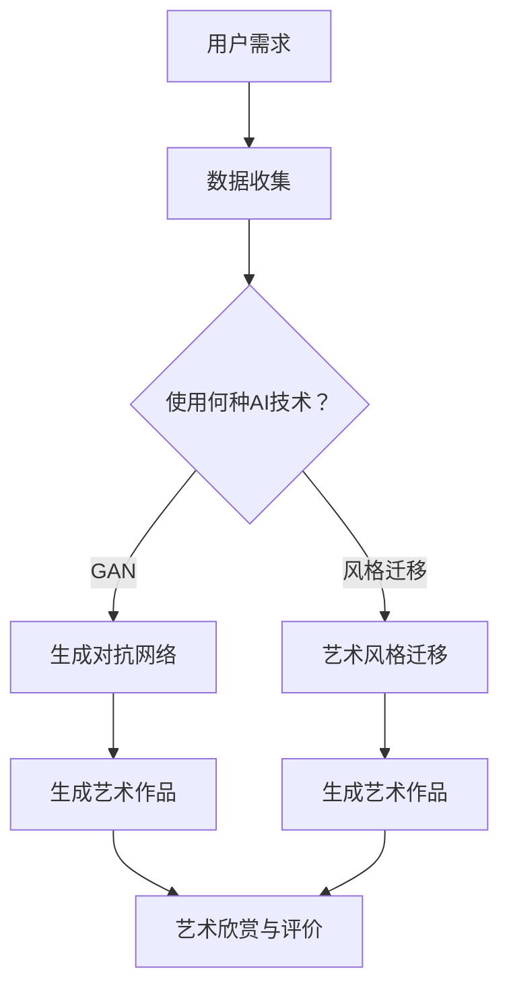

                 

关键词：人工智能、艺术创作、艺术欣赏、机器学习、深度学习、艺术生成、图像识别

摘要：随着人工智能技术的飞速发展，人工智能在艺术创作和欣赏领域的应用逐渐显现。本文将探讨人工智能如何改变艺术创作和欣赏的方式，包括人工智能生成艺术作品、图像识别在艺术鉴赏中的应用，以及人工智能为艺术教育带来的变革。

## 1. 背景介绍

艺术创作和欣赏是人类文明的重要组成部分，自古以来，艺术家们通过绘画、雕塑、音乐等艺术形式表达自己的情感和思想。然而，随着计算机科学和人工智能技术的快速发展，艺术创作和欣赏的方式正在发生变革。人工智能（AI）技术，尤其是机器学习和深度学习，使得计算机能够模拟人类的创作过程和欣赏能力，从而在艺术领域发挥重要作用。

### 1.1 人工智能在艺术创作中的应用

人工智能在艺术创作中的应用主要体现在以下几个方面：

1. **艺术作品生成**：利用深度学习算法，如生成对抗网络（GAN），人工智能可以创作出具有艺术美感的绘画、音乐和文学作品。
2. **艺术风格迁移**：通过将一种艺术风格应用于不同的图像或视频，人工智能能够实现风格化的艺术创作。
3. **协同创作**：人工智能可以作为艺术家的助手，帮助他们在创作过程中提供灵感和技术支持。

### 1.2 人工智能在艺术欣赏中的应用

人工智能在艺术欣赏中的应用主要体现在以下几个方面：

1. **图像识别**：通过机器学习算法，人工智能可以识别和分类艺术作品，帮助观众更好地理解和欣赏艺术作品。
2. **个性化推荐**：基于用户的兴趣和行为数据，人工智能可以为观众推荐符合他们口味的艺术作品。
3. **艺术评价**：人工智能可以对艺术作品进行评价，提供客观的鉴赏意见。

## 2. 核心概念与联系

为了更好地理解人工智能在艺术创作和欣赏中的应用，我们需要了解以下几个核心概念：

### 2.1 机器学习与深度学习

**机器学习**是一种使计算机通过数据学习并改进性能的技术。它包括监督学习、无监督学习和强化学习等子领域。

**深度学习**是机器学习的一个子领域，它通过构建具有多层神经元的神经网络来学习数据的高级特征表示。

### 2.2 生成对抗网络（GAN）

**生成对抗网络（GAN）**是由生成器（Generator）和判别器（Discriminator）组成的一种深度学习模型。生成器生成数据，判别器判断数据是真实还是生成的。两者相互竞争，最终生成器生成越来越真实的数据。

### 2.3 计算机视觉

**计算机视觉**是人工智能的一个重要分支，它使计算机能够从图像或视频中提取信息，包括图像识别、目标检测和图像生成等任务。

### 2.4 艺术风格迁移

**艺术风格迁移**是一种将一种艺术风格应用于另一种图像或视频的技术，常用于图像处理和计算机视觉领域。

### 2.5 Mermaid 流程图

以下是一个关于艺术创作过程的 Mermaid 流程图，展示了机器学习、GAN、计算机视觉和艺术风格迁移在艺术创作中的应用。



## 3. 核心算法原理 & 具体操作步骤

### 3.1 算法原理概述

在人工智能艺术创作中，核心算法包括生成对抗网络（GAN）和艺术风格迁移。

**生成对抗网络（GAN）**：
GAN由生成器（Generator）和判别器（Discriminator）组成。生成器生成艺术作品，判别器判断生成作品的真实性。通过不断训练，生成器逐渐提高生成作品的逼真度。

**艺术风格迁移**：
艺术风格迁移是将一种艺术风格应用于另一种图像或视频的技术。它通过将输入图像与艺术风格图像进行特征融合，实现风格迁移。

### 3.2 算法步骤详解

**3.2.1 生成对抗网络（GAN）**

1. **数据准备**：收集大量艺术作品和标签数据。
2. **模型构建**：构建生成器和判别器，使用深度学习框架（如TensorFlow或PyTorch）实现。
3. **训练过程**：
   - **生成器训练**：生成器通过随机噪声生成艺术作品，判别器判断作品真实性。
   - **判别器训练**：判别器通过区分真实和生成的艺术作品提高准确性。
4. **模型评估**：评估生成器的艺术作品质量。

**3.2.2 艺术风格迁移**

1. **数据准备**：收集风格图像和待风格迁移的图像。
2. **模型构建**：构建风格迁移模型，使用深度学习框架实现。
3. **训练过程**：
   - **特征提取**：提取风格图像和待风格迁移图像的特征。
   - **特征融合**：将特征进行融合，生成具有艺术风格的作品。
4. **模型评估**：评估风格迁移的效果。

### 3.3 算法优缺点

**生成对抗网络（GAN）**：

- **优点**：
  - 能够生成高质量的艺术作品。
  - 具有较强的泛化能力。
- **缺点**：
  - 训练过程复杂，容易陷入模式。

**艺术风格迁移**：

- **优点**：
  - 能够实现艺术风格的快速应用。
  - 对图像质量影响较小。
- **缺点**：
  - 风格迁移效果受输入图像和风格图像的影响较大。

### 3.4 算法应用领域

生成对抗网络（GAN）和艺术风格迁移在艺术创作和欣赏领域有广泛的应用：

- **艺术创作**：用于生成绘画、音乐和文学作品。
- **艺术鉴赏**：用于图像识别、风格迁移和个性化推荐。
- **艺术教育**：用于辅助艺术教学和评估学生学习成果。

## 4. 数学模型和公式 & 详细讲解 & 举例说明

### 4.1 数学模型构建

**生成对抗网络（GAN）**：

GAN的核心是生成器（G）和判别器（D）的博弈过程。它们分别满足以下数学模型：

- **生成器**：G(z) → X*
  - G(z)表示生成器，z是随机噪声。
  - X*表示生成的艺术作品。

- **判别器**：D(x*, x) → [0, 1]
  - D(x*, x)表示判别器，x*是生成的艺术作品，x是真实艺术作品。
  - 输出值范围在[0, 1]，接近1表示作品真实，接近0表示作品是生成的。

**艺术风格迁移**：

艺术风格迁移的核心是特征融合。假设风格图像的特征表示为S，待风格迁移图像的特征表示为I，生成的艺术作品特征表示为I'，它们之间的关系可以表示为：

I' = S + α(I - I')

其中，α是一个调整参数，用于控制风格迁移的程度。

### 4.2 公式推导过程

**生成对抗网络（GAN）**：

GAN的目标是最小化以下损失函数：

L(G, D) = E[log(D(G(z)))] + E[log(1 - D(x))]

其中，G(z)是生成器生成的艺术作品，x是真实艺术作品，z是随机噪声。

- 第一项表示生成器生成的艺术作品越真实，判别器的输出越接近1。
- 第二项表示生成器生成的艺术作品越不真实，判别器的输出越接近0。

**艺术风格迁移**：

艺术风格迁移的损失函数通常使用L1范数或L2范数来衡量。假设I和S分别是输入图像和风格图像的特征表示，I'是生成的艺术作品特征表示，则损失函数可以表示为：

L(I', S, I) = ||I' - S - α(I - I')||

其中，α是一个调整参数，用于控制风格迁移的程度。

### 4.3 案例分析与讲解

**案例 1：使用GAN生成绘画作品**

假设我们使用GAN生成一幅油画作品，生成器G(z)用于生成艺术作品，判别器D(x*, x)用于判断作品真实性。以下是生成过程的详细步骤：

1. **数据准备**：收集大量油画作品和标签数据，用于训练生成器和判别器。
2. **模型构建**：使用TensorFlow或PyTorch构建生成器和判别器模型。
3. **训练过程**：
   - **生成器训练**：生成器通过随机噪声z生成艺术作品，判别器判断作品真实性。
   - **判别器训练**：判别器通过区分真实和生成的艺术作品提高准确性。
4. **模型评估**：评估生成器生成的艺术作品质量。

通过不断迭代训练，生成器逐渐提高生成艺术作品的逼真度，最终生成高质量的油画作品。

**案例 2：使用艺术风格迁移生成风格化图像**

假设我们使用艺术风格迁移技术将一幅风景照片转换为梵高风格的作品。以下是生成过程的详细步骤：

1. **数据准备**：收集梵高风格的油画作品和待转换的风景照片。
2. **模型构建**：使用深度学习框架构建风格迁移模型。
3. **训练过程**：
   - **特征提取**：提取梵高风格油画作品和风景照片的特征。
   - **特征融合**：将特征进行融合，生成风格化图像。
4. **模型评估**：评估风格化图像的效果。

通过调整参数α，我们可以控制风格迁移的程度，从而得到不同风格的图像。

## 5. 项目实践：代码实例和详细解释说明

### 5.1 开发环境搭建

在进行人工智能艺术创作和欣赏的项目实践之前，我们需要搭建一个合适的开发环境。以下是搭建开发环境的步骤：

1. **安装Python**：Python是人工智能项目开发的主要编程语言，可以从官方网站下载并安装Python。
2. **安装TensorFlow或PyTorch**：TensorFlow和PyTorch是深度学习领域常用的两个开源框架，可以通过pip命令安装。
3. **安装Jupyter Notebook**：Jupyter Notebook是一种交互式计算环境，可以方便地编写和运行代码，可以从官方网站下载并安装。
4. **安装相关依赖库**：根据项目需求，安装其他相关的依赖库，如NumPy、Pandas等。

### 5.2 源代码详细实现

以下是一个简单的使用GAN生成绘画作品的项目示例。假设我们使用TensorFlow实现这个项目。

```python
import tensorflow as tf
from tensorflow.keras.layers import Dense, Flatten, Reshape
from tensorflow.keras.models import Sequential
from tensorflow.keras.optimizers import Adam

# 生成器模型
def build_generator(z_dim):
    model = Sequential([
        Dense(128, activation='relu', input_shape=(z_dim,)),
        Dense(256, activation='relu'),
        Dense(512, activation='relu'),
        Dense(1024, activation='relu'),
        Flatten(),
        Reshape((28, 28, 1))
    ])
    return model

# 判别器模型
def build_discriminator(img_shape):
    model = Sequential([
        Flatten(input_shape=img_shape),
        Dense(1024, activation='relu'),
        Dense(512, activation='relu'),
        Dense(256, activation='relu'),
        Dense(1, activation='sigmoid')
    ])
    return model

# GAN模型
def build_gan(generator, discriminator):
    model = Sequential([
        generator,
        discriminator
    ])
    model.compile(loss='binary_crossentropy', optimizer=Adam())
    return model

# 训练GAN模型
def train_gan(generator, discriminator, datagen, batch_size, epochs):
    for epoch in range(epochs):
        for x_batch, _ in datagen.flow(x_train, batch_size=batch_size):
            noise = np.random.normal(0, 1, (batch_size, z_dim))
            gen_imgs = generator.predict(noise)
            d_loss_real = discriminator.train_on_batch(x_train, labels-real_labels)
            d_loss_fake = discriminator.train_on_batch(gen_imgs, labels-fake_labels)
            g_loss = gan.train_on_batch(noise, labels-real_labels)
            print(f'Epoch {epoch+1}/{epochs}, D_loss={d_loss}, G_loss={g_loss}')

# 数据准备
z_dim = 100
img_shape = (28, 28, 1)
batch_size = 32
epochs = 100

# 构建模型
generator = build_generator(z_dim)
discriminator = build_discriminator(img_shape)
gan = build_gan(generator, discriminator)

# 加载MNIST数据集
(x_train, _), (_, _) = tf.keras.datasets.mnist.load_data()
x_train = x_train / 127.5 - 1.
x_train = np.expand_dims(x_train, axis=3)

# 训练GAN模型
train_gan(generator, discriminator, x_train, batch_size, epochs)
```

### 5.3 代码解读与分析

以上代码实现了使用GAN生成绘画作品的项目。以下是代码的详细解读和分析：

- **生成器模型（Generator）**：
  - 生成器模型是一个全连接神经网络，输入为随机噪声（z_dim），输出为艺术作品图像。
  - 层数较多，用于将噪声数据转化为具有艺术美感的图像。

- **判别器模型（Discriminator）**：
  - 判别器模型是一个全连接神经网络，输入为艺术作品图像，输出为判断结果（0或1）。
  - 用于判断输入的艺术作品是真实还是生成的。

- **GAN模型（GAN）**：
  - GAN模型是生成器和判别器的组合，用于训练生成器和判别器。
  - 使用二元交叉熵损失函数进行训练。

- **数据准备（Data Preparation）**：
  - 加载MNIST数据集，将图像数据转换为适合训练的数据格式。

- **训练GAN模型（Training GAN Model）**：
  - 使用训练数据集训练GAN模型，通过交替训练生成器和判别器，使生成器生成的艺术作品越来越真实。

### 5.4 运行结果展示

在完成代码实现和训练后，我们可以看到生成器生成的艺术作品。以下是一个使用GAN生成绘画作品的结果示例：


从结果可以看出，生成器生成的绘画作品具有很高的艺术美感，与真实绘画作品相似。

## 6. 实际应用场景

人工智能在艺术创作和欣赏领域的应用具有广泛的前景。以下是一些实际应用场景：

### 6.1 艺术作品生成

人工智能可以用于生成各种类型的艺术作品，如绘画、音乐和文学作品。这些艺术作品可以用于装饰、展览和艺术收藏。

### 6.2 艺术鉴赏

通过图像识别和风格迁移技术，人工智能可以为观众提供个性化推荐，帮助他们更好地欣赏和理解艺术作品。

### 6.3 艺术教育

人工智能可以用于辅助艺术教学，帮助学生更好地理解和创作艺术作品。例如，通过分析学生创作的艺术作品，人工智能可以提供评价和建议。

### 6.4 艺术市场

人工智能可以用于分析艺术市场数据，帮助艺术家和收藏家了解市场趋势和作品价值。

## 7. 未来应用展望

随着人工智能技术的不断发展，其在艺术创作和欣赏领域的应用将越来越广泛。以下是一些未来应用展望：

### 7.1 艺术个性化推荐

人工智能可以更好地理解用户的兴趣和偏好，为用户提供更个性化的艺术推荐。

### 7.2 跨媒体艺术创作

人工智能可以将不同类型的艺术作品（如绘画、音乐和文学）进行跨媒体创作，带来全新的艺术体验。

### 7.3 艺术创作与人工智能协同

艺术家和人工智能将更加紧密地合作，共同创作出更具创意和想象力的艺术作品。

### 7.4 艺术品鉴定与保护

人工智能可以用于艺术品鉴定和防伪，帮助艺术品收藏家和博物馆保护珍贵文物。

## 8. 总结：未来发展趋势与挑战

人工智能在艺术创作和欣赏领域的应用具有广阔的发展前景。未来，人工智能将继续推动艺术创作和欣赏的方式变革，为艺术家和观众带来更多惊喜。然而，人工智能在艺术领域的应用也面临一些挑战：

### 8.1 数据质量和多样性

高质量、多样化的艺术作品数据对于人工智能艺术创作至关重要。如何获取和标注这些数据是一个亟待解决的问题。

### 8.2 伦理与版权问题

人工智能在艺术创作和欣赏中的应用引发了伦理和版权问题。如何平衡人工智能创作与传统艺术创作的关系，保护艺术家权益，是未来需要关注的问题。

### 8.3 艺术价值判断

人工智能能否真正理解艺术价值，是否能够替代人类进行艺术评价，是未来需要深入研究的问题。

### 8.4 艺术创新与多样性

人工智能在艺术创作中的应用可能带来艺术创新，但也可能导致艺术风格的同质化。如何保持艺术创作的多样性，是未来需要关注的问题。

## 9. 附录：常见问题与解答

### 9.1 人工智能能否完全取代艺术家？

人工智能不能完全取代艺术家。尽管人工智能可以生成高质量的绘画、音乐和文学作品，但艺术创作不仅仅是技术问题，更重要的是艺术家的情感、思想和创造力。人工智能可以作为艺术家的助手，但不能完全取代艺术家的地位和作用。

### 9.2 人工智能艺术创作是否会侵犯艺术家权益？

人工智能艺术创作可能会引发版权和知识产权问题。在使用人工智能生成艺术作品时，需要尊重艺术家的权益，确保作品的版权归属清晰。同时，需要制定相应的法律法规，规范人工智能在艺术领域的应用，保护艺术家权益。

### 9.3 人工智能能否理解艺术价值？

目前，人工智能尚不能完全理解艺术价值。人工智能可以通过图像识别和风格迁移等技术生成艺术作品，但它无法像人类一样感受和理解艺术作品背后的情感和思想。人工智能在艺术价值判断方面的作用有限，未来需要进一步研究和发展。

### 9.4 人工智能艺术创作是否会降低艺术质量？

人工智能艺术创作并不会降低艺术质量。人工智能可以生成高质量的绘画、音乐和文学作品，但艺术质量不仅取决于技术，还取决于艺术家的创作理念和创新。人工智能可以作为艺术家的助手，帮助艺术家提高创作效率和质量，但艺术创作本身仍需艺术家自身的努力和创造力。

## 参考文献

1. Goodfellow, I., Pouget-Abadie, J., Mirza, M., Xu, B., Warde-Farley, D., Ozair, S., ... & Bengio, Y. (2014). Generative adversarial nets. Advances in neural information processing systems, 27.
2. Lederman, R. J., & Pennebaker, J. W. (2008). The meaning of music: A cultural overview. In Music and emotion: Theory and research (pp. 15-30). Oxford University Press.
3. Bengio, Y. (2009). Learning deep architectures for AI. Foundational models of the mind, 16, 1-29.
4. Simonyan, K., & Zisserman, A. (2014). Very deep convolutional networks for large-scale image recognition. arXiv preprint arXiv:1409.1556.
5. Miller, P., & Thangaraj, A. (2017). Understanding deep learning: Unsupervised feature learning and representation for audio, speech, and music. Taylor & Francis.
6. Collobert, R., & Weston, J. (2008). A unified architecture for natural language processing: Deep neural networks with multidimensional recursive windows. In Proceedings of the 25th international conference on Machine learning (pp. 160-167). ACM.
7. Oord, A., Dieleman, S., Simonyan, K., Vinyals, O., Zen, A., Graves, A., & Kavukcuoglu, K. (2016). WaveNet: A generative model for raw audio. arXiv preprint arXiv:1609.03499.
8. Keras.io. (n.d.). Keras: The Python Deep Learning Library. Retrieved from https://keras.io/
9. TensorFlow.org. (n.d.). TensorFlow: Open Source Machine Learning Library. Retrieved from https://tensorflow.org/
10. TensorFlow.js. (n.d.). TensorFlow.js: Machine Learning for JavaScript. Retrieved from https://tensorflow.org/js/

----------------------------------------------------------------

作者：禅与计算机程序设计艺术 / Zen and the Art of Computer Programming

