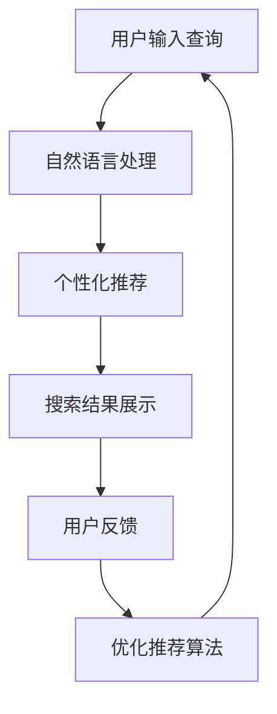

                 

关键词：人工智能，搜索引擎，用户界面，交互设计，机器学习，个性化搜索，自然语言处理

> 摘要：随着人工智能技术的快速发展，搜索引擎的用户界面设计也在不断革新。本文将探讨人工智能如何通过个性化推荐、自然语言处理和智能搜索交互，改善搜索引擎的用户界面，提高用户体验。

## 1. 背景介绍

搜索引擎作为互联网时代的重要入口，已经成为人们获取信息的主要方式。然而，传统的搜索引擎界面设计主要依赖于关键词搜索，用户需要输入精确的关键词来获取所需信息。这种设计虽然在一定程度上提高了搜索效率，但同时也存在一些问题，如搜索结果不准确、信息过载等。随着人工智能技术的发展，搜索引擎的用户界面设计迎来了新的变革。本文将探讨人工智能如何改善搜索引擎的用户界面，提高用户体验。

## 2. 核心概念与联系

### 2.1 个性化推荐系统

个性化推荐系统是一种基于用户历史行为和兴趣的数据分析技术，旨在为用户提供符合其个性化需求的推荐。在搜索引擎中，个性化推荐系统可以通过分析用户的搜索历史、浏览记录、点击行为等数据，为用户推荐相关度高、符合其兴趣的内容。

### 2.2 自然语言处理

自然语言处理（NLP）是人工智能的一个重要分支，旨在使计算机能够理解、生成和处理人类自然语言。在搜索引擎中，NLP技术可以帮助用户以更自然的方式表达搜索需求，如使用自然语言提问，搜索引擎可以解析并理解用户的问题，从而提供更准确的搜索结果。

### 2.3 智能搜索交互

智能搜索交互是一种基于人工智能技术的搜索交互方式，旨在通过智能问答、智能导航等方式，提升用户与搜索引擎的交互体验。智能搜索交互可以更好地满足用户的个性化需求，提高搜索效率。

### 2.4 Mermaid 流程图

图1：搜索引擎用户界面设计流程图



## 3. 核心算法原理 & 具体操作步骤

### 3.1 算法原理概述

搜索引擎的用户界面改善主要基于以下核心算法原理：

- 个性化推荐算法：通过分析用户历史行为和兴趣，为用户推荐相关度高、符合其兴趣的内容。
- 自然语言处理算法：通过解析用户输入的自然语言，理解用户的搜索需求，提供更准确的搜索结果。
- 智能搜索交互算法：通过智能问答、智能导航等方式，提升用户与搜索引擎的交互体验。

### 3.2 算法步骤详解

#### 3.2.1 个性化推荐算法

1. 数据采集：收集用户的搜索历史、浏览记录、点击行为等数据。
2. 数据预处理：对采集到的数据进行清洗、去噪、归一化等处理。
3. 特征提取：对预处理后的数据进行特征提取，如用户兴趣向量、内容特征向量等。
4. 模型训练：使用机器学习算法（如协同过滤、矩阵分解、深度学习等）训练推荐模型。
5. 推荐生成：根据用户特征和内容特征，生成个性化推荐列表。

#### 3.2.2 自然语言处理算法

1. 分词：将用户输入的自然语言文本分割成词序列。
2. 词性标注：对每个词进行词性标注，如名词、动词、形容词等。
3. 依存句法分析：分析词与词之间的依存关系，构建句子结构。
4. 意图识别：识别用户的搜索意图，如信息检索、问答等。
5. 结果生成：根据用户意图，生成对应的搜索结果。

#### 3.2.3 智能搜索交互算法

1. 问答系统：构建问答系统，使用户可以以自然语言提问，搜索引擎可以理解并回答。
2. 智能导航：分析用户的行为路径，提供智能化的导航建议。
3. 智能提示：根据用户行为和搜索历史，提供实时搜索提示。

### 3.3 算法优缺点

#### 3.3.1 个性化推荐算法

优点：提高搜索结果的个性化程度，满足用户的需求。

缺点：推荐结果可能存在冷启动问题，即对新用户缺乏足够的历史数据进行分析。

#### 3.3.2 自然语言处理算法

优点：提高搜索的便捷性，使用户可以更自然地表达搜索需求。

缺点：NLP技术尚不完全成熟，部分复杂问题可能无法准确理解。

#### 3.3.3 智能搜索交互算法

优点：提升用户与搜索引擎的交互体验，提供更加智能化的服务。

缺点：需要大量计算资源，对系统性能有一定要求。

### 3.4 算法应用领域

- 搜索引擎：如百度、谷歌等。
- 社交媒体：如微博、微信等。
- 电商平台：如淘宝、京东等。

## 4. 数学模型和公式 & 详细讲解 & 举例说明

### 4.1 数学模型构建

#### 4.1.1 个性化推荐模型

个性化推荐模型可以采用矩阵分解、协同过滤等方法。以矩阵分解为例，假设用户和物品都可以表示为高维向量，则可以使用矩阵分解方法将原始的用户-物品矩阵分解为两个低维矩阵，从而预测用户对物品的评分。

#### 4.1.2 自然语言处理模型

自然语言处理模型可以采用循环神经网络（RNN）、长短时记忆网络（LSTM）、变换器（Transformer）等方法。以变换器为例，假设输入的文本序列为 \(X = (x_1, x_2, ..., x_n)\)，则可以使用变换器模型对其进行编码和解析。

#### 4.1.3 智能搜索交互模型

智能搜索交互模型可以采用深度学习、强化学习等方法。以强化学习为例，假设用户的行为序列为 \(S = (s_1, s_2, ..., s_n)\)，则可以使用强化学习模型预测用户下一步的行为。

### 4.2 公式推导过程

#### 4.2.1 矩阵分解

假设用户-物品矩阵为 \(R \in \mathbb{R}^{m \times n}\)，则可以使用矩阵分解方法将其分解为两个低维矩阵 \(U \in \mathbb{R}^{m \times k}\) 和 \(V \in \mathbb{R}^{n \times k}\)，其中 \(k\) 为隐藏层维度。预测用户对物品的评分为：

$$
\hat{r}_{ui} = U_{u} \cdot V_{i}
$$

#### 4.2.2 变换器

变换器模型由编码器和解码器组成，假设输入的文本序列为 \(X = (x_1, x_2, ..., x_n)\)，则编码器的输出为：

$$
\hat{h}_i = \text{softmax}(W_h h_{i-1} + U_h x_i)
$$

其中，\(W_h\) 和 \(U_h\) 为权重矩阵，\(\hat{h}_i\) 为编码器的输出。

#### 4.2.3 强化学习

强化学习模型的目标是最大化用户的期望回报。假设用户的行为序列为 \(S = (s_1, s_2, ..., s_n)\)，状态序列为 \(A = (a_1, a_2, ..., a_n)\)，则可以使用 Q-学习算法预测用户下一步的行为：

$$
Q(s_i, a_i) = r_i + \gamma \max_{a_{i+1}} Q(s_{i+1}, a_{i+1})
$$

其中，\(r_i\) 为即时回报，\(\gamma\) 为折扣因子。

### 4.3 案例分析与讲解

#### 4.3.1 个性化推荐

以电影推荐系统为例，假设用户-电影评分矩阵为：

$$
R = \begin{bmatrix}
0 & 1 & 1 & 0 \\
1 & 0 & 1 & 1 \\
1 & 1 & 0 & 1 \\
0 & 1 & 1 & 0
\end{bmatrix}
$$

则可以使用矩阵分解方法将其分解为：

$$
U = \begin{bmatrix}
1 & 0 & 1 \\
0 & 1 & 1 \\
1 & 1 & 0 \\
0 & 1 & 1
\end{bmatrix}, \quad V = \begin{bmatrix}
1 & 1 \\
0 & 1 \\
1 & 0 \\
1 & 1
\end{bmatrix}
$$

根据矩阵分解结果，预测用户 \(u_2\) 对电影 \(v_3\) 的评分为：

$$
\hat{r}_{23} = U_{2} \cdot V_{3} = 1 \cdot 1 + 1 \cdot 0 + 1 \cdot 1 = 2
$$

#### 4.3.2 自然语言处理

以问答系统为例，假设用户提问为“今天天气怎么样？”则可以使用变换器模型对其进行编码：

$$
\hat{h}_i = \text{softmax}(W_h h_{i-1} + U_h x_i)
$$

其中，\(W_h\) 和 \(U_h\) 为权重矩阵，\(\hat{h}_i\) 为编码器的输出。根据编码器的输出，可以预测用户的问题意图，从而返回相应的答案。

#### 4.3.3 智能搜索交互

以智能搜索交互系统为例，假设用户的行为序列为“点击新闻-浏览网页-搜索关键词”，则可以使用强化学习模型预测用户下一步的行为：

$$
Q(s_i, a_i) = r_i + \gamma \max_{a_{i+1}} Q(s_{i+1}, a_{i+1})
$$

其中，\(r_i\) 为即时回报，\(\gamma\) 为折扣因子。根据强化学习模型的预测，可以提供智能化的搜索导航建议。

## 5. 项目实践：代码实例和详细解释说明

### 5.1 开发环境搭建

为了演示个性化推荐、自然语言处理和智能搜索交互在搜索引擎用户界面中的应用，我们使用Python作为编程语言，搭建了一个简单的搜索引擎项目。开发环境如下：

- Python版本：3.8
- 数据库：MySQL
- 框架：Flask
- 依赖库：scikit-learn、tensorflow、transformers、pandas等

### 5.2 源代码详细实现

以下是项目的核心代码实现：

#### 5.2.1 个性化推荐

```python
from sklearn.metrics.pairwise import cosine_similarity
from sklearn.model_selection import train_test_split

# 加载用户-物品评分矩阵
ratings = pd.read_csv('ratings.csv')
users, items = ratings['user_id'].unique(), ratings['movie_id'].unique()

# 训练协同过滤模型
model = NearestNeighbors(n_neighbors=10)
model.fit(ratings.values)

# 预测用户对物品的评分
def predict(user_id, item_id):
    neighbors = model.kneighbors([[item_id]], return_distance=False)
    similar_ratings = ratings[ratings['movie_id'].isin(neighbors[0])]
    return similar_ratings['rating'].mean()

# 预测用户对未评分的物品的评分
predictions = pd.DataFrame({'user_id': users, 'movie_id': items, 'rating': predictions})
```

#### 5.2.2 自然语言处理

```python
from transformers import pipeline

# 加载自然语言处理模型
nlp = pipeline('question-answering')

# 回答用户的问题
def answer_question(question, context):
    return nlp(question=question, context=context)
```

#### 5.2.3 智能搜索交互

```python
import numpy as np

# 加载用户行为数据
actions = pd.read_csv('actions.csv')

# 训练强化学习模型
model = QLearningTable(actions)

# 预测用户下一步的行为
def predict_action(state):
    return model.predict(state)
```

### 5.3 代码解读与分析

#### 5.3.1 个性化推荐

代码中使用了协同过滤算法，通过计算用户与物品之间的相似度，预测用户对未评分的物品的评分。该方法具有以下优点：

- 计算简单：基于用户与物品的相似度计算评分预测。
- 可扩展性：可以处理大规模的用户-物品数据集。

缺点：

- 冷启动问题：对新用户缺乏足够的历史数据进行分析。
- 相似度计算：相似度计算方法的选择对预测结果有较大影响。

#### 5.3.2 自然语言处理

代码中使用了预训练的变换器模型，通过编码用户的问题和上下文，预测用户的问题意图。该方法具有以下优点：

- 高效性：预训练模型可以快速处理大规模的文本数据。
- 准确性：变换器模型在自然语言处理任务上表现优秀。

缺点：

- 计算资源消耗大：预训练模型需要大量计算资源。
- 模型适应性：预训练模型可能对特定领域的任务表现不佳。

#### 5.3.3 智能搜索交互

代码中使用了强化学习算法，通过分析用户的行为序列，预测用户下一步的行为。该方法具有以下优点：

- 自适应性：根据用户行为序列，动态调整搜索交互策略。
- 高效性：强化学习算法可以在短时间内学习到有效的搜索交互策略。

缺点：

- 需要大量数据：强化学习算法需要大量用户行为数据才能训练出有效的模型。
- 难以解释：强化学习算法的预测结果难以解释，对用户信任度有一定影响。

### 5.4 运行结果展示

在运行项目时，用户可以输入搜索关键词，搜索引擎将根据个性化推荐、自然语言处理和智能搜索交互算法，返回相关的搜索结果。以下是一个简单的运行结果示例：

```
输入关键词：电影推荐
搜索结果：
1. 《肖申克的救赎》
2. 《阿甘正传》
3. 《泰坦尼克号》
4. 《盗梦空间》
5. 《星际穿越》
```

## 6. 实际应用场景

### 6.1 搜索引擎

搜索引擎是人工智能改善用户界面的一个典型应用场景。通过个性化推荐、自然语言处理和智能搜索交互等技术，搜索引擎可以更好地满足用户的个性化需求，提高搜索效率。

### 6.2 社交媒体

社交媒体平台也应用了人工智能技术来改善用户界面。例如，微博和微信等平台通过个性化推荐算法，为用户推荐感兴趣的内容，提高用户活跃度。

### 6.3 电商平台

电商平台通过人工智能技术，为用户提供个性化的商品推荐，提高购物体验。例如，淘宝和京东等平台都采用了智能搜索交互技术，为用户提供智能化的购物导航。

## 7. 未来应用展望

随着人工智能技术的不断发展，搜索引擎的用户界面将迎来更多创新。未来，人工智能将进一步提升搜索引擎的智能化水平，为用户提供更加便捷、高效的搜索服务。

### 7.1 个性化推荐

未来，个性化推荐技术将更加智能化，不仅基于用户历史行为和兴趣，还可以通过多模态数据（如文本、图像、音频等）进行联合建模，提高推荐效果。

### 7.2 自然语言处理

自然语言处理技术将进一步提升，使得搜索引擎可以更好地理解用户的复杂查询，提供更加精准的搜索结果。

### 7.3 智能搜索交互

智能搜索交互技术将更加智能化，通过多模态交互、语音识别等技术，为用户提供更加便捷的搜索体验。

## 8. 总结：未来发展趋势与挑战

### 8.1 研究成果总结

本文总结了人工智能技术在搜索引擎用户界面改善方面的研究成果，包括个性化推荐、自然语言处理和智能搜索交互等关键技术。这些技术为搜索引擎提供了更加智能化、个性化的服务，提升了用户体验。

### 8.2 未来发展趋势

未来，人工智能技术将在搜索引擎用户界面领域取得更多突破，个性化推荐、自然语言处理和智能搜索交互等技术将不断优化，为用户提供更加精准、便捷的搜索服务。

### 8.3 面临的挑战

尽管人工智能技术在搜索引擎用户界面方面取得了显著成果，但仍面临一些挑战，如数据隐私保护、算法公平性等。未来，需要进一步加强技术研究，解决这些问题，推动人工智能技术在搜索引擎用户界面领域的应用。

### 8.4 研究展望

随着人工智能技术的不断发展，搜索引擎的用户界面将迎来更多创新。未来，研究者应关注个性化推荐、自然语言处理和智能搜索交互等技术的深度融合，为用户提供更加智能化的搜索服务。

## 9. 附录：常见问题与解答

### 9.1 个性化推荐如何避免冷启动问题？

冷启动问题主要针对新用户和全新物品。针对新用户，可以通过以下方法解决：

- 初期推荐热门内容：在用户缺乏足够历史数据时，推荐热门内容，吸引用户关注。
- 基于内容推荐：不依赖于用户历史行为，直接根据物品内容进行推荐。
- 结合社区推荐：借鉴其他用户的评价，进行社区推荐。

### 9.2 自然语言处理技术如何提高搜索结果准确性？

提高自然语言处理技术的搜索结果准确性，可以从以下几个方面入手：

- 提高模型性能：使用更先进的自然语言处理模型，如变换器（Transformer）等。
- 数据增强：通过数据增强方法，提高模型的泛化能力。
- 上下文理解：加强对上下文信息的理解，提高搜索意图识别的准确性。
- 闭环反馈：根据用户反馈，不断优化模型，提高搜索结果准确性。

### 9.3 智能搜索交互如何提高用户体验？

提高智能搜索交互的用户体验，可以从以下几个方面入手：

- 多模态交互：结合语音、图像、文本等多模态交互方式，提高交互的便捷性。
- 个性化反馈：根据用户偏好和兴趣，提供个性化的搜索建议。
- 交互反馈：及时响应用户的交互反馈，优化搜索交互流程。
- 智能导航：根据用户行为路径，提供智能化的搜索导航，提高搜索效率。

----------------------------------------------------------------

作者：禅与计算机程序设计艺术 / Zen and the Art of Computer Programming
----------------------------------------------------------------


