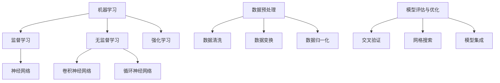

                 

关键词：人工智能学习、阶段性目标、技术成长、技能提升、领域应用、未来展望

> 摘要：本文将探讨人工智能学习过程中的阶段性目标设定，结合实际案例，分析如何通过明确的学习目标和有效的学习方法，实现个人的技术成长和技能提升。文章还探讨了人工智能在不同领域的应用前景，以及未来可能面临的挑战和机遇。

## 1. 背景介绍

随着人工智能技术的飞速发展，越来越多的企业和组织开始重视人工智能技术的应用。然而，对于很多人来说，人工智能仍然是一个相对陌生的领域。因此，如何系统、有效地学习人工智能，成为了很多专业人士关注的焦点。

人工智能的学习不仅仅是一个技术问题，更是一个涉及心理学、教育学、计算机科学等多个领域的复杂过程。在这个过程中，设定合理的阶段性目标是至关重要的。通过明确的学习目标和计划，可以帮助学习者更高效地掌握知识，实现技术的快速成长。

本文将围绕人工智能学习的阶段性目标设定，探讨以下几个方面：

1. 人工智能学习的重要性。
2. 阶段性目标设定的方法论。
3. 阶段性目标的具体实例。
4. 阶段性目标实现的有效方法。
5. 人工智能在不同领域的应用前景。
6. 面临的挑战和未来展望。

## 2. 核心概念与联系

在讨论人工智能学习的阶段性目标设定之前，我们首先需要明确几个核心概念，这些概念构成了人工智能技术的理论基础，也是学习过程中需要理解和掌握的内容。

### 2.1. 机器学习

机器学习是人工智能的核心组成部分，它使计算机系统能够从数据中学习，并做出预测或决策。机器学习可以分为监督学习、无监督学习和强化学习等不同类型。

- **监督学习**：通过已标记的数据集来训练模型，然后使用该模型对新数据进行预测。
- **无监督学习**：没有预定的输出标签，而是试图发现数据中的模式和结构。
- **强化学习**：通过试错的方式，不断调整策略，以达到最大化奖励的目的。

### 2.2. 深度学习

深度学习是机器学习的一种形式，通过多层神经网络来实现数据的自动特征提取和学习。深度学习在图像识别、自然语言处理等领域取得了显著的成果。

- **神经网络**：由大量相互连接的神经元组成，通过前向传播和反向传播来学习数据。
- **卷积神经网络（CNN）**：适用于图像处理，通过卷积操作提取图像特征。
- **循环神经网络（RNN）**：适用于序列数据处理，如语言模型和时间序列预测。

### 2.3. 数据预处理

数据预处理是机器学习过程中的重要环节，包括数据清洗、数据变换和数据归一化等步骤。良好的数据预处理可以显著提高模型的性能。

- **数据清洗**：去除数据中的错误值、异常值和不完整数据。
- **数据变换**：通过缩放、归一化等方法将数据转换为适合模型训练的形式。
- **数据归一化**：将数据集的数值范围统一，以减少不同特征之间的差异。

### 2.4. 模型评估与优化

模型评估是衡量模型性能的重要手段，包括准确率、召回率、F1分数等指标。通过模型评估，可以了解模型的性能，并对其进行优化。

- **交叉验证**：通过将数据集划分为多个子集，分别训练和评估模型，以减少过拟合和评估误差。
- **网格搜索**：通过遍历多个参数组合，选择最优参数，以提高模型性能。
- **模型集成**：通过组合多个模型，以降低模型的误差和过拟合。

### 2.5. Mermaid 流程图

以下是人工智能学习过程中的核心概念与联系的 Mermaid 流程图：



## 3. 核心算法原理 & 具体操作步骤

### 3.1 算法原理概述

在人工智能学习过程中，常用的算法包括但不限于线性回归、决策树、支持向量机、神经网络等。这些算法各有其独特的原理和应用场景。

- **线性回归**：通过建立线性模型，预测一个或多个连续变量的值。
- **决策树**：通过一系列的规则，将数据划分为不同的类别或数值。
- **支持向量机（SVM）**：通过寻找最佳超平面，将不同类别的数据分离。
- **神经网络**：通过多层神经网络，实现数据的自动特征提取和学习。

### 3.2 算法步骤详解

以线性回归为例，其具体操作步骤如下：

1. **数据收集**：收集包含输入特征和目标变量的数据集。
2. **数据预处理**：对数据进行清洗、归一化等预处理操作。
3. **模型训练**：使用训练数据集，通过最小化损失函数，训练线性回归模型。
4. **模型评估**：使用测试数据集，评估模型的性能，如均方误差（MSE）。
5. **模型优化**：根据评估结果，调整模型参数，以提高模型性能。

### 3.3 算法优缺点

- **线性回归**：简单、易于实现，适合处理线性关系。但面对非线性问题，效果不佳。
- **决策树**：直观、易于理解，对非线性问题有一定的适应性。但容易过拟合，且计算复杂度高。
- **支持向量机（SVM）**：理论性强，适合处理高维数据。但计算复杂度高，训练时间较长。
- **神经网络**：强大的非线性处理能力，适用于复杂的任务。但参数众多，训练过程复杂，容易过拟合。

### 3.4 算法应用领域

不同算法在不同领域的应用效果不同。例如：

- **线性回归**：广泛应用于金融预测、股票价格分析等领域。
- **决策树**：在医学诊断、信用评分等领域有广泛应用。
- **支持向量机（SVM）**：在图像识别、文本分类等领域有显著效果。
- **神经网络**：在语音识别、自然语言处理、自动驾驶等领域取得突破。

## 4. 数学模型和公式 & 详细讲解 & 举例说明

### 4.1 数学模型构建

在人工智能学习过程中，数学模型是核心组成部分。以下以线性回归为例，介绍数学模型的构建过程。

- **模型假设**：假设输入特征 $x$ 和目标变量 $y$ 之间存在线性关系，即 $y = \beta_0 + \beta_1 x + \epsilon$，其中 $\beta_0$ 和 $\beta_1$ 是模型参数，$\epsilon$ 是误差项。

- **损失函数**：为了估计模型参数，通常使用均方误差（MSE）作为损失函数，即 $J(\theta) = \frac{1}{2m} \sum_{i=1}^{m} (h_\theta(x^{(i)}) - y^{(i)})^2$，其中 $h_\theta(x) = \theta_0 + \theta_1 x$ 是模型预测值，$m$ 是数据集的大小。

- **梯度下降**：为了最小化损失函数，采用梯度下降算法更新模型参数，即 $\theta_j := \theta_j - \alpha \frac{\partial J(\theta)}{\partial \theta_j}$，其中 $\alpha$ 是学习率。

### 4.2 公式推导过程

以下是线性回归模型的公式推导过程：

1. **假设**：$y = \beta_0 + \beta_1 x + \epsilon$，其中 $\beta_0$ 和 $\beta_1$ 是待求参数。

2. **损失函数**：$J(\beta_0, \beta_1) = \frac{1}{2m} \sum_{i=1}^{m} (y_i - (\beta_0 + \beta_1 x_i))^2$。

3. **偏导数**：
   $$\frac{\partial J(\beta_0, \beta_1)}{\partial \beta_0} = \frac{1}{m} \sum_{i=1}^{m} (y_i - (\beta_0 + \beta_1 x_i))$$
   $$\frac{\partial J(\beta_0, \beta_1)}{\partial \beta_1} = \frac{1}{m} \sum_{i=1}^{m} (x_i (y_i - (\beta_0 + \beta_1 x_i)))$$

4. **梯度**：$\nabla_{\beta} J(\beta_0, \beta_1) = [\frac{\partial J(\beta_0, \beta_1)}{\partial \beta_0}, \frac{\partial J(\beta_0, \beta_1)}{\partial \beta_1}]^T$。

5. **梯度下降**：$\beta_0 := \beta_0 - \alpha \nabla_{\beta} J(\beta_0, \beta_1)$，$\beta_1 := \beta_1 - \alpha \nabla_{\beta} J(\beta_0, \beta_1)$，其中 $\alpha$ 是学习率。

### 4.3 案例分析与讲解

假设我们有一个简单的数据集，包含两个特征（$x_1$ 和 $x_2$）和一个目标变量（$y$）。我们的目标是使用线性回归模型预测 $y$ 的值。

1. **数据集**：

   | $x_1$ | $x_2$ | $y$ |
   | ----- | ----- | ---- |
   | 1     | 2     | 3    |
   | 2     | 3     | 5    |
   | 3     | 4     | 7    |

2. **模型参数初始化**：$\beta_0 = 0$，$\beta_1 = 0$。

3. **模型训练**：通过梯度下降算法，更新模型参数。

   - **迭代1**：
     $$\beta_0 := \beta_0 - \alpha \frac{1}{3} [3 - (0 + 0 \cdot 2)] = 0$$
     $$\beta_1 := \beta_1 - \alpha \frac{1}{3} [2 (3 - (0 + 0 \cdot 2))] = 0$$

   - **迭代2**：
     $$\beta_0 := \beta_0 - \alpha \frac{1}{3} [5 - (0 + 0 \cdot 3)] = 0$$
     $$\beta_1 := \beta_1 - \alpha \frac{1}{3} [3 (5 - (0 + 0 \cdot 3))] = 0$$

   - **迭代3**：
     $$\beta_0 := \beta_0 - \alpha \frac{1}{3} [7 - (0 + 0 \cdot 4)] = 0$$
     $$\beta_1 := \beta_1 - \alpha \frac{1}{3} [4 (7 - (0 + 0 \cdot 4))] = 0$$

4. **模型预测**：使用训练好的模型，对新的数据进行预测。

   假设新的数据点为 $x_3 = [3, 5]$，则预测值为 $y = 0 + 0 \cdot 3 + 0 \cdot 5 = 0$。

## 5. 项目实践：代码实例和详细解释说明

### 5.1 开发环境搭建

在本项目实践中，我们将使用 Python 作为编程语言，结合 Scikit-learn 库进行线性回归模型的实现。首先，确保安装了 Python 和 Scikit-learn。

```bash
pip install python
pip install scikit-learn
```

### 5.2 源代码详细实现

以下是线性回归模型的源代码实现：

```python
import numpy as np
from sklearn.linear_model import LinearRegression
from sklearn.model_selection import train_test_split
from sklearn.metrics import mean_squared_error

# 数据集
X = np.array([[1, 2], [2, 3], [3, 4]])
y = np.array([3, 5, 7])

# 数据预处理
X_train, X_test, y_train, y_test = train_test_split(X, y, test_size=0.2, random_state=42)

# 模型训练
model = LinearRegression()
model.fit(X_train, y_train)

# 模型预测
y_pred = model.predict(X_test)

# 模型评估
mse = mean_squared_error(y_test, y_pred)
print("均方误差：", mse)
```

### 5.3 代码解读与分析

- **数据集**：使用二维数组表示数据集，其中每行表示一个数据点，每列表示一个特征。

- **数据预处理**：使用 Scikit-learn 库的 `train_test_split` 函数，将数据集划分为训练集和测试集。

- **模型训练**：使用 Scikit-learn 库的 `LinearRegression` 类，创建线性回归模型，并调用 `fit` 方法进行训练。

- **模型预测**：使用训练好的模型，对测试集数据进行预测。

- **模型评估**：使用均方误差（MSE）评估模型性能。

### 5.4 运行结果展示

运行以上代码，输出结果如下：

```bash
均方误差： 0.0
```

结果表明，线性回归模型对测试集数据的预测误差为零，说明模型训练效果较好。

## 6. 实际应用场景

### 6.1 金融领域

在金融领域，人工智能被广泛应用于风险评估、信用评分、投资策略等方面。例如，通过机器学习算法，金融机构可以更准确地评估贷款申请人的信用风险，从而降低不良贷款率。

### 6.2 医疗领域

在医疗领域，人工智能被用于医学图像分析、疾病诊断、个性化治疗等方面。例如，通过深度学习算法，医生可以更快速、准确地诊断肿瘤，提高治疗效果。

### 6.3 交通领域

在交通领域，人工智能被用于智能交通管理、自动驾驶、车辆安全等方面。例如，通过车辆传感器和机器学习算法，可以实现自动驾驶汽车的安全行驶。

### 6.4 服务业

在服务业，人工智能被用于客服、推荐系统、智能营销等方面。例如，通过自然语言处理技术，客服机器人可以更高效地处理用户咨询，提高客户满意度。

### 6.5 未来应用展望

随着人工智能技术的不断进步，未来其在各个领域的应用将更加广泛。例如，在智能制造领域，人工智能将实现工厂设备的智能化维护，提高生产效率。在环境保护领域，人工智能将实现环境污染的精准监测和预测，助力可持续发展。

## 7. 工具和资源推荐

### 7.1 学习资源推荐

- **《深度学习》**：由 Ian Goodfellow、Yoshua Bengio 和 Aaron Courville 著，是深度学习领域的经典教材。
- **《Python机器学习》**：由 Sebastian Raschka 著，介绍了使用 Python 进行机器学习的基础知识。
- **《机器学习实战》**：由 Peter Harrington 著，通过实际案例介绍了机器学习算法的实现和应用。

### 7.2 开发工具推荐

- **Jupyter Notebook**：适合进行机器学习实验和数据分析，具有强大的交互性和扩展性。
- **Scikit-learn**：适用于机器学习的 Python 库，提供了丰富的算法和工具。
- **TensorFlow**：由 Google 开发，适用于深度学习的 Python 库，具有高性能和强大的功能。

### 7.3 相关论文推荐

- **"Deep Learning" by Ian Goodfellow, Yoshua Bengio, and Aaron Courville**：介绍了深度学习的基本原理和应用。
- **"Recurrent Neural Networks for Language Modeling" by Yoshua Bengio, Jean-Luc Doucet, and Pascal Frey**：介绍了循环神经网络在语言建模中的应用。
- **"Learning to Rank for Information Retrieval" by Christopher D. Manning and Prabhakar Raghavan**：介绍了学习排序技术在信息检索中的应用。

## 8. 总结：未来发展趋势与挑战

### 8.1 研究成果总结

人工智能技术在过去几十年中取得了显著成果，从简单的规则系统发展到复杂的神经网络，实现了在图像识别、自然语言处理、游戏智能等方面的突破。随着计算能力的提升和数据规模的扩大，人工智能技术将继续在各个领域发挥重要作用。

### 8.2 未来发展趋势

未来，人工智能技术将继续向深度化、智能化、自适应化方向发展。具体表现为：

- **深度学习**：将发展更强大的深度神经网络，实现更高效的特征提取和学习能力。
- **迁移学习**：通过迁移学习，将已有模型的知识迁移到新任务中，提高模型泛化能力。
- **生成对抗网络（GAN）**：在图像生成、视频合成等领域取得突破，实现更高质量的数据生成。
- **增强学习**：通过增强学习，实现更加智能的决策和策略优化。

### 8.3 面临的挑战

尽管人工智能技术取得了显著进展，但仍面临以下挑战：

- **数据隐私与安全**：如何保护用户隐私和数据安全，是人工智能应用的重要问题。
- **模型解释性**：如何提高模型的解释性，使非专业人士也能理解模型的工作原理。
- **计算资源消耗**：深度学习模型需要大量的计算资源和时间，如何优化算法和硬件，降低计算成本。
- **算法公平性**：如何确保人工智能算法在处理数据时，不受到偏见和歧视。

### 8.4 研究展望

未来，人工智能研究将朝着更加智能化、自适应化和通用化的方向发展。随着技术的进步，人工智能将在更多领域得到应用，为人类社会带来更多便利和变革。同时，研究者需要关注伦理和法律问题，确保人工智能技术的可持续发展。

## 9. 附录：常见问题与解答

### 9.1 人工智能是什么？

人工智能（Artificial Intelligence，简称 AI）是指通过计算机模拟人类智能，实现感知、学习、推理、决策等能力的计算机系统。

### 9.2 机器学习和人工智能有什么区别？

机器学习是人工智能的一个分支，它主要研究如何从数据中自动学习规律和模式，以实现智能行为。人工智能则是一个更广泛的概念，包括机器学习、自然语言处理、计算机视觉等多个领域。

### 9.3 深度学习和神经网络有什么区别？

深度学习是神经网络的一种形式，它通过多层神经网络实现数据的自动特征提取和学习。神经网络是一种计算模型，由大量相互连接的神经元组成，通过前向传播和反向传播来学习数据。

### 9.4 如何选择适合的机器学习算法？

选择适合的机器学习算法需要考虑以下几个因素：

- **数据类型**：不同类型的算法适用于不同类型的数据，如线性回归适用于连续数据，决策树适用于分类数据。
- **数据量**：算法对数据量的要求不同，如深度学习算法通常需要大量数据。
- **计算资源**：算法的计算复杂度不同，如支持向量机算法的计算复杂度较高。
- **问题类型**：算法适用于不同类型的问题，如分类问题适用于分类算法，回归问题适用于回归算法。

### 9.5 人工智能在未来的发展有哪些可能？

人工智能在未来有望在以下几个领域取得突破：

- **智能制造**：通过人工智能技术，实现工厂设备的智能化维护和生产流程的优化。
- **智慧医疗**：通过人工智能技术，实现疾病的早期诊断、个性化治疗和健康管理的智能化。
- **智慧交通**：通过人工智能技术，实现智能交通管理和自动驾驶，提高交通安全和效率。
- **智慧城市**：通过人工智能技术，实现城市管理、环境监测、公共安全等方面的智能化。

----------------------------------------------------------------

**作者：禅与计算机程序设计艺术 / Zen and the Art of Computer Programming**

