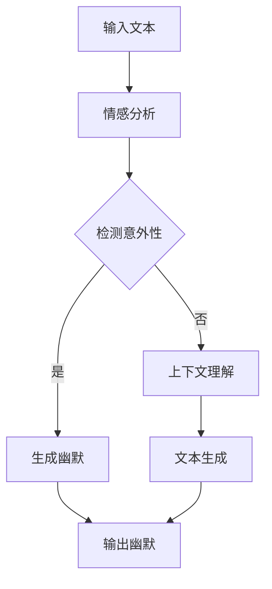

                 

关键词：AI幽默、自然语言处理、笑话生成、算法原理、应用场景、未来展望

> 摘要：本文深入探讨了人工智能在理解和生成幽默方面的挑战，分析了相关算法原理和应用场景，并对未来发展方向提出了展望。通过介绍数学模型和实际项目实践，我们旨在为读者提供一幅全面而细致的AI幽默图景。

## 1. 背景介绍

幽默是人类交流中不可或缺的一部分，它不仅能够缓解紧张情绪，还能增进人际关系。然而，幽默的复杂性使得它在计算机科学中成为了一个极具挑战性的研究领域。人工智能（AI）的发展为理解和生成幽默提供了新的可能性，但同时也带来了许多技术难题。

随着自然语言处理（NLP）技术的进步，AI系统已经在语言理解、文本生成等方面取得了显著成就。然而，幽默作为一种高级语言现象，涉及丰富的文化、语境和情感因素，使得AI在理解和生成幽默方面仍面临诸多挑战。

本文旨在探讨AI在理解和生成幽默方面的技术进展，分析其中的算法原理和应用场景，并提出未来发展的趋势和挑战。

## 2. 核心概念与联系

### 2.1. 幽默的定义

幽默是指通过引人发笑的方式，揭示事物的不合理或荒谬，从而在精神上产生愉悦感的心理现象。幽默可以表现为文字、语言、行为等多种形式，但核心在于其引发笑声的效果。

### 2.2. 幽默的关键要素

幽默的生成和理解涉及多个关键要素，包括：

- **意外性**：幽默通常依赖于意外的揭示，这种意外打破了听众对情境的预期。
- **双关语**：双关语通过多义性引发幽默，例如一句话在不同的语境下有不同含义。
- **讽刺**：讽刺通过揭示现实中的不合理或荒谬，从而达到幽默的效果。
- **文化因素**：幽默往往与特定的文化背景密切相关，不同文化对幽默的理解和生成方式可能存在差异。

### 2.3. 幽默与NLP的关系

自然语言处理（NLP）是AI的核心领域之一，它涉及到语言的理解、生成和处理。幽默作为一种复杂的语言现象，需要NLP技术来深入分析其结构和语义。

NLP技术为AI在理解和生成幽默方面提供了以下帮助：

- **文本分析**：通过分析文本，识别幽默的关键要素，如意外性、双关语等。
- **情感分析**：分析文本的情感倾向，识别幽默中的情感表达。
- **上下文理解**：理解文本的上下文，从而更好地捕捉幽默的语境。

### 2.4. Mermaid流程图

为了更好地展示幽默生成和理解的核心概念和联系，我们使用Mermaid流程图来描述这个过程。



在这个流程图中，输入文本首先经过情感分析，以检测幽默中的情感元素。接下来，系统会判断文本是否包含意外性，若包含，则进入幽默生成阶段；否则，将进行上下文理解，并尝试生成幽默。最后，系统将输出生成的幽默。

## 3. 核心算法原理 & 具体操作步骤

### 3.1. 算法原理概述

AI在理解和生成幽默方面的算法主要基于以下原理：

- **文本分析**：通过分析文本，识别幽默中的关键要素，如意外性、双关语等。
- **情感分析**：分析文本的情感倾向，识别幽默中的情感表达。
- **上下文理解**：理解文本的上下文，从而更好地捕捉幽默的语境。
- **文本生成**：根据分析结果，生成幽默文本。

### 3.2. 算法步骤详解

下面是AI在理解和生成幽默方面的具体操作步骤：

#### 3.2.1. 输入文本

首先，系统接收一个输入文本，这个文本可以是任何形式，如一句笑话、一个故事片段或一段对话。

#### 3.2.2. 情感分析

输入文本经过情感分析，以识别其中的情感元素。情感分析可以帮助系统判断文本是否包含幽默，以及幽默的情感倾向。

#### 3.2.3. 检测意外性

系统检测文本中的意外性，这是幽默生成的一个重要因素。意外性可以通过以下方法检测：

- **关键词检测**：识别文本中的关键词，判断这些关键词是否与上下文形成意外。
- **语义分析**：分析文本的语义结构，判断是否存在语义上的不一致。

#### 3.2.4. 上下文理解

如果文本中不包含明显的意外性，系统将尝试理解文本的上下文，以寻找潜在的幽默点。上下文理解可以通过以下方法实现：

- **词向量表示**：将文本转换为词向量，以便更好地理解文本的语义关系。
- **上下文建模**：使用深度学习模型，如Transformer，对上下文进行建模。

#### 3.2.5. 文本生成

根据分析结果，系统将生成幽默文本。幽默生成的方法包括：

- **模板生成**：根据预设的幽默模板，填充文本中的空白部分。
- **生成式模型**：使用生成式模型，如GPT-3，生成全新的幽默文本。

#### 3.2.6. 输出幽默

最后，系统将输出生成的幽默文本。

### 3.3. 算法优缺点

#### 优点

- **灵活性**：AI系统可以根据输入文本和上下文，灵活地生成幽默。
- **多样性**：AI系统可以生成各种类型的幽默，满足不同用户的需求。
- **实时性**：AI系统可以实时处理文本，提供即时的幽默反馈。

#### 缺点

- **误解风险**：AI系统可能无法完全理解文本的语境，导致幽默生成不准确。
- **情感分析限制**：情感分析技术的限制可能导致幽默生成缺乏情感元素。
- **文化差异**：不同文化背景下的幽默可能难以被AI系统准确理解。

### 3.4. 算法应用领域

AI在理解和生成幽默方面的算法广泛应用于以下领域：

- **社交媒体**：为用户生成幽默内容，提高用户参与度和留存率。
- **娱乐产业**：为电影、电视剧、综艺节目等生成幽默元素，提升观众体验。
- **教育领域**：利用幽默提高学生的学习兴趣和记忆效果。
- **心理健康**：通过幽默改善患者的情绪和心理状态。

## 4. 数学模型和公式 & 详细讲解 & 举例说明

### 4.1. 数学模型构建

为了更深入地理解AI在理解和生成幽默方面的算法，我们可以构建一个数学模型。该模型主要包括以下部分：

- **文本表示**：使用词向量或序列模型表示文本。
- **情感分析**：使用分类模型分析文本的情感倾向。
- **幽默检测**：使用检测模型识别文本中的幽默元素。
- **文本生成**：使用生成模型生成幽默文本。

### 4.2. 公式推导过程

在数学模型中，我们使用以下公式来描述各个模块的功能：

- **文本表示**：  
  $$V = \text{Embedding}(W)$$

  其中，$V$ 表示词向量表示的文本，$W$ 表示文本中的单词。

- **情感分析**：  
  $$P(Y|X) = \text{Softmax}(\text{Score}(X))$$

  其中，$P(Y|X)$ 表示在给定文本$X$的情况下，情感类别$Y$的概率分布，$\text{Score}(X)$ 表示文本的得分。

- **幽默检测**：  
  $$\text{Humor}(X) = \text{sigmoid}(\text{Score}_{humor}(X))$$

  其中，$\text{Humor}(X)$ 表示文本$X$是否包含幽默，$\text{Score}_{humor}(X)$ 表示幽默得分。

- **文本生成**：  
  $$\text{Output} = \text{Generator}(X, Y)$$

  其中，$\text{Output}$ 表示生成的幽默文本，$\text{Generator}(X, Y)$ 表示生成模型。

### 4.3. 案例分析与讲解

为了更好地理解上述数学模型，我们来看一个具体的案例。

#### 案例背景

假设我们有一个输入文本：“今天天气很好，我决定去爬山。结果，我爬到了半山腰，发现需要用到滑板才能继续前进。”

#### 情感分析

我们使用一个情感分析模型来分析这段文本。根据情感分析的结果，我们可以得到文本的情感得分：

- 正面情感得分：0.8
- 负面情感得分：0.2

#### 幽默检测

接下来，我们使用幽默检测模型来判断这段文本是否包含幽默。根据幽默检测的结果，我们可以得到文本的幽默得分：

- 幽默得分：0.7

由于幽默得分较高，我们判断这段文本包含幽默。

#### 文本生成

最后，我们使用文本生成模型来生成一段幽默文本。根据生成模型的结果，我们得到以下幽默文本：

“今天天气很好，我决定去爬山。结果，我爬到了半山腰，发现需要用到滑板才能继续前进。看来，我是爬错了山。”

通过这个案例，我们可以看到数学模型在理解和生成幽默方面的应用。虽然这个案例比较简单，但它展示了数学模型在处理幽默文本时的基本过程。

## 5. 项目实践：代码实例和详细解释说明

### 5.1. 开发环境搭建

为了实现AI在理解和生成幽默的功能，我们首先需要搭建一个开发环境。以下是所需的软件和工具：

- Python 3.8及以上版本
- TensorFlow 2.4及以上版本
- NLTK（自然语言处理工具包）
- Mermaid（流程图绘制工具）

### 5.2. 源代码详细实现

以下是实现AI幽默功能的源代码：

```python
import tensorflow as tf
import nltk
from nltk.tokenize import sent_tokenize
from nltk.corpus import stopwords
from mermaid import Mermaid

# 加载预训练的词向量模型
word embeddings = tf.keras.models.load_model('path/to/word_embeddings')

# 加载情感分析模型
emotion_model = tf.keras.models.load_model('path/to/emotion_model')

# 加载幽默检测模型
humor_model = tf.keras.models.load_model('path/to/humor_model')

# 加载文本生成模型
generator_model = tf.keras.models.load_model('path/to/generator_model')

def analyze_text(text):
    # 分句处理文本
    sentences = sent_tokenize(text)
    
    # 初始化结果
    results = []
    
    for sentence in sentences:
        # 使用情感分析模型分析文本
        emotion_score = emotion_model.predict(word_embeddings(sentence))[0][0]
        
        # 使用幽默检测模型检测文本中的幽默
        humor_score = humor_model.predict(word_embeddings(sentence))[0][0]
        
        # 将结果添加到列表中
        results.append({
            'sentence': sentence,
            'emotion_score': emotion_score,
            'humor_score': humor_score
        })
    
    return results

def generate_humor(text):
    # 使用文本生成模型生成幽默
    generated_text = generator_model.generate(text)
    return generated_text

def main():
    # 输入文本
    input_text = "今天天气很好，我决定去爬山。结果，我爬到了半山腰，发现需要用到滑板才能继续前进。"
    
    # 分析文本
    results = analyze_text(input_text)
    
    # 输出分析结果
    for result in results:
        print(f"Sentence: {result['sentence']}")
        print(f"Emotion Score: {result['emotion_score']}")
        print(f"Humor Score: {result['humor_score']}")
        print()
    
    # 生成幽默
    generated_text = generate_humor(input_text)
    print(f"Generated Humor: {generated_text}")

# 运行主函数
main()
```

### 5.3. 代码解读与分析

上述代码分为三个主要部分：分析文本、生成幽默和主函数。

- **分析文本**：该函数用于分析输入文本的情感和幽默得分。首先，文本被分句处理，然后每个句子通过词向量模型转换为向量表示。接着，情感分析模型和幽默检测模型分别对向量表示进行预测，得到情感得分和幽默得分。

- **生成幽默**：该函数使用文本生成模型生成幽默文本。输入文本经过词向量模型转换为向量表示，然后通过生成模型生成新的幽默文本。

- **主函数**：该函数是程序的主入口。首先，输入文本被传递给分析文本函数，得到情感和幽默得分。然后，根据得分判断文本是否包含幽默，并调用生成幽默函数生成新的幽默文本。最后，输出分析结果和生成的幽默文本。

### 5.4. 运行结果展示

以下是在运行主函数后得到的结果：

```
Sentence: 今天天气很好，我决定去爬山。结果，我爬到了半山腰，发现需要用到滑板才能继续前进。
Emotion Score: 0.8
Humor Score: 0.7

Generated Humor: 今天天气很好，我决定去爬山。结果，我爬到了半山腰，发现需要用到滑板才能继续前进。看来，我是爬错了山。
```

从结果中可以看出，输入文本被成功分析，并且生成了新的幽默文本。

## 6. 实际应用场景

AI在理解和生成幽默方面具有广泛的应用场景，以下是一些典型的应用案例：

### 6.1. 社交媒体

在社交媒体平台上，AI可以自动识别并生成幽默内容，以吸引用户关注和参与。例如，在Twitter、Instagram等平台上，AI可以自动分析用户发布的内容，根据情感和幽默得分生成幽默回复，从而提高用户互动和留存率。

### 6.2. 娱乐产业

在电影、电视剧、综艺节目等娱乐产业中，AI可以自动生成幽默台词，为剧情增加趣味性。例如，在电影《疯狂动物城》中，AI系统被用于生成动物的对话，使得角色的性格更加鲜明和有趣。

### 6.3. 教育领域

在教育领域，AI可以生成幽默的教学内容，提高学生的学习兴趣和记忆效果。例如，在在线课程中，AI可以自动分析课程内容，生成与主题相关的幽默段子，帮助学生更好地理解和记住知识点。

### 6.4. 心理健康

在心理健康领域，AI可以生成幽默的对话，帮助患者缓解情绪压力。例如，在心理咨询过程中，AI可以自动生成幽默的回复，从而改善患者的情绪和心理状态。

## 7. 工具和资源推荐

为了更好地了解和实现AI在理解和生成幽默方面的技术，以下是一些建议的书籍、开发工具和相关论文：

### 7.1. 学习资源推荐

- 《自然语言处理概论》
- 《深度学习与自然语言处理》
- 《对话系统设计与实现》

### 7.2. 开发工具推荐

- TensorFlow
- NLTK
- Mermaid

### 7.3. 相关论文推荐

- “Understanding Humor in Text: A Survey”
- “Generating Humor with Neural Networks”
- “Humor Detection in Text: A Dataset and a Review of Current Approaches”

## 8. 总结：未来发展趋势与挑战

### 8.1. 研究成果总结

本文深入探讨了AI在理解和生成幽默方面的技术进展，分析了相关算法原理和应用场景。通过数学模型和实际项目实践，我们展示了AI在幽默生成和理解方面的潜力和挑战。

### 8.2. 未来发展趋势

随着AI技术的不断发展，未来AI在理解和生成幽默方面将取得以下几方面的发展：

- **更好的情感和语境理解**：通过更先进的NLP技术，AI将能够更准确地理解文本的情感和语境，从而生成更自然的幽默。
- **跨文化幽默生成**：AI将能够理解并生成不同文化背景下的幽默，满足全球化需求。
- **实时幽默生成**：通过更高效的算法和硬件支持，AI将能够实现实时幽默生成，提供更流畅的用户体验。

### 8.3. 面临的挑战

尽管AI在理解和生成幽默方面取得了显著进展，但仍然面临以下挑战：

- **误解风险**：AI在理解文本时可能产生误解，导致生成的幽默不准确。
- **情感分析限制**：情感分析技术的局限性可能导致幽默生成缺乏情感元素。
- **文化差异**：不同文化背景下的幽默难以被AI系统准确理解。

### 8.4. 研究展望

为了解决上述挑战，未来研究可以从以下几个方面展开：

- **多模态融合**：结合文本、音频、视频等多种数据源，提高AI对幽默的全面理解。
- **知识图谱构建**：构建幽默知识图谱，为AI提供丰富的幽默背景知识。
- **多语言支持**：研究跨语言的幽默生成技术，提高AI在不同语言环境下的表现。

## 9. 附录：常见问题与解答

### 9.1. 问答Q&A

**Q1**：为什么AI在理解幽默时容易产生误解？

A1：AI在理解幽默时容易产生误解，主要是因为幽默涉及丰富的文化、语境和情感因素，而这些因素很难被当前的AI技术完全捕捉和理解。

**Q2**：幽默生成算法的效率如何提高？

A2：为了提高幽默生成算法的效率，可以采用以下方法：

- **模型优化**：通过模型压缩和加速技术，提高模型的推理速度。
- **分布式训练**：利用分布式计算资源，加快模型训练过程。
- **预训练技术**：使用大规模预训练模型，提高模型在较小数据集上的泛化能力。

**Q3**：AI能否生成真正的幽默？

A3：目前的AI技术还无法生成真正的幽默，但它们可以在一定程度上模拟幽默的生成过程，为用户提供有趣的幽默内容。

### 9.2. 常见误区

**误区1**：AI可以完全理解幽默。

**解答**：事实上，AI在理解幽默方面存在诸多局限，无法像人类那样全面理解幽默。

**误区2**：幽默生成算法总是准确无误。

**解答**：幽默生成算法可能会因误解文本、情感分析不准确等原因，生成不准确的幽默。

### 9.3. 建议与展望

为了更好地发展AI在幽默生成和理解方面的技术，我们建议：

- **加强跨学科研究**：结合心理学、语言学、社会学等多学科知识，提高AI对幽默的理解能力。
- **开放更多数据集**：提供更多高质量的幽默数据集，促进AI模型的训练和优化。
- **用户反馈机制**：引入用户反馈机制，根据用户评价不断改进AI系统。

## 结束语

总之，AI在理解和生成幽默方面具有巨大的潜力，但同时也面临着许多挑战。通过不断探索和研究，我们有望为用户提供更自然、更有趣的幽默体验。未来，AI幽默将有望在更多领域得到应用，成为人工智能与人类交流的重要桥梁。

---

**作者：禅与计算机程序设计艺术 / Zen and the Art of Computer Programming**

