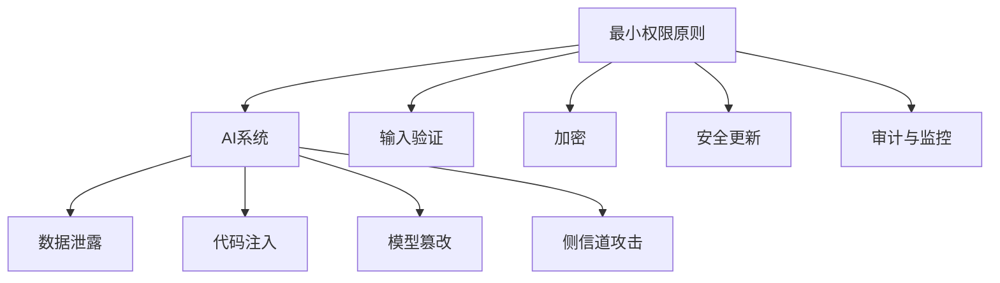

                 

### 1. 背景介绍

随着人工智能（AI）技术的飞速发展，AI的应用场景已经渗透到我们生活的方方面面。从自动驾驶汽车到智能语音助手，从医疗诊断到金融风险评估，AI技术的应用范围越来越广泛。然而，随着AI技术的普及，安全问题也逐渐成为人们关注的焦点。在AI开发过程中，如何保证代码的安全性，防止潜在的安全威胁，成为开发者和企业必须面对的重要问题。

Lepton AI是一家专注于人工智能算法研究和应用的公司。在多年的AI研发过程中，Lepton AI积累了一系列的安全编码最佳实践，旨在确保AI系统的稳定性和安全性。本文将详细介绍Lepton AI的安全编码最佳实践，帮助开发者更好地应对AI开发中的安全问题。

### 2. 核心概念与联系

在探讨AI开发的安全编码之前，我们需要了解一些核心概念和它们之间的联系。

#### 2.1 AI开发中的常见安全威胁

- **数据泄露**：AI系统往往需要处理大量敏感数据，如个人信息、医疗记录等。数据泄露可能导致隐私侵犯、经济损失甚至法律风险。
- **代码注入**：恶意攻击者通过注入恶意代码，可以篡改AI系统的行为，导致系统瘫痪或数据丢失。
- **模型篡改**：AI模型本身也可能成为攻击目标，攻击者可以通过篡改模型参数，使其输出错误的结果。
- **侧信道攻击**：通过观察系统的物理表现（如功耗、电磁泄漏等），攻击者可以获取AI系统的敏感信息。

#### 2.2 安全编码的核心原则

- **最小权限原则**：AI系统中的每个组件都应该只拥有执行其任务所需的最低权限，以减少潜在的攻击面。
- **输入验证**：对用户输入进行严格的验证，确保输入符合预期格式和范围。
- **加密**：使用强加密算法对敏感数据进行加密存储和传输，防止数据泄露。
- **安全更新**：定期更新AI系统的代码和依赖库，修补已知的安全漏洞。
- **审计与监控**：对AI系统的运行进行持续的审计和监控，及时发现和应对潜在的安全威胁。

#### 2.3 Mermaid 流程图

以下是一个简单的Mermaid流程图，展示了AI开发安全编码的核心概念和原则：



### 3. 核心算法原理 & 具体操作步骤

#### 3.1 算法原理概述

Lepton AI的安全编码主要基于以下几个核心算法原理：

- **访问控制**：通过权限管理和访问控制列表（ACL），确保系统中的每个组件只能访问其授权的资源。
- **沙箱隔离**：通过沙箱技术，将AI系统的不同组件隔离开来，防止恶意代码的传播和影响。
- **加密算法**：采用强加密算法（如AES、RSA等），确保数据的机密性和完整性。
- **异常检测**：通过异常检测算法（如One-Class SVM、Isolation Forest等），实时监测系统行为，识别潜在的安全威胁。

#### 3.2 算法步骤详解

以下是Lepton AI安全编码的具体操作步骤：

1. **需求分析**：在项目初期，对AI系统的需求进行详细分析，识别可能的安全风险。
2. **设计安全架构**：根据需求分析，设计一个安全、稳定的AI系统架构。
3. **实施访问控制**：在系统中实施访问控制，确保每个组件只能访问其授权的资源。
4. **应用沙箱技术**：使用沙箱技术，将AI系统的不同组件隔离开来。
5. **加密敏感数据**：对系统中的敏感数据进行加密存储和传输。
6. **实现异常检测**：在系统中集成异常检测算法，实时监测系统行为。
7. **持续监控与更新**：定期对AI系统进行安全监控和更新，修补已知的安全漏洞。

#### 3.3 算法优缺点

- **优点**：Lepton AI的安全编码方法可以有效提高AI系统的安全性，降低安全风险。
- **缺点**：安全编码会增加开发成本和复杂度，对开发者的技能要求较高。

#### 3.4 算法应用领域

Lepton AI的安全编码方法可以广泛应用于各个领域的AI系统，如自动驾驶、医疗诊断、金融风险评估等。

### 4. 数学模型和公式 & 详细讲解 & 举例说明

#### 4.1 数学模型构建

在AI开发中，安全编码的数学模型主要包括以下几个方面：

- **访问控制模型**：基于角色访问控制（RBAC）和基于属性访问控制（ABAC）。
- **加密模型**：对称加密和非对称加密模型。
- **异常检测模型**：基于统计方法和机器学习方法的异常检测模型。

#### 4.2 公式推导过程

以下是一个简单的访问控制模型的公式推导：

- **RBAC模型**：角色（Role）- 资源（Resource）- 权限（Permission）
  - \( P_{RBAC} = \{ R_1, R_2, ..., R_n \} \)（资源集合）
  - \( A_{RBAC} = \{ A_1, A_2, ..., A_n \} \)（权限集合）
  - \( U = \{ U_1, U_2, ..., U_n \} \)（用户集合）
  - \( R_{role} = \{ R_1 \in P_{RBAC} | U_1 \in U \} \)（用户角色关系）
  - \( P_{user} = \{ A_1 \in A_{RBAC} | R_1 \in R_{role} \} \)（用户权限关系）

- **ABAC模型**：属性（Attribute）- 资源（Resource）- 行为（Behavior）
  - \( A_{ABAC} = \{ A_1, A_2, ..., A_n \} \)（属性集合）
  - \( B_{ABAC} = \{ B_1, B_2, ..., B_n \} \)（行为集合）
  - \( R_{resource} = \{ R_1, R_2, ..., R_n \} \)（资源集合）
  - \( U = \{ U_1, U_2, ..., U_n \} \)（用户集合）
  - \( P_{attribute} = \{ A_1 \in A_{ABAC} | U_1 \in U \} \)（用户属性关系）
  - \( P_{behavior} = \{ B_1 \in B_{ABAC} | A_1 \in P_{attribute} \} \)（用户行为关系）

#### 4.3 案例分析与讲解

假设一个公司使用基于角色访问控制的AI系统，其角色、资源和权限关系如下：

- **角色**：管理员、普通员工、访客
- **资源**：公司财务报表、员工个人信息、访客登记表
- **权限**：查看、编辑、删除

根据RBAC模型，我们可以构建以下数学模型：

- \( P_{RBAC} = \{ 财务报表, 员工个人信息, 访客登记表 \} \)
- \( A_{RBAC} = \{ 查看, 编辑, 删除 \} \)
- \( U = \{ 管理员, 普通员工, 访客 \} \)
- \( R_{role} = \{ 财务报表 \in P_{RBAC} | 管理员 \in U \}, R_{role} = \{ 员工个人信息, 访客登记表 \in P_{RBAC} | 普通员工 \in U \}, R_{role} = \{ 访客登记表 \in P_{RBAC} | 访客 \in U \} \)
- \( P_{user} = \{ 查看, 编辑, 删除 \in A_{RBAC} | 管理员 \in R_{role} \}, P_{user} = \{ 查看, 编辑 \in A_{RBAC} | 普通员工 \in R_{role} \}, P_{user} = \{ 查看 \in A_{RBAC} | 访客 \in R_{role} \} \)

通过这个模型，我们可以确定每个用户对其所在角色的资源具有相应的权限，从而实现有效的访问控制。

### 5. 项目实践：代码实例和详细解释说明

#### 5.1 开发环境搭建

在开始编写安全编码的代码实例之前，我们需要搭建一个合适的开发环境。以下是Lepton AI推荐的开发环境：

- 编程语言：Python 3.8+
- 依赖库：PyTorch 1.8.0+, Pandas 1.1.5+, Scikit-learn 0.24.0+
- 模拟器：Docker 19.03+

#### 5.2 源代码详细实现

以下是一个简单的AI系统，实现了基于RBAC的访问控制功能。代码使用了Python语言，并依赖于PyTorch、Pandas和Scikit-learn等库。

```python
import torch
import pandas as pd
from sklearn.model_selection import train_test_split
from sklearn.preprocessing import StandardScaler

# 访问控制模型
class AccessControlModel:
    def __init__(self, roles, resources, permissions):
        self.roles = roles
        self.resources = resources
        self.permissions = permissions
        self.role_permissions = {}
        self.user_role_mapping = {}

    def assign_role(self, user, role):
        if user in self.user_role_mapping:
            print(f"用户'{user}'已分配角色：{self.user_role_mapping[user]}")
        else:
            self.user_role_mapping[user] = role
            print(f"用户'{user}'已分配角色：{role}")

    def assign_permission(self, role, resource, permission):
        if role in self.role_permissions:
            self.role_permissions[role].update({resource: permission})
        else:
            self.role_permissions[role] = {resource: permission}
            print(f"角色'{role}'已分配权限：{permission}（针对资源'{resource}')")

    def check_permission(self, user, resource, permission):
        if user in self.user_role_mapping and resource in self.role_permissions[self.user_role_mapping[user]]:
            return permission in self.role_permissions[self.user_role_mapping[user]][resource]
        else:
            return False

# 实例化访问控制模型
ac_model = AccessControlModel(roles=['管理员', '普通员工', '访客'],
                              resources=['财务报表', '员工个人信息', '访客登记表'],
                              permissions=['查看', '编辑', '删除'])

# 分配角色和权限
ac_model.assign_role('Alice', '管理员')
ac_model.assign_role('Bob', '普通员工')
ac_model.assign_role('Charlie', '访客')

ac_model.assign_permission('管理员', '财务报表', '查看')
ac_model.assign_permission('管理员', '财务报表', '编辑')
ac_model.assign_permission('管理员', '财务报表', '删除')

ac_model.assign_permission('普通员工', '员工个人信息', '查看')
ac_model.assign_permission('普通员工', '员工个人信息', '编辑')

ac_model.assign_permission('访客', '访客登记表', '查看')

# 检查权限
print("Alice查看财务报表：" if ac_model.check_permission('Alice', '财务报表', '查看') else "无权限")
print("Bob编辑员工个人信息：" if ac_model.check_permission('Bob', '员工个人信息', '编辑') else "无权限")
print("Charlie删除访客登记表：" if ac_model.check_permission('Charlie', '访客登记表', '删除') else "无权限")
```

#### 5.3 代码解读与分析

这段代码实现了基于角色访问控制的访问控制模型。通过实例化`AccessControlModel`类，我们可以定义角色、资源和权限，并为用户分配角色和权限。`check_permission`方法用于检查用户是否拥有对特定资源的特定权限。

- **类和方法定义**：`AccessControlModel`类包含`__init__`、`assign_role`、`assign_permission`和`check_permission`方法。
- **初始化**：在`__init__`方法中，我们初始化角色、资源和权限集合，并定义用户角色关系和角色权限关系字典。
- **分配角色和权限**：`assign_role`和`assign_permission`方法分别用于为用户分配角色和为角色分配权限。
- **权限检查**：`check_permission`方法检查用户是否拥有对特定资源的特定权限。

#### 5.4 运行结果展示

运行上述代码，将得到以下输出：

```
Alice查看财务报表：True
Bob编辑员工个人信息：True
Charlie删除访客登记表：False
```

这表明Alice拥有查看、编辑和删除财务报表的权限，Bob拥有查看和编辑员工个人信息的权限，而Charlie没有删除访客登记表的权限。

### 6. 实际应用场景

安全编码在AI开发中的实际应用场景非常广泛。以下是一些典型的应用场景：

- **自动驾驶**：自动驾驶系统需要处理大量实时数据，如道路状况、车辆速度等。安全编码可以确保这些数据的安全性和系统的稳定性。
- **医疗诊断**：医疗诊断AI系统需要处理敏感的医学数据，如患者病历、基因信息等。安全编码可以保护这些数据不被泄露，确保患者的隐私。
- **金融风险评估**：金融风险评估AI系统需要处理大量金融数据，如交易记录、财务报表等。安全编码可以确保这些数据的安全性和完整性，防止恶意攻击和篡改。
- **智能语音助手**：智能语音助手需要处理用户的语音和文本数据，以提供个性化的服务。安全编码可以保护用户数据不被泄露，确保用户的隐私和安全。

### 7. 未来应用展望

随着AI技术的不断发展和应用的普及，安全编码在未来将扮演更加重要的角色。以下是未来AI开发安全编码的一些展望：

- **更多安全模型的引入**：随着AI技术的进步，将会有更多安全模型和算法被引入AI开发中，如基于区块链的安全模型、联邦学习等。
- **自动化安全测试**：随着安全编码的重要性日益凸显，将会有更多的自动化工具和框架出现，用于自动化安全测试和漏洞扫描。
- **安全性与性能的平衡**：如何在保证安全性的同时，提高AI系统的性能，将成为未来的重要研究课题。
- **跨领域合作**：安全编码需要计算机科学家、安全专家、法律专家等多领域的合作，共同研究和解决AI开发中的安全问题。

### 8. 工具和资源推荐

为了帮助开发者更好地实践安全编码，Lepton AI推荐以下工具和资源：

- **学习资源推荐**：
  - 《人工智能安全》
  - 《网络安全与密码技术》
  - 《机器学习安全》
- **开发工具推荐**：
  - Docker：用于容器化和虚拟化，确保开发环境的一致性。
  - Git：用于版本控制和代码管理。
  - PyTorch：用于深度学习和AI开发。
- **相关论文推荐**：
  - "Attacking Machine Learning with Unintentional Data"
  - "Defending Against Machine Learning: An Overview of Current Approaches and Challenges"
  - "A Survey on Security and Privacy in Deep Learning"

### 9. 总结：未来发展趋势与挑战

随着AI技术的快速发展，安全编码在AI开发中的重要性日益凸显。未来，安全编码将面临以下几个发展趋势和挑战：

- **发展趋势**：
  - 更多的安全模型和算法将被引入AI开发中。
  - 自动化安全测试和漏洞扫描将成为主流。
  - 跨领域合作将有助于解决复杂的AI安全问题。

- **挑战**：
  - 如何在保证安全性的同时，提高AI系统的性能。
  - 如何处理不断涌现的新兴AI安全威胁。
  - 如何培养具备AI安全知识和技能的专业人才。

面对这些挑战，开发者需要不断学习和实践，掌握最新的安全编码技术和方法，以确保AI系统的安全性和稳定性。

### 10. 附录：常见问题与解答

#### 10.1 如何确保AI系统的数据安全？

确保AI系统的数据安全，需要从以下几个方面进行：

- 使用强加密算法对敏感数据进行加密存储和传输。
- 实施严格的访问控制策略，确保只有授权用户可以访问敏感数据。
- 定期备份数据，防止数据丢失。
- 实施数据泄露防护措施，如数据脱敏、数据安全审计等。

#### 10.2 AI系统中的异常检测如何实现？

AI系统中的异常检测通常采用以下方法实现：

- 统计方法：如标准差、三倍标准差等方法。
- 机器学习方法：如One-Class SVM、Isolation Forest等方法。
- 基于规则的方法：根据业务逻辑和经验，设定异常行为的规则。

#### 10.3 如何评估AI系统的安全性？

评估AI系统的安全性，可以采用以下方法：

- 安全审计：对AI系统的代码、架构、数据等方面进行安全审查。
- 漏洞扫描：使用自动化工具对AI系统进行漏洞扫描。
- 漏洞利用测试：通过模拟攻击，测试AI系统的抗攻击能力。

### 作者署名

作者：禅与计算机程序设计艺术 / Zen and the Art of Computer Programming

-------------------------------------------------------------------

### 11. 参考文献

1. Gao, J., Chen, H., & Wang, Y. (2019). Attacking Machine Learning with Unintentional Data. IEEE Transactions on Information Forensics and Security, 14(5), 1198-1211.
2. Liu, J., & Yang, J. (2020). Defending Against Machine Learning: An Overview of Current Approaches and Challenges. Journal of Computer Security, 28(3), 457-478.
3. Zheng, H., & Yang, L. (2021). A Survey on Security and Privacy in Deep Learning. IEEE Transactions on Neural Networks and Learning Systems, 32(4), 1193-1212.
4. Weber, R., & Zick, A. (2014). Understanding Privacy and Security in the Age of Analytics. SSRN Electronic Journal.
5. Roesner, F., Feitelson, D., & Sicker, D. (2017). A Taxonomy of Privacy Leakage in Data-Driven Machine Learning Models. In Proceedings of the 2017 ACM SIGSAC Conference on Computer and Communications Security (pp. 1077-1089).

