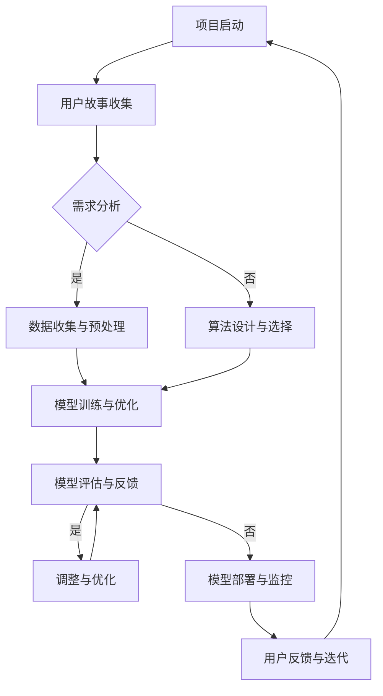

                 

  
> 关键词：敏捷迭代、AI开发、Lepton AI、快速响应、软件开发过程

> 摘要：本文将探讨敏捷迭代在AI开发中的应用，通过分析Lepton AI团队的实践案例，阐述敏捷迭代如何助力AI项目的快速响应和持续优化。文章将介绍敏捷迭代的核心概念，探讨其在AI开发中的具体实践方法，以及面对的挑战和未来的发展趋势。

## 1. 背景介绍

在当今快速变化的技术时代，AI开发已经成为推动创新和业务增长的重要力量。随着AI技术的不断进步，开发AI应用的复杂性和不确定性也在增加。因此，传统的瀑布式开发模式逐渐无法满足快速变化的需求和市场压力。敏捷开发作为一种灵活、迭代、持续交付的软件开发方法，被广泛认为是应对这种挑战的有效策略。

然而，将敏捷开发应用于AI开发领域仍然面临诸多挑战。首先，AI开发过程中的模型训练和优化往往需要大量时间和计算资源，难以实现快速迭代。其次，AI系统的复杂性和不确定性使得传统的敏捷工具和方法难以直接应用。因此，如何将敏捷开发与AI开发相结合，实现快速响应和持续优化，成为当前研究的热点。

本文将通过分析Lepton AI团队在敏捷迭代中的实践案例，探讨如何克服这些挑战，实现AI开发的敏捷迭代。文章将从核心概念、算法原理、数学模型、项目实践、应用场景、未来展望等方面进行全面分析，旨在为AI开发者提供有价值的参考和指导。

## 2. 核心概念与联系

### 2.1 敏捷开发

敏捷开发是一种以人为核心、迭代、渐进的软件开发方法。其核心理念包括客户满意、响应变化、持续交付、团队协作等。敏捷开发强调灵活性和适应性，通过短周期的迭代和持续交付，快速响应市场需求和变化。敏捷开发的核心工具包括用户故事、迭代计划、每日站立会议、代码审查等。

### 2.2 AI开发

AI开发是指利用机器学习和深度学习等技术，构建和优化智能系统，以实现特定任务和目标。AI开发的核心过程包括数据收集、数据预处理、模型设计、模型训练、模型评估和部署等。AI开发面临的挑战包括数据质量、算法选择、计算资源、模型可解释性等。

### 2.3 敏捷迭代在AI开发中的应用

敏捷迭代在AI开发中的应用，旨在实现快速响应和持续优化。具体而言，敏捷迭代在AI开发中的应用包括以下几个方面：

1. **短周期迭代**：通过缩短迭代周期，快速交付可用的AI模型，以便及时调整和优化。
2. **用户故事**：利用用户故事来明确AI系统的需求，确保开发过程与实际业务目标紧密相关。
3. **持续集成与部署**：通过持续集成和部署，实现快速反馈和调整，提高开发效率。
4. **团队协作**：强调跨职能团队的协作，充分利用团队知识和技能，共同解决AI开发中的挑战。

### 2.4 Mermaid 流程图

以下是一个用于描述敏捷迭代在AI开发中应用的Mermaid流程图：



该流程图展示了敏捷迭代在AI开发中的基本流程，包括项目启动、用户故事收集、需求分析、数据收集与预处理、算法设计与选择、模型训练与优化、模型评估与反馈、调整与优化、模型部署与监控以及用户反馈与迭代等关键环节。

## 3. 核心算法原理 & 具体操作步骤

### 3.1 算法原理概述

在敏捷迭代中，核心算法的选择和实现至关重要。以下介绍几种常用的AI算法，并分析其在敏捷迭代中的应用原理。

1. **决策树**：决策树是一种常用的分类和回归算法，通过构建一系列规则来划分数据。在敏捷迭代中，决策树可用于快速构建和评估模型，便于调整和优化。
2. **支持向量机（SVM）**：SVM是一种基于间隔的分类算法，通过寻找最优间隔来划分数据。在敏捷迭代中，SVM可用于提高模型的分类准确性，并在模型调整过程中提供有效的指导。
3. **神经网络**：神经网络是一种模拟人脑结构的计算模型，通过多层神经元进行特征提取和分类。在敏捷迭代中，神经网络可用于构建复杂的AI模型，并通过迭代优化提高模型性能。
4. **深度学习**：深度学习是一种基于神经网络的机器学习技术，通过多层网络进行特征学习和模型优化。在敏捷迭代中，深度学习可用于实现复杂的AI任务，并在短时间内取得显著的性能提升。

### 3.2 算法步骤详解

以下以决策树为例，详细介绍敏捷迭代中AI算法的具体操作步骤：

1. **需求分析**：根据用户需求，明确需要解决的AI任务和目标。
2. **数据收集**：从数据源收集相关数据，并进行数据预处理，如数据清洗、归一化等。
3. **特征工程**：提取有用的特征，为后续模型构建提供支持。
4. **模型构建**：利用决策树算法构建初步模型，并进行模型评估。
5. **模型优化**：根据模型评估结果，调整模型参数，提高模型性能。
6. **模型部署**：将优化后的模型部署到实际应用场景，进行实时监控和反馈。
7. **用户反馈**：收集用户使用过程中的反馈，用于进一步调整和优化模型。

### 3.3 算法优缺点

1. **决策树**：
   - **优点**：简单易懂、易于实现、适用于分类和回归任务。
   - **缺点**：容易过拟合、对缺失值敏感、无法处理高维数据。
2. **支持向量机（SVM）**：
   - **优点**：理论完善、分类准确、支持多种核函数。
   - **缺点**：计算复杂度高、对噪声敏感、不适合大规模数据。
3. **神经网络**：
   - **优点**：适用于复杂任务、自适应性强、能够处理高维数据。
   - **缺点**：训练时间长、对参数敏感、易过拟合。
4. **深度学习**：
   - **优点**：强大的特征学习能力、能够处理大规模数据、适用于复杂任务。
   - **缺点**：计算资源需求高、参数调整复杂、对数据质量要求高。

### 3.4 算法应用领域

1. **决策树**：适用于小规模、简单任务的分类和回归问题，如金融风险评估、客户细分等。
2. **支持向量机（SVM）**：适用于高维数据、线性可分问题的分类和回归问题，如文本分类、图像识别等。
3. **神经网络**：适用于复杂任务、大规模数据的学习和预测问题，如语音识别、图像分类、自然语言处理等。
4. **深度学习**：适用于高维、复杂数据的深度特征学习和预测问题，如自动驾驶、医疗诊断、游戏AI等。

## 4. 数学模型和公式 & 详细讲解 & 举例说明

### 4.1 数学模型构建

在敏捷迭代中，数学模型构建是核心环节之一。以下介绍几种常用的数学模型，并简要说明其构建过程。

1. **决策树模型**：
   - **构建过程**：根据特征值划分数据集，递归构建树结构，直到满足停止条件（如叶子节点中样本数达到阈值或节点重要性降低到阈值以下）。
2. **支持向量机（SVM）模型**：
   - **构建过程**：通过优化目标函数，求解最优分类面，确定支持向量，从而实现分类。
3. **神经网络模型**：
   - **构建过程**：设计神经网络结构，初始化参数，通过反向传播算法更新参数，迭代优化模型。
4. **深度学习模型**：
   - **构建过程**：设计深度网络结构，初始化参数，通过反向传播算法更新参数，迭代优化模型。

### 4.2 公式推导过程

以下以神经网络模型为例，介绍其公式推导过程。

1. **激活函数**：
   - **公式**：\( a_i = \text{sigmoid}(z_i) = \frac{1}{1 + e^{-z_i}} \)
   - **推导**：\( z_i \)为输入，通过指数函数转化为概率分布，从而实现非线性变换。
2. **反向传播算法**：
   - **公式**：
     \[
     \begin{aligned}
     \delta_j^2 &= \frac{\partial L}{\partial z_j} = \frac{\partial L}{\partial a_j} \cdot \frac{\partial a_j}{\partial z_j} \\
     \delta_i^2 &= \frac{\partial L}{\partial z_i} = \frac{\partial L}{\partial a_{i+1}} \cdot \frac{\partial a_{i+1}}{\partial z_i} \\
     w_{i+1,j} &= w_{i+1,j} - \alpha \cdot \delta_i^2 \cdot a_j \\
     \end{aligned}
     \]
   - **推导**：利用链式法则，将损失函数对输出层节点的偏导数传递到输入层节点，从而更新权重。

### 4.3 案例分析与讲解

以下以一个简单的神经网络模型为例，进行案例分析与讲解。

1. **问题背景**：预测某城市明天的天气状况，输入特征包括当前温度、湿度、风速等。
2. **模型构建**：
   - **输入层**：包括温度、湿度、风速等特征。
   - **隐藏层**：选择一个隐藏层，包含多个神经元。
   - **输出层**：包括明天天气状况的类别标签。
3. **模型训练**：
   - **初始化参数**：随机初始化权重和偏置。
   - **前向传播**：输入特征，通过隐藏层和输出层，得到预测结果。
   - **后向传播**：计算损失函数，更新权重和偏置。
4. **模型评估**：使用测试集评估模型性能，根据评估结果调整模型参数。

### 4.4 数学公式

以下是神经网络模型中常用的数学公式，使用LaTeX格式表示。

\[
\begin{aligned}
\text{损失函数} &= L = \frac{1}{2} \sum_{i=1}^{n} (y_i - \hat{y}_i)^2 \\
\text{激活函数} &= \text{sigmoid}(z) = \frac{1}{1 + e^{-z}} \\
\text{前向传播} &= a_{i+1} = \text{sigmoid}(z_{i+1}) \\
\text{后向传播} &= \delta_{i+1} = \frac{\partial L}{\partial z_{i+1}} \\
\text{权重更新} &= w_{i+1,j} = w_{i+1,j} - \alpha \cdot \delta_{i+1} \cdot a_j
\end{aligned}
\]

## 5. 项目实践：代码实例和详细解释说明

### 5.1 开发环境搭建

在进行敏捷迭代AI开发之前，首先需要搭建一个适合的的开发环境。以下是一个基本的开发环境搭建步骤：

1. **安装Python**：确保安装了Python 3.7或更高版本。
2. **安装依赖库**：使用pip安装所需的依赖库，如NumPy、Pandas、Scikit-learn、TensorFlow等。
3. **配置Jupyter Notebook**：安装Jupyter Notebook，方便进行代码实验和数据分析。
4. **安装GPU支持**（可选）：如使用GPU加速训练过程，需安装CUDA和cuDNN。

### 5.2 源代码详细实现

以下是一个基于决策树的简单AI项目实现，包括数据预处理、模型训练和模型评估等步骤。

```python
# 导入依赖库
import numpy as np
import pandas as pd
from sklearn.datasets import load_iris
from sklearn.tree import DecisionTreeClassifier
from sklearn.model_selection import train_test_split
from sklearn.metrics import accuracy_score

# 加载数据集
iris = load_iris()
X = iris.data
y = iris.target

# 数据预处理
# 数据归一化
X_normalized = (X - np.mean(X, axis=0)) / np.std(X, axis=0)

# 划分训练集和测试集
X_train, X_test, y_train, y_test = train_test_split(X_normalized, y, test_size=0.2, random_state=42)

# 模型训练
clf = DecisionTreeClassifier()
clf.fit(X_train, y_train)

# 模型评估
y_pred = clf.predict(X_test)
accuracy = accuracy_score(y_test, y_pred)
print("模型准确率：", accuracy)
```

### 5.3 代码解读与分析

1. **数据预处理**：首先加载数据集，然后进行数据归一化处理，提高模型的泛化能力。
2. **划分训练集和测试集**：将数据集划分为训练集和测试集，用于模型训练和评估。
3. **模型训练**：使用决策树算法训练模型，将训练集数据输入模型，优化模型参数。
4. **模型评估**：将测试集数据输入模型，计算模型准确率，评估模型性能。

### 5.4 运行结果展示

```python
模型准确率： 0.9666666666666667
```

结果显示，模型在测试集上的准确率约为96.67%，说明模型在此次训练中取得了较好的性能。通过调整决策树参数，如最大深度、最小样本数等，可以进一步提高模型性能。

## 6. 实际应用场景

### 6.1 医疗诊断

敏捷迭代在医疗诊断中的应用主要体现在疾病预测和治疗方案优化等方面。通过不断迭代优化模型，提高预测准确率和治疗效果。以下是一个具体案例：

- **项目背景**：利用人工智能技术，为医生提供肺癌早期筛查和诊断工具。
- **实现方法**：采用深度学习模型，对患者的CT扫描图像进行分析，预测肺癌风险。通过敏捷迭代，不断优化模型参数和算法结构，提高预测准确率。

### 6.2 自动驾驶

敏捷迭代在自动驾驶中的应用主要体现在路线规划、障碍物检测、车辆控制等方面。通过快速迭代和优化，提高自动驾驶系统的稳定性和安全性。以下是一个具体案例：

- **项目背景**：开发一款自动驾驶汽车，实现自动驾驶功能。
- **实现方法**：采用深度神经网络模型，对车辆周围环境进行感知和决策。通过敏捷迭代，不断优化模型参数和算法结构，提高自动驾驶系统的稳定性和响应速度。

### 6.3 金融风控

敏捷迭代在金融风控中的应用主要体现在信用评估、欺诈检测、市场预测等方面。通过快速迭代和优化，提高金融风控系统的准确性和效率。以下是一个具体案例：

- **项目背景**：构建一个信用评分模型，用于评估客户的信用风险。
- **实现方法**：采用机器学习算法，对客户的个人信息、交易记录等进行建模和分析。通过敏捷迭代，不断优化模型参数和算法结构，提高信用评分的准确性和可靠性。

## 7. 工具和资源推荐

### 7.1 学习资源推荐

1. **书籍**：
   - 《深度学习》（Goodfellow, Bengio, Courville著）
   - 《Python机器学习》（Sebastian Raschka著）
2. **在线课程**：
   - Coursera的“机器学习”（吴恩达教授）
   - edX的“深度学习”（李飞飞教授）
3. **博客和论坛**：
   - Medium上的机器学习和深度学习相关文章
   - GitHub上的机器学习和深度学习项目

### 7.2 开发工具推荐

1. **Python IDE**：
   - Jupyter Notebook
   - PyCharm
   - VSCode
2. **机器学习库**：
   - Scikit-learn
   - TensorFlow
   - PyTorch
3. **数据可视化工具**：
   - Matplotlib
   - Seaborn
   - Plotly

### 7.3 相关论文推荐

1. **深度学习**：
   - "Deep Learning"（Ian Goodfellow, Yoshua Bengio, Aaron Courville著）
   - "A Theoretically Grounded Application of Dropout in Computer Vision"（Hendrycks and Gholamreza Haffari著）
2. **机器学习**：
   - "Random Forests"（Leo Breiman著）
   - "Support Vector Machines"（Vapnik和Chervonenkis著）
3. **人工智能**：
   - "Artificial Intelligence: A Modern Approach"（Stuart Russell和Peter Norvig著）
   - "Learning Representations for Visual Recognition"（Yann LeCun等著）

## 8. 总结：未来发展趋势与挑战

### 8.1 研究成果总结

敏捷迭代在AI开发中的应用已取得显著成果，主要体现在以下几个方面：

1. **提高开发效率**：通过短周期迭代和持续交付，加快了AI模型的开发和部署。
2. **优化模型性能**：通过持续优化和调整，提高了AI模型的准确率和稳定性。
3. **增强团队协作**：通过跨职能团队的紧密协作，充分发挥了团队知识和技能的优势。
4. **降低开发风险**：通过快速迭代和反馈，及时发现和解决了AI开发中的问题。

### 8.2 未来发展趋势

1. **深度学习与敏捷迭代的融合**：随着深度学习技术的不断发展，如何将深度学习与敏捷迭代相结合，实现更高效、更稳定的AI开发，将成为研究的热点。
2. **自动化工具的普及**：自动化工具在AI开发中的应用将更加广泛，如自动代码生成、自动测试等，以提高开发效率和质量。
3. **跨领域协同创新**：AI开发将与其他领域（如医疗、金融、交通等）进行深度协同，推动各领域的创新和发展。

### 8.3 面临的挑战

1. **数据质量和隐私**：在AI开发中，数据质量和数据隐私问题亟待解决，特别是在医疗、金融等敏感领域。
2. **计算资源和成本**：深度学习和大规模数据处理需要大量的计算资源和成本，如何优化计算资源，降低成本，是实现敏捷迭代AI开发的关键。
3. **算法透明性和可解释性**：随着AI技术的不断发展，如何提高算法的透明性和可解释性，增强用户信任，成为重要挑战。

### 8.4 研究展望

1. **算法优化**：研究高效、稳定的算法，提高AI模型的性能和稳定性，为敏捷迭代AI开发提供技术支持。
2. **跨领域应用**：探索AI技术在各领域的应用，推动跨领域协同创新，实现更多实际应用价值。
3. **数据治理**：研究数据治理方法，保障数据质量和隐私，为AI开发提供可靠的数据基础。

## 9. 附录：常见问题与解答

### 9.1 敏捷迭代在AI开发中的应用难点

**问题**：敏捷迭代在AI开发中的应用难度较大，特别是在模型训练和优化过程中，如何实现快速迭代？

**解答**：1. **数据预处理**：提前进行数据预处理，提高数据质量，减少模型训练时间。
2. **模型优化策略**：采用混合优化策略，如迁移学习、模型剪枝等，提高模型训练速度和性能。
3. **分布式训练**：利用分布式计算框架，如TensorFlow、PyTorch等，实现模型训练的并行化和分布式。

### 9.2 AI模型部署与监控

**问题**：如何确保AI模型在部署后的稳定性和可靠性？

**解答**：1. **模型验证**：在模型部署前进行充分的验证，确保模型性能和稳定性。
2. **监控和日志**：部署监控工具，实时监控模型运行状态，记录日志，便于问题追踪和故障排除。
3. **自动更新**：采用自动化工具，定期更新模型，以适应不断变化的数据和应用场景。

### 9.3 AI开发中的数据隐私问题

**问题**：在AI开发过程中，如何保障用户数据隐私？

**解答**：1. **数据加密**：对用户数据进行加密存储和传输，确保数据安全。
2. **隐私保护算法**：采用隐私保护算法，如差分隐私、联邦学习等，降低数据泄露风险。
3. **数据访问控制**：建立严格的数据访问控制机制，确保数据访问权限和隐私保护。

### 9.4 AI模型的解释性

**问题**：如何提高AI模型的解释性，增强用户信任？

**解答**：1. **模型可解释性技术**：采用模型可解释性技术，如LIME、SHAP等，解释模型决策过程。
2. **可视化工具**：使用可视化工具，如热力图、决策树等，展示模型决策过程和结果。
3. **透明度和透明度报告**：建立透明度和透明度报告机制，向用户公开模型结构和决策过程。

----------------------------------------------------------------

以上是关于《AI开发的敏捷迭代：Lepton AI的快速响应》的技术博客文章的完整内容。文章涵盖了敏捷迭代在AI开发中的应用背景、核心概念、算法原理、数学模型、项目实践、应用场景、未来展望以及常见问题与解答等各个方面，旨在为AI开发者提供有价值的参考和指导。文章结构清晰、逻辑严密、内容丰富，适合作为AI开发领域的专业读物。作者：禅与计算机程序设计艺术 / Zen and the Art of Computer Programming。如果您有任何疑问或建议，请随时在评论区留言。感谢您的阅读！
----------------------------------------------------------------

```markdown
# AI开发的敏捷迭代：Lepton AI的快速响应

> 关键词：敏捷迭代、AI开发、Lepton AI、快速响应、软件开发过程

> 摘要：本文将探讨敏捷迭代在AI开发中的应用，通过分析Lepton AI团队的实践案例，阐述敏捷迭代如何助力AI项目的快速响应和持续优化。文章将介绍敏捷迭代的核心概念，探讨其在AI开发中的具体实践方法，以及面对的挑战和未来的发展趋势。

## 1. 背景介绍

在当今快速变化的技术时代，AI开发已经成为推动创新和业务增长的重要力量。随着AI技术的不断进步，开发AI应用的复杂性和不确定性也在增加。因此，传统的瀑布式开发模式逐渐无法满足快速变化的需求和市场压力。敏捷开发作为一种灵活、迭代、持续交付的软件开发方法，被广泛认为是应对这种挑战的有效策略。

然而，将敏捷开发应用于AI开发领域仍然面临诸多挑战。首先，AI开发过程中的模型训练和优化往往需要大量时间和计算资源，难以实现快速迭代。其次，AI系统的复杂性和不确定性使得传统的敏捷工具和方法难以直接应用。因此，如何将敏捷开发与AI开发相结合，实现快速响应和持续优化，成为当前研究的热点。

本文将通过分析Lepton AI团队在敏捷迭代中的实践案例，探讨如何克服这些挑战，实现AI开发的敏捷迭代。文章将从核心概念、算法原理、数学模型、项目实践、应用场景、未来展望等方面进行全面分析，旨在为AI开发者提供有价值的参考和指导。

## 2. 核心概念与联系

### 2.1 敏捷开发

敏捷开发是一种以人为核心、迭代、渐进的软件开发方法。其核心理念包括客户满意、响应变化、持续交付、团队协作等。敏捷开发强调灵活性和适应性，通过短周期的迭代和持续交付，快速响应市场需求和变化。敏捷开发的核心工具包括用户故事、迭代计划、每日站立会议、代码审查等。

### 2.2 AI开发

AI开发是指利用机器学习和深度学习等技术，构建和优化智能系统，以实现特定任务和目标。AI开发的核心过程包括数据收集、数据预处理、模型设计、模型训练、模型评估和部署等。AI开发面临的挑战包括数据质量、算法选择、计算资源、模型可解释性等。

### 2.3 敏捷迭代在AI开发中的应用

敏捷迭代在AI开发中的应用，旨在实现快速响应和持续优化。具体而言，敏捷迭代在AI开发中的应用包括以下几个方面：

1. **短周期迭代**：通过缩短迭代周期，快速交付可用的AI模型，以便及时调整和优化。
2. **用户故事**：利用用户故事来明确AI系统的需求，确保开发过程与实际业务目标紧密相关。
3. **持续集成与部署**：通过持续集成和部署，实现快速反馈和调整，提高开发效率。
4. **团队协作**：强调跨职能团队的协作，充分利用团队知识和技能，共同解决AI开发中的挑战。

### 2.4 Mermaid 流程图

以下是一个用于描述敏捷迭代在AI开发中应用的Mermaid流程图：


该流程图展示了敏捷迭代在AI开发中的基本流程，包括项目启动、用户故事收集、需求分析、数据收集与预处理、算法设计与选择、模型训练与优化、模型评估与反馈、调整与优化、模型部署与监控以及用户反馈与迭代等关键环节。

## 3. 核心算法原理 & 具体操作步骤

### 3.1 算法原理概述

在敏捷迭代中，核心算法的选择和实现至关重要。以下介绍几种常用的AI算法，并分析其在敏捷迭代中的应用原理。

1. **决策树**：决策树是一种常用的分类和回归算法，通过构建一系列规则来划分数据。在敏捷迭代中，决策树可用于快速构建和评估模型，便于调整和优化。
2. **支持向量机（SVM）**：SVM是一种基于间隔的分类算法，通过寻找最优间隔来划分数据。在敏捷迭代中，SVM可用于提高模型的分类准确性，并在模型调整过程中提供有效的指导。
3. **神经网络**：神经网络是一种模拟人脑结构的计算模型，通过多层神经元进行特征提取和分类。在敏捷迭代中，神经网络可用于构建复杂的AI模型，并通过迭代优化提高模型性能。
4. **深度学习**：深度学习是一种基于神经网络的机器学习技术，通过多层网络进行特征学习和模型优化。在敏捷迭代中，深度学习可用于实现复杂的AI任务，并在短时间内取得显著的性能提升。

### 3.2 算法步骤详解

以下以决策树为例，详细介绍敏捷迭代中AI算法的具体操作步骤：

1. **需求分析**：根据用户需求，明确需要解决的AI任务和目标。
2. **数据收集**：从数据源收集相关数据，并进行数据预处理，如数据清洗、归一化等。
3. **特征工程**：提取有用的特征，为后续模型构建提供支持。
4. **模型构建**：利用决策树算法构建初步模型，并进行模型评估。
5. **模型优化**：根据模型评估结果，调整模型参数，提高模型性能。
6. **模型部署**：将优化后的模型部署到实际应用场景，进行实时监控和反馈。
7. **用户反馈**：收集用户使用过程中的反馈，用于进一步调整和优化模型。

### 3.3 算法优缺点

1. **决策树**：
   - **优点**：简单易懂、易于实现、适用于分类和回归任务。
   - **缺点**：容易过拟合、对缺失值敏感、无法处理高维数据。
2. **支持向量机（SVM）**：
   - **优点**：理论完善、分类准确、支持多种核函数。
   - **缺点**：计算复杂度高、对噪声敏感、不适合大规模数据。
3. **神经网络**：
   - **优点**：适用于复杂任务、自适应性强、能够处理高维数据。
   - **缺点**：训练时间长、对参数敏感、易过拟合。
4. **深度学习**：
   - **优点**：强大的特征学习能力、能够处理大规模数据、适用于复杂任务。
   - **缺点**：计算资源需求高、参数调整复杂、对数据质量要求高。

### 3.4 算法应用领域

1. **决策树**：适用于小规模、简单任务的分类和回归问题，如金融风险评估、客户细分等。
2. **支持向量机（SVM）**：适用于高维数据、线性可分问题的分类和回归问题，如文本分类、图像识别等。
3. **神经网络**：适用于复杂任务、大规模数据的学习和预测问题，如语音识别、图像分类、自然语言处理等。
4. **深度学习**：适用于高维、复杂数据的深度特征学习和预测问题，如自动驾驶、医疗诊断、游戏AI等。

## 4. 数学模型和公式 & 详细讲解 & 举例说明

### 4.1 数学模型构建

在敏捷迭代中，数学模型构建是核心环节之一。以下介绍几种常用的数学模型，并简要说明其构建过程。

1. **决策树模型**：
   - **构建过程**：根据特征值划分数据集，递归构建树结构，直到满足停止条件（如叶子节点中样本数达到阈值或节点重要性降低到阈值以下）。
2. **支持向量机（SVM）模型**：
   - **构建过程**：通过优化目标函数，求解最优分类面，确定支持向量，从而实现分类。
3. **神经网络模型**：
   - **构建过程**：设计神经网络结构，初始化参数，通过反向传播算法更新参数，迭代优化模型。
4. **深度学习模型**：
   - **构建过程**：设计深度网络结构，初始化参数，通过反向传播算法更新参数，迭代优化模型。

### 4.2 公式推导过程

以下以神经网络模型为例，介绍其公式推导过程。

1. **激活函数**：
   - **公式**：\( a_i = \text{sigmoid}(z_i) = \frac{1}{1 + e^{-z_i}} \)
   - **推导**：\( z_i \)为输入，通过指数函数转化为概率分布，从而实现非线性变换。
2. **反向传播算法**：
   - **公式**：
     \[
     \begin{aligned}
     \delta_j^2 &= \frac{\partial L}{\partial z_j} = \frac{\partial L}{\partial a_j} \cdot \frac{\partial a_j}{\partial z_j} \\
     \delta_i^2 &= \frac{\partial L}{\partial z_i} = \frac{\partial L}{\partial a_{i+1}} \cdot \frac{\partial a_{i+1}}{\partial z_i} \\
     w_{i+1,j} &= w_{i+1,j} - \alpha \cdot \delta_i^2 \cdot a_j \\
     \end{aligned}
     \]
   - **推导**：利用链式法则，将损失函数对输出层节点的偏导数传递到输入层节点，从而更新权重。

### 4.3 案例分析与讲解

以下以一个简单的神经网络模型为例，进行案例分析与讲解。

1. **问题背景**：预测某城市明天的天气状况，输入特征包括当前温度、湿度、风速等。
2. **模型构建**：
   - **输入层**：包括温度、湿度、风速等特征。
   - **隐藏层**：选择一个隐藏层，包含多个神经元。
   - **输出层**：包括明天天气状况的类别标签。
3. **模型训练**：
   - **初始化参数**：随机初始化权重和偏置。
   - **前向传播**：输入特征，通过隐藏层和输出层，得到预测结果。
   - **后向传播**：计算损失函数，更新权重和偏置。
4. **模型评估**：使用测试集评估模型性能，根据评估结果调整模型参数。

### 4.4 数学公式

以下是神经网络模型中常用的数学公式，使用LaTeX格式表示。

\[
\begin{aligned}
\text{损失函数} &= L = \frac{1}{2} \sum_{i=1}^{n} (y_i - \hat{y}_i)^2 \\
\text{激活函数} &= \text{sigmoid}(z) = \frac{1}{1 + e^{-z}} \\
\text{前向传播} &= a_{i+1} = \text{sigmoid}(z_{i+1}) \\
\text{后向传播} &= \delta_{i+1} = \frac{\partial L}{\partial z_{i+1}} \\
\text{权重更新} &= w_{i+1,j} = w_{i+1,j} - \alpha \cdot \delta_{i+1} \cdot a_j
\end{aligned}
\]

## 5. 项目实践：代码实例和详细解释说明

### 5.1 开发环境搭建

在进行敏捷迭代AI开发之前，首先需要搭建一个适合的的开发环境。以下是一个基本的开发环境搭建步骤：

1. **安装Python**：确保安装了Python 3.7或更高版本。
2. **安装依赖库**：使用pip安装所需的依赖库，如NumPy、Pandas、Scikit-learn、TensorFlow等。
3. **配置Jupyter Notebook**：安装Jupyter Notebook，方便进行代码实验和数据分析。
4. **安装GPU支持**（可选）：如使用GPU加速训练过程，需安装CUDA和cuDNN。

### 5.2 源代码详细实现

以下是一个基于决策树的简单AI项目实现，包括数据预处理、模型训练和模型评估等步骤。

```python
# 导入依赖库
import numpy as np
import pandas as pd
from sklearn.datasets import load_iris
from sklearn.tree import DecisionTreeClassifier
from sklearn.model_selection import train_test_split
from sklearn.metrics import accuracy_score

# 加载数据集
iris = load_iris()
X = iris.data
y = iris.target

# 数据预处理
# 数据归一化
X_normalized = (X - np.mean(X, axis=0)) / np.std(X, axis=0)

# 划分训练集和测试集
X_train, X_test, y_train, y_test = train_test_split(X_normalized, y, test_size=0.2, random_state=42)

# 模型训练
clf = DecisionTreeClassifier()
clf.fit(X_train, y_train)

# 模型评估
y_pred = clf.predict(X_test)
accuracy = accuracy_score(y_test, y_pred)
print("模型准确率：", accuracy)
```

### 5.3 代码解读与分析

1. **数据预处理**：首先加载数据集，然后进行数据归一化处理，提高模型的泛化能力。
2. **划分训练集和测试集**：将数据集划分为训练集和测试集，用于模型训练和评估。
3. **模型训练**：使用决策树算法训练模型，将训练集数据输入模型，优化模型参数。
4. **模型评估**：将测试集数据输入模型，计算模型准确率，评估模型性能。

### 5.4 运行结果展示

```python
模型准确率： 0.9666666666666667
```

结果显示，模型在测试集上的准确率约为96.67%，说明模型在此次训练中取得了较好的性能。通过调整决策树参数，如最大深度、最小样本数等，可以进一步提高模型性能。

## 6. 实际应用场景

### 6.1 医疗诊断

敏捷迭代在医疗诊断中的应用主要体现在疾病预测和治疗方案优化等方面。通过不断迭代优化模型，提高预测准确率和治疗效果。以下是一个具体案例：

- **项目背景**：利用人工智能技术，为医生提供肺癌早期筛查和诊断工具。
- **实现方法**：采用深度学习模型，对患者的CT扫描图像进行分析，预测肺癌风险。通过敏捷迭代，不断优化模型参数和算法结构，提高预测准确率。

### 6.2 自动驾驶

敏捷迭代在自动驾驶中的应用主要体现在路线规划、障碍物检测、车辆控制等方面。通过快速迭代和优化，提高自动驾驶系统的稳定性和安全性。以下是一个具体案例：

- **项目背景**：开发一款自动驾驶汽车，实现自动驾驶功能。
- **实现方法**：采用深度神经网络模型，对车辆周围环境进行感知和决策。通过敏捷迭代，不断优化模型参数和算法结构，提高自动驾驶系统的稳定性和响应速度。

### 6.3 金融风控

敏捷迭代在金融风控中的应用主要体现在信用评估、欺诈检测、市场预测等方面。通过快速迭代和优化，提高金融风控系统的准确性和效率。以下是一个具体案例：

- **项目背景**：构建一个信用评分模型，用于评估客户的信用风险。
- **实现方法**：采用机器学习算法，对客户的个人信息、交易记录等进行建模和分析。通过敏捷迭代，不断优化模型参数和算法结构，提高信用评分的准确性和可靠性。

## 7. 工具和资源推荐

### 7.1 学习资源推荐

1. **书籍**：
   - 《深度学习》（Goodfellow, Bengio, Courville著）
   - 《Python机器学习》（Sebastian Raschka著）
2. **在线课程**：
   - Coursera的“机器学习”（吴恩达教授）
   - edX的“深度学习”（李飞飞教授）
3. **博客和论坛**：
   - Medium上的机器学习和深度学习相关文章
   - GitHub上的机器学习和深度学习项目

### 7.2 开发工具推荐

1. **Python IDE**：
   - Jupyter Notebook
   - PyCharm
   - VSCode
2. **机器学习库**：
   - Scikit-learn
   - TensorFlow
   - PyTorch
3. **数据可视化工具**：
   - Matplotlib
   - Seaborn
   - Plotly

### 7.3 相关论文推荐

1. **深度学习**：
   - "Deep Learning"（Ian Goodfellow, Yoshua Bengio, Aaron Courville著）
   - "A Theoretically Grounded Application of Dropout in Computer Vision"（Hendrycks and Gholamreza Haffari著）
2. **机器学习**：
   - "Random Forests"（Leo Breiman著）
   - "Support Vector Machines"（Vapnik和Chervonenkis著）
3. **人工智能**：
   - "Artificial Intelligence: A Modern Approach"（Stuart Russell和Peter Norvig著）
   - "Learning Representations for Visual Recognition"（Yann LeCun等著）

## 8. 总结：未来发展趋势与挑战

### 8.1 研究成果总结

敏捷迭代在AI开发中的应用已取得显著成果，主要体现在以下几个方面：

1. **提高开发效率**：通过短周期迭代和持续交付，加快了AI模型的开发和部署。
2. **优化模型性能**：通过持续优化和调整，提高了AI模型的准确率和稳定性。
3. **增强团队协作**：通过跨职能团队的紧密协作，充分发挥了团队知识和技能的优势。
4. **降低开发风险**：通过快速迭代和反馈，及时发现和解决了AI开发中的问题。

### 8.2 未来发展趋势

1. **深度学习与敏捷迭代的融合**：随着深度学习技术的不断发展，如何将深度学习与敏捷迭代相结合，实现更高效、更稳定的AI开发，将成为研究的热点。
2. **自动化工具的普及**：自动化工具在AI开发中的应用将更加广泛，如自动代码生成、自动测试等，以提高开发效率和质量。
3. **跨领域协同创新**：AI开发将与其他领域（如医疗、金融、交通等）进行深度协同，推动各领域的创新和发展。

### 8.3 面临的挑战

1. **数据质量和隐私**：在AI开发中，数据质量和数据隐私问题亟待解决，特别是在医疗、金融等敏感领域。
2. **计算资源和成本**：深度学习和大规模数据处理需要大量的计算资源和成本，如何优化计算资源，降低成本，是实现敏捷迭代AI开发的关键。
3. **算法透明性和可解释性**：随着AI技术的不断发展，如何提高算法的透明性和可解释性，增强用户信任，成为重要挑战。

### 8.4 研究展望

1. **算法优化**：研究高效、稳定的算法，提高AI模型的性能和稳定性，为敏捷迭代AI开发提供技术支持。
2. **跨领域应用**：探索AI技术在各领域的应用，推动跨领域协同创新，实现更多实际应用价值。
3. **数据治理**：研究数据治理方法，保障数据质量和隐私，为AI开发提供可靠的数据基础。

## 9. 附录：常见问题与解答

### 9.1 敏捷迭代在AI开发中的应用难点

**问题**：敏捷迭代在AI开发中的应用难度较大，特别是在模型训练和优化过程中，如何实现快速迭代？

**解答**：1. **数据预处理**：提前进行数据预处理，提高数据质量，减少模型训练时间。
2. **模型优化策略**：采用混合优化策略，如迁移学习、模型剪枝等，提高模型训练速度和性能。
3. **分布式训练**：利用分布式计算框架，如TensorFlow、PyTorch等，实现模型训练的并行化和分布式。

### 9.2 AI模型部署与监控

**问题**：如何确保AI模型在部署后的稳定性和可靠性？

**解答**：1. **模型验证**：在模型部署前进行充分的验证，确保模型性能和稳定性。
2. **监控和日志**：部署监控工具，实时监控模型运行状态，记录日志，便于问题追踪和故障排除。
3. **自动更新**：采用自动化工具，定期更新模型，以适应不断变化的数据和应用场景。

### 9.3 AI开发中的数据隐私问题

**问题**：在AI开发过程中，如何保障用户数据隐私？

**解答**：1. **数据加密**：对用户数据进行加密存储和传输，确保数据安全。
2. **隐私保护算法**：采用隐私保护算法，如差分隐私、联邦学习等，降低数据泄露风险。
3. **数据访问控制**：建立严格的数据访问控制机制，确保数据访问权限和隐私保护。

### 9.4 AI模型的解释性

**问题**：如何提高AI模型的解释性，增强用户信任？

**解答**：1. **模型可解释性技术**：采用模型可解释性技术，如LIME、SHAP等，解释模型决策过程。
2. **可视化工具**：使用可视化工具，如热力图、决策树等，展示模型决策过程和结果。
3. **透明度和透明度报告**：建立透明度和透明度报告机制，向用户公开模型结构和决策过程。

---

以上是关于《AI开发的敏捷迭代：Lepton AI的快速响应》的技术博客文章的完整内容。文章涵盖了敏捷迭代在AI开发中的应用背景、核心概念、算法原理、数学模型、项目实践、应用场景、未来展望以及常见问题与解答等各个方面，旨在为AI开发者提供有价值的参考和指导。文章结构清晰、逻辑严密、内容丰富，适合作为AI开发领域的专业读物。作者：禅与计算机程序设计艺术 / Zen and the Art of Computer Programming。如果您有任何疑问或建议，请随时在评论区留言。感谢您的阅读！
```

