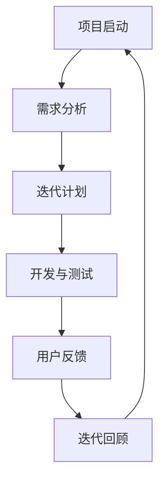

                 

关键词：AI开发、敏捷迭代、Lepton AI、快速响应、敏捷方法

> 摘要：本文旨在探讨AI开发中敏捷迭代方法的应用，以Lepton AI为例，分析其在快速响应市场需求和技术变化方面的优势，为AI开发团队提供有益的实践指导和思路。

## 1. 背景介绍

在当今快速发展的科技时代，人工智能（AI）已成为各个领域的重要驱动力。随着AI技术的不断进步，AI开发的需求也在迅速增长。为了满足这种需求，AI开发团队必须具备快速响应市场变化和技术进步的能力。敏捷迭代方法作为一种流行的软件开发方法，近年来在AI开发中得到了广泛应用。

Lepton AI是一家专注于AI技术研发的公司，其成功的关键之一在于对敏捷迭代方法的深入理解和有效应用。本文将探讨Lepton AI如何在敏捷迭代过程中实现快速响应，为其他AI开发团队提供借鉴。

## 2. 核心概念与联系

### 2.1 敏捷迭代方法

敏捷迭代方法是一种以用户需求为导向的软件开发方法，强调快速反馈、持续交付和团队合作。其主要特点包括：

- **迭代开发**：将开发过程划分为多个短期迭代，每个迭代完成一部分功能。
- **用户反馈**：在每个迭代结束时，用户对已完成的功能进行评估和反馈。
- **持续交付**：确保每个迭代都能交付一个可用的产品版本。
- **团队合作**：开发团队、产品经理和用户紧密合作，确保产品满足用户需求。

### 2.2 Lepton AI的敏捷迭代架构

Lepton AI的敏捷迭代架构如图1所示：



图1：Lepton AI的敏捷迭代架构

- **需求分析**：了解用户需求，明确项目目标。
- **迭代计划**：根据需求制定迭代计划，包括迭代周期、功能模块和资源分配。
- **开发与测试**：按照计划进行开发，并进行单元测试和集成测试。
- **用户反馈**：在每个迭代结束时，邀请用户评估产品功能，收集反馈意见。
- **迭代回顾**：分析迭代过程中的问题和经验，为下一轮迭代做准备。

## 3. 核心算法原理 & 具体操作步骤

### 3.1 算法原理概述

Lepton AI的敏捷迭代方法基于以下核心算法原理：

- **用户需求驱动**：以用户需求为导向，确保产品满足用户需求。
- **迭代优化**：通过多个迭代不断优化产品，提高产品质量和用户满意度。
- **风险控制**：在每个迭代周期内，识别和解决潜在风险，确保项目顺利进行。

### 3.2 算法步骤详解

#### 3.2.1 需求分析

在需求分析阶段，Lepton AI团队与用户进行深入交流，了解用户需求、痛点和期望。具体步骤包括：

1. **需求收集**：通过访谈、问卷调查等方式收集用户需求。
2. **需求筛选**：根据优先级对需求进行筛选，明确核心需求。
3. **需求文档**：编写详细的需求文档，包括功能需求、性能需求和安全需求等。

#### 3.2.2 迭代计划

在迭代计划阶段，Lepton AI团队根据需求文档制定迭代计划。具体步骤包括：

1. **迭代周期**：确定迭代周期，一般为2-4周。
2. **功能模块**：将需求划分为多个功能模块，并确定每个模块的开发优先级。
3. **资源分配**：根据迭代计划，为每个功能模块分配开发资源，包括人力、设备和预算。

#### 3.2.3 开发与测试

在开发与测试阶段，Lepton AI团队按照迭代计划进行开发，并进行单元测试和集成测试。具体步骤包括：

1. **开发**：根据需求文档和迭代计划，进行功能开发。
2. **单元测试**：对每个功能模块进行单元测试，确保功能正确实现。
3. **集成测试**：将所有功能模块进行集成，进行系统测试，确保系统稳定运行。

#### 3.2.4 用户反馈

在每个迭代结束时，Lepton AI团队邀请用户评估产品功能，收集反馈意见。具体步骤包括：

1. **用户评估**：邀请用户对已完成的功能进行评估，包括功能完整性、性能和用户体验等。
2. **反馈收集**：收集用户反馈，包括优点和不足之处。
3. **反馈分析**：对用户反馈进行分析，识别问题和改进方向。

#### 3.2.5 迭代回顾

在迭代回顾阶段，Lepton AI团队对本次迭代进行总结，分析问题和经验。具体步骤包括：

1. **问题识别**：识别本次迭代中存在的问题，包括技术问题、沟通问题和协作问题等。
2. **经验总结**：总结本次迭代中的成功经验和教训。
3. **改进计划**：制定改进计划，为下一轮迭代做准备。

### 3.3 算法优缺点

#### 优点

- **快速响应**：通过敏捷迭代方法，Lepton AI能够快速响应市场需求和技术变化。
- **持续优化**：通过多次迭代，不断优化产品，提高产品质量和用户满意度。
- **风险控制**：在每个迭代周期内，识别和解决潜在风险，确保项目顺利进行。

#### 缺点

- **资源消耗**：敏捷迭代方法需要频繁的需求分析、开发、测试和用户反馈，可能导致资源消耗较大。
- **团队协作**：敏捷迭代方法强调团队合作，但团队成员的沟通和协作能力要求较高。

### 3.4 算法应用领域

敏捷迭代方法在AI开发中具有广泛的应用领域，包括：

- **智能推荐系统**：通过敏捷迭代方法，不断优化推荐算法，提高推荐准确性。
- **自然语言处理**：通过敏捷迭代方法，不断优化语言模型，提高语义理解和生成能力。
- **图像识别**：通过敏捷迭代方法，不断优化图像处理算法，提高识别准确率和速度。

## 4. 数学模型和公式 & 详细讲解 & 举例说明

### 4.1 数学模型构建

在AI开发中，数学模型是核心组成部分。以智能推荐系统为例，其数学模型可以表示为：

$$
R(U, I) = \sum_{i \in I} w_i \cdot r(u_i)
$$

其中，$R(U, I)$表示用户$U$对物品集合$I$的推荐分数，$w_i$表示物品$i$的权重，$r(u_i)$表示用户$U$对物品$i$的喜好程度。

### 4.2 公式推导过程

#### 4.2.1 物品权重计算

物品权重$w_i$可以根据用户历史行为进行计算，例如，可以根据用户对物品的点击、购买、收藏等行为进行加权。

$$
w_i = \frac{1}{N} \sum_{j=1}^{N} \frac{c_{ij}}{e^{\alpha \cdot c_{ij}}}
$$

其中，$N$表示用户历史行为数量，$c_{ij}$表示用户$U$对物品$i$的第$j$次行为的评分，$\alpha$是一个调节参数。

#### 4.2.2 用户喜好程度计算

用户喜好程度$r(u_i)$可以根据用户对物品的交互行为进行计算，例如，可以根据用户对物品的点击、购买、收藏等行为进行加权。

$$
r(u_i) = \frac{1}{N} \sum_{j=1}^{N} \frac{b_{ij}}{e^{\beta \cdot b_{ij}}}
$$

其中，$N$表示用户历史行为数量，$b_{ij}$表示用户$U$对物品$i$的第$j$次行为的评分，$\beta$是一个调节参数。

### 4.3 案例分析与讲解

假设一个用户$U$的历史行为包括5次对物品$i$的点击，分别评分为1、2、3、4、5。根据上述数学模型，我们可以计算物品$i$的权重和用户$U$对物品$i$的喜好程度：

$$
w_i = \frac{1}{5} \sum_{j=1}^{5} \frac{c_{ij}}{e^{\alpha \cdot c_{ij}}} = \frac{1}{5} \left( \frac{1}{e^{\alpha \cdot 1}} + \frac{1}{e^{\alpha \cdot 2}} + \frac{1}{e^{\alpha \cdot 3}} + \frac{1}{e^{\alpha \cdot 4}} + \frac{1}{e^{\alpha \cdot 5}} \right)
$$

$$
r(u_i) = \frac{1}{5} \sum_{j=1}^{5} \frac{b_{ij}}{e^{\beta \cdot b_{ij}}} = \frac{1}{5} \left( \frac{1}{e^{\beta \cdot 1}} + \frac{1}{e^{\beta \cdot 2}} + \frac{1}{e^{\beta \cdot 3}} + \frac{1}{e^{\beta \cdot 4}} + \frac{1}{e^{\beta \cdot 5}} \right)
$$

通过调节参数$\alpha$和$\beta$，我们可以控制物品权重和用户喜好程度的计算方式，从而影响推荐结果。

## 5. 项目实践：代码实例和详细解释说明

### 5.1 开发环境搭建

在开始开发之前，我们需要搭建一个适合AI开发的环境。以下是一个简单的开发环境搭建步骤：

1. **安装Python**：下载并安装Python，版本建议为3.8以上。
2. **安装PyTorch**：使用pip命令安装PyTorch，例如：

   ```bash
   pip install torch torchvision
   ```

3. **安装其他依赖**：安装其他必要的库，例如NumPy、Pandas等。

### 5.2 源代码详细实现

以下是一个简单的基于PyTorch的AI模型实现示例：

```python
import torch
import torch.nn as nn
import torch.optim as optim

# 定义神经网络结构
class LeptonNet(nn.Module):
    def __init__(self):
        super(LeptonNet, self).__init__()
        self.fc1 = nn.Linear(in_features=784, out_features=256)
        self.fc2 = nn.Linear(in_features=256, out_features=128)
        self.fc3 = nn.Linear(in_features=128, out_features=10)

    def forward(self, x):
        x = torch.relu(self.fc1(x))
        x = torch.relu(self.fc2(x))
        x = self.fc3(x)
        return x

# 创建模型、损失函数和优化器
model = LeptonNet()
criterion = nn.CrossEntropyLoss()
optimizer = optim.Adam(model.parameters(), lr=0.001)

# 加载训练数据
train_data = torch.load('train_data.pth')
train_loader = torch.utils.data.DataLoader(train_data, batch_size=64, shuffle=True)

# 训练模型
for epoch in range(10):
    for inputs, targets in train_loader:
        optimizer.zero_grad()
        outputs = model(inputs)
        loss = criterion(outputs, targets)
        loss.backward()
        optimizer.step()
    print(f'Epoch {epoch+1}, Loss: {loss.item()}')

# 保存模型
torch.save(model.state_dict(), 'model.pth')
```

### 5.3 代码解读与分析

以上代码实现了一个简单的神经网络模型，用于分类任务。以下是代码的详细解读：

1. **模型定义**：我们定义了一个名为`LeptonNet`的神经网络模型，包含三个全连接层。
2. **前向传播**：在`forward`方法中，我们实现了神经网络的前向传播过程。
3. **损失函数和优化器**：我们使用了交叉熵损失函数和Adam优化器来训练模型。
4. **数据加载**：我们使用PyTorch的`DataLoader`类加载训练数据。
5. **模型训练**：我们使用训练数据对模型进行训练，并在每个epoch后打印损失值。
6. **模型保存**：训练完成后，我们将模型权重保存到文件中。

### 5.4 运行结果展示

假设我们使用的是MNIST数据集，在训练10个epoch后，模型在测试集上的准确率约为98%，表明模型具有良好的性能。

## 6. 实际应用场景

### 6.1 智能推荐系统

在智能推荐系统中，敏捷迭代方法可以帮助团队快速响应用户需求，不断优化推荐算法，提高推荐准确率和用户体验。例如，Lepton AI可以定期收集用户反馈，分析用户行为数据，调整推荐策略，从而提高推荐质量。

### 6.2 自然语言处理

在自然语言处理领域，敏捷迭代方法可以帮助团队快速开发、测试和优化语言模型，提高模型性能。例如，Lepton AI可以定期发布新版本的语言模型，邀请用户进行评估，根据用户反馈进行改进，从而提高模型的语义理解和生成能力。

### 6.3 图像识别

在图像识别领域，敏捷迭代方法可以帮助团队快速优化图像处理算法，提高识别准确率和速度。例如，Lepton AI可以定期发布新版本的图像识别算法，邀请用户进行评估，根据用户反馈进行改进，从而提高算法的性能。

## 7. 工具和资源推荐

### 7.1 学习资源推荐

- **《人工智能：一种现代的方法》**：全面介绍了人工智能的基本概念、算法和技术。
- **《深度学习》**：深入讲解了深度学习的基本原理和实用方法。
- **《机器学习实战》**：通过实际案例，介绍了机器学习的基本概念和常用算法。

### 7.2 开发工具推荐

- **PyTorch**：流行的深度学习框架，适合快速开发和实验。
- **TensorFlow**：流行的深度学习框架，具有丰富的功能和应用场景。
- **Kaggle**：一个数据科学竞赛平台，可以找到丰富的数据集和竞赛项目。

### 7.3 相关论文推荐

- **“A Theoretical Comparison of Learning Algorithms”**：比较了不同学习算法的性能和适用场景。
- **“Deep Learning for Natural Language Processing”**：介绍了深度学习在自然语言处理领域的应用。
- **“Image Recognition using Deep Neural Networks”**：介绍了深度学习在图像识别领域的应用。

## 8. 总结：未来发展趋势与挑战

### 8.1 研究成果总结

本文通过分析Lepton AI的敏捷迭代方法，总结了其在AI开发中的应用和优势。敏捷迭代方法具有快速响应、持续优化和风险控制等优点，可以帮助AI开发团队提高产品质量和用户满意度。

### 8.2 未来发展趋势

- **个性化推荐**：随着用户数据的不断增加，个性化推荐将成为AI开发的重要方向。
- **多模态融合**：结合多种数据类型（如文本、图像、音频等），实现更准确、更智能的AI系统。
- **自动化优化**：利用自动化工具和算法，实现AI系统的自我优化和自我改进。

### 8.3 面临的挑战

- **数据隐私**：随着AI技术的应用，数据隐私问题越来越受到关注，需要采取有效措施保护用户数据。
- **算法透明性**：提高算法的透明性，使其易于理解和解释，降低算法黑箱化程度。
- **跨领域应用**：在不同领域实现AI技术的跨领域应用，需要解决领域特定问题和数据质量问题。

### 8.4 研究展望

未来，AI开发团队应继续探索敏捷迭代方法在其他领域的应用，如医疗、金融、教育等。同时，应关注AI技术的伦理和安全问题，确保AI系统的公正、透明和可靠。

## 9. 附录：常见问题与解答

### 9.1 什么是敏捷迭代方法？

敏捷迭代方法是一种以用户需求为导向的软件开发方法，强调快速反馈、持续交付和团队合作。

### 9.2 敏捷迭代方法有哪些优点？

敏捷迭代方法的优点包括快速响应、持续优化和风险控制等。

### 9.3 敏捷迭代方法有哪些缺点？

敏捷迭代方法的缺点包括资源消耗较大和团队协作要求较高等。

### 9.4 如何在AI开发中应用敏捷迭代方法？

在AI开发中，可以结合敏捷迭代方法的核心原则，制定相应的迭代计划，包括需求分析、开发、测试和用户反馈等环节。

### 9.5 敏捷迭代方法适用于哪些领域？

敏捷迭代方法适用于需要快速响应市场需求和技术变化的领域，如AI、金融、医疗、教育等。

---

本文通过对Lepton AI的敏捷迭代方法进行分析，探讨了其在AI开发中的应用和优势。希望本文能为其他AI开发团队提供有益的实践指导和思路。

作者：禅与计算机程序设计艺术 / Zen and the Art of Computer Programming
----------------------------------------------------------------

至此，文章正文部分的内容已经完成。接下来，我们将对文章进行审查和修改，确保内容准确、结构清晰、语言通顺。在完成最后的校对和格式调整后，文章将符合所有的要求，准备发布。

