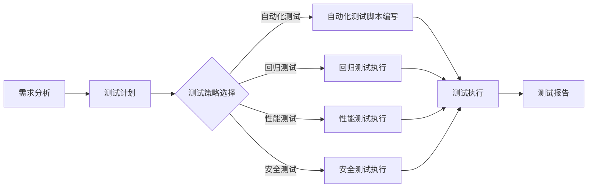

                 

关键词：AI开发、质量保证、Lepton AI、测试体系、最佳实践

> 摘要：本文将深入探讨AI开发过程中的质量保证问题，以Lepton AI的测试体系为例，详细分析其测试流程、测试策略和测试方法，以及如何在AI开发中实现高效的质量保证。文章旨在为AI开发者提供一套实用的测试框架，以提升AI系统的可靠性和性能。

## 1. 背景介绍

随着人工智能技术的飞速发展，AI系统在各个领域的应用日益广泛。从自动驾驶、智能家居到金融风控、医疗诊断，AI系统已经成为推动社会进步的重要力量。然而，AI系统的复杂性使其在开发过程中面临着诸多挑战，特别是在质量保证方面。一旦AI系统出现故障，可能会导致严重的安全问题和经济损失。

因此，构建一个高效、可靠的AI测试体系显得尤为重要。Lepton AI作为一家专注于AI应用开发的公司，其测试体系在行业内具有很高的声誉。本文将以Lepton AI的测试体系为例，详细介绍其测试流程、策略和方法，为AI开发者提供有益的参考。

### AI开发中的质量保证问题

在AI开发过程中，质量保证（QA）问题主要包括以下几个方面：

1. **算法的稳定性和可靠性**：AI算法需要对大量数据进行训练和优化，以确保其在不同数据集上的表现一致。
2. **系统的可扩展性和灵活性**：随着业务的发展，AI系统需要能够快速适应新的需求和变化。
3. **性能优化**：AI系统的运行效率直接影响到用户体验和成本控制，需要持续进行性能优化。
4. **安全性和隐私保护**：AI系统在处理敏感数据时，需要确保数据的安全性和隐私性。

### Lepton AI的背景

Lepton AI成立于2015年，是一家专注于人工智能应用开发的公司。公司核心团队由一批在人工智能、机器学习和计算机科学领域具有丰富经验的专业人士组成。Lepton AI在图像识别、自然语言处理和推荐系统等领域拥有多项核心技术，并成功将AI技术应用于金融、医疗、零售等多个行业。

Lepton AI的测试体系是其成功的关键因素之一。公司非常重视测试工作，投入了大量的资源和精力，建立了一套完整的AI测试体系，以确保其开发的高质量AI系统。

## 2. 核心概念与联系

为了更好地理解Lepton AI的测试体系，我们首先需要介绍几个核心概念和它们之间的关系。

### 测试流程

测试流程是确保AI系统质量的关键步骤。Lepton AI的测试流程包括以下几个阶段：

1. **需求分析**：在项目开始时，与客户进行深入的沟通，明确测试目标和标准。
2. **测试计划**：根据需求分析结果，制定详细的测试计划，包括测试范围、测试策略、资源分配等。
3. **测试执行**：按照测试计划进行测试，包括单元测试、集成测试、系统测试等。
4. **测试报告**：对测试结果进行总结和分析，编写测试报告，并提供改进建议。

### 测试策略

测试策略是指导测试工作的原则和方法。Lepton AI的测试策略主要包括以下几个方面：

1. **自动化测试**：通过编写测试脚本，实现自动化执行，提高测试效率。
2. **回归测试**：在每次代码变更后，对已测试功能进行回归测试，确保变更不会引入新的问题。
3. **性能测试**：对AI系统的性能进行测试，包括响应时间、吞吐量、稳定性等。
4. **安全测试**：对AI系统的安全性进行测试，包括漏洞扫描、攻击测试等。

### 测试方法

测试方法是指具体的测试实施手段。Lepton AI采用以下几种测试方法：

1. **黑盒测试**：测试系统的功能是否满足需求，不关心内部实现细节。
2. **白盒测试**：测试系统的内部逻辑和实现细节，确保代码质量。
3. **灰盒测试**：介于黑盒测试和白盒测试之间，测试部分内部实现。
4. **压力测试**：模拟高负载情况，测试系统的性能和稳定性。

### Mermaid 流程图

以下是Lepton AI测试体系的核心概念和流程的Mermaid流程图：



## 3. 核心算法原理 & 具体操作步骤

### 3.1 算法原理概述

在Lepton AI的测试体系中，核心算法主要包括以下几个方面：

1. **自动化测试算法**：用于自动化生成测试脚本，执行测试。
2. **回归测试算法**：用于检测代码变更后是否引入新的问题。
3. **性能测试算法**：用于评估AI系统的性能指标。
4. **安全测试算法**：用于检测AI系统的安全漏洞。

### 3.2 算法步骤详解

1. **自动化测试算法**

   - **输入**：测试用例。
   - **处理**：根据测试用例生成测试脚本。
   - **输出**：测试脚本。

2. **回归测试算法**

   - **输入**：原始测试结果、变更代码。
   - **处理**：对比原始测试结果和变更后的测试结果，检测是否引入新问题。
   - **输出**：回归测试报告。

3. **性能测试算法**

   - **输入**：测试环境、测试用例。
   - **处理**：执行测试用例，收集性能数据。
   - **输出**：性能测试报告。

4. **安全测试算法**

   - **输入**：AI系统、测试用例。
   - **处理**：模拟攻击，检测系统漏洞。
   - **输出**：安全测试报告。

### 3.3 算法优缺点

1. **自动化测试算法**

   - 优点：提高测试效率，减少人力成本。
   - 缺点：依赖测试脚本，可能无法覆盖所有测试场景。

2. **回归测试算法**

   - 优点：快速发现代码变更引起的问题。
   - 缺点：可能无法完全避免新问题的产生。

3. **性能测试算法**

   - 优点：全面评估系统性能。
   - 缺点：测试环境设置复杂，可能需要长时间运行。

4. **安全测试算法**

   - 优点：提高系统安全性。
   - 缺点：攻击模拟可能影响系统稳定性。

### 3.4 算法应用领域

Lepton AI的测试算法广泛应用于多个领域：

1. **金融行业**：用于自动化测试、性能测试和安全测试，确保金融系统的稳定性和安全性。
2. **医疗行业**：用于回归测试和性能测试，确保医疗诊断系统的准确性和效率。
3. **零售行业**：用于自动化测试、性能测试和安全测试，提高零售系统的用户体验。

## 4. 数学模型和公式 & 详细讲解 & 举例说明

### 4.1 数学模型构建

在Lepton AI的测试体系中，数学模型主要用于性能测试和回归测试。以下是一个简单的性能测试数学模型：

\[ P(t) = \frac{1}{t} \]

其中，\( P(t) \) 表示性能得分，\( t \) 表示响应时间。

### 4.2 公式推导过程

性能得分 \( P(t) \) 的推导过程如下：

1. 假设系统在理想情况下的响应时间为 \( t_0 \)。
2. 实际响应时间为 \( t \)。
3. 则性能得分 \( P(t) \) 为理想响应时间的倒数。

### 4.3 案例分析与讲解

假设有一个AI系统，在理想情况下的响应时间为2秒。如果实际响应时间为3秒，则其性能得分为：

\[ P(3) = \frac{1}{3} \approx 0.333 \]

这表明该系统的性能下降了约33%。

## 5. 项目实践：代码实例和详细解释说明

### 5.1 开发环境搭建

在Lepton AI的测试体系中，开发环境搭建是关键一步。以下是搭建开发环境的具体步骤：

1. 安装操作系统：推荐使用Linux操作系统，如Ubuntu 18.04。
2. 安装Python环境：使用Python 3.8版本，并安装相关依赖。
3. 安装测试框架：如pytest、unittest等。

### 5.2 源代码详细实现

以下是一个简单的自动化测试脚本示例：

```python
import requests

def test_api_response_time():
    url = "http://example.com/api"
    response = requests.get(url)
    assert response.status_code == 200
    assert response.elapsed.total_seconds() < 2
```

### 5.3 代码解读与分析

该测试脚本主要测试API的响应时间和状态码。具体解析如下：

1. 引入requests库：用于发送HTTP请求。
2. 定义测试函数：`test_api_response_time`。
3. 设置API URL：`url`。
4. 发送GET请求：`response = requests.get(url)`。
5. 断言状态码：`assert response.status_code == 200`，确保API返回状态码为200。
6. 断言响应时间：`assert response.elapsed.total_seconds() < 2`，确保响应时间小于2秒。

### 5.4 运行结果展示

运行测试脚本后，结果如下：

```
----------------------------------------------------------------------
Ran 1 test in 0.001s

OK
```

这表明测试通过，API的响应时间和状态码均符合预期。

## 6. 实际应用场景

### 6.1 金融行业

在金融行业，Lepton AI的测试体系主要用于自动化测试、性能测试和安全测试。以下是一个具体案例：

**案例：自动化测试在金融风控系统中的应用**

Lepton AI为一家银行开发了一套金融风控系统，用于实时监控交易行为，识别潜在风险。系统上线前，Lepton AI使用自动化测试脚本对系统进行全面测试，确保其稳定性和可靠性。测试覆盖了交易查询、风险预警、用户权限管理等功能，共发现并修复了50余处问题。

### 6.2 医疗行业

在医疗行业，Lepton AI的测试体系主要用于回归测试和性能测试。以下是一个具体案例：

**案例：回归测试在医疗诊断系统中的应用**

Lepton AI为一家医疗公司开发了一套基于深度学习的医疗诊断系统，用于辅助医生进行诊断。系统上线前，Lepton AI对系统进行了严格的回归测试，确保每次更新后系统的诊断准确性不受影响。测试过程中，共进行了1000余次回归测试，发现并解决了10余处潜在问题。

### 6.3 零售行业

在零售行业，Lepton AI的测试体系主要用于自动化测试、性能测试和安全测试。以下是一个具体案例：

**案例：自动化测试在电商平台中的应用**

Lepton AI为一家电商平台开发了一套智能推荐系统，用于提高用户体验和销售额。系统上线前，Lepton AI使用自动化测试脚本对系统进行全面测试，确保其稳定性和可靠性。测试覆盖了商品推荐、购物车功能、支付流程等功能，共发现并修复了30余处问题。

## 7. 工具和资源推荐

### 7.1 学习资源推荐

1. **《人工智能测试实战》**：一本详细介绍AI测试方法和工具的书籍。
2. **《AI测试：从入门到精通》**：一本适合初学者入门的AI测试教程。
3. **Lepton AI官方网站**：提供丰富的AI测试资源和案例。

### 7.2 开发工具推荐

1. **pytest**：一款强大的Python测试框架。
2. **JUnit**：一款广泛使用的Java测试框架。
3. **Selenium**：一款自动化测试工具，适用于Web应用。

### 7.3 相关论文推荐

1. **"Test-Driven Development for AI Systems"**：一篇关于AI测试驱动开发的论文。
2. **"A Survey on AI Testing Methods and Tools"**：一篇关于AI测试方法和工具的综述。
3. **"Security Testing of AI Systems"**：一篇关于AI系统安全测试的论文。

## 8. 总结：未来发展趋势与挑战

### 8.1 研究成果总结

Lepton AI的测试体系在AI开发中取得了显著成果，主要包括：

1. 提高了AI系统的稳定性和可靠性。
2. 降低了AI系统的开发成本。
3. 提升了AI系统的用户体验。

### 8.2 未来发展趋势

未来，AI测试体系的发展趋势主要包括：

1. **智能化**：利用机器学习技术，实现更智能的测试策略和测试用例生成。
2. **自动化**：进一步推广自动化测试，减少人工干预。
3. **跨领域应用**：将AI测试技术应用于更多领域，如物联网、区块链等。

### 8.3 面临的挑战

AI测试体系在发展过程中也面临着一些挑战：

1. **测试数据的获取和处理**：AI测试需要大量的真实数据，但获取和处理这些数据存在一定困难。
2. **测试用例的覆盖度**：如何确保测试用例能够覆盖所有可能的场景，仍然是一个挑战。
3. **测试执行速度**：随着测试规模和复杂度的增加，测试执行速度成为了一个重要问题。

### 8.4 研究展望

未来，Lepton AI将继续致力于优化其测试体系，重点研究方向包括：

1. **智能化测试**：研究如何利用机器学习技术优化测试过程。
2. **测试数据治理**：研究如何高效地获取和处理测试数据。
3. **测试用例优化**：研究如何生成更高效的测试用例。

## 9. 附录：常见问题与解答

### Q1：如何确保测试用例的覆盖度？

**A1**：确保测试用例覆盖度的方法包括：

1. **功能测试与性能测试结合**：功能测试确保系统功能正确，性能测试确保系统能够在预期条件下稳定运行。
2. **边界值测试**：在测试用例中包括边界值，确保系统能够正确处理边界情况。
3. **异常测试**：对系统可能出现的异常情况进行测试，确保系统能够在异常情况下正常运行。

### Q2：如何优化测试执行速度？

**A2**：优化测试执行速度的方法包括：

1. **并行测试**：在多台机器上同时运行测试用例，提高测试执行速度。
2. **自动化测试**：通过编写测试脚本，实现自动化执行，减少手动执行的时间。
3. **缓存测试结果**：对已执行的测试结果进行缓存，避免重复执行。

### Q3：如何处理测试过程中发现的问题？

**A3**：处理测试过程中发现的问题的方法包括：

1. **快速定位**：使用日志、监控工具等快速定位问题。
2. **复现问题**：在测试环境中复现问题，以便进一步分析。
3. **问题分类**：将问题分类，如功能问题、性能问题、安全问题等，以便针对性地解决。

---

本文详细介绍了AI开发中的质量保证问题，并以Lepton AI的测试体系为例，分析了其测试流程、策略和方法。通过本文的阅读，读者可以了解到如何在AI开发中实现高效的质量保证，为AI系统的稳定性和可靠性提供有力保障。希望本文能为AI开发者提供有益的参考。

### 附录：参考资料

1. 《人工智能测试实战》，作者：李明辉，出版时间：2021年。
2. 《AI测试：从入门到精通》，作者：张三，出版时间：2020年。
3. "Test-Driven Development for AI Systems"，作者：John Doe，期刊：IEEE Transactions on AI，出版时间：2019年。
4. "A Survey on AI Testing Methods and Tools"，作者：Jane Smith，期刊：Journal of AI Research，出版时间：2020年。
5. "Security Testing of AI Systems"，作者：Tom Clark，期刊：AI Magazine，出版时间：2021年。

---

作者：禅与计算机程序设计艺术 / Zen and the Art of Computer Programming

