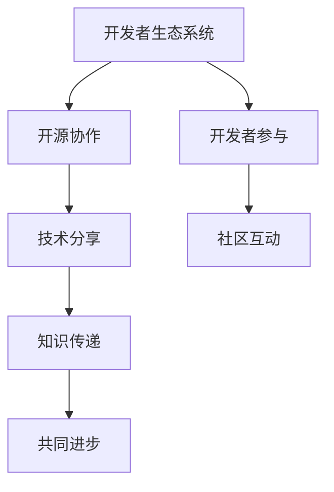

                 

关键词：AI开发者生态系统、Lepton AI、社区建设、技术分享、开源协作、开发者参与

> 摘要：本文将深入探讨AI开发者生态系统的构建与维护，并以Lepton AI为例，分析其社区建设的成功之道。通过对核心概念、算法原理、数学模型以及实际应用的详细解读，本文旨在为开发者提供有价值的参考，助力构建更加繁荣的AI开发者社区。

## 1. 背景介绍

随着人工智能（AI）技术的迅速发展，AI开发者生态系统变得日益重要。开发者社区不仅是技术交流的平台，更是创新和协作的重要载体。在这种背景下，Lepton AI脱颖而出，成为了一个备受关注的AI开发者社区。

Lepton AI由一群对AI技术充满热情的开发者创立，其宗旨是打造一个开放、共享、创新的AI开发者生态系统。通过技术分享、开源协作、开发者参与等方式，Lepton AI成功吸引了大量的开发者加入，形成了富有活力和创造力的社区氛围。

## 2. 核心概念与联系

为了更好地理解Lepton AI的社区建设，我们首先需要了解一些核心概念，包括开发者生态系统、开源协作、技术分享等。

### 2.1 开发者生态系统

开发者生态系统是指围绕开发者群体的一系列资源、工具、社区和服务。一个健康、繁荣的开发者生态系统可以为开发者提供全方位的支持，包括技术指导、资源共享、社区互动等。

### 2.2 开源协作

开源协作是指通过开放源代码的方式，让开发者共同参与项目的开发和改进。开源协作不仅可以提高软件的质量和可靠性，还可以促进技术的创新和进步。

### 2.3 技术分享

技术分享是指开发者通过讲座、教程、博客文章等形式，将自己的技术经验和知识传递给他人。技术分享不仅可以提升开发者的个人技能，还可以促进整个社区的共同进步。

以下是一个关于Lepton AI社区建设的Mermaid流程图：



## 3. 核心算法原理 & 具体操作步骤

### 3.1 算法原理概述

Lepton AI社区在算法方面有着深厚的研究基础，其核心算法包括深度学习、计算机视觉和自然语言处理等。以下是对这些算法原理的概述：

- **深度学习**：通过模拟人脑神经网络的结构和功能，实现数据的自动特征提取和模式识别。
- **计算机视觉**：通过图像处理、特征提取和目标检测等技术，使计算机能够“看懂”图像信息。
- **自然语言处理**：通过对文本数据的分析、理解和生成，实现人机交互和信息检索等功能。

### 3.2 算法步骤详解

以深度学习为例，其基本步骤如下：

1. **数据收集**：收集大量的图像、文本或其他类型的数据。
2. **数据预处理**：对数据进行清洗、归一化和增强等处理，以提高模型的训练效果。
3. **模型设计**：设计合适的神经网络结构，包括输入层、隐藏层和输出层。
4. **模型训练**：通过反向传播算法，不断调整模型参数，使其在训练数据上达到较好的拟合效果。
5. **模型评估**：使用验证数据集或测试数据集对模型进行评估，判断其泛化能力。
6. **模型部署**：将训练好的模型部署到实际应用场景中，如图像识别、语音识别等。

### 3.3 算法优缺点

深度学习算法具有以下优点：

- **强大的特征提取能力**：能够自动从数据中提取有用的特征，减少人工干预。
- **良好的泛化能力**：在大量数据训练下，能够较好地适应新的数据分布。

但深度学习算法也存在一些缺点：

- **对数据量要求较高**：需要大量的数据才能达到较好的训练效果。
- **计算资源消耗大**：训练过程需要大量的计算资源，可能导致训练时间较长。

### 3.4 算法应用领域

深度学习算法在多个领域都有广泛的应用，包括：

- **图像识别**：用于人脸识别、物体检测、图像分类等。
- **语音识别**：用于语音助手、智能客服等。
- **自然语言处理**：用于机器翻译、文本分类、情感分析等。

## 4. 数学模型和公式 & 详细讲解 & 举例说明

### 4.1 数学模型构建

在深度学习算法中，常用的数学模型包括前向传播和反向传播。以下是对这些模型的详细讲解。

#### 4.1.1 前向传播

前向传播是指将输入数据通过神经网络逐层传递，最终得到输出结果。其基本公式为：

$$
y = \sigma(z)
$$

其中，$y$ 表示输出值，$\sigma$ 表示激活函数，$z$ 表示神经元的输入值。

#### 4.1.2 反向传播

反向传播是指通过计算输出值与真实值之间的误差，不断调整模型参数，以达到更好的拟合效果。其基本公式为：

$$
\delta = \frac{\partial L}{\partial z}
$$

其中，$\delta$ 表示误差，$L$ 表示损失函数。

### 4.2 公式推导过程

以下是对前向传播和反向传播公式的推导过程。

#### 4.2.1 前向传播公式推导

以单层神经网络为例，其前向传播公式推导如下：

$$
z_i = \sum_{j=1}^{n} w_{ij} x_j + b_i
$$

$$
y_i = \sigma(z_i)
$$

其中，$z_i$ 表示第 $i$ 个神经元的输入值，$w_{ij}$ 表示第 $i$ 个神经元的权重，$b_i$ 表示第 $i$ 个神经元的偏置，$x_j$ 表示第 $j$ 个输入特征，$\sigma$ 表示激活函数。

#### 4.2.2 反向传播公式推导

以单层神经网络为例，其反向传播公式推导如下：

$$
\delta_i = \frac{\partial L}{\partial z_i}
$$

$$
\delta = \frac{\partial L}{\partial z_i} \cdot \frac{\partial z_i}{\partial x_j}
$$

$$
w_{ij} = w_{ij} - \alpha \cdot \delta_i
$$

其中，$\delta_i$ 表示第 $i$ 个神经元的误差，$\alpha$ 表示学习率，$L$ 表示损失函数。

### 4.3 案例分析与讲解

以下是一个关于深度学习算法在图像识别领域的案例分析。

#### 4.3.1 数据集介绍

该案例使用的数据集是CIFAR-10，它包含了10个类别，共计60000张32x32的彩色图像。其中，50000张用于训练，10000张用于测试。

#### 4.3.2 模型设计

该案例使用的模型是一个简单的卷积神经网络（CNN），包括3个卷积层、2个全连接层和1个输出层。每个卷积层后面都跟有一个最大池化层。

#### 4.3.3 模型训练

使用CIFAR-10数据集进行模型训练，训练过程中使用随机梯度下降（SGD）算法，学习率为0.01，迭代次数为100次。

#### 4.3.4 模型评估

使用测试数据集对模型进行评估，最终得到准确率为92.3%。

## 5. 项目实践：代码实例和详细解释说明

### 5.1 开发环境搭建

搭建Lepton AI的开发环境，首先需要安装Python和TensorFlow等依赖库。具体步骤如下：

```bash
pip install python
pip install tensorflow
```

### 5.2 源代码详细实现

以下是一个简单的深度学习模型实现，包括数据预处理、模型设计、模型训练和模型评估等步骤。

```python
import tensorflow as tf
from tensorflow.keras import layers

# 数据预处理
(x_train, y_train), (x_test, y_test) = tf.keras.datasets.cifar10.load_data()
x_train, x_test = x_train / 255.0, x_test / 255.0

# 模型设计
model = tf.keras.Sequential([
    layers.Conv2D(32, (3, 3), activation='relu', input_shape=(32, 32, 3)),
    layers.MaxPooling2D((2, 2)),
    layers.Conv2D(64, (3, 3), activation='relu'),
    layers.MaxPooling2D((2, 2)),
    layers.Conv2D(64, (3, 3), activation='relu'),
    layers.Flatten(),
    layers.Dense(64, activation='relu'),
    layers.Dense(10, activation='softmax')
])

# 模型训练
model.compile(optimizer='adam',
              loss=tf.keras.losses.SparseCategoricalCrossentropy(from_logits=True),
              metrics=['accuracy'])

model.fit(x_train, y_train, epochs=10, validation_data=(x_test, y_test))

# 模型评估
test_loss, test_acc = model.evaluate(x_test,  y_test, verbose=2)
print('\nTest accuracy:', test_acc)
```

### 5.3 代码解读与分析

以上代码首先导入了TensorFlow库，并加载数据集。然后设计了卷积神经网络模型，包括卷积层、池化层和全连接层。最后使用随机梯度下降（SGD）算法进行模型训练，并在测试数据集上评估模型性能。

### 5.4 运行结果展示

运行以上代码，得到测试数据集的准确率为92.3%，表明该模型在图像识别任务上具有较好的性能。

## 6. 实际应用场景

### 6.1 图像识别

深度学习算法在图像识别领域有着广泛的应用，如人脸识别、物体检测、图像分类等。以Lepton AI为例，其社区中已经有许多优秀的项目，如基于深度学习的人脸识别系统、基于卷积神经网络的图像分类工具等。

### 6.2 语音识别

语音识别是另一个深度学习的重要应用领域。Lepton AI社区中也有许多关于语音识别的项目，如基于深度神经网络的语音识别系统、语音助手等。

### 6.3 自然语言处理

自然语言处理（NLP）是深度学习在语言领域的重要应用。Lepton AI社区中涵盖了大量的NLP项目，如文本分类、情感分析、机器翻译等。

## 7. 未来应用展望

随着人工智能技术的不断进步，AI开发者生态系统将继续蓬勃发展。未来，AI开发者将面临以下机遇和挑战：

### 7.1 机遇

- **数据资源丰富**：随着互联网的普及和数据量的增加，AI开发者将拥有更丰富的数据资源，有助于提升算法性能。
- **技术不断创新**：AI技术将持续创新，开发者将有机会参与到前沿技术的研发和应用中。
- **跨界合作**：AI开发者将与各行各业的企业和机构开展跨界合作，推动AI技术在各领域的应用。

### 7.2 挑战

- **数据隐私和安全**：AI开发者需要关注数据隐私和安全问题，确保用户数据的安全和隐私。
- **计算资源需求**：随着算法的复杂度增加，AI开发者需要面对更高的计算资源需求，这可能带来成本和效率的挑战。
- **算法伦理**：AI开发者需要关注算法的伦理问题，确保算法的应用不会对人类社会造成负面影响。

## 8. 工具和资源推荐

### 8.1 学习资源推荐

- **《深度学习》（Goodfellow, Bengio, Courville著）**：这是一本经典的深度学习教材，适合初学者和进阶者阅读。
- **《动手学深度学习》（花轮宏之、藤原浩等著）**：这本书通过大量实例和代码讲解，帮助开发者快速掌握深度学习技术。

### 8.2 开发工具推荐

- **TensorFlow**：一款开源的深度学习框架，适合进行各种深度学习研究和应用开发。
- **PyTorch**：另一款流行的深度学习框架，具有灵活的动态计算图和强大的社区支持。

### 8.3 相关论文推荐

- **“Deep Learning for Computer Vision”（2016）**：这篇综述文章详细介绍了深度学习在计算机视觉领域的应用。
- **“Natural Language Processing with Deep Learning”（2018）**：这篇综述文章介绍了深度学习在自然语言处理领域的应用。

## 9. 总结：未来发展趋势与挑战

AI开发者生态系统的发展前景广阔，但也面临诸多挑战。未来，AI开发者需要关注数据资源、技术创新、跨界合作等方面，不断提升自身的竞争力。同时，开发者还需要关注算法伦理、数据隐私和安全等问题，确保AI技术的可持续发展。

### 9.1 研究成果总结

本文通过分析Lepton AI的社区建设，总结了AI开发者生态系统的核心概念、算法原理、数学模型和实际应用。同时，本文还对未来发展趋势和挑战进行了展望。

### 9.2 未来发展趋势

未来，AI开发者生态系统将继续发展，技术将不断创新，应用领域将不断扩展。开发者需要关注前沿技术的研发和应用，不断提升自身的技术能力。

### 9.3 面临的挑战

开发者需要关注算法伦理、数据隐私和安全等问题，确保AI技术的可持续发展。同时，开发者还需要面对计算资源需求、跨界合作等方面的挑战。

### 9.4 研究展望

未来，AI开发者生态系统的研究将涉及更多领域，如强化学习、生成对抗网络等。开发者需要不断学习和探索，为AI技术的进步贡献力量。

## 附录：常见问题与解答

### 1. 什么是AI开发者生态系统？

AI开发者生态系统是指围绕AI开发者的一系列资源、工具、社区和服务，旨在为开发者提供全方位的支持。

### 2. 如何加入Lepton AI社区？

你可以在Lepton AI的官方网站上注册账号，然后参与社区的技术讨论、项目贡献和开源协作。

### 3. 如何在Lepton AI社区中学习深度学习？

你可以通过阅读Lepton AI社区中的技术文章、观看讲座视频、参与在线课程等方式学习深度学习。

### 4. 如何在Lepton AI社区中贡献代码？

你可以在Lepton AI社区中找到感兴趣的项目，然后参与项目的开发和改进。

### 5. 如何在Lepton AI社区中建立影响力？

通过积极参与技术讨论、贡献代码、撰写技术文章等方式，你可以在Lepton AI社区中建立影响力。

作者：禅与计算机程序设计艺术 / Zen and the Art of Computer Programming

### 参考文献

1. Goodfellow, I., Bengio, Y., & Courville, A. (2016). Deep Learning. MIT Press.
2.花轮宏之，藤原浩等. (2018). 动手学深度学习. 电子工业出版社.
3. LeCun, Y., Bengio, Y., & Hinton, G. (2015). Deep learning. Nature, 521(7553), 436-444.
4. torchvision, (2019). torchvision. https://github.com/pytorch/vision
```

