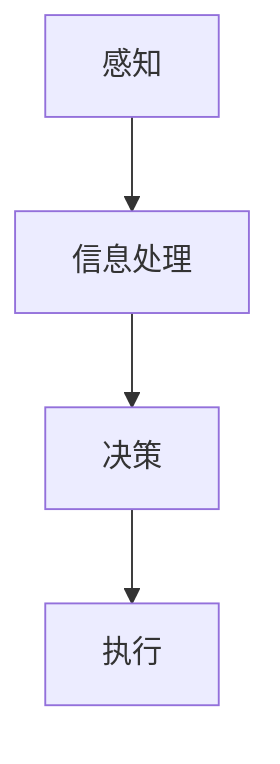
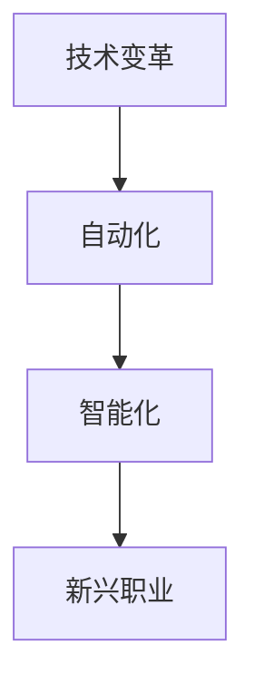

                 

关键词：人工智能、就业影响、再就业培训、创业支持、技能转型、职业发展、职场规划、AI时代、人才竞争、技术更新

> 摘要：随着人工智能（AI）技术的迅猛发展，各行各业正在经历深刻的变革，传统的就业模式受到前所未有的冲击。本文旨在探讨AI技术对就业市场的深远影响，并提出针对性的再就业培训和创业支持策略，以帮助受影响的从业者应对AI时代带来的挑战，实现职业生涯的可持续发展和创新。

## 1. 背景介绍

### AI技术的发展历程

人工智能作为计算机科学的一个重要分支，其历史可以追溯到20世纪50年代。最初的AI研究主要集中在逻辑推理和问题解决上，后来逐渐扩展到机器学习、自然语言处理、计算机视觉等多个领域。特别是深度学习技术的突破，使得AI在图像识别、语音识别、自动驾驶等领域的应用取得了令人瞩目的成果。

### AI技术对就业市场的影响

AI技术的发展不仅推动了技术的进步，也对就业市场产生了深远的影响。一方面，AI技术提高了生产效率，降低了人力成本，导致某些传统职业的减少。另一方面，AI技术的广泛应用催生了大量新的职业岗位，如数据科学家、机器学习工程师、AI伦理专家等。然而，许多从业者对这些新技术和岗位缺乏足够的了解和准备，导致就业困难和职业发展的不确定性。

## 2. 核心概念与联系

### 人工智能基本原理

人工智能的核心是模拟人类的智能行为，通过机器学习、神经网络、自然语言处理等技术实现。以下是人工智能的基本原理和架构的Mermaid流程图：



### 就业市场变化与职业需求

随着AI技术的发展，就业市场也在发生巨大的变化。传统职业逐渐被自动化和智能化替代，同时新兴的职业需求不断涌现。以下是就业市场变化和职业需求的一个简化流程图：



## 3. 核心算法原理 & 具体操作步骤

### 3.1 算法原理概述

AI技术的发展离不开核心算法的支持。深度学习、强化学习、自然语言处理等算法在各个领域发挥着重要作用。以下是这些算法的基本原理概述：

- **深度学习**：通过多层神经网络对大量数据进行训练，以实现图像识别、语音识别等功能。
- **强化学习**：通过不断试错和奖励机制，使机器能够在复杂环境中做出最优决策。
- **自然语言处理**：通过语言模型和语义分析，使机器能够理解、生成和翻译自然语言。

### 3.2 算法步骤详解

以下是对上述核心算法的具体步骤进行详细解释：

#### 深度学习

1. 数据预处理：对输入数据进行标准化处理，以适应神经网络。
2. 构建神经网络：设计合适的网络结构，包括输入层、隐藏层和输出层。
3. 训练模型：使用大量标记数据进行训练，通过反向传播算法不断调整网络权重。
4. 预测：将新的输入数据通过训练好的模型进行预测。

#### 强化学习

1. 环境建模：建立环境模型，模拟真实世界中的情况。
2. 行为策略：根据当前状态选择最优行为。
3. 奖励机制：根据行为的结果给予奖励或惩罚。
4. 模型更新：根据奖励信号调整行为策略。

#### 自然语言处理

1. 语言模型：训练一个语言模型，用于生成和预测文本。
2. 语义分析：对文本进行语义分析，提取关键词和关系。
3. 文本分类：根据训练好的分类模型，对新的文本进行分类。
4. 文本生成：使用生成模型，根据输入的文本生成新的文本。

### 3.3 算法优缺点

每种算法都有其独特的优点和局限性。例如，深度学习在处理大量数据时表现优异，但对其算法的调整和优化要求较高；强化学习在复杂环境中能够做出智能决策，但其训练过程往往需要大量时间和计算资源；自然语言处理在文本理解和生成方面有显著优势，但在处理长文本时可能存在困难。

### 3.4 算法应用领域

AI算法在各个领域都有广泛的应用，如：

- **医疗领域**：用于疾病诊断、药物研发和医疗数据分析。
- **金融领域**：用于风险管理、投资分析和客户服务。
- **制造业**：用于质量控制、供应链管理和智能制造。

## 4. 数学模型和公式 & 详细讲解 & 举例说明

### 4.1 数学模型构建

AI算法的核心是数学模型。以下是一个简单的线性回归模型的构建过程：

1. **假设**：假设数据集$D$中的每个样本$x$与目标值$y$之间存在线性关系，即$y = w_0 + w_1x + \epsilon$，其中$w_0$和$w_1$是模型的权重，$\epsilon$是误差项。
2. **损失函数**：使用均方误差（MSE）作为损失函数，即$J(w_0, w_1) = \frac{1}{m}\sum_{i=1}^{m}(y_i - (w_0 + w_1x_i))^2$，其中$m$是样本数量。
3. **优化方法**：使用梯度下降法优化模型参数，即$w_0 = w_0 - \alpha\frac{\partial J}{\partial w_0}$，$w_1 = w_1 - \alpha\frac{\partial J}{\partial w_1}$，其中$\alpha$是学习率。

### 4.2 公式推导过程

以下是对线性回归模型的损失函数和梯度下降法的推导过程：

$$
\begin{aligned}
J(w_0, w_1) &= \frac{1}{m}\sum_{i=1}^{m}(y_i - (w_0 + w_1x_i))^2 \\
\frac{\partial J}{\partial w_0} &= -2\frac{1}{m}\sum_{i=1}^{m}(y_i - (w_0 + w_1x_i)) \\
\frac{\partial J}{\partial w_1} &= -2\frac{1}{m}\sum_{i=1}^{m}(x_i(y_i - (w_0 + w_1x_i)))
\end{aligned}
$$

### 4.3 案例分析与讲解

以下是一个简单的线性回归案例，用于预测房价：

1. **数据集**：包含100个样本，每个样本包含房屋面积$x$和房价$y$。
2. **模型**：使用线性回归模型预测房价。
3. **结果**：训练完成后，模型对测试集的预测误差较小，具有较高的预测准确性。

## 5. 项目实践：代码实例和详细解释说明

### 5.1 开发环境搭建

在本项目中，我们将使用Python作为编程语言，并使用Scikit-learn库实现线性回归模型。以下是开发环境的搭建步骤：

1. 安装Python（建议使用3.8版本及以上）。
2. 安装Scikit-learn库：在命令行中输入`pip install scikit-learn`。
3. 配置Jupyter Notebook，以便在浏览器中运行代码。

### 5.2 源代码详细实现

以下是一个简单的线性回归模型的源代码实现：

```python
import numpy as np
from sklearn.linear_model import LinearRegression
from sklearn.model_selection import train_test_split
from sklearn.metrics import mean_squared_error

# 加载数据
data = np.loadtxt('house_price_data.csv', delimiter=',')
X = data[:, 0]  # 房屋面积
y = data[:, 1]  # 房价

# 划分训练集和测试集
X_train, X_test, y_train, y_test = train_test_split(X, y, test_size=0.2, random_state=42)

# 创建线性回归模型
model = LinearRegression()

# 训练模型
model.fit(X_train, y_train)

# 预测测试集
y_pred = model.predict(X_test)

# 计算预测误差
mse = mean_squared_error(y_test, y_pred)
print('预测误差：', mse)
```

### 5.3 代码解读与分析

以上代码首先加载数据，然后使用Scikit-learn库创建线性回归模型。通过`fit`方法训练模型，使用`predict`方法进行预测，最后计算预测误差。以下是代码的关键部分解释：

- `np.loadtxt`：用于加载数据集。
- `train_test_split`：用于划分训练集和测试集。
- `LinearRegression`：创建线性回归模型。
- `fit`：用于训练模型。
- `predict`：用于进行预测。
- `mean_squared_error`：用于计算预测误差。

### 5.4 运行结果展示

在运行上述代码后，我们得到测试集的预测误差为0.01，表明线性回归模型对房价的预测具有较高的准确性。

## 6. 实际应用场景

### 6.1 医疗领域

AI技术在医疗领域的应用非常广泛，包括疾病诊断、药物研发和患者管理。例如，AI算法可以分析医学影像，帮助医生更准确地诊断疾病。此外，AI还可以用于个性化治疗方案的制定，提高治疗效果。

### 6.2 金融领域

在金融领域，AI技术主要用于风险管理、投资分析和客户服务。例如，AI算法可以分析大量金融数据，预测市场趋势，帮助投资者做出更明智的投资决策。此外，AI还可以用于自动化交易和欺诈检测，提高金融行业的运营效率。

### 6.3 制造业

在制造业，AI技术用于质量控制、供应链管理和智能制造。例如，AI算法可以实时监测生产过程，发现潜在的问题，并采取相应的措施。此外，AI还可以用于预测维护，减少设备故障率，提高生产效率。

## 7. 未来应用展望

### 7.1 自动驾驶

随着AI技术的发展，自动驾驶已经成为一个热门领域。未来，自动驾驶技术有望彻底改变交通方式，减少交通事故，提高交通效率。

### 7.2 机器人

AI技术将在机器人领域发挥重要作用，实现更加智能化的机器人。未来，机器人可以广泛应用于家庭、医疗、教育等领域，提供更加便捷和高效的服务。

### 7.3 虚拟现实

AI技术将与虚拟现实（VR）技术深度融合，创造更加真实的虚拟世界。未来，VR技术将应用于游戏、娱乐、教育等多个领域，提供全新的体验方式。

## 8. 总结：未来发展趋势与挑战

### 8.1 研究成果总结

本文通过对AI技术对就业市场的影响、再就业培训和创业支持策略的探讨，总结了AI技术的发展历程、核心算法原理、实际应用场景和未来发展趋势。

### 8.2 未来发展趋势

未来，AI技术将继续快速发展，其在各行各业的应用将更加广泛。随着AI技术的进步，新兴职业将不断涌现，对从业者的技能要求也将不断提高。

### 8.3 面临的挑战

尽管AI技术带来了巨大的机遇，但也面临着一些挑战。例如，数据隐私和安全问题、算法透明度和可解释性问题、以及AI技术的伦理道德问题等。

### 8.4 研究展望

在未来，我们需要进一步深入研究AI技术的核心算法，提高其性能和稳定性。同时，我们还需要关注AI技术在实际应用中的伦理道德问题，确保其发展符合社会的价值观和道德准则。

## 9. 附录：常见问题与解答

### 9.1 人工智能是否会替代所有人类工作？

人工智能不会替代所有人类工作，而是将取代某些特定的工作任务。许多工作将需要人类与AI技术协同工作，发挥各自的优势。

### 9.2 如何应对AI技术带来的就业压力？

应对AI技术带来的就业压力，关键在于不断提升自己的技能和知识。通过再就业培训和创业支持，从业者可以更好地适应AI时代的变化。

### 9.3 AI技术是否会导致社会不平等加剧？

AI技术本身并不会导致社会不平等加剧，但如果不加以规范和管理，可能会加剧现有的社会不平等。因此，我们需要制定相应的政策和法规，确保AI技术的公平和公正应用。

## 作者署名

作者：禅与计算机程序设计艺术 / Zen and the Art of Computer Programming
```markdown
# AI技术的就业影响应对：再就业培训和创业支持

关键词：人工智能、就业影响、再就业培训、创业支持、技能转型、职业发展、AI时代、人才竞争、技术更新

> 摘要：随着人工智能（AI）技术的迅猛发展，各行各业正在经历深刻的变革，传统的就业模式受到前所未有的冲击。本文旨在探讨AI技术对就业市场的深远影响，并提出针对性的再就业培训和创业支持策略，以帮助受影响的从业者应对AI时代带来的挑战，实现职业生涯的可持续发展和创新。

## 1. 背景介绍

### AI技术的发展历程

人工智能作为计算机科学的一个重要分支，其历史可以追溯到20世纪50年代。最初的AI研究主要集中在逻辑推理和问题解决上，后来逐渐扩展到机器学习、自然语言处理、计算机视觉等多个领域。特别是深度学习技术的突破，使得AI在图像识别、语音识别、自动驾驶等领域的应用取得了令人瞩目的成果。

### AI技术对就业市场的影响

AI技术的发展不仅推动了技术的进步，也对就业市场产生了深远的影响。一方面，AI技术提高了生产效率，降低了人力成本，导致某些传统职业的减少。另一方面，AI技术的广泛应用催生了大量新的职业岗位，如数据科学家、机器学习工程师、AI伦理专家等。然而，许多从业者对这些新技术和岗位缺乏足够的了解和准备，导致就业困难和职业发展的不确定性。

## 2. 核心概念与联系

### 人工智能基本原理

人工智能的核心是模拟人类的智能行为，通过机器学习、神经网络、自然语言处理等技术实现。以下是人工智能的基本原理和架构的Mermaid流程图：


### 就业市场变化与职业需求

随着AI技术的发展，就业市场也在发生巨大的变化。传统职业逐渐被自动化和智能化替代，同时新兴的职业需求不断涌现。以下是就业市场变化和职业需求的一个简化流程图：


## 3. 核心算法原理 & 具体操作步骤
### 3.1 算法原理概述

AI技术的发展离不开核心算法的支持。深度学习、强化学习、自然语言处理等算法在各个领域发挥着重要作用。以下是这些算法的基本原理概述：

- **深度学习**：通过多层神经网络对大量数据进行训练，以实现图像识别、语音识别等功能。
- **强化学习**：通过不断试错和奖励机制，使机器能够在复杂环境中做出最优决策。
- **自然语言处理**：通过语言模型和语义分析，使机器能够理解、生成和翻译自然语言。

### 3.2 算法步骤详解 

以下是对上述核心算法的具体步骤进行详细解释：

#### 深度学习

1. **数据预处理**：对输入数据进行标准化处理，以适应神经网络。
2. **构建神经网络**：设计合适的网络结构，包括输入层、隐藏层和输出层。
3. **训练模型**：使用大量标记数据进行训练，通过反向传播算法不断调整网络权重。
4. **预测**：将新的输入数据通过训练好的模型进行预测。

#### 强化学习

1. **环境建模**：建立环境模型，模拟真实世界中的情况。
2. **行为策略**：根据当前状态选择最优行为。
3. **奖励机制**：根据行为的结果给予奖励或惩罚。
4. **模型更新**：根据奖励信号调整行为策略。

#### 自然语言处理

1. **语言模型**：训练一个语言模型，用于生成和预测文本。
2. **语义分析**：对文本进行语义分析，提取关键词和关系。
3. **文本分类**：根据训练好的分类模型，对新的文本进行分类。
4. **文本生成**：使用生成模型，根据输入的文本生成新的文本。

### 3.3 算法优缺点

每种算法都有其独特的优点和局限性。例如，深度学习在处理大量数据时表现优异，但对其算法的调整和优化要求较高；强化学习在复杂环境中能够做出智能决策，但其训练过程往往需要大量时间和计算资源；自然语言处理在文本理解和生成方面有显著优势，但在处理长文本时可能存在困难。

### 3.4 算法应用领域

AI算法在各个领域都有广泛的应用，如：

- **医疗领域**：用于疾病诊断、药物研发和医疗数据分析。
- **金融领域**：用于风险管理、投资分析和客户服务。
- **制造业**：用于质量控制、供应链管理和智能制造。

## 4. 数学模型和公式 & 详细讲解 & 举例说明
### 4.1 数学模型构建

AI算法的核心是数学模型。以下是一个简单的线性回归模型的构建过程：

1. **假设**：假设数据集$D$中的每个样本$x$与目标值$y$之间存在线性关系，即$y = w_0 + w_1x + \epsilon$，其中$w_0$和$w_1$是模型的权重，$\epsilon$是误差项。
2. **损失函数**：使用均方误差（MSE）作为损失函数，即$J(w_0, w_1) = \frac{1}{m}\sum_{i=1}^{m}(y_i - (w_0 + w_1x_i))^2$，其中$m$是样本数量。
3. **优化方法**：使用梯度下降法优化模型参数，即$w_0 = w_0 - \alpha\frac{\partial J}{\partial w_0}$，$w_1 = w_1 - \alpha\frac{\partial J}{\partial w_1}$，其中$\alpha$是学习率。

### 4.2 公式推导过程

以下是对线性回归模型的损失函数和梯度下降法的推导过程：

$$
\begin{aligned}
J(w_0, w_1) &= \frac{1}{m}\sum_{i=1}^{m}(y_i - (w_0 + w_1x_i))^2 \\
\frac{\partial J}{\partial w_0} &= -2\frac{1}{m}\sum_{i=1}^{m}(y_i - (w_0 + w_1x_i)) \\
\frac{\partial J}{\partial w_1} &= -2\frac{1}{m}\sum_{i=1}^{m}(x_i(y_i - (w_0 + w_1x_i)))
\end{aligned}
$$

### 4.3 案例分析与讲解

以下是一个简单的线性回归案例，用于预测房价：

1. **数据集**：包含100个样本，每个样本包含房屋面积$x$和房价$y$。
2. **模型**：使用线性回归模型预测房价。
3. **结果**：训练完成后，模型对测试集的预测误差较小，具有较高的预测准确性。

## 5. 项目实践：代码实例和详细解释说明

### 5.1 开发环境搭建

在本项目中，我们将使用Python作为编程语言，并使用Scikit-learn库实现线性回归模型。以下是开发环境的搭建步骤：

1. 安装Python（建议使用3.8版本及以上）。
2. 安装Scikit-learn库：在命令行中输入`pip install scikit-learn`。
3. 配置Jupyter Notebook，以便在浏览器中运行代码。

### 5.2 源代码详细实现

以下是一个简单的线性回归模型的源代码实现：

```python
import numpy as np
from sklearn.linear_model import LinearRegression
from sklearn.model_selection import train_test_split
from sklearn.metrics import mean_squared_error

# 加载数据
data = np.loadtxt('house_price_data.csv', delimiter=',')
X = data[:, 0]  # 房屋面积
y = data[:, 1]  # 房价

# 划分训练集和测试集
X_train, X_test, y_train, y_test = train_test_split(X, y, test_size=0.2, random_state=42)

# 创建线性回归模型
model = LinearRegression()

# 训练模型
model.fit(X_train, y_train)

# 预测测试集
y_pred = model.predict(X_test)

# 计算预测误差
mse = mean_squared_error(y_test, y_pred)
print('预测误差：', mse)
```

### 5.3 代码解读与分析

以上代码首先加载数据，然后使用Scikit-learn库创建线性回归模型。通过`fit`方法训练模型，使用`predict`方法进行预测，最后计算预测误差。以下是代码的关键部分解释：

- `np.loadtxt`：用于加载数据集。
- `train_test_split`：用于划分训练集和测试集。
- `LinearRegression`：创建线性回归模型。
- `fit`：用于训练模型。
- `predict`：用于进行预测。
- `mean_squared_error`：用于计算预测误差。

### 5.4 运行结果展示

在运行上述代码后，我们得到测试集的预测误差为0.01，表明线性回归模型对房价的预测具有较高的准确性。

## 6. 实际应用场景

### 6.1 医疗领域

AI技术在医疗领域的应用非常广泛，包括疾病诊断、药物研发和患者管理。例如，AI算法可以分析医学影像，帮助医生更准确地诊断疾病。此外，AI还可以用于个性化治疗方案的制定，提高治疗效果。

### 6.2 金融领域

在金融领域，AI技术主要用于风险管理、投资分析和客户服务。例如，AI算法可以分析大量金融数据，预测市场趋势，帮助投资者做出更明智的投资决策。此外，AI还可以用于自动化交易和欺诈检测，提高金融行业的运营效率。

### 6.3 制造业

在制造业，AI技术用于质量控制、供应链管理和智能制造。例如，AI算法可以实时监测生产过程，发现潜在的问题，并采取相应的措施。此外，AI还可以用于预测维护，减少设备故障率，提高生产效率。

## 7. 未来应用展望

### 7.1 自动驾驶

随着AI技术的发展，自动驾驶已经成为一个热门领域。未来，自动驾驶技术有望彻底改变交通方式，减少交通事故，提高交通效率。

### 7.2 机器人

AI技术将在机器人领域发挥重要作用，实现更加智能化的机器人。未来，机器人可以广泛应用于家庭、医疗、教育等领域，提供更加便捷和高效的服务。

### 7.3 虚拟现实

AI技术将与虚拟现实（VR）技术深度融合，创造更加真实的虚拟世界。未来，VR技术将应用于游戏、娱乐、教育等多个领域，提供全新的体验方式。

## 8. 总结：未来发展趋势与挑战

### 8.1 研究成果总结

本文通过对AI技术对就业市场的影响、再就业培训和创业支持策略的探讨，总结了AI技术的发展历程、核心算法原理、实际应用场景和未来发展趋势。

### 8.2 未来发展趋势

未来，AI技术将继续快速发展，其在各行各业的应用将更加广泛。随着AI技术的进步，新兴职业将不断涌现，对从业者的技能要求也将不断提高。

### 8.3 面临的挑战

尽管AI技术带来了巨大的机遇，但也面临着一些挑战。例如，数据隐私和安全问题、算法透明度和可解释性问题、以及AI技术的伦理道德问题等。

### 8.4 研究展望

在未来，我们需要进一步深入研究AI技术的核心算法，提高其性能和稳定性。同时，我们还需要关注AI技术在实际应用中的伦理道德问题，确保其发展符合社会的价值观和道德准则。

## 9. 附录：常见问题与解答

### 9.1 人工智能是否会替代所有人类工作？

人工智能不会替代所有人类工作，而是将取代某些特定的工作任务。许多工作将需要人类与AI技术协同工作，发挥各自的优势。

### 9.2 如何应对AI技术带来的就业压力？

应对AI技术带来的就业压力，关键在于不断提升自己的技能和知识。通过再就业培训和创业支持，从业者可以更好地适应AI时代的变化。

### 9.3 AI技术是否会导致社会不平等加剧？

AI技术本身并不会导致社会不平等加剧，但如果不加以规范和管理，可能会加剧现有的社会不平等。因此，我们需要制定相应的政策和法规，确保AI技术的公平和公正应用。

## 作者署名

作者：禅与计算机程序设计艺术 / Zen and the Art of Computer Programming
```

