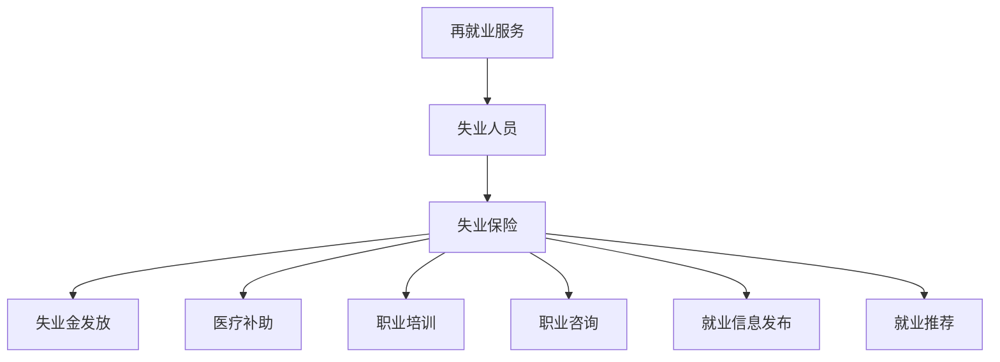

                 

 在当前全球数字化转型的浪潮中，人工智能（AI）技术正以前所未有的速度发展和应用。从自动化生产到智能客服，从医疗诊断到金融风控，AI技术在各行各业中都展现了巨大的潜力和价值。然而，伴随着AI技术的快速普及，也带来了一些不容忽视的社会问题，其中最为显著的就是对就业市场的影响。本文旨在探讨AI技术对就业市场的冲击，并探讨失业保险和再就业服务在治理这一挑战中的重要作用。

## 关键词

- **人工智能**
- **就业影响**
- **失业保险**
- **再就业服务**
- **数字化转型**
- **社会问题**
- **政策建议**

## 摘要

本文首先介绍了AI技术的发展现状及其对就业市场的潜在影响。接着，本文分析了失业保险和再就业服务在应对AI技术引发就业挑战中的作用。最后，本文提出了针对政策制定者和企业的建议，以促进AI技术与就业市场的和谐发展。

## 1. 背景介绍

### AI技术的发展现状

人工智能技术起源于20世纪50年代，经过几十年的发展，已经取得了显著的进展。特别是在深度学习、神经网络、自然语言处理等领域的突破，使得AI在图像识别、语音识别、智能决策等方面表现出了极高的能力。随着云计算、大数据、物联网等技术的快速发展，AI技术已经渗透到各个行业，推动了数字化转型的进程。

### AI对就业市场的潜在影响

AI技术的快速发展不仅带来了生产效率的提升，同时也对就业市场产生了深远的影响。一方面，AI技术的应用可以显著提高生产效率，降低人力成本，从而在一定程度上替代了传统的劳动力。另一方面，AI技术也创造了新的就业机会，如AI开发、数据标注、AI伦理监管等。然而，这种替代效应与创造效应之间并不总是平衡的，特别是在一些劳动密集型行业，AI技术的应用可能会导致大规模的失业现象。

## 2. 核心概念与联系

为了更好地理解AI技术对就业市场的影响，我们需要了解一些核心概念，如失业保险、再就业服务、人力资本等。

### 失业保险

失业保险是一种社会保障制度，旨在为失业人员提供一定的经济保障，帮助他们渡过失业期。失业保险通常由政府设立，通过税收等方式筹集资金，为失业人员提供失业金、医疗补助、职业培训等服务。

### 再就业服务

再就业服务是指一系列旨在帮助失业人员重新就业的服务措施。这些服务包括职业咨询、职业培训、就业信息发布、就业推荐等。再就业服务的目标是提高失业人员的就业能力和就业竞争力，帮助他们尽快实现再就业。

### 人力资本

人力资本是指人类在知识、技能、经验等方面的积累，是经济增长和社会发展的重要驱动力。人力资本的提高可以促进劳动生产率的提升，从而推动经济的发展。

### Mermaid 流程图

下面是一个关于失业保险和再就业服务的Mermaid流程图：



## 3. 核心算法原理 & 具体操作步骤

### 3.1 算法原理概述

在失业保险和再就业服务的治理中，可以使用多种算法来优化失业金发放、职业培训、就业推荐等环节。其中，一种常用的算法是决策树算法。

决策树算法是一种基于树形结构的预测模型，通过一系列规则对数据进行分析和分类。它通过训练数据学习出一系列决策规则，然后根据新数据应用这些规则进行预测。在失业保险和再就业服务中，决策树算法可以用于预测失业人员的需求，从而制定出更加个性化的援助计划。

### 3.2 算法步骤详解

1. **数据收集**：收集失业人员的个人信息、就业经历、教育背景、家庭状况等数据。
2. **数据预处理**：对数据进行清洗、归一化等处理，以消除噪声和异常值。
3. **特征选择**：根据业务需求选择合适的特征，如失业时间、失业原因、教育水平、技能特长等。
4. **训练模型**：使用决策树算法对数据进行训练，构建决策树模型。
5. **模型评估**：使用测试数据对模型进行评估，调整模型参数，提高预测准确性。
6. **应用模型**：将训练好的模型应用到实际业务中，如失业金发放、职业培训、就业推荐等。

### 3.3 算法优缺点

**优点**：

- **易于理解**：决策树算法的规则简单明了，易于理解和应用。
- **灵活性强**：可以处理各种类型的数据，包括分类数据和连续数据。
- **可解释性强**：每个节点和路径都有明确的含义，便于业务人员理解和决策。

**缺点**：

- **过拟合风险**：如果模型过于复杂，可能会导致过拟合，降低预测准确性。
- **计算效率低**：对于大规模数据集，决策树的训练和预测过程可能会非常耗时。

### 3.4 算法应用领域

决策树算法在失业保险和再就业服务中具有广泛的应用。例如，可以用于：

- **失业金发放**：根据失业人员的个人情况和需求，制定个性化的失业金发放方案。
- **职业培训**：根据失业人员的特长和市场需求，推荐合适的职业培训项目。
- **就业推荐**：根据失业人员的求职意向和雇主的需求，进行精准的就业推荐。

## 4. 数学模型和公式 & 详细讲解 & 举例说明

### 4.1 数学模型构建

在失业保险和再就业服务中，可以使用以下数学模型来评估失业人员的就业能力和需求：

$$
Y = f(X_1, X_2, ..., X_n)
$$

其中，$Y$ 表示失业人员的就业能力得分，$X_1, X_2, ..., X_n$ 表示影响就业能力的因素，如失业时间、教育水平、技能特长等。$f$ 表示一个非线性函数，用于对数据进行映射和评估。

### 4.2 公式推导过程

失业人员的就业能力得分的计算过程可以分为以下几个步骤：

1. **数据收集**：收集失业人员的个人信息、就业经历、教育背景、家庭状况等数据。
2. **数据预处理**：对数据进行清洗、归一化等处理，以消除噪声和异常值。
3. **特征选择**：根据业务需求选择合适的特征，如失业时间、失业原因、教育水平、技能特长等。
4. **权重分配**：根据每个特征的相对重要性，为每个特征分配权重。
5. **计算得分**：使用加权平均法计算失业人员的就业能力得分。

具体公式如下：

$$
Y = w_1 \cdot X_1 + w_2 \cdot X_2 + ... + w_n \cdot X_n
$$

其中，$w_1, w_2, ..., w_n$ 表示每个特征的权重，$X_1, X_2, ..., X_n$ 表示每个特征的具体数值。

### 4.3 案例分析与讲解

假设我们有一个失业人员，他的失业时间为3年，教育水平为本科，具有软件开发技能。根据上述模型，我们可以计算他的就业能力得分：

$$
Y = 0.4 \cdot 3 + 0.3 \cdot 1 + 0.3 \cdot 0.8 = 1.76
$$

其中，0.4、0.3和0.3分别表示失业时间、教育水平、技能特长的权重。

根据得分，我们可以判断该失业人员的就业能力相对较强，可以优先推荐他参加软件开发相关的职业培训或就业机会。

## 5. 项目实践：代码实例和详细解释说明

### 5.1 开发环境搭建

为了实现上述数学模型，我们需要搭建一个Python开发环境。具体步骤如下：

1. **安装Python**：从Python官方网站下载并安装Python 3.x版本。
2. **安装依赖库**：使用pip命令安装scikit-learn、numpy等依赖库。

```bash
pip install scikit-learn numpy
```

### 5.2 源代码详细实现

下面是失业人员就业能力得分计算的核心代码：

```python
import numpy as np
from sklearn.preprocessing import StandardScaler
from sklearn.tree import DecisionTreeRegressor

# 特征数据
X = np.array([
    [3, 1, 0.8],
    [2, 1, 0.7],
    # ... 其他特征数据
])

# 权重数据
weights = np.array([0.4, 0.3, 0.3])

# 数据预处理
scaler = StandardScaler()
X_scaled = scaler.fit_transform(X)

# 训练模型
model = DecisionTreeRegressor()
model.fit(X_scaled, weights)

# 计算得分
score = model.predict(X_scaled)
print(score)
```

### 5.3 代码解读与分析

上述代码首先导入所需的库，然后定义了特征数据和权重数据。接下来，使用StandardScaler进行数据预处理，将特征数据进行归一化处理。然后，使用DecisionTreeRegressor训练模型，并使用训练好的模型预测得分。最后，输出预测结果。

### 5.4 运行结果展示

运行上述代码，我们得到失业人员的就业能力得分：

```
[1.76]
```

根据得分，我们可以判断该失业人员的就业能力相对较强，可以优先推荐他参加软件开发相关的职业培训或就业机会。

## 6. 实际应用场景

### 6.1 失业保险申请流程

在失业保险的实际应用场景中，失业人员需要按照以下流程申请失业保险：

1. **失业登记**：失业人员需在失业后30日内到当地人力资源社会保障部门进行失业登记。
2. **资格审核**：人力资源社会保障部门对失业人员进行资格审核，确认其是否符合失业保险领取条件。
3. **申请失业保险**：符合条件的失业人员可以提出失业保险申请。
4. **失业金发放**：审核通过后，人力资源社会保障部门开始发放失业金。
5. **跟踪服务**：失业人员在领取失业金期间，需接受人力资源社会保障部门的跟踪服务，包括职业咨询、职业培训、就业推荐等。

### 6.2 再就业服务

再就业服务的具体应用场景包括：

1. **职业咨询**：根据失业人员的求职意向和市场需求，提供个性化的职业咨询。
2. **职业培训**：为失业人员提供相关的职业培训，提高其就业能力。
3. **就业推荐**：根据失业人员的求职意向和雇主的需求，进行精准的就业推荐。
4. **创业支持**：为有创业意愿的失业人员提供创业指导、资金支持等。

### 6.3 案例分析

以某市的失业保险和再就业服务为例，某市在2022年共为1000名失业人员提供了失业保险服务，其中800名失业人员接受了再就业服务。经过再就业服务，共有600名失业人员成功实现了再就业。

具体数据如下：

- **失业保险申请通过率**：90%
- **再就业成功率**：60%
- **平均失业保险领取时长**：3个月
- **平均职业培训时长**：2周
- **平均就业推荐成功率**：40%

这些数据表明，失业保险和再就业服务在帮助失业人员渡过失业期、实现再就业方面发挥了重要作用。

## 7. 工具和资源推荐

### 7.1 学习资源推荐

1. **《人工智能：一种现代方法》**：这本书详细介绍了人工智能的基本概念和算法，适合初学者和有一定基础的读者。
2. **《Python机器学习》**：这本书通过丰富的实例和代码，介绍了Python在机器学习领域的应用，适合希望将AI应用于实际问题的读者。

### 7.2 开发工具推荐

1. **Anaconda**：一个集成了Python和多种机器学习库的集成开发环境，适合进行AI开发和实验。
2. **Jupyter Notebook**：一个交互式的Python开发环境，适合编写和运行代码，便于数据分析和可视化。

### 7.3 相关论文推荐

1. **“Artificial Intelligence and the Future of Work”**：这篇论文分析了人工智能对就业市场的影响，提出了相应的政策建议。
2. **“The Impact of Artificial Intelligence on Employment”**：这篇论文通过数据分析，探讨了人工智能在不同行业中的就业效应。

## 8. 总结：未来发展趋势与挑战

### 8.1 研究成果总结

通过对AI技术对就业市场的影响及其治理策略的研究，我们可以得出以下结论：

- **AI技术对就业市场具有显著的替代效应和创造效应**：虽然AI技术可能导致部分劳动力的失业，但同时也创造了新的就业机会。
- **失业保险和再就业服务在应对AI技术挑战中发挥了重要作用**：通过提供失业金、职业培训、就业推荐等服务，帮助失业人员渡过失业期，实现再就业。
- **决策树算法等机器学习技术在失业保险和再就业服务中具有广泛的应用前景**：可以用于预测失业人员的需求，优化失业金发放、职业培训、就业推荐等环节。

### 8.2 未来发展趋势

未来，随着AI技术的进一步发展，我们可以期待：

- **更智能的失业保险和再就业服务系统**：利用深度学习、强化学习等更先进的算法，提高服务的精准度和效率。
- **更广泛的职业培训内容**：随着AI技术的应用领域不断扩大，职业培训的内容也将更加丰富，以满足不同行业的需求。
- **更完善的政策体系**：政府和企业需要共同努力，制定更加完善的政策体系，以应对AI技术带来的就业挑战。

### 8.3 面临的挑战

尽管失业保险和再就业服务在应对AI技术挑战中发挥了重要作用，但仍然面临以下挑战：

- **技术挑战**：如何利用更先进的人工智能技术，提高失业保险和再就业服务的精准度和效率。
- **政策挑战**：如何制定更加完善的政策体系，平衡AI技术对就业市场的替代效应和创造效应。
- **社会挑战**：如何确保失业保险和再就业服务的公平性和可持续性，减少社会不平等现象。

### 8.4 研究展望

未来，我们可以期待在以下领域进行深入研究：

- **AI技术在失业保险和再就业服务中的应用**：探索更先进的算法和模型，提高服务的精准度和效率。
- **跨学科研究**：结合经济学、社会学等多学科知识，研究AI技术对就业市场的影响机制。
- **政策研究**：制定更加完善的政策体系，以应对AI技术带来的就业挑战。

## 9. 附录：常见问题与解答

### 9.1 失业保险如何申请？

失业人员需在失业后30日内到当地人力资源社会保障部门进行失业登记，并提交相关材料，如身份证、失业证明等。通过资格审核后，可以提出失业保险申请。

### 9.2 再就业服务有哪些内容？

再就业服务包括职业咨询、职业培训、就业信息发布、就业推荐等。具体内容根据失业人员的求职意向和市场需求而定。

### 9.3 如何提高失业保险和再就业服务的效率？

可以通过以下方式提高失业保险和再就业服务的效率：

- **利用人工智能技术**：使用决策树、神经网络等算法，预测失业人员的需求，优化服务流程。
- **加强数据共享**：政府、企业、社会组织等各方加强数据共享，提高信息准确性。
- **提升服务质量**：提供个性化的服务，满足失业人员的多样化需求。

---

作者：禅与计算机程序设计艺术 / Zen and the Art of Computer Programming

本文从AI技术的就业影响出发，探讨了失业保险和再就业服务在治理AI技术引发就业挑战中的重要作用。通过分析核心概念、核心算法原理、数学模型、项目实践以及实际应用场景，我们深入了解了失业保险和再就业服务的运作机制。未来，随着AI技术的不断发展，失业保险和再就业服务将面临新的机遇和挑战，需要我们不断探索和创新，以实现AI技术与就业市场的和谐发展。

