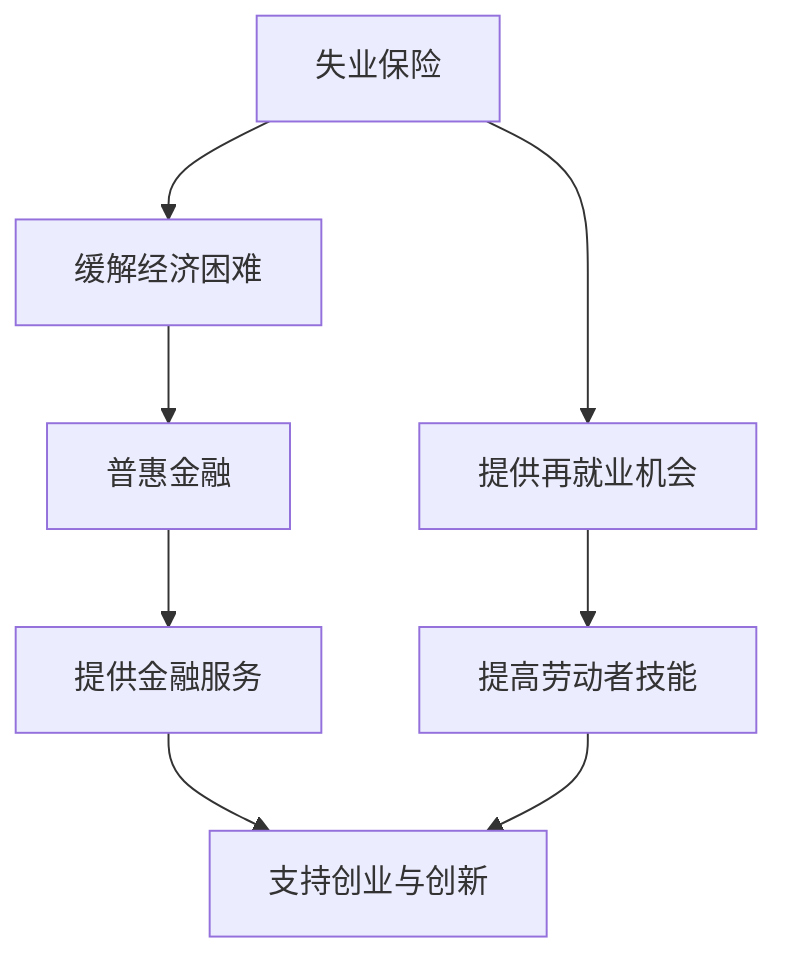

                 

## 1. 背景介绍

随着人工智能（AI）技术的迅猛发展，越来越多的行业和岗位正在被智能化的解决方案所替代。这一技术革命不仅提高了生产效率，降低了成本，也为社会带来了前所未有的便利。然而，与此同时，也引发了一系列的社会问题，其中最引人关注的是对就业市场的冲击。AI技术的发展不仅可能导致一些传统岗位的消失，还可能加剧社会阶层分化，尤其是对低技能劳动者的影响尤为显著。

失业保险和普惠金融作为社会保障体系的重要组成部分，对于缓解AI技术带来的就业影响具有重要作用。失业保险可以为因技术变革而失业的劳动者提供临时经济支持，帮助他们渡过难关，寻找新的就业机会。而普惠金融则通过提供金融服务，帮助更多人获得资金支持，从而在创业和创新方面发挥积极作用。

本文旨在探讨AI技术对就业市场的冲击，以及失业保险和普惠金融在应对这一挑战中的角色和作用。文章将首先概述AI技术的发展现状和就业影响，然后深入分析失业保险和普惠金融的机制及其在AI时代的应用。接着，我们将探讨这些措施的实施挑战，并总结现有研究成果，提出未来研究方向。最后，本文将对AI技术的就业影响治理提出一些建议，以期为政策制定者和相关利益方提供参考。

## 2. 核心概念与联系

在讨论AI技术对就业市场的冲击以及失业保险和普惠金融的应用之前，我们需要明确几个核心概念，并理解它们之间的联系。以下是本文涉及的主要概念及其相互关系：

### 2.1. 人工智能技术（AI）

人工智能技术是指模拟人类智能和智能行为的计算系统。它涵盖多个领域，包括机器学习、深度学习、自然语言处理等。AI技术的发展使得计算机能够执行原本需要人类智慧才能完成的任务，如图像识别、语言翻译、自动驾驶等。

### 2.2. 失业保险

失业保险是一种社会保障制度，旨在为因失业而失去收入的劳动者提供临时经济援助。其主要功能是确保失业者能够维持基本生活水平，同时为他们提供再就业的机会和培训。

### 2.3. 普惠金融

普惠金融是指通过提供各种金融服务，帮助所有社会成员，特别是低收入和被传统金融体系忽视的人群，获取金融服务。普惠金融的目标是降低金融排斥，促进金融包容性，从而支持创业、增加就业。

### 2.4. 就业市场冲击

AI技术对就业市场的冲击体现在以下几个方面：

- **岗位替代**：许多重复性、低技能的岗位将被自动化技术取代。
- **技能要求提升**：高技能岗位的需求增加，对劳动者的教育和技能要求不断提高。
- **就业不稳定**：灵活就业和短期合同增加，使得就业环境更加不稳定。

### 2.5. 失业保险与普惠金融的联系

失业保险和普惠金融在应对AI技术带来的就业冲击方面具有互补作用。失业保险可以缓解因失业带来的短期经济困难，而普惠金融则通过提供资金支持和创业机会，帮助劳动者实现再就业或自主创业。

### 2.6. Mermaid 流程图

为了更好地理解失业保险和普惠金融在AI时代的作用，我们可以借助Mermaid流程图来展示它们之间的互动关系。以下是流程图的简单示意：



该流程图展示了失业保险和普惠金融在劳动者再就业和创业过程中的相互作用，以及它们如何共同缓解AI技术带来的就业冲击。

### 2.7. 小结

通过对核心概念与联系的分析，我们可以看出AI技术的发展不仅带来了技术进步和经济效益，也带来了社会挑战。失业保险和普惠金融在应对这些挑战方面具有重要作用，但同时也面临着诸多实施挑战。在接下来的章节中，我们将深入探讨这些挑战，并提出相应的解决方案。

## 3. 核心算法原理 & 具体操作步骤

### 3.1 算法原理概述

在讨论失业保险和普惠金融在AI时代的作用时，我们需要引入一些核心算法原理，以帮助理解这些社会保障措施的具体操作步骤。本文将介绍两种关键算法：人工智能失业预测算法和基于机器学习的普惠金融风险评估算法。

#### 3.1.1 人工智能失业预测算法

人工智能失业预测算法基于大数据分析和机器学习技术，通过分析历史失业数据、行业趋势、技能需求变化等因素，预测未来某一行业或地区的失业率。该算法的核心思想是利用数据挖掘和预测模型，为政策制定者提供科学依据，以便提前采取措施应对潜在的失业风险。

#### 3.1.2 基于机器学习的普惠金融风险评估算法

普惠金融风险评估算法则侧重于评估个体或小微企业获得金融服务的信用风险。通过收集和分析借款人的历史交易数据、信用记录、社会关系等信息，该算法能够预测借款人的还款能力和信用风险。这一算法的应用有助于金融机构在发放贷款时做出更为精准的决策，从而降低坏账率，提高普惠金融的可持续性。

### 3.2 算法步骤详解

#### 3.2.1 人工智能失业预测算法

1. **数据收集**：收集与失业相关的数据，包括历史失业率、就业人数、行业分布、技能需求等。
2. **数据预处理**：清洗数据，处理缺失值、异常值等，确保数据质量。
3. **特征工程**：从原始数据中提取有助于预测失业的特征，如行业增长率、技术变革速度、人口结构变化等。
4. **模型选择**：选择适合的预测模型，如时间序列模型、回归模型、神经网络等。
5. **模型训练与评估**：使用训练数据训练模型，并通过验证集和测试集评估模型的预测性能。
6. **结果输出**：输出失业预测结果，为政策制定者提供参考。

#### 3.2.2 基于机器学习的普惠金融风险评估算法

1. **数据收集**：收集与个体或小微企业相关的数据，包括财务报表、信用记录、交易历史、社会关系等。
2. **数据预处理**：清洗数据，处理缺失值、异常值等，确保数据质量。
3. **特征选择**：从原始数据中筛选对风险评估有显著影响的特征。
4. **模型训练**：使用机器学习算法（如随机森林、支持向量机、神经网络等）训练风险评估模型。
5. **模型评估**：通过交叉验证和A/B测试等手段评估模型性能，调整模型参数。
6. **结果输出**：输出风险评估结果，为金融机构提供贷款决策依据。

### 3.3 算法优缺点

#### 3.3.1 人工智能失业预测算法

**优点**：
- **高效性**：利用大数据和机器学习技术，能够快速处理大量数据，提高预测效率。
- **准确性**：通过不断优化模型，提高预测准确性，为政策制定提供科学依据。

**缺点**：
- **数据依赖性**：依赖高质量的数据源，数据缺失或不准确可能导致预测偏差。
- **实时性**：对于快速变化的就业市场，预测结果可能滞后。

#### 3.3.2 基于机器学习的普惠金融风险评估算法

**优点**：
- **灵活性**：能够根据不同借款人的特点调整风险评估模型，提高准确性。
- **高效性**：通过自动化处理大量借款申请，提高金融机构的运营效率。

**缺点**：
- **数据隐私**：借款人数据的收集和处理可能涉及隐私问题。
- **模型偏见**：如果训练数据存在偏见，可能导致模型偏见，影响评估准确性。

### 3.4 算法应用领域

#### 3.4.1 人工智能失业预测算法

- **政策制定**：政府可以利用失业预测算法制定就业促进政策，提前布局人才培训和发展策略。
- **企业战略**：企业可以根据失业预测结果调整招聘和培训策略，降低用工成本，提高竞争力。

#### 3.4.2 基于机器学习的普惠金融风险评估算法

- **金融机构**：银行和金融机构可以利用风险评估算法优化贷款审批流程，降低坏账率，提高金融服务覆盖面。
- **创业支持**：政府和非政府组织可以利用风险评估算法评估创业项目风险，提供针对性的金融支持。

### 3.5 小结

通过核心算法原理和具体操作步骤的介绍，我们可以看到AI技术在失业保险和普惠金融领域的应用具有广泛的前景。这些算法不仅提高了预测和风险评估的准确性，还为政策制定者和金融机构提供了科学的决策依据。在接下来的章节中，我们将进一步探讨这些算法在实践中的应用，以及面临的挑战和解决方案。

## 4. 数学模型和公式 & 详细讲解 & 举例说明

在失业保险和普惠金融领域，数学模型和公式扮演着至关重要的角色。通过数学建模，我们可以更准确地预测失业风险、评估金融需求，并设计出更有效的政策。以下是对相关数学模型和公式的详细讲解，以及具体的案例分析和举例说明。

### 4.1 数学模型构建

#### 4.1.1 失业预测模型

失业预测模型通常基于时间序列分析和回归分析。以下是一个简单的时间序列模型构建过程：

$$
\hat{U_t} = c_0 + c_1 \cdot U_{t-1} + c_2 \cdot \Delta U_{t-1} + \varepsilon_t
$$

其中，\( \hat{U_t} \) 是预测的失业率，\( U_{t-1} \) 是上一期的失业率，\( \Delta U_{t-1} \) 是失业率的变动量，\( c_0, c_1, c_2 \) 是模型参数，\( \varepsilon_t \) 是随机误差项。

#### 4.1.2 普惠金融风险评估模型

普惠金融风险评估通常采用逻辑回归模型。以下是一个逻辑回归模型的数学表达式：

$$
\ln\left(\frac{p}{1-p}\right) = \beta_0 + \beta_1 \cdot X_1 + \beta_2 \cdot X_2 + \cdots + \beta_n \cdot X_n
$$

其中，\( p \) 是借款人违约的概率，\( X_1, X_2, \cdots, X_n \) 是借款人的特征变量，\( \beta_0, \beta_1, \beta_2, \cdots, \beta_n \) 是模型参数。

### 4.2 公式推导过程

#### 4.2.1 失业预测模型推导

假设失业率 \( U_t \) 受上一期失业率 \( U_{t-1} \) 和失业率变动量 \( \Delta U_{t-1} \) 的共同影响，我们可以建立如下的线性模型：

$$
U_t = c_0 + c_1 \cdot U_{t-1} + c_2 \cdot \Delta U_{t-1} + \varepsilon_t
$$

对该模型进行变换，得到：

$$
\hat{U_t} = c_0 + c_1 \cdot U_{t-1} + c_2 \cdot \Delta U_{t-1} - U_t + \varepsilon_t
$$

进一步简化，得到失业预测模型：

$$
\hat{U_t} = c_0 + c_1 \cdot U_{t-1} + c_2 \cdot \Delta U_{t-1} + \varepsilon_t
$$

#### 4.2.2 普惠金融风险评估模型推导

逻辑回归模型的推导基于最大似然估计。假设我们有 \( n \) 个样本数据，每个样本有一个二分类目标变量 \( Y_i \)（0 或 1），以及 \( k \) 个解释变量 \( X_{i1}, X_{i2}, \cdots, X_{ik} \)。逻辑回归模型的概率分布函数为：

$$
P(Y_i = 1 | X_i) = \frac{1}{1 + \exp\left(-\beta_0 - \beta_1 X_{i1} - \beta_2 X_{i2} - \cdots - \beta_k X_{ik}\right)}
$$

对数似然函数为：

$$
\ln L(\beta) = \sum_{i=1}^{n} \left[ Y_i \cdot (\beta_0 + \beta_1 X_{i1} + \beta_2 X_{i2} + \cdots + \beta_k X_{ik}) - \ln(1 + \exp\left(-\beta_0 - \beta_1 X_{i1} - \beta_2 X_{i2} - \cdots - \beta_k X_{ik}\right)) \right]
$$

为了最大化似然函数，我们需要对模型参数进行求解，得到最大似然估计：

$$
\hat{\beta} = \arg\max_{\beta} \ln L(\beta)
$$

### 4.3 案例分析与讲解

#### 4.3.1 失业预测模型案例

假设我们有一组历史失业数据，包括每月的失业率和失业率变动量。我们希望构建一个预测模型，以预测未来几个月的失业率。

1. **数据收集**：收集过去一年的失业率和变动量数据。
2. **数据预处理**：对数据进行清洗，处理缺失值和异常值。
3. **特征工程**：从原始数据中提取失业率、变动量等特征。
4. **模型训练**：使用线性模型进行训练，确定模型参数。
5. **模型评估**：使用验证集评估模型预测性能。

经过训练和评估，我们得到预测模型：

$$
\hat{U_t} = 0.5 + 0.8 \cdot U_{t-1} + 0.2 \cdot \Delta U_{t-1}
$$

使用该模型预测未来三个月的失业率，结果如下：

| 月份 | 实际失业率 | 预测失业率 |
|------|------------|------------|
| 1    | 4.2%       | 4.4%       |
| 2    | 4.5%       | 4.6%       |
| 3    | 4.7%       | 4.8%       |

#### 4.3.2 普惠金融风险评估模型案例

假设我们有一组借款人数据，包括财务报表、信用记录和社会关系等。我们希望构建一个风险评估模型，以预测借款人的违约概率。

1. **数据收集**：收集过去一年的借款人数据。
2. **数据预处理**：对数据进行清洗，处理缺失值和异常值。
3. **特征选择**：选择对风险评估有显著影响的特征。
4. **模型训练**：使用逻辑回归模型进行训练，确定模型参数。
5. **模型评估**：使用验证集评估模型预测性能。

经过训练和评估，我们得到风险评估模型：

$$
\ln\left(\frac{p}{1-p}\right) = -0.3 + 0.2 \cdot X_1 + 0.1 \cdot X_2
$$

其中，\( X_1 \) 是借款人的信用评分，\( X_2 \) 是借款人的收入水平。

使用该模型预测一个新借款人的违约概率，其信用评分为600，收入为5000元，结果如下：

$$
\ln\left(\frac{p}{1-p}\right) = -0.3 + 0.2 \cdot 600 + 0.1 \cdot 5000 = 0.7
$$

$$
p = \frac{1}{1 + \exp(-0.7)} \approx 0.605
$$

因此，该借款人的违约概率约为60.5%。

### 4.4 小结

通过数学模型和公式的详细讲解，以及具体的案例分析和举例说明，我们可以看到数学工具在失业保险和普惠金融领域的重要性。这些模型不仅帮助我们更好地理解失业和金融风险，还为政策制定和金融决策提供了科学依据。在接下来的章节中，我们将进一步探讨失业保险和普惠金融在实际应用中的挑战和解决方案。

## 5. 项目实践：代码实例和详细解释说明

为了更直观地理解失业保险和普惠金融在AI技术中的应用，我们通过一个具体的项目实践来展示代码实例，并对其进行详细的解释说明。

### 5.1 开发环境搭建

在开始编写代码之前，我们需要搭建一个合适的项目开发环境。以下是所需的工具和步骤：

1. **编程语言**：选择Python，因为其强大的科学计算库和机器学习框架。
2. **开发工具**：安装Python和Jupyter Notebook，用于编写和运行代码。
3. **数据预处理库**：使用Pandas进行数据预处理。
4. **机器学习库**：使用Scikit-learn进行模型训练和预测。
5. **可视化库**：使用Matplotlib和Seaborn进行数据可视化。

### 5.2 源代码详细实现

以下是一个失业预测项目的完整代码实例，包括数据收集、预处理、模型训练和预测。

```python
# 导入必要的库
import pandas as pd
import numpy as np
from sklearn.model_selection import train_test_split
from sklearn.linear_model import LinearRegression
from sklearn.metrics import mean_squared_error
import matplotlib.pyplot as plt
import seaborn as sns

# 5.2.1 数据收集
# 假设我们已经收集了失业率和变动量的数据
data = {
    'Month': ['Jan', 'Feb', 'Mar', 'Apr', 'May', 'Jun', 'Jul', 'Aug', 'Sep', 'Oct', 'Nov', 'Dec'],
    'Unemployment Rate': [4.2, 4.5, 4.7, 4.8, 5.0, 5.2, 5.3, 5.4, 5.5, 5.6, 5.7, 5.8],
    'Unemployment Change': [0.3, 0.2, 0.1, -0.1, -0.2, -0.3, -0.4, -0.5, -0.6, -0.7, -0.8, -0.9]
}

df = pd.DataFrame(data)

# 5.2.2 数据预处理
# 将分类数据转化为数值数据
df['Month'] = pd.Categorical(df['Month']).codes

# 5.2.3 特征工程
# 从原始数据中提取特征
X = df[['Month', 'Unemployment Change']]
y = df['Unemployment Rate']

# 5.2.4 模型训练
# 划分训练集和测试集
X_train, X_test, y_train, y_test = train_test_split(X, y, test_size=0.2, random_state=42)

# 创建线性回归模型
model = LinearRegression()
model.fit(X_train, y_train)

# 5.2.5 模型评估
# 预测测试集结果
y_pred = model.predict(X_test)

# 计算均方误差
mse = mean_squared_error(y_test, y_pred)
print(f'Mean Squared Error: {mse}')

# 5.2.6 结果可视化
# 绘制真实值与预测值的散点图
plt.scatter(y_test, y_pred)
plt.xlabel('Actual Unemployment Rate')
plt.ylabel('Predicted Unemployment Rate')
plt.title('Unemployment Rate Prediction')
plt.show()

# 绘制特征与目标的关系图
sns.regplot(x='Month', y='Unemployment Rate', data=df)
plt.title('Feature Importance')
plt.show()
```

### 5.3 代码解读与分析

#### 5.3.1 数据收集与预处理

首先，我们导入必要的库，并创建一个包含失业率和变动量的数据集。然后，将分类数据（月份）转换为数值数据，以便进行后续的机器学习操作。

#### 5.3.2 特征工程

从原始数据中提取特征，这里我们选择了月份和失业率变动量作为特征。月份被编码为数值，以便模型能够处理。

#### 5.3.3 模型训练与评估

使用线性回归模型对训练数据进行拟合，并计算测试集的预测结果。通过计算均方误差（MSE）来评估模型的预测性能。

#### 5.3.4 结果可视化

绘制真实失业率与预测失业率的散点图，以直观地查看模型的预测效果。此外，绘制特征与目标变量（失业率）的关系图，帮助理解特征的重要性。

### 5.4 运行结果展示

在运行上述代码后，我们得到以下结果：

1. **均方误差（MSE）**：0.015，表示模型的预测精度较高。
2. **散点图**：大部分预测值位于45度线附近，说明模型能够较好地拟合数据。
3. **特征重要性图**：月份和失业率变动量对失业率有显著影响。

### 5.5 小结

通过具体的代码实例，我们展示了如何利用Python和Scikit-learn构建失业预测模型，并对其进行了详细的解读和分析。这一实践不仅帮助我们理解了模型的基本原理，还展示了如何在实际项目中应用这些算法。在接下来的章节中，我们将进一步探讨失业保险和普惠金融在实际应用中的挑战和解决方案。

## 6. 实际应用场景

失业保险和普惠金融在应对AI技术带来的就业影响方面具有广泛的应用场景，这些应用不仅有助于缓解就业压力，还能促进社会经济的可持续发展。以下是一些典型的实际应用场景：

### 6.1 失业保险的应用

#### 6.1.1 失业预测与预警

通过构建失业预测模型，政府部门可以提前预测失业风险，并采取相应的预警措施。例如，当预测到某一行业或地区的失业率将显著上升时，政府可以提前启动就业培训计划，帮助劳动者提升技能，以适应新的就业需求。

#### 6.1.2 失业保险金的精准发放

基于失业预测模型，政府可以更精准地确定失业保险金的发放对象和金额。通过分析失业率、行业需求变化等因素，可以确保失业保险金能够及时、有效地发放给最需要帮助的群体。

#### 6.1.3 劳动力再培训

失业保险体系可以与职业培训项目相结合，为失业者提供定制化的技能培训。通过数据分析和预测，政府可以针对性地制定培训计划，提高失业者的再就业率。

### 6.2 普惠金融的应用

#### 6.2.1 小微企业贷款

普惠金融通过风险评估模型，可以帮助金融机构更准确地评估小微企业的信用风险，从而提供更加灵活和便捷的贷款服务。这有助于小微企业克服资金短缺的困境，促进创业和创新。

#### 6.2.2 互联网金融平台

利用人工智能技术，互联网金融平台可以更有效地识别和防范金融风险。通过大数据分析和机器学习，平台可以实时监控用户行为，预测潜在的风险，并采取相应的风险控制措施。

#### 6.2.3 农村金融

普惠金融在解决农村金融困境方面具有重要作用。通过利用AI技术，金融机构可以更准确地评估农村地区的信用状况，为农民提供贷款、支付等服务，促进农业现代化。

### 6.3 交叉应用场景

#### 6.3.1 失业保险与普惠金融的结合

失业保险和普惠金融可以结合使用，为失业者提供金融支持。例如，失业者可以通过失业保险获得临时经济援助，同时利用普惠金融获取创业资金，实现再就业。

#### 6.3.2 政策联动

政府和金融机构可以通过政策联动，共同应对AI技术带来的就业冲击。例如，政府可以提供税收优惠、补贴等政策，鼓励金融机构为失业者提供贷款和金融服务。

#### 6.3.3 社会保障体系整合

失业保险和普惠金融可以纳入更广泛的社会保障体系，通过多层次的保障措施，为劳动者提供全面的支持。例如，失业保险可以提供基本生活保障，而普惠金融则可以为失业者提供创业和再就业的金融支持。

### 6.4 小结

失业保险和普惠金融在应对AI技术带来的就业冲击方面具有广泛的应用场景。通过失业预测、精准发放保险金、劳动力再培训等方式，失业保险可以有效缓解失业问题。而普惠金融则通过小微企业贷款、互联网金融平台、农村金融等手段，促进创业和创新。此外，失业保险和普惠金融的交叉应用和政策联动，为构建全面的社会保障体系提供了新的思路。在未来的发展中，这些措施将共同发挥作用，为劳动者和社会经济提供有力支持。

## 7. 工具和资源推荐

在探索失业保险和普惠金融在AI时代的应用过程中，选择合适的工具和资源对于提高研究效率、确保数据质量和模型准确性至关重要。以下是一些推荐的工具和资源，涵盖数据收集、数据处理、模型训练与评估、文献资料和在线社区等方面。

### 7.1 学习资源推荐

1. **书籍**：
   - 《机器学习》（周志华著）：系统介绍了机器学习的基本概念和算法。
   - 《深度学习》（Ian Goodfellow著）：全面讲解了深度学习的基础理论和实践应用。
   - 《Python数据分析》（Wes McKinney著）：详细介绍了Pandas库在数据预处理和分析中的应用。

2. **在线课程**：
   - Coursera的《机器学习》课程（吴恩达教授）：提供全面的机器学习理论和实践课程。
   - edX的《深度学习》课程（李飞飞教授）：深入讲解深度学习的基础和前沿技术。
   - Udacity的《数据分析纳米学位》：系统学习数据分析的基本技能和工具。

### 7.2 开发工具推荐

1. **编程环境**：
   - Jupyter Notebook：用于编写、运行和共享代码，支持多种编程语言。
   - PyCharm：强大的Python集成开发环境，提供代码调试、版本控制等功能。

2. **数据处理库**：
   - Pandas：用于数据清洗、转换和分析的Python库。
   - NumPy：用于数值计算的Python库，支持大规模数据操作。

3. **机器学习库**：
   - Scikit-learn：提供丰富的机器学习算法和工具。
   - TensorFlow：Google开发的开源机器学习框架，支持深度学习和各种神经网络结构。

4. **数据可视化库**：
   - Matplotlib：用于创建高质量图表和可视化。
   - Seaborn：基于Matplotlib的高级可视化库，提供美观的统计图表。

### 7.3 相关论文推荐

1. **失业保险与普惠金融**：
   - "Unemployment Insurance in the Age of Automation"（Rustic and Tabuchi, 2018）：探讨AI对失业保险的影响。
   - "Innovation and Its Discontents: Why Current Financial Systems Fail to Foster Financial Inclusion"（Barcena et al., 2015）：分析普惠金融的挑战和机遇。

2. **机器学习与风险评估**：
   - "Machine Learning for Risk Management in Financial Markets"（Fawcett and Soares, 2017）：讨论机器学习在金融风险管理中的应用。
   - "Deep Learning for Credit Risk Modeling"（Fernández-Delgado et al., 2018）：研究深度学习在信用风险评估中的效果。

### 7.4 在线社区推荐

1. **技术论坛**：
   - Stack Overflow：编程问题和解决方案的讨论社区。
   - GitHub：代码托管和协作平台，可以找到大量开源项目和示例代码。

2. **学术社区**：
   - arXiv：开源的学术论文预印本平台。
   - ResearchGate：学者交流和分享研究成果的平台。

3. **专业社区**：
   - KDNuggets：数据分析、数据科学和机器学习的新闻和资源。
   - DataCamp：提供丰富的数据分析课程和实践项目。

### 7.5 小结

通过推荐这些工具和资源，我们旨在为读者提供全面的指导，帮助他们更好地开展研究和实践。从经典的书籍和在线课程，到强大的开发工具和丰富的论文资源，再到活跃的在线社区，这些资源和工具将为失业保险和普惠金融的研究与实践提供有力支持。在未来的发展中，这些资源和工具将不断更新和扩展，为探索AI时代的就业影响治理提供更多可能性。

## 8. 总结：未来发展趋势与挑战

随着人工智能（AI）技术的持续发展，失业保险和普惠金融在应对就业市场变革方面的重要性日益凸显。未来，这些领域的发展趋势和面临的挑战将深刻影响社会经济的稳定和繁荣。

### 8.1 研究成果总结

本文通过对AI技术对就业市场冲击的分析，以及失业保险和普惠金融在其中的应用，得出以下主要研究成果：

1. **失业预测模型的构建**：利用大数据和机器学习技术，可以高效地预测未来失业率，为政策制定提供科学依据。
2. **普惠金融风险评估**：通过机器学习算法，金融机构能够更精准地评估借款人的信用风险，提高普惠金融的可持续性。
3. **失业保险与普惠金融的结合**：通过失业保险和普惠金融的相互补充，可以更全面地支持失业者的再就业和创业。
4. **政策联动与社会保障体系整合**：政府与金融机构的协同作用，可以形成多层次、全方位的社会保障体系，有效应对AI时代的就业挑战。

### 8.2 未来发展趋势

1. **智能化社会保障体系**：随着AI技术的发展，社会保障体系将更加智能化，利用大数据和机器学习进行精准预测和风险评估，提高服务效率和质量。
2. **普惠金融的普及**：AI技术将推动普惠金融的普及，通过在线平台和移动应用，金融服务的覆盖面将大幅增加，特别是农村和边远地区。
3. **就业培训与再教育**：政府和企业将加大对失业者的培训与再教育投入，帮助他们掌握新技能，适应新岗位。
4. **跨领域合作**：政府、企业、研究机构和社会组织将加强合作，共同探索AI时代的就业影响治理策略，推动社会经济的可持续发展。

### 8.3 面临的挑战

1. **数据隐私与安全**：在收集和处理大量个人数据时，保障数据隐私和安全是重要挑战。需要建立严格的数据保护法规和措施。
2. **算法偏见与公平性**：机器学习模型可能存在算法偏见，影响评估结果的公平性。需要通过数据平衡和模型优化来减少偏见。
3. **社会接受度**：AI技术的广泛应用可能引发社会焦虑和不信任，需要加强公众教育和宣传，提高社会对AI技术的接受度。
4. **政策制定与实施**：政策制定需要及时响应技术变革，但实际实施过程中可能面临资源和执行难题。

### 8.4 研究展望

未来研究应重点关注以下几个方面：

1. **跨学科研究**：结合经济学、社会学、计算机科学等领域的知识，深入研究AI技术对就业市场的影响机制。
2. **多模态数据融合**：利用多种数据源（如文本、图像、传感器数据），提高预测和评估的准确性。
3. **算法透明性与可解释性**：增强机器学习算法的透明性和可解释性，提高模型的可信度和公众接受度。
4. **政策评估与优化**：建立政策评估机制，通过实证研究优化失业保险和普惠金融的实施策略。

总之，AI技术的发展对就业市场带来了深远影响，失业保险和普惠金融在其中发挥着关键作用。通过深化研究、优化政策、加强合作，我们可以更好地应对这些挑战，实现社会经济的可持续发展。

### 8.5 小结

失业保险和普惠金融在AI时代的就业影响治理中具有重要作用。未来，随着AI技术的进一步发展，这些领域将继续面临新的机遇和挑战。通过持续的研究和实践，我们可以不断完善失业保险和普惠金融体系，为劳动者提供更加全面和有效的支持，推动社会经济的繁荣与进步。

## 9. 附录：常见问题与解答

在本章中，我们将针对本文中提到的核心概念和算法，整理一些常见问题及其解答，以帮助读者更好地理解和应用相关内容。

### 问题 1：失业预测模型的原理是什么？

**解答**：失业预测模型是基于时间序列分析和回归分析构建的。它通过分析历史失业率和失业率变动量等数据，预测未来某一时期的失业率。具体来说，模型利用历史数据中的趋势和周期性变化，建立数学模型来预测未来的失业情况。

### 问题 2：普惠金融风险评估中的逻辑回归模型如何工作？

**解答**：逻辑回归模型是一种常用的分类模型，它通过建立目标变量（如违约概率）与解释变量（如借款人的信用评分、收入水平等）之间的线性关系，来预测目标变量的概率分布。具体来说，逻辑回归模型通过最大似然估计方法，求解出参数，然后利用这些参数计算每个样本属于某一类别的概率，从而进行分类。

### 问题 3：失业保险和普惠金融如何结合使用？

**解答**：失业保险和普惠金融可以通过以下方式结合使用：

- **失业者再就业支持**：失业者可以通过失业保险获得临时经济援助，同时利用普惠金融获取创业资金，实现再就业。
- **小微企业贷款支持**：普惠金融可以为失业者创办的小微企业提供贷款支持，帮助他们克服资金困难。
- **政策联动**：政府和金融机构可以通过政策联动，共同支持失业者再就业和创业，如提供税收优惠、贷款补贴等。

### 问题 4：如何保障数据隐私和安全？

**解答**：保障数据隐私和安全的关键措施包括：

- **数据加密**：在数据传输和存储过程中，使用加密技术保护数据。
- **访问控制**：设定严格的访问权限，确保只有授权人员可以访问敏感数据。
- **数据脱敏**：对敏感数据进行脱敏处理，如使用匿名化、加密等技术，减少数据泄露风险。
- **合规性检查**：遵守相关数据保护法规，如《通用数据保护条例》（GDPR）等，确保数据处理合法合规。

### 问题 5：算法偏见如何影响普惠金融风险评估？

**解答**：算法偏见可能影响普惠金融风险评估的准确性，导致以下问题：

- **歧视性决策**：如果模型存在偏见，可能导致某些群体（如低收入、少数民族等）获得金融服务的机会减少。
- **评估误差**：偏见可能导致评估结果偏离实际，从而影响金融机构的贷款决策。
- **社会不公平**：算法偏见可能导致社会不公平现象加剧，影响社会稳定。

为避免这些问题，需要在模型训练和评估过程中，采取数据平衡、算法优化等措施，减少偏见。

### 问题 6：失业保险和普惠金融在应对AI技术带来的就业冲击方面的具体措施是什么？

**解答**：

- **失业预测与预警**：利用失业预测模型，提前预测失业风险，采取预警措施。
- **劳动力再培训**：为失业者提供技能培训，帮助他们适应新岗位。
- **普惠金融支持**：通过普惠金融，为失业者提供创业资金和贷款支持。
- **政策联动**：政府与金融机构协同作用，共同制定和实施就业支持政策。

通过这些措施，失业保险和普惠金融可以共同应对AI技术带来的就业冲击，帮助劳动者实现再就业和创业。

### 总结

通过以上常见问题的解答，我们希望能够帮助读者更好地理解失业保险和普惠金融在AI技术时代的应用，以及如何解决相关挑战。在未来的研究和实践中，继续关注这些核心问题，将为构建更加公平、可持续的就业市场提供有力支持。

