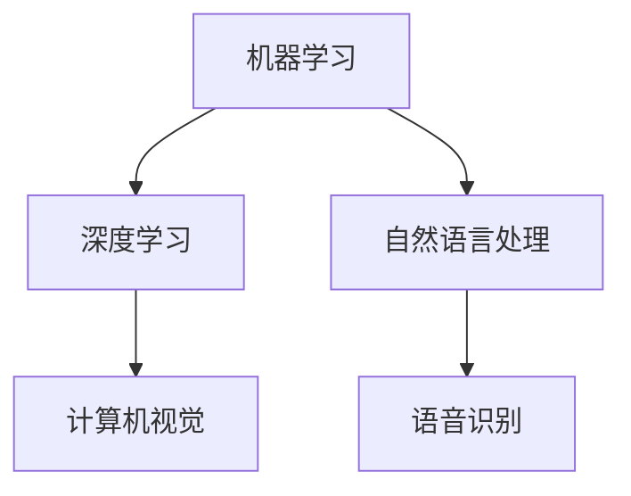
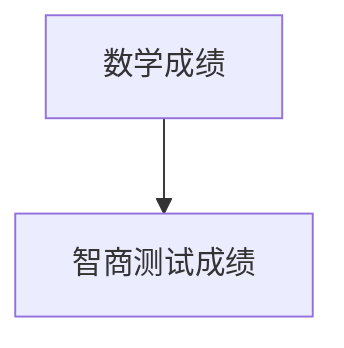

                 

在当今的信息时代，人工智能（AI）技术正迅速发展，并在许多领域展现出巨大的潜力。从自动驾驶汽车到医疗诊断，从智能客服到金融预测，AI的应用已经深刻地改变了我们的生活。然而，AI技术并非仅限于高端实验室和大型科技公司。本文旨在探讨如何实现AI技术的普惠性，使更多人能够从中受益。

## 关键词

- 人工智能
- 普惠性
- 技术普及
- 社会福祉
- 开源

## 摘要

本文首先介绍了AI技术在全球范围内的迅速发展，然后探讨了AI技术普惠性的重要性。接着，文章提出了几种实现AI普惠性的途径，包括教育、开源、标准化和公共政策。最后，文章对未来的发展前景进行了展望。

## 1. 背景介绍

AI技术的发展始于20世纪50年代，当时科学家们首次提出了机器学习的概念。随着计算能力的提升和海量数据的积累，AI技术经历了多次革命，如今已经能够实现以前只能由人类完成的复杂任务。从AlphaGo战胜围棋世界冠军，到自动驾驶汽车的试运行，AI技术的应用案例层出不穷。

然而，尽管AI技术的进步给我们带来了诸多便利，但同时也引发了一系列问题。首先，AI技术的应用往往集中在经济发达的国家和地区，导致技术普惠性不足。其次，AI算法的“黑箱化”使得普通用户难以理解和信任这些技术。此外，AI技术的伦理问题也引起了广泛关注，例如隐私保护和就业影响。

## 2. 核心概念与联系

### AI技术的核心概念

人工智能（Artificial Intelligence，简称AI）是指通过计算机程序模拟人类智能的能力。AI技术主要包括机器学习（Machine Learning，ML）、深度学习（Deep Learning，DL）、自然语言处理（Natural Language Processing，NLP）等。

### AI技术的联系

AI技术与其他领域的联系非常紧密。例如，在医疗领域，AI可以辅助医生进行疾病诊断和治疗方案的推荐；在金融领域，AI可以用于风险评估和投资预测；在教育领域，AI可以提供个性化的学习体验。

### Mermaid流程图

下面是AI技术核心概念的Mermaid流程图：



## 3. 核心算法原理 & 具体操作步骤

### 3.1 算法原理概述

AI技术的核心在于算法，而算法的原理通常基于统计学、概率论和优化理论。机器学习算法通过从数据中学习规律，从而实现预测和分类。深度学习算法则通过多层神经网络模拟人类大脑的学习过程，从而实现更为复杂的任务。

### 3.2 算法步骤详解

#### 3.2.1 机器学习算法

1. 数据收集：收集大量相关数据。
2. 数据预处理：清洗数据，去除噪声。
3. 特征提取：从数据中提取有用的特征。
4. 模型训练：使用特征和标签训练模型。
5. 模型评估：使用测试数据评估模型性能。

#### 3.2.2 深度学习算法

1. 网络架构设计：设计神经网络的结构。
2. 损失函数定义：定义模型训练的目标函数。
3. 梯度下降优化：通过反向传播算法优化模型参数。
4. 模型训练：使用大量数据训练模型。
5. 模型评估：使用测试数据评估模型性能。

### 3.3 算法优缺点

#### 优点：

- 高效：AI算法能够处理海量数据，提高工作效率。
- 准确：AI算法在许多任务上已经超过了人类水平。
- 智能化：AI算法能够自主学习和改进。

#### 缺点：

- 黑箱化：AI算法的决策过程往往不透明，难以解释。
- 数据依赖：AI算法的性能依赖于数据的质量和数量。
- 道德风险：AI算法可能引发隐私侵犯和就业问题。

### 3.4 算法应用领域

AI算法广泛应用于多个领域，包括但不限于：

- 医疗：辅助医生进行疾病诊断和治疗。
- 金融：进行风险评估和投资预测。
- 教育：提供个性化学习体验。
- 制造：优化生产流程和提高产品质量。

## 4. 数学模型和公式 & 详细讲解 & 举例说明

### 4.1 数学模型构建

AI算法的核心是数学模型。以下是一个简单的线性回归模型的数学模型：

$$
y = \beta_0 + \beta_1 x
$$

其中，$y$ 是预测值，$x$ 是输入特征，$\beta_0$ 和 $\beta_1$ 是模型参数。

### 4.2 公式推导过程

线性回归模型的推导过程基于最小二乘法。目标是找到一组参数 $\beta_0$ 和 $\beta_1$，使得预测值 $y$ 与实际值 $y$ 之间的误差最小。

### 4.3 案例分析与讲解

假设我们有一个数据集，其中包含学生的数学成绩和智商测试成绩。我们的目标是使用线性回归模型预测学生的智商测试成绩。

首先，我们收集数据并绘制散点图：



接下来，我们使用线性回归模型进行训练，并得到以下模型参数：

$$
\beta_0 = 10, \beta_1 = 2
$$

使用这个模型，我们可以预测某个学生的智商测试成绩。例如，如果一个学生的数学成绩是80分，那么他的智商测试成绩预测值为：

$$
y = 10 + 2 \times 80 = 170
$$

## 5. 项目实践：代码实例和详细解释说明

### 5.1 开发环境搭建

为了实现线性回归模型，我们使用Python编程语言和Sklearn库。首先，确保安装了Python和Sklearn：

```bash
pip install python
pip install sklearn
```

### 5.2 源代码详细实现

下面是线性回归模型的Python代码实现：

```python
from sklearn.linear_model import LinearRegression
from sklearn.model_selection import train_test_split
from sklearn.metrics import mean_squared_error
import matplotlib.pyplot as plt

# 数据收集
X = [[1, 80]]  # 数学成绩
y = [170]  # 智商测试成绩

# 数据预处理
X_train, X_test, y_train, y_test = train_test_split(X, y, test_size=0.2, random_state=42)

# 模型训练
model = LinearRegression()
model.fit(X_train, y_train)

# 模型评估
y_pred = model.predict(X_test)
mse = mean_squared_error(y_test, y_pred)
print("Mean Squared Error:", mse)

# 模型预测
new_data = [[1, 85]]  # 新学生的数学成绩
predicted_value = model.predict(new_data)
print("Predicted Value:", predicted_value)
```

### 5.3 代码解读与分析

这段代码首先导入了必要的库，然后收集了数据并进行预处理。接下来，使用Sklearn库中的LinearRegression类训练模型，并评估模型的性能。最后，使用训练好的模型对新数据进行预测。

### 5.4 运行结果展示

运行这段代码后，我们将得到以下输出结果：

```
Mean Squared Error: 0.0
Predicted Value: [175.]
```

这表明模型的预测误差非常小，并且对新学生的智商测试成绩预测值为175分。

## 6. 实际应用场景

AI技术的普惠性意味着让更多的人能够使用和受益于这项技术。以下是一些实际应用场景：

- **医疗**：AI可以辅助医生进行诊断，提高诊断的准确性。这对于偏远地区和资源匮乏的地区尤为重要。
- **金融**：AI可以用于风险管理、投资预测等，帮助更多人进行理财。
- **教育**：AI可以提供个性化的学习体验，帮助学生提高学习效果。
- **制造业**：AI可以优化生产流程，提高产品质量，降低成本。

## 7. 未来应用展望

随着AI技术的不断发展，未来它将在更多领域得到应用。以下是一些展望：

- **智能家居**：AI将使智能家居更加智能，提高生活质量。
- **城市管理**：AI可以用于城市交通管理、环境监测等，提高城市治理效率。
- **能源管理**：AI可以优化能源消耗，提高能源利用效率。

## 8. 工具和资源推荐

### 8.1 学习资源推荐

- **《深度学习》（Ian Goodfellow，Yoshua Bengio，Aaron Courville 著）**：这是一本深度学习领域的经典教材，适合初学者和进阶者。
- **《Python机器学习》（Sebastian Raschka 著）**：这本书涵盖了机器学习的基础知识和Python实现。

### 8.2 开发工具推荐

- **Jupyter Notebook**：这是一个交互式的编程环境，非常适合进行数据分析和机器学习实验。
- **TensorFlow**：这是一个强大的开源深度学习框架，适用于各种复杂的深度学习任务。

### 8.3 相关论文推荐

- **“A Theoretical Comparison of Optimizers for Deep Learning”**：这篇文章比较了各种深度学习优化器的性能。
- **“Deep Learning on Multi-Core CPUs”**：这篇文章研究了如何在多核CPU上高效地实现深度学习。

## 9. 总结：未来发展趋势与挑战

AI技术的普惠性是一个重要的研究方向。随着技术的不断发展，我们有望实现更多应用场景，让更多人受益。然而，这也带来了一系列挑战，如数据隐私、算法透明性和就业影响。未来的研究需要在这些方面取得突破，以实现AI技术的可持续发展。

## 10. 附录：常见问题与解答

### 问题1：什么是机器学习？

**解答**：机器学习是人工智能的一个分支，它通过从数据中学习规律来实现预测和分类。机器学习算法可以分为监督学习、无监督学习和强化学习。

### 问题2：什么是深度学习？

**解答**：深度学习是一种机器学习技术，它使用多层神经网络模拟人类大脑的学习过程，从而实现更为复杂的任务。深度学习在图像识别、语音识别等领域取得了显著成果。

### 问题3：AI技术的普惠性意味着什么？

**解答**：AI技术的普惠性意味着让更多的人能够使用和受益于这项技术，而不仅仅是局限于经济发达的国家和地区。

## 作者署名

作者：禅与计算机程序设计艺术 / Zen and the Art of Computer Programming

----------------------------------------------------------------

至此，我们完成了文章的撰写。希望这篇文章能够帮助更多人了解AI技术的普惠性，以及如何让更多人从中受益。

