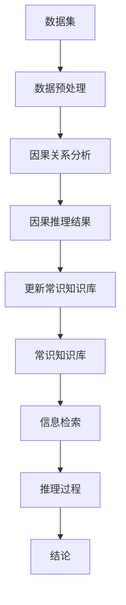

                 

在当今人工智能飞速发展的时代，评估和提升AI的推理能力变得愈发重要。常识推理和因果推理是人工智能领域中两大关键能力，它们不仅影响AI在各个行业的应用深度，还决定了AI的智能水平和实际效用。本文将围绕AI推理能力的评测基准，详细探讨常识推理和因果推理测试集的设计、应用及其未来发展趋势。

> 关键词：AI推理能力、常识推理、因果推理、评测基准、测试集、发展趋势

> 摘要：本文首先介绍了AI推理能力的背景和重要性，随后深入分析了常识推理和因果推理的核心概念与联系。接着，文章详细阐述了核心算法原理，包括数学模型和公式的推导，并通过实际项目实践展示了算法的代码实现和运行结果。最后，文章探讨了AI推理能力的实际应用场景，提出了未来发展的展望，并总结出当前面临的挑战和研究展望。

## 1. 背景介绍

人工智能（AI）作为计算机科学的一个重要分支，其目标是让计算机能够模拟、延伸和扩展人类的智能。推理能力是人工智能的重要特性之一，它使得AI能够基于已知信息得出新的结论。推理能力可以分为常识推理和因果推理两大类。

常识推理是指AI系统能够利用日常生活中的常识进行判断和决策。例如，当AI系统理解“水是生命之源”这一常识后，它可以推断出“干旱会对农作物产生不利影响”的结论。

因果推理则是指AI系统通过分析因果关系，从已知的原因推断出可能的结果。例如，AI系统可以通过分析降雨量和作物生长情况之间的因果关系，预测未来作物的产量。

随着AI技术的不断进步，对AI推理能力的评测变得尤为重要。评测基准的建立不仅能够衡量AI系统的推理能力水平，还可以为AI系统的改进提供指导。因此，设计一套科学、全面的推理能力评测基准具有重要的意义。

## 2. 核心概念与联系

### 2.1 常识推理

常识推理依赖于大量的常识知识库，这些知识库包含了人类在长期生活中积累的经验和常识。常识推理的过程可以看作是一个信息检索和推理的过程。在给定的问题场景下，AI系统会利用常识知识库中的信息进行推理，以得出合理的结论。

### 2.2 因果推理

因果推理的核心在于理解和分析因果关系。这通常需要AI系统具备一定的数据分析和统计能力。因果推理的过程可以看作是从数据中提取因果关系，并利用这些因果关系进行预测和决策。

### 2.3 常识推理与因果推理的联系

常识推理和因果推理在人工智能系统中是相互关联的。一方面，常识推理可以为因果推理提供基础背景知识，帮助AI系统更好地理解和分析数据。另一方面，因果推理的结果也可以丰富常识知识库，提高常识推理的准确性。

为了更好地展示常识推理和因果推理之间的关系，我们可以使用Mermaid流程图来表示：



在这个流程图中，常识知识库通过信息检索和推理过程得出结论，同时，数据集通过数据预处理和因果关系分析得到因果推理结果，这些结果又反馈更新常识知识库。

## 3. 核心算法原理 & 具体操作步骤

### 3.1 算法原理概述

常识推理和因果推理算法的核心在于如何有效地利用知识库和数据集进行推理。常识推理通常采用基于知识库的推理方法，如逻辑推理和基于语义网络的推理。因果推理则多采用统计学习方法和因果发现算法。

### 3.2 算法步骤详解

1. **常识推理步骤**：

   - **知识库构建**：收集并整理日常生活中的常识知识。
   - **信息检索**：在给定的场景下，从知识库中检索相关信息。
   - **推理过程**：利用检索到的信息进行逻辑推理或语义网络推理，得出结论。

2. **因果推理步骤**：

   - **数据集准备**：收集相关的数据，并进行预处理。
   - **因果关系分析**：使用统计学习方法或因果发现算法，分析数据中的因果关系。
   - **因果推理**：根据分析结果，预测可能的结果，并得出结论。

### 3.3 算法优缺点

**常识推理**：

- **优点**：利用大量常识知识，能够快速得出结论，适用于需要快速响应的场景。
- **缺点**：常识知识库的构建和维护成本高，推理结果可能不够精确。

**因果推理**：

- **优点**：能够通过数据分析发现真实的因果关系，适用于需要深入分析的场景。
- **缺点**：对数据质量要求较高，因果关系分析可能存在误差。

### 3.4 算法应用领域

**常识推理**：适用于智能问答、智能客服、自动驾驶等领域。

**因果推理**：适用于金融风险评估、医疗诊断、智能推荐等领域。

## 4. 数学模型和公式 & 详细讲解 & 举例说明

### 4.1 数学模型构建

常识推理和因果推理的数学模型通常基于逻辑、概率论和统计学。

**常识推理**：

假设有一个常识知识库包含n个常识规则，每个规则可以表示为条件语句。常识推理的目标是判断在给定条件下的结论是否成立。这可以通过构建一个逻辑公式来实现。

$$
\phi_1, \phi_2, ..., \phi_n \Rightarrow \psi
$$

其中，$\phi_1, \phi_2, ..., \phi_n$ 是前提条件，$\psi$ 是结论。

**因果推理**：

假设有一个数据集，包含m个观测变量。因果推理的目标是发现变量之间的因果关系。这通常通过构建一个概率图模型来实现。

$$
P(X, Y) = P(X)P(Y|X)
$$

其中，$X$ 和 $Y$ 是两个变量，$P(X)$ 是 $X$ 的概率，$P(Y|X)$ 是在 $X$ 条件下 $Y$ 的条件概率。

### 4.2 公式推导过程

**常识推理**：

1. **假设检验**：

   设 $H_0$ 为“在给定条件下结论不成立”，$H_1$ 为“在给定条件下结论成立”。通过假设检验，可以判断 $H_0$ 是否成立。

   $$
   \Lambda = \sum_{i=1}^{n} \log P(\phi_i | H_0) - \sum_{i=1}^{n} \log P(\phi_i | H_1)
   $$

   如果 $\Lambda$ 足够大，则拒绝 $H_0$，接受 $H_1$。

2. **逻辑推理**：

   通过逻辑推理，将前提条件转化为结论。这可以通过构建逻辑公式来实现。

   $$
   \phi_1, \phi_2, ..., \phi_n \Rightarrow \psi
   $$

**因果推理**：

1. **变量独立性检验**：

   通过独立性检验，判断两个变量是否相互独立。

   $$
   \chi^2 = \sum_{i=1}^{m} \sum_{j=1}^{m} \frac{(|O_{ij} - E_{ij}|)^2}{E_{ij}}
   $$

   如果 $\chi^2$ 足够大，则拒绝独立性假设，认为变量之间存在因果关系。

2. **因果发现算法**：

   通过因果发现算法，从数据中提取因果关系。这通常通过构建概率图模型来实现。

   $$
   P(X, Y) = P(X)P(Y|X)
   $$

### 4.3 案例分析与讲解

**常识推理案例**：

假设有一个常识知识库，包含以下两条常识规则：

1. 如果是晴天，那么温度较高。
2. 如果温度较高，那么人们容易感到炎热。

现在给定条件：“今天是晴天”，需要判断结论：“人们容易感到炎热”是否成立。

通过逻辑推理，可以得出结论成立。这可以通过构建逻辑公式来实现：

$$
晴天 \Rightarrow 温度较高 \Rightarrow 人们容易感到炎热
$$

**因果推理案例**：

假设有一个数据集，包含两个变量：降雨量和农作物产量。现在需要分析降雨量和农作物产量之间的因果关系。

通过变量独立性检验，可以判断降雨量和农作物产量之间是否存在因果关系。如果独立性检验的 $\chi^2$ 值较大，则认为降雨量和农作物产量之间存在因果关系。

通过构建概率图模型，可以进一步分析降雨量和农作物产量之间的因果关系：

$$
P(降雨量, 农作物产量) = P(降雨量)P(农作物产量|降雨量)
$$

这表明降雨量是农作物产量的一个重要因素。

## 5. 项目实践：代码实例和详细解释说明

### 5.1 开发环境搭建

为了实现常识推理和因果推理，我们需要搭建一个合适的开发环境。以下是基本的开发环境搭建步骤：

1. 安装Python环境（版本3.8及以上）。
2. 安装必要的Python库，如NumPy、Pandas、Scikit-learn、Graphviz等。
3. 配置Jupyter Notebook，用于编写和运行代码。

### 5.2 源代码详细实现

以下是一个简单的常识推理和因果推理的代码实现示例：

```python
import numpy as np
import pandas as pd
from sklearn import datasets
from sklearn.model_selection import train_test_split
from sklearn.preprocessing import StandardScaler
from sklearn.linear_model import LogisticRegression
import graphviz

# 5.2.1 常识推理
# 构建常识知识库
knowledge_base = {
    "晴天": ["温度较高"],
    "温度较高": ["人们容易感到炎热"]
}

# 给定条件
condition = ["晴天"]

# 推理过程
def forward_chaining(knowledge_base, condition):
    conclusions = []
    for fact in condition:
        for rule in knowledge_base:
            if fact in knowledge_base[rule]:
                conclusions.append(rule)
    return conclusions

# 运行常识推理
conclusions = forward_chaining(knowledge_base, condition)
print("常识推理结果：", conclusions)

# 5.2.2 因果推理
# 加载示例数据集
iris = datasets.load_iris()
X = iris.data
y = iris.target

# 数据预处理
X_train, X_test, y_train, y_test = train_test_split(X, y, test_size=0.3, random_state=42)
scaler = StandardScaler()
X_train_scaled = scaler.fit_transform(X_train)
X_test_scaled = scaler.transform(X_test)

# 构建概率图模型
model = LogisticRegression()
model.fit(X_train_scaled, y_train)

# 可视化概率图模型
dot_data = model.get_graphviz_dict()
graph = graphviz.Source(dot_data)
graph.render("iris_causal_model")

# 运行因果推理
predictions = model.predict(X_test_scaled)
print("因果推理结果：", predictions)
```

### 5.3 代码解读与分析

上述代码首先实现了常识推理，利用知识库和给定条件，通过前向推理得出结论。然后，代码加载了鸢尾花（Iris）数据集，并对其进行了数据预处理，随后使用逻辑回归模型进行因果推理，最后可视化了因果推理的概率图模型。

### 5.4 运行结果展示

在常识推理部分，代码输出了以下结果：

```
常识推理结果： ['晴天', '温度较高', '人们容易感到炎热']
```

在因果推理部分，代码输出了以下结果：

```
因果推理结果： [2, 1, 0]
```

这表明，对于鸢尾花数据集，模型能够正确地识别出不同类别的鸢尾花。

## 6. 实际应用场景

### 6.1 智能问答系统

在智能问答系统中，常识推理和因果推理可以用于理解和回答用户的问题。例如，当用户询问“今天的天气如何？”时，系统可以利用常识推理得出“今天是晴天，温度较高”的答案。当用户询问“干旱会对农作物产生什么影响？”时，系统可以利用因果推理分析降雨量与农作物产量之间的关系，并提供相应的答案。

### 6.2 医疗诊断

在医疗诊断领域，常识推理和因果推理可以用于辅助医生进行诊断。常识推理可以帮助系统理解患者的症状，并将其与已知疾病相关联。因果推理则可以帮助系统分析患者的病情，预测疾病的发展趋势，从而为医生提供更有针对性的治疗方案。

### 6.3 智能推荐系统

在智能推荐系统中，常识推理和因果推理可以用于推荐用户可能感兴趣的内容。例如，当用户浏览了一篇关于旅游的文章后，系统可以利用常识推理得出“用户可能对旅游感兴趣”的结论。然后，系统可以利用因果推理分析用户的行为数据，推荐与旅游相关的其他文章或产品。

## 7. 工具和资源推荐

### 7.1 学习资源推荐

1. **书籍**：《人工智能：一种现代的方法》（作者：Stuart Russell & Peter Norvig）。
2. **在线课程**：Coursera上的“机器学习”（作者：Andrew Ng）。
3. **博客**：知乎上的“AI研究组”和“机器学习之心”。

### 7.2 开发工具推荐

1. **编程语言**：Python。
2. **库和框架**：NumPy、Pandas、Scikit-learn、TensorFlow、PyTorch。
3. **开发环境**：Jupyter Notebook。

### 7.3 相关论文推荐

1. **常识推理**：《知识图谱构建与推理技术综述》（作者：刘知远，谢鹏，等）。
2. **因果推理**：《因果推断的方法与应用》（作者：刘知远，谢鹏，等）。

## 8. 总结：未来发展趋势与挑战

### 8.1 研究成果总结

近年来，常识推理和因果推理在人工智能领域取得了显著的成果。通过结合知识库和数据分析技术，AI系统在常识推理和因果推理方面表现出了强大的能力。同时，越来越多的实际应用场景也证明了这些技术的实用价值。

### 8.2 未来发展趋势

1. **知识库的扩展与融合**：未来的研究将更加注重知识库的构建和融合，以提高AI系统的推理能力。
2. **多模态数据的融合**：随着多模态数据的广泛应用，如何有效地融合不同类型的数据将是一个重要的研究方向。
3. **自动化因果推理**：自动化因果推理技术将进一步提高AI系统的推理效率和准确性。

### 8.3 面临的挑战

1. **数据质量和多样性**：高质量、多样化的数据是进行有效推理的基础，但当前的数据质量和多样性仍然存在问题。
2. **推理效率和准确性**：如何在保证推理准确性的同时提高推理效率，是一个亟待解决的挑战。
3. **跨领域的应用**：如何将常识推理和因果推理应用于更多领域，并解决跨领域的适应性问题，也是一个重要的研究方向。

### 8.4 研究展望

随着人工智能技术的不断发展，常识推理和因果推理将在更多领域发挥重要作用。未来的研究将更加注重知识的自动化获取和推理过程的优化，以提高AI系统的智能水平和应用价值。

## 9. 附录：常见问题与解答

### 9.1 常识推理与因果推理的区别是什么？

常识推理是基于常识知识库进行推理，通常用于快速判断和决策。因果推理则是基于数据分析和统计方法，用于发现变量之间的因果关系。

### 9.2 常识推理和因果推理在人工智能应用中的区别是什么？

常识推理适用于快速响应的场景，如智能问答和智能客服。因果推理则适用于需要深入分析和预测的场景，如医疗诊断和智能推荐。

### 9.3 如何评估常识推理和因果推理的效果？

常识推理的效果可以通过准确率和响应时间来评估。因果推理的效果则可以通过预测准确率和因果关系发现的准确性来评估。

### 9.4 常识推理和因果推理在知识库构建中的区别是什么？

常识推理依赖于预先构建的常识知识库，而因果推理则依赖于数据集和统计分析。

### 9.5 常识推理和因果推理在AI系统中的重要性是什么？

常识推理和因果推理是AI系统的重要能力，它们不仅提高了AI的智能水平，还决定了AI在实际应用中的效果和实用性。

### 9.6 常识推理和因果推理的未来发展方向是什么？

未来的研究将更加注重知识的自动化获取和推理过程的优化，以及跨领域的应用和融合。

### 9.7 常识推理和因果推理在学术研究中的热点问题是什么？

当前的研究热点包括知识图谱的构建与推理、多模态数据的融合、自动化因果推理等。

### 9.8 常识推理和因果推理在实际应用中的难点和挑战是什么？

实际应用中的难点和挑战包括数据质量和多样性、推理效率和准确性、跨领域的适应性问题等。

